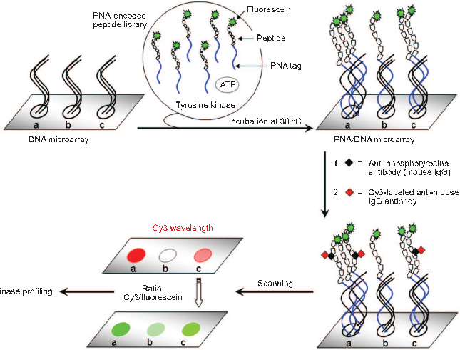
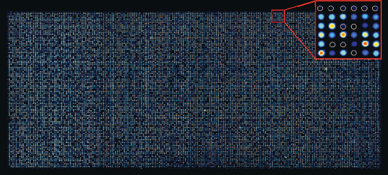
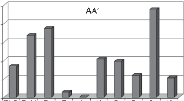
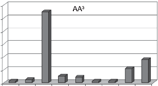
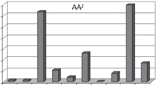
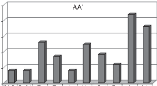

# ARTICLE

#### A 10,000 Member PNA-Encoded Peptide Library for Profiling Tyrosine Kinases

Delphine Pouchain, Juan J. Díaz-Mochón, Laurent Bialy, and Mark Bradley*

See https://pubs.acs.org/sharingguidelines for options on how to legitimately share published articles.

EaStCHEM, School of Chemistry, University of Edinburgh, Joseph Black Building, West Mains Road, Edinburgh EH9 3JJ, U.K.

810 ACS CHEMICAL BIOLOGY • VOL.2 NO.12 www.acschemicalbiology.org Downloaded via UNIV DE GRANADA on March 4, 2024 at 14:42:05 (UTC).

### M

ore than 500 kinases have been identified within the human genome, with some 90 believed to be protein tyrosine kinases, al-

ABSTRACT A 10,000 member peptide nucleic acid (PNA) encoded peptide library was prepared, treated with the Abelson tyrosine kinase (Abl), and decoded using a DNA microarray and a fluorescently labeled secondary antiphosphotyrosine antibody. A dual-color approach ensured internal referencing for each and every member of the library and the generation of robust data sets. Analysis identified 155 peptides (out of 10,000) that were strongly phosphorylated by Abl in full agreement with known Abl specificities. BLAST analysis identified known cellular Abl substrates such as c-Jun amino-terminal kinase as well as new potential target proteins such as the G-protein coupled receptor kinase 6 and diacylglycerol kinase gamma. To illustrate the generalization of this approach, two other tyrosine kinases, human epidermal growth factor 2 (Her2) and vascular endothelial growth factor receptor 2/kinase insert domain protein receptor (VEGFR2/KDR), were profiled allowing characterization of specific peptide sequences known to interact with these kinases; under these conditions Her2 was demonstrated to have a marked preference for D-proline perhaps offering a unique means of targeting and inhibiting this kinase.

though to date only a small proportion of them have beenfullycharacterized(1,2).Theuniquenessofanykinase arises from its ability to phosphorylate hydroxy residuesinahighlyselectiveandspecificmanner,aprocess by which kinases can exert exquisite and selective control over many cellular processes. Their dysfunction can be catastrophic and lead to a variety of disease states such as cancer, cardiovascular disease, inflammation, and diabetes (3). For instance, the breakpoint cluster region (Bcr)-Abl fusion protein has been associated with chronic myelogenous leukemia (4, 5). Many small-molecule kinase inhibitors such as Fasudil for Rho-dependentkinase(6),Sirolimusformammaliantarget of rapamycin (7), Imatinib for Bcr-Abl (8), and Gefitinib for epidermal growth factor receptor (9) have thus emerged, but there is still a huge demand for the development of approaches that would help in the design of new kinase inhibitors (10).

A necessity in the area of kinase analysis is the ability to determine and understand the exact substrate specificity of any kinase, and over the past decade several kinases profiling methods have been developed. Forexamplein1995asolutionpeptidelibrary(prepared by split and mix methods) was used to determine the substrate specificity of nine tyrosine kinases by trapping phosphorylated peptide mixtures onto a ferric chelating column and subsequent Edman sequencing, giving a consensus peptide sequence for each kinase (11). A positional scanning peptide library tagged with biotin at the C-terminus, containing nine positions surrounding a central serine/threonine residue, was used to profile eight serine/threonine protein kinases, with the peptide mixtures treated in parallel with -[32P]-ATP and a specific kinase before being immobilized onto avidin-

*Corresponding author, mark.bradley@ed.ac.uk.

Received for review September 22, 2007. Published online December 21, 2007 10.1021/cb700199k CCC: $37.00

© 2007 American Chemical Society

coated membranes allowing quantification by phosphorimaging (12). Another example was the use of mRNA-protein and peptide fusion libraries that were designed to have a tyrosine residue surrounded by five random amino acids to interrogate the v-abl tyrosine kinase. These libraries were designed to have one tyrosine residue surrounded by five random amino acids. Following modification of the libraries by v-abl, phosphorylatedresidueswereisolatedviaroundsof immunoprecipitation with the phosphotyrosine-specific 4G10antibody.Finally, amplification by PCR of the mRNA allowed DNA microarray identification (13). Direct bead-based assays have also allowed the identification of the substrate specificity of two protein tyrosine kinases, p60c-src and zeta-chainassociated protein kinase 70 (ZAP-70) (14). In this case, phosphorylated peptides (on beads) were identified using an antiphosphotyrosine antibody with subsequent ladder-based analysis (15) by matrix-assisted laser desorption/ionization time-of-flight mass spectrometry (MALDI-TOF MS). Another bead-based platform has recently been used to study kinase phosphorylation, via parallel peptide synthesis and subsequent encoding, with detection through chemical phosphate activation and dye coupling. Surprisingly, dyes were then detected using antibodies, presumably due to the low level of labeling (16). Several microarray-based methods have also been developed. Thus, self-assembled monolayers of alkanethiolates displaying peptides on gold surfaces combined with MALDI-TOF MS have been used to study kinases, although only seven peptides were studied (17). Microarrays of 710 peptides, generated by SPOT synthesis (18), with subsequent oxime attachment to a glass slide and phosphorylation in the presence of radioactive ATP allowed “phosphorimaging” and analysis of kinase specificity (19).

Phosphorylation site

O

H N

Fluorescein PEG spacer Phe Gln AA4 AA3 Tyr AA2 AA1 Ile Lys PEG spacer 10,000 member library

NH2

(CH2)4

NH AAG (PNA triplet)4 (PNA triplet)3 (PNA triplet)2 (PNA triplet)1 CC

PNA tag

O

OH O

O

PEG spacer Fluorescein

N H

O

O N H

O

O

O O OH

###### Figure 1. General structure of the 10,000 member PNA-encoded library, where AA1, AA2, and AA4 are [Ile, Val, Phe, Pro, Arg, Glu, Lys, D-Pro, Ser, D-Val] and AA3 is [Ile, Val, Ala, Pro, Arg, Glu, Lys, D-Ala, Ser, Pro].

croarrays, fluorescently labeled secondary antibodies andPNA-splitandmixencoding(20–23)(thebasicconcept of nucleic acid encoding goes back to the early days of combinatorial chemistry (24)). This was achieved by the split and mix synthesis of a 10,000 member PNA-encoded library containing the peptide sequence -Phe-Gln-AA4-AA3-Tyr-AA2-AA1-Ile-Lys- (Figure 1), with the expected phosphorylation site surrounded by four variable positions (AA1, AA2, AA3, and AA4), each containing 10 different amino acids. The library contained both natural and unnatural amino acids with differing properties (hydrophobic, hydrophilic, neutral, basic, and acidic); Tyr was not included in the randomized positions to avoid multiple phosphorylation sites. Each aminoacidwasencodedbyaspecificPNAtriplettogive an encoding PNA tag composed of 12 PNA monomers (Supplementary Table 1). The orthogonality and robustness of the PNA and peptide split and mix chemistry have been reported previously (25–27). In this case, four bases were used, but isothermal sequences can be generated by the use of three bases (20, 28). The PNA tag was also supplemented with two common PNA sequences at the C-terminus (CC) and three at the N-terminus(AAG)tohelpcontroltheselectivityofhybridization and reduce mismatches (29). Two PEG spacers were also added between the peptide arm and the PNA oligomer to distance the peptide away from the PNA strand, and finally, every peptide was labeled with 5(6)carboxyfluorescein in order to allow internal control of each and every library member (20, 21).

RESULTS AND DISCUSSION

Library Design and Synthesis. Herein is described an approach that allows the screening and analysis of 10,000 kinase substrates in a single experiment, with analysis of ALL 10,000 members of the library on a oneby-one basis via the combined application of DNA mi-

Fluorescein

PNA-encoded peptide library

Peptide

PNA tag ATP

Tyrosine kinase

Incubation at 30 °C

DNA microarray

PNA/DNA microarray

formation). Since every peptide was also labeled with fluorescein, the resulting ratio of Cy3/Fluorescein provided an internal control for each and every member of the library, which is crucial due to natural variations in melting temperatures, concentrations, and differences in hybridization efficiency between the 10,000 different library members. The use of just Cy3 fluorescence for example would mean it would be impossible to distinguish between high-efficiency phosphorylation of a PNA peptide conjugate that hybridizes poorly and low efficiency kinase modification with a higher concentration. Comparing the Cy3/Fluorescein ratio of every feature

- 1. = Anti-phosphotyrosine antibody (mouse IgG)
- 2. = Cy3-labeled anti-mouse IgG antibody

Cy3 wavelength

Scanning Ratio

Kinase profiling

Cy3/fluorescein

PNA/DNA microarray

Fluorescein wavelength

###### Scheme 1. Schematic representation of the hybridization of a PNA-encoded library incubated with the protein tyrosine kinase Abl and ATP onto a DNA microarray followed by identification of the “hits” using an antiphosphotyrosine antibody and a secondary Cy3-labeled antibodya aUsing ratios of Cy3/Fluorescein, the kinase Abl can be accurately profiled.

allows relative quantification of the fluorescence independently of any other factors and Abl can be accurately profiled, with the highest ratio of Cy3/Fluorescein corresponding to the peptide best recognized by Abl (Scheme 1).

Abl Kinase Assay. Following solid-phase synthesis, the library was incubated with the kinase Abl (the Abelson nonreceptor tyrosine kinase that is involved in the regulation of cell proliferation, transcription, and apoptosis (30)) and ATP allowing phosphorylation of any peptides recognized by Abl, with subsequent pull down (hybridization) of the 10,000 member PNAencoded library onto the DNA microarray. The arrays usedcontained22,575featureswith10,000oligonucleotide sequences complementary to the PNA sequences (each in duplicate) and 2575 control DNA sequences that were designed to be noncomplementary to any of the PNA tags in the library. In this approach, all 10,000 peptides are in essence “delivered” to a specific address on the array by virtue of their specific and unique tag (zip or postcode) via antiparallel PNA/DNA duplex formation (Scheme 1) (20, 21).

Data Analysis. An Excel macro allowed every DNA sequencetobecorrelatedtoitsPNAtagandhenceitspeptide, which in combination with BlueFuse (BlueGnome) allowed extensive mining and manipulation. Analysis of the images obtained after scanning the chip using a fluoresceinfiltershowedatotalabsenceoffluorescence on the 2575 control sequences, confirming highly selective hybridization (Figure 2). Since fluorescein was used as a label for each library member, analysis of the array using the fluorescein channel confirmed that all library members had been synthesized and hybridized onto the DNA microarray. In order to quantify the level of phosphorylation, a second channel (Cy3) was used (Scheme 1). Although similarities with gene expression profiling exist, the analysis used here differed in many respects due to the fact that the majority of the features in the Cy3 channel had little if any signal (most peptides were nonphosphorylated). In order to gain valuabledata,onlyfeatures(specificpeptides)withaCy3intensity twice that of the background were considered (giving some 703 initial hits). These data were then verified by identification of all duplicates from within these 703 single signals (duplicates of each DNA oligomer existed scattered across the array) removing those with a standarddeviationhigherthan0.25(comparingnormalized ratios of Cy3/Fluorescein intensities for each fea-

General Detection Method for Phosphorylated Peptides on Microarrays. At this stage the DNA array was converted into a peptide array containing some phosphorylated peptides that were subsequently detected using a primary/secondary antibody approach. Therefore, an antiphosphotyrosine antibody (mouse IgG) was added on the array followed by addition of a Cy3-labeled secondary antibody (antimouse IgG) (31). Any phosphorylated peptides (“hits”), localized onto its defined DNA, were readily identified by scanning the DNA microarray using a Cy3 filter (control experiments were carried out to prove the selectivity of the detection method using peptide microarrays, see Supporting In-

ture with values ranging from 0 to 1). In doing so, 155 peptides (“310 duplicative hits”) gave data for Abl, with veryhighconfidence(seeSupportingInformationfordetails). The same analysis approach was used for the two other kinases (see Supplementary Figure 2 for Abl profilesandSupplementaryFigure3fortheimageofthe chip obtained using a Cy3 filter).

Specificity of Abl. Broad specificity for the amino acids in positions AA4 and AA1 was found whereas a high selectivity was clearly observed for the amino acids around the phosphorylation site (Tyr) in the AA3 and

- AA2 positions. Glu seems to play a crucial role in Abl phosphorylation since it was the most frequent amino acidfoundineachrandomizedposition,confirmingthat this protein tyrosine kinase accepts acidic residues around the phosphorylation site (Asp was not chosen as a building block in the library synthesis due to its similarity to Glu) (11, 14). Glu (85 “hits” out of 155, 55%) was clearly the most accepted amino acid in the
- AA3 position. Thus, an acidic, negatively charged amino acid on the amino side of tyrosine seems to be important for efficient phosphorylation by Abl.Smaller proportions of Val (18%) and Ser (11%) were also observed. In the AA2 position, Abl displayed a preference for polar amino acids such as Ser (35%) and acidic residues such as Glu (32%). In the AA4 and AA1 positions, Abl

Figure 2. Image of a 10,000 member PNA-encoded kinase library hybridized onto a 22,575 member custom DNA microarray, following incubation with Abl, obtained using a fluorescein filter. Every fluorescent spot represents a unique peptide, whose sequence is known via its PNA tag and location on the array. Empty white circles (insert) correspond to DNAs that were designed to be noncomplementary to any of the PNA tags in the library and were printed as controls of the hybridization process. Note the variation in fluorescence intensity which highlights differences in hybridization and synthesis efficiency that have to be controlled using relative ratios of fluorescence rather than absolute values.

was observed to be less specific and accepted a broad range of amino acids such as Ser (24%), Glu (19%), D-Val (17%) in the AA4 position and Ser (22%), Val (18%), Glu (13%) in the AA1 position (Figure 3). When these results were compared with the sequences of known Abl kinase substrates, marked similarities were displayed (Table 1).

25 AA4 AA3

60

50 40 30 20

20

Percentage

Percentage

15

10

5

10

0

0

(D)-P (D)-V E F I K P R S V Amino acid (AA4)

(D)-A E I K P R S V Amino acid (AA3)

A

25

35 30

AA2 AA1

20

25 20 15 10

Percentage

Percentage

15

10

5

5 0

0

(D)-P (D)-V E F I K P R S V Amino acid (AA1)

(D)-P (D)-V E F I K P R S V Amino acid (AA2)

###### Figure 3. Bar graphs for Abl showing the proportion of amino acids at the four randomized positions (AA4, AA3, AA2, and AA1) in the 155 “hits”.

##### TABLE 1. Comparison between the sequences of known Abl substrates and the most frequent aminoacids obtained from the library screening (32)a

Substrate Swiss-Prot Position Sequence

SHP1 PTN6_HUMAN (MOUSE) Y536 SEYGN SHP1 PTN6_HUMAN (MOUSE) Y564 DVYEN (EVYEN) Mdm2 MDM2_HUMAN (MOUSE) Y394 (Y393) EDYSQ (DDYSQ) p62dok DOK1_MOUSE Y314 SVYSD p62dok DOK1_MOUSE Y397 EGYEL Myogenic factor 3 MYOD1_MOUSE Y30 DFYDD Myogenic factor 3 MYOD1_MOUSE Y212 MDYSG

aThe known tyrosine phosphorylation site is indicated and bold letters represent amino acids that were common to our study (one-letter amino acid codes are used).

Screening Additional Kinases. To further demonstrate the validity of the method, two additional kinases (Her2 and VEGFR2/KDR) were screened using the same 10,000 member PNA-encoded peptide library, giving two new profiles (Supplementary Figures 4 and 5). Her2 has been found to be amplified in more than 25%ofhumanprimarybreastcancers(39)andVEGFR2/ KDR plays crucial roles in angiogenesis and vasculogenesis (40). Surprisingly, Her2 showed a remarkable preference for the unnatural amino acid D-Pro at the C-terminus site of the phosphorylation site. Thus, looking at the 299 “hits”, in the AA1 position, D-Pro was the most accepted amino acid (34%) along with Ser (28%). This was also observed in the AA2 position, where D-Pro (22%), Ser (20%), and D-Val (17%) were the most common amino acids. Moreover, in the top 15 peptides (Supplementary Table 3), 10 peptides in the AA1 position and 7 in the AA2 position contained D-Pro, with the sequence D-Pro/D-Pro (AA2/AA1) represented five times. These results were particularly interesting since even thoughL-ProwaspresentinpositionsAA1 andAA2,Her2 had a clear preference for D-Pro. The marked preference for this unnatural amino acid was unexpected and would not be observed in other library screens. However, it is already known that protein kinase C can phosphorylate both D- and L-amino acids (41). Her2 was less specific for the amino acids in positions AA4 and AA3, but a small preference for Lys (18%), Glu (14%), and Ser (14%) in the AA4 position and Ser (23%), Lys

Specificity of the Top Peptide Sequences for Abl. The data from the 155 “hits” could also be analyzed to determine the best substrates accepted by Abl, and the sequences of the top 10 peptides are listed in Table 2. The motif SEY appeared 5 times (out of 10), revealing this to be an important factor in Abl specificity. Moreover, among the 155 “hits”, 21 peptides contained the SEY motif and 14 were found in the top 40 peptide sequences (Supplementary Table 2). The Abl optimal substrate predicted by Songyang (11) contains the motif I/VYXXP, where X represents any amino acid. Although Pro is replaced by Ile in our library (Figure 1), 8 peptides contained Ile (5%, Figure 3) in the AA3 position and they were among those giving the highest ratios of Cy3/ Fluorescein (Supplementary Figure 2). Thus in the top 10 peptide sequences, Ile appeared three times in the AA3 position (Table 2).

Interacting Partners for Abl. A BLAST search using the Swiss-Prot database was performed with the top 25 peptide sequences identified (32, 33). The results were observed to be in agreement with known Abl signaling pathways and proteins implicated in leukemia (30, 34 36). Thus, the second best peptide sequence (SEYES) was the well-known Abl substrate, c-Jun aminoterminal kinase (Table 3) (34). Although the role of Abl with G protein coupled receptor kinases and diacylglycerol kinase is not fully understood, our data reveal that Abl may interact with these proteins (37, 38).

##### TABLE 2. Sequences of the top 10 peptides, recognized by Abl, with the highest ratios of Cy3/Fluo-resceina

Peptide sequence Ratio Cy3/Fluorescein Peptide sequence Ratio Cy3/Fluorescein

- 1) SEYEV 4.50 6) SIYEP 3.44
- 2) SEYES 4.45 7) SIYSP 3.32
- 3) SEYSF 4.16 8) PEYSE 3.29
- 4) SEYVF 4.03 9) SEYEE 3.27
- 5) VIYES 3.62 10) VEYES 3.26 aThe one letter amino acid code is used.

##### TABLE 3. Predicted proteins for Abl identified by running a BLAST search using peptide sequencesfrom the 25 top peptides and the Swiss-Prot database (only proteins with the highest scores wereselected)

|Protein name|Swiss-Prot|Identified sequence|
|---|---|---|
|G-protein coupled receptor kinase|GRK6_MOUSE|SEYEV|
|c-Jun N terminal kinase|JIP2_MOUSE|SEYES|
|Diacylglycerol kinase gamma|DGKG_MOUSE|SEYSS|
|G-protein coupled receptor kinase|GRK5_MOUSE|EVYSS|
|C C chemokine receptor|CCR6_MOUSE|RVYSE|
|Epidermal growth factor receptor substrate|EP15_MOUSE|PVYEK|

(17%), and D-Ala (16%) in the AA3 position could be noticed (Supplementary Figure 4). Unlike the two other kinases, VEGFR2/KDR was less specific and accepted a broad range of amino acids, giving a much greater number of “hits” (829 “hits”) (Supplementary Figure 5). A slight preference for polar amino acids (both acidic and basic) immediately adjacent to the phosphorylation site (positions AA3 and AA2) could be observed: Glu (AA3/ AA2, 20%/16%), Lys (AA3/AA2, 17%/16%), and Ser (AA3/AA2, 17%/14%) were the most commonly observed amino acids. In the AA4 and AA1 positions, Lys (15%) and D-Pro (18%), respectively, were the most common amino acids.

that are known to interact with Her2 or present in breast cancer could be identified (42–44). For VEGFR2/KDR, the results were also in agreement with known signaling proteins (45–47).

CONCLUSION The high-throughput screening of 10,000 tyrosine kinase Abl substrates in a single experiment has been demonstrated via the detection of tyrosine-phosphorylated peptides (“hits”) using a nonradioactive, selective and sensitive method based on a primary antiphosphotyrosine antibody and a fluorescently labeled secondary antibody. The use of PNA-encoded libraries simplified the deconvolution process while using minimal amounts of kinase (60 pmol), library (5 nmol), and antibodies (0.4 g per antibody). ALL 10,000 members of the library were analyzed, allowing a unique insight into the substrate requirements of Abl; however it is a general method as there is no need to have any previous knowledge about an opti-

Interacting Partners for Her2 and VEGFR2/KDR. A BLAST search using the Swiss-Prot database was performed with the top 25 peptide sequences of Her2 and VEGFR2/KDR (Table 4, Supplementary Tables 3 and 4). Although only six peptide sequences (within the top 25) contained natural amino acids for Her2, proteins

##### TABLE 4. Predicted protein targets for Her2 and VEGFR2/KDR identified by running a BLAST searchusing peptide sequences from the 25 top peptides identified from the microarray and the Swiss-Prot database (only proteins with the highest scores were selected)a

Tyrosine kinase Protein name (sequence) Swiss-Prot Identified sequence

Her2 Breast tumor-amplified kinase (YQETYKRI) STK6_HUMAN FQEIYKRI Her2 G protein coupled receptor 158 (EIYKRKK) GP158_ HUMAN EIYKRIK Her2 Ephrin receptor EPHA7 (FQTRYPS) EPHA7_ HUMAN FQSRYPS VEGFR2/KDR Leptin receptor isoform 1 (FQIRY) LEPR_HUMAN FQIRY VEGFR2/KDR Protein kinase C, theta (IVYRD) KPCT_ HUMAN IVYRE VEGFR2/KDR Endothelial differentiation G protein coupled receptor 6 (IIYSF) EDG6_ HUMAN IIYSF

aBold letters for the identified peptide sequence represent amino acids that are common to the predicted protein.

be identified. Finally, unlike other methods (14) that give large number of “hits” without relative quantification, the approach described here offers the advantage of not only detecting phosphorylated peptides but also quantifying the extent of phosphorylation. The approach was used to profile and identify specific proteins for two other tyrosine kinases, Her2 and VEGFR2/KDR, showing itsgenerality,whileadaptations(16)willallowserineand threonine kinases to be analyzed allowing rapid and efficient substrate deorphaning.

mal kinase substrate. The dual color approach (ratio of Cy3/Fluorescein) was essential to allow accurate profiling and gave a set of peptides that were phosphorylated in agreement with known Abl interacting partners, while new target proteins were quickly and simply identified by analysis of the top peptide sequences and BLAST searching. Moreover, it is known that Abl accepts a wide range of substrates and one of the advantages of our method is that optimal peptides for Abl, rather than consensus sequences, can

METHODS

and NEM (5 equiv) in DMF (0.1 M). Before cleavage, the library was treated with 20% piperidine in DMF (5 10 min) (50). Final cleavage from the resin was carried out using TFA/TIS/DCM (90/5/5) for 1 h. The crude compound was precipitated from cold diethyl ether, sonicated for 5 min, and centrifuged for 5 min at 4000 rpm. The supernatant was then discarded, and the process was repeated four times to give rise to a yellow solid.

Materials. Fmoc amino acids were purchased from GL Bio-

chem except Fmoc-Tyr(HPO3Bzl)-OH and Fmoc-Ser(HPO3Bzl)-OH which were from LC Sciences. CodeLink activated slides were

obtained from Amersham Biosciences. ATP and monoclonal antiphosphotyrosine clone PY-20 were from Sigma, Cy3-goat antimouse IgG (H L) conjugate (ZyMax grade) was from Invitrogen. Abl, mouse recombinant (Escherichia coli) was from New England Biolabs, Her2 (human, recombinant, N-terminal GST tag) and VEGFR2/KDR (human, recombinant, N-terminal GST tag) were purchased from BPS Bioscience.

Solution-Phase Kinase Assay. The 10,000 member PNAencoded library was incubated, in solution, at a final concentration of 50 M and final volume of 100 L, in a buffer containing 60 units of the selected kinase (Abl, Her2, or VEGFR2/KDR), 5 mM ATP, kinase reaction buffer (for Abl 1x, 50 mM Tris-HCl (pH 7.5 at 25 °C), 10 mM MgCl2, 1 mM EGTA, 2 mM DTT, 0.01% Brij 35; or for Her2 and VEGFR2/KDR, 50 mM HEPES, pH 7.4,

Library Synthesis. The PNA-encoded peptide library (see Figure 1 for general structure of the library and Supplementary Table 1 for PNA code) was synthesized according to published procedures (25, 26). It was carried out on PEGA resin with a Rink linker where Fmoc-PEG spacer-Lys(Dde)-OH [PEG spacer NH(CH2)3-O-(CH2)2-O-(CH2)2-O-(CH2)3-NH-CO-(CH2)2-CO] was attached as the core unit presenting two different orthogonal protecting groups (Fmoc 20% piperidine in DMF and Dde hydroxylamine, pH 5.0). This orthogonality allowed elongation of either the peptide or PNA arm at will through selective Fmoc and Dde chemistries.

3 mM MgCl2, 3 mM MnCl2, 1 mM DTT, 3 M Na-orthovanadate) and 0.1% BSA for 24 h at 30 °C. Before hybridization, 1 volume of this buffer was diluted with 1 volume of GenHyb buffer (Genetix). Solutions were denatured by heating at 65 °C for 3 min; 100 L of the solution was then poured onto a 22,500 customized DNA chip from Oxford Gene Technology (Oxford), which was covered with a glass cover slide and kept in a hybridization chamber (Genomic Solutions) at 60 °C. Temperature was then slowly lowered to 37 °C over a period of 21 h. Finally, the chips were washed twice (20 mL) for 10 min at 30 °C in the following buffer (100 mM Nacl, 10 mM citric acid, 0.7% (w/v) N-lauroylsarcosine sodium salt, 0.1 mM EGTA, pH 7.5), rinsed with distilled water (20 mL), and spin-dried by centrifugation (1000 rpm for 10 min) (20).

Thus, Fmoc-Rink-amide linker was attached to PEGA resin following stepwise couplings with Fmoc-Lys(Dde)-OH (48), FmocPEG spacer-OH (49), Fmoc-Lys(Boc)-OH, and Fmoc-Ile-OH. Then,

the Dde group was removed (NH2OH.HCl/imidazole in NMP/ DCM, 1 h) and two cytosine PNA monomers were coupled to

the resin. The synthesis was then carried out as follows: (1) Split into 10 different pools. (2) Dde deprotection. (3) Dde/Mmt PNA monomer coupling: Dde-PNA(Mmt)-OH (5.5 equiv) and PyBOP (5 equiv) were dissolved in DMF (0.1 M) followed by addition of NEM (11 equiv). The resulting solution was mixed for 10 s before being added to the resin preswollen in DMF, and the mixture was shaken for 3 h. Repeat (2) and (3) twice. (4) Fmoc deprotection (20% piperidine in DMF, two cycles of 10 min).

Antibody Assay on the 22,500 Customized DNA Chip. To avoid any unspecific binding, the slides were blocked with a prewarmed buffer containing TPBS (0.05% Tween-20/PBS, pH 7.4)/1% BSA (20 mL) for 1 h at 30 °C. After being washed in PBS (20 mL) for 5 min at 30 °C, slides, that were covered with a glass cover-slide and kept in a hybridization chamber (Genomic Solutions), were probed with the primary antibody, monoclonal antiphosphotyrosine clone PY-20 (mouse IgG2b isotype), diluted 1/500 (0.4 g) in an antibody buffer containing TPBS/1% BSA (final volume of 200 L) for 1 h at 30 °C. After the slides were washed with the antibody buffer (2 20 mL) for 10 min at 30 °C, a labeled secondary antibody, Cy3-goat antimouse IgG (H L), diluted 1/500 (0.2 g) in the antibody buffer (final volume of 200 L) was added and slides were incubated in the dark for 1 h at 30 °C. Slides were then washed in the antibody buffer (2 20 mL for 10 min at 30 °C) and rinsed with Tris buffer (20 mL) at 25 °C before being spin-dried by centrifugation (1000 rpm for 10 min) (31).

- (5) Fmoc amino acids couplings: Fmoc-AA-OH (5.5 equiv), PyBOP (5 equiv), and HOBt (5.5 equiv) were dissolved in DMF (0.08 M) followed by addition of DIPEA (16 equiv). The resulting solution was mixed for 10 s before being added to the resin, and the mixture was shaken for 3 h. (6) The 10 resin pools were mixed.

(7) The resin was split again into 10 pools; repeat steps (2) to

- (6). After encoding two positions and before splitting, FmocTyr(tBu)-OH was coupled to the resin. Then the synthesis continued (steps (1) (7)). At the end of the encoding process, FmocGln(Trt)-OH, Fmoc-Phe-OH, and Fmoc-PEG spacer-OH were respectively coupled followed by coupling of guanine, adenine, and adenine PNA-protected monomers at the PNA arm as previously described. Finally, the library was labeled using 5(6)carboxyfluorescein (Fluorescein) (5.5 equiv), PyBOP (5 equiv),

Acknowledgment: This work was supported by the EPSRC/ BBSRC and the Combinatorial Center of Excellence (CCE).

- 18. Frank, R. (1992) Spot-synthesis an easy technique for the positionally addressable, parallel chemical synthesis on a membrane support, Tetrahedron 48, 9217–9232.
- 19. Schutkowski, M., Reimer, U., Panse, S., Dong, L., Lizcano, J. M., Alessi, D. R., and Schneider-Mergener, J. (2004) High-content peptide microarrays for deciphering kinase specificity and biology, Angew. Chem., Int. Ed. 43, 2671–2674.
- 20. Diaz-Mochon, J. J., Bialy, L., Keinicke, L., and Bradley, M. (2005) Combinatorial libraries - from solution to 2D microarrays, Chem. Commun. 11, 1384–1386.
- 21. Diaz-Mochon, J. J., Bialy, L., and Bradley, M. (2006) Dual colour, microarray-based, analysis of 10 000 protease substrates, Chem. Commun. 38, 3984–3986.
- 22. Winssinger, N., Harris, J. L., Backes, B. J., and Schultz, P. G. (2001) From split-pool libraries to spatially addressable microarrays and its application to functional proteomic profiling, Angew. Chem., Int. Ed. 40, 3152–3155.
- 23. Winssinger, N., Damoiseaux, R., Tully, D. C., Geierstanger, B. H., Burdick,K.,andHarris,J.L.(2004)PNA-encodedproteasesubstratemicroarrays, Chem. Biol. 11, 1351–1360.
- 24. Brenner,S.,andLerner,R.A.(1992)Encodedcombinatorialchemistry, Proc. Natl. Acad. Sci. U.S.A. 89, 5381–5383.
- 25. Bialy, L., Diaz-Mochon, J. J., Specker, E., Keinicke, L., and Bradley, M. (2005) Dde-protected PNA monomers, orthogonal to Fmoc, for the synthesis of PNA-peptide conjugates, Tetrahedron 61, 8295– 8305.
- 26. Diaz-Mochon, J. J., Bialy, L., and Bradley, M. (2004) Full orthogonality between Dde and Fmoc: the direct synthesis of PNA-peptide conjugates, Org. Lett. 6, 1127–1129.
- 27. Diaz-Mochon, J. J., Bialy, L., Watson, J., Sanchez-Martin, R. M., and Bradley, M. (2005) Synthesis and cellular uptake of cell delivering PNA-peptide conjugates, Chem. Commun. 26, 3316–3318.
- 28. Brenner, S., Williams, S. R., Vermaas, E. H., Storck, T., Moon, K., McCollum, C., Mao, J.-I, Luo, S., Kirchner, J. J., Eletr, S., DuBridge, R. B., Burcham, T., and Albrecht, G. (2000) In vitro cloning of complex mixtures of DNA on microbeads: physical separation of differentially expressed cDNAs, Proc. Natl. Acad. Sci. U.S.A. 97, 1665–1670.
- 29. Weiler, J., Gausepohl, H., Hauser, N., Jensen, O. N., and Hoheisel, J. D. (1997) Hybridisation based DNA screening on peptide nucleic acid (PNA) oligomer arrays, Nucleic Acids Res. 25, 2792–2799.
- 30. Pendergast, A. M. (2002) The Abl family kinases: mechanisms of regulation and signaling, Adv. Cancer Res. 85, 51–100.
- 31. Horiuchi, K. Y., Wang, Y., Diamond, S. L., and Ma, H. (2006) Microarrays for the functional analysis of the chemical-kinase interactome, J. Biomol. Screen. 11, 48–56.
- 32. Boeckmann, B., Bairoch, A., Apweiler, R., Blatter, M.-C., Estreicher, A., Gasteiger, E., Martin, M. J., Michoud, K., O’Donovan, C., Phan, I., Pilbout, S., and Schneider, M. (2003) The SWISS-PROT protein knowledgebase and its supplement TrEMBL in 2003, Nucleic Acids Res. 31, 365–370.
- 33. Altschul, S. F., Madden, T. L., Schäffer, A. A., Zhang, J., Zhang, Z., Miller, W., and Lipman, D. J. (1997) Gapped BLAST and PSI-BLAST: a new generation of protein database search programs, Nucleic Acids Res. 25, 3389–3402.
- 34. Yoshida, K., Yamaguchi, T., Natsume, T., Kufe, D., and Miki, Y.

(2005) JNK phosphorylation of 14–3-3 proteins regulates nuclear targeting of c-Abl in the apoptotic response to DNA damage, Nat. Cell Biol. 7, 278–285.

- 35. Dürig, J., Schmücker, U., and Dührsen, U. (2001) Differential expression of chemokine receptors in B cell malignancies, Leukemia 15, 752–756.
- 36. Tanos, B., and Pendergast, A. M. (2006) Abl tyrosine kinase regulates endocytosis of the epidermal growth factor receptor, J. Biol. Chem. 281, 32714–32723.

Supporting Information Available: This material is free of charge via the Internet.

###### REFERENCES

- 1. Manning, G., Whyte, D. B., Martinez, R., Hunter, T., and Sudarsanam, S. (2002) The protein kinase complement of the human genome, Science 298, 1912–1934.
- 2. Blume-Jensen, P., and Hunter, T. (2001) Oncogenic kinase signalling, Nature 411, 355–365.
- 3. Cohen, P. (2002) Protein kinases-the major drug targets of the twenty-first century? Nat. Rev. Drug Discovery 1, 309–315.
- 4. Rowley, J. D. (1990) The philadelphia chromosome translocation a paradigm for understanding leukemia, Cancer 65, 2178–2184.
- 5. Till, J. H., Chan, P. M., and Miller, W. T. (1999) Engineering the substrate specificity of the Abl tyrosine kinase, J. Biol. Chem. 274, 4995–5003.
- 6. Asano, T., Ikegaki, I., Satoh, S.-I., Seto, M., and Sasaki, Y. (1998) A protein kinase inhibitor, Fasudil (AT-877): a novel approach to signal transduction therapy, Cardiovasc. Drug Rev. 16, 76–87.
- 7. Sehgal, S. N. (1998) Rapamune (RAPA, rapamycin, sirolimus): mechanism of action immunosuppressive effect results from blockade of signal transduction and inhibition of cell cycle progression, Clin. Biochem. 31, 335–340.
- 8. Druker,B.J.,Tamura,S.,Buchdunger,E.,Ohno,S.,Segal,G.M.,Fanning, S., Zimmermann, J., and Lydon, N. B. (1996) Effects of a selective inhibitor of the Abl tyrosine kinase on the growth of Bcr-Abl positive cells, Nat. Med. 2, 561–566.
- 9. Barker, A. J., Gibson, K. H., Grundy, W., Godfrey, A. A., Barlow, J. J., Healy, M. P., Woodburn, J. R., Ashton, S. E., Curry, B. J., Scarlett, L., Henthorn, L., and Richards, L. (2001) Studies leading to the identification of ZD1839 (Iressa): an orally active, selective epidermal growth factor receptor tyrosine kinase inhibitor targeted to the treatment of cancer, Bioorg. Med. Chem. Lett. 11, 1911–1914.
- 10. Noble, M. E. M., Endicott, J. A., and Johnson, L. N. (2004) Protein kinase inhibitors: insights into drug design from structure, Science 303, 1800–1805.
- 11. Songyang, Z., Carraway III, K. L., Eck, M. J., Harrison, S. C., Feldman, R. A., Mohammadi, M., Schlessinger, J., Hubbard, S. R., Smith, D. P., Eng, C., Lorenzo, M. J., Ponder, B. A. J., Mayer, B. J., and Cantley, L. C. (1995) Catalytic specificity of protein-tyrosine kinases is critical for selective signalling, Nature 373, 536–539.
- 12. Hutti, J. E., Jarrell, E. T., Chang, J. D., Abbott, D. W., Storz, P., Toker, A.,Cantley,L.C.,andTurk,B.E.(2004)Arapidmethodfordetermining protein kinase phosphorylation specificity, Nat. Methods 1, 27–29.
- 13. Cujec,T.P.,Medeiros,P.F.,Hammond,P.,Rise,C.,andKreider,B.L.

(2002) Selection of v-Abl tyrosine kinase substrate sequences from randomized peptide and cellular proteomic libraries using mRNA display, Chem. Biol. 9, 253–264.

- 14. Kim, Y.-G., Shin, D.-S., Kim, E.-M., Park, H.-Y., Lee, C.-S., Kim, J.-H., Lee, B.-S., Lee, Y.-S., and Kim, B.-G. (2007) High-throughput identification of substrate specificity for protein kinase by using an improved one-bead-one-compound library approach, Angew. Chem., Int. Ed. 46, 5408–5411.
- 15. Pastor, J. J., Lingard, I., Bhalay, G., and Bradley, M. (2003) Ionextraction ladder sequencing from bead-based libraries, J. Comb. Chem. 5, 85–90.
- 16. Shults, M. D., Kozlov, I. A., Nelson, N., Kermani, B. G., Melnyk, P. C., Shevchenko, V., Srinivasan, A., Musmacker, J., Hachmann, J. P., Barker, D. L., Lebl, M., and Zhao, C. (2007) A multiplexed protein kinase assay, ChemBioChem 8, 933–942.
- 17. Min, D.-H., Su, J., and Mrksich, M. (2004) Profiling kinase activities by using a peptide chip and mass spectrometry, Angew. Chem., Int. Ed. 43, 5973–5977.

- 37. Ushio-Fukai, M., Zuo, L., Ikeda, S., Tojo, T., Patrushev, N. A., and Alexander, R. W. (2005) cAbl tyrosine kinase mediates reactive oxygenspecies-andcaveolin-dependentAT1receptorsignalinginvascular smooth muscle: role in vascular hypertrophy, Circ. Res. 97, 829–836.
- 38. Yamada, K., Sakane, F., Imai, S.-I., Tsushima, S., Murakami, T., and Kanoh, H. (2003) Regulatory role of diacylglycerol kinase in macrophage differentiation of leukemia cells, Biochem. Biophys. Res. Commun. 305, 101–107.
- 39. Hayes, D. F., Thor, A. D., Dressler, L. G., Weaver, D., Edgerton, S., Cowan, D., Broadwater, G., Goldstein, L. J., Martino, S., Ingle, J. N., Henderson, I. C., Norton, L., Winer, E. P., Hudis, C. A., Ellis, M. J., and Berry, D. A. (2007) Her2 and response to paclitaxel in nodepositive breast cancer, N. Engl. J. Med. 357, 1496–1506.
- 40. Olsson,A.-K,Dimberg,A.,Kreuger,J.,andClaesson-Welsh,L.(2006) VEGF receptor signalling-in control of vascular function, Nat. Rev. Mol. Cell Biol. 7, 359–371.
- 41. Eller, M., Jarv, J., Toomik, R., Ragnarsson, U., Ekman, P., and Engstrom, L. (1993) Substrate specificity of protein kinase C studied with peptides containing D-amino acid residues, J. Biochem. 114, 177–180.
- 42. Sen, S., Zhou, H., and White, R. A. (1997) A putative serine/ threonine kinase encoding gene BTAK on chromosome 20q13 is amplified and overexpressed in human breast cancer cell lines, Oncogene 14, 2195–2200.
- 43. Negro, A., Brar, B K, Gu, Y., Peterson, K. L., Vale, W., and, and Lee, K.-F (2006) ErbB2 is required for G protein-coupled receptor signaling in the Heart, Proc. Natl. Acad. Sci. U.S.A. 103, 15889–15893.
- 44. Fox, B. P., and Kandpal, R. P. (2004) Invasiveness of breast carcinoma cells and transcript profile: Eph receptors and ephrin ligands asmolecularmarkersofpotentialdiagnosticandprognosticapplication, Biochem. Biophys. Res. Commun. 318, 882–892.
- 45. Gonzalez, R. R., Cherfils, S., Escobar, M., Yoo, J. H., Carino, C., Styer, A.K.,Sullivan,B.T.,Sakamoto,H.,Olawaiye,A.,Serikawa,T.,Lynch, M. P., and Rueda, B. R. (2006) Leptin signaling promotes the growth of mammary tumors and increases the expression of vascular endothelial growth factor (VEGF) and its receptor type two (VEGF-R2), J. Biol. Chem. 281, 26320–26328.
- 46. Singh, A. J., Meyer, R. D., Band, H., and Rahimi, N. (2005) The carboxyl terminus of VEGFR-2 is required for PKC-mediated downregulation, Mol. Biol. Cell 16, 2106–2118.
- 47. Endo, A., Nagashima, K.-I., Kurose, H., Mochizuki, S., Matsuda, M., and Mochizuki, N. (2002) Sphingosine 1-phosphate induces membrane ruffling and increases motility of human umbilical vein endothelial cells via vascular endothelial growth factor receptor and CrkII, J. Biol. Chem. 277, 23747–23754.
- 48. Chhabra,S.R.,Hothi,B.,Evans,D.J.,White,P.D.,Bycroft,B.W.,and Chan, W. C. (1998) An appraisal of new variants of Dde amine protecting group for solid phase peptide synthesis, Tetrahedron Lett. 39, 1603–1606.
- 49. Zhao, Z. G., Im, J. S., Lam, K. S., and Lake, D. F. (1999) Site-specific modification of a single-chain antibody using a novel glyoxylylbased labeling reagent, Bioconjugate Chem. 10, 424–430.
- 50. Fischer, R., Mader, O., Jung, G., and Brock, R. (2003) Extending the applicability of carboxyfluorescein in solid-phase synthesis, Bioconjugate Chem. 14, 653–660.

