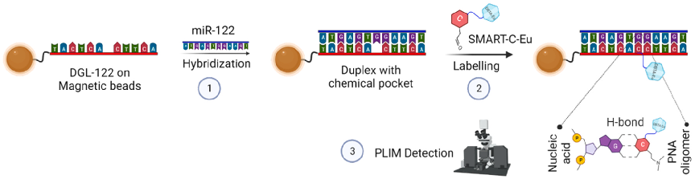
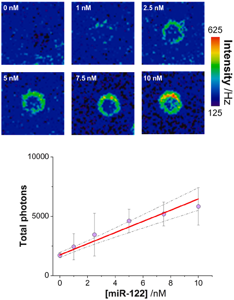
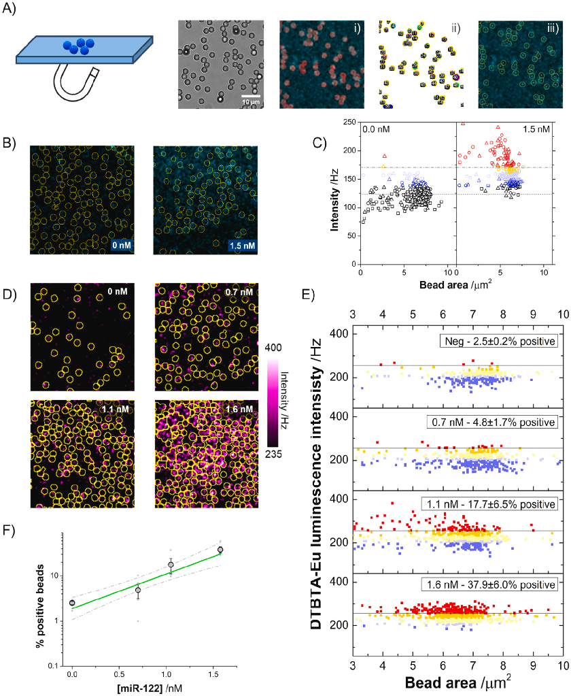
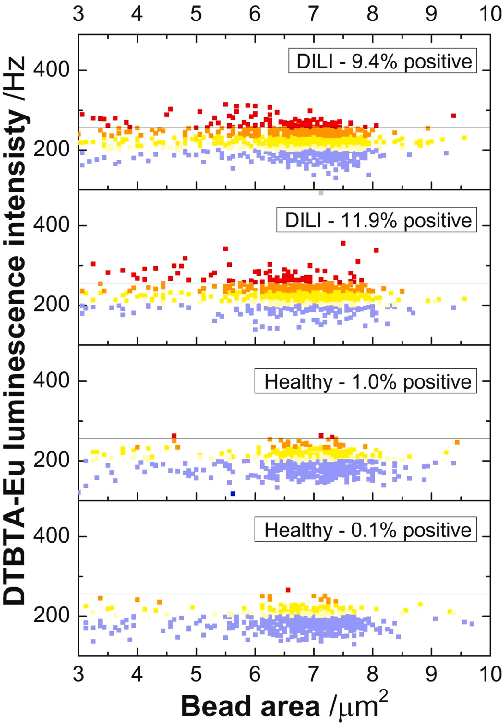
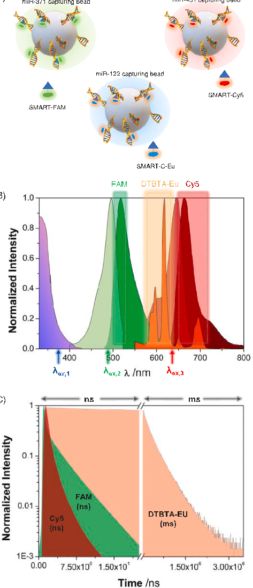
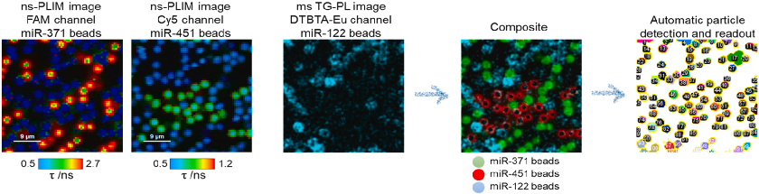
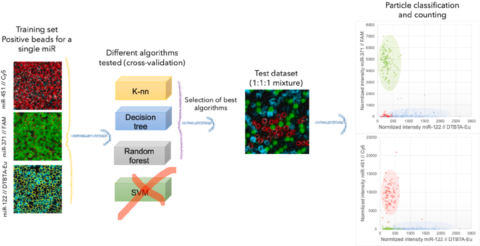
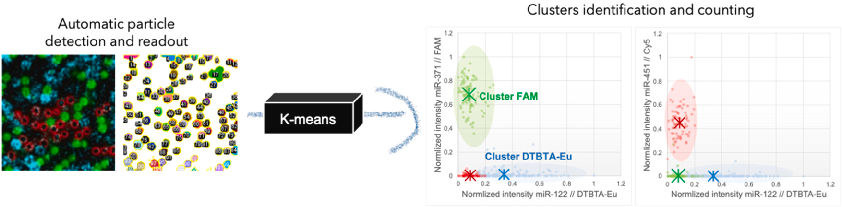

Sensors & Actuators: B. Chemical 417 (2024) 136136

Contents lists available at ScienceDirect 

Sensors and Actuators: B. Chemical 

journal homepage: www.elsevier.com/locate/snb 

Multiplexed MicroRNA biomarker detection by bridging lifetime filtering  imaging and dynamic chemical labeling 

Maria Padial-Jaudenesa,1,2, Mavys Tabraue-Chavez´ b,1, Simone Detassisc, Maria J. Ruedas-  Ramaa, M. Carmen Gonzalez-Garciaa,3, Mario Antonio Fara b, F. Javier Lopez-Delgado´ b,  Juan A. Gonzalez-Vera´ a, Juan J. Guardia-Monteagudob, Juan J. Diaz-Mochond,e,f,  Emilio Garcia-Fernandeza, Salvatore Pernagallob,*, Angel Ortea,* 

a Nanoscopy-UGR Laboratory. Departamento de Fisicoquímica. Unidad de Excelencia de Química Aplicada a Biomedicina y Medioambiente, Facultad de Farmacia,  Universidad de Granada, Campus Cartuja, Granada 18071, Spain  b DESTINA Genomica S.L. Parque Tecnologico Ciencias de la Salud (PTS), Avenida de la Innovaci´ on 1, Edificio BIC, 18016, Granada, Spain ´ c OPTOI Srl, Via Vienna 8, Trento, 38121, Italy  d NanoChemBio Group. Departamento de Química Farmac´eutica y Organica, Unidad de Excelencia de Química Aplicada a Biomedicina y Medioambiente, Facultad de ´ Farmacia, Universidad de Granada. Campus Cartuja, Granada 18071, Spain  e GENYO Centre for Genomics and Oncological Research, Pfizer/University of Granada/Andalusian Regional Government. PTS Granada, Avenida de la Ilustraci´on, 114,  Granada 18016, Spain  f Instituto de Investigaci´on Biosanitaria ibs.GRANADA, Granada, Spain   

A R T I C L E  I N F O    

Keywords:  MicroRNAs (miRs)  Biomarker detection  Dynamic chemical labeling  Luminescence imaging  Machine learning algorithms 

A B S T R A C T    

MicroRNAs (miRs) have emerged as promising biomarkers for early disease diagnosis and personalized treatment  monitoring. However, their clinical utility has been hampered by technical limitations. Dynamic chemical labeling (DCL) based on capturing abasic PNA probes and reactive nucleobases, known as SMART bases, is a PCR-  free approach that has proven very useful for the direct interrogation of circulating miRs. In this work, we expand  the palette of tools available for the detection of DCL miR by synthesizing a new SMART nucleobase called  SMART-C-Eu. This nucleobase contains a stable lanthanide cryptate. Using this SMART-C-Eu base and time-gated  (TG) luminescence imaging, we successfully detect and quantify miR-122–5p in human serum samples. miR-  122–5p is a well-known biomarker for drug-induced liver injury. Through a bead-counting analysis approach,  statistical robustness is improved and miR-122–5p concentrations are detected in the nanomolar range.  Furthermore, we extend this approach to multiplexed detection of three different miRs (miR-371a-3p, miR-451a-  5p, and miR-122–5p) using spectral and temporal filtering. Importantly, we designed a user-independent multiplexed analysis using machine learning algorithms for automatic bead classification. Although the sensitivity of  this technique must be further improved to detect miRs at lower concentrations, the method represents a significant advancement in miR analysis by combining ML segmentation using lifetime and intensity images. In  addition, the technique offers multiplexing capabilities and the potential for automation, paving the way for  more accurate and robust clinical applications in the future.   

1. Introduction 

Over the past decade, exceptional attention has been placed on the  search for new biomarkers in liquid biopsies to achieve early diagnosis 

and personalized monitoring of treatments. Among the biomarkers  discovered in a variety of challenging diseases, microRNAs (miRs) have  been particularly highlighted. miRs play pivotal regulatory roles in gene  expression,  encompassing  gene  suppression  and  posttranscriptional 

* Corresponding authors. 

E-mail addresses: salvatore@destinagenomics.com (S. Pernagallo), angelort@ugr.es (A. Orte).    1  These authors contributed equally.   2  Present address: Department of Nutrition and Sustainable Animal Production, Estacion Experimental del Zaidín, Consejo Superior de Investigaciones Científicas, ´

San Miguel 101, Armilla, E-18100 Granada, Spain   3  Present address: Madrid Institute for Advanced Studies in Nanoscience (IMDEA Nanociencia), C/ Faraday 9, 28049 Madrid, Spain 

https://doi.org/10.1016/j.snb.2024.136136  Received 1 March 2024; Received in revised form 17 May 2024; Accepted 11 June 2024   

Available online 14 June 2024 0925-4005/© 2024 The Author(s). Published by Elsevier B.V. This is an open access article under the CC BY license (http://creativecommons.org/licenses/by/4.0/).

M. Padial-Jaudenes et al.                                                                                                                                                                                                                     

regulation [1,2]. The deregulation of circulating miR expression levels  in body fluids has been associated with various conditions, such as  different types of cancer [3–5], neurodegenerative disorders [6–8], and  liver  injuries  [9].  For  instance,  in  several  studies,  miR-122–5p  (miR-122) has been identified as a potential biomarker for drug-induced  liver injury (DILI) [10,11]. The distinctive expression patterns of serum  or plasma miRs can serve as disease fingerprints, acting as diagnostic or  prognostic biomarkers for various diseases [1,12]. miRs exhibit several  characteristics of an ideal biomarker, as it shows specificity to the  condition or pathology of interest, reliably indicates a disease before  clinical  symptoms  appear  (early  detection),  exhibits  sensitivity  to  changes in pathology (monitoring disease progression or therapeutic  response), and is easy to obtain from biological fluids [13]. 

Despite the significant potential of miRs as biomarkers, their use in  clinical diagnostics has been constrained by the available analytical  methods for their detection. Current methods present technical challenges for direct (extraction and amplification-free), accurate and robust  detection and quantification of the usually low miR levels  [4,14].  Regarding the latter, the standard techniques for miR analysis involve  RNA extraction and are PCR-based [12], which show important limitations in terms of reproducibility, inability of quantifying isomiR and  potential for translation to clinical diagnostics [14,15]. Other broadly  used methods involve Northern blotting, microarrays or NGS [12,16,  17].  Therefore,  highly  sensitive,  extraction-  and  amplification-free  detection techniques are urgently needed for the analysis of miRs in  clinical samples, as well as precise data analysis methods [16,18,19]. In  this context, luminescence-based platforms and hybridization-based  methodologies stand out as significant approaches within the field. 

Dynamic chemical labeling (DCL) is a  well-validated, PCR-free  method for directly detecting miR direct with single-base resolution [5,  20–28]. The method involves using abasic peptide nucleic acid (PNA)  sequences, also known as DGL probes, that are complementary to the  target nucleic acid and labeled with reactive nucleobases, SMART bases  (SBs)  [20,26,29].  The  dynamic  covalent  chemical  reaction  occurs  exclusively after fully complementary nucleic acid strands hybridize  with DGL probes. The reaction occurs solely between the secondary  amine of the DGL probe, which is located at the abasic position, and the  reactive aldehyde group of the labeled SB (Scheme 1). This thermodynamically controlled reaction produces labeled DGL probe-miR duplexes  that can be detected using various platforms  [5,21–27,30]. A distinguishing characteristic of this technique is its ability to achieve a  resolution of one base, which is not commonly found in the current  published literature [31] and enables robust detection of single nucleotide variations (SNVs) [24–26]. 

Recently, we broadened and upgraded our detection platform portfolio through applying a time-gated (TG) luminescence imaging methodology by tagging luminophores with a long fluorescence lifetime [32].  This technique is particularly powerful when applied to complex samples, such as biological media and liquid biopsies; in these scenarios,  undesired interference luminescence, such as scattered light, autofluorescence and impurities, can be reduced using the TG-filtered imaging approach [33]. This methodology has been applied to the study of 

miRs. For example, Hildebrandt et al. proposed a multiplexing technique  using luminescence energy transfer (FRET) to analyze multiple miRs.  The  technique  uses  different  FRET  pairs  and  controls  the  energy  donor-acceptor distance  [34–37]. In their works, the luminescence  lifetimes were in the nanosecond range due to the combination of  quantum dots and organic fluorophores. A noteworthy group of luminophores for TG involves organometallic cryptates or inorganic nanoparticles with lanthanide ions that exhibit photoluminescence (PL) [33].  The emission of lanthanide ions typically has remarkably lengthy lifetimes, reaching even the millisecond time range for ions such as Eu(III)  or Tb(III); this effect is primarily due to the emission originating from  forbidden transitions [38], after an antenna-driven energy transfer [39].  By using biotin-europium-tagged streptavidin [40] or lanthanide-doped  nanoparticles [41,42], researchers have recently developed miR sensors  based on the PL emission of lanthanide ions. 

Given the rising interest in lanthanide-based TG imaging [43], in this  study, we merged DCL and TG imaging filtering approaches to identify  multiple circulating miRs using a lanthanide-cryptate SB. This new  method significantly broadens the spectrum of time windows available  for the TG imaging analysis of various miRs. As a result, multiplexing  capabilities are promoted and miR fingerprint patterns are generated for  more reliable and precise clinical applications. 

2. Material and methods 

To expand the methods available for miR detection and quantification to PL lifetime imaging (PLIM) using the DCL methodology, a new  SMART nucleobase was synthesized (SMART-C-Eu,  Figure S1  in the  Supplementary Materials, SM[72]), including the lanthanide cryptate  DTBTA-Eu  –{2,2’,2’’,2’’’-{4’-{[(4,6-dichloro1,3,5-triazin-2-yl)amino]  biphenyl-4-yl}-2,2’:6’,2’’-terpyridine6,6’’-diyl}bis(methylenenitrilo)}  tetrakis(acetato)} europium (III)– as a very stable lanthanide luminophore [44]. The SMART-C-Eu base (Figure S1) was synthesized, purified  to over 95% purity, and characterized by DESTINA Genomica SL  (Spain) following the synthetic route described elsewhere  [20]. The  PNA-based DGL probes were also synthesized, purified, and characterized  as  described  elsewhere  [24,26],  achieving  over  90%  purity.  RP-HPLC is used to purify and characterise both SBs and DGL probes,  and HRMS (ES+) and MALDI-TOF were used as mass spectroscopy  techniques to characterize SBs and DGL probes, respectively. Table S1 in  the SM shows the sequences of the DGL probes. The DGL probes were  coupled with superparamagnetic beads with a diameter of 2.8  μm,  presenting carboxylic acid groups (Dynabeads M-270, Thermo Fisher  Scientific). The coupling protocol was previously optimized by our  group [5,22], and is based on the coupling reaction of the beads carboxylic acids with the DGL probes using activation with 1-ethyl-3-(3-dimethylaminopropyl)carbodiimide (EDC). A solution containing the DGL  capture probe and an amino-terminated diluent DNA sequence was  added to the activated beads. The mixture was incubated, washed, and  the probe coupling was measured using UV, resulting in ~600,000  probes/bead, and ensuring lot-to-lot reproducibility. Finally, the beads  were stored in a solution of 10% PEG10K and 0.1% Tween-20 in PBS 

Scheme 1. Capturing and labeling target miR-122 with the SMART-C-Eu nucleobase for detection using PLIM.  

M. Padial-Jaudenes et al.                                                                                                                                                                                                                     

buffer. SBs and beads containing DGL probes were provided by DESTINA  Genomica SL (Spain). 

DCL  was  performed  as  previously  described  [5,20–28,30,32].  Briefly,  5×105  Dynabeads  M-270  carboxylic  acid  (Thermo  Fisher)  coupled with DGL-miR122 probes were incubated for 1h with 25 μL of  proprietary lysis buffer and either 10 μL of commercial human serum  (Sigma Merck) with synthetic DNA oligo miR-122 spike-ins (to prepare  the calibration curve) or 10 μL of serum from DILI patients. Subsequently, washes with 0.1% PBS-T were performed via a Biotek washer,  and DCL was performed by incubating SMART-C-Eu, DCL buffer (2× SSC, 0.1% SDS, pH 6) and 1mM sodium cyanoborohydride (Sigma  Merck) in a total volume of 50 μL for 1h. After DCL, washings were  performed  as  described  above  before  microscopy  measurements.  SMART-C-FAM and SMART-C-Cy5 have been reported elsewhere [45]. 

For multiplex experiments, 5×105 Dynabeads M-270 carboxylic acid  coupled with either DGL-miR122 probes, DGL-miR-371a probes, or  DGL-miR-451a were incubated for 1h with 5 µL of synthetic DNA oligo  (miR-122–5p; miR-371a-3p; miR-451–5p) and 45 µL of DCL buffer  (three distinct assays). After DCL, washings were performed as described  above before microscopy measurements. For multiplexing detection of  the DCL assays, a single solution encompassing 1:1:1 of reacted DGL-  miR-122,  DGL-miR451a  and  mDGL-miR371a  was  created  before  measuring with PLIM. 

2.1. Instrumentation 

Steady-state fluorescence emission spectra were obtained on a Jasco  FP-8300  Spectrofluorometer  (Jasco,  Tokyo,  Japan).  Time-resolved  luminescence spectra were collected using a Varian Cary Eclipse fluorescence spectrophotometer using the following conditions: excitation  wavelength 320nm; total decay time 15.0ms; delay time 0.1ms; gate  time 0.2ms; and number of flashes 50. 

PLIM was performed on an Abberior Expert Line confocal PLIM microscope (Abberior, Germany) equipped with a fast quad galvanometer  scanner. The excitation source was a pulsed, 375nm laser, working at a  frequency of 20MHz. The PL images were collected in two different  temporal windows. For millisecond PL emission of the DTBTA-Eu  luminophore, a train of pulses of the 375nm laser for 200  μs was  employed for the excitation, followed by a 5ms detection time window.  The emission of DTBTA-Eu was detected on an avalanche photodiode  (APD) detector after a 605/50-nm bandpass filter. For nanosecond  fluorescence emission of the luminophores Cy5 and FAM, we simultaneously employed 488nm and 635nm pulsed excitation lasers, working  at a 20MHz repetition rate. The Cy5 PL emission was collected on an  avalanche  photodiode  detector  with  a  685/70-nm bandpass  filter,  whereas the FAM PL emission was collected on a Hybrid PMT with a  510/20-nm bandpass filter. Single photon time-tagging and the reconstruction of nanosecond PL decay traces were performed on a HydraHarp 400 photon counting module (PicoQuant, Germany). 

2.2. Image analysis 

Analysis of PLIM images was performed using SymphoTime 64  (Picoquant, Germany) and home-coded scripts in Fiji (distribution of  ImageJ) [46]. SymphoTime 64 was employed to reconstruct PLIM images in the nanosecond time window of Cy5 and FAM from their  respective  detection  channels.  Once  reconstructed,  we  performed  comprehensive PLIM imaging analysis by pixelwise fitting of the PL  decay  traces  to  a  single  exponential  function.  PLIM  images  from  DTBTA-Eu in the millisecond time frame were not fitted because only  the PL intensity was of interest; hence, no lifetime information was  recovered in the DTBTA-Eu channel. The specific image analysis methodology for bead counting and multiplexing applications is described  below. 

2.3. Patient samples 

Serum samples were provided by DESTINA Genomica SL through the  University of Edinburgh. Samples were collected from patients and  healthy volunteers. Full informed consent was obtained from the participants, and ethical approval was given by the Southeast Scotland  Research Ethics Committee and the East of Scotland Research Ethics  Committee via the Southeast Scotland Human Bioresource as a part of  the MAPP (markers and paracetamol poisoning) study [10]. Samples  were collected and prepared as described elsewhere [47]. 

3. Results and discussion 

3.1. Incorporation of the SMART-C-Eu nucleobase for labelling miR-122 

First, we characterized the emission properties of the newly synthesized SMART-C-Eu nucleobase. The PL emission spectra of purified  SMART-C-Eu exhibited the characteristic emission peaks of Eu(III)  (Figure S1) and showed a PL lifetime, τ, of 1.09±0.07ms, in agreement  with the reported value of 1.06ms [48]. These results confirm that the  linkage reaction with the nucleobase did not alter the emissive properties of DTBTA-Eu. 

Once SMART-C-Eu was successfully obtained, we tested the performance of this reagent for the well-established DCL methodology to label  miRs. For this, we employed miR-122 as the target biomarker. We  designed a capture and labeling method using magnetic beads carrying  the PNA-based DGL-122 capturing probe and the subsequent DCL reaction with the SMART-C-Eu nucleobase (Scheme 1). After the reaction,  the beads carrying the labeled target miR-122 were imaged using PLIM  microscopy. As mentioned above, the main advantage of combining  PLIM microscopy and the millisecond luminescence emission of Eu(III)  is that background- and interference-free images can be generated using  time-gated (TG) filtering [33]. 

The success in the reaction for capturing and detecting miR-122  using the SMART-C-Eu nucleobase was first tested using control samples of miR-122 in an aqueous buffer. Fig. 1 shows representative time-  gated PL (TG-PL) intensity images of individual beads after the DCL  reaction with increasing concentrations of miR-122. The images show  that nM concentrations can be easily detected and the TG-PL emission  intensity and the concentration of miR-122 are correlated. Linear fitting  resulted in a limit of detection of 1.4nM [estimated as the concentration  equivalent to 3×(s.d.) of the blank]. 

3.2. Optimization of the PLIM analysis settings and beadwise analysis 

Once we established the concentration-dependent detection of miR-  122 using the DCL reaction and the new SMART-C-Eu nucleobase, we  enhanced the statistical robustness of our method using a beadwise  image analysis approach. The ratio of DGL probes captured within the  beads and the actual concentration of target miR may result in a statistical distribution of hybridized duplexes over the imaged beads. This  factor is especially important when the target miR is at very low concentrations. For example, a beadwise analysis with single molecule  sensitivity was needed for target miR at down to fM levels, as shown by  our group previously [5,24,26]. Low miR copy numbers may result in  many  ’blank’  beads  carrying only a few  target molecules if any.  Therefore, we improved the method by studying the emitted TG-PL intensity distribution in individual beads. For this, we extended our field  of view (FoV) to 50×50 μm2 and fostered an increase in the number of  beads in the FoV by using an external magnet (Fig. 2A). We then per-

formed confocal imaging under continuous irradiation (to identify beads  due to their autofluorescence emission) and PLIM imaging of the FoV.  We implemented a home-scripted routine in Fiji that performed the  following steps (see SM for the complete script): i) the Otsu threshold  criterion [49] was applied as an automatic intensity threshold to the  bead autofluorescence image; ii) individual beads were identified and 

M. Padial-Jaudenes et al.                                                                                                                                                                                                                     

Fig. 1. TG-PL intensity images of individual beads after the DCL reaction using  the  SMART-C-Eu  nucleobase  with  different  concentrations  of  miR-122  in  aqueous buffer. A threshold of 250Hz was employed for pixel segmentation  and photon counting. All images are 10×10 μm2. The total number of detected  photons per bead showed a linear dependency on the concentration of miR-122.  Error bars represent s.d. from at least 3 images of individual beads. 

segmented by the particle analyzer tool [46], after the watershed tool  was applied to separate beads in close proximity; and iii) the average  TG-PL intensity and bead area (defined as the µm2 of the selected region  of interest, ROI, for individual particles, i.e. beads) in each segmented  particle was measured. Once the code is executed, the results from ROIs  smaller than 30 pixel2 were discarded, because they may correspond to  incomplete beads or abnormally bright pixels. With these results, we  built bead intensity distributions and correlated bead intensity with the  corresponding bead area. Fig. 2B compares bead intensity values of a  control sample and the DCL analysis of a 1.5nM miR-122 test sample in  aqueous buffer. Fig. 2C shows the beadwise intensity distribution of  three different samples. The reproducibility of our results is supported  by the fact that very similar populations are obtained in independent  samples (represented as different symbols in Fig. 2C). Using the negative  samples, we estimated a threshold value for considering positive beads.  The average DTBTA-Eu intensity per bead in the negative beads was 124  ±16Hz.  Hence,  we  established  a  threshold  value  of  172Hz  (=

<I>negative + 3⋅s.d.) to determine if a bead carries sufficient miR-122.  Fig. 2C shows that, overall, three different samples of 1.5nM miR-122  resulted in an average of 25% positive beads, whereas the blank samples yielded 0.6% positive beads. Positive beads are represented in red  in Fig. 2C. This classification criterion offers a bead-counting approach  to reliably identify the likelihood of a bead carrying detectable amounts  of target miR-122, even at low concentrations. Importantly, the image  analysis process can be automated using optimized criteria for thresholding and particle detection, yielding user-independent results. 

3.3. Calibration in human serum 

We then implemented this methodology in human serum test sam-

ples spiked with varying amounts of miR-122. Due to the numerous  other components found in complex biological fluids, transitioning to  human serum samples is difficult; however, DCL technology is perfectly  suited for this task. 

Fig. 2F shows a response calibration batch from 0 to 1.6nM spiked-in  miR-122 in human serum samples. We also compared the beadwise intensity distributions of all the samples (Fig. 2E), clearly showing the  concentration-dependent signal in terms of average luminescence intensity per bead. As performed with the samples in the aqueous buffer,  we employed negative beads to establish a threshold value of <I>negative  + 3⋅s.d., which was 256Hz, slightly larger than that in aqueous solution,  possibly due to nonspecific adsorption of SMART-C-Eu nucleobases and  the presence of low levels (1–5 pM range) of naturally occurring miR-  122  [24]. We quantified the percentage of positive beads for each  sample (including three repetitions for each), shown as red symbols in  Fig. 2E. Importantly, the percentage of positive beads showed a correlation  with  the  overall  miR-122  concentration  in  serum  samples  (Fig. 2F), allowing us to quantify miR-122 levels in the nM range. 

3.4. Detection of miR-122 in patient samples 

Once the detection in serum was tested, we detected abnormal levels  of miR-122 in the serum of patients with drug-induced liver injury  (DILI). We performed the beadwise analysis described above for two  aliquots of serum from a DILI patient and compared the results with two  samples of healthy individuals. As shown in Fig. 3, the number of positive beads in a DILI patient serum was 9.4% and 11.9% for the two  repetitions, respectively, whereas it was 1% or 0.1% for the healthy  patients. Overall, the whole population of beads of DILI samples, with  average intensity values of 225.8±1.4Hz (s.e.m.) and 220.2 ± 0.8Hz (s.  e.m.), were shifted to higher intensity values than samples from healthy  individuals, exhibiting intensity values of 194.8 ± 1.6Hz (s.e.m.) and  188.4  ± 0.8Hz (s.e.m.). Statistical comparison of the populations  resulted in robust statistically significant differences between the DILI  and healthy samples (p values between 10–54 and 10–102). This result  clearly demonstrates the potential of our method to detect overexpressed levels of miR-122 in patients. By interpolating the percentage of  positive beads in the calibration (Fig. 2F), we obtained concentrations of  0.9 ± 0.2nM and 1.0 ± 0.2nM, respectively. This high concentration is  consistent with the quantification performed by other techniques for  these samples, including gold-standard qPCR, which yielded miR-122  concentrations on the order of 700 pM [21,26]. 

3.5. Multiplexed detection of different miRs using time-gated analysis 

As mentioned in the previous sections, DTBTA-Eu cryptate exhibits a  luminescence lifetime of 1.09ms. Interestingly, this provides new possibilities for multiplexing by using different analysis time windows in TG  imaging. The ms-lived luminescence emission of DTBTA-Eu occurs in a  completely different photon stream than conventional ns-lived fluorophores. A time-resolved image analysis with such different detection  windows would enable error-free multiplex detection while avoiding  any photon cross-talk. Herein, we tested this concept by optimizing a  multiplexing detection of three different miRs using spectral and lifetime filtering tools. We combined the methodology described above for  miR-122 analysis with two additional capturing beads containing a DGL  probe (Table S1 in the SM) for miR-371a-3p (miR-371), a well-validated  biomarker for germ cell tumors [50–52], and miR-451a-5p (miR-451),  an erythroid cell-specific miR [53] and potential biomarker in cancer  and therapeutic activity [54]. For the DCL reaction, we employed specific SB nucleobases carrying fluorescein (FAM) for miR-371 and Cy5 for  miR-451. These two well-known organic luminophores emit fluorescence on the nanosecond time scale with lifetime values of  τFAM  =

M. Padial-Jaudenes et al.                                                                                                                                                                                                                     

Fig. 2. A) Using a magnet, the beads are concentrated in the FoV for confocal imaging, as shown in the brightfield image. Then, beadwise analysis and readout were  performed as follows: i) Overlap of direct fluorescence bead image, λex = 375nm, λem = 685/70nm (red) and TG-PL imaging of DTBTA-Eu, λex = 375nm, λem = 595/  50nm (cyan). ii) Bead identification and segmentation using the bead fluorescence image. iii) Once the ROIs are selected, the average TG-PL intensity per bead is  read out. B) TG-PL images of 50×50 μm2 FoVs of beads after the DCL reaction with 0 or 1.5nM of miR-122 in aqueous buffer. Yellow ROIs indicate bead identification using the procedure described. C) TG-PL intensity versus bead area from three different samples (identified as different symbols) of 0 and 1.5nM of miR-122  in aqueous buffer. The dotted gray line indicates the <I>negative value, whereas the dash-dotted line indicates the <I>negative + 3×(s.d.) threshold value. Symbols  above the threshold are shown in red. D) TG-PL images of 50×50 μm2 FoVs of beads after the DCL reaction with different concentrations of miR-122 spiked in human  serum samples. Yellow ROIs indicate bead segmentation. E) TG-PL intensity versus bead area from different concentrations of miR-122 spiked in human serum  samples (at least three different repetitions). The horizontal line indicates the <I>negative + 3×(s.d.) threshold value in serum samples. Symbols above the threshold  are shown in red. F) Correlation of the percentage of positive beads versus the concentration of miR-122 in human serum samples. Error bars indicate s.d. Small gray  dots indicate the values obtained from the individual samples. The green line is a linear fit (on the semilogarithmic scale), and the gray dash-dotted lines indicate the  confidence limits at the 95% confidence level. 

M. Padial-Jaudenes et al.                                                                                                                                                                                                                     

Fig. 3. Bead counting analysis, correlating TG-PL intensity of DTBTA-Eu versus  the bead area from serum samples of DILI patients or healthy individuals from  10 different 50×50 μm2 FoVs containing beads. The color heatmap indicates  the luminescence intensity, with orange dots indicating values  > 234Hz 

(<I>negative + 2×(s.d.)) and red dots indicating values > 256Hz (<I>negative + 3×(s.d.)), the latter set as the threshold for counting positive beads. The percentage of positive beads for each sample is indicated in the inset. 

4.16ns and  τCy5  = 1.07ns  [55,56], respectively. Hence, we used  different excitation schemes and spectral and temporal filtering (Fig. 4)  to obtain the following orthogonal layers of information: i and ii) intensity and ns-PLIM images from FAM; iii and iv) intensity and ns-PLIM  images from Cy5; and v and vi) intensity and ms-PLIM images from  DTBTA-Eu. 

For these experiments, samples containing spiked miRs (10nM)  were incubated with the corresponding capture beads carrying the DGL  probes, and the DCL labeling reaction with the different corresponding  SMART bases was carried out. Then, the beads were centrifuged and  washed to remove excess reactant SMART, and the three were mixed at a  1:1:1 ratio. For calibration and optimization, experiments with one type  of bead were performed. Multiplexed imaging acquisition (Fig. 4) consisted of ns-PLIM on a green detector for FAM (miR-371) and a far-red  detector for Cy5 (miR-451) and a subsequent ms-PLIM acquisition,  with a 5ms detection time window, on a red detector for DTBTA-Eu  (miR-122). Pixelwise fitting to a single exponential function was performed on the FAM and Cy5 images resulting on the actual ns-PLIM  images, containing lifetime information. Positive beads for miR-371  were defined as those with lifetime values above 1.4ns in the FAM  image, and positive beads for miR-451 were defined as those with lifetime values above 0.8ns in the Cy5 image (Fig. 5). For the DTBTA 

A)

miR-451 capturing bead

miR-371 capturing bead

miR-122 capturing bead

SMART-Cy5

SMART-FAM

SMART-C-Eu

FAM DTBTA-Eu Cy5

B)

λex,1 λex,2 λex,3

ns

ms

C)

FAM  (ns)

DTBTA-EU  (ms)

Cy5  (ns)

Fig. 4. A) Scheme of the multiplexed analysis of miR-371, miR-451 and miR-  122 using DGL capturing probes in magnetic beads and three different SBs.  The different spectra and analysis time windows are shown in panels B) and C). 

channel, we obtained ms-PLIM images but reconstructed the TG-PL  image by applying a filtering TG window. As explained earlier, this  process achieves images that are totally free from other sources of  luminescence emission apart from DTBTA-Eu. The composite image of  the three types of beads was reconstructed, an automatic, unsupervised  thresholding and particle analysis was performed, and the average intensity per bead in each channel was read out. The samples positive for  the three types of miRs (see Figure S2 for further examples) showed well- 

M. Padial-Jaudenes et al.                                                                                                                                                                                                                     

Fig. 5. Process for lifetime and TG bead classification. The ns-PLIM images in the FAM channel and the Cy5 channel are shown in a pseudocolor scale. Beads were  classified as positive for miR-371 when τ > 1.4ns in the FAM channel and positive for miR-451 when τ > 0.8ns in the Cy5 channel. These two images were then  composited with that obtained from the millisecond-range TG-PL image (from DTBTA-Eu). The ms TG-PL image contained only TG-filtered intensity information. The  automatic particle segmentation procedure was applied for bead counting, classification and intensity readout in each channel. 

separated  populations  (Figure  S3).  Appropriate  negative  controls  (Figure S4) and controls of samples containing just one type of miR  (Figure S5) showed the robustness of the automatic analysis method, as  no misclassification or cross identification of beads was observed. 

The composite images, containing intensity values in the three  channels, were then analyzed using different machine-learning (ML)  algorithms of classification and clustering. First, we used supervised  machine learning to train particle classifiers with measurements of  samples containing only one of the miRs as training dataset (Fig. 6 and  Figure S5). Different algorithms were tested (k nearest neighbor, K-nn;  support vector machines, SVM; decision trees; and random forest) by  using partitions of the training dataset and cross-validating the classification results using 10 different random iterations. All algorithms  tested except one resulted in similar performance (see Table 1), and the  K-nn algorithm generated the best figures. Then, the trained algorithms  were applied to all images of the 1:1:1 mixture, containing beads that  carried each of the labeled miRs. The correlation plots in Fig. 6 show the 

Table 1  Performance parameters of the different supervised ML classification algorithms. The whole dataset consisted of 871 beads containing miR-451 // Cy5,  563 beads containing miR-122 // DTBTA-Eu, and 478 beads containing miR-371  // FAM. The training dataset was randomly selected in each iteration, maintaining the abundance distribution of the different classes. Ten different iterations were performed for cross-validation.  

ML algorithm  Accuracy  Cohen’s κ 

K-nn   99.61%   0.994  SVM   53.55%   0.370  Decision Tree   99.22%   0.988  Random Forest   99.50%   0.992  

color-coded classification of beads. The overall quantification of all the  images using the trained K-nn algorithm yielded 30% positive beads for  miR-371, 23% positive beads for miR-451 and 47% positive beads for  miR-122. The larger number of beads containing miR-122 may occur 

Fig. 6. Approach of supervised ML classification of beads. The training set was composed of 15 different images containing positive beads of each type, miR-451//  Cy5, miR-371//FAM, or miR-122//DTBTA-Eu, for a total of 1802 beads. The different ML algorithms were trained by randomly splitting the beads in the training/  test dataset 90%/10%, cross-validating the performance with 10 different repetitions. The performance figures for each algorithm in Table S2 are the average values  from the 10 iterations. Once the algorithms were trained, they were applied to the images of the 1:1:1 mixture (5 images, 403 detected beads) for bead classification  and counting. The correlation plots show the intensity in the FAM (top) or the Cy5 (bottom) channel vs. the intensity in the DTBTA-Eu channel for each bead. Each  point corresponds to one bead, color-coded according to the classification obtained by the K-nn algorithm as miR-451//Cy5 (in red), miR-371//FAM (in green), or  miR-122//DTBTA-Eu (in cyan). 

M. Padial-Jaudenes et al.                                                                                                                                                                                                                     

because there were more beads in the stock solution before mixing. The  robustness of the ML analysis algorithms is demonstrated by the excellent accuracy figures when applied to test datasets, with a very low  fraction of misclassified events (Table 1). 

We also tested an unsupervised ML clustering algorithm by using  only the images of the 1:1:1 mixture. We used the k-means clustering  algorithm,  the  overall  intensities  on  each  channel  needed  to  be  normalized for the algorithm to work successfully. As shown in Fig. 7,  the k-means clustering algorithm satisfactorily defined three different  clusters of beads. The centroids of these clusters, defined by the average  normalized intensity in the Cy5 (ICy5), FAM (IFAM) or DTBTA-Eu (IDTBTA-  Eu) channels, respectively, were as follows: i) ICy5 = 0.002, IFAM = 0.014,  IDTBTA-Eu = 0.337; ii) ICy5 = 0.450, IFAM = 0.006, IDTBTA-Eu = 0.089; and  iii) ICy5 = 0.004, IFAM = 0.686, IDTBTA-Eu = 0.080. Clusters i, ii and iii  corresponded to miR-122//DTBTA-Eu beads, miR-451//Cy5 beads, and  miR-371//FAM beads, respectively. All the beads from the analyzed  images were counted and according to the cluster classification, yielded  30% of positive beads for miR-371, 22% of positive beads for miR-451  and 48% of positive beads for miR-122; these results corresponded  perfectly  with  the  results  obtained  using  the  supervised  learning  algorithm. 

preamplification technique  [61,62]. Following RCA, techniques that  employ highly sensitive PL emission and TG have been proposed for miR  analysis, reaching detection limits as low as subfM levels [36]. Other  recent amplification methods for miR detection involve the use of  DNAzymes, such as catalytic hairpin assembly [63], hybridization chain  reaction [64], or combining exonuclease I and tyramine signal amplification [65], leading to sub-fM limits of detection. Moreover, amplification cycles have even allowed detection of miR expression inside  living cells and organoids [66,67]. However, all these methods are based  on measuring fluorescence intensity changes. 

While few amplification-free methods can analyze miR using PL,  choosing the right luminophores  [68]  or employing single-molecule  techniques [24,69] can lower the detection limit to pM levels. Other  potential issues with our methodology include the requirement for  specialized equipment and training. Nonetheless, recent advances in  ultrafast cameras, which can be integrated into pre-existing commercial  microscopes  to  enable  PLIM  [70],  will  lead  to  automated,  high-throughput PLIM screening [71]. In any case, the strength of our  method currently lies not in its sensitivity but in its specificity and  multiplexing  capabilities  via  lifetime-filtering  imaging  in  different  detection time windows. 

4. Discussion 

By introducing the novel SMART-DTBTA-Eu nucleobase, we have  expanded the palette of luminescence techniques available for DCL-  based detection of miRs to ms-TG filtering of the reporting signal and  imaging. In addition, the development of this reagent has facilitated an  elegant method involving multiplexing for the simultaneous detection of  three different miRs using PLIM microscopy and different time windows  for analysis, ranging from nanoseconds to milliseconds. This method for  multiplexing using bead barcoding can pave the way to larger panels of  miR screenings with clinical applications [16,57]. 

Notably, in the proposed procedure, the samples are analyzed  directly without a preamplification step. Our detection limit is comparable to other recent amplification-free methodologies employed for  miR quantification  [58]. While miR-122 levels in DILI patients are  detectable using the presented methodology, other miRs used as significant biomarkers usually exhibit much lower expression levels, even  reaching  fM  concentrations  [14,47].  Ultrasensitive  electrochemical  detection of miRs at levels as low as pM or even fM has been achieved  [19,59–61], but careful laboratory control is necessary for maintaining  the optimal functionality of these devices. 

Although our methodology has progressed, its sensitivity can be  improved for the detection of biomarkers other than miR-122 in patients  with DILI. Therefore, with other miRs, we suggest using universal and  random amplification as an initial step in our approach, allowing for  multiple distinctions with a precise resolution of a single nucleotide.  Rolling  circle  amplification  (RCA)  shows  promise  as  a  potential 

5. Conclusions 

In this study, we broadened the range of techniques available for the  dynamic labeling of miRs using SMART bases in the DCL reaction. A  novel SMART nucleobase containing a DTBTA-Eu luminophore was  successfully synthesized for millisecond TG and PLIM analysis. This  newly developed reagent effectively detects and quantifies miR-122 in  serum samples as a DILI biomarker through an automated, straightforward, analyst-independent analysis. The primary goal of this study was  to demonstrate a proof of concept for multiplexed PLIM with varying  analysis time windows, from nanosecond to millisecond detection windows, using the DCL method. We also evaluated the proficiency of supervised and unsupervised ML algorithms for automatically classifying  beads as a proof of concept for reliable and automated analysis. The  combination of lifetime and intensity layers in ML-driven segmentation  is a powerful, novel concept of our approach. 

Our team plans to create a universal method of quickly increasing  RNA amounts to be integrated into the analytical process described in  this study. We strongly believe that identifying multiple miR biomarkers  using DCL and TG imaging filtering shows potential and is suitable for  creating a new, advanced miR analysis system, particularly when combined with a universal and random preamplification process. This  method provides an opportunity for straightforward and resilient future  multiplex assessments through which multiple miR biomarkers with  predictive value can be examined in illnesses such as liver damage and  cancer. 

Fig. 7. Approach involving the unsupervised ML clustering of beads. The images of the 1:1:1 mixture (5 images, 403 beads) were fed to the K-means algorithm (with  3 potential clusters), having previously normalized the intensity values in each channel between 0 and 1. The correlation plots show the intensity in the FAM (left) or  the Cy5 (right) channel vs. the intensity in the DTBTA-Eu channel for each bead. Each point corresponds to one bead, color-coded according to the cluster assigned by  the K-nn algorithm as miR-451//Cy5 (in red), miR-371//FAM (in green), or miR-122//DTBTA-Eu (in cyan). The centroid values for each of the identified clusters are  shown as crosses. 

M. Padial-Jaudenes et al.                                                                                                                                                                                                                     

CRediT authorship contribution statement 

Mavys Tabraue-Chavez: ´ Resources, Methodology, Investigation.  Angel Orte: Writing – review & editing, Writing – original draft, Visu-

alization, Supervision, Software, Project administration, Methodology,  Funding acquisition, Formal analysis, Data curation, Conceptualization.  Maria  Padial-Jaudenes:  Investigation,  Formal  analysis.  Salvatore  Pernagallo: Writing – review & editing, Writing – original draft, Su-

pervision, Resources, Project administration, Methodology, Funding  acquisition, Conceptualization. Maria J. Ruedas-Rama: Writing – review & editing, Supervision, Methodology, Investigation, Formal analysis.  Simone Detassis:  Writing  –  review  &  editing, Methodology,  Investigation. Juan J. Guardia-Monteagudo: Resources, Methodology,  Investigation.  Juan A. Gonzalez-Vera: ´ Writing  –  review  &  editing,  Methodology, Investigation, Funding acquisition, Conceptualization.  Emilio Garcia-Fernandez:  Writing  –  review  &  editing, Supervision,  Investigation,  Formal  analysis,  Conceptualization.  Juan  J.  Diaz-  Mochon:  Writing  –  review  &  editing,  Supervision,  Methodology,  Funding acquisition, Conceptualization. M. Carmen Gonzalez-Garcia:  Investigation, Formal analysis. F. Javier Lopez-Delgado: ´ Resources,  Methodology, Investigation. Mario Antonio Fara: Writing – review &  editing, Resources, Methodology, Investigation. 

Declaration of Competing Interest 

The authors declare the following financial interests/personal re-

lationships which may be considered as potential competing interests:  Salvatore Pernagallo reports a relationship with Destina Genomica SL  that includes: employment and equity or stocks. Juan J. Diaz-Mochon  reports a relationship with Destina Genomica SL that includes: board  membership and equity or stocks. Simone Detassis reports a relationship  with OPTOI Srl that includes: employment. If there are other authors,  they declare that they have no known competing financial interests or  personal relationships that could have appeared to influence the work  reported in this paper. 

Data Availability 

Datasets from the manuscript can be found at Digibug repositoire at  DOI: 10.30827/Digibug.84916 

Acknowledgements 

This work has been funded by the European Union through the  Horizon  2020  diaRNAgnosis  project,  under  grant  agreement  No.  101007934; and Agencia Estatal de Investigacion (Spain) through grant ´ PID2020-114256RB-I00  AEI/10.13039/501100011033  and  grant  CTQ2017-85658-R AEI/10.13039/501100011033/FEDER  “Una manera de hacer Europa”. Funding for open access charge: Universidad de  Granada / CBUA. Additionally, the author thanks Prof. James Dear for  his invaluable scientific guidance on the miR-122 biomarker. 

Appendix A. Supporting information 

Supplementary data associated with this article can be found in the  online version at doi:10.1016/j.snb.2024.136136. 

References 

[1] C.E. Condrat, D.C. Thompson, M.G. Barbu, O.L. Bugnar, A. Boboc, D. Cretoiu,  N. Suciu, S.M. Cretoiu, S.C. Voinea, miRNAs as biomarkers in disease: latest  findings regarding their role in diagnosis and prognosis, Cells 9 (2) (2020) 276,  https://doi.org/10.3390/cells9020276. 

[2] J. Wang, J. Chen, S. Sen, MicroRNA as biomarkers and diagnostics, J. Cell. Physiol.  231 (1) (2016) 25–30, https://doi.org/10.1002/jcp.25056.  [3] S. Detassis, V. del Vescovo, M. Grasso, S. Masella, C. Cantaloni, L. Cima, 

A. Cavazza, P. Graziano, G. Rossi, M. Barbareschi, L. Ricci, M.A. Denti, miR375-3p  Distinguishes Low-Grade neuroendocrine from non-neuroendocrine lung tumors in 

FFPE Samples, Front. Mol. Biosci. 7 (2020), https://doi.org/10.3389/  fmolb.2020.00086. 

[4] S. Detassis, M. Grasso, V. Del Vescovo, M.A. Denti, microRNAs make the call in  cancer personalized medicine, Front. Cell Dev. Biol. 5 (86) (2017), https://doi.org/  10.3389/fcell.2017.00086. 

[5] S. Detassis, M. Grasso, M. Tabraue-Chavez, A. Marín-Romero, B. L´ opez-Longarela, ´ H. Ilyine, C. Ress, S. Ceriani, M. Erspan, A. Maglione, J.J. Díaz-Mochon, ´ S. Pernagallo, M.A. Denti, New platform for the direct profiling of micrornas in  biofluids, Anal. Chem. 91 (9) (2019) 5874–5880, https://doi.org/10.1021/acs.  analchem.9b00213. 

[6] P. Piscopo, M. Grasso, V. Manzini, A. Zeni, M. Castelluzzo, F. Fontana, G. Talarico,  A.E. Castellano, R. Rivabene, A. Crestini, G. Bruno, L. Ricci, M.A. Denti,  Identification of miRNAs regulating MAPT expression and their analysis in plasma  of patients with dementia, Front. Mol. Neurosci. 16 (2023), https://doi.org/  10.3389/fnmol.2023.1127163. 

[7] P. Piscopo, M. Grasso, M. Puopolo, E. D’Acunto, G. Talarico, A. Crestini,  M. Gasparini, R. Campopiano, S. Gambardella, A.E. Castellano, G. Bruno, M.  A. Denti, A. Confaloni, Circulating miR-127-3p as a potential biomarker for  differential diagnosis in frontotemporal dementia, J. Alzheimer’S. Dis. 65 (2018)  455–464, https://doi.org/10.3233/JAD-180364. 

[8] M. Grasso, P. Piscopo, A. Confaloni, M.A. Denti, Circulating miRNAs as biomarkers  for neurodegenerative disorders, Molecules 19 (5) (2014) 6891–6910, https://doi.  org/10.3390/molecules19056891. 

[9] P.J. Starkey Lewis, J. Dear, V. Platt, K.J. Simpson, D.G.N. Craig, D.J. Antoine, N.  S. French, N. Dhaun, D.J. Webb, E.M. Costello, J.P. Neoptolemos, J. Moggs, C.  E. Goldring, B.K. Park, Circulating microRNAs as potential markers of human drug-  induced liver injury, Hepatol 54 (5) (2011) 1767–1776, https://doi.org/10.1002/  hep.24538. 

[10] J.W. Dear, J.I. Clarke, B. Francis, L. Allen, J. Wraight, J. Shen, P.I. Dargan,  D. Wood, J. Cooper, S.H.L. Thomas, A.L. Jorgensen, M. Pirmohamed, B.K. Park, D.  J. Antoine, Risk stratification after paracetamol overdose using mechanistic  biomarkers: results from two prospective cohort studies, Lancet Gastroenterol.  Hepatol. 3 (2) (2018) 104–113, https://doi.org/10.1016/S2468-1253(17)30266-2. 

[11] A.G. Madboly, N.F. Alhusseini, S.M. Abd El Rahman, W.B. El Gazzar, A.M.M. Idris,  Serum miR-122 and miR-192 as biomarkers of intrinsic and idiosyncratic acute  hepatotoxicity: a quantitative real-time polymerase chain reaction study in adult  albino rats, J. Biochem. Mol. Toxicol. 33 (7) (2019) e22321, https://doi.org/  10.1002/jbt.22321. 

[12] F. Precazzini, S. Detassis, A.S. Imperatori, M.A. Denti, P. Campomenosi,  Measurements methods for the development of MicroRNA-based tests for cancer  diagnosis, Int. J. Mol. Sci. 22 (3) (2021) 1176, https://doi.org/10.3390/  ijms22031176. 

[13] K.W. Witwer, Circulating MicroRNA biomarker studies: pitfalls and potential  solutions, Clin. Chem. 61 (1) (2015) 56–63, https://doi.org/10.1373/  clinchem.2014.221341. 

[14] K. Saliminejad, H.R.K. Khorshid, S.H. Ghaffari, Why have microRNA biomarkers  not been translated from bench to clinic? Future Oncol. 15 (8) (2019) 801–803,  https://doi.org/10.2217/fon-2018-0812. 

[15] V. Del Vescovo, T. Meier, A. Inga, M.A. Denti, J. Borlak, A cross-platform  comparison of affymetrix and Agilent microarrays reveals discordant miRNA  expression in lung tumors of c-Raf transgenic mice, PloS One 8 (11) (2013) e78870,  https://doi.org/10.1371/journal.pone.0078870. 

[16] T. Jet, G. Gines, Y. Rondelez, V. Taly, Advances in multiplexed techniques for the  detection and quantification of microRNAs, Chem. Soc. Rev. 50 (6) (2021)  4141–4161, https://doi.org/10.1039/D0CS00609B. 

[17] T. Ouyang, Z. Liu, Z. Han, Q. Ge, MicroRNA Detection Specificity: Recent Advances  and Future Perspective, Anal. Chem. 91 (5) (2019) 3179–3186, https://doi.org/  10.1021/acs.analchem.8b05909. 

[18] M. Castelluzzo, A. Perinelli, S. Detassis, M.A. Denti, L. Ricci, MiRNA-QC-and-  Diagnosis: An R package for diagnosis based on MiRNA expression, SoftwareX 12 

(2020) 100569, https://doi.org/10.1016/j.softx.2020.100569. 

[19] Z. Shabaninejad, F. Yousefi, A. Movahedpour, Y. Ghasemi, S. Dokanehiifard,  S. Rezaei, R. Aryan, A. Savardashtaki, H. Mirzaei, Electrochemical-based  biosensors for microRNA detection: Nanotechnology comes into view, Anal.  Biochem. 581 (2019) 113349, https://doi.org/10.1016/j.ab.2019.113349. 

[20] F.R. Bowler, J.J. Diaz-Mochon, M.D. Swift, M. Bradley, DNA analysis by dynamic  chemistry, Angew. Chem. Int. Ed. 49 (10) (2010) 1809–1812, https://doi.org/  10.1002/anie.200905699. 

[21] A. Delgado-Gonzalez, A. Robles-Remacho, A. Marin-Romero, S. Detassis, B. Lopez-  Longarela, F.J. Lopez-Delgado, D. de Miguel-Perez, J.J. Guardia-Monteagudo, M.  A. Fara, M. Tabraue-Chavez, S. Pernagallo, R.M. Sanchez-Martin, J.J. Diaz-  Mochon, PCR-free and chemistry-based technology for miR-21 rapid detection  directly from tumour cells, Talanta 200 (2019) 51–56, https://doi.org/10.1016/j.  talanta.2019.03.039. 

[22] A. Marín-Romero, A. Robles-Remacho, M. Tabraue-Chavez, B. L´ opez-Longarela, R. ´ M. Sanchez-Martín, J.J. Guardia-Monteagudo, M.A. Fara, F.J. L´ opez-Delgado, ´ S. Pernagallo, J.J. Díaz-Mochon, A PCR-free technology to detect and quantify ´ microRNAs directly from human plasma, Analyst 143 (23) (2018) 5676–5682,  https://doi.org/10.1039/C8AN01397G. 

[23] S. Pernagallo, G. Ventimiglia, C. Cavalluzzo, E. Alessi, H. Ilyine, M. Bradley, J.  J. Diaz-Mochon, Novel Biochip Platform for Nucleic Acid Analysis, Sensors 12 (6) 

(2012) 8100–8111, https://doi.org/10.3390/s120608100. 

[24] D.M. Rissin, B. Lopez-Longarela, S. Pernagallo, H. Ilyine, A.D.B. Vliegenthart, J. ´ W. Dear, J.J. Díaz-Mochon, D.C. Duffy, Polymerase-free measurement of ´ microRNA-122 with single base specificity using single molecule arrays: Detection 

M. Padial-Jaudenes et al.                                                                                                                                                                                                                     

of drug-induced liver injury, PloS One 12 (7) (2017) e0179669, https://doi.org/  10.1371/journal.pone.0179669. 

[25] S. Venkateswaran, M.A. Luque-Gonz´alez, M. Tabraue-Ch´avez, M.A. Fara, B. Lopez- ´ Longarela, V. Cano-Cortes, F.J. Lopez-Delgado, R.M. S´ ´anchez-Martín, H. Ilyine,  M. Bradley, S. Pernagallo, J.J. Díaz-Mochon, Novel bead-based platform for direct ´ detection of unlabelled nucleic acids through Single Nucleobase Labelling, Talanta  161 (2016) 489–496, https://doi.org/10.1016/j.talanta.2016.08.072. 

[26] B. Lopez-Longarela, E.E. Morrison, J.D. Tranter, L. Chahman-Vos, J.-F. L´ ´eonard, J.-  C. Gautier, S. Laurent, A. Lartigau, E. Boitier, L. Sautier, P. Carmona-Saez,  J. Martorell-Marugan, R.J. Mellanby, S. Pernagallo, H. Ilyine, D.M. Rissin, D.  C. Duffy, J.W. Dear, J.J. Díaz-Mochon, Direct Detection of miR-122 in ´ Hepatotoxicity Using Dynamic Chemical Labeling Overcomes Stability and isomiR  Challenges, Anal. Chem. 92 (4) (2020) 3388–3395, https://doi.org/10.1021/acs.  analchem.9b05449. 

[27] A. Marín-Romero, M. Tabraue-Ch´avez, J.W. Dear, R.M. S´anchez-Martín, H. Ilyine,  J.J. Guardia-Monteagudo, M.A. Fara, F.J. Lopez-Delgado, J.J. Díaz-Moch´ on, ´ S. Pernagallo, Amplification-free profiling of microRNA-122 biomarker in DILI  patient serums, using the luminex MAGPIX system, Talanta 219 (2020) 121265,  https://doi.org/10.1016/j.talanta.2020.121265. 

[28] M. Tabraue-Chavez, M.A. Luque-Gonz´ alez, A. Marín-Romero, R.M. S´ ´anchez- 

Martín, P. Escobedo-Araque, S. Pernagallo, J.J. Díaz-Mochon, A colorimetric ´ strategy based on dynamic chemistry for direct detection of Trypanosomatid  species, Sci. Rep. 9 (1) (2019) 3696, https://doi.org/10.1038/s41598-019-39946- 

0. 

[29] A. Robles-Remacho, M.A. Luque-Gonzalez, F.J. Lopez-Delgado, J.J. Guardia- ´ Monteagudo, M.A. Fara, S. Pernagallo, R.M. Sanchez-Martin, J.J. Diaz-Mochon,  Direct detection of alpha satellite DNA with single-base resolution by using abasic  Peptide Nucleic Acids and Fluorescent in situ Hybridization, Biosens. Bioelectron.  219 (2023) 114770, https://doi.org/10.1016/j.bios.2022.114770. 

[30] A. Marín-Romero, M. Tabraue-Ch´avez, B. Lopez-Longarela, M.A. Fara, R. ´ M. S´anchez-Martín, J.W. Dear, H. Ilyine, J.J. Díaz-Mochon, S. Pernagallo, ´ Simultaneous Detection of Drug-Induced Liver Injury Protein and microRNA  Biomarkers Using Dynamic Chemical Labelling on a Luminex MAGPIX System,  Analytica 2 (4) (2021) 130–139, https://doi.org/10.3390/analytica2040013. 

[31] T.D. Canady, N. Li, L.D. Smith, Y. Lu, M. Kohli, A.M. Smith, B.T. Cunningham,  Digital-resolution detection of microRNA with single-base selectivity by photonic  resonator absorption microscopy, Proc. Natl. Acad. Sci. U. S. A. 116 (39) (2019)  19362–19367, https://doi.org/10.1073/pnas.1904770116. 

[32] E. Garcia-Fernandez, M.C. Gonzalez-Garcia, S. Pernagallo, M.J. Ruedas-Rama, M.  A. Fara, F.J. Lopez-Delgado, J.W. Dear, H. Ilyine, C. Ress, J.J. Díaz-Moch´ on, ´ A. Orte, miR-122 direct detection in human serum by time-gated fluorescence  imaging, Chem. Commun. 55 (99) (2019) 14958–14961, https://doi.org/10.1039/  C9CC08069D. 

[33] E. Garcia-Fernandez, S. Pernagallo, J.A. Gonz´alez-Vera, M.J. Ruedas-Rama, J.  J. Díaz-Mochon, A. Orte, Time-Gated Luminescence Acquisition for Biochemical ´ Sensing: miRNA Detection, in: B. Pedras (Ed.), Fluorescence in Industry, Springer  International Publishing, Cham, 2019, pp. 213–267, https://doi.org/10.1007/  4243_2018_4. 

[34] D. Geißler, S. Stufler, H.-G. Lohmannsr¨ oben, N. Hildebrandt, Six-Color Time- ¨

Resolved Forster Resonance Energy Transfer for Ultrasensitive Multiplexed ¨ Biosensing, J. Am. Chem. Soc. 135 (3) (2013) 1102–1109, https://doi.org/  10.1021/ja310317n. 

[35] X. Qiu, J. Guo, Z. Jin, A. Petreto, I.L. Medintz, N. Hildebrandt, Multiplexed Nucleic  Acid Hybridization Assays Using Single-FRET-Pair Distance-Tuning, Small 13 (25) 

(2017) 1700332, https://doi.org/10.1002/smll.201700332.  [36] X. Qiu, J. Guo, J. Xu, N. Hildebrandt, Three-Dimensional FRET Multiplexing for  DNA Quantification with Attomolar Detection Limits, J. Phys. Chem. Lett. 9 (15) 

(2018) 4379–4384, https://doi.org/10.1021/acs.jpclett.8b01944. 

[37] X. Qiu, N. Hildebrandt, Rapid and Multiplexed MicroRNA Diagnostic Assay Using  Quantum Dot-Based Forster Resonance Energy Transfer, ACS Nano 9 (8) (2015) ¨ 8449–8457, https://doi.org/10.1021/acsnano.5b03364. 

[38] J.-C.G. Bünzli, S.V. Eliseeva, Intriguing aspects of lanthanide luminescence, Chem.  Sci. 4 (5) (2013) 1939–1949, https://doi.org/10.1039/c3sc22126a. 

[39] A. Ruiz-Arias, F. Fueyo-Gonzalez, C. Izquierdo-García, A. Navarro, M. Guti´ ´errez-  Rodríguez, R. Herranz, C. Burgio, A. Reinoso, J.M. Cuerva, A. Orte, J.A. Gonzalez- ´ Vera, Exchangeable Self-Assembled Lanthanide Antennas for PLIM Microscopy,  Angew. Chem. Int. Ed. 63 (2024) e202314595, https://doi.org/10.1002/  anie.202314595. 

[40] L. Jiang, D. Duan, Y. Shen, J. Li, Direct microRNA detection with universal tagged  probe and time-resolved fluorescence technology, Biosens. Bioelectron. 34 (1) 

(2012) 291–295, https://doi.org/10.1016/j.bios.2012.01.035. 

[41] L. Lu, D. Tu, Y. Liu, S. Zhou, W. Zheng, X. Chen, Ultrasensitive detection of cancer  biomarker microRNA by amplification of fluorescence of lanthanide nanoprobes,  Nano Res 11 (1) (2018) 264–273, https://doi.org/10.1007/s12274-017-1629-9. 

[42] L. Mao, Z. Lu, N. He, L. Zhang, Y. Deng, D. Duan, A new method for improving the  accuracy of miRNA detection with NaYF4:Yb,Er upconversion nanoparticles, Sci.  China Chem. 60 (1) (2017) 157–162, https://doi.org/10.1007/s11426-016-0021- 

0. 

[43] A. Ruiz-Arias, F. Fueyo-Gonzalez, C. Izquierdo-García, A. Navarro, M. Guti´ ´errez-  Rodríguez, R. Herranz, C. Burgio, A. Reinoso, J.M. Cuerva, A. Orte, J.A. Gonzalez- ´ Vera, Exchangeable Self-Assembled Lanthanide Antennas for PLIM Microscopy,  Angew. Chem. Int. Ed. (2023) e202314595, https://doi.org/10.1002/  anie.202314595 doi: 10.1002/anie.202314595. 

[44] T. Nishioka, J. Yuan, Y. Yamamoto, K. Sumitomo, Z. Wang, K. Hashino, C. Hosoya,  K. Ikawa, G. Wang, K. Matsumoto, New luminescent europium(III) chelates for 

DNA labeling, Inorg. Chem. 45 (10) (2006) 4088–4096, https://doi.org/10.1021/  ic051276g. 

[45] M. Bradley, J.J. Diaz-Mochon, Nucleobase Characterisation, Nucleobase  Characterisation (2009) Patent WO 2009/037473 A2. doi: 

[46] J. Schindelin, I. Arganda-Carreras, E. Frise, V. Kaynig, M. Longair, T. Pietzsch,  S. Preibisch, C. Rueden, S. Saalfeld, B. Schmid, J.-Y. Tinevez, D.J. White,  V. Hartenstein, K. Eliceiri, P. Tomancak, A. Cardona, Fiji: an open-source platform  for biological-image analysis, Nat. Meth. 9 (7) (2012) 676–682, https://doi.org/  10.1038/nmeth.2019. 

[47] A. Marín-Romero, M. Tabraue-Chavez, J.W. Dear, J.J. Díaz-Moch´ on, S. Pernagallo, ´ Open a new window in the world of circulating microRNAs by merging ChemiRNA  Tech with a Luminex platform, Sens. Diagn. 1 (6) (2022) 1243–1251, https://doi.  org/10.1039/D2SD00111J. 

[48] J. Jia, P. Ren, H. Hu, N. Sayyadi, F. Parvin, X. Zheng, B. Shi, J.A. Piper, B. Song,  K. Vickery, Y. Lu, Lifetime Multiplexing with Lanthanide Complexes for  Luminescence In Situ Hybridisation, Anal. Sens. 2 (2) (2022) e202100057, https://  doi.org/10.1002/anse.202100057. 

[49] T.Y. Goh, S.N. Basah, H. Yazid, M.J. Aziz Safar, F.S. Ahmad Saad, Performance  analysis of image thresholding: Otsu technique, Measurement 114 (2018)  298–307, https://doi.org/10.1016/j.measurement.2017.09.052. 

[50] H. Ahmadi, T.L. Jang, S. Daneshmand, S. Ghodoussipour, MicroRNA-371a-3p as a  blood-based biomarker in testis cancer, Asian J. Urol. 8 (4) (2021) 400–406,  https://doi.org/10.1016/j.ajur.2021.08.004. 

[51] K.-P. Dieckmann, A. Radtke, L. Geczi, C. Matthies, P. Anheuser, U. Eckardt,  J. Sommer, F. Zengerling, E. Trenti, R. Pichler, H. Belz, S. Zastrow, A. Winter,  S. Melchior, J. Hammel, J. Kranz, M. Bolten, S. Krege, B. Haben, W. Loidl, C.G. Ruf,  J. Heinzelbecker, A. Heidenreich, J.F. Cremers, C. Oing, T. Hermanns, C.  D. Fankhauser, S. Gillessen, H. Reichegger, R. Cathomas, M. Pichler, M. Hentrich,  K. Eredics, A. Lorch, C. Wülfing, S. Peine, W. Wosniok, C. Bokemeyer, G. Belge,  Serum Levels of MicroRNA-371a-3p (M371 Test) as a New Biomarker of Testicular  Germ Cell Tumors: Results of a Prospective Multicentric Study, J. Clin. Oncol. 37  (16) (2019) 1412–1423, https://doi.org/10.1200/jco.18.01480. 

[52] K.P. Dieckmann, M. Spiekermann, T. Balks, I. Flor, T. Loning, J. Bullerdiek, ¨ G. Belge, MicroRNAs miR-371-3 in serum as diagnostic tools in the management of  testicular germ cell tumours, Br. J. Cancer 107 (10) (2012) 1754–1760, https://  doi.org/10.1038/bjc.2012.469. 

[53] S. Svasti, S. Masaki, T. Penglong, Y. Abe, P. Winichagoon, S. Fucharoen,  T. Umemura, Expression of microRNA-451 in normal and thalassemic  erythropoiesis, Ann. Hematol. 89 (10) (2010) 953–958, https://doi.org/10.1007/  s00277-010-0980-7. 

[54] M. Khordadmehr, F. Jigari-Asl, H. Ezzati, R. Shahbazi, S. Sadreddini, S. Safaei, 

B. Baradaran, A comprehensive review on miR-451: A promising cancer biomarker  with therapeutic potential, J. Cell. Physiol. 234 (12) (2019) 21716–21731, https://  doi.org/10.1002/jcp.28888. 

[55] X.-F. Zhang, J. Zhang, L. Liu, Fluorescence Properties of Twenty Fluorescein  Derivatives: Lifetime, Quantum Yield, Absorption and Emission Spectra,  J. Fluoresc. 24 (3) (2014) 819–826, https://doi.org/10.1007/s10895-014-1356-5. 

[56] M.K. Singh, Time-resolved single molecule fluorescence spectroscopy of Cy5-dCTP:  influence of the immobilization strategy, Phys. Chem. Chem. Phys. 11 (33) (2009)  7225–7230, https://doi.org/10.1039/b821632k. 

[57] F. Bian, J. Wu, H. Wang, L. Sun, C. Shao, Y. Wang, Z. Li, X. Wang, Y. Zhao,  Bioinspired Photonic Barcodes with Graphene Oxide Encapsulation for Multiplexed  MicroRNA Quantification, Small 14 (52) (2018) 1803551, https://doi.org/  10.1002/smll.201803551. 

[58] L. Chen, G. Hu, B. Cui, J. Gao, X. Gu, H. Cui, Z. Zeng, Development of a stable and  efficient fluorescence nanosensor for in situ detection of MicroRNA in plant, Sens.  Actuat. B-Chem. 404 (2024) 135244, https://doi.org/10.1016/j.snb.2023.135244. 

[59] A. Roychoudhury, J.W. Dear, M. Kersaudy-Kerhoas, T.T. Bachmann, Amplification-  free electrochemical biosensor detection of circulating microRNA to identify drug-  induced liver injury, Biosens. Bioelectron. 231 (2023) 115298, https://doi.org/  10.1016/j.bios.2023.115298. 

[60] H. Shen, Z. Li, B. Dou, Q. Feng, P. Wang, An amplified logic gate driven by in situ  synthesis of silver nanoclusters for identification of biomarkers, Chem. Commun.  59 (38) (2023) 5705–5708, https://doi.org/10.1039/D3CC00643C. 

[61] A. Chen, S. Ma, Y. Zhuo, Y. Chai, R. Yuan, In Situ Electrochemical Generation of  Electrochemiluminescent Silver Naonoclusters on Target-Cycling Synchronized  Rolling Circle Amplification Platform for MicroRNA Detection, Anal. Chem. 88 (6) 

(2016) 3203–3210, https://doi.org/10.1021/acs.analchem.5b04578. 

[62] K. Zhang, H. Zhang, H. Cao, Y. Jiang, K. Mao, Z. Yang, Rolling Circle Amplification  as an Efficient Analytical Tool for Rapid Detection of Contaminants in Aqueous  Environments, Biosensors 11 (10) (2021) 352, https://doi.org/10.3390/  bios11100352. 

[63] H. Wang, M. Shen, X. Shen, J. Liu, W. Huang, X. Jiang, H. Liu, S. Zeng, K. Nan, 

S. Cai, An enzyme-free sensing platform for miRNA detection and in situ imaging in  clinical samples based on DNAzyme cleavage-triggered catalytic hairpin assembly,  Biosens. Bioelectron. 256 (2024) 116279, https://doi.org/10.1016/j. 

bios.2024.116279. 

[64] C. Fan, L. Xie, F. Zhao, J. Wang, X. Lin, X. Chen, Novel fluorescence nano-orbital  biosensor for highly sensitive microRNA detection, Anal. Chim. Acta 1288 (2024)  342172, https://doi.org/10.1016/j.aca.2023.342172. 

[65] F. Qi, Y. Ju, Y. Xiong, J. Lu, Y. Zhang, Ultrasensitive fluorescence microRNA  biosensor by coupling hybridization-initiated exonuclease I protection and  tyramine signal amplification, Talanta 272 (2024) 125777, https://doi.org/  10.1016/j.talanta.2024.125777. 

[66] H. Yang, D. Chen, Y. Zhang, P. Yuan, N. Xie, Z. Dai, MiRNA and mRNA-Controlled  Double-Cascaded Amplifying Circuit Nanosensor for Accurate Discrimination of 

M. Padial-Jaudenes et al.                                                                                                                                                                                                                     

Breast Cancers in Living Cells, Animals, and Organoids, Anal. Chem. 96 (10) 

(2024) 4154–4162, https://doi.org/10.1021/acs.analchem.3c05085. 

[67] D. Li, Y. Liu, Y. Li, Y. Xiang, R. Yuan, Simultaneous and Sensitive Sensing of  Intracellular MicroRNA and mRNA for the Detection of the PI3K/AKT Signaling  Pathway in Live Cells, Anal. Chem. 96 (8) (2024) 3329–3334, https://doi.org/  10.1021/acs.analchem.3c04135. 

[68] C. Liu, X. Wei, H. Zhang, M. Zhang, X.-F. Yu, N. Hildebrandt, Q.-Y. Luo, Z. Jin,  Nucleic Acid Hybridization Enhanced Luminescence for Rapid and Sensitive RNA  and DNA Based Diagnostics, Anal. Chem. 94 (46) (2022) 15964–15970, https://  doi.org/10.1021/acs.analchem.2c02673. 

[69] S. Joo, U.J. Lee, H.Y. Son, M. Kim, Y.-M. Huh, T.G. Lee, M. Lee, Highly Selective  FRET-Aided Single-Molecule Counting of MicroRNAs Labeled by Splinted Ligation,  ACS Sens. 7 (11) (2022) 3409–3415, https://doi.org/10.1021/acssensors.2c01526. 

[70] R. Datta, T.M. Heaster, J.T. Sharick, A.A. Gillette, M.C. Skala, Fluorescence lifetime  imaging microscopy: fundamentals and advances in instrumentation, analysis, and  applications, J. Biomed. Opt. 25 (7) (2020) 071203, https://doi.org/10.1117/1.  JBO.25.7.071203. 

[71] C. Guzm´an, C. Oetken-Lindholm, D. Abankwa, Automated High-Throughput  Fluorescence Lifetime Imaging Microscopy to Detect Protein–Protein Interactions,  SLAS Technol. 21 (2) (2016) 238–245, https://doi.org/10.1177/ 

2211068215606048. 

[72] M. Padial-Jaudenes, M. Tabraue-Chavez, S. Detassis, M.J. Ruedas-Rama, Md.C. ´ Gonz´alez-García, M.A. Fara, F.J. Lopez-Delgado, J.A. Gonz´ ´alez-Vera, J.J. Guardia-  Monteagudo, J.J. Díaz-Mochon, E. García-Fern´ ´andez, S. Pernagallo, A. Orte,  Dataset from article ’Multiplexed micro-RNA Biomarker Detection by Bridging  Lifetime Filtering Imaging and Dynamic Chemistry Labeling’. DOI:10.30827/Digi  bug.84916, 2023. 

Maria Padial-Jaudenes. Degree in Food Science at the University of Granada (Spain) and,  formerly, researcher at the Department of Physical Chemistry of the Faculty of Pharmacy  at the University of Granada (Spain). 

Mavys Tabraue-Chavez ´ works as the Chief Scientific Officer at DESTINA Genomica SL in  Spain. She earned her PhD in Pharmacy from the University of Granada, where her  research focused on designing and synthesizing new HDAC inhibitors for use as anticancer  drugs. Her expertise encompasses chemical synthesis, microencapsulation, biosensors,  biomaterials, as well as scaling up and optimizing processes. 

Simone Detassis works as assay development manager at OPTOI SRL (Italy). He earned  his PhD Europeaus in Biomolecular Sciencies from the University of Trento with a focus on  innovative analytical methods for nucleic acids detections and miRNAs as biomarkers for  lung and prostate cancer. His expertise spans from molecular biology to analytical  chemistry. 

Maria J. Ruedas-Rama is full Professor in Physical Chemistry at the Faculty of Pharmacy  of the University of Granada (Spain). Her main research lines lie in the use of luminescent  nanoparticles and other nanotechnological platforms for developing biomedical sensing  strategies. 

M. Carmen Gonzalez-Garcia  is currently a postdoctoral researcher at IMDEA Nano-

science (Madrid, Spain). Her research interests are focused on the design, development,  and application of new luminescent sensors for intracellular processes and biomarker  detection. 

Mario Antonio Fara works as a Senior Chemistry Scientist at DESTINA Genomica SL,  Spain. In this role, he is responsible for designing, synthesizing, purifying, and characterizing DESTINA’s reagents specifically for PCR-Free interrogation of circulating nucleic  acids in liquid biopsies. His primary research interests include solid-phase synthesis,  nucleic acid analysis, dynamic chemistry, and organic synthesis. 

F. Javier Lopez-Delgado ´ is currently a Chemistry Scientist at DESTINA Genomica SL  (Spain), where he designs, synthesizes, purifies, and characterizes SMART-Bases. His main  research  interests  encompass  solid-phase  synthesis,  nucleic  acid  analysis,  dynamic  chemistry, organic synthesis, and natural product chemistry. 

Juan A. Gonzalez-Vera ´ is currently Associate Professor in the Physical Chemistry  Department at the Faculty of Pharmacy of the University of Granada (Spain). His main  research interests are directed to the development of luminescent tools for the study of  complex biological systems at the interface of chemistry and biology. 

Juan J. Guardia-Monteagudo is currently a Chemistry Scientist at DESTINA Genomica SL  (Spain), where he designs, synthesizes, purifies, and characterizes DGL probes. His main  research  interests  encompass  solid-phase  synthesis,  nucleic  acid  analysis,  dynamic  chemistry, organic synthesis, and natural product chemistry. 

Juan J. Diaz-Mochon is an Associate Professor in the Department of Pharmaceutical and  Organic Chemistry at the Faculty of Pharmacy, located at the University of Granada, Spain.  His research focus on the development of cutting-edge therapeutic and diagnostic tools,  utilizing the principles of nanotechnology, biomaterials, peptide nucleic acids and dynamic chemistry. A basis of his approach is the deep collaboration with clinicians, aiming  to significantly enhance the wellbeing and quality of life for people. 

Emilio Garcia-Fernandez:  is currently Associate Professor in the Physical Chemistry  Department at the Faculty of Pharmacy of the University of Granada (Spain). His research  interests  include  the  development  of  fluorescence  sensors  for  biomedical,  nanotechnological and food applications; fluorescence imaging microscopy, photochemistry,  photophysics and related fields. 

Salvatore Pernagallo  currently serves as the Chief Technology Officer at DESTINA  Genomica SL in Spain and is the coordinator of the European project, diaRNAgnosis (GA -  ID: 101007934), which provides funding for this research. His main research focus is on  identifying new biomarkers, including both proteins and nucleic acids, in liquid biopsies  and creating innovative tools for their analysis. Furthermore, he has extensive expertise in  nano-systems for drug delivery, coupled with a deep understanding of biochemistry,  molecular biology, and sequencing technologies. 

Angel Orte is currently full Professor in Physical Chemistry at the Faculty of Pharmacy of  the University of Granada (Spain), and head of the Nanoscopy-UGR Singular Lab and the  ’FQM247-Photochemistry and Photobiology’ research group. His main research interests  are devoted to development of advanced fluorescence microscopy and single-molecule  fluorescence tools for the study of biomedical problems, such as protein aggregation and  pathological cellular processes. 

