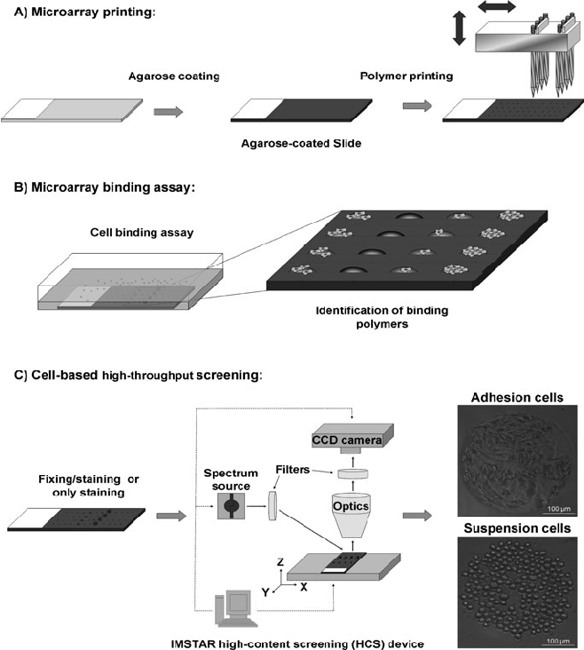
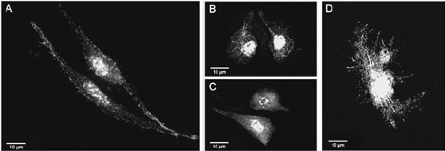
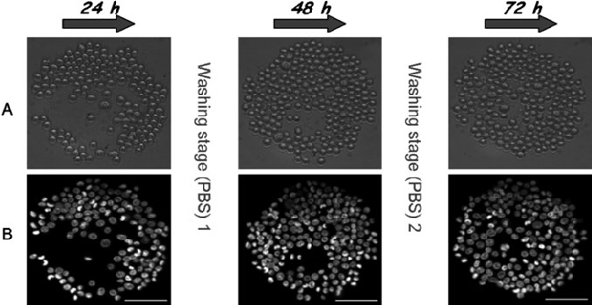
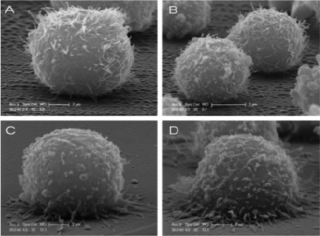

# Chapter 14

## Polymer Microarrays for Cellular High-Content Screening

### Salvatore Pernagallo and Juan J. Diaz-Mochon

#### Abstract

Polymer microarrays as platforms for cell-based assays are presented, offering a unique approach to highthroughput cellular analysis. These high-throughput (HT) platforms are used for the screening of new materials with the purpose of first finding substrates upon which a specific cell line would adhere and second to gain a rapid understanding of the interactions between cells and biomaterials. Arrays presented here are fabricated using pre-synthesised polymers by contact printing via a robotic microarrayer. These large arrays of polymers are then incubated with cell cultures and the results obtained are used to significantly help the design of synthetic biomaterials, implant surfaces and tissue-engineering scaffolds by finding correlations between their chemical structure and their biological performance. The flexibility of polymer microarrays analysis not only greatly refines our knowledge of multitude of cell-biomaterial interactions but could also be used in biocompatibility assessments as novel biomarkers.

Key words: Polymer microarrays, mouse fibrosarcoma cells (L929), K562 cells, scanning electron microscopy (SEM), high-throughput screening (HTS), cell-based assays.

#### 1. Introduction

The development of biomaterials for the biomedical field, especially in the case of polymers, represents a major opportunity to improve quality of life (1). For this reason, great quantities of resource have been spent with the intention of synthesising and improving biocompatible materials (2). However, the nature of the interactions between a polymer and its biological environment is highly complex. For example, due to the multiplicity of the cell-surface components (lipid bilayer, membrane proteins, glycoproteins and small molecules), the principles of immobilisation of cells on a surface are more difficult to predict than that of the

E. Palmer (ed.), Cell-Based Microarrays, Methods in Molecular Biology 706, DOI 10.1007/978-1-61737-970-3_14, © Springer Science+Business Media, LLC 2011

171

immobilisation of single biomolecules. In fact, cell–biomaterial interactions should be considered as the result of a range of cooperative and dynamic non-covalent interactions between these components and a given substrate. Surface characteristics, such as hydrophobicity, roughness and charge, and chemical composition, are all known to play key roles in regulating the response of cells that interact with biomaterials (3). It is impossible to theoretically predict cellular response, and thus every time a new material is generated, it is vital to test its biocompatibility using cells with which it will come into contact. Traditional methods of screening, identifying and testing of new polymers are slow; yet over recent years, the field of automated and parallel screening of polymers has grown enormously. The use of a high-throughput approach, such as polymer microarrays, to allow the rapid screening of chemically diverse polymers offers an important tool for finding correlations between the design and performance of such materials (4, 5). The system of polymer microarrays has had, and will continue to have, a massive impact on the study and development of new biomaterials with diverse applications.

#### 2. Materials

- 2.1. Polymer Microarray Preparation

- 1. Aminoalkylsilane poly-prep slides (Sigma-Aldrich).
- 2. Agarose type I-B.
- 3. 1-Methyl-2-pyrrolidinone (NMP).
- 4. 384-Well polypropylene microplate.
- 5. Robotic microarrayer: QArray Mini (Genetix).
- 6. Polymer libraries synthesised via radical polymerisation on a mmol scale (6–8).

- 2.2. Cell Culture 1. Dulbecco’s modified eagle medium (DMEM) supplemented with 10% foetal bovine serum (FBS), L-glutamine (4 mM) and antibiotics (penicillin and streptomycin, 100 units/ml).

- 2. RPMI 1640 medium supplemented with 10% FBS, L-glutamine (4 mM) and antibiotics (penicillin and streptomycin, 100 units/ml).
- 3. 1 × Phosphate-buffered saline (1 l) (1 × PBS buffer): 8 g of NaCl, 0.20 g of KCl, 1.44 g of Na2HPO4 and 0.24 g of KH2PO4 dissolved in 800 ml of deionised H2O, filter through Millipore filter. Adjust the pH to 7.4 with HCl or NaOH. Add Millipore filter distilled H2O to 1 l.
- 4. Trypsin solution: 0.050% w/v trypsin, 0.20% w/v EDTA in PBS.

- 2.3. Cell Fixing and Staining

- 1. 4% (w/v) formaldehyde in PBS.
- 2. Isotonic solution: 8.1 g/l NaCl, 0.2 g/l KCl.
- 3. Hoechst-33342 solution: 1 μg/ml in PBS.
- 4. CellTracker GreenTM (CTG): 5 μM in PBS.
- 5. Alexa Fluor R 568 phalloidin: 0.2 μM in 1% in PBS containing 1% FBS.

- 2.4. High-Content Screening

Image capture and analyses are carried out using a platform, based on a Nikon 50i fluorescence fluorescent microscope (×20 objective) equipped with an X–Y–Z stage, device equipped with the PathfinderTM (IMSTAR) having a mercury lamp as light source. It allows the automated capture of single images (0.46 mm2) for each polymer spot with a resolution of 0.58 μm.

The filters used are as follows:

- 1. DAPI filter set: excitation D350/50×; emission D460/ 50 m.
- 2. FITC filter set: excitation HQ480/40×; emission HQ535/ 50 m.
- 3. Cy3 filter set: excitation HQ535/50×; emission HQ610/ 75 m.

- 2.5. SEM Binding Assay

- 1. Spin coater (Speedlines Technologies).
- 2. 24-mm diameter glass coverslips.
- 3. Tetrahydrofuran (THF).
- 4. 0.2 M stock solution of cacodylate buffer (250 ml) (pH 7.4): combine 20.15 g sodium cacodylate trihydrate (MW

= 214), 0.1 ml HCl and 250 ml of deionised H2O, filter through Millipore filter.

- 5. Fixing solution: 2.5% glutaraldehyde in 0.1 M cacodylate buffer (pH 7.4).
- 6. Post-fixing solution: 1% osmium tetroxide aqueous solution.
- 7. Philips XL30CP scanning electron microscope at 30 kV in a secondary electron imaging mode.

#### 3. Methods

The Bradley research group has developed a novel approach to fabricate arrays of different materials by contact printing preformed polymers onto cytophobic (agarose-coated) slides (see Note 1) to generate well-defined polymer microarrays (9). Before

printing, each library member is dissolved in a common, nonvolatile solvent (NMP) (see Note 2). A number of printing parameters, such as inking and printing time, were optimised in this process to ensure uniformity of polymer spot within the array (Fig. 14.1a). Since each library member is synthesised on a scale that allowed characterisation prior to array fabrication, there is full confidence in any structure-activity relationship generated while allowing immediate scale-up following polymer identification. Several cell types, from immortalised cell lines, primary cells, to stem cells can be studied. In general terms, cell types can be categorised as either adherent or suspension cells; so two different protocols have to be followed (9–12).

Fig. 14.1. General protocol for the identification of substrates for cell-polymer binding studies: (a) polymer microarray preparation; (b) microarray binding assay; (c) cell-based high-throughput screening.

- 3.1. Polymer Microarray Preparation

- 1. Every polymer of the libraries is characterised using analytical methods such as gel permeable chromatography, differential scanning colorimetry and fourier transform infrared (13, 14).
- 2. Polymers are dissolved at 1% w/v in NMP.
- 3. The solutions are placed into a 384-well microplate prior to printing.
- 4. Coating glass slides with agarose is achieved by dip-coating the aminoalkylsilane slides in a 1% w/v solution of agarose type-I B at 65◦C followed by removal of the coating on the bottom side. After drying overnight at room temperature, the coated slides are stored at room temperature or used immediately for printing (15).
- 5. The robot used is the QArray Mini. The solutions are deposited by contact printing using 150 mm solid pins. Each polymer solution is printed as four identical spots and each spot is formed by a minimum of five contact printings to give a microarray with up to 2,048 spots per slide (see Note 3).
- 6. The solvent is removed by drying under vacuum at (24 h at 42◦C/200 mbar).
- 7. The slides are sterilised in a biosafety cabinet by exposure to UV irradiation for 20 min prior to use.

- 3.2. Cell-Based Microarrays – Adherent Cells

To carry out experiments using adherent cells, mouse fibrosarcoma cell line, L929 (see Note 4) was chosen. Cells were incubated with a polymer microarray for 48 and 72 h (Fig. 14.1b). In order to study the biocompatibility of the polymer support, cells are stained with CTG, an indicator of cell viability (16), 1 h before fixing. Subsequently, the cells are fixed, and cell nuclei and cytoskeleton are stained with Hoechst-33342 and Alexa Fluor R 568 phalloidin respectively. Cell-permeable Hoechst-33342 is an adenine–thymine-specific dye that binds to the minor groove of DNA and is used to enable the counting of cells (17). Alexa Fluor R 568 phalloidin is a fluorescent bicyclic peptide with high affinity for F-actin, which is an important component of the cytoskeleton, and is used to study cell morphology (18). Each array position is then captured using three fluorescent channels (DAPI, FITC and Cy3 filter sets) and brightfield illumination, giving rise to four images per position (Fig. 14.1c). Cell number, biocompatibility and morphology of each polymer member are determined in an automated manner using PathfinderTM. Cell morphology is further analysed by confocal microscopy (Fig. 14.2).

Fig. 14.2. Confocal images of L929 cells on polymer microarrays. Cells are imaged under excitation at 555/28 and 360/40 nm using a DeltaVision RT microscope (×63 objective) and then merged: (a) PU-87; (b) PU-133; (c) PU-161 and (d) PU-107.

- 3.3. Cell Adhesion, Biocompatibility and Morphology Studies

- 1. L929 cells are washed with PBS, detached with 0.050% w/v trypsin, 0.20% w/v EDTA in PBS, counted and diluted with DMEM-complete media to a final concentration of 105 cells/ml.
- 2. Six millilitre of this dilution is gently added onto two polymer microarrays contained in a sterile four-well plate and incubated for different periods of time (48 and 72 h).
- 3. Polymer microarrays are washed twice in PBS and incubated

with CTG at 37◦C and 5% CO2 for 15 min and then gently washed.

- 4. Cells are fixed with p-formaldehyde solution at room temperature (RT) for 15 min.
- 5. Incubate with Hoechst-33342 for 15 min at RT.
- 6. Incubate with Alexa Fluor R 568 phalloidin for 15 min at RT.
- 7. The polymer microarray slides are then rinsed in deionised water and air-dried before scanning.
- 8. Image capture and analyses are carried out using a highcontent screening (HCS).
- 9. Cell morphology studies are performed on the polymer microarray by a DeltaVision RT microscope (×63 objective) using DAPI and rhodamine channels, after 72 h (Fig. 14.2).

- 3.4. Cell-Based Microarrays – Suspension Cells

Cellular binding of suspension cells onto polymer microarrays is achieved via the analysis of polymer microarrays using K562 cells (see Note 5). This method measures not only polymer-binding capacities but also cellular proliferation (19).

In order to quantify both cellular adhesion and proliferation, the average number of cells and the standard deviation are determined at three different incubation times (24, 48 and 72 h) on three separate polymer microarrays (Fig. 14.3). Through the analysis of the arrays, it is then possible to profile different materials. The images are automatically processed by PathfinderTM (Fig. 14.3b) by counting cell nuclei which are stained with Hoechst 33342.

Fig. 14.3. Parallel analysis of polymer cellular binding and proliferation on a representative spot (PA-374): (a) Brightfield images; (b) DAPI channel. Scale bar 100 μm.

- 3.5. SEM Binding Assay

- 1. K562 cells are washed with PBS, counted and diluted with RPMI-complete media to a final concentration of 105 cells per ml.
- 2. An aliquot of 6 ml of this dilution is gently added to the three polymer microarrays contained in a four-well plate and incubated for 24, 48 or 72 h.
- 3. The polymer microarray is washed with PBS (see Note 6) and then incubated for 30 min with fresh RPMI serum-free media supplemented with Hoechst 33342.
- 4. The polymer microarray slides are then rinsed in an isotonic solution and immersed in this solution to facilitate K562 live cell analysis.
- 5. Image capture and analyses are carried out using HCS. Live automatic scanning is achieved by ×20 objective (in an immersion manner), using fluorescent (DAPI filter set) and brightfield channels of the polymer spots (Fig. 14.3).

SEM studies are undertaken so that the effect of the different polymers on the cells could be assessed. This allows a better understanding of the effect that polymers produce on suspension cells adhered on them (Fig. 14.4).

- 1. Hit polymers selected from cell-based polymer microarray experiments are dissolved at 2.0% w/v in THF.
- 2. 200 ml of the polymer solutions (2.0% w/v in THF) are placed onto the coverslips and spin-coated for 2 s at 2,000 rpm.
- 3. The solvent is removed by drying under vacuum (12 h at 42◦C/200 mbar).

Fig. 14.4. Scanning electron micrographs. (a, b) Control K562 cells after 24 h; (c) cells grown on a selected polymer after 24 h; (d) cells grown on a selected polymer after 72 h.

- 4. The glass coverslips are sterilised in a biosafety cabinet by exposure to UV irradiation for 20 min prior to use.
- 5. K562 cells are washed with PBS, counted and diluted with RPMI-complete media to a final concentration of 105 cells/ml.
- 6. An aliquot of 1 ml of this dilution is gently seeded to the polymer-coated glass coverslips contained in a 12-well plate and incubated for 24 or 72 h.
- 7. K562 cells are fixed at RT for 2 h (see Note 7).
- 8. All samples are post-fixed with osmium tetroxide for 1 h at room temperature, dehydrated through graded ethanol

(50, 70, 90 and 100%), critical point-dried in CO2 and gold coated by sputtering.

- 9. The samples are examined with a scanning electron microscope (Fig. 14.4).

#### 4. Notes

- 1. Several functionalised and gold-coated glass slides were investigated for this application, most of which provide a suitable surface for polymer printing, and could be readily sterilised under UV irradiation, but unfortunately did not prevent cellular adhesion. The following substrates were

- prepared and tested: C18-functionalised slides, aluminium slides and perfluoroalkylthiol-modified slides. The best results were obtained by dip-coating aminoalkylsilane slides with a thin film of agarose type I-B. Importantly agarose is readily sterilised by UV irradiation and does not dissolve in most organic solvents (9).
- 2. NMP is selected on the basis that the majority (> 95%) of the polymer library is soluble in this solvent and that it allowed uniform spots to be printed.
- 3. The typical spot diameter is 300 mm (±20 mm) with a volume of about 7 nl which is equivalent to about 70 pg of polymer.
- 4. Mouse connective tissue cells (fibroblast cells (L929)) are cells of interest in biomedical research since fibroblasts provide a structural framework (stroma) for many tissues and play a critical role in wound healing (20).
- 5. K562 cells are a suspension cell line derived from a chronic myelogenous leukaemia patient. This cell line does not normally undergo the same adhesion process as anchoragedependent cells and, therefore, is especially appropriate for the study of cell adhesion over long periods of time (21).
- 6. Each polymer microarray is washed at each time-point in order to remove the cells which had not adhered to the polymer.
- 7. As controls, K562 cells are collected, centrifuged for 5 min (300×g at 20◦C) and fixed in suspension at RT for 2 h. After washing twice with 0.1 M cacodylate buffer, the cells were seeded on coverslips coated with a selected polymer for 24 h.

#### Acknowledgments

The authors thank Professor Mark Bradley for being the pioneer of cell-based polymer microarray technologies, Hitoshi Mizomoto and Jeff Thaburet for their work on synthesising polymers, Guilhem Tourniaire for starting developing cell-based polymer microarrays and Asier Uniciti-Broceta for his work on morphologies studies.

References

- 1. Langer, R. (2009) The evolution of biomaterials. Nat Mater 8, 444–445.
- 2. Williams, D. F. (2009) On the nature of biomaterials. Biomaterials 30, 5897–5909.

3. Lecuit, T., Lenne, P. F. (2007) Cell surface mechanics and the control of cell shape, tissue patterns and morphogenesis. Nat Rev Mol Cell Biol 8, 633–644.

- 4. Michael, A. R. M., Richard, H., Ulrich, S. S.

(2004) Combinatorial methods, automated synthesis and high-throughput screening in polymer research: the evolution continues. Macromol Rapid Commun 25, 21–33.

- 5. Hook, A. L., et al. (2010) High throughput methods applied in biomaterial development and discovery. Biomaterials 31, 187–198.
- 6. Mizomoto, H. (2004) The synthesis and screening of polymer libraries using a high throughput approach. Ph.D. Thesis: University of Southampton, Southampton, UK.
- 7. Jose, A. J. (2005) Synthesis and Screening of biocompatible polymer using a multiparallel approach. Ph.D. Thesis: University of Southampton, Southampton, UK.
- 8. Thaburet, J. F. O., Mizomoto, H., Bradley, M. (2004) High-throughput evaluation of the wettability of polymer libraries. Macromol Rapid Commun 25, 366–370.
- 9. Tourniaire, G., et al. (2006) Polymer microarrays for cellular adhesion. Chem Commun 20, 2118–2120.
- 10. Pernagallo, S., et al. (2008) Deciphering cellular morphology and biocompatibility using polymer microarrays. Biomed Mater 3, 034112.
- 11. Pernagallo, S., Diaz-Mochon, J. J., Bradley, M. (2009) A cooperative polymer-DNA microarray approach to biomaterial investigation. Lab Chip 9, 397–403.
- 12. Unciti-Broceta, A., et al. (2008) Combining nebulization-mediated transfection and polymer microarrays for the rapid determination of optimal transfection substrates. J Comb Chem 10, 179–184.

- 13. Tourniaire, G., Diaz-Mochon, J. J., Bradley, M. (2009) Fingerprinting polymer microarrays. Comb Chem High Throughput Screen 12, 690–696.
- 14. Thaburet, J. F. O., Mizomoto, H., Bradley, M. (2004) High-throughput evaluation of the wettability of polymer libraries. Macromol Rapid Commun 25, 366–370.
- 15. Roth, E., et al. (2004) Ink-jet printing for high-throughput cell patterning. Biomaterials 25, 3707–3715.
- 16. Pucci, F., et al. (2009) Survival of benthic foraminifera under hypoxic conditions: results of an experimental study using the CEllTRACKER green method. Mar Poll Bull 59, 336–351.
- 17. Singh, S., Dwarakanath, B. S., Mathew, T. L.

(2004) DNA ligand hoechst-33342 enhances UV induced cytotoxicity in human glioma cell lines. J Photochem Photobiol B 77, 45–54.

- 18. Cooper, J. A. (1987) Effects of cytochalasin and phalloidin on actin. J Cell Biol 105, 1473–1478.
- 19. Wang, J. H., Hung, C. H., Young, T. H.

(2006) Proliferation and differentiation of neural stem cells on lysine-alanine sequential polymer substrates. Biomaterials 27, 3441– 3450.

- 20. Chang, H. Y., et al. (2002) Diversity, topographic differentiation, and positional memory in human fibroblasts. Proc Natl Acad Sci USA 99, 12877–12882.
- 21. Leif, C. A., Kenneth, N., Carl, G. G. (1979) K562 – a human erythroleukemic cell line. Int J Cancer 23, 143–147.

