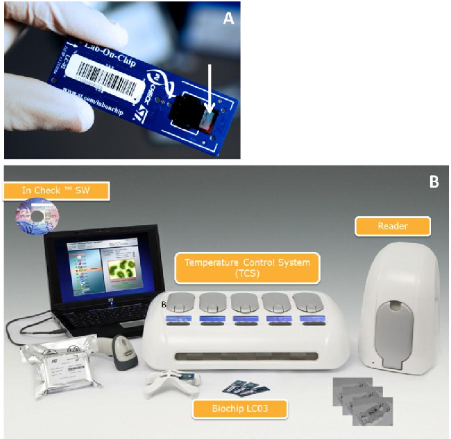
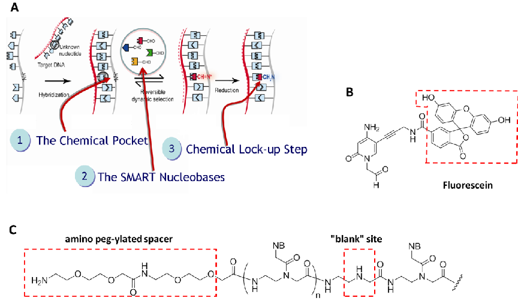
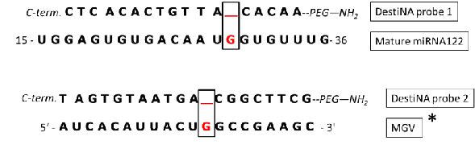
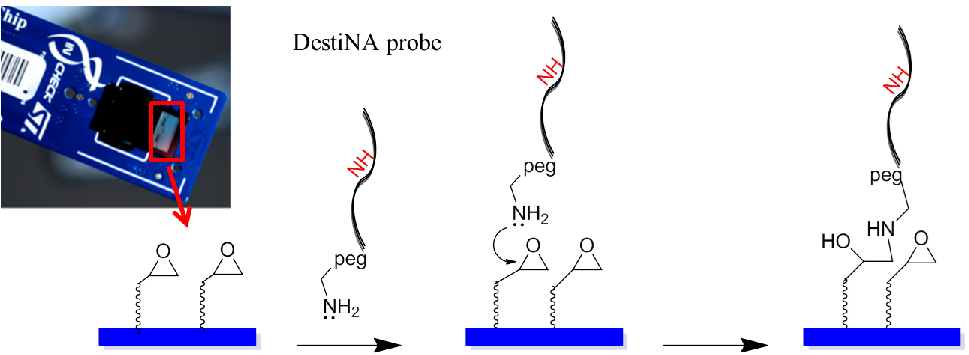
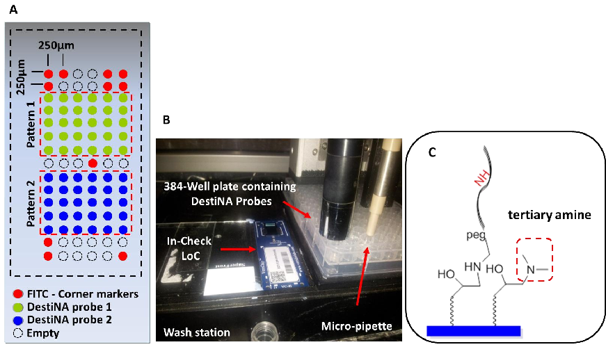
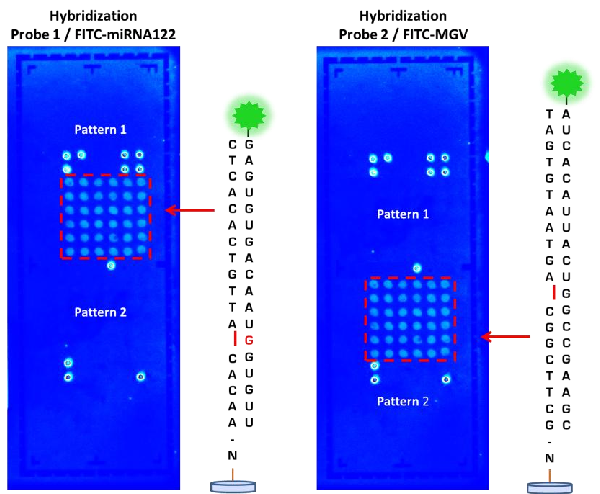
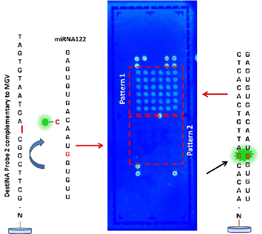

Sensors 2012, 12, 8100-8111; doi:10.3390/s120608100 

Article

OPEN ACCESS

sensors 

ISSN 1424-8220 

www.mdpi.com/journal/sensors 

Novel Biochip Platform for Nucleic Acid Analysis 

Salvatore Pernagallo 1,†, Giorgio Ventimiglia 2,*,†, Claudia Cavalluzzo 1, Enrico Alessi 2,   Hugh Ilyine 1, Mark Bradley 3 and Juan J. Diaz-Mochon 1,* 

1  DestiNA Genomics Ltd., West Mains Road, Edinburgh EH9 3JJ, UK;   E-Mails: salvatore.pernagallo@destinagenomics.com (S.P.);   claudia@destinagenomics.com (C.C.); hugh@destinagenomics.com (H.I.) 

2  STMicroelectronics, ANALOG, MEMS and SENSORS Group, Healthcare BDU,   Stradale Primosole 50, Catania 95121, Italy; E-Mail: enrico.alessi@st.com 

3  School of Chemistry, University of Edinburgh, West Mains Road, Edinburgh EH9 3JJ, UK;   E-Mail: mark.bradley@ed.ac.uk 

† These authors contributed equally to this work. 

*  Authors to whom correspondence should be addressed; E-Mails: giorgio.ventimiglia@st.com (G.V.);  juan@destinagenomics.com (J.J.D.-M.); Tel.: +39-095-740-4344 (G.V.);   +44-0-131-650-4821 (J.J.D.-M.). 

Received: 25 April 2012; in revised form: 21 May 2012 / Accepted: 31 May 2012 /   Published: 11 June 2012 

Abstract: This  manuscript  describes  the  use  of  a  novel  biochip  platform  for  the  rapid  analysis/identification of nucleic acids, including DNA and microRNAs, with very high  specificity. This approach combines a unique dynamic chemistry approach for nucleic acid  testing  and  analysis  developed  by  DestiNA  Genomics  with  the  STMicroelectronics   In-Check  platform,  which  comprises  two  microfluidic  optimized  and  independent  PCR  reaction  chambers,  and  a  sequential  microarray  area  for  nucleic  acid  capture  and  identification  by  fluorescence.  With  its  compact  bench-top  “footprint” requiring  only  a  single technician to operate, the biochip system promises to transform and expand routine  clinical diagnostic testing and screening for genetic diseases, cancers, drug toxicology and  heart disease, as well as employment in the emerging companion diagnostics market. 

Keywords: Lab-on-Chip (LoC); microarray; nucleic acid; dynamic chemistry; polymerase  chain  reaction  (PCR);  peptide  nucleic  acid  (PNA);  microfluidic;  single  nucleotide  polymorphism  (SNP);  microRNA-122  (miRNA122);  mengo  virus  (MGV);  nucleic  acid  test (NAT); point-of-care (POC) 

1. Introduction 

The development of rapid diagnostic device platforms is one of the major scientific aims in the  world of life-science research, drug discovery, medical diagnostics and biotechnology [1–7]. Several  point-of-care  (POC)  diagnostic  platforms  have  been  launched  in  the  past  few  years  with  some  approved by the Food and Drug Administration (FDA) for in vitro diagnostic (IVD) applications [8–10].  Emerging  nucleic  acid  test  (NAT)  technologies  have  allowed  the  development  of  applications  for  genotyping  [single  nucleotide  polymorphisms  (SNPs)  and  indel  identification],  epigenetic  studies,  array  comparative  genome  hybridisation  (aCGH),  pre-natal  screening,  and  microRNAs  (miRNAs)  profiling to name just a few, providing substantial future growth opportunities for LoC devices [11–18].  LoC approaches could overcome the technical limitations of nucleic acid mass screening by providing  rapid, cheap and multiplexed assays [13,15]. 

Among the advanced biochip-based technologies, STMicroelectronics has developed a disposable  silicon-based micro  electro mechanical system  (MEMS)  LoC device  as  a  part  of  their “In-Check”  platform [19–21]. This platform combines all the functions needed to identify given oligonucleotide  sequences in a sample and includes microfluidic handling, a miniaturized PCR reactorand a nucleic  acid microarray detection module (Figure 1). 

The In-Check platform has already been used successfully to amplify human genome sequences and  detect  human  genome  mutations,  such  as  the  gene  associated  with  β-thalassemia  as  well  as  the  detection of viral infectious diseases with full integration of the PCR amplification with subsequent  microarray detection [22–24]. 

Previously, the chemical-based approach for nucleic acid testing (Chem-NAT) commercialised by  DestiNA  Genomics  had  been  validated  by  genotyping,  with  100%  read  accuracy,  using  DNA  from  mouth swabs from Cystic Fibrosis (CF) patients and mass spectrometry (MALDI-ToF) for analysis [25]. 

Briefly, DestiNA core technology takes advantage of dynamic chemistry for nucleic acid sequence  specific  recognition  using  aldehyde-modified  natural  nucleobases  (so  called SMART  nucleobases),  and probes based on peptide nucleic acid (PNA), containing an “abasic” position (DestiNA probes)  which can be made complementary to any target nucleic acid sequence (Figure 2(A)) [26]. 

A major feature of Chem-NAT is that false positives are difficult if not impossible to create as  nucleobase  incorporation  can  only  occur  in  the  presence  of  target  templating  nucleic  acid  strands  Figure 2(A). 

While mass spectrometry allows single base discrimination and multiplexing capabilities due to  molecular  weight  differences  between  SMART  nucleobases,  fluorescence  based  assays  require  the  DestiNA SMART nucleobases to be fluorescently-labelled and the DestiNA probes to be modified to  allow their covalent immobilisation on surfaces Figure 2(B,C). 

Figure 1. The main components of In-Check platform: (A) The Lab-on-Chip core device  amplifies clinically relevant DNA samples by Polymerase Chain Reaction (PCR) and has  an integrated custom low-density microarray (showed by the white arrow). (B) In-Check  platform  instruments.  The  Lab-on-Chip  interfaces  to  the  Temperature  Control  System  (TCS) that actuates, monitors, and controls the parameters of the reaction. The TCS unit  comprises  five  control  modules  with  independent  thermal  protocols  and  random  access  capability.  Optical  signal  acquisition  is  performed  on  a  dedicated  portable  reader  and  processed by ST's specialized bioinformatics software. The software package allows users  to  easily  monitor  and  control  reaction  processes,  analyse  the  results  and  automatically  generate diagnostic reports. 

Multiplexing can be achieved by printing probes at defined XY coordinates and by incorporation of  the  correct  fluorescently-labelled  SMART  nucleobase  into  the  chemical  pocket  following  duplex  hybridisation. Such an application allows the use of label-free nucleic acids. 

Herein,  a  proof-of-concept  study  which  integrates  DestiNA  Genomics  Chem-NAT  with  STMicroelectronics In-Check LoC platform is described, delivering a novel biochip platform for the  rapid detection of nucleic acids with high sensitivity and specificity. 

The novel biochip platform was evaluated and  validated for detection of synthetic  small  RNAs  (sRNAs) based on microRNA-122 (miRNA122) and mengo virus RNA (MGV). This biological model  represents the first steps in the development of a novel suite of assays for the medical diagnostic field.  Integration  of  DestiNA  technology  with  the  STMicroelectronics  In-Check  LoC  creates  a  highly  innovative product with a true diagnostic potential and utility, for rapid detection of nucleic acids with  benefits in terms of result consistency, time, cost, and ease of use. 

Figure  2. (A)  The  steps  involved  in  DestiNA  Genomics  chemical-based  approach  for  nucleic acid testing (Chem-NAT). (Copyright Wiley-VCH Verlag GmbH & Co. KGaA,  Reproduced with permission) [26]. DestiNA probe with the target sequence to be detected  creates a molecular pocket (step 1) that allows the specific incorporation of a DestiNA  SMART  nucleobase  (step  2)  which  is  then  chemically  locked  into  position  (step  3).  SMART  nucleobase  incorporation  can  be  directly  detected  by  Mass  Spectrometry.   (B)  Structure  of  the  fluorescein  labelled  aldehyde  Cytosine  (FITC-CCHO)  for  detection  using  fluorescence  reporter  system.  (C)  Structures  of  a  DestiNA  probe  containing  a   N-terminated amino peg-ylated spacer for being covalently immobilised onto surfaces. 

2. Experimental Procedure and Methods

2.1. General 

STMicroelectronics  In-Check  LoC  platforms  were  fabricated  as  described  previously  [19].  Commercially available reagents and buffer for the functionalization of the LoC surfaces were used  without further purification. Hydrogen peroxide (29%), ammonium hydroxide (25%), hydrochloridric  acid (37%) and methanol were purchased from Sigma Aldrich (Poole,UK) and were used as received.  Spot  buffer  (Nexterion  Spot)  and  hybridisation  solution  (Nexterion  Hyb)  were  purchased  from  SCHOTT and were used as received. All synthetic RNA oligomers were purchased in desalted form  from Microsynth AG (Balgach, Switzerland). 

2.2. Instrumentations 

A  microdrop  inject  printer  equipped  with  a  micro-pipette  (AD-K-501  70  μm  diameter  nozzle)  (Microdrop  Technologies  GmbH,  Muehlenweg,  Norderstedt,  Germany)  and  a  BioAnalyzer  4F/4S  equipped with a light scanner (LaVision BioTech GmbH, Bielefeld, Germany) were used. DestiNA  probe aqueous solutions concentrations were determined using an Agilent 8453 spectrophotometer. 

Hybridisation was carried out on a Q-Hyb10 Hybridisation Oven Incubation System Deltaspin (Quanta  Biotech Ltd., Surrey, UK). 

2.3. Probe Synthesis and Purification 

DestiNA probes terminate with an amino PEG group and were prepared by solid-phase synthesis  (SPS) using Fmoc/Bhoc protected monomers as described previously [25] and were characterized by  MALDI-TOF mass spectrometry (see Figures S1 and S2 in the Supplementary Information). 

2.4. Synthesis of FITC Labelled Aldehyde Cytosine 

Aldehyde-modified  cytosine,  tagged  with  a  fluorescein  molecule  was  prepared  following  the  synthetic route described elsewhere [27] and characterized by MALDI-TOF mass spectrometry (see  Figure S3 in the Supporting Information). 

2.5. Probes Immobilization 

Attachment of DestiNA probes was carried out according to manufacturer’s protocols (SCHOTT).  Briefly,  amino  peg-ylated  spacer  probes  were  dissolved  in  1X  spotting  solution  to  give  100  µM  solutions. The solution was spotted onto the epoxysilane-functionalised LoC, followed by incubation  under  humidity  for  30  min  in  a  hybridisation  chamber  box  (Genetix).  Thereafter,  the  LoCs  were  washed for 5 min in 0.1% Triton X-100, 2 × 2 min in 1 mM HCl, 10 min in 100 mM KCl and 1 min in  deionized  water.  After  washing,  the  LoCs  were  blocked  in  150  mM  phosphate  buffer  containing   50 mM dimethylamine, pH 9, for 15 min at 50 °C with stirring. The LoCs were washed for one min  with deionized water, dried in an oil-free nitrogen stream and stored at room temperature until use. 

2.6. Validation of DestiNA Probes Immobilization 

Features  on  the  LoCs  were  hybridized  with  complementary  labelled  synthetic  sRNAs  (see   Table S1, target 1 and 2, in the Supporting Information). In short, in a 0.2 mL Eppendorf, 10 µL of   100 µM of labelled synthetic sRNAs were dissolved in 20 µL of diH2O. Samples were mixed with   30 µL of hybridisdation buffer and in accordance with the guidelines provided by STMicrelectronics,  this solution was loaded into LoCs (through to the two inlets to reach the microarray area). The arrays  were  covered  with  two  accessories  in  plastic  (clamps)  for  array  sealing  and  inserted  into  the  Hybridisation Oven for hybridisation. Hybridisation was standardised by treatment at 50 °C for 2 h.  Thereafter, clamps were removed, and the LoCs were washed for 10 min each in 2 × SSC + 0.1%  SDS, 2 × SSC and then 0.2 × SSC (all wash steps were performed at room temperature). LoCs were  dried using an oil-free nitrogen stream and scanned using a 100 ms exposure time using emission and  detection filters appropriate for FITC. 

2.7. DestiNA Reaction on LoC 

A  0.2  mL  Eppendorf  containing  5  µL  of  a  100  µM  unlabelled  miRNA122  oligomer  aqueous  solution (see Table S1, target 3 in the Supporting Information) was placed in a heater (Techne TC-312  Thermocycler)  at  95  °C  for  5  min,  then  cooled  to  40  °C  before  being  combined  with  10  µL  of 

NaBH3CN  (1  M)  and  15  µL  of  FITC  labelled  aldehyde  cytosine  (FITC-CCHO)  (100  µM  in  0.5%  DMSO  aqueous  solution).  Samples  were  mixed  with  30  µL  of  hybridisation  buffer  (final  volume   60 µL) and loaded onto the LoC as described above. The arrays were covered with the two clamps and  placed into the hybridisation oven at 50 °C for 2 h. After the reaction the LoCs were washed, dried and  scanned as described above. 

3. Results and Discussion

In a first phase of this feasibility study, a protocol to print DestiNA probes onto LoC using an inkjet  printer was developed. Once the printing and blocking conditions were optimised, a second phase was  carried out in order to check if DestiNA probes, covalently immobilized on the LoC, were able to form  duplexes with complementary synthetic sRNA oligomers. In a final stage dynamic incorporation of  FITC-CCHO was tested to determine if high specificity was achieved on the novel biochip platform. 

3.1. DestiNA Probes for In-Check  

In  this  study  two  different  RNA  strands  mimicking  natural  sRNAs  were  used  to  validate  the  methodologies. The two objects of this study were related to miRNA122 and MGV. miRNA122 is a  22 nucleotide long single strand RNA found in high concentrations in human plasma of patients who  have overdosed on paracetamol, becoming a prospective biomarker of liver damage [28]. MGV can be  passed to humans through food intake, mainly in shellfish and analysis in the food chain is important  to avoid major outbreaks of hepatitis A [29]. The MGV transcript is over 3,000 Kb long and the target  region selected was chosen based on recommendation of the European Committee for Standardisation  (CEN/TC 275/WG6/TAG4-viruses in foods).  

To investigate and discriminate between the chosen targets, two different DestiNA probes, one to  clamp the mature miRNA122 sequence and the one targeting MGV genomic RNA, were designed and  synthesised. The design aligned the N-terminal end of the probes with the 3' end of their target having  the “blank” position lined up opposite to a guanidine residue under interrogation, as shown in Figure 3. 

Figure  3. miRNA122 and MGV were interrogated using two different DestiNA probes   (1 and 2) 18 and 20 mers respectively. Incorporation of FITC-CCHO provides proof-reading,  indicating the presence of the complementary oligomers. Only with perfect complementarity  the FITC-CCHO SMART nucleobase will be incorporated. Probe  design was carried out  using publicly available database (miRBase Accession Number: MIMAT0000421). MGV  was  designed  using  the  real-time  probe  Mengo147  previously  published  [29].  “*”  The  single-stranded  DNA  probe  Mengo147  was  an  identical  version  of  the  mengo  virus  genomic RNA except that “T” bases were replaced with “U” bases. 

DestiNA probes were reacted chemoselectivity with the epoxy groups that coat the silicon-based  microarray surface of the In-Check LoC. 

Figure 4 shows an amino-modified DestiNA probe reacting with the epoxysilane surface of the   LoC (a reaction that does not need additional baking or UV cross-linking steps). Molecular spacers   (PEG group) between the probes and the LoC epoxy groups facilitate interactions between the printed  DestiNA probes and their target binding partners in solution. 

Figure  4. Modified  DestiNA  probes  immobilization.  DestiNA  probes  were  covalently  attached through an epoxide ring-opening reaction via their primary amines. 

3.2. Printing and Blocking Optimization 

An important stage in the construction of the novel LoCs was defining the microarray probe layout.  The two test probes were printed onto two symmetrical portions of the array (pattern 1 and 2) and  arranged in 15 rows and six columns (90 features in total). Taking into consideration the size of the  microarray of 3.7 mm × 1.45 mm, it was decided to create a spot pitch of 250 µm Figure 5(A). Corner  control FITC-labelled DNA oligomers (see Table S1 in the Supporting Information) were printed to  identify  array  orientation.  Empty  positions  to  evaluate  background  noise  were  provided.  Overall,   32 positions were allocated to the control probes and 64 to the specific probes Figure 5(A).  

Printing was performed using a proprietary non-contact inkjet printing process in which DestiNA  probes were deposited uniformly onto the LoC microarray area. The precise inkjet process enabled the  delivery of extremely small, accurate volumes (picoliters) of the chemicals Figure 5(B). 

Efficient blocking of reactive surface groups after arraying was critical for a reduced fluorescence  background. The LoC was blocked with a 150 mM phosphate buffer containing 50 mM dimethylamine.  The  tertiary  amines  engendered  prevented  reactions  with  the  aldehyde  groups  of  the  FITC-CCHO Figure 5(C). Standard SCHOTT blocking buffer (containing ethanolamine) blocking approach were  excluded  as  this  would  give  rise  to  secondary  amines  on  the  surface  which  could  react  with  the  aldehyde groups of the fluorescently-labelled SMART nucleobase. 

Figure  5. (A)  Graphic  layout  of  the  microarray.  (B)  Printing  station  with  a  microdrop  printer GmbH (Norderstedt, Germany) containing a micro-pipette with a 70 µm diameter  nozzle.  (C)  Efficient  blocking  using  150  mM  phosphate  buffer  containing  50  mM  dimethylamine. Red square shows the tertiary amines formed.

3.3. Printing Validation with Synthetic Oligonucleotides 

Following  printing  of  the  probes  on  the  LoC microarray area, the  performance  of  the  DestiNA  probes was initially checked by hybridizing complementary fluorescently-labelled sRNA oligomers  (see Table S1, target 1 and 2 in the Supporting Information). Figure 6 shows fluorescence scanning  images  of  those  areas,  clearly  demonstrating  the  ability  of  the  immobilised  DestiNA  probes  to  recognise and form duplexes with complementary nucleic acid strands. 

Good printing performance and excellent spot morphology for both probe 1 and 2 was observed.  Pattern 1 (left image) shows where the oligo miRNA122 FITC plus complementary DestiNA probe 1,  attached to the LoC surface, has correctly hybridised and fluoresces. Pattern 2 (left image) shows no  fluorescence, as the oligo miRNA122 FITC had no complementarity to DestiNA probe 2 and, was  washed  away.  Additionally,  Pattern  2  (right  image)  shows  where  the  oligo  MGV  FITC  plus  complementary DestiNA probe 2 has correctly hybridised and fluoresces, while Pattern 1 (right image)  shows no fluorescence, as the oligo MGV had no complementarity to DestiNA probes 1. 

3.4. DestiNA Reaction on In-Check LoC Platform 

After optimising the printing, blocking conditions and validating the capability of DestiNA probes  to efficiently hybridise only with complementary sequence sRNA oligomers, the ability to achieve a  DestiNA  Chem-NAT  dynamic  chemistry  protocol  on  the  LoC  devices  was  explored.  Unlabelled  miRNA122 (see Table S1, target 3 in the Supporting Information) was used as template strand and  FITC-CCHO nucleobase was used with LoCs previously arrayed with DestiNA probes (Figure 5(A)). The 

resulting LoC scanning (Figure 7) showed the ability of the DestiNA technology to identify miRNA122  oligomer on In-Check, using a highly selective incorporation of the fluorescently-labelled cytosine. 

Figure 6. LoCs scanned after the hybridisation of DestiNA probes with either synthetic  miRNA122-FITC  (left)  or  MGV-FITC  (right).  LoCs  were  scanned  using  a  200  ms  exposure time using emission and detection filters appropriate for FITC.  

Figure 7. LoC scanned after DestiNA reaction with FITC-CCHO. Red square (pattern 1)  shows where the oligo miRNA122 plus complementary DestiNA probe 1 attached to the  array has correctly hybridised and fluorescence due to FITC-CCHO incorporation (showed  by black arrow). On the other hand, red square (pattern 2) does not show fluorescence   due  to  an  absence  of  hybridisation  between  oligo  miRNA122  plus  DestiNA  probe  2   (FITC-CCHO incorporation not take place). 

Background was at a very low level, demonstrating excellent blocking and the benefit of the proof  reading step using the DestiNA SMART base protocol. 

Selective  incorporation  of  FITC-CCHO into  the  PNA/RNA  hybrid  through  dynamic  chemical  reactions can take place ONLY when miRNA122 forms a perfect duplex with the designed DestiNA  probes (pattern 1). Pattern 2 shows no fluorescence because non-complementary (miRNA122) has not  been hybridised with the PNA probe 2. This demonstrated the selective incorporation of the “correct”  base  when  the  target  nucleic  acid  forms  a  perfect  duplex.  The  result  confirms  that  the  DestiNA  fluorescence detection approach to nucleic acid discrimination reported here could be ported into the  LoC platform, facilitating the analysis of label-free nucleic acid. The result further indicates that the  approach used with miRNA122 herein could be extended to more generic, direct nucleic acid analysis  such as allele-discrimination. 

4. Conclusions 

In  this  manuscript  we  have  given  an  overview  of  a  “Proof  of  Concept”  study  for  testing  the  integration of DestiNA Genomics and STMicroelectronics technologies. All the key proof of concept  objectives  were  achieved,  including  effective  DestiNA  probe  printing  and  DestiNA  reactions,  demonstrating successful translation of DestiNA reagents onto the In Check LoC platform. This study  represents a first step in merging the two technologies to create a suite of novel medical diagnostic  assays capable of delivering a novel biochip platform for the rapid detection of nucleic acids with high  sensitivity  and  specificity.By  combining  the  novel  chemical-based  methods  with  the  Lab-on-Chip  platform, clinically valuable innovation is achieved through: 

1.  The unique high affinity and selective hybridisation between DestiNA probes and target DNA or  RNA, superior to standard DNA/DNA or DNA/RNA hybridisations. 

2.  The  innovative  DestiNA  probes,  that  contain  a  “blank”/nucleobase  free  position  within  the  probe,  enable  a  unique  proof-reading  step  to  occur.  A  rapid  and  selective  incorporation  of  complementary fluorescently labelled SMART nucleobase into the PNA/RNA hybrid can ONLY  occur if the target nucleic acid forms a perfect duplex with the designed DestiNA probe.  

3.  Flexibility  to  design  “personalized”  and  low  cost  multiplex  assays  for  target  detection  in  individuals able to be undertaken by laboratory technicians. 

The integration and combination of DestiNA Genomics and STMicroelectronics technologies are  very  promising  and  potentially  suitable  for  developing  a highly  innovative  next  generation  system  capable of true diagnostic value and utility for the rapid detection of nucleic acids. Benefits for health  care providers will be cost benefits in term of reliability, time, and ease of use. 

Acknowledgements 

The authors thank F. R. Bowler for his previous work in developing DestiNA technology, and the  financial support of Scottish Enterprise for Salvatore Pernagallo and Claudia Cavalluzzo. These studies  were approved and supported by DestiNA Genomics and STMicroelectronics. 

References 

- 1. Hay Burgess, D.C.; Wasserman, J.; Dahl, C.A. Global health diagnostics. Nature 2006, 444, 1–2. 
- 2. Urdea, M.; Penny, L.A.; Olmsted, S.S.; Giovanni, M.Y.; Kaspar, P.; Shepherd, A.; Wilson, P.;  Dahl, C.A.; Buchsbaum, S.; Moeller, G.; et al. Requirements for high impact diagnostics in the  developing world. Nature 2006, 444, 73–79. 
- 3. Mabey, D.; Peeling, R.W.; Ustianowski, A.; Perkins, M.D. Diagnostics for the developing world.  Nat. Rev. Microbiol. 2004, 2, 231–240. 
- 4. Girosi, F.; Olmsted, S.S.; Keeler, E.; Hay Burgess, D.C.; Lim, Y.W.; Aledort, J.E.; Rafael, M.E.;  Ricci,  K.A.;  Boer,  R.;  Hilborne,  L.;  et  al.  Developing  and  interpreting  models  to  improve  diagnostics in developing countries. Nature 2006, 444, 3–8. 
- 5. Houpt,  E.R.;  Guerrant,  R.L.  Technology  in  global  health:  The  need  for  essential  diagnostics.  Lancet 2008, 372, 873–874. 
- 6. Smith, C. Tools for drug discovery: Tools of the trade. Nature 2007, 446, 219–222. 
- 7. Miller, M.B.; Tang, Y.-W. Basic concepts of microarrays and potential applications in clinical  microbiology. Clin. Microbiol. Rev. 2009, 22, 611–633. 
- 8. Yager,  P.;  Domingo,  G.J.;  Gerdes,  J.  Point-of-care  diagnostics  for  global  health.  Annu.  Rev.  Biomed. Eng. 2008, 10, 107–144. 
- 9. Sorger,  P.K.  Microfluidics  closes  in  on  point-of-care  assays.  Nat.  Biotechnol.  2008,  26,   1345–1346.  
- 10. McNerney,  R.;  Daley,  P.  Towards  a  point-of-care  test  for  active  tuberculosis:  Obstacles  and  opportunities. Nat. Rev. Microbiol. 2011, 9, 204–213. 
- 11. Horton, B. Nucleic acid testing. Nature 1997, 390, 425–426.  
- 12. Niemz, A.; Ferguson, T.M.; Boyle, D.S. Point-of-care nucleic acid testing for infectious diseases.  Trends Biotechnol. 2011, 29, 240–250. 
- 13. Chin, C.D.; Linder, V.; Sia, S.K. Lab-on-a-chip devices for global health: Past studies and future  opportunities. Lab Chip 2007, 7, 41–57. 
- 14. Daw, R.; Finkelstein, J. Lab on a chip. Nature 2006, 442, 367. 
- 15. Dutse,  S.W.;  Yusof,  N.A.  Microfluidics-based  lab-on-chip  systems  in  DNA-based  biosensing:   An overview. Sensors 2011, 11, 5754–5768.  
- 16. Clarissa, L.; Nathaniel, C.C.; Carl, A.B. Nucleic acid-based detection of bacterial pathogens using  integrated microfluidic platform systems. Sensors 2009, 9, 3713–3744. 
- 17. Qian, F.; Baum, M.; Gu, Q.; Morse, D.E. A 1.5 mL microbial fuel cell for on-chip bioelectricity  generation. Lab Chip 2009, 9, 3076–3081. 
- 18. Mairhofer, J.; Roppert, K.; Erlt, P. Microfluidic systems for pathogen sensing. Sensors 2009, 9,  4804–4823. 
- 19. Palmieri, M.; Alessi, E.; Conoci, S.; Marchi, M.; Panvini, G. Develop the “In-Check” Platform for  Diagnostic Applications. In Microfluidics, BioMEMS, and Medical Microsystems VI; Wang, W.,  Vauchier,  C.,  Eds.;  Proceedings  of  the  SPIE:  San  Jose,  CA,  USA,  2008;  Volume  6886,   pp. 688602-1–688602-14. 
- 20. Petralia, S.; Ventimiglia, G. Stability evaluation of protein coating for sensing: An application to  silicon based lab-on-chip device. Sens. Transducers J. 2012, 137, 215–225. 

- 21. Ventimiglia,  G.;  Petralia,  S.  Inorganic  nanoparticles  properties,  applications  and  production  photosynthetic routes. Recent Res. Devel. Photochem. Photobiol. 2011, in press. 
- 22. Consolandi, C.; Severgnini, M.; Frosini, A.; Caramenti, G.; de Fazio, M.; Ferrara, F.; Zocco, A.;  Fischetti,  A.;  Palmieri,  M.;  de  Bellis,  G.  Polymerase  chain  reaction  of  2-kb  cyanobacterial   gene  and  human  anti-α1-chymotrypsin  gene  from  genomic  DNA  on  the  In-Check  single-use  microfabricated silicon chip. Anal. Biochem. 2006, 353, 191–197. 
- 23. Foglieni,  B.;  Brisci,  A.;  San  Biagio,  F.;  di  Pietro,  P.;  Petralia,  S.;  Conoci,  S.;  Ferrari,  M.;  Cremonesi, L. Integrated PCR amplification and detection processes on a Lab-on-Chip platform:  A new advanced solution for molecular diagnostics. Clin. Chem. Lab. Med. 2010, 48, 329–336. 
- 24. Teo,  J.;  di  Pietro,  P.;  San  Biagio,  F.;  Capozzoli,  M.;  Deng,  Y.M.;  Barr,  I.;  Caldwell,  N.;   Ong, K.L.; Sato, M.; Tan, R.; et al. VereFlu™: An integrated multiplex RT-PCR and microarray  assay for rapid detection and identification of human influenza A and B viruses using lab-on-chip  technology. Arch. Virol. 2011, 156, 1371–1378. 
- 25. Bowler,  F.R.;  Reid,  P.A.;  Boyd,  A.C.;  Diaz-Mochon,  J.J.;  Bradley,  M.  Dynamic  chemistry   for  enzyme-free  allele  discrimination  in  genotyping  by  MALDI-TOF  mass  spectrometry.   Anal. Methods 2011, 3, 1656–1663. 
- 26. Bowler, F.R.; Diaz-Mochon, J.J.; Swift, M.D.; Bradley, M. DNA Analysis by dynamic chemistry.  Angew. Chem. Int. Ed. 2010, 49, 1809–1812. 
- 27. Diaz-Mochon, J.J.; Bradley, M. Nucleobase Characterisation. WO Patent WO2009/037473, 2008. 
- 28. Starkey Lewis, P.J.; Dear, J.; Platt, V.; Simpson, K.J.; Craig, D.G.; Antoine, D.J.; French, N.S.;  Dhaun, N.; Webb, D.J.; Costello, E.M.;  et al. Circulating microRNAs as potential markers of  human drug-induced liver injury. Hepatology 2011, 54, 1767–1776. 
- 29. Pintó, R.M.; Costafreda, M.I.; Bosch, A. Risk assessment in shellfish-borne outbreaks of hepatitis A.  Appl. Environ. Microbiol. 2009, 75, 7350–7355. 

©  2012  by  the  authors;  licensee  MDPI,  Basel,  Switzerland.  This  article  is  an  open  access  article  distributed  under  the  terms  and  conditions  of  the  Creative  Commons  Attribution  license  (http://creativecommons.org/licenses/by/3.0/). 

