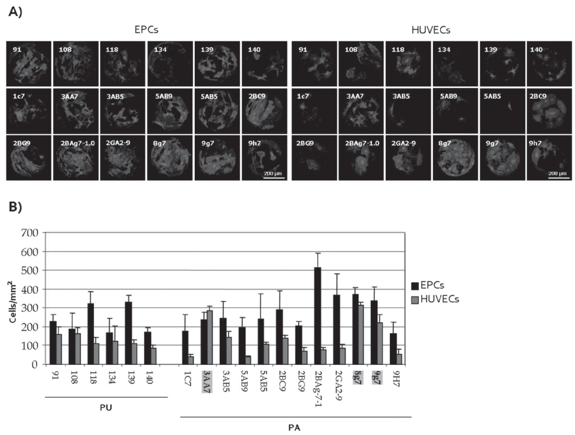
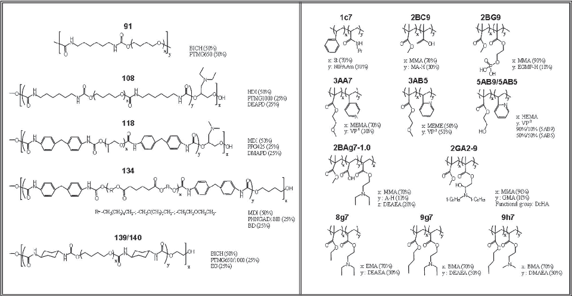
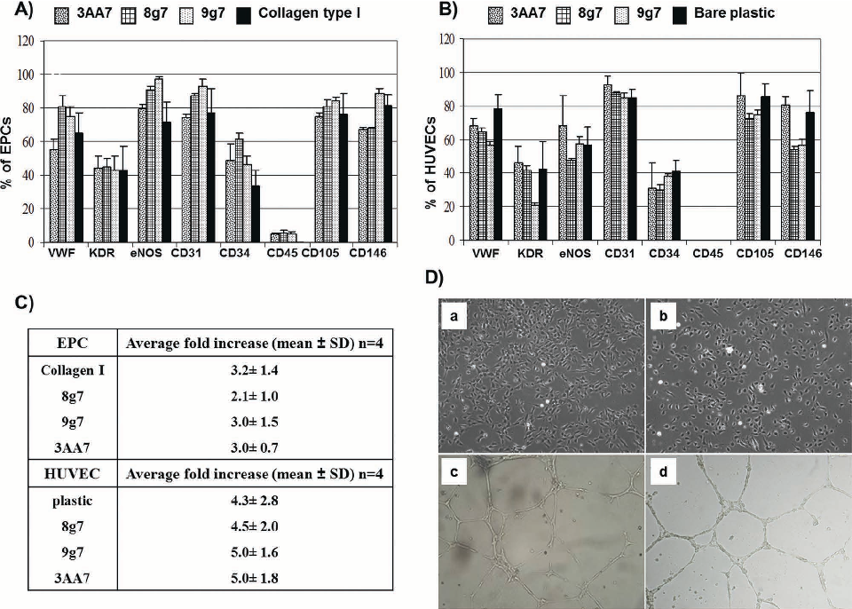
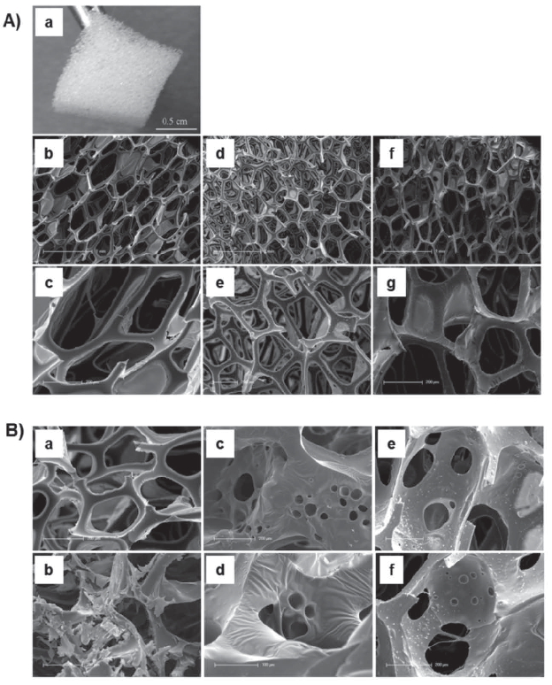
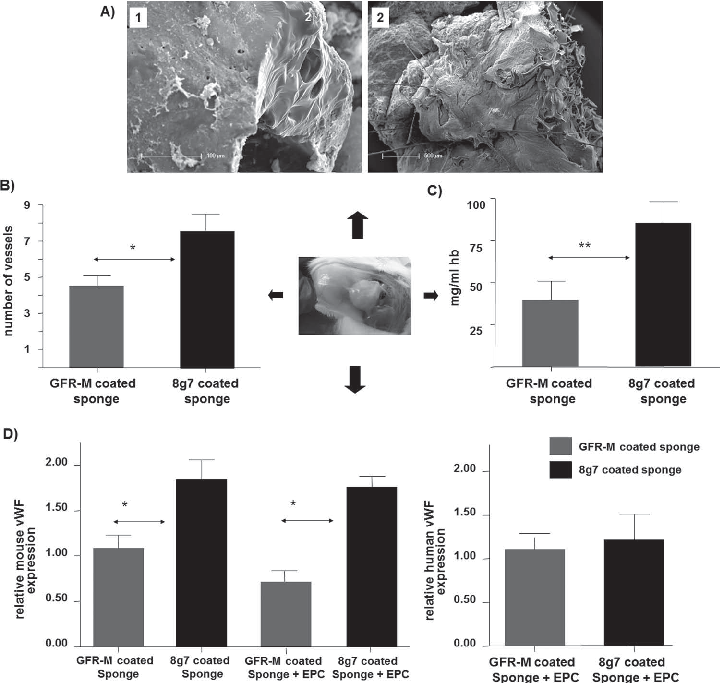
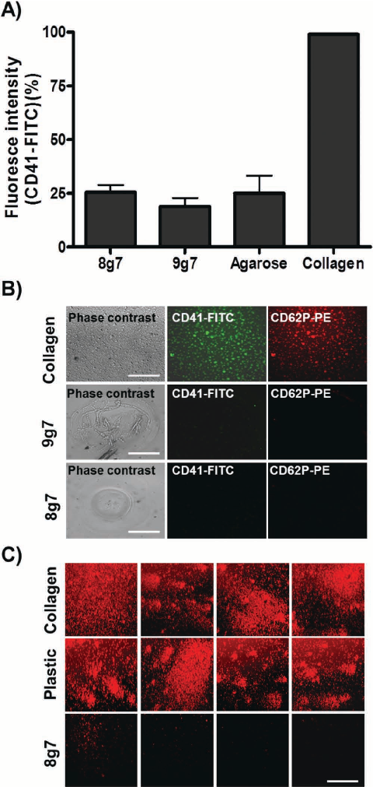
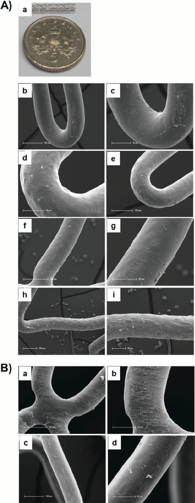

www.advhealthmat.de

www.MaterialsViews.com

# Novel Biopolymers to Enhance Endothelialisation of Intra-vascular Devices

## COMMUNICATION

Salvatore Pernagallo , Olga Tura , Mei Wu , Kay Samuel , Juan J. Diaz-Mochon , Anna Hansen , Rong Zhang , Melany Jackson , Gareth J. Padfi eld , Patrick W.F. Hadoke , Nicholas L. Mills , Marc L. Turner , John P. Iredale , David C. Hay , * and Mark Bradley *

### 1. Introduction

attracting circulating endothelial progenitor cells (EPC) from the peripheral bloodstream have gained much attention.[ 6–10 ] EPC are a population of rare pre-differentiated adult stem cells that circulate in the blood with the ability to proliferate and differentiate into mature endothelial cells.[ 7 ] Therefore, synthetic vascular grafts coated with either antibodies or integrin-binding peptides aimed at capturing EPC directly from the circulating blood stream have been developed in order to facilitate rapid endothelial coverage.[ 6 ] While encouraging results have been derived from these studies, the success of this technology is highly dependent on the capacity to specifically capture the desired cell. However, as considerable controversy surrounds the identification of EPC, cell surface marker that specifically defines an EPC has yet to be determined. Therefore, nonspecific binding of non-EPC, to coated vascular grafts remains a major concern, as this may promote adverse effects such as inflammation or hyperplasia.[ 11 ] Thus the identification of a molecule, which specifically binds cell surface antigens of an EPC, is a highly desirable goal.

Ischaemic heart disease with cardiac dysfunction and progressive loss of cardiomyocytes is the major cause of death in the world despite recent advances in medical and device therapy.[ 1 ] Currently, percutaneous coronary intervention (PCI) is the main therapeutic procedure to treat blocked coronary arteries improving myocardial perfusion and clinical outcomes in patients with ischaemic heart disease.[ 2 ] One third of patients with coronary artery disease will undergo PCI.[ 3 ] Patients with severe narrowing or blockage of the coronary artery are generally considered for bypass surgery where arteries or veins from elsewhere in the patient’s body or synthetic inserts are grafted to the coronary arteries to bypass the obstructed sites of the blood vessel.[ 3 ] The main limitation of synthetic vascular grafts and stents is restenosis, when the treated artery becomes narrowed again. The incidence of in-stent restenosis after PCI is approximately 11% and has been reported to be as high as 30% in higher risk populations using bare-metal stents.[ 2 ]

Long-term patency rate and, ultimately, the success of a cardiovascular graft is related to its biocompatibility and ability to inhibit thrombosis, and intimal hyperplasia.[ 4 ] The endothelium plays a major role in inhibiting these processes by providing the optimal naturally occurring anti-thrombogenic and bloodcompatible surface.[ 5 ] Indeed, endothelisation of the vascular graft is an essential step during graft healing and a key contributor for a successful long-term outcome.[ 6 ]

In this study, as an alternative to existing therapies, we aim to assess the pro-angiogenic and anti-thrombotic properties of a panel of synthetic biocompatible materials, with the aim to accelerate re-endothelisation in vivo and in situ. Using polymer microarray technology[ 12–16 ] as a means of performing a comprehensive assessment of 345 polymers, we sought to identify a matrix that specifically supports both progenitor and mature endothelial cell activity in vitro and in vivo while minimising platelet attachment.

Recently, significant strategies aimed at in vivo selfendothelisation of functionalised biomaterial surfaces by

Dr. S. Pernagallo,[+] M. Wu, Dr. J. J. Diaz-Mochon, A. Hansen, Dr. R. Zhang, Prof. M. Bradley School of Chemistry University of Edinburgh West Mains Road, Edinburgh EH9 3JJ, UK E-mail: Mark.Bradley@ed.ac.uk

Dr. J. J. Diaz-Mochon University of Granada Facultad de Farmacia, Campus Cartuja s/n, Granada 18071, Spain

Dr. G. J. Padfi eld, Dr. P. W. F. Hadoke, Dr. N. L. Mills Centre for Cardiovascular Science University of Edinburgh 47 Little France Crescent, Edinburgh EH16 4SU, UK

Dr. O. Tura,[+] Dr. M. Jackson, Dr. D. C. Hay MRC Centre for Regenerative Medicine University of Edinburgh Edinburgh BioQuarter, 5 Little France Drive, Edinburgh EH16 4UU, UK E-mail: davehay@talktalk.net

Prof. J. P. Iredale Centre for Inflammation Research The Queen’s Medical Research Institute 47 Little France Crescent, Edinburgh EH16 4TJ, UK [+] These authors contributed equally to this work.

K. Samuel, Prof. M. L. Turner SNBTS Cell Therapy Research Group Scottish Centre for Regenerative Medicine University of Edinburgh 49 Little France Crescent, Edinburgh EH16 4SB, UK

DOI: 10.1002/adhm.201200130

646 wileyonlinelibrary.com

Adv. Healthcare Mater. 2012, 1, 646–656

© 2012 WILEY-VCH Verlag GmbH & Co. KGaA, Weinheim

21922659, 2012, 5, Downloaded from https://onlinelibrary.wiley.com/doi/10.1002/adhm.201200130 by Universidad De Granada, Wiley Online Library on [03/03/2024]. See the Terms and Conditions (https://onlinelibrary.wiley.com/terms-and-conditions) on Wiley Online Library for rules of use; OA articles are governed by the applicable Creative Commons License

### 2. Materials and Methods

onto two identical polymer microarrays containing 345 polymers (PUs and PAs). After 3 days, cells were fixed in 100% methanol for 10 min and blocked in 10% goat serum for 1 h after washing with PBS (Sigma-Aldrich). 20 μ L of directly-conjugated monoclonal mouse anti-human CD31-PE antibody (Becton Dickinson) was applied overnight at 4 ° C. The cells were washed with PBS (Sigma-Aldrich) and finally mounted with DAPI-containing Vectashield hardest mounting medium (Vector Lab Ltd, UK). Image capture and analyses were carried out using a high content screening platform (Nikon 50i fluorescence microscope with an X-Y-Z stage), equipped with PathfinderTM software (IMSTAR S.A., France), using an x 20 objective. Cell number and endothelial identity on each polymer member was determined using fluorescent (DAPI and Rhodamine-like band-pass filters) channels with automated scanning of the polymer spots.

## COMMUNICATION

#### 2.1. Polymer Synthesis

Polyurethane (PU) and polyacrylate (PA) libraries were synthesised and characterised as previously described.[ 14–16 ]

#### 2.2. Polymer Microarray Fabrication

345 polymers (PUs and PAs) were “spotted” on aminoalkylsilanetreated glass slides (Sigma-Aldrich) previously coated with agarose to impede non-specific cell adhesion. Coating with agarose was achieved by manually dip-coating the slide in agarose Type I-B (Sigma-Aldrich) (1% w/v in deionised water at 65 ºC). Subsequently, the slides were dried overnight at room temperature in a dust free environment. PUs and PAs were prepared by dissolving polymer (10 mg) in N -Methyl-2-pyrrolidone (NMP; 1mL). Polymer microarrays were fabricated by contact printing (QArraymini Genetix) with 32 aQu solid pins (K2785, Genetix) using the polymer solutions placed in polypropylene 384-well microplates (X7020, Genetix). The 345 polymers were printed in quadruplicate with 1 single field of 48 × 32 spots containing 5 control (empty) areas. Printing conditions were as follows: 5 stampings per spot, 200 ms inking time and 10 ms stamping time. The typical spot size was 300–320 μ m in diameter with a pitch distance of 750 μ m (y-axis) and 560 μ m (x-axis), allowing up to 1516 features to be printed on a standard 25 × 75 mm slide. Once printed, the slides were dried under vacuum (12 h at 42 ºC/200 mbar) and sterilised in a bio-safety cabinet by exposure to UV irradiation for 20 min prior to use.

#### 2.5. Polymer Coating of Coverslips

19 mm diameter glass coverslips (Menzel-Gläser, Germany) were cleaned with tetrahydrofuran (THF). 200 μ L of each of the PA solutions (2.0% w/v in THF) was placed onto the coverslips and spin coated for 10s at 2000 rpm (P6708 spin coater, Speedlines Technologies, USA). Coverslips were dried under vacuum (12 h at 45 ° C/200 mbar) and irradiated with UV light for 20 min before use.

#### 2.6. Flow Cytometry Analysis

EPC and HUVEC were cultured on the glass coverslips as described above, then directly stained and analysed for phenotypic expression of surface markers using anti-human monoclonal antibodies (MAbs) conjugated to phycoerythrin (PE), fluorescein isothiocynate (FITC), peridin chlorophylla protein (PerCP) or allophycocyanin (APC) as described.[ 17 ] Harvested cells were resuspended in FACS-PBS (PBS supplemented with 0.1% v/v FBS (Sigma-Aldrich) and 0.1% w/v sodium azide), at 1 × 107 cells/mL. Aliquots of up to 1 × 106 cells were incubated for 30 min in the dark with 3 μ L of directly conjugated antibody (determined by titration) (below listed). Alternatively, 3 μ L of unconjugated primary antibody were added to 1 × 106 cells, incubated for 30 min at RT and washed before the addition of either Alexa fluor 488 goat anti rabbit (1:100) or Alexa fluor 488 goat anti mouse secondary antibodies (1:100). Cells were washed twice to remove unbound antibody and resuspended in 300 μ L PBS (Sigma-Aldrich). Unstained cells and cells labelled with secondary antibody alone were included as controls. Dead and apoptotic cells and debris were excluded from analysis using an electronic ‘live’ gate on forward scatter and side scatter parameters. Data for 50,000–100,000 ‘live’ events were acquired for each sample using a FACSCaliber cytometer equipped with 488 nm and 633 nm lasers and analysed using CellQuest software (Becton Dickinson).

#### 2.3. Cell Source and Sampling

Cells were sourced as described.[ 17 ] Briefly, cord blood (CB) products (20–50 mL) were aspirated from the umbilical placental veins from normal caesarean deliveries and collected into heparin (with appropriate ethics committee approval and written informed consent from each patient). Mononuclear cells (MNCs) were separated by buoyant density centrifugation of blood samples over Histopaque (1.077 g/mL, Sigma Diagnostics). As described,[ 18 ] a minimum of 10 × 106 MNCs was cultured in endothelial growth medium (EGM)-2 (Lonza) on type-I rat-tail collagen-coated six-well tissue culture wells (Becton Dickinson), until a population of spindle-shaped EPC emerged. As previously published, these cells acquired endothelial morphology, expressed a number of endothelial markers and were able to form new blood vessels in Matrigel (M) comparable to the pattern seen in mature HUVEC.[ 19 ] The cells were passaged twice until incubation with the polymer microarrays.

#### 2.4. Protocol for Studying Cell-Polymer Interaction UsingPolymer Microarrays

2.6.1. Antibodies The anti-human directly conjugated monoclonal antibodies

EPC (in house) and HUVEC (Lonza) were harvested using 1 mL of trypsin (0.050% w/v)-EDTA (0.20% w/v) in phosphate buffered saline (PBS) (Sigma-Aldrich) and re-plated (0.5 × 106 cells/well)

(MAbs) used for flow cytometry included anti-CD34-FITC,

21922659, 2012, 5, Downloaded from https://onlinelibrary.wiley.com/doi/10.1002/adhm.201200130 by Universidad De Granada, Wiley Online Library on [03/03/2024]. See the Terms and Conditions (https://onlinelibrary.wiley.com/terms-and-conditions) on Wiley Online Library for rules of use; OA articles are governed by the applicable Creative Commons License

anti-CD45-PerCP (Becton Dickinson); anti-CD31-FITC, antiCD105-APC (eBioscience, Hartfield) and anti-CD146-FITC, anti-KDR-APC (R&D Systems). Anti-eNOS (Becton Dickinson) and anti-von Willebrand factor (VWf) (in house) unconjugated antibodies were followed by the addition of Alexa fluor 488 goat anti-rabbit or Alexa fluor 488 goat anti-mouse secondary antibodies (Invitrogen) respectively.

##### 2.7.1.3. Haemoglobin Assay

COMMUNICATION

A third, frozen part was weighed, homogenized in 1 mL of sterile PBS, and centrifuged (2,000 g for 10 min) to measure the amount of haemoglobin present in the sample. Following the manufacturer’s instructions (Bioassay systems, QuantiChrom™) haemoglobin was converted into a uniform coloured end product and its intensity was measured at 400 nm.

##### 2.7.1.4. qPolymerase Chain Reaction

#### 2.7. Sponge Implantation Studies

A fourth section was used for RNA extraction (RNeasy Mini Kit, Qiagen) with an on column RNase-Free DNase digest (Qiagen). RNA was quantified using 260/280 (Nanodrop) and 600 ng total RNA was reverse transcribed in a volume of 20 μ L (Invitrogen’s SuperScriptIII) using combined oligo dT and random hexamers at 25 ° C for 1 min, 50 ° C for 30 min, 85 ° C for 5 min. 0.5 μ L of this cDNA (approx 15 ng RNA) was added to each qPCR 10 μ L reaction in triplicates using SYBR green chemistry for mouse and human VWF using Fast SYBR Green (2X) Master Mix (Applied Biosystems) and primers at 90 nM final concentration. TaqMan probe chemistry was used for the endogenous controls HPRT1 (mouse) and GAPDH (human) using TaqMan Fast Universal PCR Master Mix (2X), No AmpErase UNG Applied Biosystems (PN 4352042) and primers at 900 nM and probe at 250 μ M final concentrations. Primer pairs and probes were designed using Primer Express software (Applied Biosystems) and primers were synthesised by Eurofins MWG (http://www.eurofinsdna.com) (0.05 μ mol HPSF purified) and TaqMan probes were dual labelled (0.01 μ mol HPLC purified) with 5’ FAM and 3’ BHQ1 modifications. Supplementary Table S1 shows the primer sets used. Software using HPRT1 as an endogenous control for mouse VWF and GAPDH as an endogenous control for human VWF. Data are shown as fold change relative to an indicated sample.

- 1 cm3 sponges (Caligen, UK) were dip coated in 2 mL of 8g7 solution (2.0% w/v in THF). Sponges were dried under vacuum (12 h at 45 ° C/ 200 mbar) and irradiated with UV light for 20 min. Uncoated sponges served as a control. Sponges were impregnated with 2 × 105 cells/mL of EPC or HUVEC in complete EGM-2 and mixed with 250 μ L of growth factor-reduced Matrigel (GFR-M). After 24 h incubation, cells in both sponges were fixed and analysed by Philips XL30CP scanning electron microscope (SEM).
- 2.7.1. Subcutaneous Sponge Implantation

Male NOD/SCID/IL2r gamma (null) mice aged 10–12 weeks were bred and maintained in the Biological Research Facility at Edinburgh University. Experimental procedures were approved by the University of Edinburgh ethics committee and were authorized by the Home Office under the Animals (Scientific Procedures) Act 1986. Mice were anesthetized using ketamine/medetomide and recovery induced using atipamezole. Two 1 cm3 sterilised polyurethane sponges (Caligen, UK) (GFR-M-treated and 8g7-coated) were incubated for 12 h with 1 × 105 EPC/mL in complete EGM-2 medium (Lonza). After 12 h incubation, each animal received an EPC-loaded 8g7-coated sponge on one side and a control EPCloaded GFR-M treated sponge on the other. Twenty days after implantation, mice were sacrificed by CO2 asphyxiation. Excised sponges were divided into 4 parts for analysis as follows:

#### 2.8. Platelet Preparation

To prepare platelet rich plasma (PRP), 5ml of whole peripheral blood were centrifuged at low speed (150 g) for 10 min. Plasma was collected and platelets were counted. 5× 105 cells/ml platelets were cultured for 48 h on collagen type I, plastic and on 8g7-coated 19 mm diameter glass coverslips (polymer coverslip coating, as described above) fixed with 1% paraformaldehyde and stained with CD41-FITC and CD62P-PE antibodies as previously reported.[ 21 ] Samples were imaged via phase contrast and fluorescent microscopy. For the stent experiments, both 8g7-coated and uncoated stents were incubated in complete EGM-2 medium (Lonza) with 5× 105 cells/mL of platelets for 96 hours, before fixation and SEM analysed as described above.

##### 2.7.1.1. Scanning Electron Microscopy

The first section was washed, fixed and analysed using scanning electron microscopy (SEM). Sponges were washed twice with 0.1 M cacodylate buffer (Sigma-Aldrich) and then fixed with 2.5% (w/v) glutaraldehyde in 0.1 M cacodylate buffer (Electron Microscopy Sciences) for 2 h. Samples were post fixed with 1% w/v osmium tetroxide (Electron Microscopy Sciences, USA) for 1 h at room temperature, dehydrated stepwise with ethanol (50, 70, 90 and 100% v/v), critical point dried in CO2 and gold coated by sputtering. The samples were examined with a Philips XL30CP SEM.

#### 2.9. Stent Experiments

##### 2.7.1.2. Chalkley Count

A second part was fixed in 4% formalin and embedded in paraffin wax. Sections (5μ m) were mounted on poly-L-lysine-coated slides and stained with haematoxylin/eosin for identification of blood vessels. Vessel density within sponges was determined using the mean of triplicate Chalkley counts on each of two sections per sponge as previously descrived.[ 20 ]

Two cobalt alloy coronary stents were cleaned with THF. One stent was placed into 2mL of 8g7 solution (2.0% w/v in THF) for 5 min. This stent was dried under vacuum (12 h at 45 ºC/ 200 mbar) and together with the uncoated stent was irradiated with UV light for 20 min before using. Both coated and uncoated stents were incubated in complete EGM-2 medium

21922659, 2012, 5, Downloaded from https://onlinelibrary.wiley.com/doi/10.1002/adhm.201200130 by Universidad De Granada, Wiley Online Library on [03/03/2024]. See the Terms and Conditions (https://onlinelibrary.wiley.com/terms-and-conditions) on Wiley Online Library for rules of use; OA articles are governed by the applicable Creative Commons License

Figure 1 . Endothelial progenitor cells (EPC) and human umbilical vein endothelial cells (HUVEC) grown on polymer microarrays after 3 days incubation. A) The best polymers, which provide a high EPC binding (left), compared to the HUVEC (right). The DAPI channel (blue) shows the cell nucleus stained with Hoechst 33342 while the rhodamine channel (red) shows the endothelial phenotype via CD31 antigen staining using a directly conjugated monoclonal mouse anti-human CD31-PE antibody. B) Polyurethanes (left) and polyacrylates (right) which provide a very high EPC binding (over 150 cells/mm2 on average, taken over the four spots) compared to the HUVEC.

(Lonza) with 2 × 105 cells/mL of EPC for 96 hours incubation, before fixation and SEM analysed as described above.

quadruplicate and with 5 control (empty) areas to identify an extracellular matrix capable of supporting EPC and HUVEC adhesion. Primary screening identified six PUs and twelve PAs that supported attachment of EPC or HUVEC at a density of more than 150 cells/mm2 (n = 4) (Figure 1 and supplementary Tables S2 and S3). Two polyurethanes (PU-139 and PU-140) (Figure 2 ) had an almost identical chemical structure, composed of the diol poly(butylene glycol), diisocyanate 1,3-bis(isocyanatomethyl) cyclohaxane and the chain extender ethylene glycol, differing only in the molecular weight of the diol (650 and 1000 respectively). PU 134, which was recently identified as a useful polymer for binding hepatocyte-like cells,[ 22 ] was also shown to have affinity for EPC and HUVEC (Figure 1 ). Two PAs (5AB9 and 5AB5) had identical monomers (2-hydroxyethyl methacrylate) and (2-vinylpyridine), differing only in the molar ratios (90/10, 50/50) respectively (Figure 2 ). PAs 3AA7, 8g7 and 9g7 comprised the following monomers: 2-methoxyethylmethacrylate/4-vinylpyridine, ethyl methacrylate/2-(diethylamino)ethyl acrylate and butyl methacrylate/ 2-(diethylamino)ethyl acrylate respectively (Figure 2 ).

- 2.10. Statistical Analysis

Continuous variable are reported as mean ± SEM. Statistical analyses were performed with GraphPad Prism 4 (GraphPad Software, USA). Two-tailed Student’s t-test was used where appropriate. Statistical significance was taken as P < 0.05.

- 3. Results

3.1. Polymer Analysis

Microarray analysis was carried out using the high content screening platform of 345 polymer members printed in

21922659, 2012, 5, Downloaded from https://onlinelibrary.wiley.com/doi/10.1002/adhm.201200130 by Universidad De Granada, Wiley Online Library on [03/03/2024]. See the Terms and Conditions (https://onlinelibrary.wiley.com/terms-and-conditions) on Wiley Online Library for rules of use; OA articles are governed by the applicable Creative Commons License

## COMMUNICATION

Figure 2 . Chemical compositions of the best eighteen polymers. Abbreviations: St: Styrene; NIPAAm: N-isopropylacrylamide; MMA: methyl methacrylate; MA-H: methacrylic acid; EGMP-H: ethylene glycol methacrylate phosphate; MEMA: 2-methoxyethylmethacrylate; V − 4 : 4-vinylpyridine; V − 2 : 2-vinylpyridine; HEMA: 2-hydroxyethylmethacrylate; A-H: acrylic acid; DEAEA: 2-(diethylamino)ethyl acrylate; GMA: glycidyl methacrylate; DnHA: di-nhexylamine; EMA: ethyl methacrylate; BMA: butyl methacrylate; DMAEA: 2-(diethylamino)ethyl acrylate; BICH: 1,3-bis(isocynanatomethyl)cyclohexane; PTMG: poly(butylene glycol); BD: 1,4-butanediol; HDI: 1,6-diisocyanohexane; DEAPD: 3-(diethylamino)-1,2-propanediol; MDI: 4,4′ -methylenebis(phenylisocyanate); PPG: poly(propylene glycol); DMAPD: 3-dimethylamino-1,2-propanediol; PHNGAD: poly[1,6-hexanediol/neopentylglycol/diethylene glycol-alt-(adipic acid)]diol; EG: ethylene glycol.

#### 3.3. Further Scale-Up Analysis

#### 3.2. Scale-Up Analysis

Of the three PAs (3AA7, 8g7 and 9g7) selected, 8g7 demonstrated the highest affinity for both EPC and HUVEC with an average of 372 and 312 cells/mm2 attaching respectively (n = 4) (Figure 1 B and supplementary Table S3). Therefore, 8g7 was taken forward for further in vitro and in vivo studies.

Although most polymers showed better attachment of EPC than HUVEC we aimed to find the ones, which favoured equivalent superior attachment for both EPC and HUVEC. Of all the 345 polymers tested, PAs (3AA7, 8g7 and 9g7) were found to be the most successful polymers for both EPC and HUVEC, providing attachment of over 200 cells/mm2 (n = 4) (Figure 1 B and supplementary Table S3). In order to study endothelial attachment in further detail, PAs (3AA7, 8g7 and 9g7) were scaled-up and spincoated onto glass coverslips, (2% w/v polymer solution in THF) for in vitro studies. Coverslips were used for long time and multipassage cell culture and flow cytometry analysis studies were performed. Both EPC and HUVEC grown on the three PAs (3AA7,

#### 3.4. Isolation of EPC by 8g7-Coated Plates

EPC are typically isolated and expanded by plating blood mononuclear cells on collagen type I culture plates.[ 18 ] We demonstrate that no other substrate tested, including fibronectin, Matrigel, collagen IV or bare plastic, was able to support the generation of EPC colonies (Table 1 ). Crucially, EPC colonies were generated when mononuclear cells were plated on 8g7-coated plates.

- 8g7 and 9g7), attached, proliferated and acquired endothelial morphology, phenotype and functionality, comparable to cells grown in their “gold-standard” conditions (collagen type I and tissue culture plastic, for EPC and HUVEC respectively) (Figure 3 ). Both EPC and HUVEC grown on PAs (3AA7, 8g7 and
- 9g7) expressed equivalent levels of a range of endothelial cell markers including VWF, VEGFR2, eNOS, CD31, CD34, CD105 and CD146 (p > 0.05, n = 5) (Figure 3 A,B). Furthermore, cell proliferation rate was comparable between the different polymers, collagen I and plastic (p > 0.05, n = 4) (Figure 3 C). Endothelial cells grown on polymer-coated coverslips retained their functional ability to grow happily and form tubule structures in vitro (Figure 3 D).

#### 3.5. Cell Growth and Vascularisation on 8g7-CoatedScaffolds in vitro

Two 1 cm3 sponges (un-coated), two dip-coated in growth factor reduced Matrigel (GFR-M) and a further two sponges coated in the solution of 8g7 were prepared (Figure 4 A). Following incubation with EPC and HUVEC, 8g7-coated sponges displayed a more even, uniform coating, with fewer empty spaces compared to GFR-M-coated sponges (Figure 4 B).

21922659, 2012, 5, Downloaded from https://onlinelibrary.wiley.com/doi/10.1002/adhm.201200130 by Universidad De Granada, Wiley Online Library on [03/03/2024]. See the Terms and Conditions (https://onlinelibrary.wiley.com/terms-and-conditions) on Wiley Online Library for rules of use; OA articles are governed by the applicable Creative Commons License

Figure 3 . Expression of surface endothelial markers and formation of EPC colonies on coated coverslips. A,B) Flow cytometry data analysis of respectively EPC and HUVEC grown on 3AA7, 8g7, 9g7 and, as a control, collagen type I and bare plastic. y-axis represents percentage of cells expressing endothelial markers out of the total number of cells. Each bar represent data from 5 independent experiments using 5 different coverslips for each coated sample. The error bars represent SD. C) Average of fold increase of EPC and HUVEC grown on 3AA7, 8g7, 9g7 and, as a control, collagen type I, fold increase being the number of total cells after culture divided by the number of cells at day 0 of culture. D) Respectively, phase contrast microscopy of HUVEC and EPC grown on 8g7-coated wells (a,b) and EPC and HUVEC able to form vascular tubular structures on Matrigel (c,d), × 10 objective.

#### 3.6. Cell Growth and Vascularisation on 8g7-Coated Scaffolds in vivo

##### 3.6.4. qPolymerase Chain Reaction

8g7-coated sponges had increased expression of mouse von Willebrand factor (vWf) (an endothelial cell marker) compared with sponges treated with GFR-M (1.8 ± 0.2 vs 1.0 ± 0.2 (p = 0.01, n = 4))

##### 3.6.1. SEM Analysis

After implantation in mice, both GFR-M and 8g7-coated sponges were well-engrafted 28 days following implantation, (n = 4) (Figure 5 A).

Table 1. Ability to generate EPC colonies on different substrates. Only Collagen type I and 8g7-coated wells had the ability to isolate EPC colonies when > 10 × 106 mononuclear cells were plated with 100% success rate.

##### 3.6.2. Chalkey Counts, Number of Blood Vessels

Histological analysis of haematoxylin/eosin stained sections revealed a significantly greater number of blood vessels in the 8g7-coated sponges compared with GRF-M treated control sponges (7.6 ± 0.9 vs 4.5 ± 0.5 Chalkey count (p = 0.01, n = 4)) (Figure 5 B).

Substrate EPC formation Frequency of successful

EPC formation Collagen I Yes > 30/30 Fibronectin No 0/3 Matrigel No 0/3 Collagen IV No 0/3 Polystyren No 0/5 8g7-coated Yes 3/3

##### 3.6.3. Haemoglobin Assay

The haemoglobin concentration in 8g7-coated sponges was ∼ 3fold higher than in GRF-M treated sponges (86 ± 12 vs 39 ± 12 mg/mL (p = 0.001, n = 4)) (Figure 5 C).

21922659, 2012, 5, Downloaded from https://onlinelibrary.wiley.com/doi/10.1002/adhm.201200130 by Universidad De Granada, Wiley Online Library on [03/03/2024]. See the Terms and Conditions (https://onlinelibrary.wiley.com/terms-and-conditions) on Wiley Online Library for rules of use; OA articles are governed by the applicable Creative Commons License

8.2 (p > 0.05, n = 3)). 9g7 was also included in the study and showed comparable results to 8g7 (Figure 6 A-B). In vitro scaled-up analyses were also used to test platelet attachment onto glass coverslips. 8g7-coated coverslips showed an apparent reduction of the number of platelets attached after 24 h incubation compared to un-coated or collagen I-coated coverslips (n = 4) (Figure 6 C).

COMMUNICATION

#### 3.8. 8g7-Coated Coronary Stents

To test the potential use of 8g7 to coat cardiovascular devices, 8g7-coated stents were compared with uncoated cobalt alloy coronary stents. Scanning electron microscopy was performed to evaluate the surface integrity of the stents and cell attachment. As seen for the sponge, SEM images of the polymer-coated stent showed an apparent smoother, more uniform layer coating the stent (Figure 7 A). EPC cultured on the uncoated stent appear to show virtually no cell attachment (Figure 7A (f, g)), whereas EPC cultured with the 8g7-coated stent exhibited a consistent cell adhesion through all the structure (Figure 7 A (h,i)). Further, SEM images of platelets incubated with either an 8g7-coated stent or with a native stent showed higher platelet binding on the uncoated stent as compared to the 8g7-coated stent (Figure 7 B). These data reinforces the strong cell-substrate interaction between EPC and 8g7 and favours its potential use for the coating of intra-vascular devices.

Figure 4 . EPC and HUVEC loaded onto either 8g7- or GFR-M-coated sponges. A) Sponge coated with either GFR-M or 8g7. a) 1 cm3 sponge; (b,c) SEM images of native sponge; (d,e) SEM images of GFR-M treated sponge; (f,g) SEM images of 8g7 coated sponge. B) a,b) GFR-M coated sponge with EPC; c,d) 8g7-coated sponge with HUVEC; e-f) 8g7-coated sponge with EPC.

### 4. Discussion

Spontaneous in vivo endothelisation of vascular grafts is highly dependent on the properties and the surface structure of the

(Figure 5 D). However, expression of human vWf was not different (1.1 ± 0.41 vs 1.0 ± 0.16 (p = 0.9, n = 4)). This indicates that the polymer-coated sponges support vascularisation through increasing endogenous blood vessel growth from the mouse rather than incorporation of human EPC. This was confirmed by implantation of uncoated and polymer-coated sponges without human cells. 8g7-coated sponges without human cells showed a significant increase of mouse vWf compared to GFR-M coated sponges (2.2 ± 0.6 vs 1.1 ± 0.23 (p = 0.01, n = 4)) (Figure 5 D).

graft material that may not always provide a favourable microenvironment for recruitment, attachment and proliferation of endothelial cells.[ 23 , 24 ] Multiple clinical studies reveal that prosthetic vascular grafts often fail mainly because they remain without an intact functional endothelial layer, even after decades of implantation.[ 25 , 26 ] Rapid endothelisation is therefore of critical importance in the restoration of normal vascular function in order to limit the complications associated with adverse remodelling following implantation. Thus, there is a clear need for the identification of new pro-angiogenic materials or alternative strategies aimed at promoting re-endothelialisation of blood contacting implants.

#### 3.7. 8g7 Does not Stimulate Platelet Binding

Using polymer microarray technology, we screened a selected polyurethane and polyacrylate libraries to identify a specific synthetic biopolymer which had the essential attributes to support the isolation, adhesion and expansion of both progenitor and mature endothelial cells in vitro and in vivo.

Platelet binding capabilities between collagen I and 8g7 were specifically studied. 8g7-coated polymer showed virtually no platelet binding detected by CD41 and CD62 expression, with levels similar to Agarose (negative control) (25.5 ± 3.4 vs 25.1 ±

21922659, 2012, 5, Downloaded from https://onlinelibrary.wiley.com/doi/10.1002/adhm.201200130 by Universidad De Granada, Wiley Online Library on [03/03/2024]. See the Terms and Conditions (https://onlinelibrary.wiley.com/terms-and-conditions) on Wiley Online Library for rules of use; OA articles are governed by the applicable Creative Commons License

Figure 5 . In vivo subcutaneous sponge implant assay. After 20 days, excised sponges from Male NOD/SCID/IL2r gamma (null) were examined: A) Electron microscopy analysis of EPC-loaded 8g7-coated sponges (1) and EPC-loaded GFR-M impregnated sponges (2). B) Blood vessel density in sponges, determination by Chalkley counts on two sections per sponge. The results presented are a mean of four animals ± SD. (∗ p < 0.05). C) Haemoglobin assay: measure of the amount of haemoglobin (mg/ml) present in the samples (n = 4, ∗ ∗ p < 0.01). D) Relative expression of both mouse and human von Willebrand factor measured by qPCR (n = 4). Untreated sponge + EPC (grey bars), Polymer-coated sponge+ EPC (black bars), untreated sponge with no cells (lined grey bar) and polymer coated sponge with no cells (lined black bar). (∗ p < 0.05). Statistical analyses were performed with GraphPad Prism 4 (Graph Pad Software, USA) using Mann-Whitney U test.

mobilised from the bone marrow to the site of injury.[ 7 ] In this study, we aimed to select those polymers, which showed comparable levels of binding for both EPC and mature endothelial cells, excluding those polymers which specifically attracted either only EPC or HUVEC. Of the twelve PAs identified, three polymers (3AA7, 8g7 and 9g7) were found to show the highest binding for both progenitor cells and mature endothelial cells, providing attachment of over 200 cells/mm2 These polymers supported the culture, proliferation and differentiation of both cell types resulting in an equivalent high expression of endothelial surface markers when compared to gold standard in vitro culture conditions (collagen type I and bare plastic). Furthermore, EPC and HUVEC grown on polymer-coated coverslips retained their functional capacity to form endothelial tubule structures in vitro comparable to gold standard conditions. In particular, PA-8g7 demonstrated the highest affinity for both mature and progenitor endothelial cells (> 300 cells/mm2 ). Accordingly, 8g7 was taken forward as our ideal polymer and used for further in vitro and in vivo studies.

Out from the 345 polymers tested, we identified twelve PAs and six PUs which support attachment of EPC or mature endothelial cells (HUVEC) with more than 150 cells/mm2 per each spot. Nine out of the twelve identified PAs were composed of a basic monomer in conjunction with one or two neutral monomers. Initially, this seemed to imply that electrostatic interactions distributed across the polymer were required to permit cellular adhesion and optimal cellular function.[ 27 ] However, of the twelve identified polymers, there were three neutral PAs (1c7, 2BC9, 2BG9) that showed high affinity for endothelial cell attachment, indicating that electrostatic features were thus not essential. This was further reinforced by the identification of six PUs, which were neutral (PU-91, -134, -139 and -140) or with a partially basic character (PU-108 and -118) that also supported endothelial cell growth.

There are several mechanisms proposed for spontaneous in vivo endothelisation of vascular grafts. They include both the migration of adjacent mature endothelial cells inward across from the native vessel and the deposition of circulating EPC

21922659, 2012, 5, Downloaded from https://onlinelibrary.wiley.com/doi/10.1002/adhm.201200130 by Universidad De Granada, Wiley Online Library on [03/03/2024]. See the Terms and Conditions (https://onlinelibrary.wiley.com/terms-and-conditions) on Wiley Online Library for rules of use; OA articles are governed by the applicable Creative Commons License

## COMMUNICATION

Figure 6 . Platelet binding. A) Relative fluorescence intensity measured on the polymer spots after incubation with platelets for 30 min and staining with CD41-FITC. The positive control collagen was set to 100%. The depicted results were obtained from three polymer microarrays with 16 polymer replicates incubated on different dates and from different blood donors. The error bars give the standard deviation. B) Fluorescence images of collagen and 8g7 after being incubated for 30 min with platelets and stained with CD41-FITC (green) and CD62P-PE (red). Collagen binds platelets successfully while 8g7 does not show any platelet adhesion, (n = 3). C) Phase contrast and fluorescent microscopy showing CD41-PE (red) after 48 h platelet incubation on collagen, plastic or 8g7 spin-coated glass coverslips, (n = 4).

Figure 7 . A) Stent cell coating. (a) Balloon-expanded stent (made from rings of a cobalt alloy that are shaped into crowns, only certain points on the crowns meet). (b,c) SEM images of 8g7 coated stent;(d,e) SEM images of uncoated stent. (f,g) Uncoated stent with EPC and (h,i) 8g7-coated stent with EPC. EPC cultured with the uncoated stent showed no cell attachment whereas EPC cultured with the 8g7-coated stent exhibited a consistent adhesion with around 80% confluence. B) Platelets cultured for 48 h on uncoated stents (a,b) and on 8g7-coated stents (c,d). SEM images showed higher platelet binding on the uncoated stent as compared to the 8g7-coated stent.

21922659, 2012, 5, Downloaded from https://onlinelibrary.wiley.com/doi/10.1002/adhm.201200130 by Universidad De Granada, Wiley Online Library on [03/03/2024]. See the Terms and Conditions (https://onlinelibrary.wiley.com/terms-and-conditions) on Wiley Online Library for rules of use; OA articles are governed by the applicable Creative Commons License

### 5. Conclusions

EPC, as defined in this paper, are only isolated using collagen type I.[ 18 ] We demonstrate that no other commercially available substrate, including fibronectin, Matrigel, collagen IV or bare plastic, were able to support the generation of EPC colonies. Crucially, EPC colonies were isolated from blood mononuclear cells when plated on 8g7-coated coverslips. This shows 8g7 to be an exceptional substrate for effective isolation and culture of EPC and offers the opportunity to replace collagen type I with a defined synthetic polymer. Synthetic polymers are preferable to less defined substrates such as collagen, as they are non-animal derived, provide a cost effective and scalable model suitable for industry and can be synthesised to GMP standards aiming at tissue engineering and regenerative medicine.

## COMMUNICATION

We have identified 8g7, a polyacrylate polymer capable of promoting the attachment, differentiation, and expansion of both endothelial progenitors and mature endothelial cells in vitro and in vivo while minimising platelet attachment. The application of a thin coating of 8g7 on intra-vascular devices merits consideration as a promising therapeutic approach to enhance early re-endothelisation and limit the complications associated with adverse remodelling following implantation.

### Supporting Information

In vitro and in vivo studies were undertaken to evaluate endothelial cell behaviour on 8g7-coated 3D scaffolds. SEM images showed that 8g7-treated sponges displayed a more even, uniform coating, compared to both uncoated and GFRM–coated sponges. The application of a thin coating of 8g7 not only significantly reduced the amount of non-usable open matrix, but also provided a more encouraging environment for endothelial cell adhesion and proliferation. In vivo 8g7-coated sponges showed better engraftment within the host and a significant increase in vessel density compared to non-polymer coated control sponges. Histological analysis determined that polymer-coated sponges contained more blood vessels, with a ∼ 3-fold increase in haemoglobin concentration in 8g7-coated sponges compared to non-polymer coated control sponges. This result indicates that the vascular networks found in the implanted sponges were functional and communicated with the host circulation. 8g7-coated sponges also showed a significant increase in the expression of mouse endothelial marker von Willebrand factor. However, the expression of human von Willebrand factor was unchanged indicating that polymer-coated sponges supported vascularisation through increasing endogenous mouse blood vessel migration and growth. This implies that 8g7–coating does not simply act as a surface to permit endothelial cells to attach, but also enhances vascularisation by attracting the adjacent endogenous host cells.

Supporting Information is available from the Wiley Online Library or from the author.

### Acknowledgements

The authors would like to thank Hitoshi Mizomoto and Jeff Thaburet for their work in synthesising polymers used to fabricate polymer microarrays. We are also grateful to Dr. K. Finlayson for his continuing support. S.P. was supported by the EPSRC. O.T. was funded by Project grant PG/06/051 from British Heart Foundation. K.S. was supported by the Scottish National Blood Transfusion Service. D.H. was supported by an RCUK Fellowship. M.W. was supported by the China Scholarship Council. N.M. was supported by a British Heart Foundation Intermediate Clinical Research Fellowship (FS/10/024/28266). P.H. is supported by a University of Edinburgh Senior Fellowship and research funding from the British Heart Foundation. G.P. was supported by a British Heart Foundation Clinical Research and Training Scholarship (SS/CH/92010). The studies described in this manuscript were carried out by the authors. The authors declare no conflict of interest.

Received: April 19, 2012 Published online: August 9, 2012

- [ 1 E. Martin-Rendon , S. J. Brunskill , C. J. Hyde , S. J. Stanworth , A. Mathur , S. M. Watt , Eur. Heart. J. 2008 , 29 , 1807 – 1818 .
- [ 2 G. J. Padfi eld , D. E. Newby , N. L. Mills , Am. Coll. Cardiol. J. 2010 , 55 , 1553 – 1565 .
- [ 3 A. D. Michaels , K. Chatterjee , Circulation 2002 , 106 , 187 – 190 .
- [ 4 A. de Mel , G. Jell , M. M. Stevens , A. M. Seifalian , Biomacromolecules 2008 , 9 , 2969 – 2979 .
- [ 5 B. Wu , B. Gerlitz , B. W. Grinnell , M. E. Meyerhoff , Biomaterials 2007 , 28 , 4047 – 4055 .
- [ 6 M. R. Hoenig , G. R. Campbell , J. H. Campbell , Endothelium 2006 , 13 , 385 – 401 .
- [ 7 Y. Naito , T. Shinoka , D. Duncan , N. Hibino , D. Solomon , M. Cleary , A. Rathore , C. Fein , S. Church , C. Breuer , Adv. Drug Delivery Rev. J.

2011 , 312 – 323 .

- [ 8 A. W. Clowes , T. R. Kirkman , M. A. Reidy , Am. Pathol. 1986 , 123 , 220 – 30.
- [ 9 N. Kipshidze , G. Dangas , M. Tsapenko , J. Moses , M. B. Leon , M. Kutryk , P. Serruys , Am. Coll. Cardiol. J. 2004 , 44 , 733 – 739 .
- 10 M. Avci-Adali , A. Paul , G. Ziemer , H. P. Wendel , Biomaterials 2008 , 29 , 3939 – 3945 .
- 11 J. D. Pearson , Thromb. Haemost. J. 2009 , 7 , 255 –2 62 .
- 12 D. G. Anderson , D. Putnam , E. B. Lavik , T. A. Mahmood , R. Langer , Biomaterials 2005 , 26 , 4892 – 4897 .

Thrombogenicity or the material’s tendency to produce a thrombus is a major cause of graft failure.[ 28 ] The thrombogenicity of these synthetic grafts can be partly attributable to the lack of normal endothelial function, which is necessary to maintain a finely-tuned non-thrombogenic environment.[ 28 , 29 ] In this study, we also aimed to find a synthetic biopolymer, which was pro-angiogenic but also anti-thrombotic to avoid excessive platelet attachment. Thus, platelet-binding capabilities of 8g7 were specifically studied. 8g7-coated polymer showed virtually no platelet binding with levels similar to agarose (negative control).

In summary, we provide proof of concept that 8g7 possesses attibutes necessary for both progenitor and mature endothelial cell isolation, viability, attachment and function. We have also demonstrated as an example that coating of sponges and standard coronary stents with 8g7 can be coated and that facilitated the attachment of endothelial cells while minimising platelet binding. Current work is set to further assess the coated devices following implantation in pre-clinical porcine animal models of angioplasty and stenting.

21922659, 2012, 5, Downloaded from https://onlinelibrary.wiley.com/doi/10.1002/adhm.201200130 by Universidad De Granada, Wiley Online Library on [03/03/2024]. See the Terms and Conditions (https://onlinelibrary.wiley.com/terms-and-conditions) on Wiley Online Library for rules of use; OA articles are governed by the applicable Creative Commons License

- 13 A. L. Hook , D. G. Anderson , R. Langer , P. Williams , M. C. Davies , M. R. Alexander , Biomaterials 2010 , 31 , 187 – 198 .
- 14 a) S. Pernagallo , J. J. Diaz-Mochon , Methods Mol. Biol. J. 2011 , 706 , 171 – 180 ; b) S. Pernagallo , A. Unciti-Broceta , J. J Diaz-Mochon , M. Bradley , Biomed. Mater. J. 2008 , 3 , 034112 ; c) S. Pernagallo , J. J. Diaz-Mochon , M. Bradley , Lab Chip 2009 , 9 , 397 – 403 ;

d) S. Pernagallo , M. Wu , M. P. Gallagher , M. Bradley , Mater. Chem. J. 2011 , 21 , 97 – 101 .

- 15 A. Unciti-Broceta , J. J. Diaz-Mochon , H. Mizomoto , M. Bradley , Comb. Chem. J. 2008 , 10 , 179 – 184 .
- 16 J. F. O. Thaburet , H. Mizomoto , M. Bradley , Macromol. Rapid Commun. 2004 , 25 , 366 – 370 .
- 17 O. Tura , G. R. Barclay , H. Roddie , J. Davies , M. Turner , Transl. Med. J. 2007 , 5 , 37 .
- 18 L. E. Mead , D. Prater , M. C. Yoder , D. A. Ingram , Isolation and characterization of endothelial progenitor cells from human blood , John Wiley & Sons Inc , 2008 .
- 19 D. A. Ingram , L. E. Mead , D. B. Moore , W. Woodard , A. Fenoglio , M. C. Yoder , Blood , 2005 , 105 , 2783 – 2786 .

- 20 S. B. Fox , R. D. Leek , M. P. Weekes , R. M. Whitehouse , K. C. Gatter , A. L. Harris , Pathol. J. 1995 , 177 , 275 – 283 .
- 21 A. Hansen , L. McMillan , A. Morrison , J. Petrik , M. Bradley , Biomaterials 2011 , 32 , 7034 – 7041 .
- 22 D. C. Hay , S. Pernagallo , J. J. Diaz-Mochon , C. N. Medine , S. Greenhough , Z. Hannoun , J. Schrader , J. R. Black , J. Fletcher , D. Dalgetty , A. I. Thompson , P. N. Newsome , S. J. Forbes , J. A. Ross , M. Bradley , J. P. Iredale , Stem Cell Res. J. 2011 , 6 , 92 – 102 .
- 23 M. Hristov , C. Weber , Cell Mol. Med. J. 2004 , 8 , 498 – 508 .
- 24 T. Yasu , Circ. J. 2009 , 73 , 1199 – 1200 .
- 25 P. Zilla , D. Bezuidenhout , P. Human , Biomaterials 2007 , 28 , 5009 – 5027 .
- 26 L. Bordenave , P. Fernandez , Rémy-Zolghadri M. Villars , R. Daculsi , D. Midy , Clin. Hemorheol. Microcirc. J. 2005 , 33 , 227 – 234 .
- 27 G. Rainaldi , A. Calcabrini , M. T. Santini , Mater. Sci. - Mater. Med. J. 1998 , 9 , 755 – 760 .
- 28 S. Sarkar , K. M. Sales , G. Hamilton , A. M. Seifalian , Biomed. Mater. Res. J. 2007 , 82 , 100 – 108 .
- 29 S. Li , J. J. D. Henry , Annu. Rev. Biomed. Eng. J. 2011 , 13 , 451 – 75.

COMMUNICATION

