This article is licensed under aCreative Commons Attribution 3.0 Unported Licence.

Open Access Article. Published on 25 March 2015. Downloaded on 3/3/2024 11:33:17 PM.

# Organic & Biomolecular Chemistry

|PAPER View Article OnlineView Journal| View Issue|
|---|

Cite this: Org. Biomol. Chem., 2015, 13, 5224

Synthesis of 6,8,9 poly-substituted purine analogue libraries as pro-apoptotic inducers of human leukemic lymphocytes and DAPK-1 inhibitors†

Maria J. Pineda de las Infantas,*a Sara Torres-Rusillo,b Juan Diego Unciti-Broceta,c Pablo Fernandez-Rubio,b Maria Angelica Luque-Gonzalez,a,c Miguel A. Gallo,a Asier Unciti-Broceta,d Ignacio J. Molina*‡b and Juan J. Diaz-Mochon*‡a,c

Received 3rd February 2015, Accepted 25th March 2015 DOI: 10.1039/c5ob00230c www.rsc.org/obc

A 18-member library of 6,8,9-poly-substituted purines was prepared from pyrimidines, primary alcohols, and N,N-dimethylamides under basic conditions via a novel one-pot synthetic pathway controlled by amide sizes and the novel analogues were tested against two leukemia cell lines: Jurkat (acute T cell leukemia) and K562 (chronic erythroleukemia) cells. Compounds having a benzoxy group at C6 position of the aromatic ring exhibited antiproliferative activity in Jurkat cells whereas all compounds induced a lower effect on K562 cells. Analysis of cell cycle, Annexin-V staining, and cleavage of initiator caspases assays showed that the active purine analogues induce cell death by apoptosis. Based on these results, a new purine derivative was synthesized, 6-benzyloxy-9-tert-butyl-8-phenyl-9H-purine (6d), which displayed the highest activity of the series against Jurkat cell lines. Finally, 33P-radiolabeled kinase assays using 96 recombinant human kinases known to be involved in apoptotic events were performed. Just one of the kinases tested, DAPK-1, was inhibited 50% or more by the phenotypic hits at 10 µM, suggesting that the inhibition of this target could be responsible for the induction of cell death by apoptosis. In agreement with the phenotypic results, the most active antiproliferative agent, 6d, displayed also the lowest IC50 value against recombinant DAPK1 (2.5 µM), further supporting the potential role of this protein on the observed functional response. DAPK-1 inhibition led by 6d together with its pro-apoptotic properties against the Jurkat line makes it an interesting candidate to further investigate the role of DAPK1 kinase in triggering apoptosis in cancer cells, a role which is attracting recent interest.

## 1. Introduction

aDepartamento de Química Farmacéutica y Orgánica. Facultad de Farmacia, Universidad de Granada, Campus de Cartuja s/n, 18011 Granada, Spain. E-mail: juanjose.diaz@genyo.es, mjpineda@ugr.es bInstituto de Biopatología y Medicina Regenerativa, Centro de Investigación Biomédica, Universidad de Granada, Parque Tecnológico de Ciencias de la Salud (PTS), Avda. del Conocimiento s/n, 18016 Armilla, Granada, Spain. E-mail: imolina@ugr.es cCentro Pfizer - Universidad de Granada - Junta de Andalucía de Genómica e Investigación Oncológica (GENYO), Parque Tecnológico de Ciencias de la Salud (PTS), Avenida de la Ilustración 114, 18016 Granada, Spain dEdinburgh Cancer Research UK Centre, MRC Institute of Genetics and Molecular Medicine, University of Edinburgh, Crewe Road South, Edinburgh EH4 2XR, UK

†Electronic supplementary information (ESI) available: Experimental synthetic protocols and characterization data, including NMR data (1H and 13C) and mass spectrometry data (HRMS) of compounds. Raw data of the 33P radiolabeled kinase assay containing the list of the 96 kinases was used for IC50_DAPK1 graphs. See DOI: 10.1039/c5ob00230c

‡IJM and JJD-M share credit for senior authorship.

The new paradigm of anticancer therapy is the development of new drugs that enable personalized medicine. Targeted therapy, which encompasses therapies with antibodies and with small-molecule drugs, has that idyllic aim. In contrast to classic cytotoxic chemotherapies, which killed rapidly dividing cells, targeted therapies are focused to tackle essential biochemical pathways, acting against the progression and proliferation of tumour cells.8 Biomolecules, which participate in these essential pathways, are also present in normal tissues, but they are either mutated or overexpressed in tumour tissues if compared with normal ones. This makes them excellent molecular candidates to be targeted. In this particular area, protein kinases can be considered cornerstones of many of these cancer molecular mechanisms.26 Protein kinase networks control cellular signalling pathways and are key elements in tumour development and progression which use ATP, a purine derivative, to transfer phosphate groups.14

This article is licensed under aCreative Commons Attribution 3.0 Unported Licence.

Open Access Article. Published on 25 March 2015. Downloaded on 3/3/2024 11:33:17 PM.

Purine derivatives are synthetic compounds that mimic their endogenous counterparts acting as antimetabolites. These kinds of antimetabolites interrupt cellular processes by interfering with essential enzymes involved in the intracellular signalling, the tyrosine kinases.10

Tackling kinases by small-molecules is therefore a very attractive way to both develop new antitumor drugs and to elucidate new molecular pathways involved in cancer.25 In fact, at least fourteen small-molecules which act as kinase inhibitors have been approved over the last few years by the FDA for use as antitumor drugs in humans.19

A total of 518 proteins have been characterized up to date as kinases, forming the so-called human kinome.15 This means that there is still room for finding both drug targets and biological pathways related to cancer which remain unknown. To confront this challenge, new small-molecule libraries need to be prepared and used to interrogate kinase activity in cellular and biochemical systems. As most smallmolecule kinase inhibitors target the conserved adenosine triphosphate (ATP)-binding site, purine libraries decorated with different substituents are expected to have a high probability of yielding bioactive compounds and kinase inhibitors,9 and consequently, purine-derived compounds have been subject to vast exploration in both heterocyclic and medicinal chemistry.

The aim of our research was to develop a drug discovery workflow process divided step-wise into: (i) synthesis of polysubstituted purine libraries via novel synthetic pathways developed by our group; (ii) in vitro cell-based assays using human erythroleukemic cells and leukemic T lymphocytes to select hits based on their antiproliferative activity and to determine the mechanism(s) by which cell proliferation is affected; and (iii) target deconvolution by searching potential molecular targets known to be involved in pathways leading to the observed antiproliferative effects.

## 2. Results and discussion

2.1. Chemistry

Our group has developed new one-pot synthetic ways to prepare 6,8,9-substituted purines from 6-chloro-4,5-diaminopyrimidines using alcohols and N,N-dimethylamides under basic and metal-free conditions (see ref. 2 and Pineda de las Infantas et al., submitted). Depending on the size of the R1 group of the amides employed to carry out the chemical reactions (Scheme 1), two different synthetic pathways can take place, resulting in purine analogues whose substituent at C8 comes either from the amide (Route A) or the alcohol’s carbon chains (Route B). We have just reported these findings elsewhere to explain these competing reactions (Pineda de las Infantas et al., submitted).

Briefly, Route A proceeds via in situ generation of alkoxyiminium species, which are created by reaction between amides and alkoxides, leading to purine derivatives with either H or methyl in C8 when using N,N-dimethylformamide or N,N-

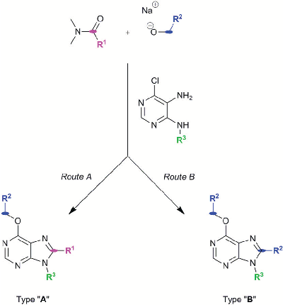

Scheme 1 Synthetic routes to generate purine types “A” or “B”. Size of R1 controls which synthetic mechanism is followed under the same reaction conditions.

dimethylacetamide, respectively. When steric hindrance of amides increase with the use of N,N-dimethylbenzamide or N,N-dimethylpropionamide, Route A is then impeded and a metal-free tandem alcohol oxidation/annulation reaction occurs giving rise to Route B products. In this case, the purine’s C8 substituent originates from the primary alcohols used in the reactions. Therefore, competition between alkoxyiminium formation and metal-free oxidative coupling of primary alkoxides and diaminopyrimidines with Schiff base formation and subsequent annulation can be controlled. In both routes, SNAr of the chloro atom at C6 by alkoxides takes place and, along with the R3 group of the starting pyrimidine, implements structural diversity in a one-pot reaction that overcomes the low yields found in some of the reactions. Fig. 1 shows the set of 18 purines presented here which were prepared by either Route A or B. Therefore, this synthetic platform allows creating a diversity of purine analogues in a parallel and straightforward fashion using a variety of amides and alcohols with different pyrimidines under the same reaction conditions.

2.2. Biological activity

2.2.1. Antiproliferative activity of compounds 5a–n and 6a–c. The panel of small molecules was incubated with two haematopoietic tumour cell lines: Jurkat (acute T cell leukaemia) and K562 (chronic erythroleukaemia). Cells were cultured for 48 h in the presence of increasing concentrations of each compound: 50 µM and 100 µM (ESI Fig. 1†) and 25 µM and 200 µM (not shown) and cell viability assessed by the MTT colorimetric screening assay. Results shown in ESI Fig. 1† are expressed as percentage of inhibition of cell proliferation calculated over the values obtained with untreated cells. Prolifer-

This article is licensed under aCreative Commons Attribution 3.0 Unported Licence.

Open Access Article. Published on 25 March 2015. Downloaded on 3/3/2024 11:33:17 PM.

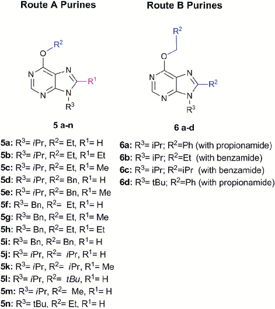

- Fig. 1 Set of 18 purines prepared through either Route A or B (see Scheme 1).

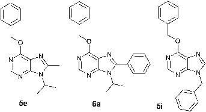

- Fig. 2 Structure of purine analogues 5e, 6a and 5i, which were chosen for detailed functional screening.

ation of Jurkat T cells was inhibited at levels close or superior to 50% by a number of the analogues (ESI Fig. 1†), whereas the K562 erythroleukaemic cells were significantly more resistant to the action of the compounds (not shown). From this initial set of data, a sub-pool of compounds which inhibited cell proliferation by 50% or more were chosen for further phenotypic characterization (5e, 5i, and 6a; Fig. 2). Interestingly, the three of them presented a benzoxy group at purine’s C6 position.

Dose–response curves in Jurkat and K562 cell lines were determined for the chosen derivatives and their IC50 values calculated (Table 1), highlighting compound 6a as the strongest antiproliferative hit. These IC50 demonstrate that K562 cells are more resistant than Jurkat cells to the antiproliferative

Table 1 IC50 values of indicated compounds assayed by inhibition of cell proliferationa

Compound Jurkat (µM) K562 (µM)

|5e|205|>500|
|---|---|---|
|5i 6a|152 63|>500 154|
|a IC50|values were calculated over a lineal regression|line of specific|

inhibition of proliferation values in a MTT assay of cells treated for 48 h with increasing amounts of compounds.

activity of the assayed compounds, thus confirming the general tendency of this library.

2.2.2. Study of the mechanism responsible for inhibiting cell proliferation. Cell cycle analyses were performed to determine whether the antiproliferative effect was a consequence of cell cycle arrest, induction of apoptosis, or death by necrosis. Jurkat and K562 cells were treated for 48 h with each compound (5e, 5i and 6a) at different concentrations and the cell cycle profile was determined by flow cytometry after staining of nuclear DNA with propidium iodide. Treatment of Jurkat cells with the chosen sub-library of compounds resulted in accumulation of cells within the sub-G1 region18 due to DNA fragmentation and, consequently, loss of nuclear DNA content, which is consistent with apoptotic populations. The three compounds induced cell death in Jurkat cells in a dosedependent manner (Fig. 3). Interestingly, the G0/G1 peak was greatly diminished after treatment of cells with our compounds, thus suggesting that no cell cycle arrest was involved.

Flow cytometry profiles of K562 cells (ESI Fig. 2†) showed a lower cell population accumulating within the sub-G1 region when comparing the effect induced by each compound to

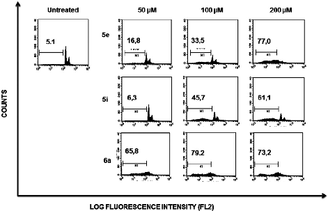

Fig. 3 Effect of compounds 5e, 5i and 6a on cell cycle. A representative experiment showing Jurkat cells incubated for 48 h in the presence of indicated compounds and doses. Cell cycle subpopulations were analyzed by flow cytometry after permeabilisation and staining of cells with propidium iodide. Additional controls containing equivalent amounts of DMSO used as drug vehicle were included, showing no toxicity in any case (not shown). Percentage of cells within the sub-G1 region are indicated in the plots.

This article is licensed under aCreative Commons Attribution 3.0 Unported Licence.

Open Access Article. Published on 25 March 2015. Downloaded on 3/3/2024 11:33:17 PM.

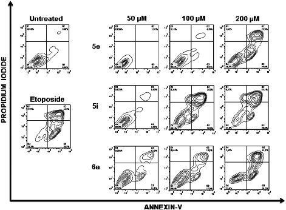

Fig. 4 Membrane phosphatidylserine expression after treatment of Jurkat cells with compounds 5e, 5i and 6a. Jurkat cells were treated for 48 h with the indicated compounds and doses and the percentages of apoptotic cells was measured by flow cytometry after double staining with propidium iodide and Annexin-V-Fluos. Dot plots represent the results of a typical experiment. Untreated cells and cells exposed to Etoposide were included as negative and positive controls.

those observed on Jurkat cells, suggesting that the former are more resistant to death induced by compounds 5e, 5i and 6a.

To further analyse the cell death mechanism(s) we used Annexin V, a calcium-dependent phospholipid-binding protein with a high affinity for phosphatidylserine (PS), which is a distinct feature of early stages of apoptosis.12 Fig. 4 shows a representative flow cytometry dot plot of double stained cells with propidium iodide and Annexin-V. As expected, untreated Jurkat cells (upper left-hand panel) presented a negligible apoptotic cell population (right-hand gates).

Etoposide was used as a positive inductor of apoptosis (lower left-hand panel), and two populations of cells arise after exposure to this agent: early apoptotic cells (Annexin-V+/PI−) and late apoptotic cells (Annexin-V+/PI+). In Jurkat cells treated with 5e, 5i and 6a at the indicated doses, transition behaviour from early to late apoptotic stages was observed, confirming that these compounds induce death cell by apoptosis in a dose-dependent manner (Fig. 4).

To address whether or not our compounds had a preferential activity on tumour cells, we directly compared their action on two cell lines belonging to the same lineage: Jurkat and N1, both CD4+ T cells. The latter cells are a long-term allospecific primary cell line established in our laboratory by weekly allostimulation of peripheral blood lymphocytes with the Class II+ Raji B cell line in the presence of rIL-2.24 We treated both cells with our compounds and assessed their effect on the cell cycle. Although these compounds, particularly 6a, have a discreet cytotoxic effect on primary T lymphocytes at high doses, the overall activity of our compounds is significantly lower on primary lymphocytes than that exerted over tumour cells (Fig. 5). Since primary T cells remain viable at low and inter-

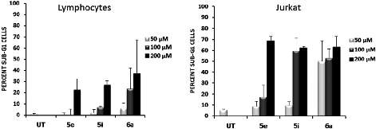

- Fig. 5 Effect of indicated compounds on primary lymphocytes and Jurkat cells. Primary cell line N1 and Jurkat cells were treated for 48 h at the indicated doses of compounds 5e, 5i and 6a and cell cycles were analysed by flow cytometry after staining with propidium Iodide. Graphs represent the mean ± S.D. of cells gated within the sub-G1 region obtained from three independent experiments. UT: Untreated.

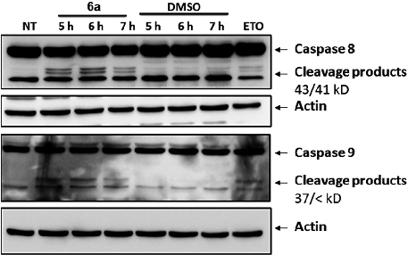

- Fig. 6 Study of early signaling events of apoptosis induced by compound 6a in Jurkat cells. Western Blot analysis of total lysates of Jurkat cells after treatment with either compound 6a (200 µM, left-hand lanes) or equivalent amount of vehicle (DMSO, right-hand lanes) for 5, 6 or 7 h. Membranes were probed with antibodies against initiator caspases 8 or 9, using actin as loading control. Cells treated with Etoposide were included as positive control. Arrows indicate cleavage products (43/41 kD bands for caspase 8 and 37/< kD bands for caspase 9), which are detected after caspase activation whereas upper bands correspond to native proteins. Similar results were obtained after treating cells with compounds 5e and 5i (not shown). NT: not treated.

mediate doses, this could be of importance in the event of a future therapeutic development of this family of compounds.

To gather further direct evidence that treatment of Jurkat cells with the selected compounds resulted in programmed cell death by apoptosis, caspase activation events were analysed by Western Blot.

Caspases are a series of cysteine-proteases that cleave certain proteins after specific aspartic acid residues.23 Caspases are expressed as inactive proenzymes that become activated after being cleaved by their preceding caspase in a cascade-like mechanism.16 Initiator caspases (8 and 9) trigger effector caspases (3, 6 and 7) and, therefore, cleavage of initiator caspases is an early event of the biochemical events leading to apoptosis. The appearance of cleavage products (Fig. 6) of caspases 8 and 9 indicates that apoptosis was trig-

This article is licensed under aCreative Commons Attribution 3.0 Unported Licence.

Open Access Article. Published on 25 March 2015. Downloaded on 3/3/2024 11:33:17 PM.

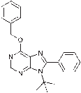

- Fig. 7 Structure of compound 6-benzyloxy-9-tert-butyl-8-phenyl-9Hpurine 6d.

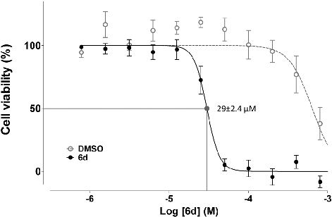

- Fig. 8 IC50 value of compound 6d in Jurkat cells as determined by inhibition of cell proliferation. A 11-point 1 : 2 serial dilution of compound

gered in cells treated with compound 6a. Similar effects were observed with compounds 5e and 5i (not shown).

2.2.3. Synthesis and biological evaluation of compound 6d. The pro-apoptotic activity of compound 6a prompted us to design and synthesize a new derivative, compound 6d (Fig. 7), by replacing the isopropyl group found at N9 position of the aromatic ring for a tert-butyl group. These groups are known to bind lipophilic pockets of enzymes, improving generally inhibiting activities of small-molecules. With this structure in mind, we decided to apply the novel one-pot synthetic route developed (Scheme 1, Route B) using benzyl alcohol, N,N-dimethylpropanamide and 5-amino-4-tert-butylamino-6-chloropyrimidine in the presence of NaH. Following synthesis, purification and characterization, Jurkat and K562 cells were incubated for 48 h with compound 6d and cell viability assessed by MTT. Evident dose-dependent curves of inhibition of cell proliferation were detected after exposure of cells to purine 6d, allowing calculation of its IC50 values against Jurkat (Fig. 8, solid points) and K562 cells on a 11-point 1 : 2 serial dilution, yielding values of 29 ± 2.4 µM for Jurkat and 120 ± 10 µM for K562.

6d, starting at 800 µM, was used to determine its IC50 value by the MTT assay after treatment of Jurkat cells for 48 h (solid circles). Equivalent amounts of DMSO used as vehicle in each dilution were set as negative controls (open circles). Results indicate percentages of cell proliferation over the results obtained with untreated cells. Data are expressed as mean ± SEM.

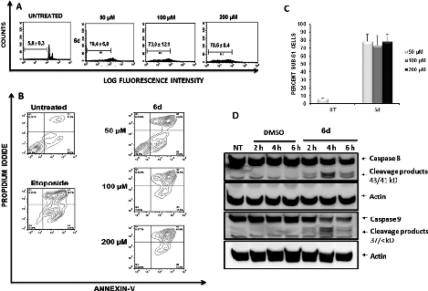

Fig. 9 (A) Effect of compound 6d on the cell cycle of Jurkat cells. Jurkat cells were treated for 48 h with 6d at indicated concentrations or their equivalent amounts of DMSO used as vehicle. Cells gated on the sub-G1 region after staining with propidium iodide are indicated. (B) Membrane phosphatidylserine expression after treatment of Jurkat cells with compound 6d. Jurkat cells were treated for 24 h with compound 6d and the indicated doses and the percentages of apoptotic cells was measured by flow cytometry after double staining with propidium iodide and Annexin-V-Fluos. Dot plots represent the results of a typical experiment. Untreated cells and cells exposed to Etoposide were included as negative and positive controls. (C) Percentages of apoptotic cells after treatment of Jurkat cells with compound 6d. Graph summarizes values of percentages of apoptotic cells and SEM obtained from three independent experiments. UT: Untreated. (D) Activation of initiator caspases 8 and 9 after cell treatment with compound 6d. Western Blot analysis of total lysates from Jurkat cells after treatment with either compound 6d (200 µM, right-hand lanes) or vehicle (DMSO, left-hand lines) for 2, 4 and 6 h. Membranes were probed with antibodies against initiator caspases 8 or 9, using actin as loading control. Arrows indicate cleavage products (43/41 kD bands for caspase 8 products and 37/< kD bands for caspase 9 ones) after caspase activation whereas upper bands correspond to native proteins (caspase 8 correspond to 55/57 kD band and caspase 9 to 45 kD band).

To determine the effects of the new compound, cell cycle analyses of Jurkat (Fig. 9, panel A) and K562 cells (ESI Fig. 3†) were carried out after exposure of cells to purine 6d. Treatment of Jurkat cells for 24 h resulted in cell death induction which was determined by the percentage of cells accumulated in the sub-G1 fraction (Fig. 9, panel A). Consistent with results obtained with compounds 5e, 6a and 5i, K562 cells showed increased resistance to induction of cell death after treatment with 6d (ESI Fig. 3†), which also agrees with the lower antiproliferative effect observed for this cell line.

As described above for other compounds, the mechanism by which 6d induces death in Jurkat cells was further studied. Again, Annexin-V flow cytometric analysis of cells treated with compound 6d (Fig. 9, panel B) showed a stronger apoptoticinduced effect than those triggered by compounds 5e, 5i and 6a (Fig. 4).

The capacity of compound 6d to induce activation of caspases was then assessed by Western Blotting (Fig. 9, panel C). Treatment of Jurkat cells with 6d for 2, 4 and 6 h yielded similar results to those shown in Fig. 5, clearly showing the

This article is licensed under aCreative Commons Attribution 3.0 Unported Licence.

Open Access Article. Published on 25 March 2015. Downloaded on 3/3/2024 11:33:17 PM.

expected cleavage products of both caspases 8 and 9 as early as 2 h of treatment.

To further confirm that the cytotoxic effect exerted by compound 6d was strictly dependent upon caspase activation, we pre-treated Jurkat cells with the pan-caspase inhibitor Q-VD-OPh, which is known to be a potent and irreversible blocker of cell death mediated by apoptosis with reduced toxicity.3 Fig. 10 shows that pre-treatment of Jurkat cells with the pan-caspase inhibitor inhibits almost completely apoptosis of Jurkat cells induced by compound 6d, as analysed by cell cycle staining with propidium iodide (Fig. 10 A, bottom panels). Furthermore, this effect is clearly specific as Western Blot analysis shows that the caspase-8 cleavage products strongly observed after treatment of Jurkat cells with compound 6d are absent in those cells pre-treated with the pan-caspase inhibitor (Fig. 10, panel B). As expected, cells treated with the Q-VD-OPh alone showed no toxicity (Fig. 10A, upper right panel).

These results are clear evidence that activation of caspases is an absolute requirement for the cytotoxic effect mediated by compound 6d, thereby confirming that cell death occurs by apoptosis.

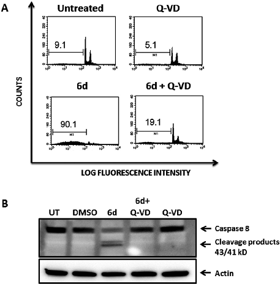

Fig. 10 Pre-treatment of Jurkat cells with the pan-caspase inhibitor Q-VD-OPh abrogates cell dead mediated by compound 6d. (A) Jurkat cells were pre-treated for 1 h with 50 µM of the Q-VD-OPh pan-caspase inhibitor and cultured thereafter for 24 h in the presence of 200 µM of compound 6d (bottom left panel). Controls include untreated cells (upper left panel); cells treated with Q-VD-OPh alone (upper right panel) or only with compound 6d (bottom left panel). Cells were stained with propidium iodide and cell cycles analysed by flow cytometry. Percentages of cells within the sub-G1 region are indicated in the plots. (B) Western Blot analysis of caspase-8 activation. The same cultures of cells examined in Panel A were collected 8 h after treatment with compound 6d and cytosolic lysates were resolved by SDS-PAGE and membranes probes with the anti-caspase 8 mAb. Actin was used as loading control. UT: Untreated.

Table 2 IC50 values of indicated compounds calculated as inhibition of DAPK1 enzymatic activity

|Compound|DAPK1 (µM)|
|---|---|
|5e 5i 6a 6d|23 5.9 NDa 2.5|
|a The IC50 curve for 6a against|DAPK1 presented a Gaussian profile,|

which suggested inconsistent solubility of this compound and therefore impeded a precise calculation of the IC50 dose in this system (see ESI Fig. 4–7). Whereas both 6a and 6d present very similar c log P values, the added steric behavior of tert-butyl groups was expected to also influence its solubility properties. Furthermore, the sigmoid curve obtained on the MTT assay (Fig. 6) is a strong indication of the improved solubility of compound 6d.

2.2.4. Kinase screening assay. Since both cell cycle studies and caspase 8/9 activation demonstrated that the chosen subfamily of compounds triggered apoptosis, a panel of kinases from the human kinome were selected. The selection criteria were based on their known involvement in apoptotic processes. Both 5e and 6a purines were chosen as representative compounds to perform the assay in order to see if this family of purines, presenting a benzoxy group at C6 position, were capable of inhibiting kinases. Hence, 96 recombinant kinases were used to run a 33P-radiolabeled kinase assay profiling using a single-dose duplicate mode at a 10 µM purine concentration with 10 μM ATP. Surprisingly, just one kinase out of the 96 tested showed a significant reduction in kinase activity by both compounds. This kinase was Death Associated Protein Kinase-1 (DAPK1) which presented a percentage of activity of 50.9% and 44.3% when incubated with compounds 5e and 6a, respectively. Compounds 5e, 5i, 6a and 6d purines were then tested against DAPK1 via a 33P-radiolabeled kinase assay using 10-doses to determine their IC50 (DAPK1) values (Table 2).

This assay revealed that our compounds inhibited DAPK1 at the low micromolar level. This result is remarkable since an elegant analysis where 178 small-molecules kinase inhibitors were assayed against 300 recombinant protein kinases1 showed that DAPK1 has 0.03 as Selective Score 50, one of the lowest for any of the kinases included in that study. This meant that just 5 out of the 178 compounds tested at 10 µM by this group against DAPK1 inhibited this kinase more than 50%, evidence of how unusual it is to hit this target. Moreover, these 5 compounds were very promiscuous, targeting many other kinases. While more studies are needed in order to link their pro-apoptotic features with their DAPK1 inhibition, our results indicate that these derivatives do not inhibit other kinases known to be involved in apoptotic events. Furthermore, our data supports recent findings by Schneider–Stockemail4 that for the first time reported that selective inhibition of DAPK1, an enzyme that plays a critical role in interferonγ-mediated apoptosis,5–7,27 might impinge upon the biology of tumour cells via STAT3 activation. The relevant role of DAPK1 in pro-apoptotic pathways is underlined by the fact that many

This article is licensed under aCreative Commons Attribution 3.0 Unported Licence.

Open Access Article. Published on 25 March 2015. Downloaded on 3/3/2024 11:33:17 PM.

chronic lymphocytic leukaemia cells down-regulate the expression of the protein to favour tumour progression.11,20 Our findings, as well as those of Schneider–Stockemail,4 may thus be surprising if we only view DAPK1 as a pro-apoptotic kinase. The pro-apoptotic activity of the enzyme requires the integrity of the Death Domain,6 but growing evidence indicates that post-transcriptional modifications may confer opposing functions to the protein. For instance, autophosphorylation restrains the apoptotic activity of members of the DAPK family22 and disruption of the cathepsin B-DAPK1 interaction breaks a multiprotein complex whose perturbation sensitizes cells to apoptosis.13 Since our compounds have a preferential activity on Jurkat cells when compared to K562, a cell line with low expression of DAPK-1, it can be speculated that the mechanism of action for the observed pro-apoptotic effects after inhibiting DAPK1 activity may be related to posttranscriptional mechanisms resulting in sensitizing treated cells to death by apoptosis. The precise mechanisms involved, however, need further investigations which will answer the question of whether targeting DAPK1 is a sound strategy for the treatment of certain types of tumours.

## 3. Conclusions

To overcome the disadvantages of target-centric drug discovery strategies and promote a more empirical, evidence-led, approach to anticancer drug discovery, novel derivatives were directly tested in disease relevant leukemia cell lines. In order to obtain purine analogues, novel chemistry pathways developed by our group and based on one-pot synthesis were carried out. The novel chemistry allows obtaining 6,8,9 poly-substituted purines starting from diamino-pyrimidines and a range of different primary alcohols and amides. Following this approach, a series of 18 purine analogues exhibiting antiproliferative activity and pro-apoptotic properties on the acute T cell leukemia Jurkat cell line were identified, all of them having a benzyloxy group at C6 position and 9-tert-butyl6-(benzyloxy)-8-phenyl-9H-purine (6d) being the most active one displaying a IC50 value of 29 µM on Jurkat cells. Cell cycle analyses, Annexin-V staining, cleavage of initiator caspases and blocking of the cytotoxic effects after pre-incubation of cells with a pan-caspase inhibitor are cumulative evidence clearly showing that cell death was induced by apoptosis. Finally, to assess if their pro-apoptotic activities were due to inhibition of multiple kinases, 96 kinases known to be involved in apoptosis processes were assayed against these purines. Surprisingly, just one kinase, DAPK1, was inhibited at significant levels, with the 6d purine compound being the one showing the lowest IC50_DAPK1 (2.5 µM). Compound 6d is therefore the first selective inhibitor of DAPK1. Since all other available inhibitors target multiple protein kinases, this makes it difficult to dissect precisely the role of DAPK1 on certain biological processes. Among these, growing evidence of the role of DAPK128 on cancer processes is appearing and our results tend to support this. Therefore, the use of a selective inhibitor

could shed light on the exact participation of DAPK1 in tumor development. Furthermore, the fact that primary T lymphocytes are relatively refractory to cytotoxicity induced by our compounds makes it worthwhile to pursue further studies aiming to explore DAPK1 as a potential therapeutic target in certain tumors.

## 4. Experimental procedures

4.1. Synthesis and characterization of compounds

- 4.1.1. General. Reaction courses and products mixtures were routinely monitored by TLC on silica gel (Merck 60–200 mesh). Melting points were determined on a Stuart Scientific SMP3 apparatus and are uncorrected. 1H-NMR spectra were obtained in CDCl3, CD3OD solutions on a Varian Inova Unity (300 MHz) and Varian Direct Drive (400 MHz and 500 MHz). Chemical shifts (δ) are given in ppm upfield from tetramethylsilane. 13C-NMR spectra were obtained in CDCl3, CD3OD solutions on a Varian Direct Drive (125 MHz). All products reported showed 1H-NMR and 13C-NMR spectra in agreement with the assigned structures. Mass spectra were obtained by electrospray (ESY) with a LCT Premier XE Micromass Instrument (high resolution mass spectrometry).
- 4.1.2. General procedure for the preparation of compounds 4(a–c). To commercially available 4,6-dichloro-5-nitropyrimidine (10 mmol, 1 equiv.), in anhyd. THF (15 ml) was added NaHCO3 (11 mmol, 1.1 equiv.). The mixture was then heated to 55 °C and at this temperature the appropriate amine (11 mmol, 1.1 equiv.) dissolved in THF was added dropwise. After 1 h, the mixture was cooled at room temperature, filtered and evaporated to give a crude product, which was directly used for the next step without purification.

This crude solution (5 mmol, 1 equiv.) in EtOH (10 ml) containing SnCl2·2H2O (25 mmol, 5 equiv.), was refluxed for 1 h, monitoring the reaction by TLC. The mixture was then cooled at room temperature and NaHCO3 was added until pH 8 was reached. After two extractions with EtOAc (10 ml for each one), the organic phase was washed with an aq. saturated solution of NaCl (2 × 25 mL) and dried with Na2SO4. Evaporation under vacuum gave a solid that was purified by column chromatography eluting with ethyl acetate–petroleum ether solutions.

- 4.1.2.1. 5-Amino-6-chloro-4-isopropylaminopyrimidine (4a). White solid, yield 73%; mp 185–186 °C. δH (400.58 MHz, CDCl3): 8.08 (1H, s, NCHN), 4.68 (1H, bs, NH), 4.29 (1H, m, CH(CH3)2), 3.33 (2H, bs, NH2), 1.27 (6H, d, J = 8, CH(CH3)2.
- 4.1.2.2. 5-Amino-4-tert-butylamino-6-chloropyrimidine (4b). White solid; yield 75%; mp 135 °C. δH (499.79 MHz, CDCl3): 8.03 (1H, s, NCHN), 4.87 (1H, bs, NH), 3.45 (2H, bs, NH2), 1.47 (9H, s, C(CH3)3). ES+HRMS: Calculated M + H = 201.0907. C8H14N4Cl. Obtained: 201.0909.
- 4.1.2.3. 5-Amino-4-benzilamino-6-chloropyrimidine (4c). White solid; yield 65%; mp 205–206 °C. δH (499.79 MHz, CD3OD): 7.78 (1H, s, NCHN), 7.35–7.22 (5H, m, Ph), 4.69 (2H, s, CH2Ph). δC (125.68 MHz, CDCl3): 150.13, 142.76, 137.79,

This article is licensed under aCreative Commons Attribution 3.0 Unported Licence.

Open Access Article. Published on 25 March 2015. Downloaded on 3/3/2024 11:33:17 PM.

132.02, 131.18, 130.72, 127.49, 48.51. ES+HRMS: Calculated M + H = 235.0750. C11H12N4Cl. Obtained: 235.0753.

4.1.3. General procedure for the preparation of compounds 5(a–n). Synthesis A. A suspension of NaH (50%) in mineral oil (3.7 mmol, 10 equiv.) was dissolved in a mixture cooled at 0 °C constituted both from the appropriate alcohol (3.7 mmol, 10 equiv.) and amide (18.5 mmol, 50 equiv.). The solution was stirred at room temperature for 30 min and then at 90 °C for the same time. At 90 °C compounds 4(a–c) (0.37 mmol, 1 equiv.), dissolved in the appropriate amide (18.5 mmol, 50 equiv.) were added dropwise and the mixture heated for 24 h. The reaction mixture, quenched to pH 7 with an aq. saturated NH4Cl solution, was then extracted with CH2Cl2 (3 × 15 mL), the combined organic extracts dried (Na2SO4) and the solvent evaporated. The residue was chromatographed on silica gel using ethyl acetate–petroleum ether solutions.

4.1.3.1. 6-Ethoxy-9-isopropyl-9H-purine (5a). Light yellow solid; yield 44%. δH(499.79 MHz, CDCl3): 8.49 (1H, s, NCHN), 7.96 (1H, s, NHCHN), 4.88 (1H, m, CH(CH3)2), 4.64 (2H, q, J =

- 5 Hz, OCH2CH3), 1.60 (6H, d, J = 5 Hz, NCH(CH3)2), 1.49 (3H, t, J = 5 Hz, OCH2CH3). δC(125.68 MHz, CDCl3): 160.81, 151.70, 139.53, 121.83, 62.98, 47.33, 22.60, 14.51. ES+HRMS: Calcu-

lated M + H = 207.1246. C10H15N4O. Obtained: 207.1245.

4.1.3.2. 6-Ethoxy-8-ethyl-9-isopropyl-9H-purine (5b). Yellow viscous oil; yield 10%. δH(300.20 MHz, CDCl3): 8.47 (1H, s, NCHN), 4.72 (1H, m, CH(CH3)2), 4.67 (2H, q, J = 6 Hz, OCH2CH3), 2.96 (2H, q, J = 6, CH2CH3), 1.74 (6H, d, J = 6 Hz, NCH(CH3)2), 1.53 (3H, t, J = 6 Hz, OCH2CH3), 1.47 (3H, t, J =

- 6 Hz, –CH2CH3). ES+HRMS: Calculated M + H = 235.1559.

C12H19N4O. Obtained: 235.1557.

4.1.3.3. 6-Ethoxy-9-isopropyl-8-methyl-9H-purine (5c). Yellow viscous oil; yield 10%. δH(499.79 MHz, CDCl3): 8.44 (1H, s, NCHN), 4.72 (1H, m, CH(CH3)2), 4.62 (2H, q, J = 10 Hz, OCH2CH3), 2.64 (3H, s, CH3), 1.68 (6H, d, J = 5 Hz, NCH (CH3)2), 1.50 (3H, t, J = 10 Hz, OCH2CH3). δC(125.68 MHz, CDCl3): 159.74, 153.15, 151.75, 150.53, 120.71, 62.67, 48.31,

- 21.24, 15.22, 14.58. ES+HRMS: Calculated M + H = 221.1402. C11H17N4O. Obtained: 221.1396.

- 4.1.3.4. 6-(Benzyloxy)-9-isopropyl-9H-purine (5d). White

solid; yield 38%; mp 167–169 °C. δH(499.79 MHz, CDCl3): 8.56 (1H, s, NCHN), 8.00 (1H, s, NHCHN), 7.56–7.30 (5H, m, Ph),

- 5.69 (2H, s, OCH2Ph), 4.91 (1H, m, CH(CH3)2), 1.64 (6H, d, J = 10 Hz, NCH(CH3)2). δC(125.68 MHz, CDCl3): 160.53, 151.63, 139.77, 136.27, 130.03, 128.41, 128.29, 128.05, 68.29, 47.43,

- 22.63. ES+HRMS: Calculated M + H = 269.1402. C15H17N4O. Obtained: 269.1402.

- 4.1.3.5. 6-(Benzyloxy)-9-isopropyl-8-methyl-9H-purine (5e). White solid; yield 16%. δH(499.79 MHz, CDCl3): 8.47 (1H, s, NCHN), 7.54–7.30 (5H, m, Ph), 5.65 (2H, s, OCH2Ph), 4.75 (1H, m, CH(CH3)2), 2.65 (3H, s, CH3), 1.69 (6H, d, J = 10 Hz, NCH(CH3)2). δC(125.68 MHz, CDCl3): 159.41, 153.57, 150.69, 150.41, 136.42, 128.43 128.35, 127.98, 120.73, 68.06, 48.35, 21.23, 15.22. ES+HRMS: Calculated M + H = 283.1559. C16H19N4O. Obtained: 283.1558.
- 4.1.3.6. 9-Benzyl-6-ethoxy-9H-purine (5f). White solid; yield 62%; mp 133–135 °C. δH(499.79 MHz, CDCl3): 8.55 (1H, s,

NCHN), 7.88 (1H, s, NHCHN), 7.34–7.28 (5H, m, Ph), 5.41 (2H, s, CH2Ph), 4.66 (2H, q, J = 10 Hz, OCH2CH3), 1.51 (3H, t, J = 10 Hz, OCH2CH3). δC(125.68 MHz, CDCl3): 160.93, 152.33, 141.81, 135.34, 129.08, 128.27, 127.75, 121.39, 63.16, 47.42, 14.53. ES+HRMS: Calculated M + H = 255.1246 C14H15N4O. Obtained: 255.1252.

4.1.3.7. 9-Benzyl-6-ethoxy-8-methyl-9H-purine (5g). White solid; yield 41%; mp 56–58 °C. δH(499.79 MHz, CDCl3): 8.50

- (1H, s, NCHN), 7.32–7.13 (5H, m, Ph), 5.40 (2H, s, CH2Ph), 4.65
- (2H, q, J = 10 Hz, OCH2CH3), 2.51 (3H, s, CH3), 1.51 (3H, t, J = 10 Hz, OCH2CH3). δC(125.68 MHz, CDCl3): 159.83, 153.55, 151.51, 151.42, 135.49, 128.98, 128.10, 126.92, 120.33, 62.95, 46.08, 14.58, 14.39. ES+HRMS: Calculated M + H = 269.1402

C15H17N4O. Obtained: 269.1396.

4.1.3.8. 9-Benzyl-6-ethoxy-8-ethyl-9H-purine (5h). White viscous oil; yield 2%. δH(499.79 MHz, CDCl3): 8.50 (1H, s, NCHN), 7.31–7.12 (5H, m, Ph), 5.43 (2H, s, CH2Ph), 4.68 (2H, q, J = 10 Hz, OCH2CH3), 2.80 (2H, q, J = 10 Hz, CH2CH3), 1.53

- (3H, t, J = 10 Hz, OCH2 CH3), 1.27 (3H, t, J = 10 Hz, CH2CH3). ES+HRMS: Calculated M + H = 283.1559 C16H19N4O. Obtained: 283.1560.

- 4.1.3.9. 9-Benzyl-6-(benzyloxy)-9H-purine (5i). White solid;

yield 30%. δH(499.79 MHz, CDCl3): 8.59 (1H, s, NCHN), 7.90 (1H, s, NHCHN), 7.57–7.28 (10H, m, Ph), 5.70 (2H, s, OCH2Ph),

- 5.43 (2H, s, CH2Ph). δC(125.68 MHz, CDCl3): 161.51, 153.09, 142.91, 137.06, 136.17, 129.98, 129.72, 129.40, 129.31, 129.23, 128.99, 128.65, 127.84, 122.32, 69.31, 48.35. ES+HRMS: Calcu-

lated M + H = 317.1402. C19H17N4O. Obtained: 317.1407.

- 4.1.3.10. 6-Isopropoxy-9-isopropyl-9H-purine (5j). Yellow viscous oil; yield 10%. δH(300.20 MHz, CDCl3): 8.54 (1H, s, NCHN), 7.99 (1H, s, NHCHN), 5.70 (1H, m, OCH(CH3)2), 4.91 (1H, m, NCH(CH3)2), 1.66 (6H, d, J = 6 Hz, OCH(CH3)2), 1.51 (6H, d, J = 6 Hz, NCH(CH3)2). δC(125.68 MHz, CDCl3): 160.84, 151.87, 150.40, 139.60, 121.83, 70.68, 47.55, 22.89, 22.05. ES+HRMS: Calculated M + H = 221.1402. C11H17N4O. Obtained: 221.1402.
- 4.1.3.11. 6-Isopropoxy-9-isopropyl-8-methyl-9H-purine (5k). Yellow viscous oil; yield 12%. δH(300.20 MHz, CDCl3): 7.99 (1H, s, NCHN), 5.70 (1H, m, OCH(CH3)2), 4.91 (1H, m, NCH(CH3)2), 2.07 (3H, s, CH3), 1.71 (6H, d, J = 6 Hz, OCH(CH3)2), 1.49 (6H, d, J = 6 Hz, NCH(CH3)2). ES+HRMS: Calculated M + H = 235.1559.C12H19N4O. Obtained: 235.1553.
- 4.1.3.12. 6-tert-butoxy-9-isopropyl-9H-purine (5l). Yellow viscous oil; yield 15%. δH(300.20 MHz, CDCl3): 8.51 (1H, s, NCHN), 7.95 (1H, s, NHCHN), 4.90 (1H, m, NCH(CH3)2), 1.78 (9H, s, C(CH3)3), 1.65 (6H, d, J = 6 Hz, OCH(CH3)2). ES+HRMS: Calculated M + H = 235.1559. C12H19N4O. Obtained: 235.1563.
- 4.1.3.13. 9-Isopropyl-6-methoxy-9H-purine (5m). White viscous oil; yield 10%. δH(400.57 MHz, CDCl3): 8.53 (1H, s, NCHN), 7.98 (1H, s, NHCHN), 4.89 (1H, m, CH(CH3)2), 4.18 (3H, s, OCH3), 1.63 (6H, d, J = 4 Hz, NCH(CH3)2). δC(125.68 MHz, CDCl3): 161.19, 152.25, 151.86, 139.89, 122.07, 54.26, 47.63, 22.78. ES+HRMS: Calculated M + H = 193.1089. C9H13N4O. Obtained: 193.1087.
- 4.1.3.14. 9-tert-butyl-6-ethoxy-9H-purine (5n). White solid; yield 57%. δH(300.20 MHz, CDCl3): 8.49 (1H, s, NCHN), 7.97

This article is licensed under aCreative Commons Attribution 3.0 Unported Licence.

Open Access Article. Published on 25 March 2015. Downloaded on 3/3/2024 11:33:17 PM.

(1H, s, NHCHN), 4.64 (2H, q, OCH2CH3), 1.80 (9H, s, NC(CH3)3), 1.50 (3H, t, OCH2CH3). δC(75.49 MHz, CDCl3): 161.22, 151.20, 139.87, 123.16, 63.10, 29.30, 14.80. ES+HRMS: Calculated M + H = 221.1402. C11H17N4O. Obtained: 221.1400.

4.1.4. General procedure for the preparation of compounds 6(a–d). Synthesis B. A suspension of NaH (50%) in mineral oil (3.7 mmol, 10 equiv.) was dissolved in a mixture cooled at 0 °C constituted both for appropriate alcohol (3.7 mmol, 10 equiv.) and appropriate corresponding N,N-dimethylamide (18.5 mmol, 50 equiv.), when the amide is liquid, or the mixture is dissolved in dioxane, when the amide is solid. The solution was stirred at room temperature for 30 min and then at 90 °C for the same time. At 90 °C compound 4(a–b) (0.37 mmol, 1 equiv.), dissolved in the amide (18.5 mmol, 50 equiv.) or in dioxane was added dropwise and the mixture heated for 24 h. The reaction mixture, quenched to pH 7 with an aq. saturated NH4Cl solution, was then extracted with CH2Cl2 (3 × 15 mL), the combined organic extracts dried (Na2SO4) and the solvent evaporated. The residue was chromatographed on silica gel using ethyl acetate–petroleum ether solutions.

- 4.1.4.1. 6-Benzyloxy-9-isopropyl-8-phenyl-9H-purine (6a). White solid; yield 24%. δH(300.20 MHz, CDCl3): 8.57 (1H, s, NCHN), 7.70–7.38 (10H, m, Ph, CH2Ph), 5.72 (2H, s, OCH2Ph), 4.80 (1H, m, CH(CH3)2), 1.76 (6H, d, J = 6 Hz, NCH(CH3)2). δC(125.68 MHz, CDCl3): 160.54, 153.14, 151.01, 136.66, 130.40, 129.80, 128.95, 128.76, 128.61, 128.27, 128.05, 122.14, 68.42, 50.04, 21.51. ES+HRMS: Calculated M + H = 345.1715. C21H21N4O. Obtained: 345.1716.
- 4.1.4.2. 8-Ethyl-9-isopropyl-6-propoxy-9H-purine (6b). Yellow viscous oil; yield 20%. δH(300.20 MHz, CDCl3): 8.43 (1H, s, NCHN), 4.69 (1H, m, CH(CH3)2), 4.52 (2H, t, J = 9 Hz, OCH2CH2CH3), 2.94 (2H, q, J = 6 CH2CH3), 1.92 (2H, m, OCH2CH2CH3), 1.70 (6H, d, J = 10 Hz, NCH(CH3)2), 1.43 (3H, t, J = 6 Hz, CH2CH3), 1.05 (3H, t, J = 9, OCH2CH2CH3). δC(125.68 MHz, CDCl3): 160.28, 155.28, 150.65, 150.31, 124.41, 68.65, 48.57, 21.24, 23.13, 22.49, 21.51, 12.49, 10.66. ES+HRMS: Calculated M + H = 249.1715. C13H21N4O. Obtained: 249.1721.
- 4.1.4.3. 6-Isobutoxy-8,9-diisopropyl-9H-purine (6c). White solid; yield 22%. δH(300.20 MHz, CDCl3): 8.44 (1H, s, NCHN), 4.74 (1H, m, NCH(CH3)2), 4.36 (2H, d, OCH2Pri, J = 9 Hz), 3.28 (1H, m, CCH(CH3)2), 2.29 (1H, m, CH2CH(CH3)2), 1.72 (6H, d, J = 9 Hz, NCH(CH3)2), 1.47 (6H, d, J = 9 Hz, CCH(CH3)2), 1.06 (6H, d, J = 9 Hz, CH2CH(CH3)2). ES+HRMS: Calculated M + H = 277.2028. C15H25N4O. Obtained: 277.2036.
- 4.1.4.4. 9-tert-butyl-6-(benzyloxy)-8-phenyl-9H-purine (6d). White solid; yield 45%. δH(300.20 MHz, CDCl3): 8.59 (1H, s, NCHN), 7.58–7.34 (10H, m, Ph, CH2Ph), 5.69 (2H, s, OCH2Ph), 1.70 (9H, s, NC(CH3)3). δC(125.68 MHz, CDCl3): 160.62, 154.52, 153.37, 150.46, 136.58, 134.97, 130.11, 129.72, 128.85, 128.59, 128.27, 128.09, 121.76, 68.43, 61.06, 31.15. ES+HRMS: Calculated M + H = 359.1872. C22H23N4O. Obtained: 359.1880.

4.2. Cells and culture

Jurkat (acute T cell leukemia) and K562 (chronic erythroleukaemia) cell lines were cultured at 37 °C in a humidified atmosphere of 5% CO2 in RPMI 1640 medium (BioWhittaker, Verviers, Belgium) supplemented with 10% Fetal Bovine Serum (Gibco, Auckland, New Zealand) and 1% Glutamax (Gibco) and Penicillin-Streptomycin (BioWhittaker). The N1 cell line are long-term primary CD4+ T lymphocytes derived from a normal individual24 and expanded by weekly stimulation of Mytomicin-C treated Class II+ Raji B lymphoma cells in the presence of 50 U.I. ml−1 of rIL-2 (kindly provided by the National Institutes of Health’s AIDS Reagent Program, Bethesda, MD) as described in detail elsewhere.17

- 4.2.1 Cell proliferation assay. To analyze 5e, 5i and 6a

activity, cells were cultured in 96-well microtiter plates (50 000 cells per well) and treated for 48 h with the library of compounds at increasing concentrations (25, 50, 100 and 200 μM). Cell proliferation was measured with the MTT (3-[4-5 dimethylthiazol-2-7P]-2,5-diphenyl tetrazolium bromide: thiazolyl blue) (Sigma) colorimetric assay as described in detail elsewhere,21 and results are expressed as percentage of inhibition calculated over the values obtained with untreated cells and corrected for the non-specific effect of the amounts of DMSO contained in each sample of the compounds. Data are represented as mean ± standard deviation of the different experiments.

To analyze 6d activity, each well of a 96-well tissue culture plate containing 50 µL from serial doubling dilutions of 6d compound was inoculated with 50 µL of previously prepared cell culture at 20 000 cells mL−1, with the exception of two rows, which received medium only. Eleven different final concentrations of each compound, ranging from 0.8–800 µM, were tested in the assay. Each concentration point was assayed in three replicates, and experiments were repeated at least three times. The same volume of DMSO, 6d solvent, used in each concentration point was assayed in parallel as control. The IC50 value was calculated using GraphPad Prism5 software.

- 4.3. Analysis of cell cycle and Western Blotting

For the analysis of cell cycle, 250 000 cells per well were cultured in 24-well plates and incubated with the chosen compounds at the indicated doses for 48 h, as described elsewhere.21 After treatment with the compounds, cells were collected, fixed with 70% cold ethanol for 5 min at 4 °C and then incubated with DNA extraction buffer (0.2 M Na2HPO4 and 0.004 M citric acid) at 37 °C for 10 min. Subsequently, cells were re-suspended in PBS containing 100 µg ml−1 RNase and 40 µg ml−1 propidium iodide (PI) and incubated at 37 °C for 30 min in the dark. Quantitative analysis of cells with subG1 DNA content was carried out in a FACScan flow cytometer using the Cell Quest software (BD Biosciences). Data are expressed as mean ± Standard Error Mean (SEM) of three different experiments. For the analysis of caspase activation, cells were treated with compounds at 200 μM for the indicated times and lysed in 150 mM NaCl, 50 mM Tris-Cl pH 8.0, 1%

This article is licensed under aCreative Commons Attribution 3.0 Unported Licence.

Open Access Article. Published on 25 March 2015. Downloaded on 3/3/2024 11:33:17 PM.

NP-40 and protease inhibitors for 30 min. Lysates were resolved by SDS-PAGE as described, blotted onto PVDF membranes, blocked for 1 h and hybridized overnight with predetermined optimal concentrations of monoclonal antibodies against human caspase-9 (R&D Systems; Minneapolis, MN) and caspase-8 (Alexis Biochemicals; San Diego, CA). Membranes were washed, incubated for 1 h with an HRP-labelled goat anti-mouse antibody and revealed by chemiluminescence (ECL Advance Western Blotting Detection Kit, Amersham, GE Healthcare UK). Light emission was detected with a digital imaging system (Fujifilm Image Analyzer LAS-4000, Tokyo, Japan) and analyzed with the Multi Gauge software. Where indicated, cells were pre-treated with the Pan Caspase OPH Inhibitor Q-VD (Q-Val-Asp(non-omethylated)-OPh) (R&D systems, Minneapolis, MN) for 1 h prior to adding compound 6d and maintained throughout the culture.

- 4.4. Annexin-V staining

For the analysis of phosphatidylserine exposure, 250 000 cells per well were cultured in 24-well plates and incubated with the chosen compounds at the indicated doses for 48 h, as described above. Etoposide was used as positive control and untreated cells were used as controls of live cells. After treatment, cells were collected and washed with annexin V binding buffer (10 mM HEPES pH 7.4, 140 mM NaCl, 2.5 mM CaCl2) and re-suspended in 100 µl of this buffer. Then, 2.5 µl of Annexin V-FLUOS solution (Roche, Mannheim, Germany) was added to each sample, followed by incubation for 20 min in the dark at room temperature. After a final wash, the pellet was re-suspended in annexin V binding buffer containing 10 µl of PI at 10 µg ml−1. Stained samples were immediately analyzed by flow cytometry using a FACSCalibur flow cytometer. Data were analyzed with the FlowJo software.

- 4.5. In vitro kinase screening assay

A panel of 96 recombinant kinases (see ESI†) was used to run a 33P-radiolabeled kinase assay profiling against compounds 5e, 6a and 5i by Reaction Biology Corp. (Malvern, PA) according to their established procedures. Compounds were tested in a single-dose duplicate mode at a concentration of 10 µM. Reactions were carried out at 10 μM ATP. Compounds were tested in a 10-dose IC50 mode with 2-fold serial dilution starting at 200 μM using the same P33-radiolabeled kinase assay as before to determine their IC50 values against DAPK1 and DAPK2.

## Author contributions

MJPI, AUB and JJDM designed the compounds and their syntheses. MJPI synthesized and characterized the compounds. STR, PFD and JDUB carried out or contributed to the biological experiments. MAG contributed with reagents. MALG, MPI, AUB and JJDM analyzed the chemical data. AUB, JJD and IJM interpreted the biological data and wrote the paper. IJM and JJDM directed the work.

## Acknowledgements

We thank undergraduate students Alvaro Lorente Macias and Pilar Aguilar Martinez for their help with basic laboratory techniques. JJDM thanks the Spanish Ministerio de Economia y Competitividad for funding a Ramon y Cajal Fellowship. AUB thanks Medical Research Council UK – Institute of Genetics and Molecular Medicine for funding an Academic Fellowship. We acknowledge the generous supply of rIL-2 provided by the National Institutes of Health AIDS Reagent Program. IJM is grateful for the support provided to his laboratory by grant 12UDG01-ATF from Sparks, the children’s medical charity, London, UK.

## References

- 1 T. Anastassiadis, S. W. Deacon, K. Devarajan, H. Ma and J. R. Peterson, Nat. Biotechnol., 2011, 29, 1039–1045.
- 2 P. G. Baraldi, A. Unciti-Broceta, M. J. Pineda de las Infantas, J. J. Díaz-Mochón, A. Espinosa and R. Romagnoli, Tetrahedron, 2002, 58, 7607–7611.
- 3 T. M. Caserta, A. N. Smith, A. D. Gultice, M. A. Reedy and T. L. Brown, Apoptosis, 2003, 8, 345–352.
- 4 S. Chakilam, M. Gandesiri, T. T. Rau, A. Agaimy, M. Vijayalakshmi, J. Ivanovska, R. M. Wirtz, J. SchulzeLuehrmann, N. Benderska, N. Wittkopf, A. Chellappan, P. Ruemmele, M. Vieth, M. Rave-Frank, H. Christiansen, A. Hartmann, C. Neufert, R. Atreya, C. Becker, P. Steinberg and R. Schneider-Stock, Am. J. Pathol., 2013, 182, 1005– 1020.
- 5 O. Cohen, E. Feinstein and A. Kimchi, EMBO J., 1997, 16, 998–1008.
- 6 O. Cohen, B. Inbal, J. L. Kissil, T. Raveh, H. Berissi, T. Spivak-Kroizaman, E. Feinstein and A. Kimchi, J. Cell Biol., 1999, 146, 141–148.
- 7 L. P. Deiss, E. Feinstein, H. Berissi, O. Cohen and A. Kimchi, Genes Dev., 1995, 9, 15–30.
- 8 M. Hojjat-Farsangi, Int. J. Mol. Sci., 2014, 15, 13768–13801.
- 9 H. Huang, J. Ma, J. Shi, L. Meng, H. Jiang, J. Ding and H. Liu, Bioorg. Med. Chem., 2010, 18, 4615–4624.
- 10 L. P. Jordheim, D. Durantel, F. Zoulim and C. Dumontet, Nat. Rev. Drug Discovery., 2013, 12, 447–464.
- 11 J. L. Kissil, E. Feinstein, O. Cohen, P. A. Jones, Y. C. Tsai, M. A. Knowles, M. E. Eydmann and A. Kimchi, Oncogene, 1997, 15, 403–407.
- 12 G. Koopman, C. P. Reutelingsperger, G. A. Kuijten, R. M. Keehnen, S. T. Pals and M. H. van Oers, Blood, 1994, 84, 1415–1420.
- 13 Y. Lin, C. Stevens and T. Hupp, J. Biol. Chem., 2007, 282, 16792–16802.
- 14 Y. Liu and N. S. Gray, Nat. Chem. Biol., 2006, 2, 358–364.
- 15 G. Manning, D. B. Whyte, R. Martinez, T. Hunter and S. Sudarsanam, Science, 2002, 298, 1912–1934.
- 16 D. R. McIlwain, T. Berger and T. W. Mak, Cold Spring Harbor Perspect. Biol., 2013, 5, a008656.

This article is licensed under aCreative Commons Attribution 3.0 Unported Licence.

Open Access Article. Published on 25 March 2015. Downloaded on 3/3/2024 11:33:17 PM.

- 17 I. J. Molina, D. M. Kenney, F. S. Rosen and E. RemoldO’Donnell, J. Exp. Med., 1992, 176, 867–874.
- 18 I. Nicoletti, G. Migliorati, M. C. Pagliacci, F. Grignani and C. Riccardi, J. Immunol. Methods, 1991, 139, 271–279.
- 19 Z. O’Brien and M. Moghaddam, Expert Opin. Drug Metab. Toxicol., 2013, 9, 1597–1612.
- 20 A. Raval, S. M. Tanner, J. C. Byrd, E. B. Angerman, J. D. Perko, S. S. Chen, B. Hackanson, M. R. Grever, D. M. Lucas, J. J. Matkovic, T. S. Lin, T. J. Kipps, F. Murray, D. Weisenburger, W. Sanger, J. Lynch, P. Watson, M. Jansen, Y. Yoshinaga, R. Rosenquist, P. J. de Jong, P. Coggill, S. Beck, H. Lynch, C. A. de la and C. Plass, Cell, 2007, 129, 879–890.
- 21 C. Ruiz-Ruiz, G. K. Srivastava, D. Carranza, J. A. Mata,

I. Llamas, M. Santamaria, E. Quesada and I. J. Molina, Appl. Microbiol. Biotechnol., 2011, 89, 345–355.

- 22 G. Shani, S. Henis-Korenblit, G. Jona, O. Gileadi, M. Eisenstein, T. Ziv, A. Admon and A. Kimchi, EMBO J., 2001, 20, 1099–1113.
- 23 N. A. Thornberry and Y. Lazebnik, Science, 1998, 281, 1312– 1316.
- 24 M. G. Toscano, C. Frecha, K. Benabdellah, M. Cobo, M. Blundell, A. J. Thrasher, E. Garcia-Olivares, I. J. Molina and F. Martin, Hum. Gene Ther., 2008, 19, 179–197.
- 25 L. Xi, J. Q. Zhang, Z. C. Liu, J. H. Zhang, J. F. Yan, Y. Jin and J. Lin, Org. Biomol. Chem., 2013, 11, 4367–4378.
- 26 A. Zamecnikova, Expert Opin. Drug Discovery, 2014, 9, 77–92.
- 27 J. Zhang, M. M. Hu, H. B. Shu and S. Li, Cell Mol. Immunol., 2014, 11, 245–252.
- 28 Y. Huang, L. Chen, L. Guo, T. R. Hupp and Y. Lin, Apoptosis, 2014, 19, 371–386.

