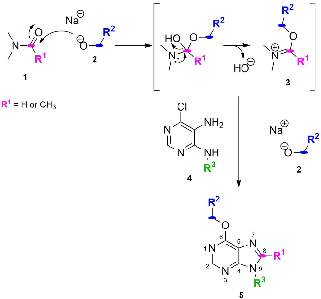
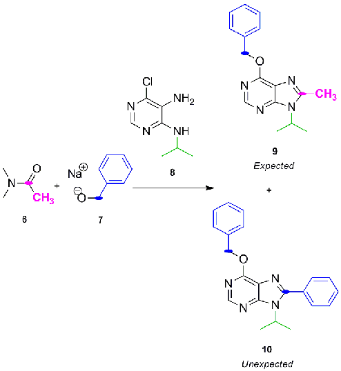
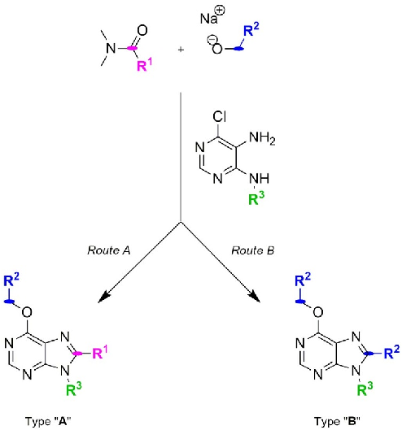
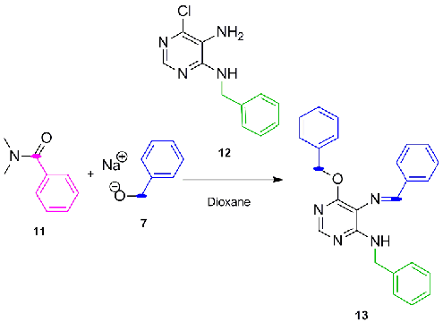
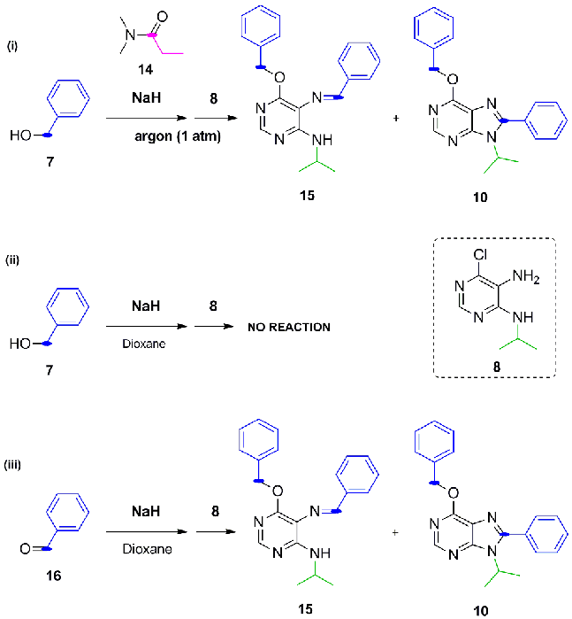
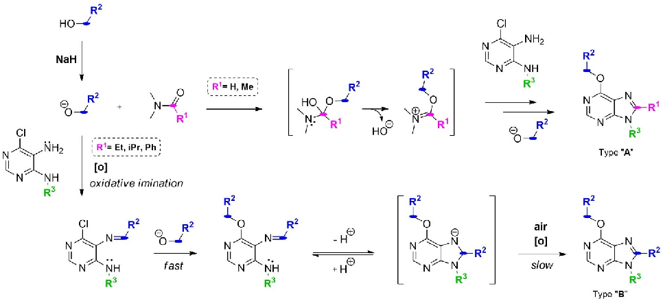
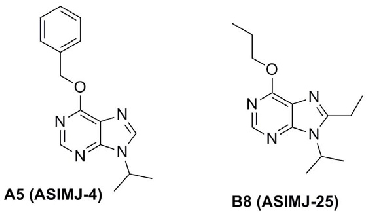
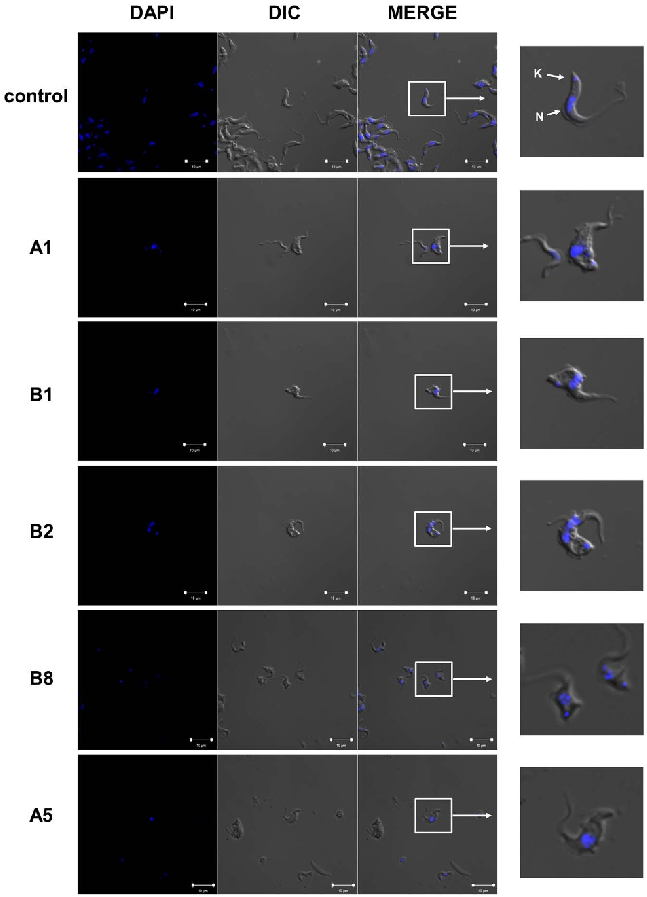

### OPEN

SUBJECT AREAS:

REACTION MECHANISMS PARASITE BIOLOGY

Received 13 May 2014

Accepted 17 February 2015

Published 16 March 2015

Correspondence and requests for materials

should be addressed to

M.J.P.I. (mjpineda@ ugr.es); A.U.-B. (Asier.

Unciti-Broceta@igmm. ed.ac.uk) or J.J.D.-M. (juanjose.diaz@ genyo.es)

## Amide-controlled, one-pot synthesis of tri-substituted purines generates structural diversity and analogues with trypanocidal activity

Maria J. Pineda de las Infantas y Villatoro1, Juan D. Unciti-Broceta2, Rafael Contreras-Montoya2, Jose A. Garcia-Salcedo2,3, Miguel A. Gallo Mezo1, Asier Unciti-Broceta4 & Juan J. Diaz-Mochon1,2

1Departamento de Quı´mica Farmace´utica y Orga´nica. University of Granada, Campus de Cartuja s/n, 18071 Granada, Spain, 2Pfizer - Universidad de Granada - Junta de Andalucı´a Centre for Genomics and Oncological Research (GENYO), Parque Tecnolo´gico de Ciencias de la Salud (PTS), Avenida de la Ilustracio´n 114, 18016 Granada, Spain, 3Unidad de Enfermedades Infecciosas y Microbiologı´a, Complejo Hospitalario de Granada, Instituto de Investigacio´n Biosanitaria de Granada, Dr. Azpitarte, 4, 18012 Granada, Spain, 4Edinburgh Cancer Research UK Centre, MRC Institute of Genetics and Molecular Medicine, University of Edinburgh, Crewe Road South, Edinburgh EH4 2XR, UK.

A novel one-pot synthesis oftri-substituted purinesand the discovery of purine analogues withtrypanocidal activity are reported. The reaction is initiated by a metal-free oxidative coupling of primary alkoxides and diaminopyrimidines with Schiff base formation and subsequent annulation in the presence of large

N,N-dimethylamides(e.g.N,N-dimethylpropanamideorlarger).Thissyntheticrouteisincompetitionwith a reaction previously-reported by our group1, allowing the generation of a combinatorial library of tri-substituted purines by the simple modification of the amide and the alkoxide employed. Among the variety of structures generated, two purine analogues displayed trypanocidal activity against the protozoan parasite Trypanosoma bruceiwith IC50 , 5 mM,being each of those compounds obtained through each of the synthetic pathways.

# P

urines are one of the most widely occurring heterocycles in nature2. This class of fused [655] nitrogencontaining heterocycles are the core structure of nucleobases (e.g. adenine and guanine, essential building blocks of biological structures), and of a wide range of natural compounds with pharmacological properties,

including alkaloids (e.g. caffeine and theobromine), cytokines, and natural antibiotics2, thus being considered privileged scaffolds for drug development3,4. Due to their similarity with cell components, purine analogues may act as substrates or inhibitors of enzymes of purine metabolism5 or as agonists/antagonists/inhibitors of adenosine receptors6 and protein kinases7. This is particularly relevant in the development of antiparasitic chemotherapies, since most parasites rely heavily on purine salvage pathways as they cannot synthesize them de novo8. Purine libraries decorated with different substituents might thus be expected to have a high probability of yielding bioactive compounds and, consequently, purine-derived compounds have been subject to vast exploration in both the heterocyclic and the medicinal chemistry fields9–12. As a result, a number of pharmacologicallyactive purine analogues have been approved for their clinical application as chemotherapeutic agents (antiviral, antiprotozoal, antifungal and anticancer agents13,14) and as pharmacodynamic drugs (coronary vasodilator)15. Therefore, the development of diversity generating methods to synthesize novel poly-substituted purines potentially represents a rapid source of drug candidates for several therapeutic applications16.

Due to their low cost, commercial availability and the range of well-established synthetic protocols existing in the literature, the most common starting material used to generate purine analogues are pyrimidines17–20. Over a decade ago1, we reported the one-pot synthesis of poly-substituted purines (5) from 4-alkylamino-5-amino-6chloropyrimidines (4), primary alkoxides (2) and either N,N-dimethylformamide or N,N-dimethylacetamide (1) (Fig. 1). Alkoxide anions were formed in excess by reaction of sodium hydride and the corresponding primary alcohols. It was proposed that reactive species (alkoxyiminium 3) was generated in situ by reaction between the amide 1 and the alkoxides 2, leading to poly-substituted purine analogues with either H or methyl at C8 depending on the amide employed. This mechanism was supported by the formation of the expected purine

Figure 1 | Plausible mechanism of the one-pot synthesis of poly-substituted purines previously developed by our group1.

analogues using dimethylformamide dimethylacetal (orthoamide). SNAr of the chloro atom at C6 by various alkoxides and the R3 group of the pyrimidine was used to implement structural diversity, thus allowing the straightforward generation of a 12-member library of purine analogues.

Results and Discussion

Motivated by the potential pharmacological properties of these privileged structures, we revisited this methodology to create a new library of poly-substituted purines using a range of different pyrimidines, N,N-dimethylamides and alcohols. Interestingly, following the same procedure, purines 9 and 10 were isolatedafter reaction ofN,Ndimethylacetamide 6,benzyl alkoxide 7(in situgenerated byreaction of sodium hydride and benzyl alcohol) and 5-amino-6-chloro-4isopropylaminopyrimidine 8 (Fig. 2). The unexpected formation of purine analogue 10 suggested that the substituent at C8 originated from the benzyl alkoxide 7 rather than from the amide 6. During the investigation of the possible mechanism involved in the synthesis of purine 10, the use of dialkylacetals (orthoamide) as alkoxyiminium ion synthons to obtain quinazolines from anthranilamides was reported21, which endorsed the mechanism proposed in Fig. 1 but left the formation of purine 10 unexplained. Together with the fact that alkoxyiminium ions are also considered a source of very reactive species capable of doing electrophilic N-alkylation22, the intriguing generation of purine 10 and the potential versatility of the process prompted us to both investigate and exploit this synthetic method further.

A set of reactions were planned to generate new purine analogues and,inturn,findingoutkeyaspectsofthemechanismthroughwhich purine 10 was formed. Reactions among 4-alkylamino-5-amino-6chloropyrimidines, N,N-dimethylamides and different alcohol sources were carried out. Following purification and characterization, products were classified into two categories: (i) type A purines, containing a C8 substituent (R1) derived from the amide used, and

(ii) type B purines, with the C8 substituent (R2) revealing an alternate mechanism where the cyclo-condensation agent appeared to originate from the alcohol/alkoxide species (see Fig. 3).

Figure 2 | Expected and unexpected products obtained by reaction of N,N-dimethylacetamide, benzyl alkoxide (benzyl alcohol 1 sodium hydride), and 5-amino-6-chloro-4-isopropylamino-pyrimidine.

- Figure 3 | One-pot synthesis of poly-substituted purines using sodium hydride and different N,N-dimethylamides, primary alcohols and 4alkylamino-5-amino-6-chloropyrimidines.

Table 1 summarizes the reactions performed and the major purine analogue isolated (see Fig. 3 for chemical structures of both type of compounds). It was clearly observed that steric features of the reactants played a key role in determining towards which route the reaction occurs. Large amides such as N,N-dimethylisopropionamide and N,N-dimethylbenzamide (R15 iPr or Ph) gave rise to type B purines with each of the alcohols used (entries B5–9). Similarly, the use of N,N-dimethylpropionamide (R1 5 Et) with benzyl or pmethoxybenzyl alcohols (bulky R2) led to type B analogues (entries B1-4). Interestingly, type A purines were the major products when N,N-dimethylpropionamide (R1 5 Et) was used together with a small alcohol such as ethanol (entry A2 and 3), and when a smaller amide such as N,N-dimethylacetamide were used (entry A1). Minor traces of type B (,2.5%) analogues were also isolated from these reactions, showing a competition between both routes. In accordance with

previous observation1, reactions developed with N,N-dimethylformamide exclusively produced type A purine analogues regardless the alcohol employed (entries A4 and 5).

This synthetic study demonstrates competition between two different synthetic pathways, with the kinetics of intermediate formation for route A and B driving the final outcome. When the amide employed is small (e.g. DMF), reaction between amides and alkoxides will form reactive alkoxyiminium (3) species that will lead to type A analogues. On the contrary, route B governs the synthetic process in the presence of larger N,N-dimethylamides, suggesting that either the resulting alkoxyiminium (3) species is too stable/ sterically hindered to be attacked by the diaminopyrimidines or its own formation is hindered by the size of the amide.

As mentioned before, examination of the type B purines synthesized clearly indicated that their C8 substituents were originated from the primary alcohols/alkoxides (R2). Since a carbon electrophilic center directly derived from an alcohol could only mediate amine alkylation, any synthetic pathway leading to route B would necessarily involve an oxidation step (e.g. of the alcohol/alkoxide into the corresponding aldehyde or the N-alkylated pyrimidine to the Schiff base), which would in turn act as the cyclo-condensation agent. We anticipated that introducing steric impediments in the starting materials could allow the trapping of the imine intermediate before the cyclization is completed, thus proving the transitional formation of Schiff base. To this end, N,N-dimethylbenzamide 11, benzyl alkoxide 7 and 5-amino-4-benzylamino-6-chloropyrimidine 12 were handpicked and subjected to the same reaction conditions. As a result (Fig. 4), Schiff base intermediate 13 was isolated without detectable formation of the purine analogue, corroborating the involvement of an oxidative coupling of benzyl alcohol and 5-amino-4benzylamino-6-chloropyrimidine 12 as the essential initiating step required to generate type B purine analogues.

Since reagents with higher oxidation states than aldehydes are typically required to cyclo-condense and give rise to an aromatic heterocycle23–26, a second oxidative step will need to occur for driving the transformation of an unstable dihydropurine intermediate27 (resulting from the intramolecular attack of the alkylamino group in C4 to the imine) into a purine system and thus complete synthetic route B. Therefore, overall, synthesis of type B purine analogues would require two oxidative steps for completion: first, oxidative coupling of an alcohol and an exocyclic amine group to generate a Schiff base (able to transitionally generate a dihydropurine derivative); and second, the oxidative generation of a purine system from anunstable7,8-dihydropurine intermediate28.Literatureprovidedifferent examples of each of this oxidative steps independently but, to

|Table 1 | List of starting materials employed and the types of poly-substituted purines synthesized. Half-inhibitory concentrations (IC50|
|---|
|against the protozoan parasite Trypanosoma brucei presented as mean 6 SEM. n 5 6  entry R1 R2 R3 ‘‘A’’% (R1, R2, R3) ‘‘B’’% (R2,R3) IC50 (mM)a T.brucei  A1 Me Ph iPr 16% traces 69.2 6 1.8 A2 Et Me iPr 29% traces 137.1 6 6.9   A31 Et Me Bu 31% traces 51.8 6 3.3  A4 H Me iPr 44% - 14.7 6 0.6 A5 H Ph iPr 38% - 1 6 0.1   B1 Et Ph iPr - 40% 52.1 6 1   B2 Et Ph tBu - 45% 18.3 6 0.5 B3 Et MeOPh iPr - 28% 42.7 6 1 B4 Et MeOPh tBu - 22% 80.5 6 3.5 B5 iPr H iPr - 10% 37.5 6 1.5 B6 iPr Me iPr - 10% 32 6 1.7 B7 Ph Me iPr - 20% 22.7 6 1.4 B8 Ph Et iPr - 27% 4.8 6 0.2 B9 Ph iPr iPr - 22% 12.6 6 0.6   Cell viability was assessed by resazurin dye. Half-inhibitory concentration (IC50) values were calculated using GraphPad Prism5 Software and defined as the concentration of purine required to diminish fluorescence output by 50%. n 5 6.|

)

a

aromatic and aliphatic aldehydes and an iron catalyst has also been previously described33. Furthermore, evidences of metal-free oxygen-promoted oxidation of electron-poor heterocycles in strong basic conditions have been shown by us34 and others35. With these precedents in mind, a set of reactions using reagents with large substituents (so that Route B pathway was to be favored) were designed to shed some light on the oxidative aspects of route B mechanism. Threereactionswere performed inparallelwithNaHandpyrimidine 8 as starting material and: (i) benzyl alcohol 7 and N,N-dimethylpropionamide 14 in argon atmosphere (oxygen-free environment), (ii) amide-free reaction with benzyl alcohol 7 and (iii) amide-free reaction with benzaldehyde 16 instead of benzyl alcohol (Fig. 5).

In the absence of oxygen, reaction (i) yielded a mixture of the purine end-product 10 and Schiff base intermediate 15. This finding was, in principle, contradictory to previous report as metal-free oxidative couplings are achieved under aerobic conditions. However, this could be explained by presence of oxygen traces coming from the cylinder, an observation also found by Adimurthy30 The presence of Schiff base intermediate 15 shows the importance of oxygen as a promoter of the second oxidation step. When the process was carried outin theabsence oftheamide (panel(ii) ofFig. 5)and using dioxane as solvent the reaction did not take place and the starting material 8 wasrecovered. To shedlightinto the roleoftheamide inthe reaction, the same reaction was repeated with toluene instead of dioxane as Adimurthy30 observed that oxidative iminations are promoted in toluene but not in dioxane. In agreement with Adimurthy’s observations, Schiff base intermediate 15 was obtained under these conditions. Interestingly, purine 10 was not formed, highlighting the assisting role of amides in the annulation step but not for the oxidative imination.

- Figure 4 | Synthesis of Schiff base 13 by sterically-hindered starting materials.

- Figure 5 | Study of the significance of different chemical reactants on the generation of type B analogues.

our knowledge, this is the first time that both are reported concomitantly to obtain substituted purines. For instance, a recent study has reported the use of NaH/air as the oxidant source to obtain aldehyde from alcohols without the need of using metals as catalyst29. Within thislineofresearch,threedifferent manuscriptshavereportedmetalfree oxidative coupling of alcohols and amines, mediated by strong basic conditions, to give rise to either imine or alkylated amines.30–32. The synthesis of purine rings from diaminopyrimidines using both

We then investigated if aldehyde intermediates, which would appear to be the oxidative intermediate needed for Schiff base formation in the first step, could be identified. Reaction of benzaldehyde 16, NaH and pyrimidine 8 (condition (iii)) gave rise to purine 10 and Schiff base 15, demonstrating that the direct use of the aldehyde36 can lead to the endproducts without the need of the amide, meaning that at this point the aldehyde intermediate hypothesis was still credible. In this case and remarkably, while benzyl alcohol 7 was not present in the reaction mixture, C6-benzoxy products were obtained, suggesting a partial reduction of benzaldehyde into benzyl alkoxide probably mediated by NaH37. We then carried out a set of reactions to try to capture the aldehyde intermediate, which might be transitionally created in-situ. 2,4-dinitrophenylhydrazine was chosen as indicator in substitution of the pyrimidine, aiming that upon reaction with the expected aldehyde intermediate would create a hydrazone with a colour change. Benzyl alcohol 7, N,N-dimethylpropanamide 14 and NaH were used as the other reagents under the same conditions mentioned above. However, only 2,4-dinitrophenylhydrazine decomposition was observed, likely due to the strong basic conditions of the reaction. Reactions using just benzyl alcohol 7, N,N-dimethylpropanamide 14 and NaH, inthe absence of any amino-containing starting material, were then carried to try to identify benzaldehyde by TLC. However, no traces of benzaldehyde 16 were detected. Hence, we could not identify aldehyde species under any of these conditions and, even though Adimurthy reported the presence of 1%-2% of in situ generated catalytic aldehyde as the responsible species to trigger these reactions, we cannot confirm that, in our case, the oxidative imination takes place through aldehyde intermediates.

To summarize, the following features of the process have been gathered from these studies are:

. There is competition between alkoxyiminium ion formation (created by reacting N,N-dimethylamides and alkoxide) and metalfree oxidative imination (reaction between amine and alcohols assisted by strong basic conditions in open systems). When large N,N-dimethylamides (R1 5 Et, iPr, Ph) are used, the formation of alkoxyiminium ions is disfavoured and therefore purine formationviaoxidative iminationgoverns.Incase ofusingsmallerN,Ndimethylamides (R1 5 H, Me), alkoxyiminium ion formation is formed faster and purines type A are obtained (Fig. 6).

. There is no evidence of neither NaH to be directly involved in the oxidation steps nor aldehyde to be the intermediate required to obtain the Schiff base.

. Final products from reactions (i) and (iii) and the starting mater-

ial recovered from reaction (ii) demonstrate that SNAr of the chloro atom at C6 by the alkoxide takes place upon formation of the Schiff base in a rapid manner.

. While the second oxidation step (purine formation) does not require the presence of the amide, the type of solvent influences whether the annulation step does or does not take place. Incomplete reactions (i) and (iii) indicate that oxygen and strong basic conditions are promoters of the purine ring formation.

The second part of the work was to investigate whether the chemical diversity produced through the described synthetic methodology had resulted in the generation of biologically active purines. Bearing in mind that purine salvage pathways have been proposed as an interesting therapeutic target for pathogenic protozoa8,38 we decided to screen the antiparasitic properties of these novel compounds against Trypanosoma brucei, the causative agent of African trypanosomiasis, also known as sleeping sickness39. Therefore, a trypanotoxicity assay using 11 different concentrations of each of the library members was performed against bloodstream forms of T. brucei. Half-inhibitory concentrations (IC50) were determined for each of the compounds (Table 1). The screening highlighted the trypanocidal properties of two derivatives: compound B8 (ASIMJ-25), with an IC50 of 4.8 6 0.2 mM mean 6 SEM), and the purine analogue A5 (ASIMJ-4) (Fig. 7), which was the most active antiparasite compound of the series with an IC50 of 1 6 0.1 mM (mean 6 SEM). Interestingly, these active purines were generated through each of the synthetic routes, and the only common feature was the isopropyl group at the position 9 of the purine.

This inhibitory effect on trypanosomes growth was further analyzed in compounds with the different IC50 values, including the two most active compounds of the library, by optical and fluorescence microscopy after DAPI staining. As expected, the numbers of parasites on wells incubated with the selected inhibitors A1 (ASIMJ-5), A5 (ASIMJ-4), B1 (ASIMJ-6), B2 (ASIMJ27) and B8 (ASIMJ-25), using their IC50 concentration values, were much lower than on control wells. Moreover, all of these compounds induced profound morphological changes in the appearance of cells, with enlargement of the flagellar pocket and multiple nuclei, which is a typical phenotype of dying trypanosomes (Fig. 8)40,41.

- Figure 6 | Proposed mechanisms of action for routes A and B. In accordance to the literature31, the imine intermediate can give rise, in a reversible manner, to dihydropurines. The tandem synthetic process would end upon irreversible oxidation into purines.

nium ions and the oxidation of alcohols defined which products were obtained. In the absence of steric impediments, purine analogues were synthesized via reaction of alkoxyiminium ions and diaminopyrimidines. On the contrary, in the presence of larger N,N-dimethylamides, a more complex synthetic route dominated, giving rise to an unexpected set of purine analogues. The tandem reaction sequence was initiated by a metal-free oxidative coupling of primary alkoxide and exocyclic amino group at C4 of the pyrimidine ring, obtaining a Schiff base intermediate. This intermediate underwent an intramolecular cyclocondensation with the amino group at C5 driven by an oxygen-promoted alkaline oxidation. Two Schiff base intermediates were isolated and could be obtained in higher yields by increasing the size of the substituents of the amides and of the amino group found at C5 of the pyrimidine. The role of large N,N-dimethylamides for the formation of Schiff base under these conditions seems to be not crucial as toluene (but not dioxane) also enabled the oxidative imination. However, N,N-dimethylamides promoted the second oxidation step to obtain purine rings whereas toluene did not, demonstrating the relevant role of the solvent in the reaction cascade. One aspect that is still inconclusive is which

- Figure 7 | Chemical structures of compounds A5 (ASIMJ-4) and B8 (ASIMJ-25), the most active of the library against the protozoan parasite Trypanosoma brucei.

- Figure 8 | Confocal fluorescence and optical microscopy DIC of bloodstream trypanosomes incubated for 24 h with IC50 concentrations of A1 (AIMJ5), A5 (ASIMJ-4), B1 (ASIMJ-6), B2 (ASIMJ-27), B8 (ASIMJ-25) and controls. DAPI channel stain nucleus (N) and kinetoplast (K).

Conclusions

In conclusion, a 14-member library of poly-substituted purines were synthesized from 4-alkylamino-5-amino-6-chloropyrimidines using primary alcohols, sodium hydride and N,N-dimethylalkyl/arylamides. Competition between the formation of reactive alkoxyimi-

alcohol-derived species carry out the oxidative couplings with amino groups. In this study we could not confirm that the oxidative imination happened via an aldehyde intermediate.

To the best of our knowledge, this tandem synthetic process has been described herein for the first time. From a synthetic/medicinal point of view, and even if the reaction yields are low to moderate, the interest of the present methodology relies on its versatility, since it allows to generate a range of different tri-substituted purine analogues by the simple selection of readily available starting materials.

Finally, we have shown the capacity of some of these novel purine derivatives to reduce trypanosome viability by inducing an enlarged flagellar pocket phenotype with one compound, A5 (ASIMJ-4), presenting an IC50 value of 1 mM. Given the relatively small molecular weight of this compound (MW 5 263 Da), compound A5(ASIMJ-4) could be considered a fragment with unusually high phenotypic activity. These interesting results underscore the importance of developing short and versatile synthetic pathways capable of generating structural diversity in order to produce novel purine libraries, in rapid parallel fashions, with pharmacological/therapeutic interest.

Experimental Section

General Experimental. Reaction courses and products mixtures where routinely monitored by TLC on silica gel Merck 60–200 mesh silica gel. Melting points were determined on a Stuart Scientific SMP3 apparatus and are uncorrected. 1H-NMR spectra were obtained in CDCl3, CD3OD solutions on a Varian Inova Unity (300 MHz) and Varian Direct Drive (400 MHz and 500 MHz). Chemical shifts (d) are given in ppm upfield from tetramethylsilane. 13C-NMR spectra were obtained in CDCl3,CD3OD solutionson aVarianDirectDrive (125 MHz).Allproductsreported showed 1H-NMR and 13C-NMR spectra in agreement with the assigned structures. Mass spectra were obtained by electrospray (ESY) with a LCT Premier XE Micromass Instrument (High resolution mass spectrometry).

General procedure for the preparation of compounds B1-9 (Route B). NaH (50%) in mineral oil (3.7 mmol, 10 equiv.) was added to a mixture cooled at 0uC constituted of the corresponding alcohol (3.7 mmol, 10 equiv.) and N,N-dimethylamide (18.5 mmol, 50 equiv.). In case of using N,N-dimethylbenzamide, 1,4-dioxane (2 mL) was used as solvent. The solution was stirred at room temperature for 30 min and then at 90uC for another 30 min. After this time, substituted pyrimidines (0.37 mmol, 1 equiv.,5-amino-6-chloro-4-isopropylaminopyrimidine 8 or5-amino4-tert-butylamino-6-chloropyrimidine, which prepared as described elsewhere1) were dissolved either in the same amide (18.5 mmol, 50 equiv.) or in 1,4-dioxane (2 mL, in the case of N,N-dimethylbenzamide) and added dropwise to the mixture, which was then heated for 24 h at 90uC. The reaction mixture was brought to pH 7 with an aq. saturated NH4Cl solution, and then extracted with CH2Cl2 (3 3 15 mL). The combined organic extracts were dried over Na2SO4, filtered and the organic solvent evaporated. Crudes were purified by flash chromatography on silica gel using ethyl acetate/petroleum ether as mobile phases.

6-Benzyloxy-9-isopropyl-8-phenyl-9H-purine (B1)ASIMJ-6. White solid, mp 111–

112uC; yield 40%. dH (300.20 MHz, CDCl3): 8.57 (1H, s, NCHN), 7.70–7.38 (10H, m, Ph, CH2Ph), 5.72 (2H, s, OCH2Ph), 4.80 (1H, m, CH(CH3)2), 1.76 (6H, d, J 5 6 Hz,

NCH(CH3)2). dC (125.68 MHz, CDCl3): 160.54, 153.14, 151.01, 136.66, 130.40, 129.80, 128.95, 128.76, 128.61, 128.27, 128.05, 122.14, 68.42, 50.04, 21.51. ES 1

HRMS: Calculated M 1 H5 345.1715. C21H21N4O. Obtained: 345.1716. 9-tert-butyl-6-(benzyloxy)-8-phenyl-9H-purine (B2) ASIMJ-27. White solid, mp:

113–114uC; yield 45%. dH (300.20 MHz, CDCl3): 8.59 (1H, s, NCHN), 7.58–7.34 (10H, m, Ph, CH2Ph), 5.69 (2H, s, OCH2Ph), 1.70 (9H, s, NC(CH3)3). dC (125.68 MHz, CDCl3): 160.62, 154.52, 153.37, 150.46, 136.58, 134.97, 130.11, 129.72,

- 128.85, 128.59, 128.27, 128.09, 121.76, 68.43, 61.06, 31.15. ES 1 HRMS: Calculated M 1 H 5 359.1872. C22H23N4O. Obtained: 359.1880.

6-(3-methoxybenzyloxy)-9-isopropyl-8-(3-methoxyphenyl)-9H-purine (B3). White viscous oil; yield 28%. dH (499.79 MHz, CDCl3): 8.53 (1H, s, NCHN), 7.44–6.85 (8H, m, Ph, CH2Ph), 5.66 (2H, s, OCH2Ph), 4.79 (1H, m, CH(CH3)2), 3.87 (3H, s, OCH2PhOCH3), 3.80 (3H, s, PhOCH3), 1.72 (6H, d, NCH(CH3)2). dC (125.68 MHz, CDCl3): 160.27, 159.64, 153.59, 152.75, 150.76, 137.94, 131.25, 129.41, 121.63, 120.78, 116.25, 114.92, 113.88, 113.70, 68.03, 55.45, 55.26, 49.81, 21.26. ES 1 HRMS: Calculated M 1 H5 405.1927. C23H25N4O3. Obtained: 405.1930.

6-(3-methoxybenzyloxy)-9-tert-butyl-8-(3-methoxyphenyl)-9H-purine (B4). Yellow viscous oil; yield 22%. dH (400.57 MHz, CDCl3): 8.55 (1H, s, NCHN), 7.48–6.83 (8H, m, Ph, CH2Ph), 5.63 (2H, s, OCH2Ph), 3.83 (3H, s, OCH2PhOCH3), 3.79 (3H, s,

PhOCH3), 1.68 (9H, s, NC(CH3)3). dC (125.68 MHz, CDCl3): 160.29, 159.61, 159.02, 154.21, 152.87, 150.23, 137.83, 129.38, 128.92, 122.49, 120.86, 119.08, 115.41, 113.91,

- 113.29, 112.24, 68.06, 55.40, 55.27, 30.76. ES 1 HRMS: Calculated M 1 H 5 419.2083. C24H27N4O3. Obtained: 419.2086.

9-Isopropyl-6-methoxy-9H-purine (B5). White viscous oil; yield 10%. dH (400.57 MHz, CDCl3): 8.53 (1H, s, NCHN), 7.98 (1H, s, NHCHNiPr), 4.89 (1H, m, CH(CH3)2), 4.18 (3H, s, OCH3), 1.63 (6H, d, J 5 8 Hz, NCH(CH3)2). dC(125.68 MHz, CDCl3): 161.19, 152.25, 151.86, 139.89, 122.07, 54.26, 47.63, 22.78. ES 1 HRMS: Calculated M 1 H: 193.1089. C9H13N4O. Obtained: 193.1087.

6-Ethoxy-9-isopropyl-8-methyl-9H-purine (with N,N-dimethylisopropionamide) (B6). Yellow viscous oil; yield 10%. dH(499.79 MHz, CDCl3): 8.44 (1H, s, NCHN),

4.73 (1H, m, CH(CH3)2), 4.62 (2H, q, J 5 10 Hz, OCH2CH3), 2.64 (3H, s, CH3), 1.68 (6H, d, J 5 5 Hz, NCH(CH3)2), 1.50 (3H, t, J 5 10 Hz, OCH2CH3). dC(125.68 MHz, CDCl3): 159.74, 152.88, 151.75, 150.53, 120.71, 62.67, 48.31, 21.24, 15.22, 14.58. ES 1 HRMS: Calculated M 1 H 5 221.1402. C11H17N4O. Obtained: 221.1401.

6-Ethoxy-9-isopropyl-8-methyl-9H-purine (with N,N-dimethylbenzamide) (B7). Yellow viscous oil; yield 20%. dH(499.79 MHz, CDCl3): 8.44 (1H, s, NCHN), 4.73

- (1H, m, CH(CH3)2), 4.62 (2H, q, J 5 10 Hz, OCH2CH3), 2.64 (3H, s, CH3), 1.68 (6H, d, J 5 5 Hz, NCH(CH3)2), 1.51 (3H, t, J 5 10 Hz, OCH2CH3). dC(125.68 MHz, CDCl3): 159.74, 152.88, 151.75, 150.53, 120.71, 62.67, 48.31, 21.24, 15.22, 14.58. ES 1 HRMS: Calculated M 1 H 5 221.1402. C11H17N4O. Obtained: 221.1396.

8-Ethyl-9-isopropyl-6-propoxy-9H-purine (B8)ASIMJ-25. Yellow viscous oil; yield 27% dH (300.20 MHz, CDCl3): 8.43 (1H, s, NCHN), 4.69 (1H, m, CH(CH3)2), 4.52

- (2H, t, J 5 9 Hz, OCH2CH2CH3), 2.94 (2H, q, J 5 6 CH2CH3), 1.92 (2H, m, OCH2CH2CH3), 1.70 (6H, d, J 5 10 Hz, NCH(CH3)2), 1.43 (3H, t, J 5 6 Hz, CH2CH3), 1.05 (3H, t, J 5 9, OCH2CH2CH3). dC(125.68 MHz, CDCl3): 160.28, 155.28, 150.65, 150.31, 124.41, 68.65, 48.57, 21.24, 23.13, 22.49, 21.51, 12.49, 10.66. ES 1 HRMS: Calculated M 1 H 5 249.1715. C13H21N4O. Obtained: 249.1721.

6-Isobutoxy-8,9-diisopropyl-9H-purine (B9). White viscous oil; yield 22%. dH (300.20 MHz, CDCl3): 8.44 (1H, s, NCHN), 4.74 (1H, m, NCH(CH3)2), 4.36 (2H, d, OCH2Pri, J 5 9 Hz), 3.28 (1H, m, CCH(CH3)2), 2.29 (1H, m, CH2CH(CH3)2), 1.72 (6H, d, J 5 9 Hz, NCH(CH3)2), 1.47 (6H, d, J 5 9 Hz, CCH(CH3)2), 1.06 (6H, d, J 5 9 Hz, CH2CH(CH3)2). ES 1 HRMS: Calculated M 1 H 5 277.2028. C15H25N4O. Obtained: 277.2036.

General procedure for the preparation of compounds A1-5 (Route A). NaH (50%) in mineral oil (3.7 mmol, 10 equiv.) was added to a mixture cooled at 0uC constituted of the corresponding alcohol (3.7 mmol, 10 equiv.) and N,N-dimethylamide (18.5 mmol, 50 equiv.). The solution was stirred at room temperature for 30 min and thenat90uCforanother30 min. Afterthistime,substitutedpyrimidines (0.37 mmol, 1 equiv.) were dissolved in the amide (18.5 mmol, 50 equiv.) and added dropwise to the mixture which was then heated for 24 h at 90uC. The reaction mixture was brought to pH 7 with an aq. saturated NH4Cl solution, and then extracted with CH2Cl2 (33 15 mL). The combined organic extractswere dried over Na2SO4, filtered and the organic solvent evaporated. Crudes were purified by flash chromatography on silica gel using ethyl acetate/petroleum ether as mobile phases.

- 6-(Benzyloxy)-9-isopropyl-8-methyl-9H-purine (A1)ASIMJ-5. White solid, mp: 8486uC; yield 16%. dH (499.79 MHz, CDCl3): 8.47 (1H, s, NCHN), 7.54–7.30 (5H, m, Ph), 5.65 (2H, s, OCH2Ph), 4.75 (1H, m, CH(CH3)2), 2.65 (3H, s, CH3), 1.69 (6H, d, J 5 10 Hz, NCH(CH3)2). dC (125.68 MHz, CDCl3): 159.41, 153.57, 150.69, 150.41, 136.42, 128.43 128.35, 127.98, 120.73, 68.06, 48.35, 21.23, 15.22. ES 1 HRMS: Calculated M 1 H 5 283.1559. C16H19N4O. Obtained: 283.1558.

6-Ethoxy-8-ethyl-9-isopropyl-9H-purine (A2). Yellow viscous oil; yield 29%. dH(300.20 MHz, CDCl3): 8.47 (1H, s, NCHN), 4.72 (1H, m, CH(CH3)2), 4.67 (2H, q, J 5 6 Hz, OCH2CH3), 2.96 (2H, q, J 5 6, CH2CH3), 1.74 (6H, d, J 5 6 Hz, NCH(CH3)2), 1.53 (3H, t, J 5 6 Hz, OCH2CH3), 1.47 (3H, t, J 5 6 Hz, -CH2CH3). ES 1 HRMS: Calculated M 1 H 5 235.1559. C12H19N4O. Obtained: 235.1557.

- 6-Ethoxy-8-ethyl-9-(n-butyl)-9H-purine (A3). (This compound has already been prepared by us and is described elsewhere1). Yellow viscous oil; yield 31%. dH (200 MHz, CD3OD): 8.42 (1H, s, NCHN), 4.59 (2H, q, J 5 7.1 Hz, OCH2CH3), 4.23 (t, J 5 7.4 Hz, 2H), 2.93 (2H, q, J 5 7.5 Hz, CH2CH3), 1.79 (2H, m, NCH2CH2), 1.43

(3H, t, J 5 7.1 Hz, OCH2CH3), 1.39 (3H, t, J 5 7.5 Hz, -CCH2CH3), 1.38 (2H, m, NCH2CH2CH2), 0.93 (3H, t, J 5 7.4 Hz, NCH2CH2CH2CH3). dC (75 MHz, CD3OD: 160.3, 156.3, 154.7, 151.4, 121.1, 62.9, 42.9, 32.5, 21.3, 20.5, 14.8, 13.9, 11.4. MS (70 eV) m/z (%): 249.2 (M11); 271.1; 221.1.

- 6-Ethoxy-9-isopropyl-9H-purine (A4).Lightyellowsolid;yield44%.dH(499.79 MHz, CDCl3): 8.49 (1H, s, NCHN), 7.96 (1H, s, NHCHN), 4.88 (1H, m, CH(CH3)2), 4.64 (2H, q, J 5 5 Hz, OCH2CH3), 1.60 (6H, d, J 5 5 Hz, NCH(CH3)2), 1.49 (3H, t, J 5 5 Hz, OCH2CH3). dC (125.68 MHz, CDCl3): 160.81, 151.70, 139.53, 121.83, 62.98, 47.33, 22.60, 14.51. ES 1 HRMS: Calculated M 1 H 5 207.1246. C10H15N4O. Obtained: 207.1245.

- 6-(Benzyloxy)-9-isopropyl-9H-purine (A5)ASIMJ-4. White solid; yield 38%; mp 167– 169uC. dH (499.79 MHz, CDCl3): 8.56 (1H, s, NCHN), 8.00 (1H, s, NHCHN), 7.567.30 (5H, m, Ph), 5.69 (2H, s, OCH2Ph), 4.91 (1H, m, CH(CH3)2), 1.64 (6H, d, J 5
- 10 Hz, NCH(CH3)2). dC (125.68 MHz, CDCl3): 160.53, 151.63, 139.77, 136.27, 130.03, 128.41, 128.29, 128.05, 68.29, 47.43, 22.63. ES 1 HRMS: Calculated M 1 H 5 269.1402. C15H17N4O. Obtained: 269.1402.

Concomitantly preparation of 6-benzyloxy-9-isopropyl-8-phenyl-9H-purine (10) and 6-benzyloxy-9-isopropyl-8-methyl-9H-purine (9) (Fig. 2). NaH (50%) in mineral oil (3.7 mmol, 10 equiv.) was added to a mixture cooled at 0uC constituted of benzyl alcohol (7.4 mmol, 20 equiv.) and N,N-dimethylacetamide (1.8 mL, 18.5 mmol, 50 equiv.). The solution was stirred at room temperature for 30 min and then at 90uC for the same time. 5-amino-6-chloro-4-isopropylaminopyrimidine 8 (0.37 mmol, 1 equiv.) dissolved in N,N-dimethylacetamide (1.8 mL, 18.5 mmol, 50 equiv.) was added dropwise to the mixture which was then heated for 24 h at 90uC. The reaction mixture was brought to pH 7 with an aq. saturated NH4Cl solution, and then extracted with CH2Cl2 (3 3 15 mL). The combined organic extracts were dried over Na2SO4, filtered and the organic solvent evaporated. Crudes were purified by flash chromatography on silica gel using ethyl acetate/petroleum ether as mobile phases.

- Compounds 9 and 10 were isolated with 20% yield each.

6-Benzyloxy-9-isopropyl-8-methyl-9H-purine (9; Fig. 2). White solid; yield 20%. dH (499.79 MHz, CDCl3): 8.47 (1H, s, NCHN), 7.54–7.30 (5H, m, Ph), 5.65 (2H, s, OCH2Ph), 4.75 (1H, m, CH(CH3)2), 2.65 (3H, s, CH3), 1.69 (6H, d, J 5 10 Hz,

- NCH(CH3)2). dC (125.68 MHz, CDCl3): 159.41, 153.57, 150.69, 150.41, 136.42,

- 128.43 128.35, 127.98, 120.73, 68.06, 48.35, 21.23, 15.22. ES 1 HRMS: Calculated M 1 H 5 283.1559. C16H19N4O. Obtained: 283.1555.

6-Benzyloxy-9-isopropyl-8-phenyl-9H-purine (10; Fig. 2). White solid, mp: 111–

112uC; yield 20%. dH (300.20 MHz, CDCl3): 8.57 (1H, s, NCHN), 7.70–7.38 (10H, m, Ph, CH2Ph), 5.72 (2H, s, OCH2Ph), 4.80 (1H, m, CH(CH3)2), 1.76 (6H, d, J 5 6 Hz, NCH(CH3)2). dC (125.68 MHz, CDCl3): 160.54, 153.14, 151.01, 136.66, 130.40,

- 129.80, 128.95, 128.76, 128.61, 128.27, 128.05, 122.14, 68.42, 50.04, 21.51. ES 1 HRMS: Calculated M 1 H 5 345.1715. C21H21N4O. Obtained: 345.1716.

Preparation of N4-benzyl-N5-benzylidene-6-(benzyloxy)pyrimidine-4,5-diamine (13) (Fig. 4). NaH (50%) in mineral oil (3.7 mmol, 10 equiv.) was added to a mixture cooled at 0uC constituted of benzyl alcohol (3.7 mmol, 10 equiv.) and N,Ndimethylbenzamide (18.5 mmol, 50 equiv.) in 1,4-dioxane (2 mL). The solution was stirred at room temperature for 30 min and then at 90uC for the same time. 5-amino4-benzylamino-6-chloropyrimidine 12 dissolved in 1,4-dioxane (2 mL) was added dropwisetothemixture whichwasthenheated for24 hat90uC.Thereaction mixture was brought to pH 7 with an aq. saturated NH4Cl solution, and then extracted with CH2Cl2 (33 15 mL). The combined organic extractswere dried over Na2SO4,filtered and the organic solvent evaporated. Crudes were purified by flash chromatography on silica gel using ethyl acetate/petroleum ether as mobile phases. Yellow oil; yield 10%. dH (499.79 MHz, CDCl3): 9.23 (1H, s, NCHPh), 8.21 (1H, s, NCHN), 8.01–7.35 (15H, m,NCHPh, NHCH2Ph, OCH2Ph), 5.53 (2H, s, OCH2Ph), 5.46 (2H, s, NHCH2Ph), 4.82 (1H, d, J 5 5, Hz, NH). dC (125.68 MHz, CDCl3): 161.73, 158.71, 156.73, 144.68, 136.75, 134, 131.15, 128.71, 128.52, 128.10, 127.71, 127.34, 127.24, 114.20, 68.30, 44.98. ES 1 HRMS: Calculated M 1 H 5 395.1872. C25H23N4O. Obtained: 395.1873.

Concomitantly preparation of 6-benzyloxy-9-isopropyl-8-phenyl-9H-purine (10) and N5-benzylidene-6-(benzyloxy)-N4-isopropylpyrimidine-4,5-diamine (15) (Fig. 5 (i)).

In this case, in order to eliminate oxygen from the reaction, this was performed under argon atmosphere. Furthermore, N,N-dimethylpropionamide was degassed by bubbling an argon stream assisted by an ultrasound device. NaH (50%) in mineral oil (3.7 mmol, 10 equiv.) was added to a mixture cooled at 0uC constituted of benzyl alcohol (3.7 mmol, 10 equiv.) and N,N-dimethylpropionamide (2.3 mL, 18.5 mmol, 50 equiv.). The solution was stirred at room temperature for 30 min and then at 90uC for the same time. 5-amino-6-chloro-4-isopropylaminopyrimidine 8 (0.37 mmol, 1 equiv.) dissolved in N,N-dimethylpropionamide (2.3 mL, 18.5 mmol, 50 equiv.) was added dropwise to the mixture which was then heated for 24 h at 90uC. The

reaction mixture was brought to pH 7 with an aq. saturated NH4Cl solution, and then extracted with CH2Cl2 (3 3 15 mL). The combined organic extracts were dried over Na2SO4, filtered and the organic solvent evaporated. Crudes were purified by flash chromatography on silica gel using ethyl acetate/petroleum ether as mobile phases.

- Compounds 10 and 15 were isolated with 20% yield each.

6-Benzyloxy-9-isopropyl-8-phenyl-9H-purine (10; Fig. 5 (i)). White solid, mp:111–

112uC; yield 23%. dH (300.20 MHz, CDCl3): 8.57 (1H, s, NCHN), 7.70–7.38 (10H, m, Ph, CH2Ph), 5.72 (2H, s, OCH2Ph), 4.80 (1H, m, CH(CH3)2), 1.76 (6H, d, J 5 6 Hz, NCH(CH3)2). dC (125.68 MHz, CDCl3): 160.54, 153.14, 151.01, 136.66, 130.40,

- 129.80, 128.95, 128.76, 128.61, 128.27, 128.05, 122.14, 68.42, 50.04, 21.51. ES 1 HRMS: Calculated M 1 H 5 345.1715. C21H21N4O. Obtained: 345.1718.

N5-Benzylidene-6-(benzyloxy)-N4-isopropylpyrimidine-4,5-diamine (15; Fig. 5 (i)). Yellow oil; yield 10%. dH(499.79 MHz, CDCl3): 9.19 (1H, s, NCHPh), 8.18 (1H, s, NCHN), 7.79 (2H, s, H-29NCHPh), 7.47–7.30 (8H, m, Ph, CHPh), 6.02 (1H, d, J 5 10 Hz, NH), 5.51 (2H, s, OCH2Ph), 4.35 (1H, m, CH(CH3)2), 1.32 (6H, d, J 5 5 Hz, NCH(CH3)2). dC(125.68 MHz, CDCl3): 161.40, 158.53, 154.40, 137.34, 136.95, 134.49, 131.08, 128.75, 128.21, 127.68, 110.91, 68.02, 42.73, 23.23. ES 1 HRMS: Calculated M 1 H 5 347.1872. C21H23N4O. Obtained: 347.1873.

Reaction of 5-amino-6-chloro-4-isopropylaminopyrimidine (8) with benzyl alcohol and withoutamide(Fig.5(ii)).NaH(50%)inmineraloil(3.7 mmol,10 equiv.) wasadded to a mixture cooled at 0uC constituted of benzyl alcohol (3.7 mmol, 10 equiv.) and 1,4-dioxane (2 mL). The solution was stirred at room temperature for 30 min and then at 90uC for the same time. 5-amino-6-chloro-4-isopropylaminopyrimidine 8

(0.37 mmol, 1 equiv.) dissolved in 1,4-dioxane (2 mL) was added dropwise to the mixture which was then heated for 24 h at 90uC. The reaction mixture was brought to pH 7 with an aq. saturated NH4Cl solution, and then extracted with CH2Cl2 (3 3 15 mL). The combined organic extracts were dried over Na2SO4, filtered and the organic solvent evaporated. Crudes were purified by flash chromatography on silica gel using ethyl acetate/petroleum ether. In this case, the starting materials were recovered.

Preparation of 6-benzyloxy-9-isopropyl-8-phenyl-9H-purine (10) and N5-benzylidene6-(benzyloxy)-N4-isopropylpyrimidine-4,5-diamine (15) (Fig. 5 (iii). NaH (50%) in mineral oil (3.7 mmol, 10 equiv.) was added to a mixture cooled at 0uC constituted of benzaldehyde (3.7 mmol, 10 equiv.) and 1,4-dioxane (2 mL). The solution was stirred at room temperature for 30 min and then at 90uC for the same time. 5-amino6-chloro-4-isopropylaminopyrimidine 8 (0.37 mmol, 1 equiv.) dissolved in 1,4dioxane (2 mL) was added dropwise to the mixture which was then heated for 24 h at 90uC. The reaction mixture was brought to pH 7 with an aq. saturated NH4Cl solution, and then extracted with CH2Cl2 (3 3 15 mL). The combined organic extracts were dried over Na2SO4, filtered and the organic solvent evaporated. Crudes were purified by flash chromatography on silica gel using ethyl acetate/petroleum ether as mobilephases. Compounds 10and 15were isolated with a23% yield and 10% yield respectively.

6-Benzyloxy-9-isopropyl-8-phenyl-9H-purine (10; Fig. 5 (iii)). White solid; yield 23%. dH (300 MHz, CDCl3): 8.57 (1H, s, NCHN), 7.70–7.38 (10H, m, Ph, CH2Ph), 5.72

(2H, s, OCH2Ph), 4.80 (1H, m, CH(CH3)2), 1.76 (6H, d, J 5 6 Hz, NCH(CH3)2). dC (125.68 MHz, CDCl3): 160.54, 153.14, 151.01, 136.66, 130.40, 129.80, 128.95, 128.76, 128.61, 128.27, 128.05, 122.14, 68.42, 50.04, 21.51. ES 1 HRMS: Calculated M 1 H 5 345.1715. C21H21N4O. Obtained: 345.1718.

N5-Benzylidene-6-(benzyloxy)-N4-isopropylpyrimidine-4,5-diamine (15; Fig. 5 (iii)). Yellow oil; yield 10%. dH (499.79 MHz, CDCl3): 9.19 (1H, s, NCHPh), 8.18 (1H, s, NCHN), 7.79 (2H, s, H-29NCHPh), 7.47–7.30 (8H, m,Ph, CHPh), 6.02 (1H, d, J 5 10 Hz, NH), 5.51 (2H, s, OCH2Ph), 4.35 (1H, m, CH(CH3)2), 1.32 (6H, d, J 5 5 Hz,

NCH(CH3)2). dC (125.68 MHz, CDCl3): 161.40, 158.53, 154.40, 137.34, 136.95, 134.49, 131.08, 128.75, 128.21, 127.68, 110.91, 68.02, 42.73, 23.23. ES 1 HRMS:

Calculated M 1 H 5 347.1872. C21H23N4O. Obtained: 347.1873.

Biological assays. Cell culture. T. brucei subsp. brucei, strain Lister 427 VSG 221 were growninaxenic culture at37uCand 5%CO2inHMI-9mediasupplementedwith10% heat-inactivated foetal bovine serum (Gibco).

Trypanotoxicity assays. The sensitivity of trypanosomes to the whole library of purine derivatives was assessed using resazurin sodium protocol as described previously42. Exponentially growing parasites were harvested and prepared at initial density of 2 3 105 trypanosomes per mL. Each well of a 96-well tissue culture plate containing 50 mL from a serial doubling dilutions of drug was inoculated with 50 mL of trypanosome culture, with the exception of two rows which received only media. Eleven different final concentrations of compounds, ranging from 0.5 to 500 mM per assay were tested in a six-replicate format. Each assay was repeated three times. The same volume of solvent (DMSO) at each concentration set point was tested in parallel. Parasites were incubated for 20 h at 37uC and 5% CO2. Then, 20 mL of 0.5 mM resazurin dye (Sigma, R7017) was added to each well and plates were incubated for a further 4 h. The reaction was stopped by adding 50 mL of 3%sodium dodecyl sulfate (SDS) in PBS and then read on a Tecan Infinite F200 reader (Tecan Austria GmbH, Austria) using an excitation wavelength of 535 nm and an emission wavelength of 590 nm. Halfinhibitory concentration (IC50) value was calculated using GraphPad Prism5 Software and defined as the concentration of drug required to diminish fluorescence output by 50%. Data are expresses as the IC50 mean value 6 standard error of the mean (S.E.M.)

Confocal Microscopy. Morphological phenotype was analyzed by fluorescence and optical microscopy (DIC, Differential Interference Contrast). After 24 hours of purines treatment using their IC50 concentration values, parasites were fixed in 4% paraformaldehyde (PFA). Then, trypanosomes were washed three times and spread on poly-L-lysine-coated slides and mounted in DAPI-containing Vectashield medium (Vector Laboratories, Burlingame, CA, USA). Image acquisition was performed with Confocal Scanning Microscope Zeiss LSM 710 and Zen 2012 software.

- 1. Baraldi, P. G. et al. An efficient one-pot synthesis of 6-alkoxy-8,9-dialkylpurines via reaction of 5-amino-4-chloro-6-alkylaminopyrimidines with N,Ndimethylalkaneamides and alkoxide ions. Tetrahedron. 58, 7607–7611 (2002).
- 2. Rosemeyer, H. The chemodiversity of purine as a constituent of natural products. Chem. and Biodivers. 1, 361–401 (2004).
- 3. Welsch, M. E., Zinder, S. A. & Stockwell, B. R. Privileged Scaffolds for Library Design and Drug Discovery. Curr. Opin. Chem. Biol. 14, 347–361 (2010).
- 4. Chang, Y. T. et al. Synthesis and application of functionally diverse 2,6,9trisubstituted purine libraries as CDK inhibitors. Chem. Biol. 6, 361–375 (1999).
- 5. Jordheim, L. P., Durantel, P., Zoulim, F. & Dumontet, C. Advances in the development of nucleoside and nucleotide analogues for cancer and viral diseases. Nat. Rev. Drug Discov. 12, 447–64 (2013).

#### www.nature.com/scientificreports

- 6. Morelli, M., Carta, A. R., Kachroo, A. & Schwarzschild, M. A. Pathophysiological roles for purines: adenosine, caffeine and urate. Prog. Brain Res. 183, 183–208

(2010).

- 7. Meijer,L.&Raymond, E.Roscovitine andotherpurines askinaseinhibitors.From starfish oocytes to clinical trials. Acc. Chem. Res. 36, 417–25 (2003).
- 8. Berg, M., Van der Veken, P., Goeminne, A., Haemers, A. & Augustyns, K. Inhibitors of the purine salvage pathway: a valuable approach for antiprotozoal chemotherapy? Curr Med Chem. 17, 2456–81 (2010).
- 9. Yang, J. et al. The Preparation of a Fully Substituted Purine Library. J. Comb. Chem. 7, 474–482 (2005).
- 10. Bork, J. T., Lee, J. W. & Chang, Y. T. The Combinatorial Synthesis of Purine, Pyrimidine and Triazine-based Libraries. QSAR Comb. Sci. 23, 245–260 (2004).
- 11. Xu, M., De Giacomo, F., Paterson, D. E., George, T. G. & Vasella, A. An improved procedure for the preparation of 8-substituted guanines. Chem. Commun. DOI:10.1039/B302529B, 1452–1453 (2003).
- 12. Xin, P. Y., Niu, H. Y., Qu, G. R., Dinga, R. F. & Guo, H. M. Nickel catalyzed alkylation ofN-aromatic heterocycles with Grignard reagents through direct C–H bond functionalization. Chem. Commun. 48, 6717–6719 (2012).
- 13. Sachan, D., Gangwar, S., Gangwar, B., Sharma, N. & Sharma, D. Biological activities of purine analogues. J. Pharm. Sci. Innovation. 1, 29–34 (2012).
- 14. Parker, W. B., Secrist, J. A. & Waud, W. R. Purine nucleoside antimetabolites in development for the treatment of cancer. Curr. Opin. Investig. Drugs. 5, 592–96

(2004).

- 15. Chen, J. F., Eltzschig, H. K. & Fredholm, B. B. Adenosine receptors as drug targets--what are the challenges? Nat. Rev. Drug Discov. 12, 265–86 (2013).
- 16. Manvar, A. & Shah, A. Microwave-assisted chemistry of purines and xanthines. An overview. Tetrahedron. 69, 8105–8127 (2013).
- 17. Di Lurezia, R., Gilbert, I. H. & Floyd, C. D.Solid Phase Synthesis of Purines from Pyrimidines. J. Comb. Chem. 2, 249–253 (2000).
- 18. Huang, L. K. et al. An efficient synthesis of substituted cytosines and purines under focused microwave irradiation. Tetrahedron. 63, 5323–5327 (2007).
- 19. Zhong, Q. F. & Sun, L. P. An efficient synthesis of 6,9-disubstituted purin-8-ones via copper-catalyzed coupling/cyclization. Tetrahedron. 66, 5107–5111 (2010).
- 20. Welsch, M. E., Snyder, S. A. & Stockwell, B. R. Privileged Scaffolds for Library Design and Drug Discovery. Curr. Opin. Chem. Biol. 14, 347–361 (2010).
- 21. Nathubhai, A. et al. Thompson, A. & Threadgill, M. N3-Alkylation during formation of quinazolin-4-ones from condensation of anthranilamides and orthoamides. Org. Biomol. Chem. 9, 6089–6099 (2011).
- 22. Loidreau, Y. et al. Study of N1-alkylation of indoles from the reaction of 2(or 3)aminoindole-3-(or 2)carbonitriles with DMF-dialkylacetals. Org. Biomol. Chem. 10, 4916–4925 (2012).
- 23. Robins, R. K., Dille, K. J., Willits, C. H. & Christensen, B. E. Purines. II. The Synthesis of Certain Purines and the Cyclization of Several Substituted 4,5Diaminopyrimidines. J. Am. Chem. Soc. 75, 263–266 (1953).
- 24. Badger, R. J., Brown, D. J. & Lister, J. H. Purine studies. Part VIII. Formation of alkylthiopurines from 4,5-di-aminopyrimidine- or purine-thiones by means of orthoester–anhydride mixtures. J. Chem. Soc. Perkin Trans. 1, 1906–1909 (1973).
- 25. Unciti, A. et al. Regioselective One Pot Synthesis of 9-alkyl-6-chloropyrido [3,2-e] [1,2,4] triazolo-[4,3-a] pyrazines. Reactivity of aliphatic and aromatic hydrazides. J. Org. Chem. 70, 2878–2880 (2005).
- 26. Unciti, A., Pineda de las Infantas, M. J., Gallo, M. A. & Espinosa, A. Synthesis of 9-

alkyl-6-amino [1,2,4] triazolo[3,4-c]-5-azaquinoxalines. Mild and effective SNAr amination of highly electron poor heterocycles. Tetrahedron Lett. 51, 2262–64

(2010).

- 27. Hoskinson, R. M. Attempted synthesis of the 1,6-dihydropurine system. Aust. J. Chem. 21, 1913–19 (1968).
- 28. Pendergast, W. & Hall, W. R. Some stable derivatives of 7,8-dihydropurines. J. Heterocycle Chem. 26, 1863–1866 (1989).
- 29. Wang, X. & Zhigang Wang, D. Aerobic oxidation of secondary benzylic alcohols and direct oxidative amidation of aryl aldehydes promoted by sodium hydride. Tetrahedron. 67, 3406–3411 (2011).
- 30. Ramachandra Reddy, D., Venkatanarayana, P., Darapaneni, C. M., Hiren, H. G. & Adimurthy, S. Sodium hydroxide catalyzed N-alkylation of (hetero) aromatic

primaryaminesand N1,C5-dialkylationof4-fhenyl-2-aminothiazoleswithbenzyl alcohols. J. Org. Chem. 78, 6775–6781 (2013).

- 31. Ramachandra Reddy, D., Rajendra, D. & Adimurthy, S. NaOH catalyzed imine synthesis: Aerobic oxidative coupling of alcohols and amines. Eur. J. Org. Chem. 24, 4457–4460 (2012).

- 32. Jian, X., Ronggiang, Z., Lingling, B., Gou, T. & Yufen, Z. Green Chem. 14, 2384–2387 (2012).
- 33. Dang, Q., Brown, B. S. & Erion, M. D. Efficient synthesis of purine analogues: an

FeCl3–SiO2-promoted cyclization reaction of 4,5-diaminopyrimidines with aldehydes leading to 6,8,9-trisubstituted purines. Tetrahedron Letters. 41, 6559–6562 (2000).

- 34. Unciti, A., Pineda de las Infantas, M. J., Gallo, M. A. & Espinosa, A. Reduction of different electron-poor N-heteroarylhydrazines in strong basic conditions. Chem. Eur. J. 13, 1754–1762 (2007).
- 35. Garner, A. L. et al. Synthesis of ’clickable’ acylhomoserine lactone quorum sensing probes: unanticipated effects on mammalian cell activation. Bioorg. Med. Chem. Lett. 21, 6788–679 (2011).
- 36. Sankar, M. et al. The benzaldehyde oxidation paradox explained by the interception of peroxy radical by benzyl alcohol. Nat. Commun. 5, 3332 (2014).
- 37. Sharghi, H., Aberi, M. & Doroodmand, M. M. Reusable Cobalt(III)-Salen Complex Supported on Activated Carbon as an Efficient Heterogeneous Catalyst for Synthesis of 2-Arylbenzimidazole Derivatives. Adv. Synth. Catal. 350, 2380–2390 (2008).
- 38. Harmse, L. et al. Structure-activity relationships and inhibitory effects of various purine derivatives on the in vitro growth of Plasmodium falciparum. Biochem Pharmacol. 62, 341–8 (2001).
- 39. Kennedy, P. G. Clinical features, diagnosis, and treatment of human African trypanosomiasis (sleeping sickness). Lancet Neurol. 12, 186–94 (2013).
- 40. Garcia-Salcedo, J. A. et al. A differential role for actin during the life cycle of Trypanosoma brucei. EMBO J. 23, 780–89 (2004).
- 41. Subramaniam, C. et al. Chromosome-wide analysis of gene function by RNA interference in the african trypanosome. Eukaryot Cell. 5, 1539–49 (2006).
- 42. Unciti-Broceta, J. D. et al. Nicotinamide inhibits the lysosomal cathepsin b-like protease and kills African trypanosomes. J Biol Chem. 288, 10548–57 (2013).

Acknowledgments

J.J.D.M. thanks Spanish Ministerio de Economı´a y Competitividad for a Ramon y Cajal Fellowship. A.U.B. thanks MRC IGMM for an academic fellowship. This work was partially supported by Grant SAF2011-30528 to J.A.G.S.. We thank undergraduate students Alvaro Lorente Macı´as and Pilar Aguilar Martı´nez for their help with basic laboratory techniques.

Author contributions

M.J.P.I., A.U.B. and J.J.D.M. designed the compounds and their syntheses. M.J.P.I. synthesized and characterized the compounds. J.D.U.B. and J.A.G.S. designed trypanocidal experiments and contributed with reagents. J.D.U.B. carried out trypanocidal assays. M.G.M. contributed with reagents. M.J.P.I., A.U.B. and J.J.D.M. analyzed the chemical data. R.C.M. performed chemical reactions to elucidate the novel mechanism. J.D.U.B. and J.A.G.S. interpreted the biological data and wrote the paper. M.J.P.I., A.U.B. and J.J.D.M. directed the work.

Additional information

Supplementary Material: 1H NMR, 13C NMR and HRMS spectra of all the compounds presented in this study. HSQC spectrum of compound 15.

Supplementary information accompanies this paper at http://www.nature.com/ scientificreports

Competing financial interests: The authors declare no competing financial interests.

How to cite this article: Pineda de las Infantas y Villatoro, M.J. et al. Amide-controlled, one-pot synthesis of tri-substituted purines generates structural diversity and analogues with trypanocidal activity. Sci. Rep. 5, 9139; DOI:10.1038/srep09139 (2015).

This work is licensed under a Creative Commons Attribution 4.0 International License. The images or other third party material in this article are included in the article’s Creative Commons license, unless indicated otherwise in the credit line; if the material is not included under the Creative Commons license, users will need toobtainpermissionfromthelicenseholderinordertoreproducethematerial.To view a copy of this license, visit http://creativecommons.org/licenses/by/4.0/

