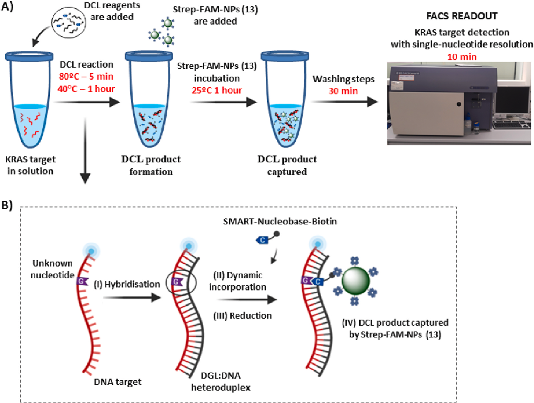
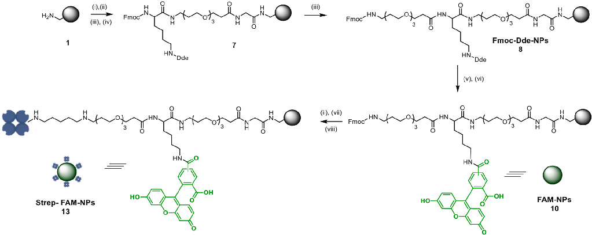
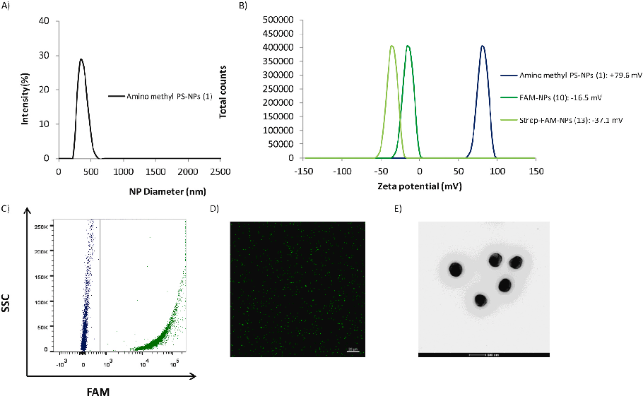
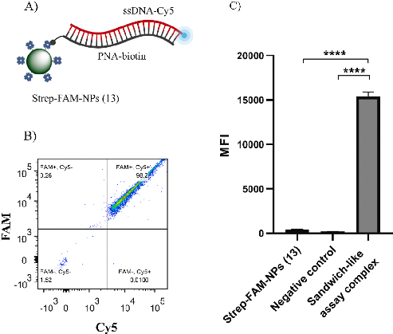
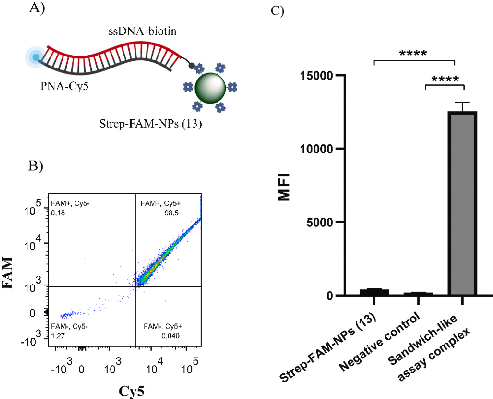
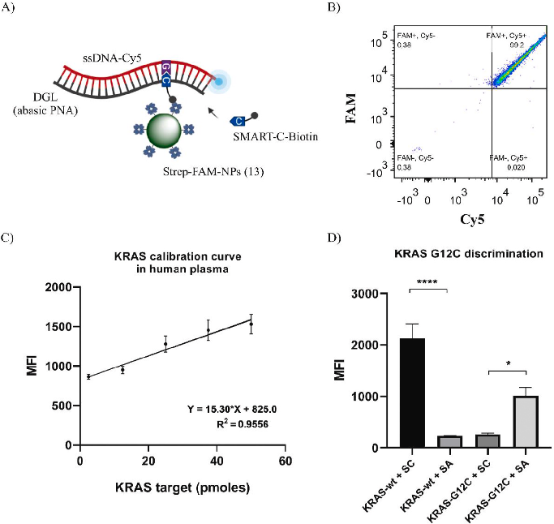

Since January 2020 Elsevier has created a COVID-19 resource centre with  free information in English and Mandarin on the novel coronavirus COVID19. The COVID-19 resource centre is hosted on Elsevier Connect, the  company's public news and information website. 

Elsevier hereby grants permission to make all its COVID-19-related  research that is available on the COVID-19 resource centre - including this  research content - immediately available in PubMed Central and other  publicly funded repositories, such as the WHO COVID database with rights  for unrestricted research re-use and analyses in any form or by any means  with acknowledgement of the original source. These permissions are  granted for free by Elsevier for as long as the COVID-19 resource centre  remains active. 

Talanta 226 (2021) 122092

Contents lists available at ScienceDirect 

Talanta 

journal homepage: www.elsevier.com/locate/talanta 

Development of a nanotechnology-based approach for capturing and  detecting nucleic acids by using flow cytometry 

Agustín Robles-Remachoa,b,c,1, M. Ang´elica Luque-Gonzalez´ a,b,c,1, Roberto A. Gonzalez-Casín´ a,  M. Victoria Cano-Cort´esa,b,c, F. Javier Lopez-Delgadod, Juan J. Guardia-Monteagudod,  Mario Antonio Fara d, Rosario M. Sanchez-Martín´ a,b,c,**, Juan Jos´e Díaz-Mochon´ a,b,c,* 

a GENYO. Centre for Genomics and Oncological Research: Pfizer / University of Granada / Andalusian Regional Government, PTS Granada, Avenida de La Ilustracion,  114, 18016, Granada, Spain  b Department of Medicinal and Organic Chemistry, School of Pharmacy, University of Granada, Campus Cartuja S/n, 18071, Granada, Spain  c Biosanitary Research Institute of Granada (ibs.GRANADA), University Hospital of Granada/University of Granada, Avenida Del Conocimiento, S/n, 18016, Granada,  Spain  d DestiNA Genomica S.L, PTS Granada, Avenida de La Innovacion 1, Edificio BIC, 18100, Armilla, Granada, Spain   ´

A R T I C L E  I N F O    

Keywords:  Nucleic acid testing (NAT)  Fluorescence-activated cell sorting (FACS)  Nanotechnology  Dynamic chemical labeling (DCL)  Peptide nucleic acid (PNA)  KRAS point Mutation 

A B S T R A C T    

Nucleic acid-based molecular diagnosis has gained special importance for the detection and early diagnosis of  genetic diseases as well as for the control of infectious disease outbreaks. The development of systems that allow  for the detection and analysis of nucleic acids in a low-cost and easy-to-use way is of great importance. In this  context, we present a combination of a nanotechnology-based approach with the already validated dynamic  chemical labeling (DCL) technology, capable of reading nucleic acids with single-base resolution. This system  allows for the detection of biotinylated molecular products followed by simple detection using a standard flow  cytometer, a widely used platform in clinical and molecular laboratories, and therefore, is easy to implement.  This proof-of-concept assay has been developed to detect mutations in KRAS codon 12, as these mutations are  highly important in cancer development and cancer treatments.   

1. Introduction 

Early, rapid, and effective nucleic acid analysis is currently in demand for the diagnosis of genetically-based and infectious diseases [1,  2]. It is a key tool for early diagnosis, accurate prognosis, and control of  disease outbreaks. It is noteworthy that it can also be used for treatment  management in personalised medicine. The gold standard for nucleic  acid analysis is quantitative polymerase chain reaction (qPCR) and  reverse-transcription quantitative PCR (RT-qPCR), when RNA is analysed, because of its high specificity, sensitivity, and reproducibility.  However, qPCR is not exempt from issues. For instance, during the  COVID-19 pandemic, the use, almost exclusively, of PCR-based assays  for identifying SARS-CoV-2 created huge problems in terms of material  accessibility and the need to work with isolated RNA molecules [3,4]. 

Thus, developing new methods to rapidly detect and genotype nucleic  acids with high specificity is important in the molecular testing field. In  this context, technologies that can offer advantages over PCR assays,  such as working directly with complex matrix samples while maintaining the high specificity of PCR, are of great interest. 

Herein, we have developed a novel strategy for nucleic acid reading  with single-base resolution based on the combination of bifunctional  polystyrene nanoparticles (PS-NPs) for the capture and analysis of biotinylated products generated by dynamic chemical labelling (DCL)  (Fig. 1A). DCL is an already validated and versatile chemical-based  approach that harnesses the Watson and Crick base-pairing rules for  templating the dynamic incorporation of an aldehyde-modified nucleobase (SMART-Nucleobase) into the abasic position of an abasic peptide  nucleic acid (PNA) probe, also known as a DGL probe (see chemical 

* Corresponding author. GENYO. Centre for Genomics and Oncological Research: Pfizer / University of Granada / Andalusian Regional Government, PTS Granada,  Avenida de la Ilustracion, 114, 18016, Granada, Spain. 

** Corresponding author. GENYO. Centre for Genomics and Oncological Research: Pfizer / University of Granada / Andalusian Regional Government, PTS Granada,  Avenida de la Ilustracion, 114, 18016, Granada, Spain. 

E-mail addresses: rmsanchez@go.ugr.es (R.M. S´anchez-Martín), juanjose.diaz@genyo.es (J.J. Díaz-Mochon).   ´ 1  These authors contributed equally and should be considered co-first authors. 

https://doi.org/10.1016/j.talanta.2021.122092  Received 13 October 2020; Received in revised form 4 January 2021; Accepted 5 January 2021   

Available online 9 January 2021 0039-9140/© 2021 Elsevier B.V. All rights reserved.

A. Robles-Remacho et al.                                                                                                                                                                                                                      

Fig. 1. Single-nucleotide detection of KRAS using DCL in solution and bifunctional Strep-FAM-NPs (13). A) Work-flow scheme: 1) DCL reagents are added and DCL  product is formed; 2) Strep-FAM-NPs (13) are added. These Strep-FAM-NPs (13) capture the DCL product. 3) Washing steps are performed; 4) Readout by FACS  analysis. B) Schematic representation of the hybridisation step (I), followed by the dynamic incorporation of the biotin-labelled SMART-Nucleobase (II) and the  reductive amination using NaBH3CN (III). Finally, the DCL product is captured by the Strep-FAM-NPs (13) (IV). 

structure in Supporting Information 1) [5,6]. These two key reagents,  the DGL probe and the SMART-Nucleobase, can be modified and tagged,  enabling the detection of DCL products by fluorescence, mass spectroscopy, colourimetry, and chemiluminescence. The DCL reaction comprises several steps: in the first step, the DGL probe hybridises with a  complementary target nucleic acid forming a DGL:DNA heteroduplex  (Fig. 1B, step I). This hybridisation occurs so that the nucleotide under  interrogation at the target nucleic acid strand lays opposite to the abasic  position of the DGL probe, creating a so-called chemical pocket. In this  chemical pocket, a reversible reaction between the aldehyde group of  the SMART-Nucleobase and the secondary amine found in the abasic  position results in different and unstable iminium intermediate species  (Fig. 1B, step II). The intermediate formed following the Watson and  Crick base pairing rules is the most stable, allowing the next step, the  irreversible  reductive  amination,  which  covalently  links  the  SMART-Nucleobase into that position (Fig. 1B, step III). Herein, the DCL  product  formed  will  be  captured  by  the  PS-NPs  for  analysis  by  Fluorescence-Activated Cell Sorting (FACS). 

One of the advantages of DCL, compared to standard molecular as-

says, is its ability to detect nucleic acids directly from body fluids  without the need to isolate them. Our group has developed several DCL-  based approaches that have been successfully applied to different  nucleic acid targets using different biological matrices. For instance, the  method was used to genotype single nucleotide polymorphisms related  to cystic fibrosis [7], to quantify the circulating miRNAs found in the  serum of patients [8–13], and to identify parasitic species by identifying  single nucleotide differences within highly homologous regions [14,15]. 

Most of the latest applications of DCL use DGL probes conjugated to solid  supports such as nylon membranes and magnetic beads, so that standard  reading platforms that are available in molecular biology laboratories  could be used [16]. 

In this work, we aimed to use nanoparticles but as solid supports to  capture and detect the formed heteroduplexes rather than as solid supports to conjugate DGL probes. Therefore, the hybridisation processes  can take place in solution, which means that they are thermodynamically favourable when compared to solid-phase processes [17–19]. To  achieve this, we used PS-NPs due to their robustness and stability in the  biological environment, and their compatibility with standard multistep  chemistries,  allowing  different  orthogonal  conjugation  strategies  [20–26]. The novel PS-NPs used in this work are bifunctionalised containing both a streptavidin as the high-affinity partner of biotin, and a  fluorophore  (5  (6)-carboxyfluorescein,  -FAM-)  as  tracker.  These  bifunctional PS-NPs developed for capturing the DCL products in solution are henceforth referred to as Strep-FAM-NPs (13)). 

We performed this proof-of-concept using KRAS codon 12 p. G12C  (c.34G > T) mutation, the most frequent mutation in lung adenocarcinoma [27], as the model. The appearance of point mutations in the  KRAS gene triggers cancer development, and represents around 20–30%  of all mutations found in human tumours, predominantly adenocarcinomas (pancreatic, colorectal, lung, ovarian, cervical, and biliary tract  adenocarcinomas) [2,28,29]. About 99% of mutations in KRAS are point  mutations in codons 12, 13, and 61 of exon 2. Additionally, the  proof-of-concept has been validated to detect miR-122 sequence, a  liver-specific miRNA used as a biomarker of liver damage [12,30], and is 

A. Robles-Remacho et al.                                                                                                                                                                                                                      

Table 1  Sequences of ssDNA, PNA, and DGL probes. KRAS codon 12 is shown in bold.  The nucleotide under interrogation (nucleotide located in from of the PNA  abasic position) is underlined in ssDNA sequences. The abasic position in the  DGL probe is shown as *_*. Wt = wild-type sequence. G12C = presence of a  mismatch (G > T) corresponding to the KRAS G12C point mutation. X = amino-  PEG-linker; HAc = acetyl group; glu = nucleobase containing a propanoic acid  side chain at the gamma position. Chemical structures are available in Supporting Information 1.  

Target nucleic acid sequences.  Sequence (5′–3′) 

ssDNA-KRAS-wt-Cy5  Cy5—TTGGAGCTGGTGGCGTAG  ssDNA-KRAS-G12C-Cy5  Cy5—TTGGAGCTTGTGGCGTAG  ssDNA-KRAS-wt-Biotin  Biotin—TTGGAGCTGGTGGCGTAG 

PNA probes.  Sequence (N–C) 

PNA-KRAS-wt-Biotin  Biotin—xxCTACGCCACCAGCTCCAA  PNA-KRAS-wt-Cy5  Cy5—xxCTACGCCACCAGCTCCAA 

DGL probes.  Sequence (N–C)  DGL-K12RC  HAc –Cys-xxCTACGCCAgluC*_*AGgluCTCCAA  

also associated with hepatocellular carcinoma development [8,12,13]  (see Supporting Information 4 for the validation of this system using  miR-122 as a target). 

2. Materials and methods 

2.1. General 

1% (w/v) BSA in PBS) and 1% (w/v) polaxamer 407 (details are provided in Supporting Information 2). 

2.3. Target selection, probe design, and synthesis 

Synthetic single-stranded DNA (ssDNA) oligomers mimicking codon  12 of KRAS wild-type sequence and KRAS containing G12C mutation  sequence (ssDNA-KRAS-wt-Cy5, ssDNA-KRAS-wt-biotin, and  ssDNA-  KRAS-G12C-Cy5) were purchased from Sigma Aldrich (see Table 1 for  sequences). All sequences were obtained using BLAST analysis [32]. 

SMART-Cytosine-PEG12-Biotin (henceforth referred to as SMART-C-  Biotin), SMART-Adenine-Deaza-PEG12-Biotin (henceforth referred to  as SMART-A-Biotin), PNAs, and DGLs probes were provided by DES-

TINA Genomica S.L. PNA and DGL probes were synthesised on a Intavis  Bioanalytical Instruments MultiPrep CF synthesiser (Intavis AG GmH,  Germany). For this, standard SPPS protocols were followed by successive rounds of coupling of previously activated amino-protected PNA  monomers, followed by deprotection of the amino terminal protecting  group and washes after each step. Once synthesised, the probes were  separated from the resin by treatment with trifluoroacetic acid and  precipitation with cold ether. Subsequently, they were purified by HPLC  and characterised by HPLC and MALDI-TOF. Two PNAs complementary  to KRAS labelled with either Cy5 (PNA-KRAS-wt-Cy5) or biotin (PNA-  KRAS-wt-Biotin), and one DGL complementary to KRAS (DGL-K12RC)  were designed and synthesised (Table 1). Synthetic single-stranded DNA  and probes used for the validation of this system using miR-122  sequence as a target are detailed in Supporting Information 4. 

All chemicals and solvents were obtained from Sigma Aldrich. SCD  buffer was prepared from 2 × saline sodium citrate (SSC) and 0.1%  sodium dodecyl sulphate (SDS) with the pH adjusted to 6.0 using HCl. 

Fmoc-PEG3–COOH and Fmoc-Lys (Dde)-OH were synthesised as previously described [29]. Fmoc-Glycine-OH and Polaxamer 407 were pur-

chased from Sigma Aldrich. Streptavidin was purchased from VWR.  SPPS procedures, DGL probes, and DCL reactions were performed in a  TS-100 Thermo-Shaker (Biosan). Flow cytometry studies were conducted using a BD FACSCanto II™ and analysed with the FlowJo software (version 10). DCL reactions analyses in BD FACSCanto II™ were  performed using the FITC channel, with a 488 nm excitation laser line  and emission collected with a 530/30 nm bandpass filter for FAM  detection (shown on the Y-axis of dot-plots), and APC channel for Cy5  detection, (shown in the X-axis of dot-plots), with a 633 nm excitation  laser line and emission collected with a 670/14 nm bandpass filter. FACS  data were analysed using median fluorescence intensity (MFI) (n = 3) in  the APC channel, and data were analysed using one-way ANOVA. 

2.2. Preparation of Strep-FAM-NPs (13) for capturing DCL products 

PS-NPs (1) (360 nm in size) were synthesised following a dispersion  polymerisation process as previously reported [31]. Fmoc-Dde-NPs (8)  were prepared according to previously described protocols [23]. Briefly,  coupling reactions were carried out in dimethylformamide (DMF) using  the Fmoc–NH–protected monomer (50 equiv) with oxyma (50 equiv)  and N,N′-diisopropylcarbodiimide (DIC) (50 equiv) as coupling agents  (see Supporting Information 2 for synthesis route details). 

Dual NP functionalization was achieved via the orthogonally pro-

tected amine groups on the PS-NPs. Fluorescein-functionalized NPs  (FAM-NPs (10)) were obtained by removing the Dde group from Lys  followed by the conjugation of FAM through amide bond formation.  Then, the Fmoc protecting group was removed, and the free primary  amine PS-NPs were treated with a glutaraldehyde solution (25% (w/v)  in phosphate buffered saline (PBS) before streptavidin conjugation (60  mM) in PBS (pH 7.4) and treatment with a sodium cyanoborohydride  solution (20 mM) in PBS/EtOH (3:1) for 2 h to obtain bifunctionalised  Strep-FAM-NPs (13). Finally, Strep-FAM-NPs (13) were washed with  PBS and treated with a quenching solution (40 mM ethanolamine with 

2.4. PNA:DNA and DGL:DNA heteroduplex formation and DCL reaction  in human plasma  

a) PNA:DNA hybridisation. Hybridisation assays were performed by  incubating ssDNA (1 μM) and PNA probes (1 μM) in SCD buffer (pH  6) in a 1.5 mL tube placed in a Thermo-Shaker at 80 ◦C for 5 min,  with shaking at 1400 rpm. Then, the reaction was cooled to 41 ◦C at  3 ◦C/min followed by incubation for 1 h.  

b) DCL reactions. DCL reactions were performed by incubating ssDNA  (1 μM) and DGL probe (1 μM) together with SMART-C-biotin (5 μM)  under the same conditions described above for PNA:DNA heteroduplex formation. Once the temperature reached 41 ◦C, sodium cyanoborohydride was added to a final concentration of 1 mM, and the  reaction was incubated at 41 ◦C for 1 h while shaking at 1400 rpm. 

To assess the DCL reaction occurs in a complex biological matrix, a  calibration curve was performed in diluted human plasma. Five quantities of target (ssDNA-KRAS-wt-Cy5) were spiked in (2.5 pmol, 12.5  pmol, 25 pmol, 37.5 pmol and 50 pmol), followed by the addition of SCD  buffer (pH 6; 1:4) containing 1 μM of DGL probe in a total volume of 50  μL. Then, the reaction was mixed and incubated at 80 ◦C for 5 min,  shaken at 1400 rpm, cooled to 41 ◦C, and incubated for 1 h. The human  plasma samples from healthy donors were provided by the Biobank of  the Andalusian Public Health System (agreement number S1900297)  approved by the Committee of Ethics of Biomedical Research of Andalusia (study code: 32,160,041). 

In all cases, after incubation at 41 ◦C, 5 × 108 Strep-FAM-NPs (13)  were added and incubated at 25 ◦C for 1 h with shaking at 1400 rpm. For  more details about the determination of the number of NPs, see Supporting Information 2.7. Finally, the NPs were washed with PBS 0.1%  tween (3 × 200 μL; 5 min at 12,000 rpm)), resuspended in 200 μL of PBS,  and analysed by flow cytometry. 

A. Robles-Remacho et al.                                                                                                                                                                                                                      

3. Results and discussion 

3.1. Preparation and characterisation of bifunctional Strep-FAM-NPs 

(13) 

Bifunctional Strep-FAM-NPs (13), designed to capture biotinylated  molecular products, were prepared by conjugating the streptavidin 

moiety and a fluorophore, FAM. These nanoparticles were successfully  prepared using standard protocols based on Fmoc solid-phase chemistry  with oxyma and N,N-diisopropylcarbodiimide (DIC) as coupling reagents (see synthetic details in Supporting Information 2). The loading  of  aminomethyl-PS-NPs  (1)  (0.022  mmol/g)  was  determined  by  coupling the Fmoc-Gly OH amino acid. After coupling reactions, their  efficiencies were monitored using the Kaiser colorimetric test [33]. To 

Fig. 2. Synthetic scheme of aminomethyl PS-NPs bifunctionalisation with FAM and streptavidin (Strep-FAM-NPs (13)). Aminomethyl PS-NPs (1) were functionalized  following SPPs standard protocols to obtain bifunctionalised Strep-FAM-NPs (13). Reagents and conditions: (i) Fmoc-Gly-OH, Oxyma, DIC (1400 rpm, 2 h, 60 ◦C); (ii)  20% piperidine in DMF (1400 rpm, 3 × 20 min, 25 ◦C); (iii) Fmoc-PEG-OH, Oxyma, DIC (1400 rpm, 2 h, 60 ◦C); (iv) Fmoc-Lys-Dde (OH), Oxyma, DIC 1400 rpm, 2 h,  60 ◦C); (v) 3.5 Hydroxylamine, HCl, Imidazole, NMP (1400 rpm, 1 h, 25 ◦C); (vi) FAM, Oxyma, DIC (1400 rpm, 2 h, 60 ◦C); (vii) 25% glutaraldehyde in PBS (1400  rpm, 16 h 25 ◦C); (viii) 0.3 μg/mL streptavidin in PBS (1400 rpm, 25 ◦C, 16 h). 

Fig. 3. Characterisation of Strep-FAM-NPs (13). (A) Size distribution determined by DLS; (B) Values of the zeta potential of amino-methyl PS-NPs (1) (blue), FAM-  NPs (10) (dark green) and Strep-FAM-NPs (13) (green); (C) Scatter plot analysis representative of amino-methyl NPs (1) (blue) and Strep-FAM-NPs (13) (green); (D)  Confocal laser microscopy analysis (63 × magnification, 20 μm scale bar, FITC channel) and (E) Evaluation of morphology by transmission electron microscopy  (TEM). (For interpretation of the references to color in this figure legend, the reader is referred to the Web version of this article.) 

A. Robles-Remacho et al.                                                                                                                                                                                                                      

Fig. 4. BD FACS results for validation of Strep-FAM-NPs (13) to capture bio-

tinylated PNA:DNA heteroduplex. A) Scheme representing the Strep-FAM-NPs  (13) recognizing the biotinylated and Cy5-labelled PNA:DNA heteroduplex.  B) FACS results show that the complete sandwich-like assay structure provides  an FAM+/Cy5+ population. C) MFI in the APC channel (n = 3) representation  and one-way ANOVA analysis. A strong MFI increase is observed when the  sandwich-like assay complex is complete. 

achieve efficient covalent functionalization of both cargoes to PS-NPs in  a controlled manner, an orthogonal strategy, based on the full orthogonality between Dde and Fmoc protecting groups was carried out to  achieve Fmoc-Dde-NPs (8) (Fig. 2). Then, the fluorophore was conju-

gated by amide bond formation following Dde deprotection (FAM-NPs  (10)),  and  streptavidin  was  conjugated  using  glutaraldehyde  as  a  cross-linker, following Fmoc deprotection, to achieve Strep-FAM-NPs  (13). 

Size distribution was determined by dynamic light scattering (DLS)  with a monodisperse nanoparticle population (hydrodynamic diameter  was 357.2  ± 0.9 nm with a polydispersity index (PDI) of 0.066)  (Fig. 3A). The zeta potential value of Strep-FAM-NPs (13) in water was  slightly negative (� 37.1 mV ± 0.8), as compared to FAM-NPs (10) and  amino-methyl-NPs (1), which were � 16.5 mV ± 0.8 and +79.6 mV ± 0.9, respectively (Fig. 3B). The efficiency of fluorophore conjugation to  the nanoparticles was monitored using fluorescence-based techniques.  Fig. 3C shows a representative plot of the flow cytometry analysis  showing the increase in fluorescence of the Strep-FAM-NPs (13) conjugates concerning unloaded nanoparticles (aminomethyl-PS-NPs (1)).  This result was corroborated by confocal microscopy (Fig. 3D), and the  size  was corroborated  by transmission  electron microscopy (TEM)  analysis (Fig. 3E). The concentration of Strep-FAM-NPs (13) (7,8 × 106  NPs/μL) was calculated according to the spectrophotometric method  developed by our group [34] (see more details in Supporting Information 2). The amount of conjugated streptavidin (0.06236 mmol/mL) in  the Strep-FAM-NPs (13) was determined by measuring the initial and  final concentrations in the reaction vessel using a bicinchoninic acid  assay (BCA assay) [35]. To determine the stability of streptavidin  conjugation, Strep-FAM-NPs (13) were treated with a 0.4% SDS solution  in PBS for 15 min at 70 ◦C, and the supernatants were analysed by the  BCA test, showing the absence of streptavidin and therefore, showing  the stability and strength of streptavidin binding to the NPs (see Supporting Information 2.6 for more details). 

Fig. 5. BD FACS results for validation of Strep-FAM-NPs (13) to capture biotinylated PNA:DNA heteroduplex, in which DNA is biotinylated. A) Scheme  representing the Strep-FAM-NPs (13) recognizing the biotinylated heteroduplex. B) FACS results show that the complete sandwich structure provides an  FAM+/Cy5+ population, confirming the DNA detection despite the biotin  location. C) MFI in the APC channel (n  = 3) representation and one-way  ANOVA analysis. A strong MFI increase is observed when the sandwich-like  assay complex is complete. 

3.2. Validation of Strep-FAM-NPs (13) to capture biotinylated PNA:DNA  heteroduplex 

The capacity of Strep-FAM-NPs (13) to capture biotinylated PNA:  DNA heteroduplex was evaluated using a sandwich-like assay, and the  efficiency was evaluated by flow cytometry analysis. Since Strep-FAM-  NPs (13) were FAM-labelled, and the PNA:DNA heteroduplex was fluorescently labelled with Cy5, the efficient binding of the Strep-FAM-NPs  (13) to the biotinylated-Cy5-labelled heteroduplex was confirmed by  obtaining a double-positive population FAM+/Cy5+. Fig. 4A shows a  schematic of this PNA-Biotin:DNA-Cy5:Strep-FAM-NPs sandwich-like  construct. Flow cytometry analysis showed that Strep-FAM-NPs (13)  provide a single positive FAM+/Cy5-  population and, as a negative  control, when the sandwich complex is not complete due to the absence  of the biotinylated-labelled probe, the sample run results in an FAM+/  Cy5- population, confirming the absence of nonspecific absorption of the  target (see Supporting Information 3 for more details). If the biotinylated- and Cy5-labelled heteroduplex is formed, a 98 ± 1% FAM+/  Cy5+ population is observed, meaning that this percentage of Strep-  FAM-NPs (13) population has captured the heteroduplex (Fig. 4B).  FACS results were analysed using MFI (n  = 3) in the APC channel,  showing a strong MFI increase when the sandwich construct was complete (Fig. 4C). Additionally, this validation has been performed using  miR-122 sequence as a target (see Supporting Information 4 for more  details). 

To validate the capacity of the Strep-FAM-NPs (13) to capture any  biotinylated target, a second proof-of-concept assay was carried out. For  this assay, a biotinylated KRAS nucleic acid sequence (ssDNA-KRAS-wt-  biotin) and its complementary PNA labelled with the Cy5 fluorophore  (PNA-KRAS-wt-Cy5) were used (see sequences in Table 1). After the  formation of the PNA:DNA heteroduplex, the product was captured by  Strep-FAM-NPs (13) (Fig. 5A). Flow cytometry analysis showed that the  Strep-FAM-NPs (13) provide an FAM+/Cy5-  population similar to the  population obtained in the absence of the biotinylated-labelled probe (as  a negative control sample) (see Supporting Information 3 for more details). Strep-FAM-NPs (13) can bind to the heteroduplex formed in the  presence  of  the  Cy5-labelled  PNA  probe  and  its  complementary 

A. Robles-Remacho et al.                                                                                                                                                                                                                      

Fig. 6. KRAS detection and G12C point mutation  discrimination using DCL in solution and bifunctional  Strep-FAM-NPs (13). A) Scheme of the biotinylated  DCL product formed. B) FACS analysis: When the  SMART-C-Biotin is incorporated into the abasic site,  the  population  is  FAM+/Cy5+,  indicative  of  the  detection of the KRAS wild-type sequence. C) Calibration curve by synthetic KRAS-wt-Cy5 sequence in  human plasma. The dots represent the mean and SEM  (n  = 3) of MFI in the APC channel. D) Specificity  assay for the discrimination of the KRAS G12C point  mutation. SC  = SMART-C-Biotin. SA  = SMART-A-  Biotin. MFI values in the APC channel from each  condition were compared using one-way ANOVA.   

biotinylated ssDNA, resulting in a 97.83 ± 0.70% FAM+/Cy5+ double-  positive population (Fig. 5B). The samples were analysed using MFI  (n = 3) in the APC channel, showing a strong MFI increase when the  sandwich construct was complete (Fig. 5C). 

Based on these flow cytometry results obtained using biotinylated  molecular products for KRAS, we can confirm that these Strep-FAM-NPs  (13) can efficiently capture a PNA:DNA heteroduplex regardless of the  biotinylated component position. 

3.3. Detection of DCL products by Strep-FAM-NPs (13): KRAS  calibration curve in human plasma and KRAS G12C point mutation  discrimination 

The capacity of the system to detect the KRAS sequence as well as  mutations present in codon 12 was evaluated. For this purpose, a DGL  probe (DGL-K12RC) was designed to carry an abasic site in front of the  first nucleotide of KRAS codon 12. The position of the abasic site means  that after hybridisation with a KRAS wild-type nucleic acid sequence,  there would be a guanine in front of the abasic position, hence templating the dynamic incorporation of the complementary SMART-C-  Biotin. However, when the DGL-K12RC hybridises with a KRAS G12C  mutated nucleic acid sequence, there would be a thymine in front of the  abasic position, hence templating the dynamic incorporation of the  complementary SMART-A-Biotin. 

Fig. 6A shows the structure of the DCL product captured by Strep-  FAM-NPs (13). The capacity of these bifunctional nanoparticles for  capturing the DCL product was evaluated by flow cytometry. Strep-  FAM-NPs (13) and the incomplete construct provide an FAM+/Cy5-  population (see Supporting Information 3 for more details). When the  fluorescent  heteroduplex  DNA-KRAS-wt-Cy5:DGL-K12RC  is  formed,  SMART-C-Biotin is incorporated into the abasic site and the Strep-FAM-  NPs (13) are able to capture the complex, resulting in an 98.23 ± 1.06% 

FAM+/Cy5+ population (Fig. 6B), indicating the detection of the KRAS-  wild-type sequence. Additionally, the detection of DCL products by  Strep-FAM-NPs (13) has been validated using miR-122 sequence as a  target (see Supporting Information 4 for more details). These results  confirm that DCL process has been successfully performed in solution  and DCL products were captured by Strep-FAM-NPs (13). Some constraints that affect the efficiency of DNA hybridisation on surfaces such  as nonspecific adsorption of the attached oligonucleotides to the solid  surface [17–19] have been avoided by using this approach. 

To  ensure  the  analytical  capability  of  Strep-FAM-NPs  (13)  for  capturing and detecting KRAS target in a complex biological medium, a  calibration curve was generated by the spike in different quantities of  ssDNA-KRAS-wt-Cy5 sequence (2.5 pmol, 12.5 pmol, 25 pmol, 37.5  pmol and 50 pmol) in human plasma, followed by a DCL reaction in a  total volume of 50 μL. Each condition was analysed using MFI in the APC  channel. The plot of MFI versus the target quantities showed a linear  regression, confirming the suitability of the Strep-FAM-NPs (13) for  capturing and detecting the wild-type KRAS target sequence (Fig. 6C).  The experiments were repeated three times for each condition (n = 3),  showing a coefficient of variation ranging from 5% to 15%. The limit of  detection was 2.5 ± 0.09 pmoles (12.5 nM) (showing an average MFI  signal to background ratio of 2.20 ± 0.08), corresponding to 1.5055E + 12 molecules of target. 

To assess the specificity of the system to discriminate the presence of  the KRAS G12C point mutation, two DCL reactions were performed  using the ssDNA-KRAS-wt-Cy5 sequence and the ssDNA-KRAS-G12C-  Cy5  sequence  together  with  both  SMART-C-Biotin  and  SMART-A-  Biotin. The results showed a strong MFI increase in the APC channel  when the incorporation of the SMART-Nucleobase was specific (SMART-  C-Biotin in the KRAS wild-type sequence, and SMART-A-Biotin in the  KRAS G12C mutated sequence) (Fig. 6D). 

These results have showed that the Strep-FAM-NPs (13) are suitable 

A. Robles-Remacho et al.                                                                                                                                                                                                                      

for capturing nucleic acids in a complex biological matrix and, by using  FACS analysis, the system is capable to detect the presence of the KRAS  G12C point mutation. The methodology developed in this work can be  performed within 3 h by using widely available reading platforms such  as the flow cytometer with a limit of detection of 2.5 pmoles (12.5 nM).  Although further optimisation has still to be done, for instance to increase the sensibility of this approach, this proof-of-concept could be  adaptable and comparable to other existing methods currently used to  detect point mutations [36–39]. 

Delgado thanks the Spanish Ministry of Economy and Competitiveness  for the Torres Quevedo fellowship (PTQ-16- 08597). These studies were  approved and supported by DestiNA Genomics Ltd. Schemes in Figs. 1  and 4–6 have been partially created using BioRender.com. 

Appendix A. Supplementary data 

Supplementary data to this article can be found online at https://doi.  org/10.1016/j.talanta.2021.122092. 

4. Conclusions 

Herein, we have presented the development of bifunctional nanoparticles for capturing DCL products, in which hybridisation processes  has been performed in solution-phase, enabling nucleic acid detection  with single-base resolution using flow cytometry. This is the first time  that DCL processes have been performed in solution (meaning that  hybridisation processes are thermodynamically favourable) and DCL  products have been read using bead-based platforms. To do so, novel  bifunctional nanoparticles, Strep-FAM-NPs (13), containing streptavidin  and fluorescein, were developed and characterised. These initial proof-  of-concept experiments have demonstrated that these novel bifunctional  nanoparticles are able to efficiently capture biotinylated and fluorescently labelled PNA:DNA heteroduplex. The system can detect DCL  products in a complex biological matrix such as human plasma, and it is  specific to discriminate single-base variations, in this case, discriminating a KRAS wild-type sequence and a KRAS G12C mutated sequence. 

The methodology developed in this work can be performed within 3  h by using flow cytometry, widely used in molecular laboratories, with a  limit of detection of 2.5 pmoles (12.5 nM). For these reasons, we  consider this methodology can be adaptable and comparable to other  existing methodologies used to detect point mutations. Furthermore, the  wide possibility to conjugate cargoes of different natures such as  different fluorophores as well as molecules to the PS-NPs, together with  the DCL technology, will lead to the development of novel strategies for  nucleic acid analysis with single-base resolution. 

Moreover, this study, which can be adapted to other chemistries used  in molecular testing, as it enables the capture of biotinylated molecular  products produced in solution, opens up opportunities to develop novel  assay formats for nucleic acid genotyping and detection of high homologous sequencing directly from body fluids or amplicons obtained  by endpoint PCR. 

Credit Author Statement 

ARR & MALG: Designed, performed the experiments and wrote the  paper. RAGC: Performed the experiments. VCC: Designed and characterised the nanoparticles. FJLD: Synthesis of SMART-Nucleobase. JJGM:  Probe synthesis and purification. MAF: Designed synthesis pathways for  SMART Nucleobases and optimisation of protocols for abasic PNA synthesis. RMSM: Designed the experiments, wrote and edited the paper.  JJDM: Designed the experiments, wrote and edited the paper. 

Declaration of competing interest 

The authors declare that they have no known competing financial  interests or personal relationships that could have appeared to influence  the work reported in this paper. 

Acknowledgements 

This research was supported by the Spanish Ministry of Economy and  Competitiveness  (grant  number  BIO2016-80519).  The  authors  are  members of the NANOCARE network (RED2018-102469-T) funded by  the STATE INVESTIGATION AGENCY. ARR thanks the Spanish Ministry  of Education for PhD funding (scholarship FPU15/06418). FJ Lopez- ´

References 

[1] G.P. Patrinos, P.B. Danielson, W.J. Ansorge, Molecular Diagnostics: Past, Present,  and Future, Elsevier Ltd, 2017, https://doi.org/10.1016/B978-0-12-802971-  8.00001-8. 

[2] C. Tan, X. Du, KRAS mutation testing in metastatic colorectal cancer, World J.  Gastroenterol. 18 (2012) 5171–5180, https://doi.org/10.3748/wjg.v18.i37.5171. 

[3] J. Akst, RNA extraction kits for COVID-19 tests are in short supply in US. The  scientist, Updated 11 March 2020. [Accessed 25 Sept 2020]. Available from: htt  ps://www.the-scientist.com/news-opinion/rna-extraction-kits-for-covid-19-tests-a  re-inshort-supply-in-us-67250. 

[4] S. Fomsgaard Anna, W. Rosenstierne Maiken, An alternative workflow for  molecular detection of SARS-CoV-2 – escape from the NA extraction kit-shortage,  Copenhagen, Denmark, Euro Surveill. 25 (14) (2020), pii=2000398, https://doi.  org/10.2807/1560-7917.ES.2020.25.14.2000398. 

[5] F.R. Bowler, J.J. Diaz-Mochon, M.D. Swift, M. Bradley, DNA analysis by dynamic  chemistry, Angew. Chem. Int. Ed. 49 (2010) 1809–1812, https://doi.org/10.1002/  anie.200905699. 

[6] M. Bradley, J.J. Díaz-Mochon, Nucleobase Characterisation, 2009. ´ WO2009037473 A2. 

[7] F.R. Bowler, P.A. Reid, C. Boyd, J.J. Diaz-Mochon, M. Bradley, Dynamic chemistry  for enzyme-free allele discrimination in genotyping by MALDI-TOF mass  spectrometry, Anal. Methods. 3 (2011) 1656–1663, https://doi.org/10.1039/  c1ay05176h. 

[8] D.M. Rissin, B. Lopez-Longarela, S. Pernagallo, H. Ilyine, A.D.B. Vliegenthart, J. ´ W. Dear, J.J. Díaz-Mochon, D.C. Duffy, Polymerase-free measurement of ´ microRNA-122 with single base specificity using single molecule arrays: detection  of drug-induced liver injury, PloS One 12 (2017) 1–15, https://doi.org/10.1371/  journal.pone.0179669. 

[9] A. Marín-Romero, A. Robles-Remacho, M. Tabraue-ChAvez, Ba Lopez-Longarela, R. ´ M. S´anchez-Martín, J.J. Guardia-Monteagudo, M.A. Fara, F.J. Lopez-Delgado, ´ S. Pernagallo, J.J. Díaz-Mochon, A PCR-free technology to detect and quantify ´ microRNAs directly from human plasma, Analyst 143 (2018) 5676–5682, https://  doi.org/10.1039/c8an01397g. 

[10] A. Delgado-Gonzalez, A. Robles-Remacho, A. Marin-Romero, S. Detassis, B. Lopez-  Longarela, F.J. Lopez-Delgado, D. de Miguel-Perez, J.J. Guardia-Monteagudo, M.  A. Fara, M. Tabraue-Chavez, S. Pernagallo, R.M. Sanchez-Martin, J.J. Diaz-  Mochon, PCR-free and chemistry-based technology for miR-21 rapid detection  directly from tumour cells, Talanta 200 (2019) 51–56, https://doi.org/10.1016/j.  talanta.2019.03.039. 

[11] S. Detassis, M. Grasso, M. Tabraue-Ch´avez, A. Marín-Romero, B. Lopez-Longarela, ´ H. Ilyine, C. Ress, S. Ceriani, M. Erspan, A. Maglione, J.J. Díaz-Mochon, ´ S. Pernagallo, M.A. Denti, New platform for the direct profiling of microRNAs in  biofluids, Anal. Chem. 91 (2019) 5874–5880, https://doi.org/10.1021/acs.  analchem.9b00213. 

[12] B. Lopez-Longarela, E.E. Morrison, J.D. Tranter, L. Chahman-Vos, J.F. L´ ´eonard, J.  C. Gautier, S. Laurent, A. Lartigau, E. Boitier, L. Sautier, P. Carmona-Saez,  J. Martorell-Marugan, R.J. Mellanby, S. Pernagallo, H. Ilyine, D.M. Rissin, D.  C. Duffy, J.W. Dear, J.J. Díaz-Mochon, Direct detection of miR-122 in ´ hepatotoxicity using dynamic chemical labeling overcomes stability and isomiR  challenges, Anal. Chem. 92 (2020) 3388–3395, https://doi.org/10.1021/acs.  analchem.9b05449. 

[13] A. Marín-Romero, M. Tabraue-Chavez, J.W. Dear, R.M. S´ anchez-Martín, H. Ilyine, ´ J.J. Guardia-Monteagudo, M.A. Fara, F.J. Lopez-Delgado, J.J. Díaz-Moch´ on, ´ S. Pernagallo, Amplification-free profiling of microRNA-122 biomarker in DILI  patient serums, using the luminex MAGPIX system, Talanta 219 (2020) 121265,  https://doi.org/10.1016/j.talanta.2020.121265. 

[14] M. Ang´elica Luque-Gonzalez, M. Tabraue-Ch´ ´avez, B. Lopez-Longarela, R. María ´ S´anchez-Martín, M. Ortiz-Gonzalez, M. Soriano-Rodríguez, J. Antonio García- ´ Salcedo, S. Pernagallo, J. Jos´e Díaz-Mochon, Identification of Trypanosomatids by ´ detecting Single Nucleotide Fingerprints using DNA analysis by dynamic chemistry  with MALDI-ToF, Talanta 176 (2018) 299–307, https://doi.org/10.1016/j.  talanta.2017.07.059. 

[15] M. Tabraue-Chavez, M.A. Luque-Gonz´ ´alez, A. Marín-Romero, R.M. Sanchez- ´

Martín, P. Escobedo-Araque, S. Pernagallo, J.J. Díaz-Mochon, A colorimetric ´ strategy based on dynamic chemistry for direct detection of Trypanosomatid  species, Sci. Rep. 9 (2019) 1–13, https://doi.org/10.1038/s41598-019-39946-0. 

[16] S. Venkateswaran, M.A. Luque-Gonzalez, M. Tabraue-Ch´ avez, M.A. Fara, B. L´ opez- ´ Longarela, V. Cano-Cortes, F.J. Lopez-Delgado, R.M. S´ ´anchez-Martín, H. Ilyine,  M. Bradley, S. Pernagallo, J.J. Díaz-Mochon, Novel bead-based platform for direct ´ detection of unlabelled nucleic acids through Single Nucleobase Labelling, Talanta  161 (2016) 489–496, https://doi.org/10.1016/j.talanta.2016.08.072. 

A. Robles-Remacho et al.                                                                                                                                                                                                                      

[17] H. Ravan, S. Kashanian, N. Sanadgol, A. Badoei-Dalfard, Z. Karami, Strategies for  optimizing DNA hybridization on surfaces, Anal. Biochem. 444 (2014) 41–46,  https://doi.org/10.1016/j.ab.2013.09.032. 

[18] D. Irving, P. Gong, R. Levicky, DNA surface hybridization: comparison of theory  and experiment, J. Phys. Chem. B 114 (2010) 7631–7640, https://doi.org/  10.1021/jp100860z. 

[19] R. Levicky, A. Horgan, Physicochemical perspectives on DNA microarray and  biosensor technologies, Trends Biotechnol. 23 (2005) 143–149, https://doi.org/  10.1016/j.tibtech.2005.01.004. 

[20] R.M. Yusop, A. Unciti-Broceta, E.M.V. Johansson, R.M. S´anchez-Martín,  M. Bradley, Palladium-mediated intracellular chemistry, Nat. Chem. 3 (2011)  239–243, https://doi.org/10.1038/nchem.981. 

[21] A. Tsakiridis, L.M. Alexander, N. Gennet, R.M. Sanchez-Martin, A. Livigni, M. Li,  M. Bradley, J.M. Brickman, Microsphere-based tracing and molecular delivery in  embryonic stem cells, Biomaterials 30 (2009) 5853–5861, https://doi.org/  10.1016/j.biomaterials.2009.06.024. 

[22] R.M. Sanchez-Martin, L. Alexander, M. Muzerelle, J.M. Cardenas-Maestre,  A. Tsakiridis, J.M. Brickman, M. Bradley, Microsphere-mediated protein delivery  into cells, Chembiochem 10 (2009) 1453–1456, https://doi.org/10.1002/  cbic.200900136. 

[23] J.M. Cardenas-Maestre, A.M. P´ ´erez-Lopez, M. Bradley, R.M. S˜ anchez-Martín, ´ Microsphere-based intracellular sensing of caspase-3/7 in apoptotic living cells,  Macromol, Biosci 14 (2014) 923–928, https://doi.org/10.1002/mabi.201300525. 

[24] P. Altea-Manzano, J.D. Unciti-Broceta, V. Cano-Cortes, M.P. Ruiz-Blas, T. Valero-  Grinan, J.J. Diaz-Mochon, R. Sanchez-Martin, Tracking cell proliferation using a ˜ nanotechnology-based approach, Nanomedicine 12 (2017) 1591–1605, https://  doi.org/10.2217/nnm-2017-0118. 

[25] J.G. Borger, J.M. Cardenas-Maestre, R. Zamoyska, R.M. Sanchez-Martin, Novel  strategy for microsphere-mediated DNA transfection, Bioconjugate Chem. 22 

(2011) 1904–1908, https://doi.org/10.1021/bc200289n. 

[26] M.V. Cano-Cortes, S.A. Navarro-Marchal, M.P. Ruiz-Blas, J.J. Diaz-Mochon, J.  A. Marchal, R.M. Sanchez-Martin, A versatile theranostic nanodevice based on an  orthogonal bioconjugation strategy for efficient targeted treatment and monitoring  of triple negative breast cancer, Nanomed. Nanotechnol. Biol. Med. 24 (2020)  102120, https://doi.org/10.1016/j.nano.2019.102120. 

[27] S. Li, A. Balmain, C.M. Counter, A model for RAS mutation patterns in cancers:  finding the sweet spot, Nat. Rev. Canc. 18 (2018) 767–777, https://doi.org/  10.1038/s41568-018-0076-6. 

[28] K. Rajalingam, R. Schreck, U.R. Rapp, S. Albert, Ras oncogenes and their ˇ downstream targets, Biochim. Biophys. Acta Mol. Cell Res. 1773 (2007)  1177–1195, https://doi.org/10.1016/j.bbamcr.2007.01.012. 

[29] S. Schubbert, K. Shannon, G. Bollag, Hyperactive Ras in developmental disorders  and cancer, Nat. Rev. Canc. 7 (2007) 295–308, https://doi.org/10.1038/nrc2109. 

[30] P.J. Starkey Lewis, J. Dear, V. Platt, K.J. Simpson, D.G.N. Craig, D.J. Antoine, N.  S. French, N. Dhaun, D.J. Webb, E.M. Costello, J.P. Neoptolemos, J. Moggs, C.  E. Goldring, B.K. Park, Circulating microRNAs as potential markers of human drug-  induced liver injury, Hepatology 54 (2011) 1767–1776, https://doi.org/10.1002/  hep.24538. 

[31] A. Unciti-Broceta, E.M.V. Johansson, R.M. Yusop, R.M. S´anchez-Martín,  M. Bradley, Synthesis of polystyrene microspheres and functionalization with pd0  nanoparticles to perform bioorthogonal organometallic chemistry in living cells,  Nat. Protoc. 7 (2012) 1207–1218, https://doi.org/10.1038/nprot.2012.052. 

[32] J. Zhang, T.L. Madden, PowerBLAST: a new network BLAST application for  interactive or automated sequence analysis and annotation, Genome Res. 7 (1997)  649–656, https://doi.org/10.1101/gr.7.6.649. 

[33] E. Kaiser, R.L. Colescott, C.D. Bossinger, P.I. Cook, Color test for detection of free  terminal amino groups in the solid-phase synthesis of peptides, Anal. Biochem. 34 

(1970) 595–598, https://doi.org/10.1016/0003-2697(70)90146-6. 

[34] J.D. Unciti-Broceta, V. Cano-Cort´es, P. Altea-Manzano, S. Pernagallo, J.J. Díaz-  Mochon, R.M. S´ anchez-Martín, Number of nanoparticles per cell through a ´ spectrophotometric method - a key parameter to assess nanoparticle-based cellular  assays, Sci. Rep. 5 (2015) 1–10, https://doi.org/10.1038/srep10091. 

[35] P.K. Smith, R.I. Krohn, G.T. Hermanson, A.K. Mallia, F.H. Gartner, M.  D. Provenzano, E.K. Fujimoto, N.M. Goeke, B.J. Olson, D.C. Klenk, Measurement of  protein using bicinchoninic acid, Anal. Biochem. 150 (1) (1985) 76–85, https://  doi.org/10.1016/0003-2697(85)90442-7. 

[36] O. Nordgård, S. Oltedal, E.A.M. Janssen, B. Gilje, H. Kørner, K. Tjensvoll, 

R. Smaaland, Comparison of a PNA clamp PCR and an ARMS/Scorpion PCR assay  for the detection of K-ras mutations, Diagn. Mol. Pathol. 21 (2012) 9–13, https://  doi.org/10.1097/PDM.0b013e31821e59dc. 

[37] M. Van Haele, S. Vander Borght, A. Ceulemans, M. Wie¨ers, S. Metsu, X. Sagaert,  B. Weynand, Rapid clinical mutational testing of KRAS, BRAF and EGFR: a  prospective comparative analysis of the Idylla technique with high-throughput  next-generation sequencing, J. Clin. Pathol. 73 (2020) 35–41, https://doi.org/  10.1136/jclinpath-2019-205970. 

[38] M. Matsunaga, T. Kaneta, K. Miwa, W. Ichikawa, K.I. Fujita, F. Nagashima,  J. Furuse, M. Kage, Y. Akagi, Y. Sasaki, A comparison of four methods for detecting  KRAS mutations in formalin-fixed specimens from metastatic colorectal cancer  patients, Oncol. Lett. 12 (2016) 150–156, https://doi.org/10.3892/ol.2016.4576. 

[39] L. Bolton, A. Reiman, K. Lucas, J. Timms, I.A. Cree, KRAS mutation analysis by  PCR: a comparison of two methods, PloS One 10 (2015) 1–13, https://doi.org/  10.1371/journal.pone.0115672. 

