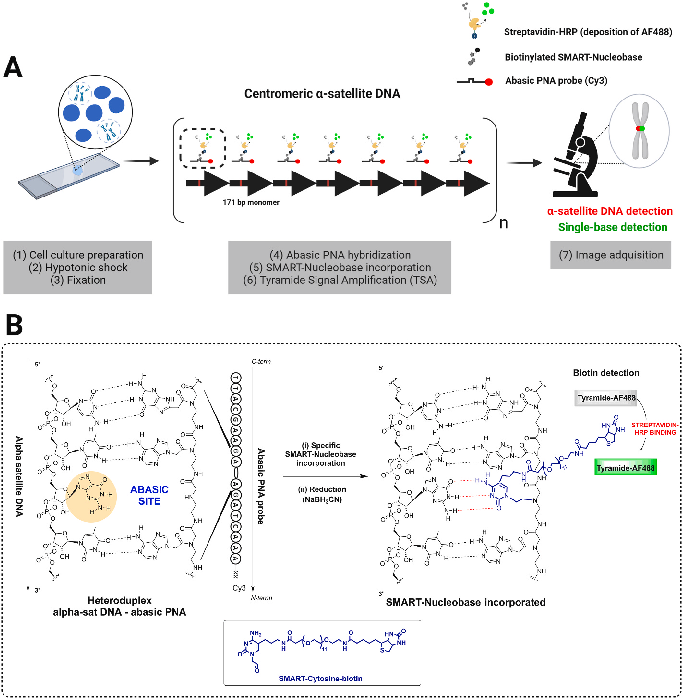
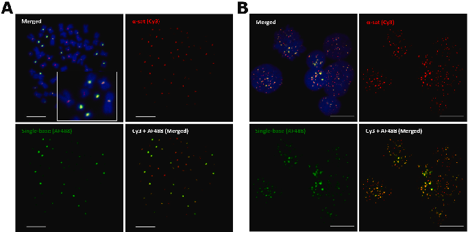
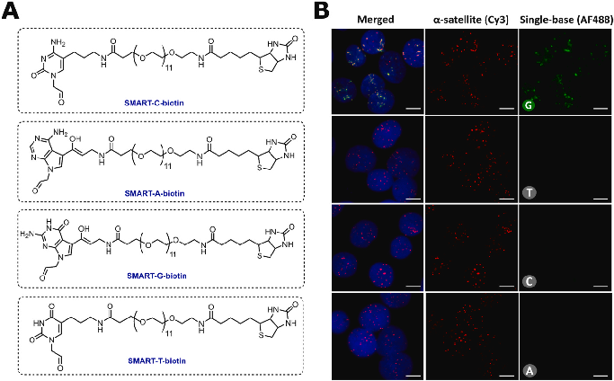
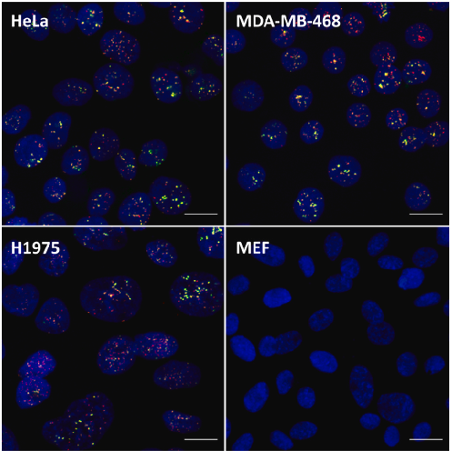
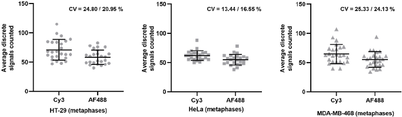

Biosensors and Bioelectronics 219 (2023) 114770

Contents lists available at ScienceDirect 

Biosensors and Bioelectronics 

journal homepage: www.elsevier.com/locate/bios 

Direct detection of alpha satellite DNA with single-base resolution by using  abasic Peptide Nucleic Acids and Fluorescent in situ Hybridization 

Agustín Robles-Remacho a,b,c, M. Angelica Luque-Gonzaleza,b,c, F. Javier Lopez-Delgado´ d,  Juan J. Guardia-Monteagudod, Mario Antonio Farad, Salvatore Pernagallod,  Rosario M. Sanchez-Martina,b,c,**, Juan Jose Diaz-Mochona,b,c,* 

a GENYO, Centre for Genomics and Oncological Research, Pfizer, University of Granada, Andalusian Regional Government, PTS Granada, Avenida de la Ilustraci´on,  114, 18016, Granada, Spain  b Department of Medicinal and Organic Chemistry, School of Pharmacy, University of Granada, Campus Cartuja s/n, 18071, Granada, Spain  c Biosanitary Research Institute of Granada (ibs.GRANADA), University Hospital of Granada/University of Granada, Avenida del Conocimiento, s/n, 18016, Granada,  Spain  d DESTINA Genomica S.L, PTS Granada, Avenida de la Innovacion 1, Edificio BIC, Armilla, 18100, Granada, Spain   ´

A R T I C L E  I N F O    

Keywords:  Probe chemistry  Peptide nucleic acids (PNAs)  Fluorescent in situ hybridization (FISH)  Repetitive sequences  Single-base resolution  Cell imaging 

A B S T R A C T    

The detection of repetitive sequences with single-base resolution is becoming increasingly important aiming to  understand the biological implications of genomic variation in these sequences. However, there is a lack of  techniques to experimentally validate sequencing data from repetitive sequences obtained by Next-Generation  Sequencing methods, especially in the case of Single-Nucleotide Variations (SNVs). That is one of the reasons  why repetitive sequences have been poorly studied and excluded from most genomic studies. Therefore, in  addition to sequencing data, there is an urgent need for efficient validation methods of genomic variation in  these sequences. Herein we report the development of chemFISH, an alternative method for the detection of  SNVs in repetitive sequences. ChemFISH is an innovative method based on dynamic chemistry labelling and  abasic Peptide Nucleic Acid (PNA) probes to detect in situ the α-satellite DNA, organized in tandem repeats, with  single-base resolution in a direct and rapid reaction. With this approach, we detected by microscopy the α-satellite DNA in a variety of human cell lines, we quantified the detection showing a low coefficient of variation  among samples (13.16%–25.33%) and we detected single-base specificity with high sensitivity (82.41%–  88.82%). These results indicate that chemFISH can serve as a rapid method to validate previously detected SNVs  in sequencing data, as well as to find novel SNVs in repetitive sequences. Furthermore, the versatile chemistry  behind chemFISH can lead to develop novel molecular assays for the in situ detection of nucleic acids.   

1. Introduction 

The detection of nucleic acids preserving their spatial location in  each individual cell or tissue allows to stablish precise molecular profiles. Most of the techniques for such purpose are based on in situ hybridization (ISH), and, currently, some of these techniques are being  used to sequence in situ the detected nucleic acids (Ke et al., 2013; Payne  et al., 2020; Asp et al., 2020). That results in a complete picture to understand the biological mechanisms involving these nucleic acids. In the 

field of ISH techniques, Peptide Nucleic Acids (PNAs) have shown their  potential as efficient probes. These PNAs are analogues to DNA, where  the sugar-phosphate backbone is replaced by a peptide backbone formed  by units of N-(1-aminoethil)-glycine (Saarbach et al., 2019; Gupta et al.,  2017). Such modification results in probes with absence of charges, thus  displaying high affinity to their DNA targets (without electrostatic  repulsion  with  the  negatively-charged  sugar  phosphate  backbone),  forming more stable PNA-DNA duplexes than the natural DNA or RNA  duplexes (Nielsen et al., 1991) Previous studies showed that PNA probes 

* Corresponding author. GENYO, Centre for Genomics and Oncological Research, Pfizer, University of Granada, Andalusian Regional Government, PTS Granada,  Avenida de la Ilustracion, 114, 18016, Granada, Spain. 

** Corresponding author. GENYO, Centre for Genomics and Oncological Research, Pfizer, University of Granada, Andalusian Regional Government, PTS Granada,  Avenida de la Ilustracion, 114, 18016, Granada, Spain. 

E-mail addresses: rmsanchez@go.ugr.es (R.M. Sanchez-Martin), juanjose.diaz@genyo.es (J.J. Diaz-Mochon).  

https://doi.org/10.1016/j.bios.2022.114770  Received 18 May 2022; Received in revised form 15 September 2022; Accepted 28 September 2022   

Available online 7 October 2022 0956-5663/© 2022 Elsevier B.V. All rights reserved.

A. Robles-Remacho et al.                                                                                                                                                                                                                      

require a lower free energy (ΔG◦) to bind to their DNA target sequence,  which means that the formation of the PNA:DNA heteroduplex has a  lower entropic cost than the formation of the DNA:DNA homoduplex  (Ratilainen THolm´en et al., 2005). This high affinity is reflected in the  high  dissociation  temperature  (Tm)  that  PNA:DNA  heteroduplexes  present, which can be around 1 ◦C higher for each base pair that hy-

bridizes compared to the Tm of the DNA:DNA homoduplex (Giesen  et al., 1998). PNAs have been mainly used together with ISH techniques  for the detection of repetitive sequences for diagnostics purposes, such  as centromeric and telomeric sequences, as well as ribosomal RNA  (Stender et al., 2014; Pellestor et al., 2008; Stender, 2003; Pellestor  et al., 2005). Moreover, the robustness using PNA probes has allowed to  stablish high-throughput quantitative methods for a precise analysis of  the detected targets (Slijepcevic, 2001; Canela et al., 2007). However,  the use of PNAs is restricted to the location of their targets, or a limited  discrimination among sequences by using a set of probes (Gaylord et al.,  2005). Then, the use of PNAs does not allow to specifically identify  single bases contained in the detected sequences. 

One of the repetitive sequences detected by using PNA probes is the  α-satellite DNA. The α-satellite DNA constitutes the main component of  centromeres and is organized in long arrays of tandem DNA repeats  (Miga et al., 2014; Aldrup-MacDonald et al., 2016). These sequences  represent the ~3% of the human genome and plays an important role in  genomic stability (Miga and Black, 2017). The α-satellite DNA is orga-

nized in multimeric High Order Repeats (HOR), each one formed for the  repetition of monomers of 171 bp-length (Shannon M McNulty, 2018).  The biological implications of genomic variation in the sequence of the  α-satellite DNA and other repetitive sequences remain unclear. Different  studies  point  that  variability  in  the  α-satellite  DNA,  such  as  Single-Nucleotide Variations (SNVs), could have a major impact on  chromosomal functions and cell division (Miga et al., 2014; Aldrup--

MacDonald et al., 2016; Barra and Fachinetti, 2018). However, the study  of these variability is limited. The reasons are that repetitive sequences  have been poorly studied and excluded from genomic assembly studies  because they are not protein-coding sequences (Miga et al., 2014; Miga  and  Black,  2017)  and,  mainly,  because  over  the  past  decade,  Next-Generation Sequencing methods have presented ambiguities in the  assembly and interpretation of single-base differences in the α-satellite  DNA and other repetitive sequences (Miga and Alexandrov, 2021;  Tørresen et al., 2019; Cechova, 2021). Recently, a comprehensive study  achieved a fully sequenced human genome, including satellite repeats  (Nurk, 2022). This great achievement will allow a better understanding  of the functions of these repetitive sequences. However, so far, there is a  lack  of  techniques  for  the  detection  of  the  α-satellite  DNA  with  single-base resolution in a direct and rapid manner. Such techniques  could be a powerful tool for the validation of predicted SNVs by  sequencing data and computational analysis, as well as for the detection  of novel SNVs in repetitive sequences. These limitations urge to continue  advancing for efficient experimental validation methods of sequencing  data and to improve the resolution capabilities of ISH techniques, to  achieve a better accuracy as well as to know details about the sequence  of the detected nucleic acids. 

To address the limitation of detecting SNVs in repetitive sequences,  in this work, we report chemFISH, an innovative method for the  detection of the human α-satellite DNA with single-base resolution by  microscopy.  ChemFISH  is  a  method  based  on  dynamic  chemistry  labelling and abasic PNA probes (Bowler et al., 2010, 2011), and, with  this approach, we detected for the first time the α-satellite DNA in situ, as  well as one single base contained in its sequence (referred as single-base  resolution), in a direct and rapid reaction. The abasic PNA probes are  chemically modified so that, in its strand, there is a nucleotide-free  position (known as abasic position) that lies opposite to a single base  under study in the nucleic acid target. When the abasic PNA hybridizes  to its nucleic acid target, a chemical pocket is formed with a secondary  amine  group  opposite  to  that  single  base  under  study.  Then,  aldehyde-modified nucleobases (called SMART-Nucleobases) (Bradley 

and Díaz-Mochon, 2014´ ) can be incorporated in this abasic position.  Following the Watson and Crick pairing rules, only the complementary  SMART-Nucleobase to the single base under study will react in the  chemical pocket, generating an iminium intermediate. Then, a reduction  step lock-up the SMART-Nucleobase as a stable tertiary amine in the  complex. These SMART-Nucleobases can be labelled with biomolecules  or fluorophores, thus detecting the specific SMART-Nucleobase incorporated to the chemical pocket and identifying the single base under  study. This approach based on dynamic chemistry labelling has been  previously implemented for the efficient detection of nucleic acids in  liquid biopsy by mass spectroscopy, flow cytometry, electrochemical  and colorimetric analysis (Ang´elica Luque-Gonz´alez et al., 2018; Marín-Romero et al., 2018; Delgado-Gonzalez et al., 2019; Tabraue-Chavez ´ et al., 2019; Robles-Remacho et al., 2021). 

Using this approach, we detected the α-satellite DNA in situ with  single-base specificity, and, to assess the analytical performance, we  explored the specific incorporation of the SMART-Nucleobase, the  reproducibility in different human cell lines, and we performed a statistical analysis to know the consistency and robustness of the reported  method. The method reported here could be used as a tool to detect  novel SNVs in the human α-satellite DNA, as well as to validate SNVs  predicted by computational analysis. In addition, the chemistry developed in chemFISH is versatile so that the abasic PNAs and the SMART-  Nucleobases can be labelled with a range of different labels and strategies (Ang´elica Luque-Gonz´alez et al., 2018; Marín-Romero et al., 2018;  Delgado-Gonzalez et al., 2019; Tabraue-Chavez et al., 2019´ ; Robles-Remacho et al., 2021). 

2. Materials and methods 

2.1. Design and synthesis of the abasic PNA probe 

The new PNA probe with the abasic position was designed 18-mer  length and complementary to a sequence present in the  α-satellite  DNA of all the centromeric regions (Giunta and Funabiki, 2017). The  PNA probe was designed labelled with Cy3-fluorophore and with the  abasic  position  in  the  central  region,  represented  as  *_*  (N–Cy3–xx-AAACTAGA*_*AGAAGCATT–C),  where  “xx”  represents  diethylene glycol (miniPEG) as a spacer (for full details about the  chemical structure and sequence of the abasic PNA probe, see Supporting  Material 1). The synthesis was carried out based on standard solid phase  synthesis techniques on polymeric supports (Tentagel resin (Polymer,  United Kingdom)) using an Intavis Bioanalytical MultiPrep CF synthesizer (Intavis AG GmH, Germany). The synthesis was performed by  repeated rounds of coupling of activated PNA monomers with the amino  group protected, followed by deprotection of the terminal amino group  with washing steps after each round. The reactions were carried out at  room temperature in microscale columns with a polytetrafluoroethylene  filter  (Intavis,  Germany).  The  abasic  PNA  probe  and  SMART-Nucleobases were synthesized and characterized by DESTINA  Genomica S.L. (Spain). 

2.2. Cell cultures 

All cell lines were provided by the Cell Bank of the Centre of Scientific Instrumentation of Granada. The cell lines HT-29 (colorectal  adenocarcinoma) (ECACC 91072201), MDA-MB-468 (mammary gland  adenocarcinoma) (ATCC HTB-132), HeLa (cervical adenocarcinoma)  (ECACC 93021013) and MEF (Mus musculus) (fibroblasts) (ATCC SCRC-  1040) were grown in DMEM medium (Gibco, Paisley, UK). The cell line  H1975 (lung adenocarcinoma) (ATCC CRL-5908) was grown in RPMI  medium (Gibco, Paisley, UK). Both media were supplemented with 10%  fetal bovine serum (Gibco, Paisley, UK), 100 U/mL penicillin/streptomycin (Gibco, Paisley, UK), 1 × L-glutamine (Gibco, Paisley, UK) and 1  mM sodium pyruvate (Sigma Aldrich). The cell lines were grown at  37 ◦C in a 5% CO2 humid incubator. 

A. Robles-Remacho et al.                                                                                                                                                                                                                      

2.3. Hypotonic shock 

2.7. Confocal microscopy 

Cell lines were grown in T25 flasks to 80% confluence and trypsi-

nized (1 × trypsin-EDTA solution, Sigma Aldrich) at 37 ◦C for 5 min.  Then, cells were collected and centrifuged for 5 min at 1500 rpm. The  cell pellet was resuspended in 8 mL of hypotonic solution (0.075 M  potassium chloride) and incubated at 37 ◦C for 30 min to obtain isolated  nuclei. After this time, the nuclei were centrifuged for 5 min at 1500  rpm, the supernatant was removed and the fixative solution was added. 

2.4. Fixation 

The fixation was performed by slowly resuspending the cell pellet  with a fixative solution consisting in 1 part of glacial acetic acid to 3  parts of methanol. Then, the sample was incubated for 30 min at 4 ◦C.  The process was repeated 4 times and then the nuclei were resuspended  in 1 mL of fixative solution. Finally, two drops of the suspension were  added to a slide and airdried overnight. Up to 50 slides can be prepared  at once per each ~80% confluent T25 flask. The slides that were not  immediately used for FISH, they were stored at 4 ◦C. When needed, the  slides were blocked for 1 h with 3% goat serum prior to the chemFISH  reaction. 

2.5. ChemFISH reaction 

Before hybridization, slides were immersed twice in PBS for 2 min  and then the samples were dehydrated by immersing the slides in  increasing ethanol series (70% - 85% - 100%). Next, a chamber (Grace  Bio-Labs, 9 mm diameter, 0.8 mm deep) was strongly fixed to the slide,  filled with PBS, and sealed. Next, denaturation was carried out at 94 ◦C  for 10 min in a Thermobrite (Abbott). After the denaturation, the slides  were placed in ice for 2 min. Then, the slides were removed from the ice  and the PBS was removed from the chamber. Next, the chamber was  filled with the hybridization solution. The hybridization solution consisted in 10 mM phosphate buffer with pH carefully adjusted to 6, the  abasic PNA probe at a final concentration of 50 nM, the SMART-Cyto-

sine-REX-PEG12-Biotin (henceforth referred to as SMART-C-Biotin) in a  concentration of 5 μM and the reducing agent (NaBH3CN) at a final  concentration of 1 mM and a final volume of 50 μL. Two control samples  were running in the same conditions, one without the SMART-C-biotin,  and the other without the abasic PNA probe. Once the hybridization  solution was added, the chamber was sealed and placed in a Thermobrite at 40 ◦C for 2 h. After the incubation, the chamber was removed,  and the slides washed by immersion in 2 × SSC 0.2% Tween-20 or 5 min  at 37 ◦C. Then, a second wash was performed by immersion in 2 × SSC  0.1% Tween-20 for 5 min followed by a water rinse, ready to proceed  with the Tyramide Signal Amplification (TSA). 

2.6. Tyramide Signal Amplification (TSA) 

The TSA reaction was performed following the manufacturer’s instructions with slight modifications (Tyramide SuperBoost ™ kit with  streptavidin and Alexa Fluor-488, ThermoFisher Scientific). Briefly,  three washes in PBS were performed for 10 min each, followed by 1 h  incubation with HRP-Peroxidase at room temperature in a humid  chamber. Then, another three washes in PBS were performed for 10 min  each. Next, the sample was incubated with 100 μL of working solution  according to manufacturer’s instructions. The working solution contains  the HRP-Peroxidase substrate (tyramide conjugated with Alexa Fluor  488) and H2O2. The reaction was incubated for 10 min. Next, the samples were rinsed three times with PBS and nuclear staining was carried  out, depositing 5  μL of mounting medium with DAPI (1.5  μg/mL)  (Vectashield Antifade). Then, the sample was covered with a coverslip  and sealed. Slides were ready to be detected by confocal microscopy. 

Images used for quantification were obtained with a Zeiss LSM 710  inverted confocal laser microscope with a 63 × /1.4, 1.0, 2.0 plan-  apochromatic oil zoom factor. The lasers used were 405 nm diode  laser at 3.0% for DAPI, argon laser 488 nm at 2.2% for Alexa Fluor 488  and HeNe laser 543 nm at 10.0% for Cy3. The acquisition was performed  sequentially, maintaining each filter individually configured to avoid  interference between channels. DAPI detection range: 410–487 nm;  Alexa Fluor 488: 488–524 nm; Cy3: 543–618 nm. 

2.8. Specific incorporation of SMART-C-Biotin 

To determine the specific incorporation of SMART-C-Biotin, four  independent assays were carried out, each one with one of the four  biotinylated SMART-Nucleobases at 5  μM. The SMART-Nucleobases  used were SMART-C-biotin, SMART-Adenine-deaza-enol-PEG12-biotin  (henceforth referred to as SMART-A-biotin), SMART-Guanine-deaza-  enol-PEG12-biotin  (henceforth  referred  to  as  SMART-G-biotin)  and  SMART-Thymine-REX-PEG12-biotin (SMART-T-Biotin). Control samples  were run in the same conditions, but without the biotinylated SMART-  Nucleobase in each case. Reactions were performed in the same conditions above detailed (section 2.5), followed by the TSA (section 2.6) and  visualized by confocal microscopy (as described in section 2.7). 

2.9. Reproducibility and specific detection of human α-satellite DNA 

The method was initially developed in the human cell line HT-29,  which is a colorectal adenocarcinoma cell line and subsequently validated in the human cell lines MDA-MB-468 (mammary gland adenocarcinoma),  H1975  (lung  adenocarcinoma)  and  HeLa  (cervical  adenocarcinoma). To test the specific detection of α-satellite DNA of  human species, a test was carried out by using a mouse (Mus musculus)  cell line of fibroblasts, MEF. All reactions were performed in the same  conditions above detailed (section  2.5  and  2.6) and visualized by  confocal microscopy (as described in section 2.7). 

2.10. Analytical performance and statistical analysis 

To determine the analytical performance of the reported method, a  quantification was carried out for both discrete signals: Cy3 (α-satellite  DNA) and AF488 (single-base detection) signals. For this purpose, the  assay was repeated three times in three cell lines, and then, 25 metaphase nuclei and 50 interphase nuclei were randomly imaged. The  quantification was performed using ImageJ software (NIH, USA) and the  number of discrete signals for both Cy3 and AF488 was averaged using  GraphPad Prism software. The average number of red and green signals  were compared to the modal number (number of chromosomes per  nucleus) provided by ATCC (Manassas, VA, USA) of each cell line. Coefficients of variation for each cell line were calculated. Then, to know  the sensitivity of single-base resolution, we compared both averaged  discrete signals in a ratio AF488:Cy3. 

3. Results and discussion 

3.1. Detection of centromeric α-satellite DNA with single-base resolution  by chemFISH 

To assess the use of chemFISH, we carried out a proof of principle to  detect the  α-satellite DNA  in situ  with single-base specificity in the  human colorectal adenocarcinoma cell line HT-29. We designed an  abasic PNA probe complementary to a consensus sequence present in the  171-bp monomer of the human  α-satellite DNA of all centromeres  (Giunta and Funabiki, 2017). This PNA probe has the abasic position in  the central region, represented as *_*, and Cy3-fluorophore labelling at  the N-terminus (N–Cy3–xx- AAACTAGA*_*AGAAGCATT–C). Therefore, 

A. Robles-Remacho et al.                                                                                                                                                                                                                      

due to the repetitive nature of centromeres, the abasic PNA probe hybridizes in tandem staining all centromeres in red (Cy3). Considering the  consensus sequence of the  α-satellite DNA, the abasic position lied  opposite to a guanine in each monomer, so we used a biotinylated  aldehyde modified Cytosine (SMART-C-biotin) to detect that guanine.  After the hybridization of the abasic PNA probe, the SMART-C-biotin  was incorporated to each abasic site and chemically lock-up by reductive amination. After the reaction, we revealed the biotin with Tyramide  Signal  Amplification  (TSA),  which  deposits  Alexa  Fluor-488  fluorophores surrounding the reaction. Therefore, the single bases were  detected  as  green  signals  (AF488).  Under  the  microscope,  the  co-localization of both signals indicates the detection of the α-satellite  DNA (Cy3) with single-base resolution (AF488). (Fig. 1). 

Obtained  results  showed  that  both  signals  co-localized  in  the  centromere of chromosomes in metaphase nuclei (Fig. 2). However, in  interphase nuclei both co-localized signals were dispersed, due to the  relaxed nature of chromatin. Notably, when the sample were running  without the SMART-C-biotin as negative control, no signals were found  in AF488 channel. In addition, when the sample was running without  the abasic PNA probe, no signals were found in Cy3 or AF488 channels.  Our results indicated that we detected successfully a sequence contained  in the 171-bp monomer of the α-satellite DNA and a guanine in a specific  position in this sequence. Remarkably, this method has been optimised  to be done in less than 6 h using standard materials and reagents for  microscopy analysis. Moreover, we benchmarked chemFISH with two  commercial probes for PNA-FISH, showing a similar detection of the  α-satellite DNA using both methods, confirming the successful detection  of the  α-satellite DNA with the abasic PNA probe, and, with the  advantage that chemFISH allows the spatial detection of a single base  contained in the sequence of the α-satellite DNA. All these data are 

presented in Supporting Material 2. 

3.2. Specific incorporation of SMART-C-Biotin 

To determine the specific detection of guanine, we carried out four  independent assays using the abasic PNA probe under the same conditions but shifting the SMART-Nucleobase used in each assay. For each  assay we used a different biotinylated SMART-Nucleobase (SMART-C-  biotin, SMART-A-biotin, SMART-G-biotin and SMART-T-biotin). The  results showed green signals (AF488) only when the SMART-C-biotin  was used, so indicating the detection of a guanine (Fig. 3). 

This result prove that a guanine is the predominant nucleobase in  that position reinforcing the single-base specificity of this method. As we  did not find green signals using other biotinylated SMART-Nucleobases,  we concluded that there were no high-frequency polymorphisms in this  position. With this approach, we detected the α-satellite DNA and a  single base contained in its sequence by using a unique abasic PNA  probe, in contrast with the approach of using a set of PNA probes, which  is limited to thermal hybridization differences among the probes and  does not detect specifically a single base (Gaylord et al., 2005; Chen  et al., 1999). 

Cross-reactivity between SMART-Nucleobases has been fully tested  in previous studies (Bowler et al., 2011; Tabraue-Ch´avez et al., 2019;  Lopez-Longarela et al., 2020´ ). With the aim to test the cross-reactivity  between the four biotinylated SMART-Nucleobases used in chemFISH,  we carried out a mass spectrometry analysis by using MALDI-TOF. The  mass spectra showed that only the complementary SMART-Nucleobase  can be incorporated to the abasic site, thus, detecting specifically the  nucleobase under study. These data showed the specificity of the method  lacking cross-reactivity between the biotinylated SMART-Nucleobases 

Fig.  1. Schematics  of  chemFISH  reaction.  A-  Schematics of full analytical protocol of chemFISH.  Cell culture was grown, trypsinized and incubated  with a hypotonic solution to obtain isolated nuclei.  The isolated nuclei were fixated and deposited in  slides. Then, chemFISH was carried out incubating  the isolated nuclei with the abasic PNA probe (Cy3-  labelled)  and  the  SMART-Nucleobase  (biotin-  labelled). After the reaction, the biotin was revealed  with Tyramide Signal Amplification (TSA), what deposits  tyramide-Alexa  Fluor  488  surroundings  the  reaction. Under the microscope, red signals (Cy3)  were indicative of the α-satellite DNA detection while  green signals (AF488) were indicative of single-base  detection. B- Chemical details of chemFISH reaction.  The abasic PNA probe (Cy3-labelled) hybridized a  sequence in the α-satellite DNA and the abasic position lied in front of a single base under study (highlighted in red). Then, the complementary SMART-  Nucleobase (biotin-labelled) was incorporated in the  abasic  position.  The  reaction  was  lock-up  by  a  reductive amination and biotin revealed with TSA.   

A. Robles-Remacho et al.                                                                                                                                                                                                                      

Fig. 2. ChemFISH for the detection of the α-satellite  DNA  (Cy3)  with  single-base  resolution  (AF488) in the centromere of metaphase (A) and  interphase nuclei (B). A- Cy3 and AF488 discrete  signals co-localized in the centromere of metaphase  nuclei. B- Cy3 and AF488 discrete signals co-localized  dispersed in interphase nuclei. Cell line: HT-29. Images obtained by inverted confocal microscopy (Zeiss  LSM 710). 63 × magnification. Zoom factor (A): 2.0.  Zoom factor (B): 1.5. Scale bar (A): 10 μm. Scale bar  (B): 20 μm.   

Fig. 3. Specific incorporation of SMART-C-biotin, detecting a guanine (AF488). A- Four different biotinylated SMART-Nucleobases were tested. B- Only when  SMART-C-Biotin was used, there was signals in the AF488 channel, therefore, detecting a guanine in the α-satellite DNA. Cell line: HT-29. Images obtained by  inverted confocal microscopy (Zeiss LSM 710). 63 × magnification. Zoom factor 1.5. Scale bar: 10 μm. 

used in chemFISH. All these data can be found in Supporting Material 3. 

3.3. Reproducibility and specific detection of human α-satellite DNA 

In order to evaluate the versatility of this approach, we extended the  method to the human cell lines MDA-MB-468 (mammary gland adenocarcinoma), H1975 (lung adenocarcinoma) and HeLa (cervical adenocarcinoma). We detected in all cases the human α-satellite DNA with  single-base resolution, detecting guanine (Fig. 4). The abasic PNA  probe used in our experiments is specific for human species, so, to  determine the absence of non-specificity bindings to other centromeric  regions of other species, we used a mouse (Mus musculus) cell line, MEF  (fibroblasts). The results showed no detection of the α-satellite DNA or 

single-bases in the mouse cell line (Fig. 4). To see the full images obtained in each individual channel using different cell lines, see Sup-

porting Material 4. These results indicated that the method can be applied  to different human cell lines. Also, these results indicated that the abasic  PNA probe is specific of humans, as there were not non-specific signals  of centromeric sequences of other species different to humans. 

3.4. Analytical performance and statistical analysis 

To assess the analytical performance of this method, we performed a  statistical analysis. For that purpose, a quantification was carried out for  both discrete signals: Cy3 (α-satellite DNA) and AF488 (guanine detec-

tion). The assay was repeated three times in the cell lines HT-29, HeLa  and MDA-MB-468, and then, 25 metaphase nuclei were randomly  imaged in each cell line. The quantification was performed using ImageJ  software (NIH, USA) and the number of discrete signals for both Cy3 and  AF488 was averaged as red (Cy3) or green (AF488) signals per nucleus.  In order to know the sensitivity of single-base detection, we stablished  the AF488:Cy3 ratio, that indicates the percentage of guanine detected  in the position under study per each α-satellite DNA sequence detected.  To stablish the ratio, the percentage of guanine detected within the  α-satellite DNA was calculated considering as 100% the number of  hybridised spots detected by the Cy3 abasic PNA probe (red signal).  Then, with the number of spots created by TSA signal (AF488) which are  colocalised with the red signal, we calculated the percentage of guanine  detected. We successfully detected a guanine in a range of 82%–89% of  all detected  α-satellite DNA. Also, we calculated the coefficients of  variation for both signals. Coefficients of variation for red signals were 

A. Robles-Remacho et al.                                                                                                                                                                                                                      

Fig. 4. ChemFISH reaction in different human cell lines and a mouse cell  line.  The human  α-satellite DNA (Cy3 signals) with single-base resolution  (AF488 signals) was detected in different human cell lines (HeLa, MDA-MB-  468, H1975). There was no detection in the mouse cell line (MEF). All channel merged. Images obtained by inverted confocal microscopy (Zeiss LSM 710).  63 × magnification. Scale bar: 20 μm. 

24.80% (HT-29) 13.16% (HeLa), and 25.33% (MDA-MB-468). These  coefficients of variations fall within the range obtained when using  commercial FISH alternatives for the detection of the α-satellite DNA  (explained by the aberrant modal number of the HT-29 tumour cell line)  (Supporting Material 2). Coefficients of variation for green signals were  20.95% (HT-29), 16.29% (HeLa), and 24.13% (MDA-MB-468). These  data showed a low variability detecting the α-satellite DNA with single-  base resolution among samples. 

As the method stains all centromeres, we expected to detect one  discrete Cy3 and AF488 signal per centromere per chromosome. Thus,  we compared the average number of Cy3 and AF488 discrete signals per  nucleus with the modal number (number of chromosomes per nucleus)  provided by different references (ECACC General Cell Collection, 2022;  ECACC General Cell Collection, 2022; American Type Culture Colection  (ATCC), 2022). We detected the average of Cy3 discrete signals (α-sat-

ellite DNA) in a consistent range compared with the modal number of  other references as well as the signal detected using other established  commercial methods (Supporting Material 2). Consistently with the  sensitivity for guanine detection, the average of AF488 discrete signals  was in a lower range to the modal number in all cell lines (Fig. 5). 

Individual data of the average of discrete signals, coefficients of variation and performance ratio are represented in Table 1. 

In addition, we performed a statistical analysis in interphase nuclei.  For this end, the assay was repeated three times for each cell line, and  then, we increased the number of interphase nuclei randomly imaged to  50 in each cell line. The reason for that increase is that in interphase  nuclei the chromatin is relaxed, and single centromeres can be difficult  to identify, due to different centromeric regions being near each other  and  generating  one  single  discrete  signal.  Consistently  with  this  reasoning, we found a lower average number of Cy3 and AF488 discrete  signals for each cell line compared to the modal number and the coefficients of variation was high among samples. The full statistical  analysis of the average of discrete signals, coefficients of variation and  performance ratio for each discrete signal in interphase nuclei can be  found in Supporting Material 5. 

The statistical analysis showed that chemFISH is consistent analysing  discrete signals in metaphase nuclei, with reproducibility among samples and different human cell lines. We found low variability when  analysing metaphase nuclei, and we successfully detected single bases in  the 85.52% of the detected α-satellite DNA sequences. This result remark  the novelty of the sensitive detection of the α-satellite DNA with single-  base resolution in a direct and rapid assay while maintaining its spatial  location. 

Table 1  Statistical analysis of the quantification of the signal obtained from the  α-satellite DNA (Cy3) detection and the single-base (AF488) detection in 25  metaphase nuclei of different cell lines. The average of discrete Cy3 or AF488  signals is represented as mean ± SD.  

Cell line (25  metaphase nuclei) 

HT-29  HeLa  MDA-MB-468 

Average of Cy3 

70.96 ± 17.60 

61.92 ± 8.149  64.72 ± 16.39 

discrete signals  (red) 

Coefficient of  variation of Cy3  discrete signals  (red) 

24.80%  13.16%  25.33% 

Average of AF488 

58.48 ± 12.25 

55.00 ± 8.958  55.24 ± 13.33 

discrete signals  (green) 

Coefficient of 

20.95%  16.29%  24.13% 

variation of AF488  discrete signals 

Performance: Ratio  AF488:Cy3 

82.41%  88.82%  85.35% 

Modal number 

68-72 ()  Aneuploid (ECACC 

60-67 (American  Type Culture  Colection (ATCC),  2022)  

according to  references 

General Cell  Collection, 2022) 

Fig. 5. Comparison of the average number of Cy3 discrete signals (α-satellite DNA) and AF488 discrete signals (single-base detection) detected per nucleus in 25 metaphase nuclei of different cell lines. Coefficient of variation (CV) is represented in the graphics as CV = % CV Cy3 discrete signals/% CV AF488  discrete signals. 

A. Robles-Remacho et al.                                                                                                                                                                                                                      

4. Conclusions 

Here,  we  report  the  development  of  chemFISH,  an  innovative  method to detect in situ the α-satellite DNA with single-base resolution in  a direct and rapid reaction. ChemFISH is a method based on dynamic  chemistry labelling and abasic PNA probes. We detected by microscopy  the α-satellite DNA with single-resolution in different human cell lines,  showing reproducibility in different human cell lines and specificity to  human species. We analysed the absence of cross-reactivity between the  four biotinylated SMART-Nucleobases, showing specificity. We tested  the analytical performance, finding a low variability (coefficients of  variation ranging from 13.16% to 25.33%) and we detected single bases  with high sensitivity (we detected single-base specificity in a range from  82.41% to 88.82% of all detected α-satellite DNA). The method and the  analysis can be carried out in less than 6 h, using standard materials and  reagents for microscopy analysis. 

ChemFISH is a promising method that can serve to validate previously predicted SNVs by sequencing data and computational analysis, as  well as to find novel SNVs in repetitive sequences. The molecular  development is compatible to detect other repetitive sequences typically  detected by using PNAs and ISH techniques, such as telomeric sequences  and ribosomal RNAs (Stender et al., 2014; Pellestor et al., 2008; Stender,  2003; Pellestor et al., 2005). The method is limited to the detection of  abundant nucleic acids, however, as future approaches, the method  could be compatible to detect transcripts as well, as there are ISH  techniques based in an isothermal amplification to generate artificial  repetitive sequences around the transcripts, facilizing their detection  (Ke et al., 2013; Lee et al., 2015). In addition, the chemistry behind  chemFISH  is  versatile  as  the  abasic  PNA  probe  as  well  as  the  SMART-Nucleobases could be labelled and conjugated to different type  of biomolecules and fluorophores, as previous studies have shown  (Ang´elica Luque-Gonz´alez et al., 2018;  Marín-Romero et al., 2018;  Delgado-Gonzalez et al., 2019; Tabraue-Chavez et al., 2019´ ; Robles-Remacho et al., 2021). In conclusion, the method presented here could  contribute to the development of novel molecular assays based on PNA  and ISH techniques to detect abundant nucleic acids in situ, as well as  information contained in their sequences. 

Declaration of competing interest 

The authors declare the following financial interests/personal relationships which may be considered as potential competing interests:  Juan Jose Diaz-Mochon reports a relationship with Destina Genomica SL  that includes: equity or stocks. Salvatore Pernagallo reports a relationship with Destina Genomica SL that includes: employment and equity or  stocks. Francisco Javier Lopez-Delgado reports a relationship with  Destina Genomica SL that includes: employment. Juan Jose Guardia-  Monteagudo reports a relationship with Destina Genomica SL that includes: employment. Mario Antonio Fara reports a relationship with  Destina Genomica SL that includes: employment. 

Data availability 

Data will be made available on request. 

Acknowledgments 

This research was supported by the Spanish Ministry of Economy and  Competitiveness (grant number PID2019.110987RB.I00); the Andalusian Regional Government cofinanced by European Regional Development Funds (FEDER) (PT18-TP-4160, A-FQM-760-UGR20); the FEDER/  Andalusian Regional  Ministry of  Economy and  Knowledge  (CV20-  77741) and the European Union’s Horizon 2020 research and innovation program under the Marie Skłodowska-Curie actions (MSCA-RISE-  101007934, diaRNAgnosis). The authors are members of the NANOCARE  network  (RED2018-102469-T)  funded  by  the  Spanish  State 

Investigation Agency. ARR thanks the Spanish Ministry of Education for  PhD funding (scholarship FPU15/06418) and the University of Granada  for postdoctoral research. FJ Lopez-Delgado thanks the Spanish Ministry ´ of Economy and Competitiveness for the Torres Quevedo fellowship  (PTQ-16-08597). These studies were approved and supported by DESTINA Genomics Ltd. Schemes in Graphical abstract and Fig. 1 have been  partially created using BioRender.com. We thank Alberto M. Arenas for  his valuable support in the proofreading of the manuscript. We thank  Raquel  Marrero-Díaz  for  her  valuable  support  in  the  microscopy  analyses. 

Appendix A. Supplementary data 

Supplementary data to this article can be found online at https://doi.  org/10.1016/j.bios.2022.114770. 

References 

Aldrup-MacDonald, M.E., Kuo, M.E., Sullivan, L.L., Chew, K., Sullivan, B.A., 2016.  Genomic variation within alpha satellite DNA influences centromere location on  human chromosomes with metastable epialleles. Genome Res. 26, 1301–1311.  https://doi.org/10.1101/gr.206706.116. 

American Type Culture Colection (ATCC). MDA-MB-468 (htb-132). https://www.atcc.  org/products/htb-132. Accessed 28 Jan, (2022). 

Ang´elica Luque-Gonzalez, M., Tabraue-Ch´ avez, M., L´ opez-Longarela, B., María S´ anchez- ´ Martín, R., Ortiz-Gonz´alez, M., Soriano-Rodríguez, M., Antonio García-Salcedo, J.,  Pernagallo, S., Jos´e Díaz-Mochon, J., 2018. Identification of Trypanosomatids by ´ detecting Single Nucleotide Fingerprints using DNA analysis by dynamic chemistry  with MALDI-ToF. Talanta 176, 299–307. https://doi.org/10.1016/j.  talanta.2017.07.059. 

Asp, M., Bergenstråhle, J., Lundeberg, J., 2020. Spatially resolved transcriptomes—next  generation tools for tissue exploration. Bioessays 42. https://doi.org/10.1002/  bies.201900221. 

Barra, V., Fachinetti, D., 2018. The dark side of centromeres: types, causes and  consequences of structural abnormalities implicating centromeric DNA. Nat.  Commun. 9 https://doi.org/10.1038/s41467-018-06545-y. 

Bowler, F.R., Diaz-Mochon, J.J., Swift, M.D., Bradley, M., 2010. DNA analysis by  dynamic chemistry. Angew. Chem. Int. Ed. 49, 1809–1812. https://doi.org/  10.1002/anie.200905699. 

Bowler, F.R., Reid, P.A., Boyd, C., Diaz-Mochon, J.J., Bradley, M., 2011. Dynamic 

chemistry for enzyme-free allele discrimination in genotyping by MALDI-TOF mass  spectrometry. Anal. Methods 3, 1656–1663. https://doi.org/10.1039/c1ay05176h. 

Bradley, M., Díaz-Mochon, J.J., 2014. Nucleobase Characterisation https://doi.org/ ´ https://patents.google.com/patent/US8716457/en.  

Canela, A., Vera, E., Klatt, P., Blasco, M.A., 2007. High-throughput telomere length  quantification by FISH and its application to human population studies. Proc. Natl.  Acad. Sci. U. S. A. 104, 5300–5305. https://doi.org/10.1073/pnas.0609367104. 

Cechova, M., 2021. Probably correct: rescuing repeats with short and long reads. Genes  12, 1–13. https://doi.org/10.3390/genes12010048. 

Chen, C., Hong, Y.K., Ontiveros, S.D., Egholm, M., Strauss, W.M., 1999. Single base  discrimination of CENP-B repeats on mouse and human chromosomes with PNA-  FISH. Mamm. Genome 10, 13–18. https://doi.org/10.1007/s003359900934. 

Delgado-Gonzalez, A., Robles-Remacho, A., Marin-Romero, A., Detassis, S., Lopez-  Longarela, B., Lopez-Delgado, F.J., de Miguel-Perez, D., Guardia-Monteagudo, J.J.,  Fara, M.A., Tabraue-Chavez, M., Pernagallo, S., Sanchez-Martin, R.M., Diaz-  Mochon, J.J., 2019. PCR-free and chemistry-based technology for miR-21 rapid  detection directly from tumour cells. Talanta 200, 51–56. https://doi.org/10.1016/j.  talanta.2019.03.039. 

ECACC General Cell Collection: HT29. https://www.culturecollections.org.uk/products  /celllines/generalcell/detail.jsp?refId=91072201&collection=ecacc_gc. Accessed  25 April, (2022). 

ECACC general cell collection: HeLa. Accesed 25 April. https://www.culturecollections.  org.uk/products/celllines/generalcell/detail.jsp?refId=93021013&collecti  on=ecacc_gc. 

Gaylord, B.S., Massie, M.R., Feinstein, S.C., Bazan, G.C., 2005. SNP detection using  peptide nucleic acid probes and conjugated polymers: applications in  neurodegenerative disease identification. Proc. Natl. Acad. Sci. U. S. A. 102, 34–39.  https://doi.org/10.1073/pnas.0407578101. 

Giesen, U., Kleider, W., Berding, C., Geiger, A., Ørum, H., Nielsen, P.E., 1998. A formula  for thermal stability (T(m)) prediction of PNA/DNA duplexes. Nucleic Acids Res. 26,  5004–5006. https://doi.org/10.1093/nar/26.21.5004. 

Giunta, S., Funabiki, H., 2017. Integrity of the human centromere DNA repeats is  protected by CENP-A, CENP-C, and CENP-T. Proc. Natl. Acad. Sci. U. S. A. 114,  1928–1933. https://doi.org/10.1073/pnas.1615133114. 

Gupta, A., Mishra, A., Puri, N., 2017. Peptide nucleic acids: advanced tools for  biomedical applications. J. Biotechnol. 259, 148–159. https://doi.org/10.1016/j.  jbiotec.2017.07.026. 

Ke, R., Mignardi, M., Pacureanu, A., Svedlund, J., Botling, J., W¨ahlby, C., Nilsson, M., 

2013. In situ sequencing for RNA analysis in preserved tissue and cells, Nat. Methods  10, 857–860. https://doi.org/10.1038/nmeth.2563. 

A. Robles-Remacho et al.                                                                                                                                                                                                                      

Lee, J.H., Daugharthy, E.R., Scheiman, J., Kalhor, R., Ferrante, T.C., Terry, R.,  Turczyk, B.M., Yang, J.L., Lee, H.S., Aach, J., Zhang, K., Church, G.M., 2015.  Fluorescent in situ sequencing (FISSEQ) of RNA for gene expression profiling in  intact cells and tissues. Nat. Protoc. 10, 442–458. https://doi.org/10.1038/  nprot.2014.191. 

Lopez-Longarela, B., Morrison, E.E., Tranter, J.D., Chahman-Vos, L., L´ ´eonard, J.F.,  Gautier, J.C., Laurent, S., Lartigau, A., Boitier, E., Sautier, L., Carmona-Saez, P.,  Martorell-Marugan, J., Mellanby, R.J., Pernagallo, S., Ilyine, H., Rissin, D.M.,  Duffy, D.C., Dear, J.W., Díaz-Mochon, J.J., 2020. Direct detection of miR-122 in ´ hepatotoxicity using dynamic chemical labeling overcomes stability and isomiR  challenges. Anal. Chem. 92, 3388–3395. https://doi.org/10.1021/acs.  analchem.9b05449. 

Marín-Romero, A., Robles-Remacho, A., Tabraue-ChAvez, M., Lopez-Longarela, Ba, ´ Sanchez-Martín, R.M., Guardia-Monteagudo, J.J., Fara, M.A., Lopez-Delgado, F.J., ´ Pernagallo, S., Díaz-Mochon, J.J., 2018. A PCR-free technology to detect and ´ quantify microRNAs directly from human plasma. Analyst 143, 5676–5682. https://  doi.org/10.1039/c8an01397g. 

Miga, K.H., Alexandrov, I.A., 2021. Variation and evolution of human centromeres: a  field guide and perspective. Annu. Rev. Genet. 55, 583–602. https://doi.org/  10.1146/annurev-genet-071719-020519. 

Miga, K.H., 2017. The promises and challenges of genomic studies of human  centromeres. In: Black, B.E. (Ed.), Centromeres Kinetochores Discov. Mol. Mech.  Underlying Chromosom. Inherit. Springer International Publishing, Cham,  pp. 285–304. https://doi.org/10.1007/978-3-319-58592-5_12. 

Miga, K.H., Newton, Y., Jain, M., Altemose, N., Willard, H.F., Kent, E.J., 2014.  Centromere reference models for human chromosomes X and y satellite arrays.  Genome Res. 24, 697–707. https://doi.org/10.1101/gr.159624.113. 

Nielsen, P.E., Egholm, M., Berg, R.H., Buchardt, O., 1991. Sequence-selective recognition 

of DNA by strand displacement with a thymine- substituted polyamide. American  association for the advancement of science stable. Science 254, 1497. https://doi.  org/10.1126/science.1962210. 

Nurk, S., 2022. The complete sequence of a human genome. Science 376, 44–53. https://  doi.org/10.1126/science.abj6987. 

Payne, A.C., Chiang, Z.D., Reginato, P.L., Mangiameli, S.M., Murray, E.M., Yao, C.-C.,  Markoulaki, S., Earl, A.S., Labade, A.S., Jaenisch, R., Church, G.M., Boyden, E.S.,  Buenrostro, J.D., Chen, F., 2020. In situ genome sequencing resolves DNA sequence  and structure in intact biological samples. Science 908. https://doi.org/10.1126/  science.aay3446. 

Pellestor, F., Paulasova, P., Macek, M., Hamamah, S., 2005. The use of peptide nucleic  acids for in situ identification of human chromosomes. J. Histochem. Cytochem. 53,  395–400. https://doi.org/10.1369/jhc.4R6399.2005. 

Pellestor, F., Paulasova, P., Hamamah, S., 2008. Peptide nucleic acids (PNAs) as  diagnostic devices for genetic and cytogenetic analysis. Curr. Pharmaceut. Des. 14,  2439–2444. https://doi.org/10.2174/138161208785777405. 

Ratilainen T, N.B., Holm´en, A., Tuite, E., Nielsen, P.E., 2005. Thermodynamics of  sequence-specific binding of PNA to DNA. Biochemistry., Crit. Care Med. 33,  429–432. https://doi.org/10.1097/01.CCM.0000186782.93865.00. 

Robles-Remacho, A., Luque-Gonz´alez, M.A., Gonz´alez-Casín, R.A., Cano-Cort´es, M.V.,  Lopez-Delgado, F.J., Guardia-Monteagudo, J.J., Antonio Fara, M., Sanchez- ´ Martín, R.M., Díaz-Mochon, J.J., 2021. Development of a nanotechnology-based ´ approach for capturing and detecting nucleic acids by using flow cytometry. Talanta 

226. https://doi.org/10.1016/j.talanta.2021.122092. 

Saarbach, J., Sabale, P.M., Winssinger, N., 2019. Peptide nucleic acid (PNA) and its  applications in chemical biology, diagnostics, and therapeutics. Curr. Opin. Chem.  Biol. 52, 112–124. https://doi.org/10.1016/j.cbpa.2019.06.006. 

Shannon M McNulty, B.A.S., 2018. Alpha Satellite DNA Biology: Finding Function in the  Recesses of the Genome. https://doi.org/10.1007/s10577-018-9582-3.  Slijepcevic, P., 2001. Telomere length measurement by Q-FISH. Methods Cell Sci. 23,  17–22. https://doi.org/10.1023/A:1013177128297. 

Stender, H., Williams, B., Coull, J., 2014. PNA fluorescent in situ hybridization (FISH) for  rapid microbiology and cytogenetic analysis. Methods Mol. Biol. 1050, 167–178.  https://doi.org/10.1007/978-1-62703-553-8_14. 

Stender, H., Pna, F.I.S.H., 2003. An intelligent stain for rapid diagnosis of infectious  diseases. Expert Rev. Mol. Diagn. 3, 649–655. https://doi.org/10.1586/  14737159.3.5.649. 

Tabraue-Ch´avez, M., Luque-Gonz´alez, M.A., Marín-Romero, A., S´anchez-Martín, R.M.,  Escobedo-Araque, P., Pernagallo, S., Díaz-Mochon, J.J., 2019. A colorimetric ´ strategy based on dynamic chemistry for direct detection of Trypanosomatid species.  Sci. Rep. 9, 1–13. https://doi.org/10.1038/s41598-019-39946-0. 

Tørresen, O.K., Star, B., Mier, P., Andrade-Navarro, M.A., Bateman, A., Jarnot, P.,  Gruca, A., Grynberg, M., Kajava, A.V., Promponas, V.J., Anisimova, M., Jakobsen, K.  S., Linke, D., 2019. Tandem repeats lead to sequence assembly errors and impose  multi-level challenges for genome and protein databases. Nucleic Acids Res. 47,  10994–11006. https://doi.org/10.1093/nar/gkz841. 

