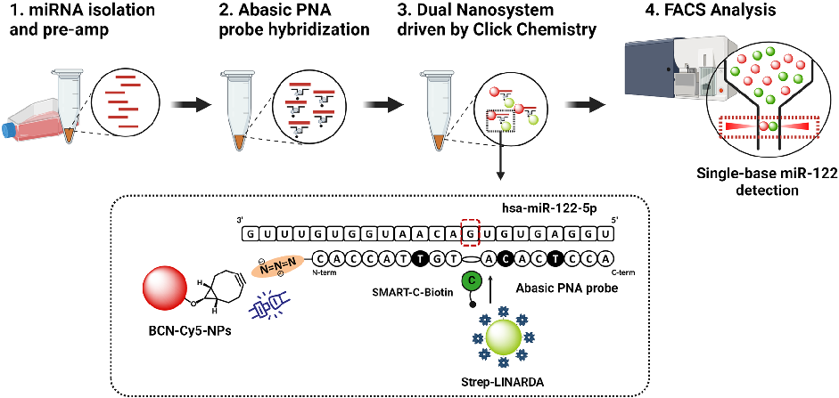
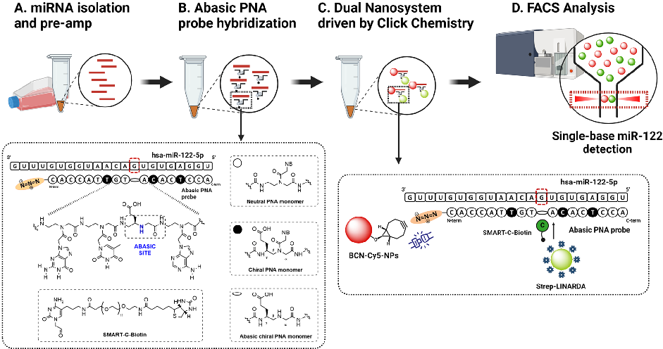
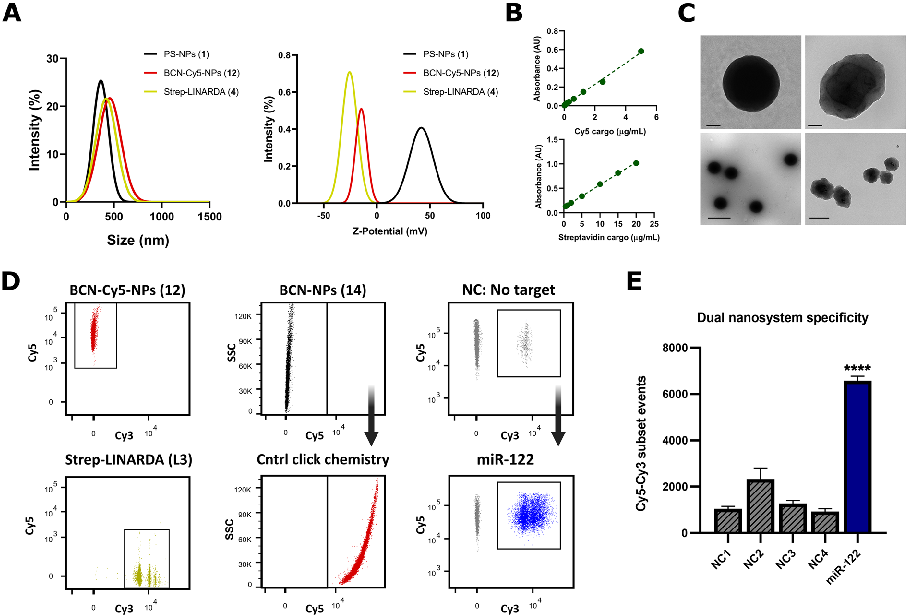
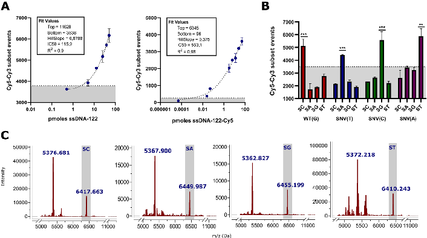
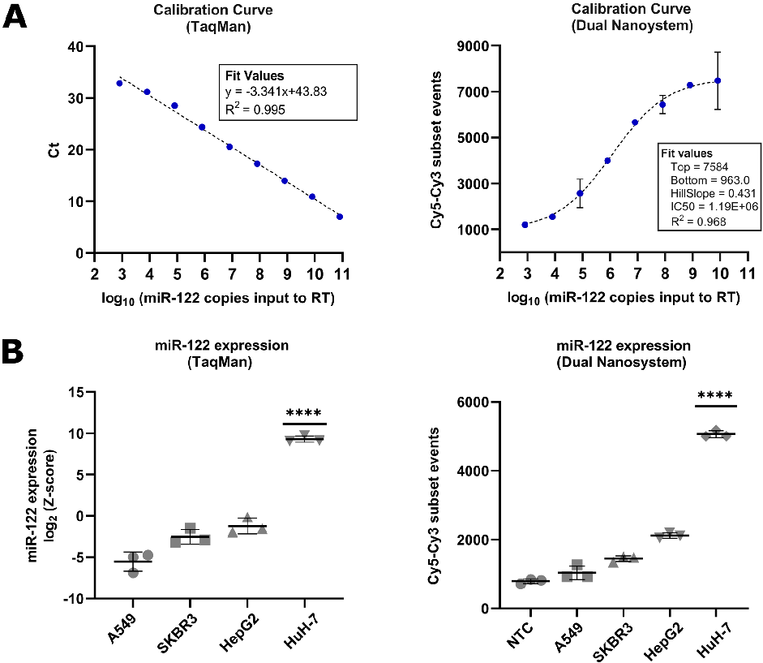

Robles‑Remacho et al. Journal of Nanobiotechnology (2024) 22:791 https://doi.org/10.1186/s12951‑024‑03071‑6

Journal of Nanobiotechnology

## RESEARCH Open Access

# Click chemistry‑based dual nanosystem for microRNA‑122 detection with single‑base specificity from tumour cells

Agustín Robles-Remacho1,2,3,5*†, Ismael Martos-Jamai1,2,3†, Mavys Tabraue-Chávez4, Araceli Aguilar-González1,2,3, Jose A. Laz-Ruiz1,2,3, M. Victoria Cano-Cortés1,2,3, F. Javier López-Delgado4, Juan J. Guardia-Monteagudo4, Salvatore Pernagallo4, Juan J. Diaz-Mochon1,2,3* and Rosario M. Sanchez-Martin1,2,3

### Abstract

MicroRNAs (miRNAs) have been recognised as potential biomarkers due to their specific expression patterns in different biological tissues and their changes in expression under pathological conditions. MicroRNA-122 (miR-122) is a vertebrate-specific miRNA that is predominantly expressed in the liver and plays an important role in liver metabolism and development. Dysregulation of miR-122 expression is associated with several liver-related diseases, including hepatocellular carcinoma and drug-induced liver injury (DILI). Given the potential of miR-122 as a biomarker, its effective detection is important for accurate diagnosis. However, miRNA detection methods still face challenges, particularly in terms of accurately identifying miRNA isoforms that may differ by only a single base. Here, with the aim of advancing accessible methods for the detection of miRNAs with single-base specificity, we have developed a robust dual nanosystem that leverages the simplicity of click chemistry reactions. Using the dual nanosystem, we successfully detected miR-122 at single-base resolution using flow cytometry and analysed its expression in various tumour cell lines with high specificity and strong correlation with TaqMan assay results. We also detected miR-122 in serum and identified four single nucleotide variations in its sequence. The chemistry employed in this dual nanosystem is highly versatile and offers a promising opportunity to develop nanoparticle-based strategies that incorporate click chemistry and bioorthogonal chemistry for the detection of miRNAs and their isoforms. Keywords MicroRNA, Microribonucleic acid, miR-122, Click chemistry, Bioorthogonal chemistry, Nanosystem, Molecular diagnostics

†Agustín Robles-Remacho and Ismael Martos-Jamai have contributed equally.

*Correspondence: Agustín Robles-Remacho agustin.robles@scilifelab.se Juan J. Diaz-Mochon juanjose.diaz@genyo.es Full list of author information is available at the end of the article

© The Author(s) 2024.Open Access This article is licensed under a Creative Commons Attribution-NonCommercial-NoDerivatives 4.0 International License, which permits any non-commercial use, sharing, distribution and reproduction in any medium or format, as long as you give appropriate credit to the original author(s) and the source, provide a link to the Creative Commons licence, and indicate if you modified the licensed material. You do not have permission under this licence to share adapted material derived from this article or parts of it. The images or other third party material in this article are included in the article’s Creative Commons licence, unless indicated otherwise in a credit line to the material. If material is not included in the article’s Creative Commons licence and your intended use is not permitted by statutory regulation or exceeds the permitted use, you will need to obtain permission directly from the copyright holder. To view a copy of this licence, visithttp://creativecommons.org/licenses/by-nc-nd/4.0/.

Graphical Abstract

### Introduction

MicroRNAs (miRNAs) are short non-coding RNAs, typically 18–24 nucleotides in length, that regulate biological processes by modulating gene expression through the RNA interference pathway [1]. MiRNA profiles show tissue specificity and their expression is altered under pathological conditions, highlighting their potential as diagnostic biomarkers [2, 3]. MicroRNA-122 (miR-122) constitutes one of these examples serving as a liverspecific miRNA biomarker for the diagnosis of liverrelated diseases [4, 5]. MiR-122 is exclusively found in vertebrates and represents approximately 70% of the total miRNAs present in hepatocytes, playing a fundamental role in cellular differentiation, liver development and lipid metabolism [6]. Dysregulation of miR-122 expression has been found in pathological conditions such as hepatocellular carcinoma, drug-induced liver injury (DILI), and hepatitis C virus infection [7, 8]. Despite recent advances, there is still significant room for improvement in current miRNA detection methods. A major challenge is the presence of multiple isoforms, known as isomiRNAs or isomiRs [9, 10], which are characterised by sequence variations that can be as small as a single-nucleotide variation (SNV) and can be difficult to identify due to the short sequence of miRNAs [11, 12]. While further research is needed to fully understand the functions of isomiRs, they have been recognised as useful for classifying disease [13]. For instance, categorising

the presence of isomiRs as a binary system of present or absent has enabled the classification of datasets across different types of cancer [14]. This suggests that the identification of isomiRs could have clinical significance. For miR-122, several isoforms have been described [15], and high levels of isomiRs have only been found in the blood and liver tissue of patients with DILI [16], and may be a better indicator for early diagnosis of acute liver injury than the standard proteins. Due to the small size of miRNA sequences and their limited sequence variation, often involving just a SNV, current methods can struggle to distinguish SNVs in miRNA sequences [7]. Small RNA sequencing is currently the only technique capable of accurately detecting and quantifying isomiRs, but its complexity makes direct implementation for point-ofcare and diagnostic settings difficult [7]. For these reasons, it is essential to further improve technologies that allow the direct detection of miRNAs and the accurate identification of isomiRs.

In response to these challenges, in recent years, we have focused our efforts on developing Dynamic Chemistry Labelling (DCL) as a methodology for miRNA detection with single-base resolution. DCL is a robust, enzymefree, and versatile isomiR detection method that can be applied to several biological samples, including serum, plasma, cell lysates and fixed cells [17–20]. DCL is based on the use of abasic peptide nucleic acid (PNA) probes. These PNA probes are known mimics of nucleic acids,

but instead of a sugar-phosphate backbone, they have a peptide backbone composed of N-(2-aminoethyl)glycine units [21]. This modification results in a peptide backbone that lack charges, allowing them to exhibit a strong affinity for their DNA or RNA targets without experiencing electrostatic repulsion from the negatively charged sugar-phosphate backbone. As a result, they form more stable PNA-DNA or PNA-RNA duplexes than natural DNA or RNA duplexes [22]. The PNA probes used in the DCL methodology have a modification in their peptide backbone, where they have an abasic site, a position within the sequence that lacks a nucleobase but contains a secondary amine. This abasic position can be strategically designed to selectively target a particular nucleotide of interest within the complementary miRNA sequence [23]. Then, four chemically modified nucleobases featuring an aldehyde group, called SMART-Nucleobases, are used as highly specific labelling reagents. Among these SMART-Nucleobases, only the one that is complementary to the nucleobase of interest according to the Watson–Crick base-pairing rules can react in a dynamic chemical reaction with the secondary amine at the abasic position and then covalently bond to the abasic PNA probes to form an irreversible tertiary amine [23]. The SMART-Nucleobases can be tagged with fluorescent markers or biomolecules to allow the detection of the integrated SMART-Nucleobase, and thus reading the specific nucleobase. In summary, DCL transform the amount of target miRNAs into amounts of labelled PNA probes that can then be measured and quantified.

Here, we present a click chemistry-driven dual nanosystem that provides a robust platform for the detection of miR-122 with single-base specificity from tumour cell lines. The presented dual nanosystem employs two different types of nanoparticles: (i) fluorescentlylabelled polystyrene nanoparticles (PS-NPs) modified with cyclooctyne to capture the PNA:miR-122 complex via click chemistry, and (ii) fluorescently-labelled silica nanoparticles conjugated to streptavidin to detect biotinylated-labelled complexes through the use of biotinylated SMART-Nucleobases via biotin-streptavidin binding. The click chemistry reaction takes place between the azide-modified abasic PNA probe and the cyclooctyne modified PS-NPs, that capture the PNA:miR-122 complex. These PS-NPs are particularly notable for their compatibility with standard multistep chemistries and for enabling several orthogonal conjugation strategies [24–26], allowing us to double functionalised them with a fluorophore and with the cyclooctyne moiety. The second type of fluorescently labelled silica nanoparticles are functionalised with streptavidin to detect the biotin derived from the specific SMART-Nucleobase that binds the nucleobase of interest. This approach was carried out

using a conventional flow cytometer as a reading platform, which is a widely used tool in clinical laboratories and provides an accessible method for miRNA detection.

In recent years, click chemistry has gained considerable recognition as a powerful method for the rapid and efficient covalent linking of chemical groups. One of the best known click chemistry reactions is the coppercatalysed Alkyne-Azide Cycloaddition (CuAAC) reaction that both Meldal [27] and Sharpless [28] presented in 2002. It uses a Huisgen 1,3-dipolar cycloaddition to produce triazoles. This method involves the combination of organic azides with alkyne groups to form 1,2,3-triazoles. Importantly, these chemical groups exhibit low or no reactivity towards most functional groups commonly found in biomolecules such as nucleic acids, proteins, and lipids [29–31]. Consequently, click chemistry is considered a bioorthogonal and biocompatible reaction, especially when Bertozzi demonstrated the copperfree Alkyne-Azide cycloaddition by using cyclooctyne as alkynes for these condensations [32]. The inherent speed and efficiency of this reaction, combined with its compatibility with nucleic acids, has made click chemistry highly applicable in the development of diagnostic tools [33]. By incorporating click chemistry into the dual nanosystem system presented here, we benefit from its simplicity, which facilitates rapid and efficient covalent capture of PNA:miR-122 complexes on the surface of polystyrene nanoparticles, and allows us to perform DCL reactions in solution and use a standard flow cytometer for reading. Using the dual nanosystem, we analysed miR-122 expression in different tumour cell lines with specificity and robustness, showing a high correlation with results obtained from a TaqMan assay and in a sensitive manner. We also detected miR-122 in a serum matrix and identified four SNVs at a specific position within synthetic miR-122 sequences.

### Results and discussion

Dual nanosystem engineering

Based on the native mature sequence of miR-122 (miRBase ID: hsa-miR-122-5p), we designed a complementary 18-mer abasic PNA probe with an abasic position in the central region, represented as *GL*, containing a secondary amine and a glutamic acid-like side chain at its gamma position directly opposite a guanine (underlined in the hsa-miR-122-5p sequence). The abasic PNA probe also contains an azide moiety via a spacer (two diethylene glycol units, miniPEG, shown as "OO") to allow the click chemistry reaction. In addition, we have introduced glutamic acid-like side chains at the gamma positions in the backbone of certain PNA units (shown as Cglu and Tglu) to facilitate the templated DCL reaction between SMART-Nucleobases and the

- Table 1 Sequences of abasic PNA probes and miR-122 targets used in the dual nanosystem

##### Probe and target Sequence (N-term–C-term or 5′-3′)

Abasic PNA-122 Ac-Lys(N3)-OO-CACCAT Tglu GT*GL*A Cglu AC Tglu CCA-NH2 hsa-miR-122-5p & ssRNA-122 UGGAGUGUGACAAUGGUGUUUG ssDNA-122 TGGAGTGTGACAATGGTG ssDNA-122-Cy5 Cy5-TGGAGTGTGACAATGGTG ssDNA-122 (T) TGGAGTGTTACAATGGTG ssDNA-122 (C) TGGAGTGTCACAATGGTG ssDNA-122 (A) TGGAGTGTAACAATGGTG hsa-miR-122-5p Amplicon form (isolated and amplified from tumour cell lines)

PNA sequences hybridise to complementary nucleic acids in an antiparallel fashion, meaning their C‑terminal end faces the 5′ end, while their N‑terminal end faces the 3′ end of the nucleic acid. Italic A, T, C and G represent PNA‑based adenine, thymine, cytosine and guanine units. Cglu and Tglu represent cytosine and thymine PNA units with glutamic acid‑like side chains at their gamma positions. *GL* indicates the abasic position. Detected nucleotides in the miR‑122 targets are shown in bold and underlined

secondary amine of the abasic site [34]. We performed DCL reactions in solution using the abasic PNA probe and different target sequences such as ssDNA-122, ssRNA-122 and hsa-miR-122-5p extracted and preamplified from tumour cell lysates (Fig. 1A), with all sequences listed in Table 1. When added to the solution, the abasic PNA probe hybridises with the

miR-122 target, with the abasic position opposite a guanine. This guanine templates the incorporation of a biotinylated SMART-Cytosine (SMART-C-Biotin), forming a biotinylated PNA:miR-122 complex (Fig. 1B). The chemical structures of the abasic PNA probe and SMART-C-Biotin are shown in detail in the inset of Fig. 1B. Then, polystyrene nanoparticles,

Fig. 1 Click chemistry-based dual nanosystem workflow. A Hsa-miR-122-5p sequences are isolated from tumour cell lines and pre-amplified by PCR. B The addition of abasic PNA probes that hybridise to the miR-122 target, and, together with the addition of the SMART-C-Biotin, the DCL reaction is initiated, resulting in the formation of biotinylated PNA:miR-122 complexes. The inset shows the chemical structures of the abasic PNA probe and SMART-C-Biotin. C Two types of nanoparticles are then added: First, polystyrene nanoparticles, BCN-Cy5 NPs (12), labelled with Cy5 and coated with cyclooctyne (BCN) moieties. These nanoparticles allow copper-free click chemistry to capture the PNA:miR-122 complex. Second, silica nanoparticles, Strep-LINARDA (L3), which are Cy3-labelled and coated with streptavidin for recognition of the biotinylated SMART-Nucleobase. When both nanoparticles are bound by the PNA:miR-122 complex, they form the dual nanosystem. D Co-detection of Cy5 + /Cy3 + signals using a standard flow cytometer indicates detection of miR-122 with single base specificity

called BCN-Cy5-NPs (12), are added to the solution. These nanoparticles have cyanine-5 (Cy5) fluorescent tags and are coated with a cyclooctyne moiety (BCN), which facilitates copper-free click chemistry azide-labelled PNA probes, thereby capturing the biotinylated PNA:miR-122 complex. Next, silica nanoparticles, called Strep-LINARDA (L3), are added to the solution. These nanoparticles are labelled with yellow-green emitting fluorophores similar to cyanine-3 (Cy3) and coated with streptavidin to recognise the SMART-C-Biotin. Following the click chemistry reaction and streptavidin–biotin recognition, both nanoparticles, the BCN-Cy5-NPs (12) and Strep-LINARDA (L3), bind together through the PNA:miR-122 complex, forming a dual nanosystem (Fig. 1C). Therefore, the higher the amount of miR-122 in the sample, the higher the number of biotinylated PNA:miR-122 complexes formed, and consequently, the higher the number of dual nanosystems detected. When analysed with a standard flow cytometer, the dual nanosystem generates two co-localised fluorescent signals, Cy5+ /Cy3+ ,

which served as markers for miR-122 detection with single base specificity (Fig. 1D). Further details on the chemical structure of the basic PNA and all the biotinylated SMART-Nucleobases can be found in Supporting Information 1. Moreover, we performed further studies on miR-122 sequences and additional targets, whose sequences are listed in Supporting Information 2.

Synthesis, characterisation and validation of the dual nanosystem for miR-122 detection

In the synthesis of the components of the dual nanosystem, the synthesis of polystyrene nanoparticles, BCN-Cy5-NPs (12), begins with the generation of aminofunctionalised PS-NPs (1), which are then bifunctionalised using previously reported solid-phase synthesis methods [24]. Monomers are conjugated to the amino PS-NPs (1) by activating the carboxyl group and forming amide bonds. These monomers have protective groups, specifically Fmoc and Dde moieties, which allow stepwise and orthogonal synthesis. This allows bifunctionalisation

Fig. 2 Nanoparticle synthesis. A Synthesis of BCN-Cy5 NPs (12) starts with amino-functionalised PS-NPs (1). Protected monomers Fmoc-Gly-OH, Fmoc-PEG-OH, Fmoc-Lys(Dde)-OH and Fmoc-PEG-OH are sequentially coupled. Next, the Dde group is selectively removed to obtain to obtain PS-NPs (9) and the activated sulfo-Cy5-NHS ester is conjugated. The Fmoc group is then removed and the activated BCN succinimidyl ester is conjugated to obtain bifunctionalised BCN-Cy5-NPs (12). B Synthesis of Strep-LINARDA (L3) consist on the activation of the carboxylic groups using EDC and sulfo-NHS to allow the conjugation of streptavidin to obtain the Strep-LINARDA (L3) nanoparticles

with Cy5 fluorophores and BCN moieties, avoiding cross reactions (Fig. 2A). Once synthesised, BCN-Cy5 NPs (12) can be monitored by flow cytometry due to their Cy5 labelling. They can also conduct copper-free click chemistry by reacting with azide-labelled PNA in solution via the BCN moiety. The detailed synthesis for PS-NPs (1) is described in Supporting Information 3.1, while the full synthesis procedure for BCN-Cy5-NPs (12) is detailed in Supporting Information 3.2. The second type of silica nanoparticles, Strep-LINARDA (L3), are carboxylic acid functionalised and labelled with Cy3-like fluorophores. They were directly conjugated to streptavidin by activating the carboxylic acid group with EDC and sulfo-NHS (Fig. 2B). The result was Strep-LINARDA (L3), which can recognise the biotinylated SMART-Nucleobases.

After the synthesis of both nanoparticles, their physicochemical characterisation was carried out. The size and homogeneity of the nanoparticles and their polydispersity index (PDI) were measured by Dynamic Light Scattering (DLS), which confirmed a similar nanoscale size and that both types of nanoparticles were monodispersed and homogeneous (Table 2, Fig. 3A). In order to assess the change in the nanoparticle surface after the synthesis and its potential impact on surface stability, the zeta potential of the nanoparticles was also measured (Table 2, Fig. 3A). A lower zeta potential was observed in the functionalised BCN-Cy5 NPs (12) and Strep-LINARDA (L3), compared to the PS-NPs (1), probably due to the presence of sulphonic groups, but these zeta potentials did not show a significant change on the nanoparticle surface, indicating that the nanoparticles remain stable after conjugations. In addition, the efficiency of Cy5 conjugation to BCN-Cy5-NPs (12) and the conjugation of streptavidin to Strep-LINARDA (L3) were evaluated, demonstrating successful conjugation rates in both cases (Table 2, Fig. 3B). Transmission electron microscopy (TEM) confirmed the morphology and size of both types of nanoparticles (Fig. 3C). Additional physicochemical characterisation was performed to assess the size, uniformity and zeta potential of the nanoparticles in all buffers used in this study, including in a serum matrix. Details of these results are shown in Supporting Information 4.1.

Then, we validated the ability of the dual nanosystem to detect miR-122 using a Fluorescence-Activated Cell Sorting cytometer, FACSVerse. When analysed on FACSVerse, the BCN-Cy5-NPs (12) showed a Cy5+ /Cy3population, whereas the Strep-LINARDA (L3) showed a Cy5-/Cy3+ population (Fig. 3D, left). Then, we evaluated the efficacy and specificity of the click chemistry reaction. For this purpose, we designed a third type of polystyrene nanoparticles that were synthesised without the Cy5 dye but conjugated to BCN, called BCN-NPs (14) (see synthesis and structure in Supporting Information 3.3). We then used synthetic ssDNA-122 labelled with the Cy5 fluorophore (ssDNA-122-Cy5) as the target. When we mixed the BCN-NPs (14) with ssDNA-122-Cy5 in the absence of the abasic PNA probe that carries the azide group, no population showing Cy5 fluorescence was detected (Fig. 3D, central black dot plot). However, upon addition of the abasic PNA probe, the entire nanoparticle population showed Cy5 fluorescence (Fig. 3D, central red dot plot). This indicates successful capture of the PNA:miR-122 complex formed in solution by hybridisation via a copper-free click chemistry reaction. It also shows that polystyrene nanoparticles do not adsorb oligonucleotides non-specifically. Next, we evaluated the ability of the dual nanosystem to detect miR-122. To do this, a DCL reaction was performed according to the procedure described in Sect. “DCL reaction and miR-122 detection with single-base specificity by FACS”. When we evaluated the nanosystem in the absence of ssDNA122 as a negative control, a Cy5+ /Cy3- population was formed (Fig. 3D, right grey dot plot). Remarkably, in the presence of ssDNA-122, there was a marked shift towards a significant double Cy5+ /Cy3+ population, indicating the successful detection of ssDNA-122 (Fig. 3D, right blue dot plot). Similarly, when we analysed ssRNA-122, we observed a significant double Cy5+ /Cy3+ population (data shown in Supporting Information 4.2). To test the specificity of the dual nanosystem, we then performed an assay with four negative controls according to the experimental design shown in Table 3. The result is shown in Fig. 3E, displaying the number of events (n= 3) recorded in FACSVerse for each condition and the statistical significance of the dual nanosystems in the detection of

- Table 2 Physicochemical parameters of nanoparticles

|Parameters|NH2-PS-NPs (1) BCN-Cy5-NPs (12) Strep-LINARDA (L3)|
|---|---|
|Mean Hydrodynamic Diameter (nm)|415.6 ± 14.5 481.5 ± 12.5 362.5 ± 25.3|
|Mean Zeta Potential (mV)|41.65 ± 0.41 − 14.8 ± 1.56 − 25.91 ± 0.71|
|Polydispersity Index (PDI)|0.184 0.119 0.267|
|Conjugation efficiency|– 96.45% 99.7%|
|Loading molecules/NPs|– 2.57 ×106 2.69 ×108|

Fig. 3 Dual nanosystem characterisation and miR-122 detection by FACSVerse. A Size distribution (left) and zeta potential (right) values for PS NPs

(1), BCN-Cy5 NPs (12) and Strep-LINARDA (L3). B Calibration curves for Cy5 and streptavidin conjugation giving 96.45% and 99.7% conjugation rates respectively. C Size and morphology analysis by TEM of Strep-LINARDA (L3) (left) and BCN-Cy5 NPs (12) (right) (100 nm scale bar above, 500 nm scale bar below). D Dot plots showing, on the left, individual signals generated by both nanoparticles. The top-middle panel shows BCN-NPs (14) incubated with ssDNA-122-Cy5 without the abasic PNA probe as a negative control. In the presence of the abasic PNA probe, in the lower middle panel, the signal turns into Cy5+, confirming the successful click chemistry reaction. The top right panel represents both nanoparticles in the presence of all components but without the ssDNA-122 target as a negative control, turning Cy5 + /Cy3 + in the presence of ssDNA-122 (in blue), highlighting miR-122 detection. E Specificity test of the dual nanosystem comparing the number of events (n = 3) of different negative control (NC) conditions and in the presence of miR-122. A significant increase in the Cy5 + /Cy3 + subset occurs when the dual nanosystem is formed when ssDNA-122 is present. Error bars are expressed as ± SEM. Statistical significance was analysed using one-way ANOVA, comparing the mean of all NCs with the mean of miR-122. Significance is indicated as ****p < 0.0001

- Table 3 Experimental conditions for validation of miR-122 specificity using the dual nanosystems in FACSVerse

|Name Condition|Expected population*|
|---|---|
|Negative control 1 (NC1)  Mixture of nanoparticles 12 and L3 without any additional components|Cy5 + /Cy3− & Cy5−/Cy3 +|
|Negative control 2 (NC2)  All nanosystem components, PNA probes and SMART-Nucleobases, but without the target miR-122|Cy5 + /Cy3− & Cy5−/Cy3 +|
|Negative control 3 (NC3)  Nanoparticles 14 incubated with Cy5-ssDNA-122 without the PNA probe|Cy5−|
|Negative control 4 (NC4)  All nanosystem components, including PNA probes and miR-122 target, but without SMART-Nucleobases|Cy5 + /Cy3− & Cy5−/Cy3 +|
|miR-122 All nanosystem components, PNA probes and SMART-Nucleobases, in the presence of miR-122|Cy5 + /Cy3 +|

* Expected nanoparticles populations based on their fluorescence assuming 100% efficiency

Fig. 4 Calibration curve of miR-122 in serum matrix, SNV detection and MALDI-TOF analysis. A Left, the calibration curve for the detection of ssDNA-122 in 10% serum showed a 4PL non-linear regression model in FACSVerse. LoD = 2.329 pmol. R2 = 0.9. Right, calibration curve for the detection of ssDNA-122-Cy5 and unlabelled BCN-NPs (14). LoD = 1.08 fmoles. R2 = 0.98. B FACSVerse analysis of four SNVs representing four isomiR-122. Only when the complementary biotinylated SMART-Nucleobase (shown as SC, SA, SG or ST) is used, the dual nanosystem generates a significant Cy5 + /Cy3 + population. C MALDI-TOF analysis was performed on the four SNVs to evaluate the cross-reactivity between the SMART-Nucleobases. The spectra showed two main peaks representing the unreacted abasic PNA probe (left) and the probe with the biotinylated SMART-Nucleobase incorporated (right). The difference between these peaks indicated the molecular mass of the specific SMART-Nucleobase incorporated, enabling identification of the target nucleobase. Error bars are expressed as ± SEM. Calibration curves were analysed using a 4PL model. Statistical significance was assessed by one-way ANOVA. Significance is indicated as *p < 0.05, **p < 0.01, ***p < 0.001

ssDNA-122 (statistical significance for ssRNA-122 is shown in Supporting Information 4.2). We performed an additional evaluation of the dual nanosystem using a different type of silica nanoparticles, DiagNano™ (CD Bioparticles, UK), as a commercial alternative to StrepLINARDA (L3). Our results confirmed the successful detection of miR-122 using DiagNano™, demonstrating the versatility of combining the nanosystem with other nanoparticle types. These results are presented in Supporting Information 4.3.

All results demonstrated the successful synthesis of both types of nanoparticles, which exhibited homogeneity and stability, as confirmed by their physicochemical characterisation. Furthermore, the results indicated that the click chemistry reaction occurred with both high efficiency and remarkable specificity, confirming the reliability of the synthesis process. In addition, the results confirmed that both types of nanoparticles successfully detected miR-122 with high specificity, which can be easily monitored by flow cytometry FACSVerse.

Detection of miR-122 in a serum matrix, calibration curve and evaluation of single base specificity

Then, we proceeded to evaluate the ability of the dual nanosystem to detect miR-122 in a biological matrix to challenge the system. To do this, we performed the following

experiments in 10% of human serum. Under these conditions, we established a calibration curve to determine the analytical performance and limit of detection (LoD), and evaluated the specificity in detecting nucleotide variations. We established the calibration curve by performing triplicate dilutions of ssDNA-122 within a range covering from 50 pmol to 0.5 pmol in 10% of human serum in a final volume of 50 µL. Then, we calculated the average number of events within the double Cy5+ /Cy3+ population based on a total of 10,000 events recorded in FACSVerse. The resulting average number of events showed a sigmoidal regression curve (R2 = 0.9) (Fig. 4A, left) with a coefficient of variation ranging from 0.9 to 9.22%, indicating low variability of the data. We then determined the LoD using a 4-parameter logistic regression model (4PL). First, the limit of blank (LoB) was calculated using formula (1), and then this LoB value was substituted into the variable “y” in formula (2). The LoD was quantified as 2.329 pmol in 50 µL.

LoB = Blank Average (n = 6) + 3.3 ∗ SDAverage (1)

Top − Bottom 1 + IC x50 HillSlope

y = Bottom + (2)

We found that the signal from the blank corresponds, mostly, to the signal generated by the non-specific

interaction between BCN-Cy5-NPs (12) and Strep-LINARDA (L3), hence impacting in the LoD. To investigate whether the dual nanosystem could achieve a lower LoD in the absence of this non-specific signal, we analysed the detection of dilutions of ssDNA-122-Cy5 using the unlabelled BCN-NPs (14). Thus, positive Cy5 signals within the double positive Cy5+ /Cy3+ population reflect only the amount of ssDNA-122-Cy5 captured by click chemistry, excluding any non-specific signal. When analysing a 4PL, we found that the LoD was 1.08 femtomoles in 50 µL (Fig. 4A, right), which is more than 2,000 orders of magnitude lower, demonstrating the potential room for improvement of this dual nanosystem.

At low concentrations, the nanosystem reflects nonlinearity, due to the intrinsic nature of the processes involved, as both the hybridisation reaction and fluorescence emission do not follow linear kinetics. For hybridisation, efficiency increases as the target concentration approaches a threshold where sufficient binding events generate a detectable signal. Similarly, fluorescence emission requires a signal-to-noise ratio above background to confidently identify the target signal. Together, these factors determine the detection threshold. Next, we investigated the ability to discriminate SNVs. For this end, the abasic PNA probe was hybridised in triplicate to four ssDNA-122 strands with sequences differing by only one nucleotide (A, C, G or T) in the position opposite to the abasic site (Table 1), thus representing four isomiR-122 variants. For each sequence, four individual DCL reactions were performed in 10% serum using one of the biotinylated SMART-Nucleobases (SMART-Cbiotin, SMART-A-biotin, SMART-G-biotin, or SMARTT-biotin). Then, we analysed the results obtained in FACSVerse and confirmed that only the specific SMARTNucleobase resulted in a statistically significant double Cy5+ /Cy3+ population signal (Fig. 4B). These results demonstrated the ability of the dual nanosystem to detect the specific SNV at a targeted nucleobase position within the miR-122 sequence. To further validate the dual nanosystem and broader applicability, we also used two additional abasic PNA probes to analysed two nucleotide positions in miR-21, another miRNA known for its role in tumour development [35]. These data are shown in Supporting Information 4.4. With these results, we further confirm the possibility of using the dual nanosystem to study additional targets, as well as the ability to study other nucleobase positions.

To further analyse the specificity of the biotinylated SMART-Nucleobases and whether there was any crossreactivity between them, we performed MALDI-TOF analysis. For this, four individual DCL reactions were performed, each using one of the four ssDNA-122 sequences differing by one nucleotide (Table 1). Each

ssDNA-122 was mixed in a solution containing the abasic PNA probe and a mixture with all four biotinylated SMART-Nucleobases. The product was then analysed by MALDI-TOF, which revealed two main peaks in the spectra: one peak corresponding to the unreacted abasic PNA probe and a second peak corresponding to the abasic PNA probe plus the biotinylated SMART-Nucleobase. The difference between these peaks corresponds to the molecular weight of the incorporated SMART-Nucleobase. The results showed that only the complementary SMART-Nucleobase was successfully incorporated into the abasic position, with no cross-reactivity observed (Fig. 4C). We also performed further MALDI-TOF analyses to verify the detection of SMART-T-Biotin, due to its molecular weight being close to that of SMART-CBiotin, as detailed in Supporting Information 5.1. In addition, we also tested cross-reactivity using four templates of ssRNA-122 that differ in just one nucleotide (5′UGG AGUGU-G/A/C/U-ACAAUGGUGUUUG3′), and obtained similar results when the template was ssRNA122. These results are presented in Supporting Information 5.2. All results presented in this section confirm that the dual nanosystem using FACSVerse detects miR-122 in a biological matrix with specificity and robustness, and demonstrates its ability to discriminate with high accuracy between four miR-122 sequences differing by only one nucleotide.

Analysis of hsa-miR-122-5p expression in tumour cell lines

Next, we investigated the expression of miR-122 in different tumour cell lines using the dual nanosystem and compared the results with miR-122 expression using a TaqMan assay, a well-established method for studying miRNA expression in cell lines, commercially available from Thermo Scientific (USA). In this assay, we combined the dual nanosystem with qPCR, where the RNA is reverse transcribed into complementary DNA (cDNA) and then amplified, producing a DNA template for the DCL reaction. This approach has the advantage of increased stability and longer sample storage times. Therefore, in the previous Sect. “Detection of miR-122 in a serum matrix, calibration curve and evaluation of single base specificity”, we mainly characterised the dual nanosystem using ssDNA-122 instead of ssRNA-122. We first compared the two methods by generating a calibration curve using the full sequence of ssRNA-122 (5’ UGG AGUGUGACAAUGGUGUUUG 3’) as the starting target. We performed a series of dilutions in triplicate, using amounts of ssRNA-122 ranging from 1 ng to 10–8 ng, corresponding to 8× 1010 to 8× 102 copies of ssRNA-122. The RNA was then reverse transcribed into cDNA and subjected to RT-qPCR using TaqMan probes. The result of plotting these quantities against the cycle threshold

Fig. 5 Analysis of miR-122 expression in tumour cell lines using TaqMan probes and the dual nanosystem. A Calibration curves of both methods in RT-qPCR products of ssRNA-122. On the left, the TaqMan probes show a linear regression curve. On the right, the dual nanosystem shows a sigmoidal regression curve. B Analysis of hsa-miR-122 expression in tumour cell lines. On the left, the TaqMan assay showed high hsa-miR-122 expression in HuH-7. Similarly, on the right, the dual nanosystem showed high hsa-miR-122 expression in HuH-7, followed by a lower expression in HepG2 and little to no expression in A549 or SKBR3. Error bars are expressed as ± SEM. The calibration curve of the dual nanosystem was analysed using a 4PL model. Expression analysis using TaqMan probes was performed by calculating a Z-score comparing the expression of each specific cell line to the average expression of miR-122 across the set. Statistical analysis of miR-122 expression was performed using one-way ANOVA

(Ct) demonstrated a linear regression (R2 = 0.995) with coefficients of variation ranging from 0.25 to 7% (Fig. 5A, left). The same PCR products were then subjected to the dual nanosystem and analysed by FACSVerse. In this case, the result of plotting these quantities against the number of Cy5+ /Cy3+ events yielded a sigmoidal regression curve (R2 = 0.968) with coefficients of variation ranging from 1.25 to 25% (Fig. 5A, right). The LoD was then determined for both methods. For the TaqMan assay, the LoD was calculated as 3.29 times the standard

deviation of the negative control divided by the slope of the calibration curve. The LoD was quantified as 5 copies in a final reaction volume of 20 µL, corresponding to 8.30× 10–24 mol (8.3 ymoles) of miR-122. The LoD of the dual nanosystem was then calculated using the 4PL model described in the previous section. The LoD was quantified as 750 copies in a final volume of 50 µL, corresponding to 1.3× 10–21 mol (1.3 zmoles) of miR-122.

Then, we analysed hsa-miR-122 expression in tumour cell lines. Since hsa-miR-122 is specific for

liver tissue, we chose two human hepatocellular carcinoma cell lines: HuH-7, which has been reported in the literature to have high levels of miR-122 expression, and HepG2, which has been reported to have a lower miR-122 expression [36, 37]. We also selected two additional cancer cell lines of clinical interest for studying miR-122: A549, derived from lung cancer [38], and SKBR3, derived from breast cancer, which according to the literature has little or no expression of miR-122 [38, 39]. We cultured the cell lines to confluence and extracted total miRNA from one million cell pellets in triplicate. For reverse transcription, 10 ng of RNA from each sample was converted to cDNA using the TaqMan MicroRNA Reverse Transcription Kit, which uses stem-loop primers specifically designed for microRNA cDNA synthesis [40]. Subsequently, 1.33 µL of the resulting cDNA was subjected to qPCR in triplicate using TaqMan Fast Advanced Master Mix and specific TaqMan probes for hsa-miR-122 (ID 002245) and RNU44 (ID 001094). RNU44 was selected as a normalisation control due to its stable expression in different human cell lines, ensuring reliable normalisation of microRNA expression data [41]. Then, we analysed the same amplicons using the dual nanosystem via FACSVerse.

The results showed that using both methods, we found high miR-122 expression in the HuH-7 cell line, followed by lower expression in HepG2, reduced expression in SKBR-3 and little to no expression in A549 (Fig. 5B). Extrapolating from the calibration curve, in the TaqMan assay, we found an expression of 4.51× 106 copies of miR-122 in HuH-7 and 3.47× 103 copies in HepG2. Meanwhile, with the dual nanosystem, we found 3.69× 106 copies in HuH-7 and 3.22× 104 copies in HepG2. These results demonstrate the analytical capability of the dual nanosystem to analyse hsa-miR-122 expression in tumour cell lines, identifying up to 750 copies (1.3 zmol) in 50 µL (26 attomolar) volume when combined with PCR. Although the calibration curve showed higher variability at top values compared to the TaqMan assay, we attribute this to the fact that the flow cytometer may interpret a cluster of nanoparticles as a single event. However, this did not affect the accuracy of the miR122 expression analysis of the cell lines. Remarkably, the dual nanosystem results correlated highly with the TaqMan assay. This highlights the effectiveness of the dual nanosystem in performing miR-122 expression analysis, while maintaining methodological robustness, compatibility with standard flow cytometers as a readily accessible platform, and the ability to analyse SNVs and truncated miRNA sequences.

### Conclusions

In this study, we present a click chemistry-based dual nanosystem designed for single base specific miR-122 detection using a standard flow cytometer as the reading platform. Using the dual nanosystem, we analysed miR-122 expression in different tumour cell lines with high performance and specificity, showing a high correlation with results obtained from a TaqMan assay and in a sensitive manner. We also detected miR-122 using a serum matrix and identified four single SNVs at a specific position within the miR-122 sequence with robustness. The dual nanosystem demonstrated a direct limit of detection (LoD) of 2.329 pmol in a 50 µL solution in a human serum matrix. In addition, when combined with RT-qPCR, the dual nanosystem achieved a LoD of 1.3 zmol in 50 µL (26 attomolar). The dual nanosystem proved effective in analysing the expression of hsamiR-122, showing high expression in the HuH-7 cell line, lower expression in HepG2 and reduced to no expression in SKBR3 and A549, with a high correlation with a TaqMan assay, and in line with the literature. This dual nanosystem involves a fully bioorthogonal strategy that includes signal amplification using two types of different nanoparticles, polystyrene and silica, together with the high affinity of PNA probes. These nanoparticles are able to bind when capturing miR-122 in a dual structure that can be easily monitored using a flow cytometer. The chemical methods used here to synthesise nanoparticles and perform click chemistry reactions, together with the DCL method for miRNA detection, show great flexibility and provide a basic toolbox that could be further extended with many types of bioorthogonal reactions. The incorporation of click chemistry into the nanosystem enables fast, efficient and nucleic acid-compatible reactions. In conclusion, the chemistry used in this dual nanosystem offers remarkable versatility and provides a promising opportunity to pioneer nanoparticle-based strategies based on click chemistry and bioorthogonality for miRNA detection and isomiR studies and thus, contributing to the advancement of molecular diagnostic applications.

### Methodology

General

Chemicals and solvents were purchased from Sigma Aldrich. Fmoc-Gly-OH was purchased from Sigma Aldrich, and Fmoc-PEG3-COOH and Fmoc-Lys (Dde)OH were synthesised as described previously [24]. N-[((1R,8S,9s)-bicyclo[6.1.0]non-4-yn-9-yl)methyloxycarbonyloxy]succinimide carbonate (BCN-succinimidyl ester) was purchased from Sigma Aldrich, sulfo-Cy5NHS ester was purchased from Lumiprobe (USA) and streptavidin was purchased from Promega (USA). The

size distribution, determined by DLS, and the zeta potential of the nanoparticles were measured using a BeNano 180 Zeta Pro instrument from Bettersize Instruments (China). The bioconjugation efficiency of the fluorophore and streptavidin was measured using the NanoQuant Plate™ from Tecan (Switzerland). Microscopic images were acquired using a TALOS F200C G2 transmission electron microscope. The number of nanoparticles per volume was determined using a previously described spectrophotometric method [42]. Flow cytometry data were acquired using a FACSVerse, BD Biosciences (USA). Acquisition was performed using lasers emitting at 488 nm and 633 nm as excitation sources, while fluorescence emissions were detected with filters at 585/42 nm for the phycoerythrin (PE) channel and 660/20 nm for the allophycocyanin (APC) channel. FACS data were analysed based on the total number of events within the APC/PE subset (representing the Cy5/Cy3 subset), using a mean flow rate for reading and recording of 10,000 events.

Design and synthesis of abasic PNA probes, SMART-nucleobases, single-stranded DNA and RNA oligonucleotides

The abasic PNA probe and SMART-Nucleobases were both provided by DESTINA Genomica SL. (Spain). The synthesis of the abasic PNA probe followed standard polymer-supported solid-phase synthesis techniques in Tentagel resin from Polymer (UK) using an Intavis Bioanalytical MultiPrep CF synthesiser from Intavis AG GmbH (Germany). The SMART-Nucleobases used were SMARTCytosine-REX-PEG12-Biotin (referred to as SMARTC-Biotin), SMART-Adenine-deaza-enol-PEG12-Biotin (SMART-A-Biotin), SMART-Guanine-deaza-enol-PEG12Biotin (SMART-G-Biotin) and SMART-Thymine-REXPEG12-Biotin (SMART-T-Biotin). The structure of the abasic PNA and SMART-Nucleobases is detailed in Sup-

- porting Information 1. All single-stranded DNA (ssDNA) or RNA (ssRNA) oligonucleotides used in this study were purchased from Microsynth (Switzerland) or IDT (USA). The sequences of all ssDNA and ssRNA oligonucleotides and the abasic PNAs used in this study are provided in Sup-
- porting Information 2.

Synthesis of PS-NPs (1), BCN-Cy5-NPs (12) and BCN-NPs

(14)

PS-NPs (1) with a size of 500 nm and an amine group loading of 0.0014 mmol/mL (corresponding to 1 mEq) were synthesised using a dispersion polymerisation process as previously reported [24]. The complete synthesis procedure of PS-NPs (1) is described in detail in Supporting Information 3.1. The synthesis of BCN-Cy5 NPs (12) was performed by solid phase peptide synthesis techniques as previously described [24]. All reactions

were performed in a thermoshaker (1200–1400 rpm, 25 ºC). Coupling reactions were performed using ethyl cyanohydroxyiminoacetate (Oxyma) (50 equiv, 140 mM) and N,N′-diisopropylcarbodiimide (DIC) (50 equiv, 140 mM) as coupling agents with 50 equiv of Fmoc-protected amino acids at 140 mM concentration, unless otherwise stated. After the coupling reaction, Fmoc was deprotected with 20% piperidine before proceeding to the next coupling. Fmoc-Gly-OH, Fmoc-PEG-OH and FmocLys(Dde)-OH were coupled to PS-NP (1) in this order to give Fmoc-PEG(Dde)-NPs (8) [43]. The Dde group was then selectively deprotected with an NH2OH-HCl/ imidazole in 1-methyl-2-pyrrolidinone as described elsewhere [44]. The activated sulfo-Cy5 NHS ester (0.321 μM) in DMF was then used to conjugate the dye to this side chain using N,N-diisopropylethylamine (DIPEA) in 250 µL anhydrous DMF. After coupling of the dye, the Fmoc group was removed to give Cy5-NPs (11). The coupling between the free amine of the NPs (11) and the activated BCN succinimidyl ester (20 equiv, 27.5 mM) and 0.2 µL DIPEA was performed in 250 µL anhydrous DMF to obtain bifunctionalised BCN-Cy5-NPs (12). Finally, the BCN-Cy5-NPs (12) were washed and stored in water. The complete synthesis procedure of BCN-Cy5-NPs (12) is described in detail in Supporting Information 3.2. In addition, to test for the absence of non-specific binding of nucleic acids to the nanoparticle surface, unlabelled nanoparticles with BCN, termed BCN-NPs (14), were used. The synthesis procedure and structure of BCN-NPs (14) are described in detail in Supporting Information 3.3.

Synthesis of Strep-LINARDA (L3) detection NPs

LINARDA nanoparticles were supplied by GENOTIX Biotechnologies (USA). LINARDA nanoparticles are also 500 nm in size, exhibit yellow-green fluorescence (Cy3-like) and are carboxyl functionalised. These nanoparticles were conjugated to streptavidin using 1-ethyl3-carbodiimide (EDC) and N-hydroxysulfosuccinimide (Sulfo-NHS). The process started with centrifugation of 50 μL stock COOH-LINARDA (L1) (1.5× 108 NPs/ μL) at 13,400 rpm for 3 min to remove the supernatant. Nanoparticles were then conditioned twice with 100 μL of 50 mM 2-morpholinoethanesulfonic acid (MES) buffer at pH 5.5, followed by centrifugation at 13,400 rpm for 3 min. The pellet was resuspended in 80 μL 50 mM MES pH 5.5 and 10 μL EDC (50 mg/mL) and 10 μL SulfoNHS (50 mg/mL), both freshly prepared in 50 mM MES pH 5.5, were added to the mixture. After incubation for 20 min at 1200 rpm and 25 ºC, LINARDA (L2) nanoparticles were centrifuged at 13,400 rpm for 3 min, washed twice with 100 μL 50 mM MES pH 5.5, conditioned with 100 μL 50 mM MES pH 6 and centrifuged at 13,400 rpm for 3 min. After removal of the supernatant, 100 μL

streptavidin at 150 μg/mL in 50 mM MES pH 6 was added to the LINARDA (L2) nanoparticles. This mixture was incubated for 2 h at 1200 rpm and 25 ºC. Finally, the conjugated LINARDA (L3) nanoparticles were centrifuged at 13,400 rpm for 3 min, washed with 200 μL LINARDA Wash Buffer, centrifuged again under the same conditions and incubated with LINARDA Quenching Buffer for 1 h at RT. After quenching, Strep-LINARDA (L3) was washed twice with 250 μL LINARDA Wash Buffer and stored in 2 mL Super Assay Buffer (Genotix Biotechnologies, USA). Throughout the protocol, sonication and vortexing were used to avoid aggregates.

DCL reaction and miR-122 detection with single-base specificity by FACS

DCL reactions were performed in a hybridisation buffer containing 2× sodium citrate (SSC) with 0.1% Tween 20, with pH carefully adjusted to 6.0 in a final volume of 50 µL. The reaction mixture contained 1 µM abasic PNA probe, 1 µM either ssDNA-122 (5′TGGAGTGTGACA ATGGTG3′), ssRNA-122 (5′UGGAGUGUGACAAUG GUGUUUG3′) or water for negative control, 5 µM biotinylated SMART-Nucleobase and 1 mM reducing agent sodium cyanoborohydride (NaBH3CN). The DCL reaction was incubated for 1 h at 40 °C and 1400 rpm. Then 1 µL containing 1.46× 109 BCN-Cy5 NPs (12) was added and incubated for 1 h at 25 °C with shaking at 1400 rpm. After incubation, the solution was centrifuged at 13,400 rpm for 5 min and the pellet was washed twice with 200 µL of 1× PBS with 0.1% Tween 20 to remove any excess of biotinylated SMART-Nucleobase. After washing, the supernatant was discarded and 50 μL Strep-LINARDA (L3) at 25,000 NPs/μL was added in Super Assay Buffer. This mixture was incubated for 30 min at 30 °C and 1200 rpm. Finally, 150 μL of Super Assay Buffer was added and the sample was analysed on the FACSVerse.

Detection of miR-122 in a serum matrix, calibration curve and evaluation of single base specificity

The serum samples used were obtained from healthy donors from the Biobank of the Andalusian Public Health System (agreement number S1900507). In this case, DCL reactions were performed in Stablitech buffer from DESTINA Genomica (Spain) with a final serum concentration of 10% and a pH carefully adjusted to 6. For the calibration curve, different concentrations of ssDNA-122 were added to the serum (50 pmol, 37.5 pmol, 25 pmol, 12.5 pmol, 5 pmol and 0.5 pmol) in triplicates in a final volume of 50 µL. The following steps were performed as described in the previous Sect. “DCL reaction and miR122 detection with single-base specificity by FACS”. To specifically detect the target nucleobase of interest in the ssDNA-122 sequence, four independent assays were

performed in stablitech buffer containing 10% serum using four ssDNA-122 sequences at 1 µM. Each ssDNA122 sequence carries a different SNV (5′TGGAGTGTG/T/C/A-ACAATGGTG-3′). Each ssDNA-122 was then incubated with one of the biotinylated SMARTNucleobases (SMART-C-biotin, SMART-T-biotin, SMART-G-biotin and SMART-A-biotin) at a concentration of 5 µM. Samples were then analysed by FACS as previously described.

MALDI-TOF analysis to assess cross-reactivity of SMART-nucleobases

MALDI-TOF analyses were performed in 2× SSC buffer with 0.1% Tween 20 at pH 6. The abasic PNA probe concentration was 1 μM and was hybridised to four ssDNA templates representing four SNVs as described above, also at a concentration of 1 μM. Then, a mixture containing all four biotinylated SMART-Nucleobases (each at a final concentration of 20 μM) and the reducing agent NaBH3CN (1 mM final concentration) was added to a final volume of 50 µL. The sample was incubated for two hours at 40 ºC and 13,400 rpm. Then 5 μL of pretreated Q-Sepharose® Fast Flow (GE Healthcare, USA) was added. The pre-treatment of Q-Sepharose® Fast Flow consisted of centrifuging 100 µL of resin, discarding the supernatant and washing with 1 mL H2O, followed by two washes with 10 mM phosphate buffer at pH 7 (1 mL each) by centrifugation at 13,400 rpm. The resin was then resuspended in 200 µL of 10 mM phosphate buffer at pH 7. The samples with the pre-treated Q-sepharose® Fast Flow were then incubated at 25 ºC for 20 min with agitation at 1400 rpm. After incubation, the reaction tube was centrifuged, the supernatant removed and the resin was washed three times with 3% aqueous acetonitrile by centrifugation at 13,400 rpm. Finally, the Qsepharose® resin was resuspended in 10 μL MALDI matrix (1:1 water:acetonitrile mixture) for MALDI-TOF analysis. Mass spectra were recorded on a Bruker Autoflex MALDI-TOF MS and acquired in positive ionisation reflector mode with a delay of 330 ns, 20 kV acceleration voltage and 200 shots.

Cell culture

The HuH-7 (hepatocellular carcinoma) (JCRB0403), HepG2 (hepatocellular carcinoma) (ATCC HB-8065), SKBR3 (breast adenocarcinoma) (ATCC HTB-30) and A549 (lung epithelial carcinoma) (ATCC CRM-CCL-185) cell lines were obtained from the cell bank of the Centre for Scientific Instrumentation, University of Granada. HuH-7, SKBR3 and A549 were grown in DMEM medium (Gibco, Paisley, UK), while HepG2 was grown in RPMI medium (Gibco, Paisley, UK). Both media were supplemented with 10% fetal bovine serum (Gibco, Paisley, UK),

100 U/mL penicillin/streptomycin (Gibco, Paisley, UK), 1× l-glutamine (Gibco, Paisley, UK) and 1 mM sodium pyruvate (Sigma Aldrich). Cell lines were grown at 37ºC in a 5% CO2 humidified incubator in T75 flasks to 80% confluence and trypsinised (1× trypsin–EDTA solution, Sigma Aldrich) at 37 ºC for 5 min. Then 106 cells were collected, centrifuged at 1500 rpm for 5 min and stored at – 80 °C prior to RNA extraction.

Analysis of miR-122 expression in tumour cell lines using the dual nanosystem and TaqMan probes by RT-qPCR

First, a calibration curve was generated using ssRNA122, which represents the mature sequence of hsa-miR122-5p, to compare miR-122 expression using both the dual nanosystem and the TaqMan assay (Thermo Scientific Inc., USA). We performed a series of dilutions in triplicate using amounts of ssRNA-122 of 1 ng, 0.1 ng,

- 0.01 ng, 0.001 ng, 10–4 ng, 10–5 ng, 10–6 ng, 10–7 ng and 10–8 ng, corresponding to 8× 1010, 8× 109, 8× 108, 8× 107, 8× 106, 8× 105, 8× 104, 8× 103 and 8× 102 copies of ssRNA-122. RNA was then reverse transcribed using the TaqMan MicroRNA Reverse Transcription Kit (Thermo Scientific Inc., USA). Triplicate miRNA expression analyses were performed using the TaqMan Fast Advanced Master Mix (Thermo Scientific Inc., USA) according to the manufacturer’s recommendations on a QuantStudio 6 Flex Real-Time PCR System (Applied Biosystems, UK). The TaqMan probe used was hsa-miR-122 (ID 002245) (Thermo Scientific Inc., USA). The curves were generated by plotting the log10 number of miR-122 copies as input against the cycle threshold (Ct) for RT-qPCR and against the number of Cy5+ /Cy3+ events recorded in FACSVerse for the dual nanosystem. After establishing both calibration curves, the analysis of miR-122 expression was performed by extracting RNA from triplicate cell pellets containing 106 cells each from the HuH-7, HepG2, SKBR3 and A549 tumour cell lines using the miRNeasy Mini Kit (Qiagen Inc., USA). Then, 10 ng of extracted RNA from each cell line was then reverse transcribed using the TaqMan MicroRNA Reverse Transcription Kit. Then, 1.33 μL of RT reactions were place in a 96 plate and qPCR was performed by triplicates using the TaqMan Fast Advanced Master Mix according to the manufacturer’s recommendations on a QuantStudio 6 Flex Real-Time PCR System (Thermo Scientific). The TaqMan probes used were hsa-miR-122 (ID 002245) with RNU44 as the normalisation gene (ID 001094) (Thermo Scientific Inc., USA). Next, 20 µL of RT-qPCR product was denatured at 94 °C for 10 min and then cooled on ice for two minutes to allow the strands to remain unbound. The product was then subjected to the dual nanosystem in a final volume of 100 µL in 2× SSC buffer containing

0.1% Tween 20 and analysed by FACSVerse as previously described.

Statistical analysis

Coefficient of variation was calculated for all data sets. Calibration curves were fitted using either linear or sigmoidal (PL4) regression models. The LoD of the dual nanosystem was determined using a 4PL, where the standard deviation of the blank measurements was included to calculate the LoB. All experimental measurements were performed in triplicate. All error bars are expressed as ± SEM for group means. In all sections, statistical significance was assessed using one-way ANOVA to compare more than two populations. Significance is defined as *p < 0.05, **p < 0.01, ***p < 0.001, and ****p < 0.0001. All statistical analyses were performed using GraphPad Prism 8.

### Supplementary Information

The online version contains supplementary material available at https://doi. org/10.1186/s12951-024-03071-6.

Supplementary Material 1.

Acknowledgements The authors acknowledge their membership in the NANOCARE 2.0 network (Grant RED2022-134560-T), funded by MCIN/AEI/10.13039/501100011033. IMJ thanks the Spanish Ministry of Science, Innovation and Universities for PhD funding (scholarship FPU22/03455). VCC thanks the Government of Andalusia for her postdoctoral fellowship (Postdoc_21_00118). These studies have been approved and supported by DESTINA Genomics Ltd. Schemes in the Graphical Abstract and Figure 1 were partially created using BioRender.com.

Author contributions Agustín Robles-Remacho (conceptualization: lead; data curation: lead; formal analysis: lead; investigation: lead; methodology: lead; supervision: lead; validation: lead; writing—original draft: lead; writing—review and editing: lead) Ismael Martos-Jamai (Data curation: equal; formal analysis: equal; investigation: lead; methodology: lead; validation: lead; writing—review and editing: equal) Mavys Tabraue-Chávez (conceptualization: equal; methodology: equal; validation: equal) Araceli Aguilar-González (investigation: equal; methodology: equal) Jose A. Laz-Ruiz (investigation: equal; methodology: equal) M. Victoria Cano-Cortés (investigation: equal; methodology: equal) F. Javier López-Delgado (investigation: equal; methodology: equal) Juan J. Guardia-Monteagudo (investigation: equal; methodology: equal) Salvatore Pernagallo (investigation: equal; methodology: equal; resources: lead) Juan J. Diaz-Mochon (conceptualization: lead; funding acquisition: lead; investigation: lead; project administration: lead; supervision: lead; writing—review and editing: lead) Rosario M. Sanchez-Martin (funding acquisition: lead; investigation: lead; project administration: lead; supervision: lead; writing—review and editing: lead).

Funding This research was supported by the MCIN/AEI/10.13039/501100011033 and for the European Union Next Generation EU/PRTR (Grant Number: PID2019.110987RB.I00, PDC2022.133913.I00 and PID2022-141065OB-I00) and the European Union’s Horizon 2020 research and innovation program under the Marie Skłodowska-Curie actions (MSCA-RISE-101007934, diaRNAgnosis).

Availability of data and materials Data will be made available upon request to the corresponding author.

#### Declarations

Ethics approval and consent to participate This study involves human serum samples, obtained with approval from the Andalusian Public Health System’s ethics committee under Agreement No. S1900507.

Consent for publication The participant has provided consent for the submission of this research publication to the Journal of Nanobiotechnology.

Competing interests The authors declare no competing interests.

Author details 1 GENYO, Centre for Genomics and Oncological Research, Pfizer/University of Granada/Andalusian Regional Government, PTS Granada, Avenida de la Ilustración, 18016 Granada, Spain. 2 Department of Medicinal and Organic Chemistry and Excellence Research Unit of Chemistry Applied to Biomedicine and the Environment, School of Pharmacy, University of Granada, Campus Cartuja s/n, 18071 Granada, Spain. 3 Instituto de Investigación Biosanitaria Ibs. GRANADA, Granada, Spain. 4 DESTINA Genomica S.L, PTS Granada, Avenida de la Innovación 1, Edificio BIC, 18016 Armilla, Spain. 5 Present Address: Science for Life Laboratory, Department of Biochemistry and Biophysics, Stockholm University, Stockholm, Sweden.

Received: 15 October 2024 Accepted: 11 December 2024

###### References

- 1. Gebert LFR, MacRae IJ. Regulation of MicroRNA function in animals. Nat Rev Mol Cell Biol. 2019;20(1):21–37. https://doi.org/10.1038/ s41580-018-0045-7.
- 2. Lu J, Getz G, Miska EA, Alvarez-Saavedra E, Lamb J, Peck D, Sweet-Cordero A, Ebert BL, Mak RH, Ferrando AA, Downing JR, Jacks T, Horvitz HR, Golub TR. MicroRNA expression profiles classify human cancers. Nature. 2005;435(7043):834–8. https://doi.org/10.1038/nature03702.
- 3. De Planell-Saguer M, Rodicio MC. Analytical aspects of microrna in diagnostics: a review. Anal Chim Acta. 2011;699(2):134–52. https://doi.org/10. 1016/j.aca.2011.05.025.
- 4. Thakral S, Ghoshal K. MiR-122 is a unique molecule with great potential in diagnosis, prognosis of liver disease, and therapy both as MiRNA mimic and antimir. Curr Gene Ther. 2015;15(2):142–50. https://doi.org/10.2174/ 1566523214666141224095610.
- 5. Howell LS, Ireland L, Park BK, Goldring CE. MiR-122 and other MicroRNAs as potential circulating biomarkers of drug-induced liver injury. Expert Rev Mol Diagn. 2018;18(1):47–54. https://doi.org/10.1080/14737159.2018. 1415145.
- 6. Jopling CL. Liver-specific MicroRNA-122: biogenesis and function. RNA Biol. 2012;9(2):137–42. https://doi.org/10.4161/rna.18827.
- 7. Bandiera S, Pfeffer S, Baumert TF, Zeisel MB. MiR-122—a key factor and therapeutic target in liver disease. J Hepatol. 2015;62(2):448–57. https:// doi.org/10.1016/j.jhep.2014.10.004.
- 8. Coulouarn C, Factor VM, Andersen JB, Durkin ME, Thorgeirsson SS. Loss of MiR-122 expression in liver cancer correlates with suppression of the hepatic phenotype and gain of metastatic properties. Oncogene. 2009;28(40):3526–36. https://doi.org/10.1038/onc.2009.211.
- 9. Forero DA, González-Giraldo Y, Castro-Vega LJ, Barreto GE. QPCRbased methods for expression analysis of MiRNAs. Biotechniques. 2019;67(4):192–9. https://doi.org/10.2144/btn-2019-0065.
- 10. Ouyang T, Liu Z, Han Z, Ge Q. MicroRNA detection specificity: recent advances and future perspective. Anal Chem. 2019;91(5):3179–86. https://doi.org/10.1021/acs.analchem.8b05909.
- 11. Tan GC, Chan E, Molnar A, Sarkar R, Alexieva D, Isa IM, Robinson S, Zhang S, Ellis P, Langford CF, Guillot PV, Chandrashekran A, Fisk NM, Castellano L, Meister G, Winston RM, Cui W, Baulcombe D, Dibb NJ. 5′ IsomiR variation is of functional and evolutionary importance. Nucleic Acids Res. 2014;42(14):9424–35. https://doi.org/10.1093/nar/gku656.

- 12. Neilsen CT, Goodall GJ, Bracken CP. IsomiRs—the overlooked repertoire in the dynamic MicroRNAome. Trends Genet. 2012;28(11):544–9. https://doi. org/10.1016/j.tig.2012.07.005.
- 13. Telonis AG, Magee R, Loher P, Chervoneva I, Londin E, Rigoutsos I. Knowledge about the presence or absence of MiRNA isoforms (IsomiRs) can successfully discriminate amongst 32 TCGA cancer types. Nucleic Acids Res. 2017;45(6):2973–85. https://doi.org/10.1093/nar/gkx082.
- 14. Telonis AG, Loher P, Jing Y, Londin E, Rigoutsos I. Beyond the one-locusone-MiRNA paradigm: MicroRNA isoforms enable deeper insights into breast cancer heterogeneity. Nucleic Acids Res. 2015;43(19):9158–75. https://doi.org/10.1093/nar/gkv922.
- 15. Vickers KC, Sethupathy P, Baran-Gale J, Remaley AT. Functional regulation of lipid homeostasis by MicroRNA: complexity of MicroRNA function and the role of IsomiRs in lipid homeostasis. J Lipid Res. 2013;54(5):1182–91. https://doi.org/10.1194/jlr.R034801.
- 16. López-Longarela B, Morrison EE, Tranter JD, Chahman-Vos L, Léonard JF, Gautier JC, Laurent S, Lartigau A, Boitier E, Sautier L, Carmona-Saez P, Martorell-Marugan J, Mellanby RJ, Pernagallo S, Ilyine H, Rissin DM, Duffy DC, Dear JW, Díaz-Mochón JJ. Direct detection of MiR-122 in hepatotoxicity using dynamic chemical labeling overcomes stability and IsomiR challenges. Anal Chem. 2020;92(4):3388–95. https://doi.org/10.1021/acs. analchem.9b05449.
- 17. Marín-Romero A, Tabraue-Chávez M, Dear JW, Sánchez-Martín RM, Ilyine H, Guardia-Monteagudo JJ, Fara MA, López-Delgado FJ, Díaz-Mochón JJ, Pernagallo S. Amplification-free profiling of MicroRNA-122 biomarker in DILI patient serums, using the luminex MAGPIX System. Talanta. 2020;219:121265. https://doi.org/10.1016/j.talanta.2020.121265.
- 18. Marín-Romero A, Robles-Remacho A, Tabraue-Chavez M, LópezLongarela B, Sanchez-Martín RM, Guardia-Monteagudo JJ, Fara MA, López-Delgado FJ, Pernagallo S, Díaz-Mochón JJ. A PCR-free technology to detect and quantify MicroRNAs directly from human plasma. Analyst. 2018;143(23):5676–82. https://doi.org/10.1039/c8an01397g.
- 19. Delgado-Gonzalez A, Robles-Remacho A, Marin-Romero A, Detassis S, Lopez-Longarela B, Lopez-Delgado FJ, de Miguel-Perez D, Guardia-Monteagudo JJ, Fara MA, Tabraue-Chavez M, Pernagallo S, Sanchez-Martin RM, Diaz-Mochon JJ. PCR-free and chemistry-based technology for MiR-21 rapid detection directly from tumour cells. Talanta. 2018;200:51–6. https://doi.org/10.1016/j.talanta.2019.03.039.
- 20. Robles-Remacho A, Luque-Gonzalez MA, López-Delgado FJ, GuardiaMonteagudo JJ, Fara MA, Pernagallo S, Sanchez-Martin RM, Diaz-Mochon JJ. Direct detection of alpha satellite DNA with single-base resolution by using abasic peptide nucleic acids and fluorescent in situ hybridization. Biosens Bioelectron. 2022;2023:219. https://doi.org/10.1016/j.bios.2022. 114770.
- 21. Nielsen PE, Egholm M, Berg RH, Buchardt O. Sequence-selective recognition of DNA by strand displacement with a thymine-substituted polyamide. Science. 1991;254(5037):1497–500. https://doi.org/10.1126/science. 1962210.
- 22. Ratilainen T, Holmén A, Tuite E, Nielsen PE, Nordén B. Thermodynamics of sequence-specifc binding of PNA to DNA. Biochemistry. 2000;39(26):7781–91. https://doi.org/10.1021/bi000039g.
- 23. Bowler FR, Diaz-Mochon JJ, Swift MD, Bradley M. DNA analysis by dynamic chemistry. Angew Chem Int Ed. 2010;49(10):1809–12. https:// doi.org/10.1002/anie.200905699.
- 24. Unciti-Broceta A, Johansson EMV, Yusop RM, Sánchez-Martín RM, Bradley M. Synthesis of polystyrene microspheres and functionalization with Pd0 nanoparticles to perform bioorthogonal organometallic chemistry in living cells. Nat Protoc. 2012;7(6):1207–18. https://doi.org/10.1038/nprot. 2012.052.
- 25. Delgado-Gonzalez A, Laz-Ruiz JA, Cano-Cortes MV, Huang YW, Gonzalez VD, Diaz-Mochon JJ, Fantl WJ, Sanchez-Martin RM. Hybrid fluorescent mass-tag nanotrackers as universal reagents for long-term live-cell barcoding. Anal Chem. 2022;94(30):10626–35. https://doi.org/10.1021/acs. analchem.2c00795.
- 26. Robles-Remacho A, Luque-González MA, González-Casín RA, CanoCortés MV, Lopez-Delgado FJ, Guardia-Monteagudo JJ, Antonio Fara M, Sánchez-Martín RM, Díaz-Mochón JJ. Development of a nanotechnologybased approach for capturing and detecting nucleic acids by using flow cytometry. Talanta. 2021;226:122092. https://doi.org/10.1016/j.talanta. 2021.122092.

- 27. Tornøe CW, Christensen C, Meldal M. Peptidotriazoles on solid phase: [1,2,3]-triazoles by regiospecific copper(I)-catalyzed 1,3-dipolar cycloadditions of terminal alkynes to azides. J Org Chem. 2002;67(9):3057–64. https://doi.org/10.1021/jo011148j.
- 28. Kolb HC, Finn MG, Sharpless KB. Click chemistry: diverse chemical function from a few good reactions. Angew Chem Int Ed. 2001;40:2004–21.
- 29. Devaraj NK, Finn MG. Introduction: click chemistry. Chem Rev. 2021;121(12):6697–8. https://doi.org/10.1021/acs.chemrev.1c00469.
- 30. Fantoni NZ, El-Sagheer AH, Brown T. A hitchhiker’s guide to click-chemistry with nucleic acids. Chem Rev. 2021;121(12):7122–54. https://doi.org/ 10.1021/acs.chemrev.0c00928.
- 31. Taiariol L, Chaix C, Farre C, Moreau E. Click and bioorthogonal chemistry: the future of active targeting of nanoparticles for nanomedicines? Chem Rev. 2022;122(1):340–84. https://doi.org/10.1021/acs.chemrev.1c00484.
- 32. Agard NJ, Prescher JA, Bertozzi CR. A strain-promoted [3 + 2] azide-alkyne cycloaddition for covalent modification of biomolecules in living systems. J Am Chem Soc. 2004;126(46):15046–7. https://doi.org/10.1021/ja044 996f.
- 33. Kaur J, Saxena M, Rishi N. An overview of recent advances in biomedical applications of click chemistry. Bioconjug Chem. 2021;32(8):1455–

71. https://doi.org/10.1021/acs.bioconjchem.1c00247.

- 34. Ilyne HA, Diaz-Mochon JJ, Pernagallo S, Chavez MT, Fara MA. Pna Probe. Patent WO2018011320A1.
- 35. Kumarswamy R, Volkmann I, Thum T. Regulation and function of MiRNA21 in health and disease. RNA Biol. 2011;8(5):706–13. https://doi.org/10. 4161/rna.8.5.16154.
- 36. Jopling CL, Yi M, Lancaster AM, Lemon SM, Sarnow P. Modulation of hepatitis C virus RNA abundance by a liver-specific MicroRNA. Science. 2005;309(5740):1577–81. https://doi.org/10.1126/science.1113329.
- 37. Fukuhara T, Kambara H, Shiokawa M, Ono C, Katoh H, Morita E, Okuzaki D, Maehara Y, Koike K, Matsuura Y. Expression of MicroRNA MiR-122 facilitates an efficient replication in nonhepatic cells upon infection with hepatitis C virus. J Virol. 2012;86(15):7918–33. https://doi.org/10.1128/jvi. 00567-12.
- 38. Fong MY, Zhou W, Liu L, Alontaga AY, Chandra M, Ashby J, Chow A, O’Connor STF, Li S, Chin AR, Somlo G, Palomares M, Li Z, Tremblay JR, Tsuyada A, Sun G, Reid MA, Wu X, Swiderski P, Ren X, Shi Y, Kong M, Zhong W, Chen Y, Wang SE. Breast-cancer-secreted MiR-122 reprograms glucose metabolism in premetastatic niche to promote metastasis. Nat Cell Biol. 2015;17(2):183–94. https://doi.org/10.1038/ncb3094.
- 39. Chandimali N, Huynh DL, Zhang JJ, Lee JC, Yu DY, Jeong DK, Kwon T. MicroRNA-122 negatively associates with peroxiredoxin-II expression in human gefitinib-resistant lung cancer stem cells. Cancer Gene Ther. 2019;26(9–10):292–304. https://doi.org/10.1038/s41417-018-0050-1.
- 40. Chen C, Ridzon DA, Broomer AJ, Zhou Z, Lee DH, Nguyen JT, Barbisin M, Xu NL, Mahuvakar VR, Andersen MR, Lao KQ, Livak KJ, Guegler KJ. Realtime quantification of MicroRNAs by stem-loop RT-PCR. Nucleic Acids Res. 2005;33(20):e179. https://doi.org/10.1093/nar/gni178.
- 41. Mestdagh P, Van Vlierberghe P, De Weer A, Muth D, Westermann F, Speleman F, Vandesompele J. A novel and universal method for MicroRNA RT-QPCR data normalization. Genome Biol. 2009;10(6):R64. https://doi. org/10.1186/gb-2009-10-6-r64.
- 42. Unciti-Broceta JD, Cano-Cortés V, Altea-Manzano P, Pernagallo S, Díaz-Mochón JJ, Sánchez-Martín RM. Number of nanoparticles per cell through a spectrophotometric method—a key parameter to assess nanoparticle-based cellular assays. Sci Rep. 2015;5:1–10. https://doi.org/

- 10.1038/srep10091.

43. Cano-Cortes MV, Altea-Manzano P, Laz-Ruiz JA, Unciti-Broceta JD, LopezDelgado FJ, Espejo-Roman JM, Diaz-Mochon JJ, Sanchez-Martin RM. An effective polymeric nanocarrier that allows for active targeting and selective drug delivery in cell coculture systems. Nanoscale. 2021;13(6):3500–

- 11. https://doi.org/10.1039/d0nr07145e.

- 44. Díaz-Mochón JJ, Bialy L, Bradley M. Full orthogonality between Dde and Fmoc: the direct synthesis of PNA-peptide conjugates. Org Lett. 2004;6(7):1127–9. https://doi.org/10.1021/ol049905y.

### Publisher’s Note

Springer Nature remains neutral with regard to jurisdictional claims in published maps and institutional affiliations.

