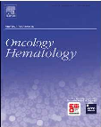
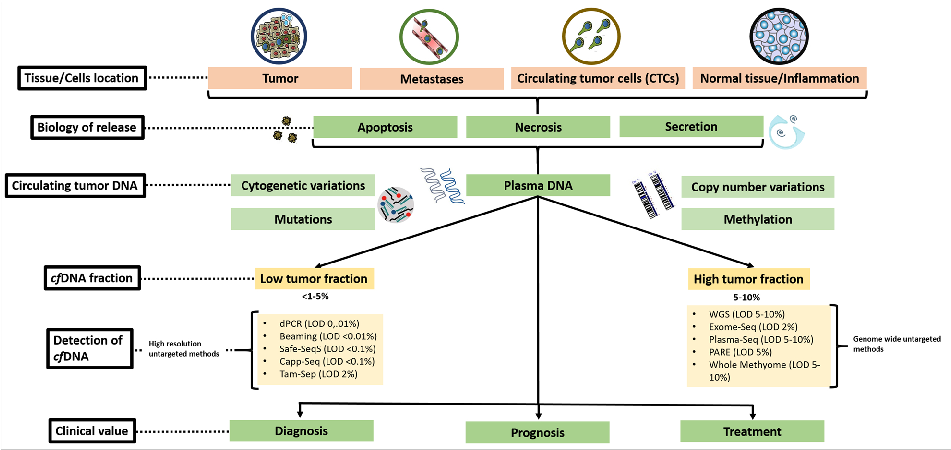
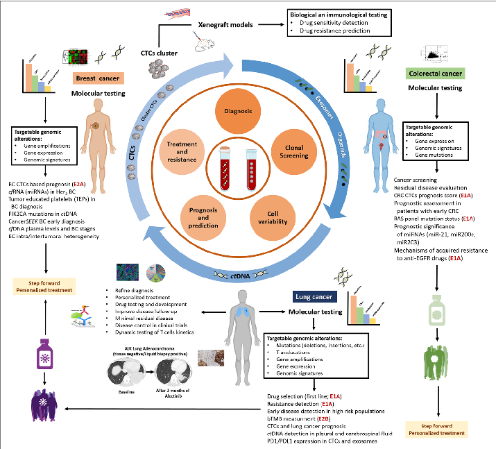

Critical Reviews in Oncology / Hematology 151 (2020) 102978

Contents lists available at ScienceDirect

# Critical Reviews in Oncology / Hematology

journal homepage: www.elsevier.com/locate/critrevonc

## Challenges and opportunities of cfDNA analysis implementation in clinical practice: Perspective of the International Society of Liquid Biopsy (ISLB)

### T

Christian Rolfoa,*,2, Andrés F. Cardonab,c,d,2, Massimo Cristofanillie, Luis Paz-Aresf, Juan Jose Diaz Mochong,h,i, Ignacio Duranj, Luis E. Raezk, Alessandro Russoa,l, Jose A. Lorentem,n, Umberto Malapelleo, Ignacio Gil-Bazop,q,r,s, Eloisa Jantus-Lewintret, Patrick Pauwelsu, Tony Mokv, María José Serranon,w,x,**, on behalf of the ISLB1

- a Thoracic Oncology Department and Early Phase Clinical Trials Section, School of Medicine, Maryland University, Maryland, USA
- b Clinical and Translational Oncology Group, Clínica del Country, Bogotá, Colombia
- c Foundation for Clinical and Applied Cancer Research – FICMAC, Bogotá, Colombia
- d Molecular Oncology and Biology Systems Research Group (Fox-G), Universidad El Bosque, Bogotá, Colombia
- e Department of Medicine, Division of Hematology and Oncology, Robert H. Lurie Comprehensive Cancer Center, Feinberg School of Medicine, Northwestern University, 710 N Fairbanks Court, Suite 8-250A, Chicago, IL, 60611, USA
- f Hospital Universitario 12 de Octubre, CNIO-H12o Lung Cancer Unit, Universidad Complutense and CIBERONC, Madrid, Spain
- g DestiNA Genomica S.L. Parque Tecnológico Ciencias de la Salud (PTS), Avenida de la Innovación 1, Edificio BIC, 18016, Armilla, Granada, Spain
- h GENYO Centre for Genomics and Oncological Research, Pfizer/University of Granada/Andalusian Regional Government. PTS Granada - Avenida de la Ilustración, 11418016, Granada, Spain
- i Department Medicinal and Organic Chemistry, School of Pharmacy, University of Granada, Campus Cartuja s/n, 18071, Granada, Spain
- j Servicio de Oncologia Medica, Medical Oncology Department, Hospital Universitario Marques de Valdecilla, Edificio Sur, 2 Planta, Despacho 277, 39008, Santander, Spain
- k Memorial Cancer Institute, Memorial Health Care System, Florida International University, Florida, USA
- l Medical Oncology Unit A.O. Papardo & Department of Human Pathology, University of Messina, Italy
- m Laboratory of Genetic Identification, Department of Legal Medicine, University of Granada, Av. de la Investigación, 11, 18071, Granada, Spain
- n Centre for Genomics and Oncological Research - GENYO, Pfizer, University of Granada, Andalusian Regional Government, Granada, Spain
- o Department of Public Health, University Federico II of Naples, Naples, Italy
- p Department of Oncology, Clínica Universidad de Navarra, Pamplona, Navarra, Spain
- q University of Navarra, Center for Applied Medical Research, Program of Solid Tumors, Pamplona, Navarra, Spain
- r Idisna, Navarra Institute for Health Research, Pamplona, Navarra, Spain
- s Centro de Investigación Biomédica en Red de Cáncer (CIBERONC), Madrid, Spain
- t Molecular Oncology Laboratory, Fundación Investigación, Valencia General University Hospital, Valencia, Spain
- u Center for Oncological Research (CORE), University of Antwerp, & Department of Pathology, Antwerp University Hospital, Edegem, Belgium
- v State Key Laboratory in Oncology in South China, Hong Kong, China
- w Bio-Health Research Institute (Instituto de Investigación Biosanitaria ibs. GRANADA), Spain
- x Complejo Hospitalario Universitario Granada (CHUG), Department of Medical Oncology, University of Granada, Granada, Spain

##### A R T I C L E I N F O

A B S T R A C T

Precision medicine was born with the development of new diagnostic techniques and targeted drugs, yielding better outcomes in cancer care. With the evolution and increasing sensitivity for detecting oncogenic drivers, liquid biopsies (LBs), specifically cell-free DNA (cfDNA) analysis, have been proposed as a minimally-invasive technique for genomic profiling. Ranging from sequencing techniques to PCR-based methods and other more complex strategies, this approach, currently applicable in some solid tumors with robust evidence, is showing promising opportunities in other cancers. However, difficulties in validating their clinical utility exist within limitation at different levels among several techniques, reporting of the results, lack of appropriate clinical trial

Keywords: Liquid biopsy Cell-free DNA Perspective ISLB NGS Precision oncology

Abbreviations: BC, breast cancer; CRC, colorectal cancer; CTCs, circulating tumor cells; TEPs, tumor educated platelets; bTMB, blood tumor mutation burden; E, evidence-based level

⁎ Corresponding author at: 22 South Greene Street, Baltimore, MD, 21201, USA.

⁎⁎ Corresponding author at: Liquid biopsy and metastasis research group, GENYO, Centre for Genomics and Oncological Research: Pfizer/University of Granada/

Andalusian Regional Government PTS, Avenida de la Ilustración 114, Granada, 18016, Spain. E-mail addresses: christian.rolfo@umm.edu (C. Rolfo), mjose.serrano@genyo.es (M.J. Serrano). @ChristianRolfo (C. Rolfo), @mjoseserrano19 (M.J. Serrano)

- 1 International Society of Liquid Biopsy – ISLB.
- 2 These authors contributed equally to the manuscript.

https://doi.org/10.1016/j.critrevonc.2020.102978 Received 13 April 2020; Accepted 29 April 2020

1040-8428/ © 2020 Elsevier B.V. All rights reserved.

designs, and unknown economic impact. One of the aims of the ISLB is to create recommendations to develop reliable and sustainable diagnostic, prognostic and predictive tools using LBs. This paper is addressing these objectives, helping the healthcare providers and scientific community to understand the potential of LB.

#### 1. Introduction

The concept of “precision medicine” (PM) is nowadays steadily part of our cancer management (Moscow et al., 2018). The goal of PM is to eliminate the “one size fits all” model of patient management, which is centered on average response to empirical therapy, by shifting the emphasis to tailored treatments to disease biology and predicted treatment response (Di Sanzo et al., 2017).

Therapeutic advances in genomic-guided precision oncology rely upon the prospective molecular identification of oncogenic alterations and resistance mechanisms to guide accurate treatments (Sholl et al.,

- 2015). Technological advances in genetic sequencing of plasma cellfree DNA (cfDNA) have enabled ‘liquid biopsies’ (LB). These have the potential to identify actionable alterations in circulating tumor-derived DNA (ctDNA) and capture intra-tumor heterogeneity not addressed by tissue biopsy, potentially avoiding the need for invasive measures that increase costs and generate unnecessary risks (Bettegowda et al., 2014). Among the limitations of tissue-based next generation sequencing (NGS) is the ability to perform molecular analysis only in samples of adequate quality, with ∼14 % failure rates at large academic centers (Bettegowda et al., 2014). Cell-free Nucleic Acid (cfNA) analysis may be useful in these cases and, recently, integration of cfNA NGS testing showed marked increase of therapeutically-targetable mutations detection and improved delivery of molecularly-guided therapy (Aggarwal et al., 2019).

One of the aims of the ISLB is to create recommendations to develop reliable and sustainable diagnostics, prognostics and predictive tools using LB. In this perspective paper we will evaluate the challenges associated with of LB testing and application, providing recommendations

for its clinical practice use (Figs. 1 and 2).

#### 2. LB for whom and when to perform

2.1. Can LB be applicable to most solid tumors?

Nowadays, optimum cancer care requires state-of-the-art molecular diagnostics (El-Deiry et al., 2019). In this rapidly evolving scenario, LB gained attention as alternative (or complementary) to traditional tumor tissue biopsy (Delgado-Urena et al., 2018).

The most commonly used techniques are quantification of ctDNA and CTCs (Wang et al., 2017) (Batth et al., 2017). Despite LB acceptance as a potential prognostic and predictive tool in solid tumors, the reality is that advances in this field are mostly associated with lung, colon and breast cancer (Hench et al., 2018).

Advancements mainly interested the metastatic setting, due to the higher burden and increased detection rate of CTCs and ctDNA, offering the best disease model for monitoring and assigning new therapies (Neumann et al., 2018).

2.1.1. LB in lung cancer (LC)

In non-small cell lung cancer (NSCLC) cfDNA analysis has been extensively studied for targeted therapy selection, treatment response monitoring and resistance mechanisms detection. Current guidelines include cfDNA testing in advanced NSCLC in both treatment-naïve patients and after progression during EGFR TKIs (Lindeman et al., 2018) (Rolfo et al., 2018a). The PCR-based Cobas® EGFR-Mutation Test v2 (Roche) is the only LB FDA-approved test for EGFR mutations in NSCLC (Malapelle et al., 2017). However, the use NGS panels designed

Fig. 1. Solid tumors shed nucleic acid content into the circulation, either passively by apoptosis and necrosis or actively. Multiple fragments of cell-free circulating tumor ctDNA can be detected and quantified in blood samples. The presence of such altered ctDNA can advise about the genetic composition of a tumor, and their quantity can be used to monitor prognosis and predict response to treatment (including cytogenetic variations, copy number variations, mutations and changes due to methylation). The detection of ctDNA depends on its free circulating fraction. When there is a low fraction available, the most appropriate techniques for the detection of the mentioned alterations are dPCR, beaming, safe-SeqS, Capp-Seq and Tam-Seq. On the contrary, when the fraction is high, the most useful techniques are WGS, exome and plasma-seq, PARE, and whole methylome analysis. The clinical value of ctDNA analyzes in different fluids, but especially in plasma represent dynamic changes of the tumor over time, but especially after treatment. These tests act as picture of the clonal genetic composition of the neoplasm, information might be used to monitor response to treatment, predict relapse, and stratify treatment in an active fashion.

Fig. 2. Application of circulating biomarkers (liquid biopsy). Application of blood-based liquid biopsy analysis over the span of lung, breast and colorectal cancer. Blood is collected periodically for isolation of circulating tumor cells (CTCs), circulating tumor DNA (ctDNA) and exosomes/organoids. These circulating biomarkers may be applied to guide initial diagnosis, treatment monitoring or planning, prognosis prediction and developing a sequential targeted therapy for patients with diverse solid tumors (the review includes some of the most important roles for liquid biopsy in Nonsmall cell lung cancer, breast cancer an colorectal cancer, considering the level of evidence, its clinical applicability and the degree of recommendation). Functional studies with CTCs and development of CTC— derived xeno-grafts (CDXs), patient-derived tumor xeno-graft (PDTX) and organoids model from CTCs for dynamic monitoring of tumor clonal evolution to consider development and selection of new targeted drugs after its molecular characterization. The figure also includes, some clinical applications of ctDNA as a tool for therapy monitoring. ctDNA can be obtained from plasma for genomic analysis, drug testing and use in personalized medicine according to the genomic and epigenomic changes. In the same way, the progressive use and representative role of exosomes for drug development after genomic and immunological testing. Moreover, use of exosome as a drug delivery vehicle where it can be loaded with drugs, siRNAs, gene etc.

for accurate assessment of point mutations, indels, copy number changes, and translocations is advisable and can allow a more complete plasma genotyping. A positive result for oncogene drivers with currently FDA-approved drugs is adequate for treatment and can allow the identification of novel oncogenic drivers useful for clinical trial enrollment (Rolfo et al., 2018a). Recently, the NILE trial showed that a 73-gene NGS cfDNA test (Guardant360®) identified guideline-recommended biomarkers at a rate at least as high as standard-of-care tissue genotyping in untreated metastatic NSCLCs, with high concordance, lower turnaround time and higher biomarker discovery rate (Leighl et al., 2019). These results might challenge or change the current diagnostic paradigm from upfront tissue genotyping to a “bloodfirst” approach and updated guidelines are eagerly awaited. Furthermore, the role of LB has been extensively investigated in patients treated with immunotherapy. Different plasma-based NGS platforms (FoundationACT® and GuardantOMNI®) have been used for evaluation of blood tumor mutation burden (bTMB) in clinical trials with PD(L)-1 inhibitors (Gandara et al., 2018) (Rizvi et al., 2020) showing promising results. However, several open questions still remain unanswered, including optimal testing platform, optimal cut-off value, minimum number of DNA regions required for TMB assessment, as well as which somatic mutations are relevant as contributors of the tumor neoantigenicity. The ongoing BFAST trial will provide further evidence on the predictive role of this biomarker.

- 2.1.2. LB in colorectal cancer In contrast with LC, cfDNA analysis has a limited use in metastatic

colorectal cancer (mCRC), mostly due to the availability of tissue for molecular testing. However, cfDNA RAS testing might provide complementary information, better recapitulating CRC heterogeneity (Normanno et al., 2018). Plasma levels of cfDNA are a strong independent prognostic marker (Hamfjord et al., 2019) (Spindler et al., 2017) and RAS mutations detected in plasma have predictive value

without tissue confirmation (Tabernero et al., 2015) (Takeshita et al., 2017). Furthermore, mutational status of RAS and BRAF on cfDNA can provide useful information in selecting RAS wild-type (WT) patients for anti-EGFR monoclonal antibody rechallenge (Cremolini et al., 2018).

- 2.1.3. LB in breast cancer (BC) BC was one of the first tumor type in which LB technologies were

studied. The prognostic value of ctDNA was documented in numerous studies showing the clinical value of the detection of HER2 amplification, PIK3CA and ESR1 mutations in cfDNA (O’Leary et al., 2018). Recently, LB has emerged also as diagnostic tool for patient selection and drug monitoring. ESR1 mutations are identified at high frequency in patients progressing after aromatase inhibitors (AIs) and impact on the sensitivity to standard therapies. An exploratory analysis of SoFEA and PALOMA-3 trials showed that ESR1 mutation analysis in plasma after progression from AI may help direct choice of further single agent endocrinotherapy (Fribbens et al., 2016). In addition, PIK3CA mutations have been evaluated as potential predictive biomarker for PI3K inhibitors. Based on the positive results of the SOLAR-1 trial, the FDA approved the companion diagnostic (CDx) Therascreen® PIK3CA RGQ PCR Kit to select HR+/HER2- advanced/metastatic BC progressing after prior AI, harboring PIK3CA mutations in tumor tissue and/or cfDNA for treatment with alpelisib plus fulvestrant (Andre et al., 2019).

- 2.1.4. LB in other solid tumors In recent years, cfDNA analyses have also been reviewed in other

tumor types such as liver, pancreas, ovarian or prostate cancer (Ramalingam and Jeffrey, 2018), although an immediate application of LB is still far from clinical practice.

However, the use of plasma NGS can provide useful genomic information in some solid tumors, including lung, breast and colorectal cancer, but can help a better patient selection for clinical trials enrollment and a more appropriate treatment for patients with rare tumor-

agnostic oncogenic drivers, such as NTRK fusions (Drilon et al., 2018).

detecting mutations with > 10 % VAF, albeit recent technical advances allow increased detection rates by blocking amplification at the oligo 3´end, amplifying only the mutant allele or enriching only variant alleles, allowing a high diagnostic performance but only of common mutations (Elazezy and Joosse, 2018).

Liquid biopsy for Who? Key messages:

- • Liquid biopsy has already entered clinical practice in lung cancer and more recently

in breast cancer; To date, cfDNA is the most well studied and validated source for liquid biopsy;

- • PlasmaNGScanbeusefulinothertumortypes,allowingtheidentificationof

Mass spectrometry is utilized to overcome the limits of PCR multiplexing. The idea is to design specific nano-tags that bind to desired hotspot regions and emit specific signals due to laser excitation or bioting markers, detecting up to 40 targets per reaction with low DNA input (∼5 ng) (Wee et al., 2016) (Harper et al., 2013) (Mosko et al.,

oncogenic drivers useful for enrollment in early clinical trials.

- 2016).

Key messages liquid biopsy technology:

- • dPCR-basedtechnologiespresenthighsensitivity,butcannotevaluatesimulta-

neously multiple genetic alterations;

- • NGS,inparticularultra-deep,shouldbethepreferredmethodforcfDNAgeno-

typing, at least in tumors requiring a comprehensive genotyping, such as lung cancer;

- • Hybrid capture-based technologies offer the possibility to evaluate also the presence

of genomic rearrangements

3. Challenges

3.1. Technological challenges

Several pre-analytical variables can influence the sensitivity of cfDNA analysis, including plasma volume, transit time, time intervals from blood collection to plasma isolation, centrifugation protocol, purification methods, and temperature (Sorber et al., 2018) (Sorber et al., 2019) (van Ginkel et al., 2017) (van Dessel et al., 2017) (Warton

- et al., 2018). Blood collection can be performed using standard EDTAcontaining tubes or tubes containing preservatives solutions, such as Streck cfDNA BCT and Qiagen PAXgene Blood ccfDNA, to prevent hemolysis and reduce cfDNA fragments degradation, allowing an extended time-period before blood processing (Deans et al., 2019). The use of plasma over serum should be preferred, due to the lower risk of contamination with genomic DNA (Martignano, 2019).

Furthermore, cancer treatments can influence LB results, since cfDNA levels changes during the disease course and are higher before treatment or at progression (Rolfo et al., 2014). This suggests the potential use of cfDNA dynamics as real-time monitoring method during cancer treatment, since cfDNA clearance has been associated with better outcomes in NSCLC patients treated with targeted therapies (Zhou et al., 2019) (Shepherd et al., 2018) (Thress et al., 2017) (Phallen

- et al., 2019) or immunotherapy (Anagnostou et al., 2019), and might allow the identification of resistant mutations before radiographic progression (Oxnard et al., 2014).

One of the limitations of cfDNA analysis is the low presence of circulating DNA in plasma of a significant proportion of patients. Alternative sources for tumor genotyping have been evaluated (RNA, exosomal RNA and others) to improve genetic alterations detection. In the TIGER-X study combined isolated exosomal RNA and cfDNA, using a targeted NGS panel, increased sensitivity for EGFR mutations detection compared with cfDNA analysis by BEAMing, with the largest improvement in patients with M0-M1a disease (Krug et al., 2018), known to have lower cfDNA levels (Jenkins et al., 2017) (Sacher et al., 2016) (Passiglia et al., 2018). Furthermore, analysis of circulating tumor RNA (ctRNA) offers some advantages (de Fraipont et al., 2019) (Sorber et al.,

- 2017) and can represent a complementary source to cfDNA, especially for fusion transcripts evaluation, as recently demonstrated in tissue (Benayed et al., 2019).

- 2.2. cfDNA technologies for clinical practice

cfDNA comprises a mixture of DNA fragments from diverse etiologies and ctDNA accounts for < 1% (Diaz and Bardelli, 2014) Identifying such small quantities is difficult with low disease burden, especially in early stages (Schwarzenbach et al., 2008) (Forshew et al., 2012) (Kennedy et al., 2014). Two possible strategies can be pursued. The first comprises of detecting specific tumor mutations previously identified from the primary tumor (targeted approach). Although limited in its application, it offers the possibility of detecting extremely low VAF (∼0.01 %) with high specificity and fast results (Cristofanilli and Braun, 2010) (Freidin et al., 2015). The second alternative lies on an untargeted approach which focuses on genome or exome wide sequencing detecting copy number aberrations or point mutations without prior tumor profiling (Elazezy and Joosse, 2018) (Beaver et al.,

- 2014) (Glenn, 2011). Methodologies implemented are NGS, digital PCR, quantitative PCR (qPCR), and mass spectrometry.

NGS includes a variety of protocols designed to optimize detection depending on the target regions to be identified balancing sensitivity and specificity. Ultra-Deep NGS can detect low allele frequencies with high coverage, resulting in a sensitivity close to 100 % and a specificity of ∼80 % (Narayan et al., 2012) (Couraud et al., 2014) (Uchida et al.,

- 2015). The highest sensitivity (close to 98–99 %) for identifying point mutations is reached with Tagged Amplicon deep Sequencing (TamSeq), Safe-Sequencing System (Safe-SeqS), Cancer Personalized Profiling by deep Sequencing (CAPP-Seq), Bias-Corrected Targeted NGS and Multiplex PCR NGS. Tam-Seq is a protocol optimized for hotspot regions and selected coding regions by implementing efficient library preparation and specially designed analysis algorithms (Forshew et al., 2012). Safe-SeqS, assigns unique identifiers to prespecified DNA templates and conduct amplification on each tagged region into families and sequences (Kinde et al., 2011). CAPP-Seq uses previously developed copy DNA (cDNA) oligonucleotides that hybridize to defined areas. These regions are then sequenced obtaining evaluation of mutations, rearrangements and copy number alterations, with a theoretical detection rate of 0.00025 % VAF (Newman et al., 2014) (Newman et al., 2016). Bias-Corrected Targeted NGS implements multifunctional markers including sample and sequence tags that bind to small capture probes that are then amplified with high specificity (Paweletz et al.,
- 2016). Finally, multiplex-PCR NGS is the combination of highthroughput PCR amplification and sequencing reaching a 99 % sensitivity for the detection of mutations in target regions (Abbosh et al.,
- 2017). Digital PCR (dPCR) offers a lower cost per test compared to NGS,

but do not allow a simultaneous evaluation of multiple genomic aberrations. Droplet PCR (ddPCR) and BEAMing are the two main techniques. BEAMing employs water droplets containing a mixture of the PCR reagents with addition of magnetic beads that are mixed with fluorescent dDNA leading to strand termination at divergent positions of interest, to latter be characterized by flow cytometry (Oxnard et al.,

- 2016). Conversely, ddPCR is carried out in an oil and water emulsion where DNA samples are distributed upon thousands of droplets containing both mutated and WT DNA. Using fluorescent specific probes, evaluation of desired amplicons with flow cytometry can be obtained (Beaver et al., 2014) (Kristensen and Hansen, 2009).

###### Challenges technical limitations - Key messages:

Plasma is the main source for cfDNA genotyping;

• Well-validatedpreclinicalstepsarecrucialbeforecfDNAanalysisandmight

Real-time PCR (qPCR) has traditionally been implemented for

considerably influence test results in terms of specificity and sensitivity;

• cfRNAgenotypinginthenextfuturemightcomplementcfDNAforanalysisof

the sites of progression seem to influence cfDNA levels, since patients with intracranial progression are more likely non-shedders than patients with extracranial progression and/or both intra- and extra-cranial progression (Aldea et al., 2020).

genetic rearrangements.

- 3.2. Vendors and reporting-related challenges

The percentage of non-shedding samples is variable and depends on tumor type and stage, since ctDNA levels have been reported in > 75 % of patients with advanced pancreatic, ovarian, colorectal, bladder, gastroesophageal, breast, melanoma, hepatocellular, and head and neck cancers, but in < 50 % of primary brain, renal, prostate, or thyroid cancers (Bettegowda et al., 2012), with lower levels in patients with localized tumors (Bettegowda et al., 2012) (Stetson et al., 2019). Therefore, in patients with non-shedding tumors LB can lead to false negative results and should be considered uninformative, with tissue biopsy necessary to confirm the oncogenic driver negativity.

The commercial availability of plasma NGS platforms poses novel challenges in clinical practice, due to the report of a multitude of genetic information that should be correctly interpreted. Most of the vendors include in the report clinical suggestions of FDA-approved drugs in the same indication and/or in others, as well as clinical trials available. However, the bioinformatics matching of therapies should be interpreted with caution, especially in presence of multiple somatic mutations and/or several therapeutic options, and must be evaluated in the context of a multidisciplinary molecular tumor board (MTB). Furthermore, the use of standardized criteria to define actionability can help a broader implementation of MTBs (Rolfo et al., 2018b), through the use of evidence-based scales, as OncoKB (Chakravarty et al., 2017) and ESCAT (Mateo et al., 2018). With few exception (microsatellite instability, BRAFV600 and NTRK fusions), approval of biomarker-driven drugs is limited to specific tumor types and the benefit deriving from the use of molecular characterizations in other indications has been questioned (Le Tourneau et al., 2015) (Tsimberidou et al., 2018) (Massard et al., 2017). Recently, three studies evaluated this strategy using different tissue-based and/or LB approaches, demonstrating the feasibility of using cfDNA for identification of molecular alterations to support patient selection for early clinical trials (at least in certain tumor types) (Rothwell et al., 2019), treating molecularly complex and heterogeneous cancers with combinations of customized agents (Sicklick et al., 2019), and, finally, genomic and transcriptomic profiling are both useful for improving therapy recommendations and patient outcome (Rodon et al., 2019).

- 3.3.2. Clonal hematopoiesis (CH) CH is referred to an asymptomatic expansion of blood cells des-

cending from a single hematopoietic stem cell, harboring specific, disruptive, and recurrent genetic variants, in individuals without clear diagnosis of hematological malignancies (Gibson and Steensma, 2018) (Shlush, 2018) (Steensma et al., 2015). CH is associated with aging and higher all-cause mortality. The most frequent somatic mutations involve three genes previously implicated in hematologic cancers (DNMT3A, ASXL1, and TET2) (Genovese et al., 2014) (Jaiswal et al., 2014). Less common variants include TP53, JAK2, and other driver genes mutated in solid tumors (NOTCH2, FAT3, EXT2, ERBB4, KRAS and ARID2) (Liu et al., 2019) (Hu et al., 2018). CH may be a potential source of false positives in LB due to the risk of mistakenly recognize a mutation of hematopoietic origin as tumor-derived.

This represents a challenge for minimal residual disease (MRD) profiling and early cancer detection,91 but also a potential cause of discordance between tumor and plasma genotyping (Liu et al., 2019) (Hu et al., 2018). As the use of highly sensitive plasma NGS platforms with detection limits of ≤0.5 % VAF increases, the potential risk of false positive due to CH raises (Hu et al., 2018). Recently, an orthogonal comparison of plasma samples from different solid tumors (88 % stage I-II), analyzed with 4 different NGS platforms, with matched tumornormal tissue pairs, revealed that most NGS assay discordance is a result of technical variations and, to a lesser extent, biologic factors, including CH and tumor heterogeneity, with higher discordance results at VAF < 1% (Stetson et al., 2019). The conventional NGS approach (with 95 % sensitivity and specificity) cannot effectively determine a cfDNA mutation with < 0.1 % VAF to be of hematopoietic origin (Liu et al., 2019). Recently, a novel approach that incorporated whole blood cell sequencing to cfDNA analysis for CH-filtering has been described, with a comparable sensitivity to established dPCR methods (Li et al., 2019).

- 3.4. Socio-economic and regulatory challenges

Another potential challenge using commercially available plasma NGS tests is the wide variability of techniques adopted. For instance, hybrid capture-based technology can allow the identification of genetic rearrangements. However, gene fusions are complex variants that may be more challenging to detect by plasma NGS and differences in hybrid capture techniques as well as variant calling by the bioinformatic pipelines may be sources of variations in sensitivity among the different assays (Supplee et al., 2019) and might potentially lead to under detection of gene fusions in some cases. Moreover, some platforms evaluate only hotspot mutations, potentially missing newly diagnosed/not previously reported mutations. To date, there is no consensus on the minimal requirements for NGS panels, although it is reasonable that include all the genetic alterations druggable or associated with resistance to current treatments in that specific tumor. However, broader NGS panels can allow a better stratification of patient candidate for clinical trials and identify potentially exploitable targets with drugs approved in other indications.

3.4.1. Economic impact of LB

The life cycle of new in vitro diagnostic (IVD) assays starts at the discovery phase with the identification of specific biomarkers and finishes when health providers reimburse their use in patients. Currently, we are in a phase where the first LB assays for cancer have demonstrated, following their analytical validation, their clinical validity (Phillips et al., 2014).

Reporting challenges - Key Messages:

- • Evidence-basedscalesforgradingoncogenicdrivers,suchasESCATandOncoKB,

are useful tools for guiding oncologists;

- • Theadoptionofmultidisciplinarymoleculartumorboards(MTB)isadvisableand

can help interpreting NGS results.

- • Enrollmentinclinicaltrialsshouldbepreferredovertheoff-labeluseofclinically

approved drugs, since can produce evidence of the targetability of that specific genetic alteration in other solid tumors.

While demonstrating these two main features is essential for regulatory agencies approval, there is still a further hurdle to overcome by LB assays in order to be added to reimbursement lists of health providers. Different models for evaluating the economic impact on general health have been proposed and cost-effective analysis (CEA) is one of the most widely used (Seixas, 2017). CEA uses parameters such as quality-adjusted life-year (QALY) and life-years gained to measure clinical effectiveness and can be performed using data from clinical trials if correctly designed. Hence, it is recommended for LB developers to design their clinical trials with two main objectives in mind (i) to

- 3.3. Biological challenges

- 3.3.1. Shedding vs. no shedding Under certain circumstances, LB shows low sensitivity due to un-

detectable levels of cfDNA in plasma. In presence of higher disease burden solid tumors more likely shed tumor-derived DNA into their bloodstream (Jenkins et al., 2017) (Sacher et al., 2016). Furthermore,

demonstrate their clinical utility and (ii) to do CEA of the new assay.

However, data of CEA for LB assays are relatively scant. An example of LB assay that demonstrated positive economic impact is SelectMDx, an assay based on circulating epigenetic markers for prostate cancer, which results in savings €665 and a gain of 0.025 QALY per patient compared to PSA alone (Govers et al., 2019). Recently, some studies have reported that tissue-based NGS use is a more cost-effective approach compared with single gene testing in certain solid tumors, such as NSCLC (Pennell et al., 2019) (Tan et al., 2020). Furthermore, the use of plasma NGS can improve the rate of detection of guideline-recommended biomarkers compared to standard of care tissue genotyping, as recently reported in the prospective NILE study (Leighl et al., 2019). To date, there are no data on cost-effectiveness of plasma NGS tests.

Liquid Biopsy Challenges - Key messages:

- • Clinicalimplementationofliquidbiopsyishamperedbyseveralbiological,

technical and socio-economic challenges;

- • TheexactknowledgeofthelimitsofdifferentLBtechniquesisessentialforcorrect

interpretation of test results and choice of the optimal methodology.

#### 4. Regulatory issues

To date, the only FDA-approved LB tests are Cobas® EGFR Mutation Test v2 for EGFR mutations in NSCLC and Therascreen® PIK3CA RGQ PCR Kit for PIK3CA mutation in BC. In contrast to the drug development process, IVD development is typically not linear and many analytical validation studies may take place without prior FDA involvement (FDA.gov). A CDx is a medical device that provides information essential for the safe and effective use of a corresponding drug. It is recommended that drug development and CDx validation are conducted in the same pivotal trial. To accelerate the development and validation of LB assays, the Blood Profiling Atlas in Cancer (BloodPAC) Consortium was launched and includes representatives from academia, private foundations, industry and the US government. On top of these activities and with the goal of aligning efforts in the LB space a group of societies, which include the ISLB, research groups and regulatory agencies created the International Liquid Biopsy Alliance (ILBA). The mission is to increase efficiency, minimize duplication, and accelerate LB assays introduction into routine clinical practice.

A rigorous validation process is essential before clinical utilization of an IVD, including LB assays, and can prevent the widespread use of not sufficiently validated tests for patient stratification or cancer diagnosis.

#### 5. Clinical trials

5.1. Design of clinical trials to assess the usefulness of LB in cancer

Traditionally, the implementation of LB has been carried out parallel to therapeutic trials as exploratory analyses. It is interesting to considered LB as an allocation strategy between clinical trials treatment arms, as recently reported in the BFAST trial that demonstrated the clinical utility of blood-based NGS as a method to inform clinical decision making in ALK-positive NSCLC, with a comparable alectinib activity to that observed in clinical trials using tissue testing as reference method for ALK rearrangements detection (Gadgeel et al., 2019).

With the advancements and increase in detection capabilities of LB assays, the idea of creating a master protocol that encompass the recruitment of all these patients based on a serum sample test could become a reality. The closest design currently running is the Targeted Agent and Profiling Utilization Registry (TAPUR) study (NCT#02693535).

Difficulties in traditional trial design rely on the complexity of conducting several studies for each possible tumor, in this case, that

carry a specific genomic driver. A way to address this issue is by implementing master protocol trials. These encompass in a large study multiple sub-studies running in parallel (Hirakawa et al., 2018). Another design worth mentioning is the liquid dynamic medicine model. The idea behind this proposal comes from the dynamic variation of molecular profiles in cancer, administering sequential treatments based on LB results, leading to extreme personalization of care.

#### 6. Role of advocacy groups

LB tests have demonstrated promising activity in multiple clinical settings, but the great enthusiasm and expectations around them can be harmful if not adequately managed. The correct use of LB and an adequate knowledge of strengthens and limitations of different assays available is indeed essential for a correct interpretation of the results. In clinical practice, a not negligible proportion of patients with oncogenic drivers still not receive the appropriate matched targeted drug (Singal et al., 2019).

A broader involvement of all the stakeholders in the use of these tests, including patients’ advocacy groups is therefore desirable to improve the knowledge on these tests and increase research opportunities in this field.

#### 7. The near future in the LB landscape: early detection and MRD

Identification of oncogenic driver mutations in pre-symptomatic or early stage neoplasms could offer a tremendous impact in cancer control and sequels.

By analyzing promoter methylation in ctDNA in SFN, P16, hMLH1, HOXD13, PCDHGB7, and RASSF1 in a large cohort of BC patients, benign lesions and healthy individuals, sensitivity and specificity close to 80 % was obtained in detecting BC. Other target methylation profiles including EGFR, PPM1E and other CpG islands have been identified as potential biomarkers (Hench et al., 2018) (Shan et al., 2016) (Li et al., 2016). Similar conclusions can be drawn from LC early detection studies with higher hypermethylation profile of selected genes in cfDNA in LC patients compared to healthy controls (Zhang et al., 2011). mRNA analysis, proteomics, transcriptomics, metabolomics, microbiome evaluation and others have been examined (Calabrese et al., 2019) (Bagheri et al., 2018) (Uribarri et al., 2014). Although potentially effective, further development and characterization of markers is needed before adoption of LB in this setting.

Cancer Interception analyzes the cellular and molecular events associated with cancer initiation and progression and this could be translated into novel tools for early detection and prevention of cancer (Beane et al., 2017). Several groups are working on the development of screening tests for different types of cancers using LB, focusing mainly on CRC and LC. In CRC several groups studied the screening or diagnostic relevance of different cfDNA parameters, and several reports were focused on the detection of specific markers. An example could be the methylated Septin9 in plasma which was found to be significantly higher in patients with CRC than in patients with no evidence of the disease (Molnar et al., 2015), making it a potential biomarker for this type of cancer (Molnar et al., 2015) (Lamb and Dhillon, 2017), leading to the development of a specific test (Epi proColon® 2.0 CE). Other studies evaluated in plasma different hypermethylated DNA promoter regions and genes specific to CRC (Rasmussen et al., 2017). In addition, an age-adjusted panel of four cf-nucleosomes was developed for the discrimination between CRC patients and healthy controls (Volition SPRI, Namur, Belgium), showing high sensitivity for early stages (75–86 %) at 90 % specificity, while a second combination of four cfnucleosome biomarkers discriminating polyps from the healthy group (Rahier et al., 2017). Different approaches have been proposed for cfDNA analysis in LC either though targeted mutation detection in patients with a known tumor mutation profile (“tumor informed”) or though mutation discovery (“tumor uninformed”) (Abbosh et al.,

- 2018). In LC, increased levels of cfDNA were observed in early stage LC patients compared to healthy subjects (Esposito et al., 2017). Similar results were observed for BC and ovarian cancer with 78 % and 70 % sensitivity and 83 % and 90 % specificity, respectively (Lin et al., 2017) (Zhou et al., 2016). Other types of LBs have been used for screening both CRC and LC (Lamb and Dhillon, 2017) (Zhang et al., 2010). However, large studies are still necessary to demonstrate their usefulness as early diagnostic markers.

The use of LB can finally allow the identification of MRD. A prospective multicenter study in stage I-III CRC showed a strong association between ctDNA and disease recurrence, using ultra-deep sequencing (Reinert et al., 2019) Similarly, ctDNA detection before surgery and during follow-up has been associated with relapse in early BC. Interestingly, ctDNA was less commonly detected in patients with brain-only relapse (Garcia-Murillas et al., 2019), suggesting that alternative surveillance strategies are needed in this subgroup.

#### 8. Conclusions

LB is an umbrella term that encompasses several minimally-invasive techniques for genomic information evaluation. Analysis of cfDNA has already entered clinical practice in selected solid tumors. However, wide clinical implementation of LB is hampered by several biological, technical and socio-economic challenges and significant regional disparities in the access to the different assays still exist. The implementation of innovative clinical study designs and robust economic evaluations of the clinical utility of LB tests is crucial to allow a more extensive exploitation of this powerful diagnostic tool in clinical practice.

#### Declaration of Competing Interest

Dr. Rolfo reports speaker bureau for MSD and AstraZeneca; advisory board role for ARCHER, Inivata, Merck Serono; consultant role for Mylan and Oncopass; supported research grant from Lung Cancer Research Foundation-Pfizer; research support from Guardant Health and Biomark inc. Dr. Cardona reports honoraria form BMS, Abbvie, Boehringer Ingelheim, Roche, MSD; Consulting or advisory Role for Roche, MSD, Novartis, Foundation Medicine, Foundation for Clinical and Applied Cancer Research, AstraZeneca, Boehringer Ingelheim; speaker bureau for Foundation Medicine, Foundation for Clinical and Applied Cancer Research, MSD, Novartis, BMS. Dr. Cristofanilli reports consultant role for Foundation Medicine, Lilly, Pfizer, Cytodyn. Dr. GilBazo reports speaker bureau/consultant role for AstraZeneca, Guardant Health, BMS, MSD; advisory board role for AstraZeneca, Boehringer Ingelheim, BMS, Lilly, MSD; contracted support/research Gobierno de Navarra, Ministerio de Economia y Competitividad (Gobierno de Espana), Fundacion Merck Salud. Dr. Monchon reports stakeholder and executive director of Genomics SL; Dr. Pauwels reports speaker fees from Biocartis; consultant for Biocartis. Dr. Malapelle reports personal fees from Boehringer Ingelheim, AstraZeneca, Roche, MSD, Amgen, Merck, and BMS for participation in a speaker bureau or for acting in an advisory role. Dr. Duran reports Research Grant/ Funding from AstraZeneca (institution), Roche (institution); Advisor/Board Member role for Roche, BMS, MSD, Pharmacyclycs, Jansen, Ipsen, Novartis; Honoraria for lectures (self): Roche, BMS, MSD, Jansen, Ipsen, Novartis, Astellas; Travel/Accommodations/ Expenses from Ipsen, AstraZeneca. Dr. Mok reports Grant/Research Support from AstraZeneca, BMS, Clovis Oncology, G1 Therapeutics, MSD, Merck Serono, Novartis, Pfizer, Roche, SFJ, Takeda, XCovery; speaker’s fee from ACEA Pharma, Alpha Biopharma Co., Ltd., Amgen, Amoy Diagnostics Co., LTD., AstraZeneca, Boehringer Ingelheim, BMS, Eli Lilly, InMed Medical Communication, MSD, Novartis, Pfizer, PrIME Oncology, Roche/ Genentech, Taiho, Takeda Oncology; Honoraria from Abbvie Inc., ACEA Pharma, Alpha Biopharma Co., Ltd., Amgen, Amoy Diagnostics

Co., LTD., AstraZeneca, Bayer, Boehringer Ingelheim, Blueprint Medicines Corporation, BMS, Celgene, CStone Pharmaceuticals, Daiichi Sankyo, Eli Lilly, Fishawack Facilitate Ltd, Hengrui Therapeutics Inc, Ignyta, Inc., Incyte Corporation, InMed Medical Communication, IQVIA, Janssen, Loxo-Oncology, Merck Serono, MSD, MoreHealth, Novartis, OncoGenex Pharmaceuticals, Inc., OrigiMed, PeerVoice, Pfizer, PrIME Oncology, Roche/Genentech, Sanofi-Aventis R&D, SFJ Pharmaceutical Ltd., Takeda Pharmaceuticals HK Ltd., Vertex Pharmaceuticals, Yuhan Corporation, Medscape/WebMD (medical education/CME activities), PeerVoice (independent medical education), Prime Oncology (medical education); Shareholder in Hutchison Chi-Med, Sanomics Ltd.; Stock option in Clearbridge Biomedics (now Biolidics Ltd.), Loxo-Oncology; OrigiMed Co. Ltd., Virtus Medical Group; Advisory role for Abbvie Inc., ACEA Pharma, Amgen, AstraZeneca, Bayer, Blueprint Medicines Corporation, Boehringer Ingelheim, BMS, Celgene, Cirina, CStone Pharmaceuticals, Daiichi Sankyo, Eli Lilly, Fishawack Facilitate Ltd, G1 Therapeutics, Inc., geneDecode Co., Ltd. (uncompensated), Hengrui Therapeutics Inc., Hutchison Chi-Med, Ignyta, Inc., Incyte Corporation, IQVIA, Janssen, Loxo-Oncology, Lunit, Inc., Merck Serono, Merck Sharp & Dohme, Novartis, OncoGenex Technologies Inc., OrigiMed, Pfizer, Roche/ Genentech, Sanofi-Aventis R&D, SFJ Pharmaceutical, Takeda Oncology, Vertex Pharmaceuticals, Virtus Medical Group, Yuhan Corporation; Board of Directors/Leadership roles (remunerated) in AstraZeneca PLC, Hutchison Chi-Med; Board of Directors/Leadership roles (non-remunerated) in American Society of Clinical Oncology (ASCO), Asian Thoracic Oncology Research Group (ATORG), Chinese Lung Cancer Research Foundation Limited (CLCRF), Chinese Society of Clinical Oncology (CSCO), Hong Kong Cancer Fund (HKCF), Hong Kong Cancer Therapy Society (HKCTS), International Association for the Study of Lung Cancer (IASLC), St. Stephen’s College & Prep. School. Dr Serrano reports consultant role for Astellas. The other authors do not report any conflict of interest.

#### References

Abbosh, C., Birkbak, N.J., Wilson, G.A., Jamal-Hanjani, M., Constantin, T., Salari, R., Le Quesne, J., Moore, D.A., Veeriah, S., Rosenthal, R., Marafioti, T., Kirkizlar, E., Watkins, T.B.K., McGranahan, N., Ward, S., Martinson, L., Riley, J., Fraioli, F., Al Bakir, M., Gronroos, E., Zambrana, F., Endozo, R., Bi, W.L., Fennessy, F.M., Sponer, N., Johnson, D., Laycock, J., Shafi, S., Czyzewska-Khan, J., Rowan, A., Chambers, T., Matthews, N., Turajlic, S., Hiley, C., Lee, S.M., Forster, M.D., Ahmad, T., Falzon, M., Borg, E., Lawrence, D., Hayward, M., Kolvekar, S., Panagiotopoulos, N., Janes, S.M., Thakrar, R., Ahmed, A., Blackhall, F., Summers, Y., Hafez, D., Naik, A., Ganguly, A., Kareht, S., Shah, R., Joseph, L., Marie Quinn, A., Crosbie, P.A., Naidu, B., Middleton,

- G., Langman, G., Trotter, S., Nicolson, M., Remmen, H., Kerr, K., Chetty, M., Gomersall, L., Fennell, D.A., Nakas, A., Rathinam, S., Anand, G., Khan, S., Russell, P., Ezhil, V., Ismail, B., Irvin-Sellers, M., Prakash, V., Lester, J.F., Kornaszewska, M., Attanoos, R., Adams, H., Davies, H., Oukrif, D., Akarca, A.U., Hartley, J.A., Lowe,
- H.L., Lock, S., Iles, N., Bell, H., Ngai, Y., Elgar, G., Szallasi, Z., Schwarz, R.F., Herrero, J., Stewart, A., Quezada, S.A., Peggs, K.S., Van Loo, P., Dive, C., Lin, C.J., Rabinowitz, M., Aerts, H.J.W.L., Hackshaw, A., Shaw, J.A., Zimmermann, B.G., Swanton, C.,

2017. Phylogenetic ctDNA analysis depicts early-stage lung cancer evolution. Nature 545, 446–451. https://doi.org/10.1038/nature22364.

Abbosh, C., Birkbak, N.J., Swanton, C., 2018. Early stage NSCLC - challenges to implementing ctDNA-based screening and MRD detection. Nat. Rev. Clin. Oncol. 15, 577–586. https://doi.org/10.1038/s41571-018-0058-3.

Aggarwal, C., Thompson, J.C., Black, T.A., Katz, S.I., Fan, R., Yee, S.S., Chien, A.L., Evans, T.L., Bauml, J.M., Alley, E.W., Ciunci, C.A., Berman, A.T., Cohen, R.B., Lieberman, D.B., Majmundar, K.S., Savitch, S.L., Morrissette, J.J.D., Hwang, W.-T., ElenitobaJohnson, K.S.J., Langer, C.J., Carpenter, E.L., 2019. Clinical implications of plasmabased genotyping with the delivery of personalized therapy in metastatic non-small cell lung cancer. JAMA Oncol. 5, 173–180. https://doi.org/10.1001/jamaoncol. 2018.4305.

Aldea, M., Hendriks, L., Mezquita, L., Jovelet, C., Planchard, D., Auclin, E., Remon, J., Howarth, K., Benitez, J.C., Gazzah, A., Lavaud, P., Naltet, C., Lacroix, L., de Kievit, F., Morris, C., Green, E., Ngo-Camus, M., Rouleau, E., Massard, C., Caramella, C., Friboulet, L., Besse, B., 2020. Circulating tumor DNA analysis for patients with oncogene-addicted NSCLC with isolated central nervous system progression. J. Thorac. Oncol. 15, 383–391. https://doi.org/10.1016/j.jtho.2019.11.024.

Anagnostou, V., Forde, P.M., White, J.R., Niknafs, N., Hruban, C., Naidoo, J., Marrone, K., Sivakumar, I.K.A., Bruhm, D.C., Rosner, S., Phallen, J., Leal, A., Adleff, V., Smith, K.N., Cottrell, T.R., Rhymee, L., Palsgrove, D.N., Hann, C.L., Levy, B., Feliciano, J., Georgiades, C., Verde, F., Illei, P., Li, Q.K., Gabrielson, E., Brock, M.V., Isbell, J.M., Sauter, J.L., Taube, J., Scharpf, R.B., Karchin, R., Pardoll, D.M., Chaft, J.E., Hellmann,

M.D., Brahmer, J.R., Velculescu, V.E., 2019. Dynamics of tumor and immune responses during immune checkpoint blockade in non-small cell lung cancer. Cancer Res. 79, 1214–1225. https://doi.org/10.1158/0008-5472.CAN-18-1127.

Andre, F., Ciruelos, E., Rubovszky, G., Campone, M., Loibl, S., Rugo, H.S., Iwata, H.,

Conte, P., Mayer, I.A., Kaufman, B., Yamashita, T., Lu, Y.-S., Inoue, K., Takahashi, M., Papai, Z., Longin, A.-S., Mills, D., Wilke, C., Hirawat, S., Juric, D., 2019. Alpelisib for PIK3CA-Mutated, hormone receptor-positive advanced breast cancer. N. Engl. J. Med. 380, 1929–1940. https://doi.org/10.1056/NEJMoa1813904.

Bagheri, A., Khorshid, H.R.K., Tavallaie, M., Mowla, S.J., Sherafatian, M., Rashidi, M., Zargari, M., Boroujeni, M.E., Hosseini, S.M., 2018. A panel of noncoding RNAs in non-small-cell lung cancer. J. Cell. Biochem. https://doi.org/10.1002/jcb.28111.

Batth, I.S., Mitra, A., Manier, S., Ghobrial, I.M., Menter, D., Kopetz, S., Li, S., 2017. Circulating tumor markers: harmonizing the yin and yang of CTCs and ctDNA for precision medicine. Ann. Oncol. 28, 468–477. https://doi.org/10.1093/annonc/ mdw619.

Beane, J., Campbell, J.D., Lel, J., Vick, J., Spira, A., 2017. Genomic approaches to accelerate cancer interception. Lancet Oncol. 18, e494–e502. https://doi.org/10.1016/ S1470-2045(17)30373-X.

Beaver, J.A., Jelovac, D., Balukrishna, S., Cochran, R., Croessmann, S., Zabransky, D.J., Wong, H.Y., Toro, P.V., Cidado, J., Blair, B.G., Chu, D., Burns, T., Higgins, M.J., Stearns, V., Jacobs, L., Habibi, M., Lange, J., Hurley, P.J., Lauring, J., VanDenBerg, D., Kessler, J., Jeter, S., Samuels, M.L., Maar, D., Cope, L., Cimino-Mathews, A., Argani, P., Wolff, A.C., Park, B.H., 2014. Detection of cancer DNA in plasma of patients with early-stage breast cancer. Clin. Cancer Res. 20, 2643–2650. https://doi. org/10.1158/1078-0432.CCR-13-2933.

Benayed, R., Offin, M., Mullaney, K., Sukhadia, P., Rios, K., Desmeules, P., Ptashkin, R., Won, H., Chang, J., Halpenny, D., Schram, A.M., Rudin, C.M., Hyman, D.M., Arcila, M.E., Berger, M.F., Zehir, A., Kris, M.G., Drilon, A., Ladanyi, M., 2019. High yield of RNA sequencing for targetable kinase fusions in lung adenocarcinomas with no mitogenic driver alteration detected by DNA sequencing and low tumor mutation burden. Clin. Cancer Res. 25, 4712–4722. https://doi.org/10.1158/1078-0432.CCR19-0225.

Bettegowda, C., Sausen, M., Leary, R.J., Kinde, I., Wang, Y., Agrawal, N., Bartlett, B.R., Wang, H., Luber, B., Alani, R.M., Antonarakis, E.S., Azad, N.S., Bardelli, A., Brem, H., Cameron, J.L., Lee, C.C., Fecher, L.A., Gallia, G.L., Gibbs, P., Le, D., Giuntoli, R.L., Goggins, M., Hogarty, M.D., Holdhoff, M., Hong, S.-M., Jiao, Y., Juhl, H.H., Kim, J.J., Siravegna, G., Laheru, D.A., Lauricella, C., Lim, M., Lipson, E.J., Marie, S.K.N., Netto, G.J., Oliner, K.S., Olivi, A., Olsson, L., Riggins, G.J., Sartore-Bianchi, A., Schmidt, K., Shih, le-M., Oba-Shinjo, S.M., Siena, S., Theodorescu, D., Tie, J., Harkins, T.T., Veronese, S., Wang, T.-L., Weingart, J.D., Wolfgang, C.L., Wood, L.D., Xing, D., Hruban, R.H., Wu, J., Allen, P.J., Schmidt, C.M., Choti, M.A., Velculescu, V.E., Kinzler, K.W., Vogelstein, B., Papadopoulos, N., Diaz, L.A.J., 2014. Detection of circulating tumor DNA in early- and late-stage human malignancies. Sci. Transl. Med. 6, 224ra24. https://doi.org/10.1126/scitranslmed.3007094.

Calabrese, F., Lunardi, F., Pezzuto, F., Fortarezza, F., Vuljan, S.E., Marquette, C., Hofman, P., 2019. Are there new biomarkers in tissue and liquid biopsies for the early detection of non-small cell lung cancer? J. Clin. Med. 8. https://doi.org/10.3390/ jcm8030414.

Chakravarty, D., Gao, J., Phillips, S.M., Kundra, R., Zhang, H., Wang, J., Rudolph, J.E., Yaeger, R., Soumerai, T., Nissan, M.H., Chang, M.T., Chandarlapaty, S., Traina, T.A., Paik, P.K., Ho, A.L., Hantash, F.M., Grupe, A., Baxi, S.S., Callahan, M.K., Snyder, A., Chi, P., Danila, D., Gounder, M., Harding, J.J., Hellmann, M.D., Iyer, G., Janjigian, Y., Kaley, T., Levine, D.A., Lowery, M., Omuro, A., Postow, M.A., Rathkopf, D., Shoushtari, A.N., Shukla, N., Voss, M., Paraiso, E., Zehir, A., Berger, M.F., Taylor, B.S., Saltz, L.B., Riely, G.J., Ladanyi, M., Hyman, D.M., Baselga, J., Sabbatini, P., Solit, D.B., Schultz, N., 2017. OncoKB: a precision oncology knowledge base. JCO Precis Oncol 2017. https://doi.org/10.1200/PO.17.00011.

Couraud, S., Vaca-Paniagua, F., Villar, S., Oliver, J., Schuster, T., Blanche, H., Girard, N., Tredaniel, J., Guilleminault, L., Gervais, R., Prim, N., Vincent, M., Margery, J., Larive, S., Foucher, P., Duvert, B., Vallee, M., Le Calvez-Kelm, F., McKay, J., Missy, P., Morin, F., Zalcman, G., Olivier, M., Souquet, P.-J., 2014. Noninvasive diagnosis of actionable mutations by deep sequencing of circulating free DNA in lung cancer from neversmokers: a proof-of-concept study from BioCAST/IFCT-1002. Clin. Cancer Res. 20, 4613–4624. https://doi.org/10.1158/1078-0432.CCR-13-3063.

Cremolini, C., Rossini, D., Dell’Aquila, E., Lonardi, S., Conca, E., Del Re, M., Busico, A., Pietrantonio, F., Danesi, R., Aprile, G., Tamburini, E., Barone, C., Masi, G., Pantano, F., Pucci, F., Corsi, D.C., Pella, N., Bergamo, F., Rofi, E., Barbara, C., Falcone, A., Santini, D., 2018. Rechallenge for patients with RAS and BRAF wild-type metastatic colorectal cancer with acquired resistance to first-line cetuximab and irinotecan: a phase 2 single-arm clinical trial. JAMA Oncol. https://doi.org/10.1001/jamaoncol. 2018.5080.

Cristofanilli, M., Braun, S., 2010. Circulating tumor cells revisited. JAMA 303, 1092–1093. https://doi.org/10.1001/jama.2010.292.

de Fraipont, F., Gazzeri, S., Cho, W.C., Eymin, B., 2019. Circular RNAs and RNA splice variants as biomarkers for prognosis and therapeutic response in the liquid biopsies of lung cancer patients. Front. Genet. 10, 390. https://doi.org/10.3389/fgene.2019. 00390.

Deans, Z.C., Butler, R., Cheetham, M., Dequeker, E.M.C., Fairley, J.A., Fenizia, F., Hall, J.A., Keppens, C., Normanno, N., Schuuring, E., Patton, S.J., 2019. IQN path ASBL report from the first European cfDNA consensus meeting: expert opinion on the minimal requirements for clinical ctDNA testing. Virchows Arch. 474, 681–689. https://doi.org/10.1007/s00428-019-02571-3.

Delgado-Urena, M., Ortega, F.G., de Miguel-Perez, D., Rodriguez-Martinez, A., GarciaPuche, J.L., Ilyine, H., Lorente, J.A., Exposito-Hernandez, J., Garrido-Navas, M.C., Delgado-Ramirez, M., Serrano, M.J., 2018. Circulating tumor cells criteria (CyCAR) versus standard RECIST criteria for treatment response assessment in metastatic

colorectal cancer patients. J. Transl. Med. 16, 251. https://doi.org/10.1186/s12967018-1624-2.

Di Sanzo, M., Cipolloni, L., Borro, M., La Russa, R., Santurro, A., Scopetti, M., Simmaco, M., Frati, P., 2017. Clinical applications of personalized medicine: a new paradigm and challenge. Curr. Pharm. Biotechnol. 18, 194–203. https://doi.org/10.2174/ 1389201018666170224105600.

Diaz, L.A.J., Bardelli, A., 2014. Liquid biopsies: genotyping circulating tumor DNA. J. Clin. Oncol. 32, 579–586. https://doi.org/10.1200/JCO.2012.45.2011.

Drilon, A., Laetsch, T.W., Kummar, S., DuBois, S.G., Lassen, U.N., Demetri, G.D., Nathenson, M., Doebele, R.C., Farago, A.F., Pappo, A.S., Turpin, B., Dowlati, A., Brose, M.S., Mascarenhas, L., Federman, N., Berlin, J., El-Deiry, W.S., Baik, C., Deeken, J., Boni, V., Nagasubramanian, R., Taylor, M., Rudzinski, E.R., MericBernstam, F., Sohal, D.P.S., Ma, P.C., Raez, L.E., Hechtman, J.F., Benayed, R., Ladanyi, M., Tuch, B.B., Ebata, K., Cruickshank, S., Ku, N.C., Cox, M.C., Hawkins, D.S., Hong, D.S., Hyman, D.M., 2018. Efficacy of Larotrectinib in TRK fusion-positive cancers in adults and children. N. Engl. J. Med. 378, 731–739. https://doi.org/10. 1056/NEJMoa1714448.

Elazezy, M., Joosse, S.A., 2018. Techniques of using circulating tumor DNA as a liquid biopsy component in cancer management. Comput. Struct. Biotechnol. J. 16, 370–378. https://doi.org/10.1016/j.csbj.2018.10.002.

El-Deiry, W.S., Goldberg, R.M., Lenz, H.-J., Shields, A.F., Gibney, G.T., Tan, A.R., Brown,

J., Eisenberg, B., Heath, E.I., Phuphanich, S., Kim, E., Brenner, A.J., Marshall, J.L., 2019. The current state of molecular testing in the treatment of patients with solid tumors, 2019. CA Cancer J. Clin. 69, 305–343. https://doi.org/10.3322/caac.21560.

Esposito, A., Criscitiello, C., Trapani, D., Curigliano, G., 2017. The emerging role of

“Liquid biopsies,” circulating tumor cells, and circulating cell-free tumor DNA in lung cancer diagnosis and identification of resistance mutations. Curr. Oncol. Rep. 19, 1. https://doi.org/10.1007/s11912-017-0564-y.

Forshew, T., Murtaza, M., Parkinson, C., Gale, D., Tsui, D.W.Y., Kaper, F., Dawson, S.-J., Piskorz, A.M., Jimenez-Linan, M., Bentley, D., Hadfield, J., May, A.P., Caldas, C., Brenton, J.D., Rosenfeld, N., 2012. Noninvasive identification and monitoring of cancer mutations by targeted deep sequencing of plasma DNA. Sci. Transl. Med. 4, 136ra68. https://doi.org/10.1126/scitranslmed.3003726.

Freidin, M.B., Freydina, D.V., Leung, M., Montero Fernandez, A., Nicholson, A.G., Lim, E., 2015. Circulating tumor DNA outperforms circulating tumor cells for KRAS mutation detection in thoracic malignancies. Clin. Chem. 61, 1299–1304. https://doi.org/10. 1373/clinchem.2015.242453.

Fribbens, C., O’Leary, B., Kilburn, L., Hrebien, S., Garcia-Murillas, I., Beaney, M., Cristofanilli, M., Andre, F., Loi, S., Loibl, S., Jiang, J., Bartlett, C.H., Koehler, M., Dowsett, M., Bliss, J.M., Johnston, S.R.D., Turner, N.C., 2016. Plasma ESR1 Mutations and the Treatment of Estrogen Receptor-Positive Advanced Breast Cancer. J. Clin. Oncol. 34, 2961–2968. https://doi.org/10.1200/JCO.2016.67.3061.

Gadgeel, S.M., Mok, T.S.K., Peters, S., Alexander, J.A.A., Leighl, N.B., Sriuranpong, V., Perol, M., De Castro Jr., G., Nadal, E., De Marinis, F., Han, J.-Y., Yan, M., Riehl, T., Schleifman, E., Paul, S.M., Mocci, S., Shames, D., Mathisen, M.S., Dziadziuszko, R.,

2019. LBA81_PRPhase II/III blood first assay screening trial (BFAST) in patients (pts) with treatment-naïve NSCLC: initial results from the ALK+ cohort. Ann. Oncol. 30. https://doi.org/10.1093/annonc/mdz394.079.

Gandara, D.R., Paul, S.M., Kowanetz, M., Schleifman, E., Zou, W., Li, Y., Rittmeyer, A., Fehrenbacher, L., Otto, G., Malboeuf, C., Lieber, D.S., Lipson, D., Silterra, J., Amler, L., Riehl, T., Cummings, C.A., Hegde, P.S., Sandler, A., Ballinger, M., Fabrizio, D., Mok, T., Shames, D.S., 2018. Blood-based tumor mutational burden as a predictor of clinical benefit in non-small-cell lung cancer patients treated with atezolizumab. Nat. Med. 24, 1441–1448. https://doi.org/10.1038/s41591-018-0134-3.

Garcia-Murillas, I., Chopra, N., Comino-Mendez, I., Beaney, M., Tovey, H., Cutts, R.J., Swift, C., Kriplani, D., Afentakis, M., Hrebien, S., Walsh-Crestani, G., Barry, P., Johnston, S.R.D., Ring, A., Bliss, J., Russell, S., Evans, A., Skene, A., Wheatley, D., Dowsett, M., Smith, I.E., Turner, N.C., 2019. Assessment of molecular relapse detection in early-stage breast Cancer. JAMA Oncol. https://doi.org/10.1001/ jamaoncol.2019.1838.

Genovese, G., Kahler, A.K., Handsaker, R.E., Lindberg, J., Rose, S.A., Bakhoum, S.F., Chambert, K., Mick, E., Neale, B.M., Fromer, M., Purcell, S.M., Svantesson, O., Landen, M., Hoglund, M., Lehmann, S., Gabriel, S.B., Moran, J.L., Lander, E.S., Sullivan, P.F., Sklar, P., Gronberg, H., Hultman, C.M., McCarroll, S.A., 2014. Clonal hematopoiesis and blood-cancer risk inferred from blood DNA sequence. N. Engl. J. Med. 371, 2477–2487. https://doi.org/10.1056/NEJMoa1409405.

Gibson, C.J., Steensma, D.P., 2018. New insights from studies of clonal hematopoiesis.

Clin. Cancer Res. 24, 4633–4642. https://doi.org/10.1158/1078-0432.CCR-17-3044. Glenn, T.C., 2011. Field guide to next-generation DNA sequencers. Mol. Ecol. Resour. 11,

759–769. https://doi.org/10.1111/j.1755-0998.2011.03024.x. Govers, T.M., Hessels, D., Vlaeminck-Guillem, V., Schmitz-Drager, B.J., Stief, C.G.,

Martinez-Ballesteros, C., Ferro, M., Borque-Fernando, A., Rubio-Briones, J., Sedelaar, J.P.M., van Criekinge, W., Schalken, J.A., 2019. Cost-effectiveness of SelectMDx for prostate cancer in four European countries: a comparative modeling study. Prostate Cancer Prostatic Dis. 22, 101–109. https://doi.org/10.1038/s41391-018-0076-3.

Hamfjord, J., Guren, T.K., Dajani, O., Johansen, J.S., Glimelius, B., Sorbye, H., Pfeiffer, P., Lingjaerde, O.C., Tveit, K.M., Kure, E.H., Pallisgaard, N., Spindler, K.-L.G., 2019. Total circulating cell-free DNA as a prognostic biomarker in metastatic colorectal cancer prior to first-line oxaliplatin-based chemotherapy. Ann. Oncol. https://doi. org/10.1093/annonc/mdz139.

Harper, M.M., McKeating, K.S., Faulds, K., 2013. Recent developments and future directions in SERS for bioanalysis. Phys. Chem. Chem. Phys. 15, 5312–5328. https:// doi.org/10.1039/c2cp43859c.

Hench, I.B., Hench, J., Tolnay, M., 2018. Liquid biopsy in clinical management of breast, lung, and colorectal Cancer. Front. Med. (Lausanne) 5, 9. https://doi.org/10.3389/ fmed.2018.00009.

Hirakawa, A., Asano, J., Sato, H., Teramukai, S., 2018. Master protocol trials in oncology: review and new trial designs. Contemp. Clin. Trials Commun. 12, 1–8. https://doi. org/10.1016/j.conctc.2018.08.009.

Hu, Y., Ulrich, B.C., Supplee, J., Kuang, Y., Lizotte, P.H., Feeney, N.B., Guibert, N.M., Awad, M.M., Wong, K.-K., Janne, P.A., Paweletz, C.P., Oxnard, G.R., 2018. Falsepositive plasma genotyping due to clonal hematopoiesis. Clin. Cancer Res. 24, 4437–4443. https://doi.org/10.1158/1078-0432.CCR-18-0143.

Jaiswal, S., Fontanillas, P., Flannick, J., Manning, A., Grauman, P.V., Mar, B.G., Lindsley, R.C., Mermel, C.H., Burtt, N., Chavez, A., Higgins, J.M., Moltchanov, V., Kuo, F.C., Kluk, M.J., Henderson, B., Kinnunen, L., Koistinen, H.A., Ladenvall, C., Getz, G., Correa, A., Banahan, B.F., Gabriel, S., Kathiresan, S., Stringham, H.M., McCarthy, M.I., Boehnke, M., Tuomilehto, J., Haiman, C., Groop, L., Atzmon, G., Wilson, J.G., Neuberg, D., Altshuler, D., Ebert, B.L., 2014. Age-related clonal hematopoiesis associated with adverse outcomes. N. Engl. J. Med. 371, 2488–2498. https://doi.org/ 10.1056/NEJMoa1408617.

Jenkins, S., Yang, J.C.-H., Ramalingam, S.S., Yu, K., Patel, S., Weston, S., Hodge, R., Cantarini, M., Janne, P.A., Mitsudomi, T., Goss, G.D., 2017. Plasma ctDNA analysis for detection of the EGFR T790M mutation in patients with advanced non-small cell lung Cancer. J. Thorac. Oncol. 12, 1061–1070. https://doi.org/10.1016/j.jtho.2017. 04.003.

Kennedy, S.R., Schmitt, M.W., Fox, E.J., Kohrn, B.F., Salk, J.J., Ahn, E.H., Prindle, M.J., Kuong, K.J., Shen, J.-C., Risques, R.-A., Loeb, L.A., 2014. Detecting ultralow-frequency mutations by duplex sequencing. Nat. Protoc. 9, 2586–2606. https://doi.org/ 10.1038/nprot.2014.170.

Kinde, I., Wu, J., Papadopoulos, N., Kinzler, K.W., Vogelstein, B., 2011. Detection and quantification of rare mutations with massively parallel sequencing. Proc. Natl. Acad. Sci. U S A 108, 9530–9535. https://doi.org/10.1073/pnas.1105422108.

Kristensen, L.S., Hansen, L.L., 2009. PCR-based methods for detecting single-locus DNA methylation biomarkers in cancer diagnostics, prognostics, and response to treatment. Clin. Chem. 55, 1471–1483. https://doi.org/10.1373/clinchem.2008.121962.

Krug, A.K., Enderle, D., Karlovich, C., Priewasser, T., Bentink, S., Spiel, A., Brinkmann, K., Emenegger, J., Grimm, D.G., Castellanos-Rizaldos, E., Goldman, J.W., Sequist, L.V., Soria, J.-C., Camidge, D.R., Gadgeel, S.M., Wakelee, H.A., Raponi, M., Noerholm, M., Skog, J., 2018. Improved EGFR mutation detection using combined exosomal RNA and circulating tumor DNA in NSCLC patient plasma. Ann. Oncol. 29, 700–706. https://doi.org/10.1093/annonc/mdx765.

Lamb, Y.N., Dhillon, S., 2017. Epi proColon((R)) 2.0 CE: a blood-based screening test for colorectal cancer. Mol. Diagn. Ther. 21, 225–232. https://doi.org/10.1007/s40291017-0259-y.

Le Tourneau, C., Delord, J.-P., Goncalves, A., Gavoille, C., Dubot, C., Isambert, N., Campone, M., Tredan, O., Massiani, M.-A., Mauborgne, C., Armanet, S., Servant, N., Bieche, I., Bernard, V., Gentien, D., Jezequel, P., Attignon, V., Boyault, S., VincentSalomon, A., Servois, V., Sablin, M.-P., Kamal, M., Paoletti, X., 2015. Molecularly targeted therapy based on tumour molecular profiling versus conventional therapy for advanced cancer (SHIVA): a multicentre, open-label, proof-of-concept, randomised, controlled phase 2 trial. Lancet Oncol. 16, 1324–1334. https://doi.org/10. 1016/S1470-2045(15)00188-6.

Leighl, N.B., Page, R.D., Raymond, V.M., Daniel, D.B., Divers, S.G., Reckamp, K.L., Villalona-Calero, M.A., Dix, D., Odegaard, J.I., Lanman, R.B., Papadimitrakopoulou, V.A., 2019. Clinical utility of comprehensive cell-free DNA analysis to identify genomic biomarkers in patients with newly diagnosed metastatic non-small cell lung cancer. Clin. Cancer Res. 25, 4691–4700. https://doi.org/10.1158/1078-0432.CCR19-0624.

Li, Z., Guo, X., Tang, L., Peng, L., Chen, M., Luo, X., Wang, S., Xiao, Z., Deng, Z., Dai, L., Xia, K., Wang, J., 2016. Methylation analysis of plasma cell-free DNA for breast cancer early detection using bisulfite next-generation sequencing. Tumour Biol. 37, 13111–13119. https://doi.org/10.1007/s13277-016-5190-z.

Li, B.T., Janku, F., Jung, B., Hou, C., Madwani, K., Alden, R., Razavi, P., Reis-Filho, J.S., Shen, R., Isbell, J.M., Blocker, A.W., Eattock, N., Gnerre, S., Satya, R.V., Xu, H., Zhao, C., Hall, M.P., Hu, Y., Sehnert, A.J., Brown, D., Ladanyi, M., Rudin, C.M., Hunkapiller, N., Feeney, N., Mills, G.B., Paweletz, C.P., Janne, P.A., Solit, D.B., Riely, G.J., Aravanis, A., Oxnard, G.R., 2019. Ultra-deep next-generation sequencing of plasma cell-free DNA in patients with advanced lung cancers: results from the Actionable Genome Consortium. Ann. Oncol. 30, 597–603. https://doi.org/10.1093/ annonc/mdz046.

Lin, Z., Neiswender, J., Fang, B., Ma, X., Zhang, J., Hu, X., 2017. Value of circulating cellfree DNA analysis as a diagnostic tool for breast cancer: a meta-analysis. Oncotarget 8, 26625–26636. https://doi.org/10.18632/oncotarget.15775.

Lindeman, N.I., Cagle, P.T., Aisner, D.L., Arcila, M.E., Beasley, M.B., Bernicker, E.H., Colasacco, C., Dacic, S., Hirsch, F.R., Kerr, K., Kwiatkowski, D.J., Ladanyi, M., Nowak, J.A., Sholl, L., Temple-Smolkin, R., Solomon, B., Souter, L.H., Thunnissen, E., Tsao, M.S., Ventura, C.B., Wynes, M.W., Yatabe, Y., 2018. Updated molecular testing guideline for the selection of lung cancer patients for treatment with targeted tyrosine kinase inhibitors: guideline from the college of American pathologists, the international association for the study of lung cancer, and the association for molecular pathology. J. Thorac. Oncol. 13, 323–358. https://doi.org/10.1016/j.jtho.2017.12. 001.

Liu, J., Chen, X., Wang, J., Zhou, S., Wang, C.L., Ye, M.Z., Wang, X.Y., Song, Y., Wang, Y.Q., Zhang, L.T., Wu, R.H., Yang, H.M., Zhu, S.D., Zhou, M.Z., Zhang, X.C., Zhu, H.M., Qian, Z.Y., 2019. Biological background of the genomic variations of cf-DNA in healthy individuals. Ann. Oncol. 30, 464–470. https://doi.org/10.1093/annonc/ mdy513.

Malapelle, U., Sirera, R., Jantus-Lewintre, E., Reclusa, P., Calabuig-Farinas, S., Blasco, A., Pisapia, P., Rolfo, C., Camps, C., 2017. Profile of the Roche cobas(R) EGFR mutation test v2 for non-small cell lung cancer. Expert Rev. Mol. Diagn. 17, 209–215. https:// doi.org/10.1080/14737159.2017.1288568.

Martignano, F., 2019. Cell-free DNA: an overview of sample types and isolation procedures. Methods Mol. Biol. 1909, 13–27. https://doi.org/10.1007/978-1-4939-89737_2.

Massard, C., Michiels, S., Ferte, C., Le Deley, M.-C., Lacroix, L., Hollebecque, A., Verlingue, L., Ileana, E., Rosellini, S., Ammari, S., Ngo-Camus, M., Bahleda, R., Gazzah, A., Varga, A., Postel-Vinay, S., Loriot, Y., Even, C., Breuskin, I., Auger, N., Job, B., De Baere, T., Deschamps, F., Vielh, P., Scoazec, J.-Y., Lazar, V., Richon, C., Ribrag, V., Deutsch, E., Angevin, E., Vassal, G., Eggermont, A., Andre, F., Soria, J.-C., 2017. High-throughput genomics and clinical outcome in hard-to-treat advanced cancers: results of the MOSCATO 01 trial. Cancer Discov. 7, 586–595. https://doi. org/10.1158/2159-8290.CD-16-1396.

Mateo, J., Chakravarty, D., Dienstmann, R., Jezdic, S., Gonzalez-Perez, A., Lopez-Bigas, N., Ng, C.K.Y., Bedard, P.L., Tortora, G., Douillard, J.-Y., Van Allen, E.M., Schultz, N., Swanton, C., Andre, F., Pusztai, L., 2018. A framework to rank genomic alterations as targets for cancer precision medicine: the ESMO Scale for Clinical Actionability of molecular Targets (ESCAT). Ann. Oncol. 29, 1895–1902. https://doi.org/10.1093/ annonc/mdy263.

Molnar, B., Toth, K., Bartak, B.K., Tulassay, Z., 2015. Plasma methylated septin 9: a colorectal cancer screening marker. Expert Rev. Mol. Diagn. 15, 171–184. https:// doi.org/10.1586/14737159.2015.975212.

Moscow, J.A., Fojo, T., Schilsky, R.L., 2018. The evidence framework for precision cancer medicine. Nat. Rev. Clin. Oncol. 15, 183–192. https://doi.org/10.1038/nrclinonc. 2017.186.

Mosko, M.J., Nakorchevsky, A.A., Flores, E., Metzler, H., Ehrich, M., van den Boom, D.J., Sherwood, J.L., Nygren, A.O.H., 2016. Ultrasensitive detection of multiplexed somatic mutations using MALDI-TOF mass spectrometry. J. Mol. Diagn. 18, 23–31. https://doi.org/10.1016/j.jmoldx.2015.08.001.

Narayan, A., Carriero, N.J., Gettinger, S.N., Kluytenaar, J., Kozak, K.R., Yock, T.I., Muscato, N.E., Ugarelli, P., Decker, R.H., Patel, A.A., 2012. Ultrasensitive measurement of hotspot mutations in tumor DNA in blood using error-suppressed multiplexed deep sequencing. Cancer Res. 72, 3492–3498. https://doi.org/10.1158/0008-5472. CAN-11-4037.

Neumann, M.H.D., Bender, S., Krahn, T., Schlange, T., 2018. ctDNA and CTCs in liquid biopsy - current status and where we need to progress. Comput. Struct. Biotechnol. J. 16, 190–195. https://doi.org/10.1016/j.csbj.2018.05.002.

Newman, A.M., Bratman, S.V., To, J., Wynne, J.F., Eclov, N.C.W., Modlin, L.A., Liu, C.L.,

Neal, J.W., Wakelee, H.A., Merritt, R.E., Shrager, J.B., Loo, B.W.J., Alizadeh, A.A., Diehn, M., 2014. An ultrasensitive method for quantitating circulating tumor DNA with broad patient coverage. Nat. Med. 20, 548–554. https://doi.org/10.1038/nm.

3519. Newman, A.M., Lovejoy, A.F., Klass, D.M., Kurtz, D.M., Chabon, J.J., Scherer, F., Stehr,

H., Liu, C.L., Bratman, S.V., Say, C., Zhou, L., Carter, J.N., West, R.B., Sledge, G.W., Shrager, J.B., Loo, B.W.J., Neal, J.W., Wakelee, H.A., Diehn, M., Alizadeh, A.A., 2016. Integrated digital error suppression for improved detection of circulating tumor DNA. Nat. Biotechnol. 34, 547–555. https://doi.org/10.1038/nbt.3520.

Normanno, N., Cervantes, A., Ciardiello, F., De Luca, A., Pinto, C., 2018. The liquid biopsy in the management of colorectal cancer patients: current applications and future scenarios. Cancer Treat. Rev. 70, 1–8. https://doi.org/10.1016/j.ctrv.2018.07.007.

O’Leary, B., Hrebien, S., Morden, J.P., Beaney, M., Fribbens, C., Huang, X., Liu, Y., Bartlett, C.H., Koehler, M., Cristofanilli, M., Garcia-Murillas, I., Bliss, J.M., Turner, N.C., 2018. Early circulating tumor DNA dynamics and clonal selection with palbociclib and fulvestrant for breast cancer. Nat. Commun. 9, 896. https://doi.org/10. 1038/s41467-018-03215-x.

Oxnard, G.R., Paweletz, C.P., Kuang, Y., Mach, S.L., O’Connell, A., Messineo, M.M., Luke, J.J., Butaney, M., Kirschmeier, P., Jackman, D.M., Janne, P.A., 2014. Noninvasive detection of response and resistance in EGFR-mutant lung cancer using quantitative next-generation genotyping of cell-free plasma DNA. Clin. Cancer Res. 20, 1698–1705. https://doi.org/10.1158/1078-0432.CCR-13-2482.

Oxnard, G.R., Thress, K.S., Alden, R.S., Lawrance, R., Paweletz, C.P., Cantarini, M., Yang, J.C.-H., Barrett, J.C., Janne, P.A., 2016. Association between plasma genotyping and outcomes of treatment with osimertinib (AZD9291) in advanced non-small-Cell lung Cancer. J. Clin. Oncol. 34, 3375–3382. https://doi.org/10.1200/JCO.2016.66.7162.

Passiglia, F., Rizzo, S., Rolfo, C., Galvano, A., Bronte, E., Incorvaia, L., Listi, A., Barraco, N., Castiglia, M., Calò, V., Bazan, V., Russo, A., 2018. Metastatic site location influences the diagnostic accuracy of ctDNA EGFR- mutation testing in NSCLC patients: a pooled analysis. Curr. Cancer Drug Targets 18, 697–705. https://doi.org/10.2174/

1568009618666180308125110.

Paweletz, C.P., Sacher, A.G., Raymond, C.K., Alden, R.S., O’Connell, A., Mach, S.L., Kuang, Y., Gandhi, L., Kirschmeier, P., English, J.M., Lim, L.P., Janne, P.A., Oxnard, G.R., 2016. Bias-corrected targeted next-generation sequencing for rapid, multiplexed detection of actionable alterations in cell-free DNA from advanced lung Cancer patients. Clin. Cancer Res. 22, 915–922. https://doi.org/10.1158/1078-0432. CCR-15-1627-T.

Pennell, N.A., Mutebi, A., Zhou, Z.-Y., Ricculli, M.L., Tang, W., Wang, H., Guerin, A., Arnhart, T., Dalal, A., Sasane, M., Wu, K.Y., Culver, K.W., Otterson, G.A., 2019. Economic impact of next-generation sequencing versus single-gene testing to detect genomic alterations in metastatic non–small-cell lung cancer using a decision analytic model. JCO Precis. Oncol. 1–9. https://doi.org/10.1200/PO.18.00356.

Phallen, J., Leal, A., Woodward, B.D., Forde, P.M., Naidoo, J., Marrone, K.A., Brahmer, J.R., Fiksel, J., Medina, J.E., Cristiano, S., Palsgrove, D.N., Gocke, C.D., Bruhm, D.C., Keshavarzian, P., Adleff, V., Weihe, E., Anagnostou, V., Scharpf, R.B., Velculescu, V.E., Husain, H., 2019. Early noninvasive detection of response to targeted therapy in non-small cell lung cancer. Cancer Res. 79, 1204–1213. https://doi.org/10.1158/ 0008-5472.CAN-18-1082.

Phillips, K.A., Ann Sakowski, J., Trosman, J., Douglas, M.P., Liang, S.-Y., Neumann, P., 2014. The economic value of personalized medicine tests: what we know and what

we need to know. Genet. Med. 16, 251–257. https://doi.org/10.1038/gim.2013.122.

Rahier, J.-F., Druez, A., Faugeras, L., Martinet, J.-P., Gehenot, M., Josseaux, E., Herzog, M., Micallef, J., George, F., Delos, M., De Ronde, T., Badaoui, A., D’Hondt, L., 2017. Circulating nucleosomes as new blood-based biomarkers for detection of colorectal cancer. Clin. Epigenetics 9, 53. https://doi.org/10.1186/s13148-017-0351-5.

Ramalingam, N., Jeffrey, S.S., 2018. Future of liquid biopsies with growing technological and bioinformatics studies: opportunities and challenges in discovering tumor heterogeneity with single-cell level analysis. Cancer J. 24, 104–108. https://doi.org/10. 1097/PPO.0000000000000308.

Rasmussen, S.L., Krarup, H.B., Sunesen, K.G., Johansen, M.B., Stender, M.T., Pedersen,

I.S., Madsen, P.H., Thorlacius-Ussing, O., 2017. Hypermethylated DNA, a circulating biomarker for colorectal cancer detection. PLoS One 12, e0180809. https://doi.org/ 10.1371/journal.pone.0180809.

Reinert, T., Henriksen, T.V., Christensen, E., Sharma, S., Salari, R., Sethi, H., Knudsen, M., Nordentoft, I., Wu, H.-T., Tin, A.S., Heilskov Rasmussen, M., Vang, S., Shchegrova, S., Frydendahl Boll Johansen, A., Srinivasan, R., Assaf, Z., Balcioglu, M., Olson, A., Dashner, S., Hafez, D., Navarro, S., Goel, S., Rabinowitz, M., Billings, P., Sigurjonsson, S., Dyrskjot, L., Swenerton, R., Aleshin, A., Laurberg, S., Husted Madsen, A., Kannerup, A.-S., Stribolt, K., Palmelund Krag, S., Iversen, L.H., Gotschalck Sunesen, K., Lin, C.-H.J., Zimmermann, B.G., Lindbjerg Andersen, C., 2019. Analysis of plasma cell-free DNA by ultradeep sequencing in patients with stages I to III colorectal cancer. JAMA Oncol. https://doi.org/10.1001/jamaoncol. 2019.0528.

Rizvi, N.A., Cho, B.C., Reinmuth, N., Lee, K.H., Luft, A., Ahn, M.-J., van den Heuvel, M.M., Cobo, M., Vicente, D., Smolin, A., Moiseyenko, V., Antonia, S.J., Le Moulec, S., Robinet, G., Natale, R., Schneider, J., Shepherd, F.A., Geater, S.L., Garon, E.B., Kim, E.S., Goldberg, S.B., Nakagawa, K., Raja, R., Higgs, B.W., Boothman, A.-M., Zhao, L., Scheuring, U., Stockman, P.K., Chand, V.K., Peters, S., 2020. Durvalumab with or without tremelimumab vs standard chemotherapy in first-line treatment of metastatic non-small cell lung cancer: the MYSTIC phase 3 randomized clinical trial. JAMA Oncol. https://doi.org/10.1001/jamaoncol.2020.0237.

Rodon, J., Soria, J.-C., Berger, R., Miller, W.H., Rubin, E., Kugel, A., Tsimberidou, A., Saintigny, P., Ackerstein, A., Brana, I., Loriot, Y., Afshar, M., Miller, V., Wunder, F., Bresson, C., Martini, J.-F., Raynaud, J., Mendelsohn, J., Batist, G., Onn, A., Tabernero, J., Schilsky, R.L., Lazar, V., Lee, J.J., Kurzrock, R., 2019. Genomic and transcriptomic profiling expands precision cancer medicine: the WINTHER trial. Nat. Med. 25, 751–758. https://doi.org/10.1038/s41591-019-0424-4.

Rolfo, C., Castiglia, M., Hong, D., Alessandro, R., Mertens, I., Baggerman, G., Zwaenepoel, K., Gil-Bazo, I., Passiglia, F., Carreca, A.P., Taverna, S., Vento, R., Santini, D., Peeters, M., Russo, A., Pauwels, P., 2014. Liquid biopsies in lung cancer: the new ambrosia of researchers. Biochim. Biophys. Acta 1846, 539–546. https://doi.org/10.1016/j.

bbcan.2014.10.001.

Rolfo, C., Mack, P.C., Scagliotti, G.V., Baas, P., Barlesi, F., Bivona, T.G., Herbst, R.S., Mok, T.S., Peled, N., Pirker, R., Raez, L.E., Reck, M., Riess, J.W., Sequist, L.V., Shepherd, F.A., Sholl, L.M., Tan, D.S.W., Wakelee, H.A., Wistuba, I.I., Wynes, M.W., Carbone, D.P., Hirsch, F.R., Gandara, D.R., 2018a. Liquid biopsy for advanced non-small cell lung cancer (NSCLC): a statement paper from the IASLC. J. Thorac. Oncol. 13, 1248–1268. https://doi.org/10.1016/j.jtho.2018.05.030.

Rolfo, C., Manca, P., Salgado, R., Van Dam, P., Dendooven, A., Machado Coelho, A., Ferri Gandia, J., Rutten, A., Lybaert, W., Vermeij, J., Gevaert, T., Weyn, C., Lefebure, A., Metsu, S., Van Laere, S., Peeters, M., Pauwels, P., 2018b. Multidisciplinary molecular tumour board: a tool to improve clinical practice and selection accrual for clinical trials in patients with cancer. ESMO Open 3, e000398. https://doi.org/10.1136/ esmoopen-2018-000398.

Rothwell, D.G., Ayub, M., Cook, N., Thistlethwaite, F., Carter, L., Dean, E., Smith, N., Villa, S., Dransfield, J., Clipson, A., White, D., Nessa, K., Ferdous, S., Howell, M., Gupta, A., Kilerci, B., Mohan, S., Frese, K., Gulati, S., Miller, C., Jordan, A., Eaton, H., Hickson, N., O’Brien, C., Graham, D., Kelly, C., Aruketty, S., Metcalf, R., Chiramel, J., Tinsley, N., Vickers, A.J., Kurup, R., Frost, H., Stevenson, J., Southam, S., Landers, D., Wallace, A., Marais, R., Hughes, A.M., Brady, G., Dive, C., Krebs, M.G., 2019. Utility of ctDNA to support patient selection for early phase clinical trials: the TARGET study. Nat. Med. 25, 738–743. https://doi.org/10.1038/s41591-019-0380-z.

Sacher, A.G., Paweletz, C., Dahlberg, S.E., Alden, R.S., O’Connell, A., Feeney, N., Mach,

S.L., Janne, P.A., Oxnard, G.R., 2016. Prospective validation of rapid plasma genotyping for the detection of egfr and kras mutations in advanced lung cancer. JAMA Oncol. 2, 1014–1022. https://doi.org/10.1001/jamaoncol.2016.0173.

Schwarzenbach, H., Stoehlmacher, J., Pantel, K., Goekkurt, E., 2008. Detection and monitoring of cell-free DNA in blood of patients with colorectal cancer. Ann. N. Y. Acad. Sci. 1137, 190–196. https://doi.org/10.1196/annals.1448.025.

Seixas, B.V., 2017. Welfarism and extra-welfarism: a critical overview. Cad. Saude Publica 33, e00014317. https://doi.org/10.1590/0102-311X00014317.

Shan, M., Yin, H., Li, J., Li, X., Wang, D., Su, Y., Niu, M., Zhong, Z., Wang, J., Zhang, X., Kang, W., Pang, D., 2016. Detection of aberrant methylation of a six-gene panel in serum DNA for diagnosis of breast cancer. Oncotarget 7, 18485–18494. https://doi. org/10.18632/oncotarget.7608.

Shepherd, F.A., Papadimitrakopoulou, V., Mok, T., Wu, Y.-L., Han, J.-Y., Ahn, M.-J., Ramalingam, S.S., John, T., Sebastian, M., Theelen, W., Laus, G., Collins, B., Markovets, A., Thress, K.S., Oxnard, G.R., 2018. Early clearance of plasma EGFR mutations as a predictor of response to osimertinib in the AURA3 trial. JCO 36https://doi.org/10.1200/JCO.2018.36.15_suppl.9027. 9027–9027.

Shlush, L.I., 2018. Age-related clonal hematopoiesis. Blood 131, 496–504. https://doi. org/10.1182/blood-2017-07-746453.

Sholl, L.M., Aisner, D.L., Varella-Garcia, M., Berry, L.D., Dias-Santagata, D., Wistuba, I.I., Chen, H., Fujimoto, J., Kugler, K., Franklin, W.A., Iafrate, A.J., Ladanyi, M., Kris, M.G., Johnson, B.E., Bunn, P.A., Minna, J.D., Kwiatkowski, D.J., 2015. Multi-institutional oncogenic driver mutation analysis in lung adenocarcinoma: the lung

Cancer mutation consortium experience. J. Thorac. Oncol. 10, 768–777. https://doi. org/10.1097/JTO.0000000000000516.

Sicklick, J.K., Kato, S., Okamura, R., Schwaederle, M., Hahn, M.E., Williams, C.B., De, P., Krie, A., Piccioni, D.E., Miller, V.A., Ross, J.S., Benson, A., Webster, J., Stephens, P.J., Lee, J.J., Fanta, P.T., Lippman, S.M., Leyland-Jones, B., Kurzrock, R., 2019. Molecular profiling of cancer patients enables personalized combination therapy: the I-PREDICT study. Nat. Med. 25, 744–750. https://doi.org/10.1038/s41591-0190407-5.

Singal, G., Miller, P.G., Agarwala, V., Li, G., Kaushik, G., Backenroth, D., Gossai, A., Frampton, G.M., Torres, A.Z., Lehnert, E.M., Bourque, D., O’Connell, C., Bowser, B., Caron, T., Baydur, E., Seidl-Rathkopf, K., Ivanov, I., Alpha-Cobb, G., Guria, A., He, J., Frank, S., Nunnally, A.C., Bailey, M., Jaskiw, A., Feuchtbaum, D., Nussbaum, N., Abernethy, A.P., Miller, V.A., 2019. Association of Patient Characteristics and Tumor Genomics With Clinical Outcomes Among Patients With Non-Small Cell Lung Cancer Using a Clinicogenomic Database. JAMA 321, 1391–1399. https://doi.org/10.1001/ jama.2019.3241.

Sorber, L., Zwaenepoel, K., Deschoolmeester, V., Van Schil, P.E.Y., Van Meerbeeck, J., Lardon, F., Rolfo, C., Pauwels, P., 2017. Circulating cell-free nucleic acids and platelets as a liquid biopsy in the provision of personalized therapy for lung cancer patients. Lung Cancer 107, 100–107. https://doi.org/10.1016/j.lungcan.2016.04. 026.

Sorber, L., Zwaenepoel, K., De Winne, K., Van Casteren, K., Augustus, E., Jacobs, J., Zhang, X.H., Galdermans, D., De Droogh, E., Lefebure, A., Morel, A.-M., Saenen, E., Bustin, F., Demedts, I., Himpe, U., Pieters, T., Germonpre, P., Derijcke, S., Deschepper, K., Van Meerbeeck, J.P., Rolfo, C., Pauwels, P., 2018. A multicenter study to assess EGFR mutational status in plasma: focus on an optimized workflow for liquid biopsy in a clinical setting. Cancers (Basel) 10. https://doi.org/10.3390/ cancers10090290.

Sorber, L., Zwaenepoel, K., Jacobs, J., De Winne, K., Goethals, S., Reclusa, P., Van

Casteren, K., Augustus, E., Lardon, F., Roeyen, G., Peeters, M., Van Meerbeeck, J., Rolfo, C., Pauwels, P., 2019. Circulating cell-free DNA and RNA analysis as liquid biopsy: optimal centrifugation protocol. Cancers (Basel) 11. https://doi.org/10.

3390/cancers11040458.

Spindler, K.-L.G., Boysen, A.K., Pallisgard, N., Johansen, J.S., Tabernero, J., Sorensen, M.M., Jensen, B.V., Hansen, T.F., Sefrioui, D., Andersen, R.F., Brandslund, I., Jakobsen, A., 2017. Cell-free DNA in metastatic colorectal Cancer: a systematic review and meta-analysis. Oncologist 22, 1049–1055. https://doi.org/10.1634/ theoncologist.2016-0178.

Steensma, D.P., Bejar, R., Jaiswal, S., Lindsley, R.C., Sekeres, M.A., Hasserjian, R.P., Ebert, B.L., 2015. Clonal hematopoiesis of indeterminate potential and its distinction from myelodysplastic syndromes. Blood 126, 9–16. https://doi.org/10.1182/blood2015-03-631747.

Stetson, D., Ahmed, A., Xu, X., Nuttall, B.R.B., Lubinski, T.J., Johnson, J.H., Barrett, J.C., Dougherty, B.A., 2019. Orthogonal comparison of four plasma NGS tests with tumor suggests technical factors are a major source of assay discordance. JCO Precis. Oncol. 1–9. https://doi.org/10.1200/PO.18.00191.

Supplee, J.G., Milan, M.S.D., Lim, L.P., Potts, K.T., Sholl, L.M., Oxnard, G.R., Paweletz, C.P., 2019. Sensitivity of next-generation sequencing assays detecting oncogenic fusions in plasma cell-free DNA. Lung Cancer 134, 96–99. https://doi.org/10.1016/j. lungcan.2019.06.004.

Tabernero, J., Lenz, H.-J., Siena, S., Sobrero, A., Falcone, A., Ychou, M., Humblet, Y., Bouche, O., Mineur, L., Barone, C., Adenis, A., Yoshino, T., Goldberg, R.M., Sargent, D.J., Wagner, A., Laurent, D., Teufel, M., Jeffers, M., Grothey, A., Van Cutsem, E.,

2015. Analysis of circulating DNA and protein biomarkers to predict the clinical activity of regorafenib and assess prognosis in patients with metastatic colorectal cancer: a retrospective, exploratory analysis of the CORRECT trial. Lancet Oncol. 16, 937–948. https://doi.org/10.1016/S1470-2045(15)00138-2.

Takeshita, T., Yamamoto, Y., Yamamoto-Ibusuki, M., Tomiguchi, M., Sueta, A., Murakami, K., Omoto, Y., Iwase, H., 2017. Analysis of ESR1 and PIK3CA mutations in plasma cell-free DNA from ER-positive breast cancer patients. Oncotarget 8, 52142–52155. https://doi.org/10.18632/oncotarget.18479.

Tan, A.C., Lai, G.G.Y., Tan, G.S., Poon, S.Y., Doble, B., Lim, T.H., Aung, Z.W., Takano, A., Tan, W.L., Ang, M.-K., Tan, B.S., Devanand, A., Too, C.W., Gogna, A., Ong, B.-H., Koh, T.P.T., Kanesvaran, R., Ng, Q.S., Jain, A., Rajasekaran, T., Lim, A.S.T., Lim, W.T., Toh, C.K., Tan, E.-H., Lim, T.K.H., Tan, D.S.W., 2020. Utility of incorporating nextgeneration sequencing (NGS) in an Asian non-small cell lung cancer (NSCLC) population: Incremental yield of actionable alterations and cost-effectiveness analysis. Lung Cancer 139, 207–215. https://doi.org/10.1016/j.lungcan.2019.11.022.

Thress, K.S., Markovets, A., Barrett, J.C., Chmielecki, J., Goldberg, S.B., Shepherd, F.A., Vowler, S., Oxnard, G.R., 2017. Complete clearance of plasma EGFR mutations as a predictor of outcome on osimertinib in the AURA trial. JCO 35https://doi.org/10. 1200/JCO.2017.35.15_suppl.9018. 9018–9018.

Tsimberidou, A.M., Hong, D.S., Wheler, J.J., Falchook, G.S., Naing, A., Fu, S., Piha-Paul, S.A., Janku, F., Cartwright, C., Broaddus, R., Nogueras-Gonzalez, G.M., Hwu, P., Kurzrock, R., 2018. Precision medicine: clinical outcomes including long-term survival according to the pathway targeted and treatment period–the IMPACT study. JCO 36https://doi.org/10.1200/JCO.2018.36.18_suppl.LBA2553. LBA2553–LBA2553.

Uchida, J., Kato, K., Kukita, Y., Kumagai, T., Nishino, K., Daga, H., Nagatomo, I., Inoue, T., Kimura, M., Oba, S., Ito, Y., Takeda, K., Imamura, F., 2015. Diagnostic accuracy of noninvasive genotyping of EGFR in lung Cancer patients by deep sequencing of plasma cell-free DNA. Clin. Chem. 61, 1191–1196. https://doi.org/10.1373/ clinchem.2015.241414.

Uribarri, M., Hormaeche, I., Zalacain, R., Lopez-Vivanco, G., Martinez, A., Nagore, D.,

Ruiz-Arguello, M.B., 2014. A new biomarker panel in bronchoalveolar lavage for an improved lung cancer diagnosis. J. Thorac. Oncol. 9, 1504–1512. https://doi.org/10.

1097/JTO.0000000000000282.

van Dessel, L.F., Beije, N., Helmijr, J.C.A., Vitale, S.R., Kraan, J., Look, M.P., de Wit, R., Sleijfer, S., Jansen, M.P.H.M., Martens, J.W.M., Lolkema, M.P., 2017. Application of circulating tumor DNA in prospective clinical oncology trials - standardization of preanalytical conditions. Mol. Oncol. 11, 295–304. https://doi.org/10.1002/18780261.12037.

van Ginkel, J.H., van den Broek, D.A., van Kuik, J., Linders, D., de Weger, R., Willems, S.M., Huibers, M.M.H., 2017. Preanalytical blood sample workup for cell-free DNA analysis using Droplet Digital PCR for future molecular cancer diagnostics. Cancer Med. 6, 2297–2307. https://doi.org/10.1002/cam4.1184.

Wang, J., Chang, S., Li, G., Sun, Y., 2017. Application of liquid biopsy in precision medicine: opportunities and challenges. Front. Med. 11, 522–527. https://doi.org/ 10.1007/s11684-017-0526-7.

Warton, K., Graham, L.-J., Yuwono, N., Samimi, G., 2018. Comparison of 4 commercial kits for the extraction of circulating DNA from plasma. Cancer Genet. 228–229, 143–150. https://doi.org/10.1016/j.cancergen.2018.02.004.

Wee, E.J.H., Wang, Y., Tsao, S.C.-H., Trau, M., 2016. Simple, sensitive and accurate multiplex detection of clinically important melanoma DNA mutations in circulating

tumour DNA with SERS nanotags. Theranostics 6, 1506–1513. https://doi.org/10. 7150/thno.15871.

Zhang, R., Shao, F., Wu, X., Ying, K., 2010. Value of quantitative analysis of circulating cell free DNA as a screening tool for lung cancer: a meta-analysis. Lung Cancer 69, 225–231. https://doi.org/10.1016/j.lungcan.2009.11.009.

Zhang, Y., Wang, R., Song, H., Huang, G., Yi, J., Zheng, Y., Wang, J., Chen, L., 2011. Methylation of multiple genes as a candidate biomarker in non-small cell lung cancer. Cancer Lett. 303, 21–28. https://doi.org/10.1016/j.canlet.2010.12.011.

Zhou, Q., Li, W., Leng, B., Zheng, W., He, Z., Zuo, M., Chen, A., 2016. Circulating cell free DNA as the diagnostic marker for ovarian Cancer: a systematic review and metaanalysis. PLoS One 11, e0155495. https://doi.org/10.1371/journal.pone.0155495.

Zhou, C., Imamura, F., Cheng, Y., Okamoto, I., Cho, B.C., Lin, M.C., Majem, M., Gautschi,

O., Gray, J.E., Boyer, M.J., Chmielecki, J., Hartmaier, R., Bulusu, K., Barrett, J.C., Hodge, R., Saggese, M., McKeown, A., Ramalingam, S.S., 2019. Early clearance of plasma EGFR mutations as a predictor of response to osimertinib and comparator EGFR-TKIs in the FLAURA trial. JCO 37https://doi.org/10.1200/JCO.2019.37.15_ suppl.9020. 9020–9020.

