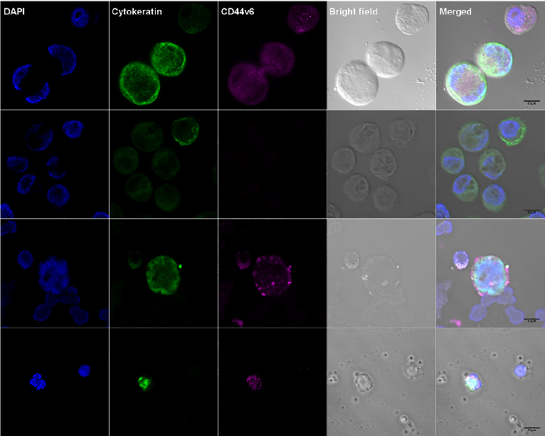
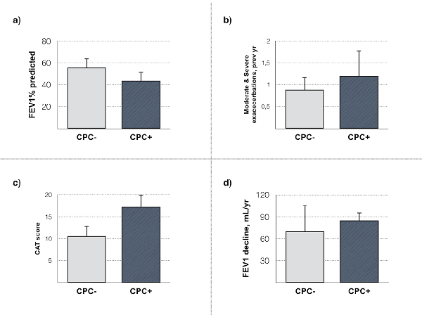
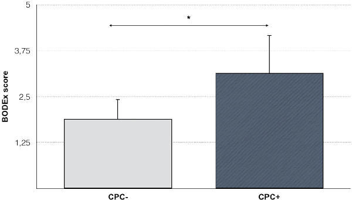

Critical Reviews in Oncology / Hematology 136 (2019) 31–36

Contents lists available at ScienceDirect

# Critical Reviews in Oncology / Hematology

journal homepage: www.elsevier.com/locate/critrevonc

## Liquid biopsy beyond of cancer: Circulating pulmonary cells as biomarkers of COPD aggressivity☆

### T

Pedro J. Romero-Palaciosa, Bernardino Alcázar-Navarretea,b,c,⁎, Juan J. Díaz Mochónd, Diego de Miguel-Pérezd,e, Javier L. López Hidalgof, María del Carmen Garrido-Navasd, Florencio Quero Valenzuelag, José Antonio Lorented,e, María José Serranod,h

- a Medicine Department, Medical School, Universidad de Granada, 18016, Granada, Spain
- b Hospital de Alta Resolución de Loja, Agencia Pública Empresarial Sanitaria Hospital de Poniente, 18199, Loja, Granada, Spain
- c Centro de investigación biomédica en red de enfermedades respiratorias (CIBERES), Spain
- d GENYO- Centro Pfizer - Universidad de Granada - Junta de Andalucía de Genómica e Investigación Oncológica, 18016, Granada, Spain
- e Legal Medicine Department, Medicine School, Universidad de Granada, 18016, Granada, Spain
- f UGC of Pathology, Hospital General Básico de Baza, Baza, 1880, Granada, Spain
- g UGC of Thoracic Surgery, Complejo Hospitalario de Granada, 18012, Granada, Spain
- h UGC of Integral Oncology, Complejo Hospitalario de Granada, 18012, Granada, Spain

#### A R T I C L E I N F O

A B S T R A C T

Background: Pulmonary parenchymal destruction is consequence of Chronic Obstructive Pulmonary Disease (COPD), which results in degradation of the extracellular matrix and the appearance of peripheral pulmonary cells. The aim of this study is to demonstrate the feasibility of the detection and isolation of Circulating Pulmonary Cells (CPCs) in peripheral blood of patients with COPD.

Keywords: COPD Circulating pulmonary cells Emphysema Lung function decline Liquid biopsy

Methods: 17 COPD patients were enrolled in this prospective study to isolate CPCs. Peripheral blood samples for CPC analysis were processed using positive immunomagnetic methods combined with a double immunocytochemistry. Two antibodies, anti-cytokeratin and anti-CD44v6 were used to confirm the epithelial nature of the isolated cells and their lung origin respectively.

Results: CK/CD44v6 positive CPCs were identified in 6 of 17 COPD patients (35.2% of the total) (range: 1–2 cells). No CPCs were detected in any of the 10 healthy volunteers. The COPD CPCs + patients showed a trend towards greater severity of the disease.

Conclusions: This study suggest the feasibility to detect CPCs in peripheral blood of patients with COPD and its potential use as prognostic marker.

- 1. Introduction

Chronic Obstructive Pulmonary Disease (COPD) is one of the most prevalent respiratory diseases, with the highest morbidity and mortality worldwide. It is the third leading cause of death, only behind cardiovascular disease and cancer (Vos et al., 2015), and affects approximately 10% of the adult population in developed countries (Lamprecht et al., 2015; Rabe and Watz, 2017). In addition, a high proportion of

patients are undiagnosed or not adequately treated for their disease (Jones et al., 2014).

COPD is characterized by a progressive loss of lung function mainly as a consequence of exposure to tobacco smoke (Vogelmeier et al., 2017), and is the physiological translation of inflammatory and immune processes [6, (Brusselle et al., 2011), which lead to destruction of alveolar units, loss of small airways (McDonough et al., 2011). and peribronchial fibrosis characteristic of this disease (Hogg et al., 2004).

Abbreviations: BMI, Body Mass Index; BODEx, body mass index, obstruction, dyspnea and severe exacerbations score; CAT, COPD Assesment Test; CK, cytokeratin; COPD, Chronic Obstructive Pulmonary Disease; CPC, circulating pulmonary cell; CTC, circulating tumoral cell; FEV1, forced espiratory volume in the first second; FVC, forced vital capacity; GOLD, Global Obstructive Lung Disease Initiative; mMRC, modified Medical Research Council scale

☆ With the support of International Society of Liquid Biopsy (ISLB).

⁎ Corresponding author at: Medicine Department, Medical School, Universidad de Granada, Avda. de la Investigación, 11, 18016, Granada, Spain.

E-mail addresses: pjromero@ugr.es (P.J. Romero-Palacios), balcazarnavarrete@gmail.com (B. Alcázar-Navarrete), jjdugr@gmail.com (J.J. Díaz Mochón), diego.miguel@genyo.es (D. de Miguel-Pérez), jalohi1966@gmail.com (J.L. López Hidalgo), carmen.garrido@genyo.es (M.d.C. Garrido-Navas), florencioquero@msn.com (F. Quero Valenzuela), jlorente@ugr.es (J.A. Lorente), mjose.serrano@genyo.es (M.J. Serrano).

https://doi.org/10.1016/j.critrevonc.2019.02.003 Received 2 December 2018; Accepted 6 February 2019

1040-8428/ © 2019 Elsevier B.V. All rights reserved.

Fig. 1. Immunofluorescent and cytomorphological characterization of H820 cells, PC3 cells and CPCs from COPD patients. Columns show signal for (blue) 4′,6-Diamidino-2Phenylindole, Dilactate (DAPI) for nucleic acid (nuclear) staining, (green) cytokeratin-FITC expression, (reddish purple) CD44v6-Alexa Fluor® 633 expression, (gray) bright field visualization and merged channels. First row represents H820 lung cancer cells, with positive expression of cytokeratin and CD44v6. Second row represents PC3 prostate cancer cells with positive expression of cytokeratin but absence of CD44v6. Third and fourth rows represent isolated CPCs from COPD patients with positive signal for cytokeratin and CD44v6 (For interpretation of the references to colour in this figure legend, the reader is referred to the web version of this article).

Table 1 In vitro recovery rates of CPCs isolation from H820 pulmonary cells cultures.

Nº of H820 cells added Nº of H820 cells collected % of H820 cells collected

|200|90|45,00|
|---|---|---|
|400|150|37,50|
|700|300|42,85|

As a consequence of these processes, elements from the degradation of pulmonary parenchyma, such as extracellular matrix components (Sand et al., 2016) are released into blood circulation.

The loss of pulmonary function that occurs in COPD may vary among patients (Vestbo et al., 2011), and it is possible that pulmonary developmental processes in childhood significantly predispose patients to the degree of disease development (Lange et al., 2015). However, detecting patients who rapidly lose lung function is not feasible, since although there are biomarkers of pulmonary pathological processes neither they have been validated nor they are specific for lung tissue destruction.

In recent years, substantial technological efforts have focused on developing techniques that allow the isolation and identification of cells from different human tissues in peripheral blood. The most important of these cells are CTCs, which have been proposed as one of the most promising biomarkers under the term “liquid biopsy.” CTCs have already shown diagnostic and prognostic utility in the field of oncology (Pantel, 2013). Especially interesting are the advances that have been made by liquid biopsies in the follow-up of patients with lung, colorectal and breast cancers, adding prognostic information (Rosell et al., 2012) and allowing personalized treatment for these patients (Ruibal et al., 2015; Ghatak et al., 2017). Based on the mechanisms involved in the pathogenesis of COPD, it seems plausible that alveolar cells or remnants of these cells may be discharged into the bloodstream and that these cells could be identified in peripheral blood of patients with COPD with liquid biopsy techniques similar to that of CTCs detection.

Table 2 Clinical characteristics of COPD patients included in the study of CPCs isolation.

n = 17

Age (yrs) 689 ± 9,5 Sex M/F (%) 15/2 (889%/ 111%) BMI, kg/m2 27,4 ± 5,0 Smoking history Current smoker, n (%) 5 (278%) Pack- years 46,4 ± 13,3 Pulmonary Function Tests

FEV1, post- BD, L 1,71 ± 1,01 FEV1, post- BD % pred 51,3 ± 24,6 FVC, post- BD %pred 67,8 ± 17,1 Severity of Ariflow Limitation, n (%)

Mild 1 (5,6%) Moderate 8 (471%) Severe/ Very severe 8 (471%) CAT scores 13,0 ± 7,7 mMRC dyspnea scale 2 (1-3) Exacerbation history, prev year Moderate exacerbations, prev yr 0,71 ± 0,7 Severe exacerbations, prev yr 0,29 ± 0,61 GOLD 2017 grades, n (%)

- GOLD A 4 (235%)
- GOLD B 10 (588%)
- GOLD C 1 (5,9%)
- GOLD D 2 (118%) Severity of disease, BODEx index 2 (0-4) FEV1 decline, mL/year 90,8 ± 24,5

Continuous data are shown as mean ± SD or median (interquartile range), and categorical variables as n (%). BMI = Body Mass Index. Post-BD: post bronchodilator test. CAT = COPD Assesment Test. mMRC: modified Medical Research Council scale. BODEx index = BMI, airflow obstruction, dyspnea and severe exacerbations.

The presence of these CPCs should be the final result of lung tissue destruction, involving, consequently, a relapse of epithelial cells to peripheral blood. As in the case of CTCs, which are only present in

Table 3 COPD Characteristics of COPD patients according to the isolation of CPCs.

CPCs-(n = 11) CPCs+(n = 6) p value

Age, yrs 67.6 ± 9.9 70.1 ± 9.6 0.621 Sex, M/F 11/0 4/2 0.041 Smoking history

Current smokers, n (%) 4 (364%) 1 (167%) 0,394 Pack-years 49,4 ± 12,5 40,3 ± 14,8 0,199 FEV1, % pred 55,5 ± 27,3 43,7 ± 18,7 0,364 CAT score 10.6 ± 7.5 17.3 ± 6.5 0.080 Exacerbations, prev year 0.88 ± 0.9 1.2 ± 1.3 0.611 GOLD 2017 grade 0.090 GOLD A- B 10 (90.9%) 4 (66.7%) GOLD C-D 1 (9.1%) 2 (33.3%) Disnea mMRC≥2 4 (36.4%) 5 (83.3%) 0.084 BODEx score ≥ 3 points 5 (45.4%) 4 (66.6%) 0.236

Continuous data are shown as mean ± SD or median (interquartile range), and categorical variables as n (%). CPC+: CPCs isolation; CPC-: no CPCs isolation.

patients with cancer, the isolation of CPCs should only be present in patients with loss of lung parenchyma (such as, but not only, COPD patients) and should not be detected in healthy people. Previous experience from hepatology suggest that this is correct for any epithelialderived circulating cell in healthy donors but not in those with organ tissue destruction (Bhan et al., 2018).

CD44v6 is a hyaluronan receptor that is quite specific cell-marker for lung tissue and has been involved not only in lung cancer (Ruibal et al., 2015) but also in other diseases such as pulmonary fibrosis (Ghatak et al., 2017). CD44v6 is expressed on developing type II pneumocytes of saccular and alveolar stages of the fetal lung and on mature type II pneumocytes after birth (Kasper et al., 1995; Yoo et al., 2005).

Taking all this information into account, we aimed to determine the feasibility of the detection and phenotype characterization of CPCs in peripheral blood in patients with COPD, as prognostic and predictive markers.

- 2. Methods

- 2.1. Cell culture

The H820 lung cancer and PC3 prostate cancer cell lines were obtained from the American Type Culture Collection (ATCC, Manassas,

VA, USA). Cell lines were maintained in RPMI 1640 medium supplemented with 10% fetal bovine serum, 100 U/mL streptomycin at 37 °C in a humidified incubator with 5% CO2.

- 2.2. Study design and population

A cross-sectional observational study involving two pneumology units (Hospital La Inmaculada, Granada and Hospital de Alta Resolución de Loja, Granada) was performed from October 2016 to January 2017. 17 COPD outpatients from both hospitals were included in this proof of concept study. A complete list of inclusion and exclusion criteria is available in Appendix S2.

- 2.3. Characterization of CK and CD44v6 in lung and prostate cell lines and tissues

We tested whether CK and CD44v6 expression could be accurately determined by immunofluorescence in cell lines and tissues. H820 lung cancer cell line and frozen sections of non-tumor lung tissues obtained from three pneumothorax patients were used as specific positive control for pneumocytes CD44v6 expression. Simultaneously, PC3 prostate cancer cell line and prostate tissue were also tested with the same methodology in order to demonstrate the absence of CD44v6 expression

- 2.4. Detection and isolation of tumor cells from peripheral blood

Blood samples from 17 COPD patients were collected in EDTA tubes (Vacutainer, BD Bioscience). H820 cells were then spiked into whole blood and isolated within two hours after extraction by double gradient centrifugation with 1.119 g/mL Ficoll (Histopaque 1119, Sigma Aldrich) and 1.058 g/mL Ficoll, based on Ficoll PM400 at 16% W/V (Sigma Aldrich). Due to the similar density of the 1.058 g/mL Ficoll and blood (approximately 1.060 g/mL), blood must be diluted previously in PBS1X at 19% (4 mL blood/17.3 mL PBS1X) to avoid mixing. First, 10 mL of Ficoll 1119 was placed at the bottom of a 50 mL conical bottom tube; then, 5 mL Ficoll 1058 was carefully pipetted onto the top, followed by the whole diluted blood.

Tubes were centrifuged at 700 × g for 45 min, and then the mononuclear cell phase was recovered between the two Ficoll layers and permeabilized and fixed according to the Carcinoma Cell Enrichment and Detection kit with MACS technology (Miltenyi Biotec, Bergisch Gladbach, Germany). Later, these cells were incubated with a

Fig. 2. COPD characteristics between study participants based on the isolation of CPCs from blood samples. a) Lung function values (expressed as % of predicted). b) Annualized rate of moderate and severe exacerbations in the previous year. c) CAT (COPD Assessment test) scores. d) Lung function decline (expressed as annualized decline in FEV1 in mL/year). Bars represent means and SEM. No statistical significant differences were observed between groups. CPC+: CPCs isolation; CPC-: no CPCs isolation.

Fig. 3. Differences in the BODEx index depending on the isolation of CPCs in blood samples. Bars represent means and SEM. * p < 005. CPC+: CPCs isolation; CPC-: no CPCs isolation.

multi-cytokeratin-specific antibody (CK3-11D5, Miltenyi Biotec) that recognizes cytoplasmic cytokeratins 7, 8, 18 and 19 and later with an FITC-anti-cytokeratin antibody (clone CK3-6H5, Miltenyi Biotec). Finally, cytokeratin-positive cells were collected on MACS Cell Separation magnetic columns (Miltenyi Biotec) and spun down onto poly-lysine-coated glass slides using a cytocentrifuge (Hettich, Germany) at 1500 rpm for 10 min.

Cytokeratin-positive cells were visualized and located using fluorescence microscopy, observing their specific cytoplasmic green signal. Then, samples were incubated with an anti-CD44v6 (exon v6) rabbit polyclonal antibody (AB2080, Merck Millipore) specific for type-II pneumocytes (Yoo et al., 2005), combined with a goat anti-rabbit IgG (H + L) Alexa Fluor 633 secondary antibody (A-21070, Thermo Fisher Scientific), and mounted using VECTASHIELD mounting medium with DAPI (Vector Labs). Finally, slides were visualized with a Zeiss LSM 710 confocal/multiphoton laser scanning microscope.

- 2.5. Analysis of recovery experiments by immunocytochemistry

Venous blood (10 ml) from healthy volunteers were spiked with varying numbers of tumor cells (200, 400, 700 cells) from H820 lung cancer cell line. To detect epithelial cells the samples were processed as described above. After immunomagnetic enrichment of tumor cells, CK/CD44v6 cells were detected by immunocytochemistry (as described above).

- 2.6. Analysis of CPCs in patients and Healthy donors

A total of 10 ml mL of blood was extracted (after discarding the first 3 mL in order to avoid epithelial cell contamination of the epidermis) and subsequently processed at ambient temperature for less than 2 h, avoiding exposure of the samples to natural light from both COPD and healthy volunteer patients and processed as previously explained in the spiking experiments.

- 2.7. Study variables

For each patient, sociodemographic data, toxic habits and concomitant diseases were recorded. All patients underwent postbronchodilator spirometry according to current recommendations (García-Río et al., 2013), completed questionnaires about their respiratory disease (dyspnea measured using the mMRC scale, COPD Assessment Test score) (Jones et al., 2011), and agreed to a multidimensional assessment of disease severity using the BODEx index (Soler-Cataluña et al., 2009), In addition, annualized lung function

decline was recorded for each patient. Finally, the number of CPCs was recorded.

- 2.8. Statistical analysis

Qualitative variables were expressed as absolute and relative frequencies. Quantitative variables that followed a normal distribution (according to results of the Kolmogorov-Smirnov or Shapiro-Wilk test) were reported as Md ± SD (mean, standard deviation) and range (minimum and maximum), and those that did not follow a normal distribution were reported as P50 [P25 - P75] (median, interquartile range). Comparison of quantitative variables was performed by ANOVA for independent samples or the Kruskal-Wallis H test (according to whether or not they follow normal distribution). The level of statistical significance was set at p < 0.05. Statistical analysis was performed with the Statistical Package for Social Sciences package version 20.0 (SPSS Inc., Chicago, IL, USA).

- 2.9. Ethical aspects

The project was approved by the Ethics and Clinical Research Committee of the University of Granada. The principles of the Declaration of Helsinki were observed for human research projects. All participants were informed of the nature of the study and its objectives and granted their participation in the study by signing informed consent documents.

3. Results

- 3.1. Inmunofluorescence and histomorphological characterization of lung and prostate cell lines and tissues

H820 pulmonary cell line showed high expression of CD44v6 while this was absent in PC3 cell line (Fig. 1). In the lung tissue CD44v6 expression was found in the alveolar spaces, corresponding to type II pneumocytes, however the prostate tissue showed no CD44v6 staining (Figure S1). More information of tissue characterization is available in the supplementary material.

- 3.2. Recovery rates of the methodology using H820 pulmonary cell line as a model

Recovery rates using a double density-gradient (Histopaque- 1119 and 1.058 g/mL Ficoll) and positive immunomagnetic enrichment of epithelial cells in our spiking experiments were in the range of 37–42%

in calculations based on the total number of cells recovered. Detection of CK+/CD44v6 cells by immunocytochemistry was carried out as described above. The results of this in vitro determination model for detection of CPCs in whole blood are shown in Table 1.

- 3.3. Determination of CPCs in healthy volunteers

We could not detect CK/CD44v6-expressing cells in any of the samples from healthy donors.

- 3.4. Determination of CPCs in patients with COPD

Seventeen patients with COPD were included in the CPC determination study. The baseline characteristics COPD patients involved in the stuyd are shown in Table 2.

In 6 of the patients (35·29% of the total), the presence of CPCs in peripheral blood was demonstrated, with a detection rate of 1 CPC/106 hematopoietic cells. Fig. 1 shows CPCs from COPD patients. Table 3 shows the characteristics of the patients in whom CPCs were isolated as well as those in whom CPCs were not isolated.

Patients with CPCs showed a tendency toward worse lung function, more moderate and severe exacerbations in the previous year, more intensity of symptoms as measured by the CAT questionnaire, and a greater annualized decline in lung function, although none of these results were statistically significant (Fig. 2). Patients with CPCs in peripheral blood showed a greater severity of the disease as evaluated using the multidimensional BODEx index (Fig. 3).

- 4. Discussion

The results of this study demonstrate for the first time that it is feasible to isolate CPCs in peripheral blood from patients with COPD. CPCs were isolated in more than a third of patients with stable COPD, and patients in whom CPCs isolation was possible had some features of more severe disease. Taking all these results into account, CPCs isolation could be a promising biomarker for pathophysiological processes specific to the lung parenchyma.

COPD is characterized by a progressive loss of lung function due to pulmonary parenchyma and airway alterations (Rennard and Drummond, 2015), and a tool to evaluate a priori which patients are likely to suffer an accelerated loss of pulmonary function leading to incapacity and death has been a matter of recent investigations, some of them with promising results (Guerra et al., 2015; Zemans et al., 2017). Alterations that occur in the lung parenchyma as a consequence of exposure to tobacco smoke and the development of the disease have been previously described (McDonough et al., 2011; Cosio et al., 2009). and biomarkers related to degradation of the extracellular matrix are associated with higher mortality in patients with COPD (Sand et al., 2016; Stolz et al., 2016). However, these biomarkers are not specific enough to lung parenchyma and may reflect other pathological processes in other organs. Our method is based on the detection of loss of lung integrity due the destruction of epithelial lung tissue. The initial processes following injury include, among other factors, epithelial cell spreading to peripheral blood (Crosby and Waters, 2010). According to this, our study proposes the isolation and detection of epithelial cells using epithelial markers, as CK or EpCAM. These results have been observed in other similar studies in which the presence of CTCs in peripheral blood of breast cancer patients was analysed (Gaforio et al., 2003; Cristofanilli et al., 2004) based on CK expression. However, in our study, the interest was focused in epithelial non-tumoral cells, being one of exclusion criteria the absence of tumoral disease. Furthermore, none of the patients included in the study have developed cancer from sample extraction so far. Therefore, with the objective to elucidate the origin of these cells, simultaneously to the use of CK marker, an antibody CD44v6 was included, which it is overexpressed in pneumocytes type II (Kasper et al., 1995; Yoo et al., 2005). The combination of both

antibodies, confirmed the pulmonary origin of these circulating epithelial cells. We did not find simultaneous expression of these markers in white cells. The white cells were identified by nuclear staining and morphology, clearly different to epithelial cells (Fig. 1).

On the other hand, the presence of epithelial cells in peripheral blood have not been reported in physiological conditions, at least in enough amounts to be detected, and our negative controls confirmed the absence of epithelial cells in healthy donors. We were able to detect epithelial cells in patients with COPD instead, especially in patients with severe COPD.

The in vitro model showed that our methodology recovered between 37% and 45% of the CPCs discharged into the blood, so it is possible that some of the patients exhibited false negatives. In fact, despite that our methodology demonstrates the feasibility to detect these CPCs in COPD patients, it is still necessary to improve this method including more markers and automated methodologies to increase isolation rates. Therefore, this first proof of concept could lead to technical developments to improve the diagnostic performance of the test.

To our knowledge, there are no published studies that report the isolation of CPCs in COPD patients. However, this methodology has been used for monitoring of metastatic lung cancer through detection of CTCs as a biomarker in subjects without COPD (Morrow et al., 2016) and with COPD (Ilie et al., 2014).

Our study also has some limitations, the main one being its small sample size, since it is a "proof of concept" study. As a proof of concept, we only aimed to determine the feasibility of the technique in COPD patients, not to determine the outcomes of those patients in whom CPC were isolated. Accordingly, we do not know if those patients in whom CPCs were not isolated in blood were due to a false negative, due to moderate recovery efficiency of the method, or that they did not present CPCs at the time of the study. Other unknown factors are the average lifetime of CPCs within the bloodstream and the temporal stability of the biological signal studied. These findings should be validated in future studies in order to define the usefulness of the isolation of CPCs for the management of COPD.

5. Conclusion

We present a novel finding by a non-invasive, reproducible and easy-to-obtain method: the existence of CPCs in the peripheral blood of patients with COPD. Future studies are necessary to understand the processes that lead to their presence and their diagnostic, prognostic and therapeutic implications.

Disclosures

Dr. Romero-Palacios reports personal fees and non-financial support from GSK, grants, non-financial support from Novartis AG, non-financial support from Boehringer Ingelheim, non-financial support from Chiesi, grants, personal fees and non-financial support from Laboratorios Menarini, personal fees from Esteve, outside the submitted work.

Dr. Alcázar-Navarrete reports personal fees from GSK, grants, personal fees and non-financial support from Novartis AG, personal fees and non-financial support from Boehringer Ingelheim, personal fees and non-financial support from Chiesi, grants, personal fees and nonfinancial support from Laboratorios Menarini, personal fees from Gebro, personal fees from Astra- Zeneca, outside the submitted work.

Dr. Diaz Mochón has nothing to declare Dr. De Miguel Pérez has nothing to declare. Dr. Lopez Hidalgo has nothing to disclose. Dr. Quero Valenzuela has nothing to disclose. Dr. Lorente has nothing to declare. Dr. Serrano Fernandez has nothing to declare

Appendix A. Supplementary data

Supplementary material related to this article can be found, in the online version, at doi:https://doi.org/10.1016/j.critrevonc.2019.02. 003.

References

Bhan, I., Mosesso, K., Goyal, L., et al., 2018. Detection and analysis of circulating epi-

thelial cells in liquid biopsies from patients with liver disease. Gastroenterology 12 (September). https://doi.org/10.1053/j.gastro.2018.09.020. Published Online First.

Brusselle, G.G., Joos, G.F., Bracke, K.R., et al., 2011. New insights into the immunology of chronic obstructive pulmonary disease. Lancet 378, 1015–1026. https://doi.org/10. 1016/S0140-6736(11)60988-4.

Cosio, M.G., Saetta, M., Agusti, A., 2009. Immunologic aspects of chronic obstructive pulmonary disease. N. Engl. J. Med. 360, 2445–2454. https://doi.org/10.1056/ NEJMra0804752.

Cristofanilli, M., Budd, G.T., Ellis, M.J., et al., 2004. Circulating tumor cells, disease progression, and survival in metastatic breast Cancer. N. Engl. J. Med. 351, 781–791. https://doi.org/10.1056/NEJMoa040766.

Crosby, L.M., Waters, C.M., 2010. Epithelial repair mechanisms in the lung. Am. J. Physiol. Lung Cell Mol. Physiol. 298, L715–31. https://doi.org/10.1152/ajplung. 00361.2009.

Gaforio, J.-J., Serrano, M.-J., Sanchez-Rovira, P., et al., 2003. Detection of breast cancer cells in the peripheral blood is positively correlated with estrogen-receptor status and predicts for poor prognosis. Int. J. Cancer 107, 984–990. https://doi.org/10.1002/ijc. 11479.

García-Río, F., Calle, M., Burgos, F., et al., 2013. Espirometría. Arch. Bronconeumol. 49, 388–401. https://doi.org/10.1016/j.arbres.2013.04.001.

Ghatak, S., Markwald, R.R., Hascall, V.C., et al., 2017. Transforming growth factor β1 (TGFβ1) regulates CD44V6 expression and activity through extracellular signalregulated kinase (ERK)-induced EGR1 in pulmonary fibrogenic fibroblasts. J. Biol. Chem. 292, 10465–10489. https://doi.org/10.1074/jbc.M116.752451.

Guerra, S., Halonen, M., Vasquez, M.M., et al., 2015. Relation between circulating CC16 concentrations, lung function, and development of chronic obstructive pulmonary disease across the lifespan: a prospective study. Lancet Respir. Med. 3, 613–620. https://doi.org/10.1016/S2213-2600(15)00196-4.

Hogg, J.C., Chu, F., Utokaparch, S., et al., 2004. The nature of small-airway obstruction in chronic obstructive pulmonary disease. N. Engl. J. Med. 350, 2645–2653. https://doi. org/10.1056/NEJMoa032158.

Ilie, M., Hofman, V., Long-Mira, E., et al., 2014. “Sentinel” circulating tumor cells allow early diagnosis of lung cancer in patients with chronic obstructive pulmonary disease. PLoS One 9, 4–10. https://doi.org/10.1371/journal.pone.0111597.

Jones, P.W., Brusselle, G., Dal Negro, R.W., et al., 2011. Properties of the COPD assessment test in a cross-sectional European study. Eur. Respir. J. 38, 29–35. https://doi. org/10.1183/09031936.00177210.

Jones, R.C.M., Price, D., Ryan, D., et al., 2014. Opportunities to diagnose chronic obstructive pulmonary disease in routine care in the UK: a retrospective study of a clinical cohort. Lancet Respir. Med. 2, 267–276. https://doi.org/10.1016/S22132600(14)70008-6.

Kasper, M., Günthert, U., Dall, P., et al., 1995. Distinct expression patterns of CD44 isoforms during human lung development and in pulmonary fibrosis. Am. J. Respir. Cell

Mol. Biol. 13, 648–656. https://doi.org/10.1165/ajrcmb.13.6.7576702.

Lamprecht, B., Soriano, J.B., Studnicka, M., et al., 2015. Determinants of underdiagnosis of COPD in national and international surveys. Chest 148, 971–985. https://doi.org/ 10.1378/chest.14-2535.

Lange, P., Celli, B., Agustí, A., et al., 2015. Lung-function trajectories leading to chronic obstructive pulmonary disease. N. Engl. J. Med. 373, 111–122. https://doi.org/10. 1056/NEJMoa1411532.

McDonough, J.E., Yuan, R., Suzuki, M., et al., 2011. Small-airway obstruction and emphysema in chronic obstructive pulmonary disease. N. Engl. J. Med. 365, 1567–1575. https://doi.org/10.1056/NEJMoa1106955.

Morrow, C.J., Trapani, F., Metcalf, R.L., et al., 2016. Tumourigenic non-small-cell lung cancer mesenchymal circulating tumour cells: a clinical case study. Ann. Oncol. 27, 1155–1160. https://doi.org/10.1093/annonc/mdw122.

Pantel, K., 2013. Tracking tumor resistance using ‘liquid biopsies’. Nat. Med. 19, 676–677. https://doi.org/10.1038/nm.3233. Rabe, K.F., Watz, H., 2017. Chronic obstructive pulmonary disease. Lancet 389, 1931–1940. https://doi.org/10.1016/S0140-6736(17)31222-9.

Rennard, S.I., Drummond, M.B., 2015. Early chronic obstructive pulmonary disease: definition, assessment, and prevention. Lancet 385, 1778–1788. https://doi.org/10. 1016/S0140-6736(15)60647-X.

Rosell, R., Molina, M.A., MJMJ, Serrano, 2012. EGFR mutations in circulating tumour DNA. Lancet Oncol. 13, 971–973. https://doi.org/10.1016/S1470-2045(12)70369-8.

Ruibal, Á, Aguiar, P., Del Río, M.C., et al., 2015. Cell membrane CD44v6 levels in squamous cell carcinoma of the lung: association with high cellular proliferation and high concentrations of EGFR and CD44v5. Int. J. Mol. Sci. 16, 4372–4378. https:// doi.org/10.3390/ijms16034372.

Sand, J.M.B., Leeming, D.J., Byrjalsen, I., et al., 2016. High levels of biomarkers of collagen remodeling are associated with increased mortality in COPD - results from the ECLIPSE study. Respir. Res. 17, 125. https://doi.org/10.1186/s12931-016-0440-6.

Soler-Cataluña, J.J., Martínez-García, M.Á, Sánchez, L.S., et al., 2009. Severe exacerbations and BODE index: two independent risk factors for death in male COPD patients. Respir. Med. 103, 692–699. https://doi.org/10.1016/j.rmed.2008.12.005.

Stolz, D., Leeming, D.J., Edfort Kristensen, J.H., et al., 2016. Systemic biomarkers of collagen and elastin turnover are associated with clinically relevant outcomes in COPD. Chest 151, 47–59. https://doi.org/10.1016/j.chest.2016.08.1440.

Vestbo, J., Edwards, L.D., Scanlon, P.D., et al., 2011. Changes in Forced Expiratory Volume in 1 Second over Time in COPD. N. Engl. J. Med. 365, 1184–1192. https:// doi.org/10.1056/NEJMoa1105482.

Vogelmeier, C.F., Criner, G.J., Martinez, F.J., et al., 2017. Global strategy for the diag-

nosis, management, and prevention of chronic obstructive lung disease 2017 report GOLD executive summary. Am. J. Respir. Crit. Care Med. 195, 557–582. https://doi. org/10.1164/rccm.201701-0218PP.

Vos, T., Barber, R.M., Bell, B., et al., 2015. Global, regional, and national incidence, prevalence, and years lived with disability for 301 acute and chronic diseases and injuries in 188 countries, 1990-2013: a systematic analysis for the Global Burden of Disease Study 2013. Lancet (386), 743–800. https://doi.org/10.1016/S01406736(15)60692-4.

Yoo, S.H., Jung, K.C., Kim, J.H., et al., 2005. Expression patterns of markers for type II pneumocytes in pulmonary sclerosing hemangiomas and fetal lung tissues. Arch. Pathol. Lab. Med. 129, 915–919. https://doi.org/10.1043/1543-2165(2005) 129[915:EPOMFT]2.0.CO;2.

Zemans, R.L., Jacobson, S., Keene, J., et al., 2017. Multiple biomarkers predict disease severity, progression and mortality in COPD. Respir. Res. 18, 117. https://doi.org/10. 1186/s12931-017-0597-7.

