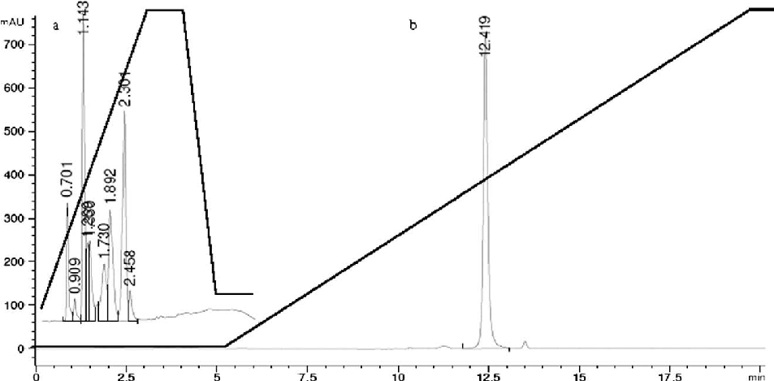

Tetrahedron Letters 49 (2008) 6498–6500

Contents lists available at ScienceDirect

# Tetrahedron Letters

journal homepage: www.elsevier.com/locate/tetlet

## Microwave-assisted orthogonal synthesis of PNA–peptide conjugates

Nina Svensen, Juan José Díaz-Mochón, Mark Bradley*

School of Chemistry, University of Edinburgh, Joseph Black Building, West Mains Road, Edinburgh EH9 3JJ, UK

a r t i c l e i n f o

a b s t r a c t

Article history: Received 22 July 2008 Revised 19 August 2008 Accepted 27 August 2008 Available online 31 August 2008

Microwave heating facilitates peptide nucleic acid synthesis offering a fully automated and efficient synthetic strategy to PNA–peptide conjugates.

2008 Elsevier Ltd. All rights reserved.

Peptide nucleic acids (PNAs) are a DNA/peptide hybrid consisting of an amide backbone with 2-aminoethyl glycine linkages in place of the phosphodiester DNA backbone, upon which the four nucleobases, adenine (A), cytosine (C), guanine (G), and thymine (T) are displayed.1,2 PNA is a wonderful mimic of DNA, to which it hybridizes following the standard Watson–Crick base pairing,3 with the binding affinity and selectivity of PNA toward DNA being stronger and more discriminative than that between DNA/DNA and DNA/RNA due to the absence of electrostatic repulsion (PNA is non-charged).3 Furthermore, PNA is stable over a wide pH range and is resistant to both nucleases and proteases,4 making PNA a molecule of choice for gene therapy applications, and also for high-throughput analysis using PNA microarrays, although these have been little explored.5–9

The orthogonal, solid phase, synthesis of PNA–peptide conjugates using a Dde/Fmoc strategy with Dde/Mmt protected PNA monomers 1–4 (Scheme 1) and Fmoc/tBu protected amino acids has been reported previously,10–13 however, this approach is time consuming and non-automated, limiting wider applications of PNA in chemistry and biology. Here we report an automated orthogonal microwave synthesis of PNA–peptide conjugates, and illustrate this strategy with the synthesis of two specific recep-

tor-based, cellular binding, PNA–encoded peptide ligands, ArgGly-Asp-12-mer-PNA and Arg-Gly-Glu-12-mer-PNA.11,12,13

Resin 5 (Scheme 2) and the PNA monomers 1–4 were synthesized according to previously reported procedures,10 with the sole exception that the coupling of the functionalized nucleobases to the backbone was carried out with solid-supported dicyclohexylcarbodiimide (PS-DCC) rather than conventional DCC.14,15

PNA–peptide synthesis was carried out in an automated CEM peptide synthesizer. Dde-deprotection was carried out under either acidic (20% NH2OH HCl/imidazole 1:0.75 in NMP/DMF 5:1) or more traditional basic conditions (20% NH2OH H2O/imidazole 1:0.75 in NMP/DMF 5:1) under microwave irradiation or at room temperature.16 PNA monomer coupling (see Scheme 2) was mediated using pre-activated monomers (0.22 M Dde-monomer, 5.5 equiv) in DMF, mixed with 0.20 M PyBOP (5 equiv) also in DMF and with NEM (11 equiv) for 1 min and microwave irradiation for 20 min at 60 oC. After PNA monomer coupling the filtrate was collected and unreacted monomers were recovered.17

PNA synthesis with Dde-deprotection under basic conditions (NH2OH H2O/imidazole 1:0.75 in NMP/DMF 5:1) with microwave heating was observed to produce multiple products (see Fig. 1), with the relatively reactive 2-ethylamino groups facilitating acyl

Mmt Mmt

O

- N

- O

NH

NH

N

N

NH

NH N N

N N

N N N

Mmt

O

N O H

O O

O

O

O

O

O

O

Dde Dde Dde Dde

N

N

N

N

N H

OH N H

N H

OH

OH

N H

O H

### 1 2 3 4

Scheme 1. The four PNA building blocks used in this project: (1) Guanine-monomer, (2) Adenine-monomer, (3) Thymine-monomer, (4) Cytosine-monomer.

* Corresponding author. Tel.: +44 131 650 4820; fax: +44 131 650 6453. E-mail address: mark.bradley@ed.ac.uk (M. Bradley).

0040-4039/$ - see front matter 2008 Elsevier Ltd. All rights reserved. doi:10.1016/j.tetlet.2008.08.104

N. Svensen et al./Tetrahedron Letters 49 (2008) 6498–6500 6499

O

O

H N

H N

Fmoc

PNA monomer

Fmoc NH-Rink

N H

NH-Rink

Resin

N H

Resin

a

O

O

b

NH2

6

Dde NH

#### 5

O

O

H N

H N Resin

NH-Rink Fmoc

H2N

Resin

NH-Rink

N H

O

O

Amino acid

c

H N

H N

NH

N

NH

Dde

d

N

Dde

O

7

O

O

8

O

Nucleobase

Nucleobase

O

O Fmoc

O

O

H N

H N

H N

NH-Rink

N H

Resin

Arg-Gly-Xa.a.

NH-Rink

N H

Resin

O

R

O

H N

NH FAM TATC TGTT TCXPNAXPNA NH

N

Dde

9 10

O

O

Nucleobase

Scheme 2. Orthogonal coupling of Dde/Mmt protected PNA monomers and Fmoc/tBu-protected amino acids (a) 20% NH2OH HCl/imidazole 1:0.75 in NMP/DMF 5:1, 1 h at rt or microwave irradiation, 10 min, 60 oC; (b) 5.5 equiv Dde-monomer, 5 equiv PyBOP, and 10 equiv N-ethylmaleimide (NEM) in DMF, microwave irradiation, 20 min, 60 oC; (c) 20% piperidine in DMF, 2 10 min, rt; (d) 5 equiv amino acid, 5 equiv HTBU/HOBt, 10 equiv DIPEA in DMF, microwave irradiation, 20 min, 60 oC. Resin = PEGA (0.04 mmol/g). Xa.a = Asp or Glu. XPNA = A or T. FAM = 5(6)-carboxyfluorescein.

Figure 1. (a) RP-HPLC of PNA-TGTT TCAT synthesized under basic Dde-deprotection conditions (20% NH2OH H2O/imidazole 1:0.75 in NMP/DMF 5:1). Column: Phenomenex Luna, C18, 15 cm 1.00 cm, 5 lm.; k = 220 nm; Buffer A: H2O with 0.1% TFA; Buffer B: CH3CN with 0.1% TFA, eluting with 95% A to 95% B over 3 min; 100% B for 1 min. (b) RPHPLC of Arg-Gly-Glu-12-mer-PNA synthesized under acidic Dde-deprotection conditions (20% NH2OH HCl/imidazole 1:0.75 in NMP/DMF 5:1). Eluting with A for 5 min; 100% A to 100% B over 20 min; 100% B for 5 min.

migration of the nucleobase acetyl moiety to the N-terminal position.10 Under slightly acidic conditions (20% NH2OH HCl/imidazole 1:0.75 in NMP/DMF 5:1), the key advantage of the NH2OH HCl deprotection conditions are highlighted, namely the elimination of this side reaction, which makes PNA synthesis problematic,

while also illustrating its compatibility with microwave heating.

The PNA–peptide conjugate was synthesized using the slightly acidic conditions for Dde removal (20% NH2OH HCl/imidazole 1:0.75 in NMP/DMF 5:1), and Fmoc-deprotection and amino acid

6500 N. Svensen et al./Tetrahedron Letters 49 (2008) 6498–6500

couplings were carried out according to standard literature procedures18 (see Scheme 2). Following Fmoc-synthesis, the peptide was capped with acetic anhydride/pyridine (1:1) for 20 min, before the PNA was capped with 5(6)-carboxyfluorescein. The resin was treated with piperidine to cleave any fluorescein ester dimers. The peptide–PNA conjugates were cleaved from the solid support with TIS/ TFA19 and purified by RP-HPLC (column: Phenomenex Luna, C18, 15 cm 1.00 cm 5 lm). Arg-Gly-Glu–TATC-TGTT-TCTA conjugate 12.42 min, MALDI-TOF m/z calcd for C178H223N69O55 [M]+ 4208.68, found 4206.33. Arg-Gly-Asp–TATC-TGTT-TCAT conjugate 12.37 min, MALDI-TOF: m/z calcd for C177H221N69O55 [M]+ 4194.67, found 4193.04.

Using these acidic Dde-deprotection conditions, the peptidePNA constructs Arg-Gly-Asp–TATC-TGTT-TCAT and Arg-Gly-Asp– TATC-TGTT-TCTA (see Scheme 2, Fig. 1) were synthesized with all PNA and amino acid coupling and deprotection cycles carried out in an automated microwave peptide synthesizer (CEM).

Synthetically difficult PNA-sequences containing multiple polythymine residues10,11 gave rise to single peaks following HPLC analysis (see Fig. 1) with overall isolated yields of 14% and 16% (over 40 steps) for the conjugates Arg-Gly-Asp–TATC-TGTT-TCTA and Arg-Gly-Asp–TATC-TGTT-TCAT, respectively.

Mild thermal effects achieved via microwave heating accelerated PNA synthesis, and allowed the automated synthesis of large PNA–peptide conjugates while improving the synthetic efficacy. This approach achieved PNA synthesis in a manner orthogonal to Fmoc chemistry, and in a way that prevented unwanted PNA side reactions, which suggests Dde-chemistry as the method of choice for PNA synthesis.

Acknowledgment

We thank the EPSRC and the BBSRC for funding.

References and notes

- 1. Nielsen, P. E.; Egholm, M.; Berg, R. H.; Buchardt, O. Science 1991, 254, 1497– 1500.
- 2. Egholm, M.; Buchardt, O.; Nielsen, P. E.; Berg, R. H. J. Am. Chem. Soc. 1992, 114, 1895–1897.
- 3. Egholm, M.; Buchardt, O.; Christensen, L.; Behrens, C.; Freier, S. M.; Driver, D. A.; Berg, R. H.; Kim, S. K.; Nordén, B.; Nielsen, P. E. Nature 1993, 365, 566–568.
- 4. Sazani, P.; Gemignani, F.; Kang, S. H.; Maier, M. A.; Manoharan, M.; Persmark, M.; Bortner, D.; Kole, R. Nat. Biotechnol. 2002, 20, 1228–1233.
- 5. Wang, B.; Siahaan, T.; Soltero, R. A. Drug Delivery—Principles and Applications; John Wiley and Sons, 2005.
- 6. Nielsen, P. E. Curr. Biotechnol. 1999, 10, 71–75.
- 7. Ray, A.; Nordén, B. FASEB J. 2000, 14, 1041–1060.
- 8. Turner, J. J.; Ivanova, G. D.; Verbeure, B.; Williams, D.; Arzumanova, A. A.; Abes, S.; Lebleu, B.; Gait, M. J. Nucleic Acids Res. 2005, 33, 6837–6849.
- 9. Lohse, J.; Dahl, O.; Nielsen, P. E. Proc. Nat. Acad. Sci. U.S.A. 1999, 96, 11804– 11808.
- 10. Nielsen, P. E. Peptide Nucleic Acids: Protocols and Applications; Horizon Bioscience, 2004.
- 11. Díaz-Mochón, J. J.; Bialy, L.; Bradley, M. Org. Lett. 2004, 6, 1127–1129.
- 12. Pouchain, D.; Diaz-Mochon, J. J.; Bialy, L.; Bradley, M. ACS Chem. Biol. 2007, 2, 799–809.
- 13. Bialy, L.; Díaz-Mochón, J. J.; Specker, E.; Keinicke, L.; Bradley, M. Tetrahedron 2005, 61, 8295–8305.
- 14. Weinshenker, N. M.; Shen, C. Tetrahedron Lett. 1972, 13, 3281–3284.
- 15. Lange, U. E. W. Tetrahedron Lett. 2002, 43, 6857–6860.
- 16. 20% NH2OH HCl/imidazole 1:0.75 in NMP/DMF 5:1 (acidic conditions) or 20% NH2OH H2O/imidazole 1:0.75 in NMP/DMF 5:1 (basic conditions) were added to the resin pre-swollen in DMF either under microwave irradiation for 10 min at 60 oC or at room temperature for 1 h.
- 17. The recovered Ade-, Cyt-, and Gua-monomers were precipitated using MeOH/ H2O. Thy was precipitated with DCM/petroleum ether, then by precipitation in EtOAc/hexane, and the resulting yellow precipitate was washed with H2O.
- 18. Amino acid couplings: 0.2 M amino acid (5.5 equiv) in DMF was coupled using 0.22 M HTBU/HOBt (5 equiv) in DMF and DIPEA (11 equiv) in NMP/DMF 1:5 under microwave irradiation for 20 min at 60 oC. Fmoc-deprotection: 2 ml of 20% piperidine in DMF was added to the resin, and the reaction mixture was stirred for 2 10 min at rt.
- 19. Compounds were cleaved from the resin by treatment with 5% TIS in TFA for 2 2 h. The resin was washed with 3 TFA. TFA and TIS were removed under

a stream of N2, and the products were precipitated with diethyl ether and collected by centrifugation.

