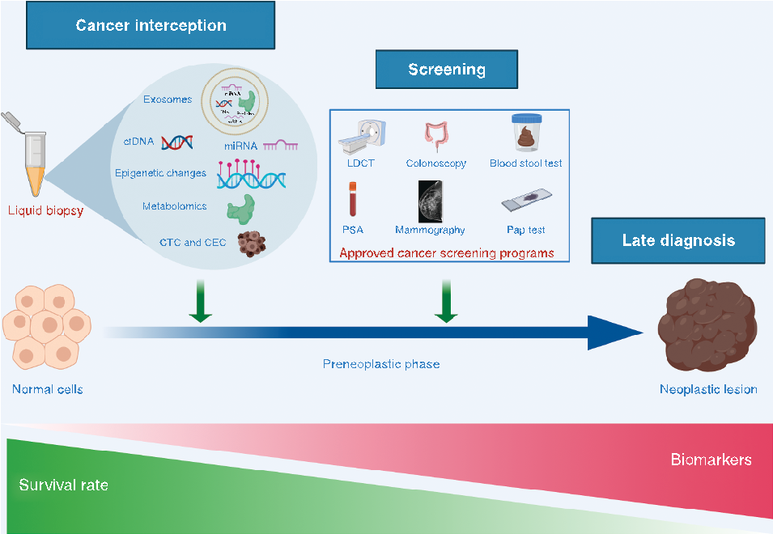
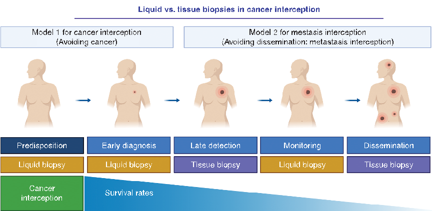

## mini revieW

# Precision Prevention and Cancer Interception: The New Challenges of Liquid Biopsy

Maria Jose Serrano1 , 2 , 3 , Maria Carmen Garrido-Navas1 , Juan Jose Diaz Mochon1 , 4 , 5 , Massimo Cristofanilli6 , Ignacio Gil-Bazo7 , Patrick Pauwels8 , Umberto Malapelle9 , Alessandro Russo10 , Jose A. Lorente1 , 11 , Antonio J. Ruiz-Rodriguez12 , Luis G. Paz-Ares13 , Eduardo Vilar14 , Luis E. Raez15 , Andres F. Cardona16 , 17 , 18 ,

and Christian Rolfo19 on behalf of the International Society of Liquid Biopsy

Downloaded from http://aacrjournals.org/cancerdiscovery/article-pdf/10/11/1635/1816529/1635.pdf by University of Granada user on 03 March 2024

aBstraCt Despite major therapeutic progress, most advanced solid tumors are still incurable.

Cancer interception is the active way to combat cancer onset, and development of this approach within high-risk populations seems a logical fi rst step. Until now, strategies for the identifi cation of high-risk subjects have been based on low-sensitivity and low-specifi city assays. However, new liquid biopsy assays, “the Rosetta Stone of the new biomedicine era,” with the ability to identify circulating biomarkers with unprecedented sensitivity, promise to revolutionize cancer management. This review focuses on novel liquid biopsy approaches and the applications to cancer interception. Cancer interception involves the identifi cation of biomarkers associated with developing cancer, and includes genetic and epigenetic alterations, as well as circulating tumor cells and circulating epithelial cells in individuals at risk, and the implementation of therapeutic strategies to prevent the beginning of cancer and to stop its development. Large prospective studies are needed to confi rm the potential role of liquid biopsy for early detection of precancer lesions and tumors.

### introDuCtion

policies ( 2 ). In 2008, Andermann and colleagues revisited the screening criteria presented by Wilson and Jungner in a report commissioned by the WHO 40 years earlier ( 3, 4 ). They presented 10 new screening criteria. We would like to highlight the following: “(i) The screening program should respond to a recognized need; (ii) there should be a defi ned target population and scientifi c evidence of the screening program effectiveness; (iii) the program should integrate education, testing, clinical services, and program management, along with quality assurance and mechanisms

For decades, interest in cancer management has focused on the control of advanced disease stages. In this framework, management of advanced stages has progressed substantially thanks to the identifi cation of different prognostic and predictive markers ( 1 ). However, these advances have not been fully transferred to prevention and early cancer detection, even though screening for cancer prevention and control are part of the World Health Organization (WHO)–recommended

1 GENYO Centre for Genomics and Oncological Research, Pfi zer/University of Granada/Andalusian Regional Government, PTS Granada, Gra-

Madrid, Spain. 14 Department of Clinical Cancer Prevention, Division of OVP, Cancer Prevention and Population Sciences, The University of Texas MD Anderson Cancer Center, Houston, Texas. 15 Memorial Cancer Institute, Memorial Health Care System, Florida International University, Miami, Florida.16 Clinical and Translational Oncology Group, Clínica del Country, Bogotá, Colombia.17 Foundation for Clinical and Applied Cancer Research –FICMAC, Bogotá, Colombia. 18 Molecular Oncology and Biology Systems Research Group (Fox-G), Universidad El Bosque, Bogotá, Colombia. 19 Thoracic Oncology & Experimental Therapeutics Program, Greenebaum Comprehensive Cancer Center, University of Maryland School of Medicine, Baltimore, Maryland.

- nada, Spain. 2 Bio-Health Research Institute (Instituto de Investigación Biosanitaria ibs. GRANADA), Hospital Universitario Virgen de las Nieves Granada, Department of Medical Oncology, University of Granada, Gra-
- nada, Spain. 3 Department of Pathological Anatomy, Faculty of Medicine, Campus de Ciencias de la Salud, University of Granada, Granada, Spain.
- 4 DestiNA Genomica S.L. Parque Tecnológico Ciencias de la Salud (PTS), Armilla, Granada, Spain. 5 Department of Medicinal and Organic Chemistry, School of Pharmacy, University of Granada, Granada, Spain. 6 Department of Medicine, Division of Hematology and Oncology, Robert H. Lurie Comprehensive Cancer Center, Feinberg School of Medicine, Northwestern University, Chicago, Illinois. 7 Department of Oncology, Clínica Universidad de Navarra, Pamplona, Spain. 8 Department of Pathology, University Hospital Antwerp, Belgium & Center for Oncological Research (CORE), Antwerp University, Belgium. 9 Department of Public Health, University of Naples “Federico II,” Naples, Italy. 10 Medical Oncology Unit, A.O. Papardo, Messina, Italy. 11 Laboratory of Genetic Identifi cation, Department of Legal Medicine, University of Granada, Granada, Spain. 12 Unit of gastroenterology and hepatology, University Hospital Clínico San Cecilio, Granada, Spain. 13 Division of Medical Oncology, University Hospital 12 de Octubre,

Corresponding Authors: Christian Rolfo, University of Maryland, 22 South Greene Street, Baltimore, MD 21201. Phone: 410-328-7904; Fax: 410328-9160; E-mail: christian.rolfo@umm.edu ; and Maria Jose Serrano, University of Granada, Avenida de la Ilustración 114, Granada 18016, Spain. Phone: 349-5871-5500; E-mail: mjose.serrano@genyo.es

Cancer Discov 2020;10:1635–44 doi: 10.1158/2159-8290.CD-20-0466 ©2020 American Association for Cancer Research.

#### Cancer interception

Screening

miRNA

Exosomes

DNA Proteins

mRNA

cfDNA miRNA

Blood stool test

LDCT Colonoscopy

Epigenetic changes

Metabolomics

Liquid biopsy

Pap test

PSA Mammography

Late diagnosis

CTC and CEC

Downloaded from http://aacrjournals.org/cancerdiscovery/article-pdf/10/11/1635/1816529/1635.pdf by University of Granada user on 03 March 2024

Approved cancer screening programs

Preneoplastic phase

Normal cells

Neoplastic lesion

Biomarkers

Survival rate

Figure 1. Potential role of liquid biopsies in cancer interception. The large family of liquid biopsies includes several different circulating biomarkers: cfDNA, miRNAs, epigenetic changes (e.g., aberrant promoter gene methylation, metabolomics, CTCs, and CECs). Depending on tissue origin, CECs can be further defined as CPCs or circulating colon cells (CCC). PSA, prostate-specific antigen. Image created with BioRender.

to stop cancer onset (6). To fully accomplish integrated CI approaches, we need to develop novel minimally invasive tests that can identify specific molecules involved in precancers. LB plays a key role in this context, and this review describes its use in CI. We will primarily analyze advancements in CI research through discussion of recent discoveries made in lung and colon precancers (Fig. 1).

to minimize potential risks of screening; (iv) it should ensure informed choice, confidentiality and respect for autonomy; and (v) promote equity and access to screening for the entire target population.” In this context, screening programs based on liquid biopsy (LB) tests for healthy and high-risk individuals could fulfill most of the new screening criteria.

According to the NCI Dictionary of Cancer Terms, LB is “a test done on a sample of blood to look for cancer cells from a tumor that are circulating in the blood or for pieces of DNA from tumor cells that are in the blood” (https://www.cancer. gov/publications/dictionaries/cancer-terms/def/liquidbiopsy). This definition is quite imperfect for two reasons: (i) it does not include other molecules and macrostructures, such as RNA and extracellular vesicles, which are also present in blood and can act as biomarkers, and (ii) LB tests should also be able to identify premalignant lesions that are often precursors for malignancy (5). Taken together, this definition restricts the use of liquid biopsies to cancer diagnoses and would not be applicable within the context of cancer interception (CI).

### From the Lens oF CoPD to Lung CanCer

Chronic obstructive pulmonary disease (COPD) is a chronic inflammatory disorder that constitutes the third leading cause of death worldwide (7). These data are relevant, not only because COPD remains an important public health problem, but also because its presence is associated with an increased lung cancer incidence, even after correction for cumulative tobacco exposure–associated risk (8).

Although COPD pathogenesis remains unclear, we do know that it involves deregulated immune function (9). COPD is characterized by a progressive loss of lung function accompanied by inflammatory and immune processes, leading to common disease characteristics like alveolar unit destruction, loss of small airways, and peribronchial fibrosis (7).

The concept of CI involves both the identification of individuals at risk of cancer based on specific biological pathways, and the development of therapies against these pathways

cancer at baseline, arguing against its value as a screening tool. However, a not-negligible proportion of patients (11.7%) have sentinel CTCs (i.e., are cancer-free, have positive CTC detection at baseline, and subsequently develop lung cancer; ref. 14), suggesting that an integrated approach that includes clinical, biological, and radiologic signatures might be the key for success.

The interplay between the immune system and lung cancer development is complex, but evidence suggests that chronic airway inflammation influences the lung microenvironment to facilitate cancer initiation and progression (10).

Despite widespread knowledge of an interaction between COPD and lung cancer, few advances have been made with regard to the determination of diagnostic biomarkers associated with lung cancer initiation and progression starting from COPD. Currently, the only effective screening method for lung cancer, recommended by the US Preventive Services Task Force (USPSTF), is low-dose CT (LDCT). However, this method requires traditional tissue biopsy to confirm the characteristics of nodules observed by CT scan (11). New LB approaches offer the ability to monitor disease and, therefore, the evolution of high-risk patients, in real time with a noninvasive method.

Other research groups have used LBs in patients with COPD, but only for stratification rather than cancer risk prediction (15). For instance, circulating endothelial progenitor cells (EPC) and circulating epithelial cells (CEC) in combination with CT scans have been proposed for risk stratification in patients with COPD (16). In a similar study, Romero and colleagues (17) detected the presence of circulating pulmonary cells (CPC) in the peripheral blood of 17 patients with COPD. Patients with CPCs showed a trend toward worse lung function, more moderate and severe exacerbations in the previous year, increased symptom intensity as measured by the COPD Assessment Test (CAT) questionnaire, and greater annualized decline in lung function. In addition, patients with CPCs in peripheral blood showed greater severity of the disease as evaluated using the multidimensional body mass index, airflow obstruction, dyspnea, and exercise capacity with the 6-minute walk test (BODEx) index. These results suggest that CPCs could represent a monitoring tool for patients with COPD and for early lung cancer detection (17), although further studies in larger populations are needed.

Downloaded from http://aacrjournals.org/cancerdiscovery/article-pdf/10/11/1635/1816529/1635.pdf by University of Granada user on 03 March 2024

Liquid biopsies based on either circulating tumor DNA (ctDNA) or circulating tumor cells (CTC) are currently used as predictive and prognostic tools in metastatic lung cancer (12). CTCs are shed into the vasculature from tumor mass and may be responsible for subsequent growth of additional tumors (metastasis) in distant organs. They have been detected in various solid tumors including lung and colorectal cancers. In fact, it is accepted that CTCs are the initiating factor of metastatic relapse, and their presence identifies patients with a higher risk of developing metastasis (5). However, the complex biological processes enabling CTCs to survive and disseminate are not yet well understood, and little is known about the cellular and genetic events involved in both the metastatic initiation and progression. In fact, the ability of CTCs to survive is conditioned by the relationship between tumor cells and the surrounding microenvironment. During the metastatic process, interactions between tumor cells and the immune system lead to the development of CTC clusters or microemboli (composed of CTCs, leukocytes, cancer-associated fibroblasts, endothelial cells, and platelets) that facilitate CTC survival and migration.

Likewise, circulating miRNA profiles have been used to assess both patients with COPD and patients with lung cancer. Wozniak and colleagues (18) analyzed plasma miRNA profiles in patients with stage I to IIIA lung cancer as well as a control group and found 24 miRNAs differently expressed between the two groups. In another study, levels of miR944 and miR3662 were at least 4-fold higher in patients with non–small cell lung cancer (NSCLC) compared with healthy controls (19). A large retrospective study (n = 939) evaluated the diagnostic performance of a noninvasive plasma miRNA signature classifier (MSC) in samples collected from smokers enrolled in the randomized Multicenter Italian Lung Detection (MILD) trial (20). The results of this study showed that MSC has predictive, diagnostic, and prognostic values and could considerably reduce the false-positive rate of LDCT, improving the efficacy of lung cancer screening (20). Similarly, a second serum miRNA signature (miR-Test) was evaluated in high-risk individuals (n = 1,115) enrolled in the Continuous Observation of Smoking Subjects (COSMOS) lung cancer screening program, which showed an overall accuracy, sensitivity, and specificity of 74.9%, 77.8%, and 74.8%, respectively, and an area under the curve of 0.85. The miR-Test was associated with a 4-fold reduction of LDCT false-positive rate (21). The two signatures displayed an overlap of five miRNAs (38.5%) and are under current evaluation in independent screening trials (NCT02247453 and COSMOS II). Although traditional biomarkers such as circulating cells, DNA, and RNA were used in the reports mentioned above, another research group has proposed a more radical approach. They analyzed immune cells in precancerous lung lesions to provide a novel insight to both identify individuals who are “incubating” lung cancer as well as intercept the disease onset (22). They analyzed the risk to develop cancer in patients with

However, these assays are not broadly applied to patients with COPD, who show high risk for lung cancer development. In this particular population, LBs offer important advantages compared with tissue biopsies, including lower costs and fewer risks.

Very few studies have examined patients with COPD without clinically detectable lung cancer to find circulating biomarkers for early lung cancer diagnosis. In 2014, a pioneering study isolated CTCs from patients with COPD and could identify patients at risk of developing lung cancer who were still associated with normal CT findings (13). However, these promising results were not confirmed in the prospective AIR study that explored the role of CTCs as a lung cancer screening tool in a cohort of 614 asymptomatic patients at high risk for lung cancer (smokers and former smokers with a smoking history of ≥30 pack-years and quit ≤15 years, age ≥55 years, with COPD) undergoing LDCT. The study failed to prove reliability of the isolation by size of tumor cells (ISET) technique for lung cancer screening, characterization of pulmonary nodules, or prediction of the occurrence of lung cancer (14). These results suggest that the one-dimensional approach to lung cancer screening is not adequate, due to the very low sensitivity of CTC detection for identifying lung

LB to detect prognostic and predictive biomarkers has been demonstrated (28, 29). Nevertheless, the use of LB as a screening tool for precancers is debated even if the interest for this application has increased.

bronchial premalignant lesions (PML), using RNA sequencing on the endobronchial biopsies from high-risk smokers. Four different molecular subtypes of PML associated with clinical phenotypes and biological processes were identified. Among these, the proliferative subtype showed a specific characteristic associated with the progression to cancer: bronchial dysplasia, high basal cell and low ciliated cell signals, and expression of proliferation-associated pathways. In addition, the genes involved in IFN signaling and T cell–mediated immunity were downregulated in this subtype, and a decrease in both innate and adaptive immunity was observed (22). The results of this study show that the use of immunoprevention strategies can be useful to intercept the progression of PMLs to lung cancer (22).

At the 2018 American Society of Clinical Oncology meeting, Tsai and colleagues presented a study (30) that used the CellMax biomimetic platform (CMx) to analyze the presence of CTCs in 620 Taiwanese individuals (182 healthy donors, 111 patients with precancerous lesions, and 327 patients with stage I–IV cancer). Whole blood samples were passed through a microfluidic anti-EPCAM antibody-coated biochip. The results were compared with a standard clinical protocol that included both colonoscopy and biopsy, and showed that the test accuracy varied with different disease stages. For precancerous lesions, the test provided 77% sensitivity and >97% specificity, suggesting a low probability of false-positive results. Previously, Pantel and colleagues

The attractiveness of CI in lung cancer has resulted in significant investments in this field. A clear example is the $10 million that Spira’s group received from Janssen Research & Development to work on CI and COPD. Similar work is under development by Lecia V. Sequist and Maximilian Diehn, the leaders of SU2C-LUNGevity-ALA Lung Cancer Interception Research team. This group is working on the development and clinical application of a CTC chip in a lung cancer interception assay (LCIA). The test will analyze CTCs and ctDNA, which in conjunction with LDCT will provide a way to detect lung cancer at earlier time points.

Downloaded from http://aacrjournals.org/cancerdiscovery/article-pdf/10/11/1635/1816529/1635.pdf by University of Granada user on 03 March 2024

- (31) published a similar study that analyzed the presence of CECs in 53 patients with nontumoral colon diseases. Blood samples were analyzed using two different methods: the epithelial immunospot (EPISPOT) assay and the CellSearch system. CEC presence was detected by both assays at different percentages (18.9% and 11.3% in EPISPOT and CellSearch, respectively) in the patient samples, whereas CECs were not detected in healthy donors. Interestingly, the positive samples for CECs were associated with diverticulosis and Crohn’s disease, both of which increase the risk for colorectal cancer. Other LBs, based on cytologic analysis, also evaluated tumorderived endothelial cells. Cima and colleagues (32) isolated and identified clusters from peripheral blood of patients with colorectal cancer with both epithelial and mesenchymal characteristics that expressed endothelial markers. Using a series of biochemical, genetic, and in vivo methodologies, they determined that these clusters were comprised of tumor-derived endothelial cells and were not cancerous. Isolation and enumeration of these benign clusters distinguished healthy volunteers from treatment-naïve as well as pathologic early-stage (≤IIA) patients with colorectal cancer with high accuracy, suggesting that tumor-derived circulating endothelial cell clusters could be used as a means of noninvasive screening for colorectal cancer.

Although these studies are important and champion the use of LB as an effective screening tool, they present important limitations. These shortcomings are based on the origin and biology of CECs, because their presence in the blood circulation can be due to a physiologic peeling of the normal epithelial tissue during regeneration processes (31). Therefore, the identification of both CECs and their genetic characterization is essential. Another issue that limits the utility of LB based on cytologic analyses is the sensitivity and specificity of molecular technologies to analyze single cells from a small sample, with several detected mutations that may be technical artifacts due to the use of amplification methods

- (32). In conclusion, these results indicate that patients with benign inflammatory colon diseases can harbor viable circulating epithelial or endothelial cells that are detectable with current methodologies. This finding points to the need for further molecular characterization of circulating dysplastic and cancer cells and has important implications for the use of noninvasive screening testing.

Taken together, these studies shed light on the use of LBs in lung CI. However, more powerful studies are necessary to discover which types of blood biomarker will offer enough sensitivity and specificity to identify individuals at high risk of cancer as early as possible. We believe that this is the onset of a new approach in disease management.

### From aDenomatous PoLyPs to CoLon CanCer

Colorectal cancer remains one of the leading causes of cancer-related morbidity and mortality worldwide (23). It is generally accepted that the majority of colorectal cancers arise from precursor adenomatous polyps (24). Premalignant adenomatous polyps and stage I colorectal cancer, which are often asymptomatic, are curable. This provides the rationale for population screening of asymptomatic adults ages 45 to 50 years to detect early and prevent colorectal cancer development (25). Different test options for colorectal cancer screening are available, including colonoscopy and stool-based tests

- (26). However, despite their recognized effectiveness in reducing colorectal cancer mortality and the implementation of them at the population level, they have important limitations. Colonoscopies are expensive, invasive, and unpleasant for the patient, contributing to suboptimal patient compliance (26). In addition, false-positive rates are high and sensitivity for precancers, known as advanced adenomas, is limited
- (27). Stool-based tests have low specificity, because the presence of blood in stool may also indicate other conditions (27). Therefore, the identification of new noninvasive and specific tests that we can implement as screening methods continues to be an unmet need. This is especially important for at-risk populations, including patients with inflammatory bowel disease or hereditary colorectal cancer syndromes, to detect tumor presence in very early and asymptomatic stages when it is still curable (27). In colorectal cancer, the potential of

benign mutations caused by CH from pathologic mutation in cfDNA (40). A matched cfDNA–white blood cell sequencing approach has been recently shown to allow an accurate variant interpretation and CH mutation filtering (41).

Another potential approach is to use miRNA panels to identify individuals with premalignant lesions. Recently, a panel of 6 miRNAs to discriminate patients with colorectal cancer and advanced adenomas from healthy individuals was evaluated in 100 healthy volunteers, 101 individuals diagnosed with advanced adenomas, and 96 patients with colorectal cancer. The study reported a sensitivity rate of 0.85 and specificity rate of 0.90, a positive predictive value of 0.94, and a negative predictive value of 0.76 when patients with colorectal cancer and advanced adenomas were compared with healthy individuals (33).

Spontaneous mutations occur in human cells throughout a lifetime, and the accumulation of somatic mutations can progressively cause aging and cancer. A study of 26,136 cancerfree individuals (42) showed that the frequency of somatic mutations increases with age, from 0.23% in people <50 years to 1.91% in those >75 years. Thus, mosaicism in peripheral blood increases from 2% to 3% in the elderly population. Furthermore, studies also reported mutations in individuals who remained cancer-free. For instance, TP53 and KRAS mutations have been detected in healthy volunteers (43). TP53 mutations have been reported in 11% of healthy subjects (44), a finding also described by GRAIL Inc. GRAIL has launched The Circulating Cell-free Genome Atlas Study (CCGA), a prospective, observational, longitudinal clinical trial (NCT02889978) that involves 15,000 participants. The cfDNA of these participants will be analyzed by NGS, including a novel methylation technology. On top of that, machine-learning algorithms that can detect early stages of cancer and also infer the tumor location will analyze the data. Preliminary data have been recently published, demonstrating the potential of a methylation targeted sequencing (45). The study included 6,689 participants (2,482 patients with cancer with >50 cancer types and 4,207 noncancer subjects), divided into training and validation sets, with consistent specificity and sensitivity in both groups. Sensitivity increased with disease stage, ranging from 39% (CI: 27% to 52%) in stage I to 69% (CI: 56%–80%) in stage II, 83% (CI: 75%–90%) in stage III, and 92% (CI: 86%–96%) in stage IV in 12 prespecified cancer types (anus, bladder, colon/rectum, esophagus, head and neck, liver/bile duct, lung, lymphoma, ovary, pancreas, plasma cell neoplasm, stomach). Furthermore, a classifier was developed and validated for cancer detection and tissue of origin (TOO) localization. TOO was predicted in 96% of samples with cancer-like signal, with a TOO localization accurate in 93% of the cases (45).

### the sPeCiaL Case oF ctDna in Ci anD earLy DeteCtion

Downloaded from http://aacrjournals.org/cancerdiscovery/article-pdf/10/11/1635/1816529/1635.pdf by University of Granada user on 03 March 2024

LB offers another attractive possibility to improve cancer detection and compliance of the implementation of diagnostic tests that exploits analysis of noninvasive tests. The analysis of cell-free DNA (cfDNA) is currently the most promising alternative in this field. ctDNA is tumor-derived DNA that it is composed of small fragments of nucleic acid that are not associated with cells or cell fragments, and it is protected from blood nucleases by histones (34, 35). Tumor cells (including CTCs) release fragmented DNA into the circulation as a consequence of apoptosis and necrosis, and in patients with cancer, the fraction of cfDNA that originates from tumor cells (ctDNA) carries tumor-related alterations, which can be detected with next-generation sequencing (NGS) and PCR-based methodologies (36). Analysis of cfDNA (or ctDNA) is cost-effective and minimally invasive, and tailoring the analysis toward the detection of tumor-specific mutations or even cfDNA levels and integrity can enhance its specificity. For instance, a study evaluating the diagnostic value of cfDNA levels in 60 patients with NSCLC and 40 patients with COPD reported an accuracy rate of 92.1% for long cfDNA fragments and 83.6% for short cfDNA fragments to identify patients with lung cancer (37). Standardized (pre) analytic workflows are essential in the context of cfDNA analysis, especially in the context of cancer interception and screening (38).

Different ctDNA analysis platforms have been designed as cancer detection tools, and the two most prominent examples are the targeted error correction sequencing (TEC-Seq) and CancerSEEK multiplex PCR (mPCR) assays. The former is an NGS platform that uses an 81 kbp capture-hybridization enrichment technology and error control strategies to detect low-frequency mutations, whereas the latter incorporates NGS of cfDNA plus protein biomarker information through a noninvasive early cancer detection platform (46). Using the TEC-Seq platform in 200 patients with different stage I to II solid tumors (colorectal, breast, lung, or ovarian cancer), Phallen and colleagues showed the presence of cfDNA somatic mutations in 71%, 59%, 59%, and 68% of the cases, respectively, with high concordance between liquid and tumor biopsy. Conversely, no alterations in driver genes related to solid cancers were identified in 44 asymptomatic individuals, with genomic changes related to CH in 16% of the cases (47). One of the limitations of cfDNA analysis for early cancer detection is the absence of detectable ctDNA levels even with high-sensitivity methods. Therefore, CancerSEEK was developed to utilize combined assays for genetic alterations and protein biomarkers that are differentially

The analysis of ctDNA for early diagnosis involves the use of ultra-deep sequencing of DNA fragments isolated from plasma or serum to identify characteristic mutations of malignant cells. It is widely accepted that the presence of these mutations remains unique to cancer and unlikely to be found in the plasma of healthy individuals. However, in a recent study, Genovese and colleagues sequenced the cfDNA of 12,380 individuals, unselected for cancer or hematologic phenotypes, for mutations, with follow-ups for 2 to 7 years (39). The results of this work showed clonal hematopoiesis (CH) with somatic mutations present in 10% of individuals >65 years but in only 1% of those <50. Interestingly, 42% of subjects who developed cancer showed CH with somatic mutations at the time of blood sampling, at least 6 months prior to first diagnosis. However, some of the mutations found in patients were also present in healthy individuals, suggesting that not all the mutations detected in cfDNA are associated with a risk of developing cancer. In fact, the main obstacle to improving method sensitivity includes the limited number of recurrent mutations that can distinguish

tion marker, cg10673833, could yield high sensitivity (89.7%) and specificity (86.8%) for detection of colorectal cancer and precancerous lesions in a high-risk population of 1,493 participants from a prospective cohort study (53). In contrast, Mouliere and colleagues focused on the biological properties of cfDNA and not on genomic alterations (54), combining cfDNA fragment size analysis and detection of somatic copynumber alterations with a nonlinear classification algorithm to discriminate between samples from patients with cancer and those from healthy individuals. The results of this study showed that different cfDNA sizes might reflect distinct biological processes, as a 167-bp ctDNA fragment would derive from apoptosis or maturation/turnover of blood cells, whereas a 145-bp fragment would reflect cfDNA released during cell proliferation. Cristiano and colleagues also analyzed the biological and structural properties of cfDNA (55). This group developed an approach to detect a large number of abnormalities in cfDNA by genome-wide analysis of fragmentation patterns for early interception (DELFI). This method is based on low-coverage whole-genome sequencing of isolated cfDNA, and mapped sequences were analyzed in nonoverlapping windows that covered the genome. This study included 236 patients with different solid tumors and 245 healthy individuals and showed that profiles of healthy individuals reflect nucleosomal peripheral blood mononuclear cells, whereas patients with cancer have altered fragmentation profiles that result from mixtures of nucleosomal DNA from both blood and neoplastic cells.

expressed between patients with cancer and healthy individuals. CancerSEEK was evaluated in 1,005 patients with stage I to III cancers of eight common tumor types (ovary, liver, stomach, pancreas, esophagus, colorectum, lung, and breast). CancerSEEK tests were positive in a median of 70%, with sensitivity range of 69% to 98% for the detection of five cancer types (ovary, liver, stomach, pancreas, and esophagus) for which there are no screening tests available, and a specificity of >99% (48). However, current technologies have technical and physical constraints; for example, use of ctDNA for small NSCLCs (<2 cm; T1a–T1b) will limit the detection of mutations present at a low mutant allele fraction (<0.1%; ref. 46). The use of integrated approaches might considerably improve LB sensitivity for cancer screening (49). For instance, a multicancer blood test, called DETECT-A, combined with PET-CT was recently shown to increase the chance of intent-to-cure surgery in some patients with positive blood tests (50). Furthermore, machine learning approaches have been described in the context of early cancer detection with promising results. Recently, Chabon and colleagues reported the development and prospective validation of a machinelearning method termed “lung cancer likelihood in plasma” (Lung-CLiP), which can robustly discriminate patients with early-stage lung cancer from risk-matched controls, integrating different molecular features in ctDNA (51).

Downloaded from http://aacrjournals.org/cancerdiscovery/article-pdf/10/11/1635/1816529/1635.pdf by University of Granada user on 03 March 2024

Several groups are also studying new approaches to use ctDNA as a cancer screening tool. Plasma cfDNA methylation patterns for interception and classification of early-stage cancer have been evaluated, examining the detection probability across varying numbers of differentially methylated regions (DMR), coverage, and ctDNA abundance (52). Improved sensitivity was found as the number of DMRs increased, even at lower sequencing depth and ctDNA abundance, suggesting that the recovery of cancer-specific DNA methylation changes could enable highly sensitive and low-cost detection, classification, and monitoring of cancer. Interestingly, the work included the methylation analyses of peripheral blood mononuclear cells (PBMC), checking the methylation status of these regions in the tumor tissue compared with PBMCs using data from The Cancer Genome Atlas for each cancer type. For pancreatic ductal adenocarcinoma, in-house methylation data generated for the matched patients (cfDNA and tissue DNA) were used, showing that these regions were hypermethylated in tumor tissue. This finding reinforces the hypothesis that plasma cell-free DMR is a direct measurement of tumor-derived DNA (that is, ctDNA) and that the cfDNA methylation profile provides a basis for noninvasive, costeffective, sensitive, and accurate early tumor detection for CI, as well as multicancer classification. The utility of cfDNA methylation markers for colorectal cancer surveillance and CpG markers to screen for colorectal cancer were recently evaluated. A diagnostic model (cd-score) using nine selected cfDNA methylation markers was developed and accurately discriminated patients with colorectal cancer from healthy individuals, with sensitivity and specificity superior to those of the standard carcinoembryonic antigen (CEA) test. In addition, a prognostic prediction model (cp-score) was constructed with another five-marker panel that could effectively distinguish patients with colorectal cancer who have different prognoses. Finally, they found that a single ctDNA methyla-

In addition to analyses of genetic abnormalities, epigenetic biomarker analyses on cfDNA also remain an important focus of interest. Epigenetics is defined as biochemical modifications of DNA and its associated proteins (mainly histones) that do not involve alterations in the DNA sequence itself. The principal epigenetic modifications concern the methylation processes and histone modifications. Contrary to epigenetic changes, genetic biomarkers can vary from case to case, which makes it difficult to develop sensitive and generalizable approaches. However, the epigenetic patterns of genes and histones are more conserved among individuals, have higher consistency in cancer, are tissue-specific, remain unaffected by collection or transportation conditions, and more importantly, may be detectable at early stages of carcinogenesis (56).

Within the context of early cancer detection, recent studies and advances in cfDNA epigenetic markers are being investigated in different types of body fluids (e.g., serum, plasma, or urine). Likewise, DNA methylation profiles located in peripheral blood have been associated not only with disease progression or therapy response, but also with the risk of recurrence of the tumoral disease (57).

Wielscher and colleagues used cfDNA to develop a multiplex–DNA methylation profiling strategy based on the use of methyl-sensitive restriction enzyme enrichment (MSRE; ref. 58). They were able to track disease-specific DNA methylation changes present in the serum of patients with lung cancer, fibrotic interstitial lung disease (ILD), and COPD. They also designed a panel of 63 multiplex PCR assays and analyzed the DNA methylation patterns in 204 sera/plasma that yielded a high AUC of 0.91 for lung cancer and slightly lower for ILD and COPD. Regarding the results of this work, they were able

###### Liquid vs. tissue biopsies in cancer interception

Model 1 for cancer interception (Avoiding cancer)

Model 2 for mestasis interception (Avoiding dissemination: metastasis interception)

Predisposition Liquid biopsy Cancer interception

Early diagnosis Liquid biopsy

Late detection Tissue biopsy

Monitoring Liquid biopsy

Dissemination Tissue biopsy

Downloaded from http://aacrjournals.org/cancerdiscovery/article-pdf/10/11/1635/1816529/1635.pdf by University of Granada user on 03 March 2024

Survival rates

Figure 2. Liquid versus solid biopsies in cancer interception. Two basic models can be identified in this context. In Model 1, liquid biopsies are used in subjects at risk to develop cancer but disease-free (cancer interception). In contrast, in Model 2 these technologies are applied in patients with cancer at risk to develop metastases, a concept known as metastasis interception. Image created with BioRender.

population size, but also standardization of the methodology to improve the sensitivity and specificity of the current methods. Once specific DNA fingerprints are found to be robust biomarkers for early cancer detection, studies that identify which biological pathways are involved will be carried out to ultimately target these cancer triggers.

to distinguish lung cancer from noncancer and controls with sensitivity of 87.8% and specificity 90.2%. Cancer was distinguished from ILD and COPD with a specificity of 88% for both, demonstrating the utility of multiplexed MSRE enrichment in the diagnosis of different diseases (58).

Similarly, Liang and colleagues performed DNA methylation profiling with high-throughput DNA bisulfite sequencing in tissue samples to discover methylation patterns that differentiated lung tumors from benign lesions (59). The findings in tissue samples were translated to cfDNA. Then, they filtered out methylation patterns that exhibited high backgrounds in ctDNA and built an assay for plasma sample classification. This study found that after analyzing 66 plasma samples, the model obtained a sensitivity of 79.5% and a specificity of 85.2% to differentiate patients with malignant tumors (n = 39) from patients with benign lesions (n = 27). In addition, they were able to identify different disease stages according to the presence of different methylation patterns with a sensitivity of 75.0% in 20 patients with stage IA lung cancer and 85.7% in 7 patients with stage IB lung cancer. In colorectal cancer, Lamb and colleagues (60) developed a new blood test based on a qualitative assay for the PCR detection of methylated Septin9 DNA for early cancer detection, named Epi proColon 2.0 CE. This assay showed a specificity similar to that of fecal immunochemical test, with a sensitivity not influenced by tumor location, patient age, or patient gender (60). Further studies in larger cohorts are necessary to confirm these findings.

### Prevention, earLy DeteCtion, anD the ChaLLenges oF DeveLoPing treatments as Current CanCer researCh Priorities

For decades, the priority in cancer research was focused on the understanding of metastatic disease, and enormous economic efforts were invested in this field. The comprehension of cancer biology has involved discovery of new target treatments and improvement of the outcomes of patients with cancer. Now is the time to pave a new way in cancer prevention and early detection (Fig. 2). This new approach involves cancer risk reduction using not only actions associated with lifestyle, but also the inclusion of cancer risk biomarkers and pharmacologic approaches (61).

This perspective is now a priority in the United States and Europe. In the United States, millions of dollars have been invested with the goal of developing blood tests to stratify patients according to the risk of developing cancer. In addition to the aforementioned CCGA study, GRAIL has also enrolled participants since February 2017 in their STRIVE breast cancer study, an observational longitudinal investigation of 120,000 women who undergo routine mammography. Blood samples will be collected and the cfDNA sequenced to examine the methylation patterns, and the women will be followed for 5 years to find out whether they receive a cancer diagnosis (NCT03085888). On the other hand, the Stand

Taken together, recent research findings suggest that the identification of epigenetic patterns on cfDNA in lung diseases will provide new strategies to correctly identify lung disease type, but also stratify patients with COPD or ILD disease at high risk of developing cancer. In conclusion, the potential applicability of cfDNA as a diagnostic marker has been clearly demonstrated. However, use within the context of CI still requires not only more research on increasing the

Up To Cancer initiative focuses on developing technologies within the field of cancer prevention, finding traces of premalignant lesions, a process managed by the American Association for Cancer Research.

fees from Boehringer Ingelheim (advisor/speaker bureau), Amgen (advisor/speaker bureau), MSD (advisor/speaker bureau), and Roche Diagnostic (advisor/speaker bureau), and personal fees from Eli Lilly (advisor/speaker bureau) outside the submitted work. A. Russo reports personal fees from AstraZeneca (advisory board), MSD (advisory board), and Roche (advisory board) during the conduct of the study. L.G. Paz-Ares reports other support from Genomica (cofounder and board member); grants and personal fees from MSD (scientific advice), BMS (scientific advice), and AstraZeneca (scientific advice); personal fees from Lilly (scientific advice); and personal fees from Merck (scientific advice), Roche (scientific advice), Bayer (scientific advice), Blueprint Medicines (scientific advice), Takeda (scientific advice), Pfizer (scientific advice), and Pharmamar (scientific advice) outside the submitted work. E. Vilar reports personal fees from Janssen Research and Development (consulting and advisory board) and Recursion Pharma (consulting and advisory board) outside the submitted work. L.E. Raez reports grants from Guardant Health, BMS, Pfizer, Genentech/Roche, Merck, Novartis, Loxo Pharmaceuticals, Lilly Oncology, Syndax, BI, and AstraZeneca during the conduct of the study. A.F. Cardona reports grants from Foundation Medicine (grant in-depth genomic evaluation for cancer patients using Foundation One CDx in LATAM), Roche (grant development diagnosis multimodal platform non–small cell lung cancer), Amgen (grant diagnostic development liquid biopsy KRAS (G12C) LATAM), and Bayer (evaluation of NTRK expression in a cohort of multiple tumors from LATAM patients) outside the submitted work. C. Rolfo reports grants from MSD (speakers bureau), AstraZeneca (speakers bureau), ARCHER (advisory board), Inivata (advisory board), Merck Serono (advisory board), Mylan (consultant), and Lung Cancer Research Foundation-Pfizer (supported research grant); nonfinancial support from Oncopass (consultant) and Guardant Health (research support); and nonfinancial support from Biomark Inc. (research support) during the conduct of the study. No potential conflicts of interest were disclosed by the other authors.

Future directions in personalized prevention based on LB must include the analyses of the biological and functional behaviors of immune cells as well the association between the microbiota and the tumoral microenvironment.

### ConCLusions

Within the current framework of tumor disease management, only half of the patients who develop cancer can be cured. In this context, the diagnosis and treatment of cancer has improved, converting some previously fatal cancers to ones that can be treated as chronic diseases. However, strategies for cancer prevention still need to be established. The idea of CI was born on this premise. The concept of CI is a historically unmet need, an old idea paralyzed by the limitations of technological advances. However, in recent years new clinical models for interception strategies have evolved and rejuvenated the CI concept. These models include genetically engineered preclinical models, which will allow improvements in our knowledge about the main functional, genetic, or epigenetic routes involved in cancer initiation. In this context, the new technologies based on LB, used to analyze circulating premalignant cells and cfDNA, are now being leveraged to study premalignant disease status.

Downloaded from http://aacrjournals.org/cancerdiscovery/article-pdf/10/11/1635/1816529/1635.pdf by University of Granada user on 03 March 2024

On the other hand, we have to distinguish between the concept of CI and metastasis interception. CI involves the identification of individuals at risk of developing cancer according to specific biological profiles, as well as the development of treatments for targeted and personalized medicine. Obviously, this concept includes the need to develop new minimally invasive tests (based on LB) together with the most technological advances in clinical imaging. For decades, we have investigated the best way to intercept metastasis and, despite therapeutic advances, once the disease is metastatic, the probability of cure dramatically decreases. Therefore, we have to diversify our efforts. Early identification of cancer and tumors with the potential ability to disseminate and colonize distant organs is crucial to carry out CI interventions. Early cancer detection based on LB is now possible, and therefore we are on the way to help develop CI approaches.

Received April 12, 2020; revised June 22, 2020; accepted August 5, 2020; published first October 9, 2020.

###### REfERENCEs

- 1. Steeg PS. Targeting metastasis. Nat Rev Cancer 2016;16:201–18.
- 2. Espina C, Soerjomataram I, Forman D, Martín-Moreno JM. Cancer prevention policy in the EU: best practices are now well recognised; no reason for countries to lag behind. J Cancer Policy 2018;18:40–51.
- 3. Andermann A. Revisting Wilson and Jungner in the genomic age: a review of screening criteria over the past 40 years. Bull World Health Organ 2008;86:317–9.
- 4. Wilson JM, Jungner YG. Principles and practice of screening for disease. J R Coll Gen Pract 1968;16:318.
- 5. Rodríguez-Martínez A, de Miguel-Pérez D, Ortega FG, García-Puche JL, Robles-Fernández I, Exposito J, et al. Exosomal miRNA profile as complementary tool in the diagnostic and prediction of treatment response in localized breast cancer under neoadjuvant chemotherapy. Breast Cancer Res 2019;21:21.
- 6. Beane J, Campbell JD, Lel J, Vick J, Spira A. Genomic approaches to accelerate cancer interception. Lancet Oncol 2017;18:e494–502.
- 7. Rabe KF, Watz H. Chronic obstructive pulmonary disease. Lancet 2017;389:1931–40.
- 8. Houghton AM. Mechanistic links between COPD and lung cancer. Nat Rev Cancer 2013;13:233–45.
- 9. Cruz T, López-Giraldo A, Noell G, Casas-Recasens S, Garcia T, Molins L, et al. Multi-level immune response network in mildmoderate chronic obstructive pulmonary disease (COPD). Respir Res 2019;20:152.
- 10. McGrath JJC, Stampfli MR. The immune system as a victim and aggressor in chronic obstructive pulmonary disease. J Thorac Dis 2018;10:S2011–7.

##### Disclosure of Potential Conflicts of Interest

M.J. Serrano reports a patent for Isolation of Cells of Epithelial Origin Circulating In Peripheral Blood licensed to PCT/ES2018/070377. J.J. Diaz Mochon reports other support from DESTINA Genomics Ltd (executive director and shareholder of the company) outside the submitted work; in addition, J.J. Diaz Mochon has a patent for PCT/ES2018/070377 pending (Isolation of Cells of Epithelial Origin Circulating In Peripheral Blood). M. Cristofanilli reports grants and personal fees from CytoDyn, and G1 Therapeutics; and personal fees from Pfizer, Sermonix, Lilly, and Foundation Medicine outside the submitted work. I. Gil-Bazo reports personal fees from BMS, MSD, Boehringer Ingelheim, Eli Lilly, and Roche outside the submitted work. P. Pauwels reports grants and personal fees from AstraZeneca, Roche, and Biocartis; and personal fees from Pfizer, MSD, BMS, Takeda, and Novartis outside the submitted work. U. Malapelle reports personal

- 11. Oudkerk M, Devaraj A, Vliegenthart R, Henzler T, Prosch H, Heussel CP, et al. European position statement on lung cancer screening. Lancet Oncol 2017;18:e754–66.
- 12. Rolfo C, Mack PC, Scagliotti GV, Baas P, Barlesi F, Bivona TG, et al. Liquid biopsy for advanced non-small cell lung cancer (NSCLC): a statement paper from the IASLC. J Thorac Oncol 2018;13: 1248–68.
- 13. Ilie M, Hofman V, Long-Mira E, Selva E, Vignaud J-M, Padovani B, et al. “Sentinel” circulating tumor cells allow early diagnosis of lung cancer in patients with chronic obstructive pulmonary disease. PLoS One 2014;9:e111597.
- 14. Marquette C-H, Boutros J, Benzaquen J, Ferreira M, Pastre J, Pison C, et al. Circulating tumour cells as a potential biomarker for lung cancer screening: a prospective cohort study. Lancet Respir Med 2020;8:709–16.
- 15. He Y, Shi J, Shi G, Xu X, Liu Q, Liu C, et al. Using the new CellCollector to capture circulating tumor cells from blood in different groups of pulmonary disease: a cohort study. Sci Rep 2017;7:9542.
- 16. Doyle MF, Tracy RP, Parikh MA, Hoffman EA, Shimbo D, Austin JHM, et al. Endothelial progenitor cells in chronic obstructive pulmonary disease and emphysema. PLoS One 2017;12:e0173446.
- 17. Romero-Palacios PJ, Alcázar-Navarrete B, Díaz Mochón JJ, de MiguelPérez D, López Hidalgo JL, Garrido-Navas M, et al. Liquid biopsy beyond of cancer: circulating pulmonary cells as biomarkers of COPD aggressivity. Crit Rev Oncol Hematol 2019;136:31–6.
- 18. Wozniak MB, Scelo G, Muller DC, Mukeria A, Zaridze D, Brennan P. Circulating MicroRNAs as non-invasive biomarkers for early detection of non-small-cell lung cancer. PLoS One 2015;10:e0125026.
- 19. Powrózek T, Krawczyk P, Kowalski DM, Winiarczyk K, OlszynaSerementa M, Milanowski J. Plasma circulating microRNA-944 and microRNA-3662 as potential histologic type-specific early lung cancer biomarkers. Transl Res 2015;166:315–23.
- 20. Sozzi G, Boeri M, Rossi M, Verri C, Suatoni P, Bravi F, et al. Clinical utility of a plasma-based miRNA signature classifier within computed tomography lung cancer screening: a correlative MILD trial study. J Clin Oncol 2014;32:768–73.
- 21. Montani F, Marzi MJ, Dezi F, Dama E, Carletti RM, Bonizzi G, et al. miR-Test: a blood test for lung cancer early detection. J Natl Cancer Inst 2015;107:djv063.
- 22. Beane JE, Mazzilli SA, Campbell JD, Duclos G, Krysan K, Moy C, et al. Molecular subtyping reveals immune alterations associated with progression of bronchial premalignant lesions. Nat Commun 2019;10:1856.
- 23. Keum N, Giovannucci E. Global burden of colorectal cancer: emerging trends, risk factors and prevention strategies. Nat Rev Gastroenterol Hepatol 2019;16:713–32.
- 24. Cappell MS. From colonic polyps to colon cancer: pathophysiology, clinical presentation, screening and colonoscopic therapy. Minerva Gastroenterol Dietol 2007;53:351–73.
- 25. Issa IA, Noureddine M. Colorectal cancer screening: an updated review of the available options. World J Gastroenterol 2017;23:5086.
- 26. Li D. Recent advances in colorectal cancer screening. Chronic Dis Transl Med 2018;4:139–47.
- 27. Kim ER. Colorectal cancer in inflammatory bowel disease: the risk, pathogenesis, prevention and diagnosis. World J Gastroenterol 2014; 20:9872.
- 28. Delgado-Ureña M, Ortega FG, de Miguel-Pérez D, Rodriguez-Martínez A, García-Puche JL, Ilyine H, et al. Circulating tumor cells criteria (CyCAR) versus standard RECIST criteria for treatment response assessment in metastatic colorectal cancer patients. J Transl Med 2018;16:251.
- 29. Normanno N, Cervantes A, Ciardiello F, De Luca A, Pinto C. The liquid biopsy in the management of colorectal cancer patients: current applications and future scenarios. Cancer Treat Rev 2018;70:1–8.
- 30. Tsai W-S, Watson D, Chang Y, Hsieh B, Shao H-J, Wu J, et al. Circulating tumor cell count from a blood sample for colorectal cancer (CRC) prevention: A 627-patient prospective study. J Clin Oncol 2019;37:485.
- 31. Pantel K, Deneve E, Nocca D, Coffy A, Vendrell J-P, Maudelonde T, et al. Circulating epithelial cells in patients with benign colon diseases. Clin Chem 2012;58:936–40.

- 32. Cima I, Kong SL, Sengupta D, Tan IB, Phyo WM, Lee D, et al. Tumorderived circulating endothelial cell clusters in colorectal cancer. Sci Transl Med 2016;8:345ra89.
- 33. Herreros-Villanueva M, Duran-Sanchon S, Martín AC, Pérez-Palacios R, Vila-Navarro E, Marcuello M, et al. Plasma MicroRNA signature validation for early detection of colorectal cancer. Clin Transl Gastroenterol 2019;10:e00003.
- 34. Cescon DW, Bratman SV, Chan SM, Siu LL. Circulating tumor DNA and liquid biopsy in oncology. Nat Cancer 2020;1:276–90.
- 35. Bettegowda C, Sausen M, Leary RJ, Kinde I, Wang Y, Agrawal N, et al. Detection of circulating tumor DNA in early- and late-stage human malignancies. Sci Transl Med 2014;6:224ra24.
- 36. Diaz LA, Bardelli A. Liquid biopsies: genotyping circulating tumor DNA. J Clin Oncol 2014;32:579–86.
- 37. Soliman SE-S, Alhanafy AM, Habib MSE, Hagag M, Ibrahem RAL. Serum circulating cell free DNA as potential diagnostic and prognostic biomarker in non small cell lung cancer. Biochem Biophys Reports 2018;15:45–51.
- 38. Lampignano R, Neumann MHD, Weber S, Kloten V, Herdean A, Voss T, et al. Multicenter evaluation of circulating cell-free DNA extraction and downstream analyses for the development of standardized (Pre) analytical work flows. Clin Chem 2020;66:149–60.
- 39. Genovese G, Kähler AK, Handsaker RE, Lindberg J, Rose SA, Bakhoum SF, et al. Clonal hematopoiesis and blood-cancer risk inferred from blood DNA sequence. N Engl J Med 2014;371:2477–87.
- 40. Yeh CH. Somatic mutations in cancer-free individuals: a liquid biopsy connection. J Oncol Med 2018;1:1–4.
- 41. Razavi P, Li BT, Brown DN, Jung B, Hubbell E, Shen R, et al. Highintensity sequencing reveals the sources of plasma circulating cell-free DNA variants. Nat Med 2019;25:1928–37.
- 42. Jacobs KB, Yeager M, Zhou W, Wacholder S, Wang Z, RodriguezSantiago B, et al. Detectable clonal mosaicism and its relationship to aging and cancer. Nat Genet 2012;44:651–8.
- 43. Kammesheidt A, Chen A, Li S, Jaboni J, Anselmo M, Viloria T, et al. Mutation detection in cell free DNA from healthy donors. J Clin Oncol 2016;34:e23054.
- 44. Fernandez-Cuesta L, Perdomo S, Avogbe PH, Leblay N, Delhomme TM, Gaborieau V, et al. Identification of circulating tumor DNA for the early detection of small-cell lung cancer. EBioMedicine 2016;10: 117–23.
- 45. Liu MC, Oxnard GR, Klein EA, Swanton C, Seiden MV, Liu MC, et al. Sensitive and specific multi-cancer detection and localization using methylation signatures in cell-free DNA. Ann. Oncol 2020;31: 745–59.
- 46. Abbosh C, Birkbak NJ, Swanton C. Early stage NSCLC — challenges to implementing ctDNA-based screening and MRD detection. Nat Rev Clin Oncol 2018;15:577–86.
- 47. Phallen J, Sausen M, Adleff V, Leal A, Hruban C, White J, et al. Direct detection of early-stage cancers using circulating tumor DNA. Sci Transl Med 2017;9:eaan2415.
- 48. Cohen JD, Li L, Wang Y, Thoburn C, Afsari B, Danilova L, et al. Detection and localization of surgically resectable cancers with a multianalyte blood test. Science 2018;359:926–30.
- 49. Rolfo C, Russo A. Liquid biopsy for early stage lung cancer moves ever closer. Nat Rev Clin Oncol 2020;17:523–4.
- 50. Lennon AM, Buchanan AH, Kinde I, Warren A, Honushefsky A, Cohain AT, et al. Feasibility of blood testing combined with PETCT to screen for cancer and guide intervention. Science 2020;369: eabb9601.
- 51. Chabon JJ, Hamilton EG, Kurtz DM, Esfahani MS, Moding EJ, Stehr H, et al. Integrating genomic features for non-invasive early lung cancer detection. Nature 2020;580:245–51.
- 52. Shen SY, Singhania R, Fehringer G, Chakravarthy A, Roehrl MHA, Chadwick D, et al. Sensitive tumour detection and classification using plasma cell-free DNA methylomes. Nature 2018;563:579–83.
- 53. Luo H, Zhao Q, Wei W, Zheng L, Yi S, Li G, et al. Circulating tumor DNA methylation profiles enable early diagnosis, prognosis prediction, and screening for colorectal cancer. Sci Transl Med 2020;12: eaax7533.

Downloaded from http://aacrjournals.org/cancerdiscovery/article-pdf/10/11/1635/1816529/1635.pdf by University of Granada user on 03 March 2024

- 54. Mouliere F, Chandrananda D, Piskorz AM, Moore EK, Morris J, Ahlborn LB, et al. Enhanced detection of circulating tumor DNA by fragment size analysis. Sci Transl Med 2018;10:eaat4921.
- 55. Cristiano S, Leal A, Phallen J, Fiksel J, Adleff V, Bruhm DC, et al. Genome-wide cell-free DNA fragmentation in patients with cancer. Nature 2019;570:385–9.
- 56. Gai W, Sun K. Epigenetic biomarkers in cell-free DNA and applications in liquid biopsy. Genes 2019;10:32.
- 57. Jensen SØ, Øgaard N, Ørntoft M-BW, Rasmussen MH, Bramsen JB, Kristensen H, et al. Novel DNA methylation biomarkers show high sensitivity and specificity for blood-based detection of colorectal cancer—a clinical biomarker discovery and validation study. Clin Epigenetics 2019;11:158.

- 58. Wielscher M, Vierlinger K, Kegler U, Ziesche R, Gsur A, Weinhäusel A. Diagnostic performance of plasma DNA methylation profiles in lung cancer, pulmonary fibrosis and COPD. EBioMedicine 2015;2: 929–36.
- 59. Liang W, Zhao Y, Huang W, Gao Y, Xu W, Tao J, et al. Non-invasive diagnosis of early-stage lung cancer using high-throughput targeted DNA methylation sequencing of circulating tumor DNA (ctDNA). Theranostics 2019;9:2056–70.
- 60. Lamb YN, Dhillon S. Epi proColon((R)) 2.0 CE: a blood-based screening test for colorectal cancer. Mol Diagn Ther 2017;21:225–32.
- 61. Jaffee EM, Van Dang C, Agus DB, Alexander BM, Anderson KC, Ashworth A, et al. Future cancer research priorities in the USA: a Lancet Oncology Commission. Lancet Oncol 2017;18:e653–706.

Downloaded from http://aacrjournals.org/cancerdiscovery/article-pdf/10/11/1635/1816529/1635.pdf by University of Granada user on 03 March 2024

