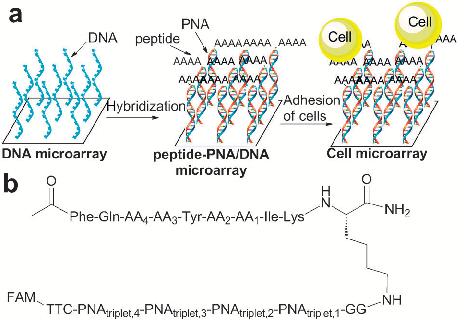
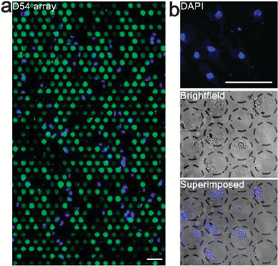
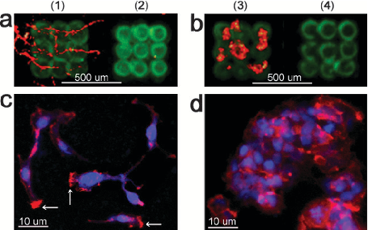

Published on 09 June 2011. Downloaded by Universidad de Granada on 05/05/2014 10:36:56.

View Article Online / Journal Homepage / Table of Contents for this issue

ChemComm Dynamic Article Links

Citethis: Chem. Commun., 2011, 47, 7638–7640

www.rsc.org/chemcomm COMMUNICATION

# Encoded peptide libraries and the discovery of new cell binding ligandsw

Nina Svensen, Juan Jose´ Dı´az-Mocho´ n and Mark Bradley*

Received 23rd March 2011, Accepted 12th May 2011 DOI: 10.1039/c1cc11668a

The 10000 member PNA-encoded peptide library was designed based on the peptides reported by Kuratomi10 and as such was designed to target integrins (Kuratomi demonstrated good B16-F10 cell adhesion to the identified the nonapeptide, FQVAYIIIK).10

Cells over-expressing integrins or CCR6 were incubated on a DNA microarray, pre-hybridized with a 10000 member PNA-encoded peptide library allowing novel cell specific ligands for integrins and CCR6 to be identified.

PNA was used in this approach as it is a DNA mimic which offers strong but selective hybridization to complementary DNA sequences while offering resistance to biological degradation.12 This latter factor, which extends the possible lifetime of PNA in an environment with live cells,13 renders PNA a valuable encoding alternative to DNA.14

Integrins and G-protein coupled receptors (GPCRs) are two of the largest and most diverse families of cell surface receptors.1 The integrin receptors help to control a variety of cellular signaling pathways as well as defining cellular morphology and mobility1,2 and attachment of cells to the extracellular matrix.3 A common feature found in many integrin ligands; including vitronectin, laminin, and fibronection; is the peptide RGD, which has long been exploited in designing probes and therapeutics for modulating specific cellular function.2 GPCRs are transmembrane receptors, associated with a G-protein, and contain differing subunits depending on their specific function.4 GPCRs bind an array of ligands from small peptides to large proteins with ligand interactions causing dissociation of the G-protein, and initiation of either the cAMP or phosphatidylinositol signaling pathway.4 GPCRs govern many cellular processes, playing a key role controlling cell growth, apoptosis, and differentiation and in the binding of chemokines and migration as well as being responsible for the uptake of many viruses.1,5 These features make integrins and GPCRs amongst the most heavily investigated drug targets within the pharmaceutical industry.6

Library-1 consisted of 10000 nonapeptide-PNA conjugates of the form: Ac-Phe-Gln-AA4-AA3-Tyr-AA2-AA1-Ile-LysPNA17-Fluorescein with each variable amino acid encoded by a PNA-triplet with the four variable positions each containing 10 different amino acids (see Scheme 1).11 The DNA microarrays used contained 4 44000 features, allowing 16 copies of each library member to be analyzed per array, while the cell lines used were D54 (over-expressing avb5 and avb3 integrins)15 or HEK293T-CCR6 (over-expressing CCR6).16

Library-1 was hybridized onto custom DNA microarrays (Agilent 44k 4; Fig. 1) thus rendering the peptides available for receptor binding. Microarray analysis indicated that the library had hybridized as expected with normal variations in fluorescent (spot) intensities expected due to differences in secondary structure, efficiency of oligonucleotide synthesis

A number of integrin ligand discovery platforms have been described,7–10 and include the work of Niemeyer,8 who developed a platform for DNA-directed immobilization of peptides, which allowed integrin mediated adhesion of fibroblasts onto RGD-based features. Niemeyer and Kiessling demonstrated that peptide arrays could be used to identify ligands that induced cell migration, proliferation, and differentiation.8,9

Herein we report the screening of an immobilized 10000 member PNA-encoded peptide library (Library-1;11 see Scheme 1) with human cells in a manner which afforded information on the interactions between the peptide ligands and the cell surface receptors on a spot-by-spot (compound-by-compound) basis.

School of Chemistry, EastChem, The University of Edinburgh, Joseph Black Building, West Mains Road, Edinburgh, EH9 3JJ, UK. E-mail: mark.Bradley@ed.ac.uk; Fax: (+44)131 650 6453; Tel: (+44)131 650 4820

Scheme 1 (a) The concept of cellular screening a library of PNA-encoded peptides by DNA microarray analysis. (b) Structure of: AA1, AA2, and AA4 were Ile, Val, Phe, Pro, Arg, Glu, Lys, d-Pro, Ser or d-Val and AA3 was Ile, Val, Ala, Pro, Arg, Glu, Lys, d-Ala, Ser or Pro. FAM = 5(6)-carboxyfluorescein amide.

w Electronic supplementary information (ESI) available: Detailed methods and additional data. All microarray data has been submitted into ArrayExpress database with accession number: E-MEXP-3103. See DOI: 10.1039/c1cc11668a

Published on 09 June 2011. Downloaded by Universidad de Granada on 05/05/2014 10:36:56.

ester on the surface was treated with perfluorooctyl propylamine to generate a highly cell-repellent surface on the glass slide in regions where the peptide was absent.

D54 and HEK293T-CCR6 cells were incubated on the immobilized peptides, (1–2) or (3–4), respectively. As can be seen in Fig. 2 and Fig. S3 in ESIw substantially greater cellular adhesion was observed on the ‘‘hit’’-binding peptides (1 and 3) than on the non-binding peptide controls (2 and 4).

Table 1 Identified ‘‘hit’’-peptidesa Cell type D54 HEK293T-CCR6 Binding peptide X-FQpIYIIIK-NH2 (1) X-FQIPYIIIK-NH2 (3) Non-binding peptide

X-FQKKYSRIK-NH2 (2) X-FQPKYSFIK-NH2 (4)

a Peptides (1–4) were immobilized onto glass slides via their Lysine side chains. X = FAM-Ahx and p is d-Pro.

To verify that cell adhesion was receptor mediated, soluble modulators for the respective receptors were added to the media during incubation on the immobilized peptides. Thus the addition of the peptide FAM-Ahx-RGD-NH2 (at 100 mM) to the D54 cells on immobilized (1) resulted in essentially complete inhibition of cell binding, demonstrating that binding was integrin mediated (see Fig. 2). Similarly, HEK293T-CCR6 binding on (3) was shown to be CCR6 mediated (see Fig. 2) as this was blocked by the presence of the PerCP-anti human CCR6 antibody. As a negative control the parent cell line HEK293T was incubated on (3) and (4) in the same manner. As expected, HEK293T adhesion was greatly reduced (B90%) compared to HEK293T-CCR6 adhesion further illustrating that binding is CCR6 mediated (see Fig. S3w).

Fig. 1 Images of a DNA microarray. 4 sub-arrays of 44000 features were hybridized with the 10000 member PNA-encoded peptide library (Library-1) and subsequently incubated with D54 cells. (a) Composite FAM/DAPI images showing B700 features with D54 cell-binding. (b) An expansion of (a) showing DAPI, bright field and composite images of cells binding to the array. FAM = peptide-PNA/DNA, DAPI = nuclei staining of attached cells. Images were obtained using a Nikon Eclipse 50i microscope with a 40 objective. Scale bars = 20 mm.

and Tm of the PNA/DNA duplexes (all of which affect hybridization efficiency17). No hybridization occurred on the negative control features (black spots; Fig. 1 and S1 in ESIw), while the four copies of the identical peptide showed uniform binding intensities.

In addition staining of the F-actin filaments in D54 on (1) revealed that cells had a high concentration of actin at one end of the axon, illustrating formation of the adhesion complex,19 which is linked to the actin-cytoskeleton through phosphorylation and activation of focal adhesion kinase (FAK), which is induced by agonist binding to integrins4 (see Fig. 2, white arrows). In contrast, D54 cells on (2) did not show any localization of the actin-filaments.

D54 or HEK293T-CCR6 cells were incubated on the hybridized microarrays in serum-free media to reduce non-specific adsorption of cell adhesive proteins. To minimize interference from cell secreted proteins incubation times were kept short (2 h), while the surface of the non-printed areas of the microarray limited cell attachment and growth only to areas of the array containing displayed ligands. The cells were fixed and stained with DAPI (allowing the number of cells on each spot to be determined) and displayed a normal and healthy morphology (elongated, spread-out shape; see Fig. 1 and S1 in ESIw). Analysis of the DAPI and FAM intensities allowed relative comparison of the receptor affinity for the peptides and identification of the top 100 binding peptides from the 10000 member library (see Fig. 1 and S1 in ESIw).

In order for the peptides to have biological applications it is vital that the peptides do not exhibit cytotoxicity. Cell viability upon treatment with the ‘‘hit’’-peptides was assessed with standard MTT20 assays demonstrating that no cytotoxicity was exhibited by the peptides (Fig. S4 in ESIw).

In summary microarray analysis of a 10000 member PNA encoded peptide library followed by scatter plot analysis allowed consensus sequences for both receptor and non-binding peptides to be extracted for avb5 and avb3 integrins and CCR6 respectively. Synthesis followed by surface immobilization of these ‘‘hit’’-peptides allowed verification of receptor binding. Competition studies with the natural ligands for integrins and CCR6 demonstrated that binding of (1) and (3) were avb5 and avb3 integrin and CCR6-mediated, respectively. Furthermore, actin staining indicated (1) was an agonist for the avb5 and avb3 integrins.

Scatter plots of the relative cell binding affinity for the top 100 peptides versus the variable amino acids for positions AA4 to AA1 were constructed (see Fig. S2 in ESIw). This allowed the most preferred amino acids for each of the variable positions (i.e. the amino acids with the highest number of high-intensity peptides) to be determined (see Table 1). Consensus sequences for the least preferred peptides were similarly obtained.

To verify and quantitatively compare cellular affinities the binding and non-binding peptides (1–4) were synthesized18 (see Table 1) and printed onto N-hydroxy-succinimidyl activated esters on glass slides (with immobilisation of the peptide taking place via the lysine side chain). Any unreacted activated

This approach establishes a strategy for high-throughput screening for the identification of ligands for integrins and GPCRs and offers an efficient approach to de-orphanise the

This journal is c The Royal Society of Chemistry 2011 Chem. Commun., 2011, 47, 7638–7640 7639

Published on 09 June 2011. Downloaded by Universidad de Granada on 05/05/2014 10:36:56.

- 6 W. H. Miller, R. M. Keenan, R. N. Willette and M. W. Lark, Drug Discovery Today, 2000, 5, 397; P. A. Insel, C.-M. Tang, I. Hahntow and M. C. Michel, Biochim. Biophys. Acta, Biomembr., 2007, 1768, 994.
- 7 (a) F. Elefteriou, J. Y. Exposito, R. Garrone and C. Lethias, Eur.

- J. Biochem., 1999, 263, 840; (b) D. H. Lau, L. Guo, R. Liu, A. Song, C. Shao and K. S. Lam, Biotechnol. Lett., 2002, 24, 497; (c) M. Makino, I. Okazaki, S. Kasai, N. Nishi, M. Bougaeva, B. S. Weeks, A. Otaka, P. K. Nielsen, Y. Yamada and M. Nomizu, Exp. Cell Res., 2002, 277, 95; (d) D. J. Irvine,
- K. A. Hue, A. M. Meyers and L. G. Griffith, Biophys. J., 2002, 82, 120.

- 8 H. Schroeder, B. Ellinger, C. F. W. Becker, H. Waldmann and C. M. Niemeyer, Angew. Chem., Int. Ed., 2007, 46, 4180.
- 9 Derda, L. Li, B. P. Orner, R. L. Lewis, J. A. Thomson and L. L. Kiessling, ACS Chem. Biol., 2007, 2, 347.
- 10 Y. Kuratomi, M. Nomizu, P. K. Nielsen, K. Tanaka, S.-Y. Song, H. K. Kleinman and Y. Yamada, Exp. Cell Res., 1999, 249, 386.
- 11 D. Pouchain, J. J. Diaz-Mochon, L. Bialy and M. Bradley, ACS Chem. Biol., 2007, 2, 810.
- 12 P. E. Nielsen, Peptide Nucleic Acids: Protocols and Applications, Horizon Bioscience, 2nd edn, 2004.
- 13 V. V. Demidov, V. N. Potaman, M. D. Frank-Kamenetskii, M. Egholm, O. Buchard, S. H. Sonnichsen and P. E. Nielsen, Biochem. Pharmacol., 1994, 48, 1310.
- 14 PNA-encoding: (a) N. Winssinger, R. Damoiseaux, D. C. Tully, B. H. Geierstanger, K. Burdick and J. L. Harris, Chem. Biol., 2004, 11, 1351–1360; (b) J. J. Diaz-Mochon, L. Bialy, L. Keinicke and

- M. Bradley, Chem. Commun., 2005, 11, 1384; (c) J. L. Harris and
- N. Winssinger, Chem.–Eur. J., 2005, 11, 6792–6801; (d) H. D. Urbina, F. Debaene, B. Jost, C. Bole-Feysot, D. E. Mason, P. Kuzmic, J. L. Harris and N. Winssinger, Chem. Bio. Chem., 2006, 7, 1790; (e) Z. L. Pianowski and N. Winssinger, Chem. Soc. Rev., 2008, 37, 1330; N. Winssinger, J. L. Harris, B. J. Backes and P. G. Schultz, Angew. Chem., Int. Ed., 2001, 40, 3152DNA-encoding: (f) Z. J. Gartner, B. N. Tse, R. Grubina, J. B. Doyon, T. M. Snyder and D. R. Liu, Science, 2004, 305, 1601–1605; (g) S. J. Wrenn, R. M. Weisinger, D. R. Halpin and P. B. Harbury, J. Am. Chem. Soc., 2007, 129, 13137–13143;

- (h) F. Buller, Y. Zhang, J. Scheuermann, J. Scha¨ fer, P. Bu¨ hlmann and D. Neri, Chem. Biol., 2009, 16, 1075–1086;
- (i) M. Clark, et al., Nat. Chem. Biol., 2009, 5, 647–654.

- 15 J. Fueyo, C. Gomez-Manzano, V. K. Puduvalli, P. Martin-Duque, R. Perez-Soler, V. A. Levin, W. K. Yung and A. P. Kyritsis, Int. J. Oncol., 1998, 12, 665.
- 16 A. Zaballos, R. Varona, J. Gutie´ rrez, P. Lind and G. Ma´ rquez, Biochem. Biophys. Res. Commun., 1996, 227, 846.
- 17 R. Owczarzy, P. M. Vallone, F. J. Gallo, T. M. Paner, M. J. Lane and A. S. Benight, Biopolymers, 1997, 44, 217–239.
- 18 N. Svensen, J. J. Dı´az-Mocho´ n and M. Bradley, Tetrahedron Lett., 2008, 49, 6498; J. J. Diaz-Mochon, L. Bialy, L. Keinicke and M. Bradley, Chem. Commun., 2005, 11, 1384.
- 19 (a) P. Gong and D. W. Grainger, Surf. Sci., 2004, 570, 67; (b) A. J. Ridley, M. A. Schwartz, K. Burridge, R. A. Firtel, M. H. Ginsberg, G. Borisy, J. T. Parsons and A. R. Horwitz, Science, 2003, 302, 1704.
- 20 T. Mosmann, J. Immunol. Methods, 1983, 65, 55–63.

Fig. 2 Cell binding/non-binding on the identified peptides (1–4): (a) and (b) composite (FAM/Cy3) low resolution images taken with a BioTEc LaVision BioAnalyzer of cells (D54 and HEK293T-CCR6 respectively) binding onto the peptide ligands (1–4). (c) and (d) composite (DAPI/Cy3) high-resolution images (Nikon Eclipse 50i microscope with a 40 objective). (c) D54 cells incubated on the binding peptide (1). The white arrows show action-filament localization. (d) HEK293T-CCR6 cells incubated on peptide (3). FAM = peptide ligand, DAPI = nuclei staining of attached cells and Cy3 (phalloidin) = actin-filament staining.

many GPCRs, for which there are no known ligands. As integrins and GPCRs are amongst the most heavily investigated targets in the pharmaceutical industry today6 identification of new agonist or antagonists of these receptors by this method could help identify new drug-targets as well as leads. The technology also allows screening of a wide variety of cell surface receptors and offers a tool for investigating differences in membrane receptor expression between different cell types including diseased cells. Furthermore, this approach facilitates simultaneous screening of different cell types in a competition study simply by staining the different cell types with different cell tracker dyes prior to screening.

We thank the EPSRC and BBSRC for funding.

Notes and references

- 1 M. J. Humphries, Biochem. Soc. Trans., 2000, 28, 311–339; D. Filmore, Mod. Drug Discov., 2004, 7, 24.
- 2 R. Hynes, Cell, 2002, 110, 673.
- 3 T. E. O’Toole, Y. Katagiri, R. J. Faull, K. Peter, R. Tamura, V. Quaranta, J. C. Loftus, S. J. Shattil and M. H. Ginsberg, J. Cell Biol., 1994, 124, 1047.
- 4 A. G. Gilman, Annu. Rev. Biochem., 1987, 56, 615.
- 5 D. A. Calderwood, S. J. Shattil and M. H. Ginsberg, J. Biol. Chem., 2000, 275, 22607.

