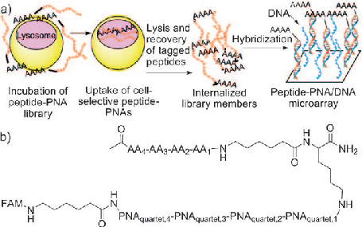
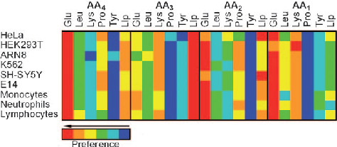
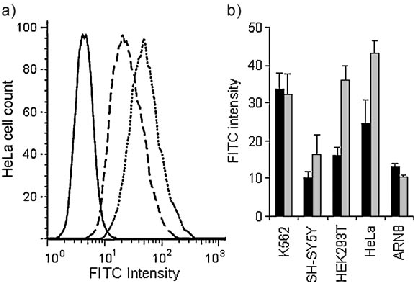
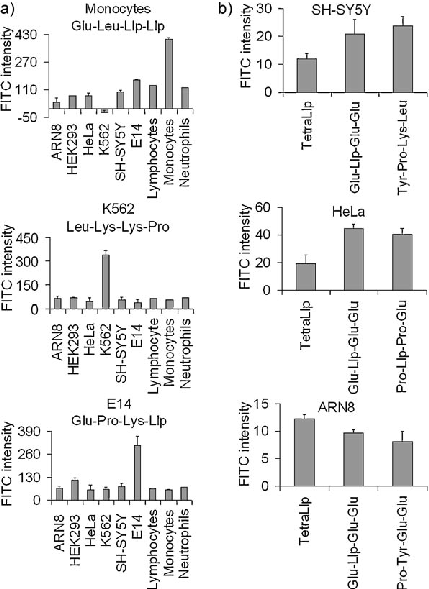
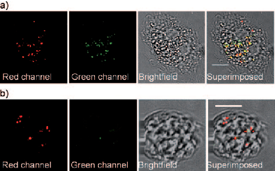

Homing Peptides DOI: 10.1002/anie.201101804

## Screening of a Combinatorial Homing Peptide Library for Selective Cellular Delivery**

Nina Svensen, Juan Jos  D az-Moch n, Kevin Dhaliwal, Songsak Planonth, Michael Dewar, J. Douglas Armstrong, and Mark Bradley*

Selective delivery of cargos into specific cell types has the capacity to ensure optimal distribution of therapeutic entities into diseased cells while limiting possible adverse, off-target effects.[1] One possible route whereby this might be achieved is through receptor-mediated endocytosis, which provides opportunities for targeted delivery where specific receptors are (over)expressed.[1] Such a strategy has identified the firstgeneration tumor homing peptides RGD (Arg-Gly-Asp) and NGR (Asn-Gly-Arg), which recognize the av integrins and aminopeptidase N, respectively, which are upregulated during tumor progression. These peptides have entered clinical trials.[2]

Cell-penetrating peptides typically have a high abundance of arginine or lysine residues, or alternating charged and hydrophobic amino acid residues,[3] with perhaps the most highlighted being the peptide to the transacting activator of transcription (TAT; GRKKKRQRRR). TAT has been shown to promote cellular delivery or uptake of conjugated proteins, phage, liposomes, small molecules, and nanoparticles,[4] and the peptide is able to traverse almost all tissues, including the brain.[1,3,5] Cell-penetrating peptides are readily synthesized, typically have low immunogenicity,[5e] and offer numerous opportunities for the delivery of a variety of cargos.[5d,e]

A chimeric peptide comprising a tumor-homing-peptide section and a cell-penetrating-peptide section has been reported to deliver cargos efficiently inside cells.[6] A method that would allow the identification of peptides to optimize both the delivery and tumor penetration of existing cancer drugs in a cell-selective manner would be highly desirable. Such an approach would tie in with the desire to generate ligands with affinity for tissue-specific markers, in

[*] Dr. N. Svensen, Dr. J. J. D az-Moch n, S. Planonth, Prof. M. Bradley School of Chemistry, The University of Edinburgh Joseph Black Building, West Mains Road, Edinburgh, EH9 3JJ (UK) Fax: (+44)131-650-6453 E-mail: mark.bradley@ed.ac.uk Dr. K. Dhaliwal MRC Centre for Inflammation Research The University of Edinburgh 51 Little France Crescent, Edinburgh, EH16 4SA (UK) Dr. M. Dewar, Dr. J. D. Armstrong School of Informatics, The University of Edinburgh 10 Crichton Street, Edinburgh, EH8 9AB (UK)

[**] We thank the EPSRC and BBSRC for funding. Supporting information for this article is available on the WWW under http://dx.doi.org/10.1002/anie.201101804. All microarray data has been submitted into the ArrayExpress database: http:// www.ebi.ac.uk/arrayexpress/ with the accession number E-MEXP3101.

essence a “zip code” system for all cell types.[2f,h,i] Herein, we report a strategy for the high-throughput screening of a peptide nucleic acid (PNA)-encoded peptide library to allow the identification of versatile cell-penetrating homing peptides (Figure 1).

Figure 1. a) The strategy to identify cell-selective penetrating peptides. An encoded 1296-member peptide library was incubated with cells, and any cell-surface-bound peptides were released with trypsin. Cells were lysed, and intracellular PNA was extracted and hybridized onto a 44K DNA microarray. b) General structure of the PNA-encoded 1296member peptide library (Library 1). Each PNA quartet was designed to have a maximum of 50% similarity to each other quartet and a maximum purine content of 50%; all had uniform melting temperatures and did not include palindrome sequences or polythymine moieties.

A 1296-member carboxyfluorescein (FAM)-labeled, PNA-encoded,[6,7] tetrapeptide library (Library 1) was designed and synthesized using split and mix methods (see Figure 1 and Scheme S1).[8] Six amino acids were used, each encoded by a PNA quartet: Pro (turn, AAAC), Glu (acidic, ATCT), Leu (hydrophobic, TACA), Lys (basic, TCAT), and Tyr (aromatic, ACAA) to represent the overall classes of the natural amino acids as well as an N-alkyl glycine lysine-like peptoid monomer[9] (N-aminohexylaminoacetic acid (Llp), basic, TTAC; see Scheme S1 in the Supporting Information). This monomer was included because its tetramer is a known highly efficient cellular delivery vehicle that resists enzymatic degradation.[10]

For library screening and hybridization, cervix epitheloid carcinoma (HeLa), erythroleukemic (K562), embryonic kidney cancer (HEK293T), neuroblastoma (SH-SY5Y), and amelanotic melanoma (ARN8) cells and embryonic stem cells (E14) as well as human primary lymphocytes, monocytes, and neutrophils were incubated with Library 1 (100 mm; corre-

Angew. Chem. Int. Ed. 2011, 50, 6133 –6136 2011 Wiley-VCH Verlag GmbH & Co. KGaA, Weinheim 6133

sponding to 77 nm of each library member). After incubation, washing, and treatment with trypsin, the cells were lysed, and the library members were extracted and purified by filter centrifugation (between 3000 and 10000 Da) and hybridized onto custom-designed microarrays (44K 4 Agilent). Microarray scanning and data analysis (BlueFuse, BlueGenome) was used to extract the intensity of the FAM label, thereby giving the relative amount of PNA hybridized to each spot and the identity of the peptide. A generic consensus sequence (Glu-Llp-Glu-Glu) for all cell types was identified by analysis of scatter plots of microarray intensities versus the variable monomers for positions AA1 to AA4, a surprise in view of the typically basic residues traditionally observed (see Figure 2 and Figure S1 in the Supporting Information).

Figure 2. DNA microarray analysis of the extracted members of the peptide–PNA Library 1, which identifies a generic consensus sequence of highly cell-penetrating peptides. Each microarray consisted of four subarrays of 44000 features each, with 33 replicates of each oligonucleotide complementary to each member of the library as well as 1232 noncoding negative controls. The heat map shows the cell-penetrating peptide preferences extracted from the scatter plots.

To verify and quantitatively compare the cellular delivery abilities, the consensus sequence (FAM-Ahx-Glu-Llp-GluGlu-NH2; the Ahx monomer is 6-aminohexanoic acid) and the positive control (FAM-Ahx-tetraLlp-NH2) were synthesized[8a,10a] and incubated with the cells and analyzed by flow cytometry. The identified consensus sequence FAM-AhxGlu-Llp-Glu-Glu-NH2 had uptake levels similar to or greater than FAM-Ahx-tetraLlp-NH2 in K562, SH-SY5Y, HEK293T, HeLa, and ARN8 cells, thus indicating that this novel highly anionic delivery agent could in some cases result in better delivery than the known delivery agent (Figure 3).

The identification of a generic delivery sequence was useful, but a far more powerful outcome would be the identification of cell-specific peptides. To identify cell-selective peptides, the data for the nine cell types were clustered using Enthought Python and a Euclidean distance method (see the Supporting Information, including Figure S2). This procedure resulted in a dendrogram and heat diagram for each cell type (Supporting Information, Figures S2 and S3), from which cell-selective delivery peptides were derived (Table 1).

To verify and quantitatively compare the cellular delivery abilities of the sequences identified by clustering analysis, the peptides were synthesized with a fluorescent tag: FAM-AhxAA4-AA3-AA2-AA1-NH2.[8a,10a] All the cell types were incubated with the nine delivery agents and analyzed by flow

Figure 3. Flow cytometry analysis of the peptides FAM-Ahx-Glu-LlpGlu-Glu-NH2 and FAM-Ahx-tetraLlp-NH2 using fluorescein isothiocyanate (FITC) and phycoerythrin (PE)/ propidium iodide (PI) filters (10000 populations, n=3). Any extracellular peptide was released by treatment with trypsin (which also served to detach the cells), while trypan blue was used to quench any extracellular fluorescence,[10b] thus ensuring that any observed increase in fluorescence was from just the intracellular peptide. a) Flow cytometry histograms gated for live, single cells after incubation with delivery agent as well as propidium iodide (selectively stains the nuclei of necrotic and apoptotic cells[11]) to exclude dead cells. c: untreated cells, b: FAM-Ahx-tetraLlpNH2, a: FAM-Ahx-Glu-Llp-Glu-Glu-NH2. b) Mean FITC-filtered fluorescence of histograms of the delivery agents versus cell type. Black FAM-Ahx-tetraLlp-NH2; gray FAM-Ahx-Glu-Llp-Glu-Glu-NH2. Error bars indicate plus and minus the standard deviation ( s.d.)

Table 1: Cell-selective delivery peptides derived from clustering analysis. AA4 AA3 AA2 AA1

neutrophils Llp Llp Pro Tyr monocytes Glu Leu Llp Llp lymphocytes Pro Lys Pro Glu E14 Glu Pro Lys Llp K562 Leu Lys Lys Pro SH-SY5Y Tyr Pro Lys Leu HeLa Pro Llp Pro Glu HEK293 Leu Lys Llp Lys ARN8 Pro Tyr Glu Glu

cytometry. In the case of primary cells, the delivery agents were incubated with anti-coagulated whole blood (Figure 4 and Figure S4 in the Supporting Information). Each of the “hit” tetramers resulted in 100% uptake in the targeted cell type (i.e., the entire population was shifted in the histogram, thus illustrating that all cells had internalized the identified peptide), with clear demonstration of selectivity (Figure 4 and Figure S5 in the Supporting Information). Highlighting this result, FAM-Ahx-Leu-Lys-Lys-Pro-NH2 showed a factor of five higher uptake in K562 cells, FAM-Ahx-Pro-Tyr-Glu-GluNH2 showed a factor of four higher uptake in ARN8 cells, while FAM-Ahx-Glu-Pro-Lys-Llp-NH2 showed a factor of three higher uptake in E14 cells than in other cell types. Selective uptake between circulating malignant and primary immune cells, which would be of great interest in targeting hematological cancers, was observed with a factor of six higher uptake of FAM-Ahx-Leu-Lys-Lys-Pro-NH2 in the

Figure 4. Flow cytometry analysis of the FAM-labeled cell-selective delivery agents (FAM-Ahx-AA4-AA3-AA2-AA1-NH2) using FITC and PETexas-Red filters (10000 cells, n=3,). Conditions as given in Figure 3. Mean FITC-filtered fluorescence of histograms versus a) the cellselective delivery agents; b) the generic delivery agent compared to the cell-selective delivery agents and positive control (FAM-Ahx-tetraLlpNH2). Error bars indicate s.d.

myeloid leukemia cell line, K562, than in primary monocytes, which share similar phenotypic characteristics (Figure 4).[12]

The uptake of some of the hit tetramers was directly compared to the generic consensus peptide FAM-Ahx-GluLlp-Glu-Glu-NH2 and to the positive control FAM-AhxtetraLlp-NH2 (Figure 4). The hit tetramers FAM-Ahx-TyrPro-Lys-Leu-NH2, FAM-Ahx-Pro-Llp-Pro-Glu-NH2, and FAM-Ahx-Pro-Tyr-Glu-Glu-NH2 had uptake levels similar to or higher than the positive control and the consensus sequence in the cell lines evaluated, thus illustrating that these hit tetramers are not only selective but also very efficient cellpenetrating peptides.

In order for the peptides to have biological applications, it is vital that they do not exhibit cellular toxicity. Cell viability upon treatment with the hit peptides was assessed with MTT[13] assays. None of the delivery agents exhibited cytotoxicity in any of the tested cell types at 10 times the concentration of agent used for cell delivery (100 mm; Figure S7 in the Supporting Information). Additionally, membrane toxicity was assessed using erythrocyte hemolysis assays; no evidence of hemolysis was detected (Figure S7 in the Supporting Information).

To study compartmentalization, the cell-specific delivery peptides were incubated with their respective cell type, and the cells were stained with LysoTracker red and analyzed by

Figure 5. Selected Z-stacks of neutrophil incubated with FAM-Ahx-GluLeu-Llp-Llp-NH2 and LysoTracker red (specifically stains the lysosome) at a) 378C and b) 48C. Confocal microscopy was performed with FITC and tetramethylrhodamine isothiocyanate (TRITC) filters. Red=LysoTracker red fluorescence, green=FAM-labeled peptide. Yellow/orange color is colocalization of red and green fluorescence. Scale bars=5 mm.

confocal microscopy. As a negative control for endocytosis, cells were also incubated with their respective hit tetramer and LysoTracker at 48C. Superimposed images of the red and green channels revealed colocalization of the peptides (green) and LysoTracker red (yellow), thus illustrating that all the hit tetramers were compartmentalized into the lysosome. In contrast, only the LysoTracker fluorescence in the red channel and no fluorescence in the green channel were observed at 48C, thus illustrating that internalization of delivery agent was diminished by inhibition of active cellular uptake processes (Figure 5 and Figure S6 in the Supporting Information). Lysosome localization and active transport dependence verifies that all of the delivery agents were taken up by endocytosis.

Microarray analysis of cellular uptake of a 1296-member PNA-encoded peptide library identified an efficient generic delivery agent (Glu-Llp-Glu-Glu) for HeLa, K562, HEK293T, SH-SY5Y, and ARN8 cells; human primary lymphocytes, monocytes, and neutrophils; and embryonic stem cells. This novel anionic delivery agent could in most cases afford better cell penetration than tetraLlp.[10] Furthermore, specific and efficient cell-penetrating homing peptides were identified for these cell types. Highlighting these results, selective uptake between circulating malignant and primary immune cells, which would be of interest in targeting hematological cancers, was observed with factor of six higher uptake of FAM-Ahx-Leu-Lys-Lys-Pro-NH2 in K562 cells compared to primary monocytes.

Confocal microscopy revealed that the peptide–PNA conjugates were endosomally localized. In combination with the observed selectivity, this finding suggests receptor-mediated endocytosis as the uptake mechanism. Furthermore, the identified peptides showed no toxicity in the tested cell lines or primary cells.

This approach establishes a general strategy for the identification of cell-penetrating peptides as tools or reagents that allow homing to any cell type or tissue of interest, such as

Angew. Chem. Int. Ed. 2011, 50, 6133 –6136 2011 Wiley-VCH Verlag GmbH & Co. KGaA, Weinheim www.angewandte.org 6135

a targeted organ or a tumor. Furthermore, the incorporation of peptoid moieties and PNA encoding makes this screening technique applicable in vivo as well as in vitro, because peptoids and PNAs have long lifetimes in biological environments. In addition, this approach allows identification of ligands for the efficient and cellular targeted delivery of PNA, although we also believe that this technology is not only limited to PNA delivery. Combination of cell-penetrating homing peptides and active pharmacophores might well alleviate the constraints of the properties previously expected of drug molecules, such as small size and cell permeability.[14]

- Seery, Y. Daikh, C. Moore, L. L. Chen, B. Pepinsky, J. Barsoum, Proc. Natl. Acad. Sci. USA 1994, 91, 664–668; c) Y. Lim, E. Lee, M. Lee, Angew. Chem. 2007, 119, 3545–3548; Angew. Chem. Int. Ed. 2007, 46, 3475–3478; d) V. P. Torchilin, R. Rammohan, V. Weissig, T. S. Levchenko, Proc. Natl. Acad. Sci. USA 2001, 98, 8786–8791; e) M. Lewin, N. Carlesso, C. H. Tung, X. W. Tang, D. Cory, D. T. Scadden, R. Weissleder, Nat. Biotechnol. 2000, 18, 410–414.
- [5] a) R. F. Service, Science 2000, 288, 28–29; b) S. R. Schwarze, A. Ho, A. Vocero-Akbani, S. F. Dowdy, Science 1999, 285, 1569– 1572; c) S. Bacchetti, F. Graham, Proc. Natl. Acad. Sci. USA 1977, 74, 1590–1594; d) Molecular Biology of the Cell (Eds.: B. Alberts, A. Johnson, J. Lewis, M. Raff, K. Roberts, P. Walter), Garland Science, New York, 2002; e) J. E. Murphy, T. Uno, J. D. Hamer, F. E. Cohen, V. Dwarki, R. N. Zuckermann, Proc. Natl. Acad. Sci. USA 1998, 95, 1517–1522.
- [6] M. M e, H. Myrberg, S. El-Andaloussi, U. Langel, Int. J. Pept. Res. Ther. 2009, 15, 11–15.
- [7] S. Brenner, R. A. Lerner, Proc. Natl. Acad. Sci. USA 1992, 89, 5381–5383.
- [8] a) N. Svensen, J. J. D az-Moch n, M. Bradley, Tetrahedron Lett. 2008, 49, 6498–6500; b) A. Furka, F. Sebestyen, M. Asgedom, G. Dibo, Int. J. Pept. Protein Res. 1991, 37, 487–493.
- [9] a) E. Uhlmann, A. Peyman, G. Breipohl, D. W. Will, Angew. Chem. 1998, 110, 2954–2983; Angew. Chem. Int. Ed. 1998, 37, 2796–2823; b) S. W. Jones, R. Christison, K. Bundell, C. J. Voyce, S. M. V. Brockbank, P. Newham, M. A. Lindsay, Br. J. Pharmacol. 2005, 145, 1093–1102.
- [10] a) A. Unciti-Broceta, F. Diezmann, C. Y. Ou-Yang, M. A. Fara, M. Bradley, Bioorg. Med. Chem. 2009, 17, 959–966; b) V. L. Mosiman, B. K. Patterson, L. Canterero, C. L. Goolsby, Cytometry 1997, 30, 151–156.
- [11] H. Lecoeur, Exp. Cell Res. 2002, 277, 1–14.
- [12] a) E. Klein, H. Ben-Bassat, H. Neumann, P. Ralph, J. Zeuthen, A. Polliack, F. V nky, Int. J. Cancer 1976, 18, 421–431; b) B. B. Lozzio, C. B. Lozzio, E. G. Bamberger, A. S. Feliu, Proc. Soc. Exp. Biol. Med. 1981, 166, 546–550.
- [13] T. Mosmann, J. Immunol. Methods 1983, 65, 55–63.
- [14] J. P. Richard, K. Melikov, E. Vives, C. Ramos, B. Verbeure, M. J. Gait, L. V. Chernomordik, M. Lebleu, 2003, 278, 585–590.

Received: March 14, 2011 Published online: May 17, 2011

.Keywords:drugdelivery·homingpeptides·microarrays·

peptide nucleic acids · peptides

- [1] Drug Delivery—Principles and Applications (Eds.: B. Wang, T. Siahaan, R. A. Soltero), Wiley, New York, 2005.
- [2] a) W. Arap, R. Pasqualini, E. Ruoslahti, Science 1998, 279, 377– 380; b) R. Haubner, D. Finsinger, H. Kessler, Angew. Chem. 1997, 109, 1440–1456; Angew. Chem. Int. Ed. Engl. 1997, 36, 1374–1389; c) V. Gregorc, A. Santoro, E. Bennicelli, C. J. Punt, G. Citterio, J. N. Timmer-Bonte, F. C. Cappio, A. Lambiase, C. Bordignon, C. M. van Herpen, Br. J. Cancer 2009, 101, 219–224;

- d) A. Corti, F. Pastorino, F. Curnis, W. Arap, M. Ponzoni, R. Pasqualini, Med Res. Rev. 2011, DOI: 10.1002/med.20238;
- e) K. N. Sugahara, T. Teesalu, P. P. Karmali, V. R. Kotamraju, L. Agemy, D. R. Greenwald, E. Ruoslahti, Science 2010, 328, 1031–1035; f) P. Laakkonen, K. Vuorinena, Integr. Biol. 2010, 2, 326–337; g) P. Laakkonen, M. E.  kerman, H. Biliran, M. Yang, F. Ferrer, T. Karpanen, R. M. Hoffman, E. Ruoslahti, Proc. Natl. Acad. Sci. USA 2004, 101, 9381–9386; h) W. C. Aird, Circ. Res. 2007, 100, 158–173; i) W. C. Aird, Circ. Res. 2007, 100, 174–190.

- [3] D. J. Mitchell, D. T. Kim, L. Steinman, C. G. Fathman, J. B. Rothbard, J. Pept. Res. 2000, 56, 318–325.
- [4] a) A. Astriab-Fisher, D. S. Sergueev, M. Fisher, B. R. Shaw, R. L. Juliano, Biochem. Pharmacol. 2000, 60, 83–90; b) S. Fawell, J.

