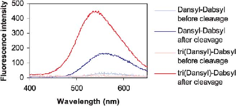
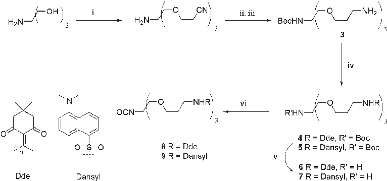
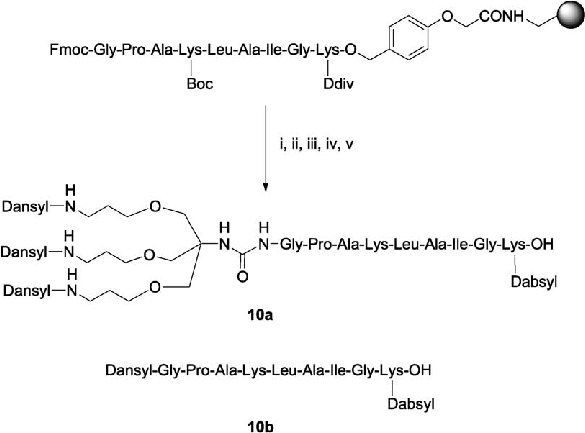

Tetrahedron 60 (2004) 8721–8728

# Dendrimers and combinatorial chemistry—tools for fluorescent enhancement in protease assays

Michae¨l Ternon, Juan Jose´ Dı´az-Mocho´n, Adam Belsom and Mark Bradley*

School of Chemistry, University of Southampton, Highfield, Southampton SO17 1BJ, UK

Received 19 November 2003; accepted 4 May 2004 Available online 2 July 2004

Abstract—FRET based systems are some of the best methods available to detect and monitor proteolytic activity. To enhance fluorescent signals and hence assay sensitivity, two different systems were developed using two different dendrimeric constructs. In the first case, a triple branched dendrimer bearing three dansyl groups was used to enhance assay sensitivity and showed a significant enhancement offluorescence following enzymatic cleavage. In another example, a tris-fluorescein probe, that undergoes self-quenching, was utilized in a combinatorial library synthesis to map the substrate specificity of proteases.

q 2004 Elsevier Ltd. All rights reserved.

1. Introduction

Proteases are involved in numerous essential biological processes, and one of the first steps in understanding any new protease is the determination of its substrate specificity. Many assays for proteases are based on fluorescent probes due to the high sensitivity of this technique and fluorescence resonance energy transfer (FRET) methods in particular have been extensively exploited. In the FRET method, donor and quencher moieties are separated on a peptide chain to give rise to an internally quenched fluorescent peptide. This fluorescence is regained following cleavage of the peptide by a protease and it is this increase in fluorescence signal that forms the basis of the FRET assay. Many donor/quencher couples have been described in the literature with varying solubilities in aqueous or organic solvents and efficiency of energy transfer.1

Multiplying the number of dyes on an internally quenched peptide could increase the sensitivity of the assay and reduce detection levels. Although dendrimers2 bearing fluorophores have been described in the literature,3 it is only very recently that research groups have shown their possible use as a highly sensitive tool for biological assay amplification.4 Multi-dyes derivatives however can show two types of behaviour: (a) significant amplification of fluorescence directly related to the number of chromophores, (b) a self-quenching phenomenon5 for dendrimers displaying small Stoke’s shift fluorophores.

Keywords: FRET; Enzymatic cleavage; Substrate specificity; Combinatorial libraries; Self-quenching.

* Corresponding author. Tel.: þ44-23-8059-3598; fax: þ44-23-8059-6766; e-mail address: mb14@soton.ac.uk

0040–4020/$ - see front matter q 2004 Elsevier Ltd. All rights reserved. doi:10.1016/j.tet.2004.05.105

Combinatorial chemistry, including ‘split and mix’ synthesis, represents a key method for the identification and characterisation of new proteases. This methodology has allowed rapid progress to be made in the determination of the optimal proteolytic substrate for a protease6 and provides essential information for the understanding of complex biological pathways and for the designofinhibitors.7 We hereindescribe the use of multilabelled systems to amplify the fluorescent signal following enzymatic cleavage and their application to define the substrate specificity of proteases using combinatorial multi-chromophoric libraries.

2. Results and discussion 2.1. Dendrimers and amplification monomers

A multivalency system bearing a variety of chromophores should be able to reduce the detection limits of bioassays such asproteasedetection,orincreasethelengthofsequencingruns in fluorescence based sequencing. The AB3 type monomers, firstly developed by Newkome et al.,8 were recently extended and enhanced in utility by our group9,10 and these multivalent compoundswereusedasabasistoamplifysignalsbycoupling chromophores to the terminal functional groups.5 Two different strategies were chosen to monitor enzymatic cleavage. The first was based on a FRET tri-donor/monoquenchersystem1andusedDansylasthedonorandDabsylas aquencher.Thesecondinvolvedaself-quenchedderivative2, using a single fluorophore (fluorescein) in which the peptidic part consisted of a combinatorial library of 1000 peptides (10£10£10) and was used to define protease substrate specificity (Fig. 1).

The amplification isocyanates 8 and 9 were synthesised in six steps as shown in Scheme 1.10 Thus, the Michael addition of 1,1,1-tris(hydroxymethyl)amino-methane onto acrylonitrile, followed by amino protection (Boc), and reduction of the nitrile groups with BH3·THF gave 3. This was reacted with either Dde-OH to give the Dde (2-acetyldimedone) protected amine 4 or the Dansyl donor group to give 5. Following removal of the Boc protecting group, the isocyanates 8 and 9 were prepared following the procedure of Kno¨lker (Scheme 1).11 Monomer 8 was coupled directly to the resin via the isocyanate and the free amino groups of the amplification monomer were liberated with hydrazine. The fully formed tri-fluorophore construct 9 could be coupled directly to the free amine groups of the resin linked peptide or used in solution phase synthesis.

- 2.2. FRET-amplified substrate synthesis: 3-donors/1-quencher

The Dansyl/Dabsyl couple was described by Hartwig as a ‘couple’ to monitor Heck chemistry during catalyst screening.12 These two dyes are easy to handle in solution or solid phase and display efficient energy transfer properties. Jakubke described the peptidic sequence Gly-Pro-Ala-LysLeu-Ala-Ile-Gly as a good substrate for trypsin with a cleavage site between lysine and leucine.13 Peptides 10a and 10b were constructed on solid phase following an Fmocstrategy using a hydroxymethylphenoxyacetic linker attached to aminomethyl PS resin. The tri-labelled isocyanate9wasgraftedontothepeptidesN-terminusafterafinal Fmocdeprotection. The firstaminoacid(Lys(Ddiv)-OH),14at the beginning of the peptide sequence, allowed dabsyl derivatisation after Ddiv-deprotection with hydrazine. A

Figure 2. Fluorescence spectra of the peptides 10a and 10b (both at 10 mM). Ex¼335 nm, Em¼545 nm (10a) and 560 nm (10b). The trilabelled peptide 10a (red) showed a much more significant increase in fluorescence than the control peptide 10b (blue).

control peptide of 1-donor/1-quencher 10b was also prepared to compare the differences of fluorescence intensity between this and the tri-labelled derivative 10a. Peptides 10a and 10b were precipitated in cold ether, centrifuged and purified by HPLC before analysis (.95%) (Scheme 2).

Enzymatic cleavage was performed on the substrates (excitation at 335 nm and emission at 545 or 560 nm) as shown in Figure 1 and Table 1 demonstrating significant increases in fluorescence in both cases.

Despite the long interchromophore distance, the Dansyl/ Dabsyl couple showed good quenching efficiency, which was enhanced for the tribranched-labelled peptide (97%). At equal concentrations (10 mM), the enzymatic cleavage of tri-branched dansyl derivative 10a (amplification by 28.4) shows a significant enhancement over the control peptide 10b (amplification by 6.1) and the signal-to-noise ratio

Figure 1. Internally quenched dendritic peptides 1 and 2 which undergo FRET (1) and self-quenching (2) processes.

- Scheme 1. Synthesis of the 1!3 C-branched tris-based isocyanate amplification monomers 8 and 9. (i) acrylonitrile, KOH 40%, dioxane; (ii) Boc2O, Et3N; (iii) BH3·THF, dioxane, 55 8C; (iv) DdeOH, DIPEA for 4 or Dansyl chloride, Et3N for 5; (v) 20% TFA in CH2Cl2; (vi) Boc2O, DMAP.

- Scheme 2. Synthesis of the FRET-amplified substrate 10a and the control peptide 10b. (i) 20% piperidine; (ii) for 10a: monomer 9, DIPEA, DMAP. For 10b: Dansyl-Cl, NEt3; (iii) 2% hydrazine in DMF; (iv) Dabsyl-Cl, NEt3; (v) TFA/CH2Cl2/TIS 95/3/2.

increased by a factor 4.6 (Fig. 2). Clearly, in this case, the FRET-amplified substrate was not subjected to a selfquenching process, due to its long Stoke’s shift.

- 2.3. FRET-amplified substrate synthesis: self-quenching system

Another approach for assaying protease activity relies on multiple copies of a single type of fluorophore, giving rise internally quenched fluorescent peptides. This method offers a very simple method of ‘internal FRET’ and was initially described in our group as a method of assaying proteases but can be applied in variety of biological assays. The self-quenching process occurs for small Stoke’s shift dyes, when the emission wavelength and the excitation wavelength of the fluorophore are close to each other (4(5)carboxyfluorescein lex¼495 nm, lem¼520 nm). In effect, the dendrimer generates a high-local concentration of fluorophore permitting efficient quenching while peptide hydrolysis releases multiple copies of the dyes causing a large increase in emission.

Herein, we show for the first time, that this process of ‘internal quenching’ can be used in a combinatorial chemistry screening sense, to profile protease specificity. FRET-based libraries of course have been widely exploited to investigate the design of the preferred enzyme substrate,15,6 but a single fluorophore approach would simplify the whole process, the substrates would be chemically much more accessible, and cleavage could occur anywhere in the peptide chain.

Table 1. Fluorescence intensity of the peptides 10a and 10b before and after adding trypsin (arbitrary units)

|Peptide Starting fluorescence  Final fluorescence  Quenching efficiency|Amplification|
|---|---|
|10b 27 165 84|6.1|
|10a 16 455 97|28.4|

The ability of an enzyme to recognise a substrate selectively in a pool of thousands of potential substrates provides vital information about its mode of action. Split and mix synthesis makes the synthesis rapid and subsequent screening of thousands of peptide targets possible.16,17

Here, the determination of the substrate specificity of two model proteases, papain and trypsin is reported by the

Scheme 3. Synthesis of the self-quenched substrate 2 (i) 2% hydrazine in DMF; (ii) (a) Fmoc-amino acid X1 (10 equiv.), HOBt (10 equiv.), DIC (10 equiv.), (b) 20% piperidine in DMF; (iii) (a) Fmoc-amino acid X2 (5 equiv.), HOBt (5 equiv.), DIC (5 equiv.), (b) 20% piperidine in DMF; (iv) (a) Fmoc-amino acid X3 (5 equiv.), HOBt (5 equiv.), DIC (5 equiv.), (b) 20% piperidine in DMF; (v) (a) g-aminobutyric acid (2 equiv.), HOBt (2 equiv.), DIC (2 equiv.) (b) 20% piperidine in DMF; (vi) 4(5)carboxyfluorescein (10 equiv.), HOBt (10 equiv.), DIC (10 equiv.); (vii) TFA/TIS/CH2Cl2 (95/2/3).

| | | | | | | | | | | |
|---|---|---|---|---|---|---|---|---|---|---|
| | | | | | | | | | | |
| | | | | | | | | | | |
| | | | | | | | | | | |
| | | | | | | | | | | |
| | | | | | | | | | | |
| | | | | | | | | | | |

| | | | | | | | | | | |
|---|---|---|---|---|---|---|---|---|---|---|
| | | | | | | | | | | |
| | | | | | | | | | | |
| | | | | | | | | | | |
| | | | | | | | | | | |
| | | | | | | | | | | |
| | | | | | | | | | | |
| | | | | | | | | | | |

| | | | | | | | | | | |
|---|---|---|---|---|---|---|---|---|---|---|
| | | | | | | | | | | |
| | | | | | | | | | | |
| | | | | | | | | | | |
| | | | | | | | | | | |
| | | | | | | | | | | |
| | | | | | | | | | | |

- Figure 3. Screening of the 30 self-quenching sub-libraries against papain.

| | | | | | | | | | | |
|---|---|---|---|---|---|---|---|---|---|---|
| | | | | | | | | | | |
| | | | | | | | | | | |
| | | | | | | | | | | |
| | | | | | | | | | | |
| | | | | | | | | | | |
| | | | | | | | | | | |

| | | | | | | | | | | |
|---|---|---|---|---|---|---|---|---|---|---|
| | | | | | | | | | | |
| | | | | | | | | | | |
| | | | | | | | | | | |
| | | | | | | | | | | |
| | | | | | | | | | | |
| | | | | | | | | | | |
| | | | | | | | | | | |

- Figure 4. Screening of the 30 self-quenching sub-libraries against trypsin.

screening of an internally quenched combinatorial peptide library. Three tripeptide sub-libraries were synthesised on the tri-branched resin using the split and mix method (Scheme 3). Monomer 8 was coupled to the Rink linker attached to the aminomethyl PS resin. This resin was deprotected with hydrazine (2% in DMF) and divided into 10 equal sized pools. The X3 position was fixed in the first library, X2 in the second library and X1 position in the third library. To minimize the size of the libraries, ten amino acids with differing properties were chosen (Ala, Arg, Asn, Asp, Leu, Lys, Phe, Pro, Ser and Tyr). Although quite simple, logistically it becomes complex as 100 individual reactions have to be carried out at this split stage. The first amino acid was coupled following standard Fmoc strategy but because of the bulk of the dendrimer backbone, the reactivity of the terminal amine group was affected and some coupling reactions were performed a second time to ensure complete reaction. The second and the third amino acids were attached following the same procedure. The introduction of a spacer was vital; too long results in a decrease of the self-quenching efficiency and too small affects the access of the enzyme to the cleavage site. A 4carbon spacer, g-aminobutyric acid, was therefore attached to the backbone (a previous study showed poor hydrolysis kinetics for peptides on dendrimers without spacers).

Carboxyfluorescein was finally coupled onto the N-termini of all the 30 sub-libraries. The multi labelled peptides were released from the resin with TFA removing, at the same time, side chain protecting groups. The sub-libraries were dissolved in buffer and the concentrations of each of the 30 sub-libraries (each of which contained 100 different tripeptides) were checked by UV spectroscopy (495 nm) to ensure identical concentrations of peptides in each assay.

2.4. Peptide libraries screenings

The 30 sub-libraries were screened against papain, with excitation at 495 nm (fluorescence at 520 nm). Fluorescent enhancement was monitored for 20 min after adding the enzyme (Fig. 3). Library 1 (X3 fixed) showed selective cleavage for Tyr and Phe. The second library (X2 fixed) demonstrated a preference for Ala, Arg and Tyr and the third library (X1 fixed) for small amino acids such as Ser and Ala. These results were consistent with the literature,18 (with library 1 representing the P2 position, library 2 the P1 position and library 3 the P10 position).

To demonstrate the further potential of the library, the library was screened against another enzyme, trypsin. The results of the screening showed a high preference for basic

amino acid residues (Arg and Lys) as cleavage points in all three sub-libraries (Fig. 4). Trypsin reaches its full hydrolytic efficiency with positively charged side chain residues and presumably, this factor is causing bias with cleavage occurring at all three positions regardless of their location making it difficult to get reasonable data for the specific cleavage site a limitation of the method that has already been observed in other systems.18

3. Conclusion

A tri-branched amplification monomer has been developed as a multi-dye carrier to enhance fluorescence signals during protease assays. Peptides bearing a tri-dansyl derivative, internally quenched by a dabsyl group in a peptide, showed a significant increase in fluorescence following hydrolysis. A new ‘self-quenched’ split and mix peptide library was designed using fluorescein as the ‘internally quenched dye’, avoiding the need to use two fluorophores as in traditional FRET based protease substrates. Using this ‘quenched’ split and mix library, the substrate specificity (P2 to P10) of papain could be rapidly determined by screening the split and mix sub-libraries.

4. Experimental

- 4.1. General information

NMR spectra were recorded using Bruker AC 300 or DPX 400 spectrometers operating at 300 or 400 MHz for 1H and 100 MHz for 13C. Chemical shifts are reported on the d scale in ppm and are referenced to residual non-deuterated solvent resonances. Electrospray mass spectra were obtained on a VG Platform single quadripole mass spectrometer. MALDI spectra were recorded on a Micromass Tofspec 2E reflection matrix assisted laser desorption ionisation time of flight (MALDI-TOF) mass spectrometer. IR spectra were obtained on a Biorad FTS 135 spectrometer with a Golden Gate accessory with neat compounds as oil or solids. Fluorescent measurements were recorded using a Perkin Elmer Luminescence Spectrometer LS50B. Commercially available reagents were used without further purification. THF was freshly distilled under nitrogen from a solution of sodium and benzophenone. Purifications by column chromatography were carried out on silica gel 60 (230–400 mesh) purchased from Merck. Analytical HPLC was performed on a Hewlett Packard HP1100 Chemstation equipped with a C18 ODS analytical column, (4.6£3 mm i.d.

- 5 mm, flow rate 0.5 ml min21) eluting with H2O/MeCN/ TFA (90/10/0.1) to H2O/MeCN/TFA (10/90/0.05) over

- 3 min, detection by UV at 254 nm. Semi-preparative HPLC was performed on a HP1100 system equipped with a

Phenomenex Prodigy C18 reverse phase column (250£10.0 mm, flow rate 2.5 ml min21) eluting with water

- (0.1% TFA) to MeCN (0.042% TFA) over 20 min. Resin samples were agitated by spinning on a blood-tube rotor. Compounds 3, 4 and 8 were synthesized according to literature procedures.10

naphthalene-1-sulfonic acid]propoxymethyl amide}ethyl] carbamic acid tert-butyl ester (5). A solution of 3 (400 mg, 1 mmol), dansyl chloride (891 mg, 3.3 mmol, 1.1 equiv.) and triethylamine (335 mg, 3.3 mmol, 1.1 equiv.) in CH2Cl2 (20 ml) was stirred for 4 days. The residue was poured into brine (20 ml) and extracted with CH2Cl2 (2£10 ml). The combined organic layers were washed with water (20 ml), dried over MgSO4 and the solvent removed in vacuo. The crude product was purified by column chromatography (CH2Cl2/MeOH 98:2) to give 5 (524 mg, 48%) as a yellow solid. 1H NMR (300 MHz, CDCl3) d1.30 (s, 9H), 1.58 (quint, J¼6.0 Hz, 6H), 2.80 (s, 18H), 2.94 (t, J¼6.0 Hz, 6H), 3.22 (s, 6H), 3.38 (t, J¼5.5 Hz, 6H), 5.50 (br s, 3H), 7.08 (d, J¼7.0 Hz, 3H), 7.38–7.49 (m, 6H), 8.15 (d, J¼7.5 Hz, 3H), 8.24 (d, J¼8.5 Hz, 3H), 8.44 (d, J¼8.5 Hz, 3H); 13C NMR (100 MHz CDCl3) d 27.5, 28.2, 40.7, 44.6, 52.6, 57.5, 69.0, 69.6, 78.7, 114.4, 118.2, 122.4, 127.5, 128.7, 128.9, 129.1, 129.4, 134.2, 151.1, 154.1; IR y 3290, 1716, 1666, 1580; MS (ESþ): 1092 (MþH)þ.

- 4.1.2. [2-{3-[5-Dimethylaminonaphthalene-1-sulfonic acid]propoxy amide}-1,1-bis-{3-[5-dimethylaminonaphthalene-1-sulfonic acid]propoxymethyl amide}ethyl] amine (7). The protected amine 5 (524 mg,

- 0.48 mmol) was treated with 20% TFA in CH2Cl2 (10 ml) and stirred for 45 min. The solvent was removed in vacuo and CH2Cl2 (50 ml) was added to the crude product which was washed with saturated aqueous NaHCO3 (2£50 ml) and water (50 ml). The organic layer was dried over Na2SO4 and the solvent was removed in vacuo to give the amine 7 as a white solid (470 mg, quantitative yield) which was used without further purification. 1H NMR (400 MHz, CDCl3) d
- 1.59 (quint, J¼6.0 Hz, 6H), 2.50 (br s, 2H), 2.80 (s, 18H),
- 2.96 (t, J¼6.0 Hz, 6H), 3.22 (s, 6H), 3.40 (t, J¼5.5 Hz, 6H), 6.0 (br s, 3H), 7.07 (d, J¼7.0 Hz, 3H), 7.42 (dt, J¼7.5, 4.0 Hz, 6H), 8.15 (d, J¼7.5 Hz, 3H), 8.24 (d, J¼8.5 Hz,

3H), 8.44 (d, J¼8.5 Hz, 3H); 13C NMR (100 MHz CDCl3) d 28.0, 40.3, 44.4, 56.4, 68.7, 70.8, 114.2, 118.1, 122.2, 127.2, 128.2, 128.6, 128.9, 129.1, 134.2, 150.8; IR y 3290, 1662, 1565; MS (ESþ): 992 (MþH)þ.

- 4.1.3. [2-{3-[5-Dimethylaminonaphthalene-1-sulfonic acid]propoxy amide}-1,1-bis-{3-[5-dimethylaminonaphthalene-1-sulfonic acid]propoxymethyl amide}ethyl] isocyanate (9). 7 (470 mg, 0.48 mmol) and DMAP (61 mg, 0.5 mmol) were dissolved in THF (20 ml) and stirred at 210 8C for 5 min under nitrogen To this solution

was added dropwise a solution of Boc2O (152 mg, 0.7 mmol) in THF (2 ml). The reaction mixture was stirred for 90 min and the solvent removed in vacuo. Because of its instability, the crude product was rapidly used without further purification for coupling to the peptide. IR y 2253, 1732, 1609. LC-MS (ES2): 1016 (M2H)2.

4.2. Peptide synthesis

Peptide synthesis was carried out using a hydroxylmethylphenoxy-acetic acid linker attached to aminomethyl PS resin (1.11 mmol g21, 1% DVB, 75–150 mm).

4.1.1. [2-{3-[5-Dimethylaminonaphthalene-1-sulfonic acid]propoxy amide}-1,1-bis-{3-[5-dimethylamino-

Fmoc-amino acids (3.76 mmol, 2 equiv.) (Fmoc-Lys(Ddiv)OH (2.15 g), Fmoc-Gly-OH (1.12 g), Fmoc-Ile-OH

(1.33 g), Fmoc-Ala-OH (1.17 g), Fmoc-Leu-OH (1.3 g), Fmoc-Lys(Boc)-OH (1.76 g), Fmoc-Ala-OH (1.17 g), Fmoc-Pro-OH (1.27 g), Fmoc-Gly-OH) (1.12 g) and HOBt (507 mg, 3.76 mmol) were dissolved in CH2Cl2 (10 ml) (with enough DMF to get complete dissolution) and stirred at room temperature for 10 min. DIC (0.63 ml, 3.76 mmol) was then added and the resulting solution stirred for a further 10 min. The solution was then added to the resin (approx. 2 g, 1.88 mmol), pre-swollen in CH2Cl2, and the reaction mixture agitated for 2 h. The solution was then drained and the resin washed with DMF (£3), MeOH (£3) and CH2Cl2 (£3). The coupling reactions were monitored by the qualitative ninhydrin test with the exception of the coupling onto proline which was monitored by a chloranil test. A small amount of resin was cleaved with TFA/ CH2Cl2/TIS (95/3/2) ratio and analyzed by analytical HLPC (254 nm) and mass spectroscopy to check peptide synthesis.

- 4.3. Fmoc-deprotection

To the resin (preswollen in CH2Cl2) was added 20% piperidine in DMF (15 ml) and the reaction mixture agitated for 20 min. The solution was then drained and the resin was washed with DMF (£3), MeOH (£3) and CH2Cl2 (£3).

- 4.4. Dansyl chromophores coupling

- Peptide 10a. Isocyanate 9 (335 mg, 0.33 mmol), DMAP (2 mg, 0.02 mmol) and DIPEA (64 mg, 0.33 mmol) were

dissolved in CH2Cl2/DMF (1:1) (4 ml). The resulting solution was added to the resin (500 mg, 0.22 mmol) and the mixture was shaken overnight and monitored by a qualitative ninhydrin test. The solution was then drained and the resin was washed with DMF (£3), MeOH (£3) and CH2Cl2 (£3).

- Peptide 10b. Dansyl chloride (119 mg, 0.44 mmol) and triethylamine (44 mg, 0.44 mmol) were added to the pre-

swollen resin (500 mg, 0.22 mmol) in CH2Cl2 and the reaction mixture was agitated overnight. The solution was then drained and the resin was washed with DMF (£3), MeOH (£3) and CH2Cl2 (£3). The coupling reaction was checked by a qualitative ninhydrin test.

- 4.5. Ddiv deprotection

To the resin (pre-swollen in CH2Cl2) (approx. 500 mg) was added 2% hydrazine in DMF (5 ml) and the reaction mixture agitated for 2 h. The solution was then drained and the resin was washed with DMF (£3), MeOH (£3) and CH2Cl2 (£3).

- 4.6. Dabsyl group coupling

Dabsyl chloride (142 mg, 0.44 mmol) and triethylamine (44 mg, 0.44 mmol) were added to the pre-swollen resin (approx. 500 mg, 0.22 mmol) in CH2Cl2 and the reaction mixture was agitated overnight. The solution was then drained and the resin was washed with DMF (£3), MeOH (£3) and CH2Cl2 (£3). The coupling reaction was checked by a qualitative ninhydrin test.

- 4.7. TFA cleavage

The resin (approx. 500 mg) was swollen in CH2Cl2 and treated with TFA/CH2Cl2/TIS (95:3:2) (12 ml) for 45 min. The solution was drained and the resin was washed with the cleavage cocktail (2£5 ml) and the mixture solution was removed in vacuo.

- 4.8. Purification of peptides 10a and 10b

The crude cleaved peptides 10a and 10b were dissolved in the minimum amount of cleavage cocktail and added dropwise to ice-cooled Et2O. The mixture was centrifuged, the solvent was removed by decantation and the precipitate was washed with Et2O (£3), before drying in vacuo. The precipitate was purified by RP-HPLC and lyophilized to afford the peptides as red solids.

- Peptide 10a: Yield: 32%. HPLC (254 nm): 3.98 min. MALDI-TOF-MS: 2159 (MþH)þ.
- Peptide 10b: Yield: 42%. HPLC (254 nm): 3.52 min. LCMS: 1374 (MþH)þ.

- 4.9. Library synthesis

The libraries were carried out using a Rink linker attached to aminomethyl PS resin (1.11 mmol g21, 1% DVB, 75– 150 mm). Isocyanate 8 was synthesized according to literature procedures10 and coupled to the resin (5.0 g, 4.15 mmol). The Dde protecting group was cleaved using 5% hydrazine in DMF (20 ml) for 2 h, the resin was drained and washed using DMF (£3), MeOH (£3), CH2Cl2 (£3) and Et2O (£3).

- 4.10. Library 1

The resin was divided into 10 portions (each 30 mg, 60 mmol, 2.0 mmol g21 loading). HOBt (81 mg, 600 mmol) was dissolved in CH2Cl2/DMF (200 mL: 200 mL) along with one of each of the following amino acids (600 mmol): Fmoc-Pro-OH (202 mg), FmocSer(tBu)-OH (230 mg), Fmoc-Asn(Trt)-OH (358 mg), Fmoc-Asp-(OtBu)-OH (246 mg), Fmoc-Tyr(tBu)-OH (275 mg), Fmoc-Arg(Pbf)-OH (388 mg), Fmoc-Lys (Boc)-OH (281 mg), Fmoc-Phe-OH (232 mg), FmocAla-OH (186 mg) and Fmoc-Leu-OH (212 mg). DIC (100 mL, 600 mmol) was added to each mixture. The resulting solution stirred for a further 10 min and added to the pre-swollen resins. The 10 resin samples were shaken overnight. The reaction mixture was drained off and washed using DMF (£3), MeOH (£3), CH2Cl2 (£3) and Et2O (£3). The ninhydrin test was still positive for some of pools and the coupling was repeated under the same conditions as above until completion of reaction. The resin was then combined, mixed and Fmoc cleavage was performed as previously described. The resin was split into 10 portions and the same procedure was employed in order to couple each one of the 10 amino acids onto the second and third positions. Following the coupling of the third amino acid, the pools of resin were labelled according to their third position and the Fmoc group was cleaved using 20% piperidine in DMF.

- 4.11. Library 2

The resin was divided into 10 portions (each 100 mg, 200 mmol, 2.0 mmol g21 loading). HOBt (270 mg, 2 mmol) was dissolved in CH2Cl2/DMF (600 mL: 600 mL) along with one of each of the following amino acids (2 mmol): Fmoc-Pro-OH (674 mg), Fmoc-Ser(tBu)-OH (766 mg), Fmoc-Asn(Trt)-OH (1.20 g), Fmoc-Asp-OtBu (823 mg), Fmoc-Tyr(tBu)-OH (918 mg), Fmoc-Arg(Pbf)-OH (1.30 g), Fmoc-Lys(Boc)-OH (936 mg), Fmoc-Phe-OH (774 mg), Fmoc-Ala-OH (622 mg) and Fmoc-Leu-OH (706 mg). DIC (315 mL, 2 mmol) was added to each mixture. The resulting solutions were stirred for a further 10 min and added to the pre-swollen resin. The pools of resin were shaken overnight. The solution was drained off and the resin washed using DMF (£3), MeOH (£3), CH2Cl2 (£3) and Et2O (£3). The ninhydrin test was still positive for some of pools and the coupling was repeated as above until completion of the reaction. The resin was then combined and mixed and Fmoc cleavage was performed as previously described. The resin was split into 10 portions. The same procedure as above was employed in order to couple each of the amino acid (1 mmol) to each of the portions of resin. The solutions were drained off, the resin washed using DMF (£3), MeOH (£3), CH2Cl2 (£3) and Et2O (£3) and dried and 10 Fmoc cleavages performed. Each pool of resin was labelled accordingtothesecondpositionaminoacidandeachpoolsplit into 10 further pools (100 in total). The third amino acid was coupled employing the same procedure (100 mmol) before recombining backinto 10 pools.The Fmoc group was cleaved using 20% piperidine in DMF.

- 4.12. Library 3

The resin was divided into 10 portions (each 100 mg, 200 mmol, 2.0 mmol g21 loading). HOBt (270 mg, 2 mmol) was dissolved in CH2Cl2/DMF (600 mL: 600 mL) along with each of the following amino acids (2 mmol): Fmoc-Pro-OH (674 mg), Fmoc-Ser(tBu)-OH (766 mg), Fmoc-Asn(trt)OH (1.20 g), Fmoc-Asp-OtBu (823 mg), Fmoc-Tyr(tBu)-OH (918 mg), Fmoc-Arg(Pbf)-OH (1.30 g), Fmoc-Lys(Boc)-OH (936 mg), Fmoc-Phe-OH (774 mg), Fmoc-Ala-OH (622 mg) and Fmoc-Leu-OH (706 mg). DIC (315 mL, 2 mmol) was added to each mixture. The resulting solution stirred for a further 10 min and added to the pre-swollen resin. The pools of resin were shaken overnight. The solutions were drained off and the resin washed using DMF (£3), MeOH (£3), CH2Cl2 (£3) and Et2O (£3). The ninhydrin test was still positive for some of pools and the coupling was repeated as above until completion of the reaction. Thepools ofresin werelabelled accordingtothe first positionaminoacidsandeachpoolsplitinto10sub-pools.The second amino acid was coupled following the same procedure as above. The 10 sub-pools of resin were mixed in accordance with their labels, Fmoc deprotected and each pool was again split into 10 sub-pools. The third amino acid was coupled employing the same procedures as above. The sub-pools were then recombined to give the 10 pools. The Fmoc group was cleaved using 20% piperidine in DMF.

- 4.13. Spacer coupling A stock solution of HOBt (2 equiv.) and Fmoc-g-amino-

butyric acid spacer (2 equiv.) in CH2Cl2/DMF along DIC (2 equiv.) was prepared. To each pool, a tenth of this stock solution was added and the mixture was shaken overnight. The solutions were drained off, the resin washed using DMF (£3), MeOH (£3), CH2Cl2 (£3) and Et2O (£3). Qualitative ninhydrin tests were negative for all 10 pools. An Fmoc cleavage was performed in each pool.

- 4.14. 4(5)-Carboxyfluorescein coupling

A stock solution of HOBt (10 equiv.) and 4(5)-carboxyfluorescein (10 equiv.) in CH2Cl2/DMF along DIC (10 equiv.) was prepared. To each pool, a tenth of this stock solution was added and the mixture was shaken for

- 24 h. The ninhydrin test was still positive for some of pools and the coupling was repeated.

4.15. General procedure for library cleavage

The resins (15 mg) were swollen in CH2Cl2 (1 ml) and treated with TFA/CH2Cl2/TIS (95:3:2) (0.5 ml) mixture for 45 min. The solutions were drained and the resins were washed with the cleavage cocktail (2£0.5 ml). The residue was evaporated to dryness and DMSO (1 mL) was added. These stock solutions were sonicated for 30 min to facilitate peptide solubilization. All of the pools were diluted by a factor of 300 in HEPES (50 mM, pH 8) or potassium phosphate (50 mM, pH 6.8) buffer depending on the enzyme under investigation and the final concentrations of the peptide were checked by absorbance intensities at 495 nm (the absorbance wavelength of the fluorophore) and adjusted as necessary.

4.16. Enzymatic assays

- 4.16.1. Trypsin assays. Enzyme activity was monitored at

25 8C in 50 mM HEPES at pH 8.0, 10 mM CaCl2, 100 mM NaCl, DMSO (15% for peptides 10a and 10b and less than 1% for the peptide libraries). Reactions were initiated by the addition of trypsin and monitored fluorimetrically for 20 min with excitation at 335 nm (10a and 10b) or 495 nm (libraries) and emission at 545 nm (10a), 560 nm (10b) or 520 nm (libraries).

- 4.16.2. Papain assays. Enzyme activity was monitored at 25 8C in potassium phosphate buffer at pH 6.8, cysteine (2 mM), EDTA (1 mM) and the pool of peptides. Reactions were initiated by the addition of papain and monitored fluorimetrically for 20 min with excitation at 495 nm and emission at 520 nm.

Acknowledgements

The authors would like to thank the BBSRC (EBS) and the University of Granada.

References and notes

1. (a) Meldal, M.; Breddam, K. Anal. Biochem. 1991, 195, 141–147. (b) Matayoshi, E. D.; Wang, G. T.; Krafft, G. A.;

Erikson, J. Science 1990, 247, 954–958. (c) Nagase, H.; Fields, C. G.; Fields, G. B. J. Biol. Chem. 1994, 269, 20952–20957. (d) Rosse´, G.; Kueng, E.; Page, M. G. P.; Schauer-Vukasinovic, V.; Giller, T.; Lahm, H. W.; Hunziker, P.; Schlatter, D. J. Comb. Chem. 2000, 2, 461–466.

- 2. Chow, H.-F.; Mong, T. K.-K.; Nongrum, M. F.; Wan, C.-W. Tetrahedron 1998, 54, 8543–8660.
- 3. (a) Vo¨gtle, F.; Gestermann, S.; Hesse, R.; Schwierz, H.; Windish, B. Prog. Polym. Sci. 2000, 25, 987–1041. (b) Balzani, V.; Ceroni, P.; Gestermann, S.; Gorka, M.; Kauffmann, C.; Vo¨gtle, F. Tetrahedron 2002, 629–637. (c) Serin,

- J. M.; Brousmiche, D. W.; Fre´chet, J. M. J. Am. Chem. Soc. 2002, 124, 11848–11849. (d) Weil, T.; Reuther, E.; Mu¨llen,
- K. Angew. Chem., Int. Ed. 2002, 41, 1900–1904. (e) Zhou, M.; Roovers, J. Macromolecules 2001, 34, 244–252. (f) Sato, T.; Jiang, D.-L.; Aida, T. J. Am. Chem. Soc. 1999, 121, 10658–10659. (g) Hahn, U.; Gorka, M.; Vo¨gtle, F.; Vicinelli, V.; Ceroni, P.; Maestri, M.; Balzani, V. Angew. Chem., Int. Ed. 2002, 41, 3595–3598.

- 4. (a) Minard-Basquin, C.; Weil, T.; Hohner, A.; Ra¨dler, J. O.; Mu¨llen, K. J. Am. Chem. Soc. 2003, 125, 5832–5838. (b) Ong, K. K.; Jenkins, A. L.; Cheng, R.; Tomalia, D. A.; Durst, H. D.; Jensen, J. L.; Emanuel, P. A.; Swim, C. R.; Yin, R. Anal. Chem. Acta 2001, 444, 143–148. (c) Staffilani, M.; Ho¨ss, E.; Giesen, U.; Schneider, E.; Hartl, F.; Josel, H.-P.; De Cola, L. Inorg. Chem. 2003, 42, 7789–7798. (d) Blackburn, G. F.; Shah, H. P.; Kenten, J. H.; Leland, J.; Kamin, R. A.; Link, J.; Peterman, J.; Powell, M. J.; Shah, A.; Talley, D. B. Clin. Chem. 1991, 37, 1534–1539.

- 5. Ellard, J. M.; Zollitsh, T.; Jon Cummins, W.; Hamilton, A. L.; Bradley, M. Angew. Chem., Int. Ed. 2002, 41, 3233–3236.
- 6. Maly, D. J.; Huang, L.; Ellman, J. A. Chem. BioChem. 2002, 3, 16–37, and references therein.
- 7. Whittaker, M. Curr. Opin. Chem. Biol. 1998, 2, 386–396.
- 8. Newkome, G. R.; Weis, C. D.; Childs, B. J. Des. Monom. Polym. 1998, 1, 3–14.
- 9. Fromont, C.; Bradley, M. Chem. Commun. 2000, 283–284.
- 10. Lebreton, S.; How, S.-E.; Buchholz, M.; Yingyongnarongkul, B.; Bradley, M. Tetrahedron 2003, 59, 3945–3953.
- 11. Kno¨lker, H. J.; Braxmeier, T.; Schlechtingen, G. Angew. Chem., Int. Ed. 1995, 34, 2497–2500.
- 12. (a) Stambuli, J. P.; Stauffer, S. R.; Shaughnessy, K. H.; Hartwig, J. F. J. Am. Chem. Soc. 2001, 123, 2677–2678. (b) Stauffer, S. R.; Beare, N. A.; Stambuli, J. P.; Hartwig, J. F. J. Am. Chem. Soc. 2001, 123, 4641–4642.
- 13. Grahn, S.; Ullmann, D.; Jakubke, H.-D. Anal. Biochem. 1998, 265, 225–231.
- 14. Chhabra, S. R.; Hothi, B.; Evans, D. J.; White, P. D.; Bycroft, B. W.; Chan, W. C. Tetrahedron Lett. 1998, 39, 1603–1606.
- 15. Meldal, M.; Svendsen, I.; Breddam, K.; Auzanneau, F.-I. Proc. Natl. Acad. Sci. U.S.A. 1994, 91, 3314–3318.
- 16. Furka, A. Drug Disc. Today 2002, 7, 1–5.
- 17. Kassel, D. B. Chem. Rev. 2001, 101, 255–267.
- 18. Hilaire, St. P. M.; Willert, M.; Juliano, M. A.; Juliano, L.; Meldal, M. J. Comb. Chem. 1999, 1, 509–523.

