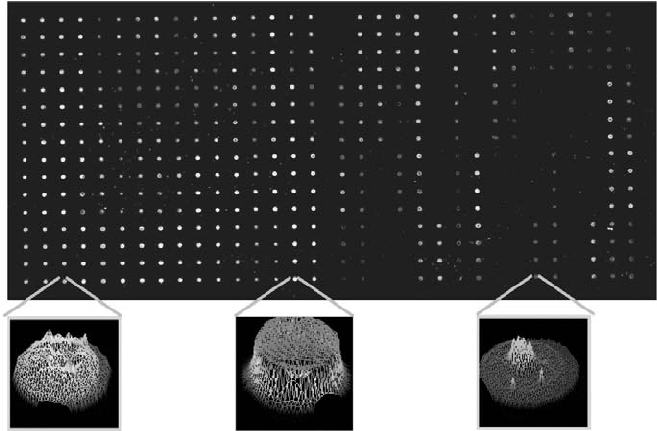
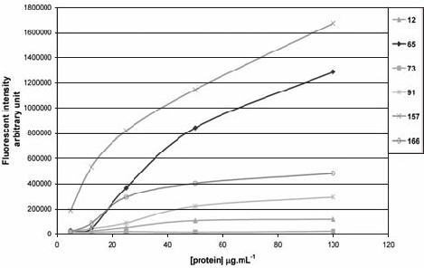
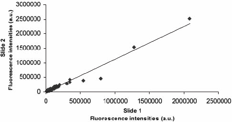
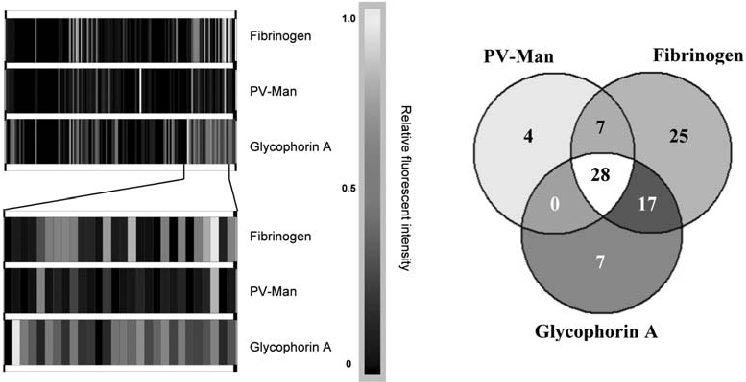
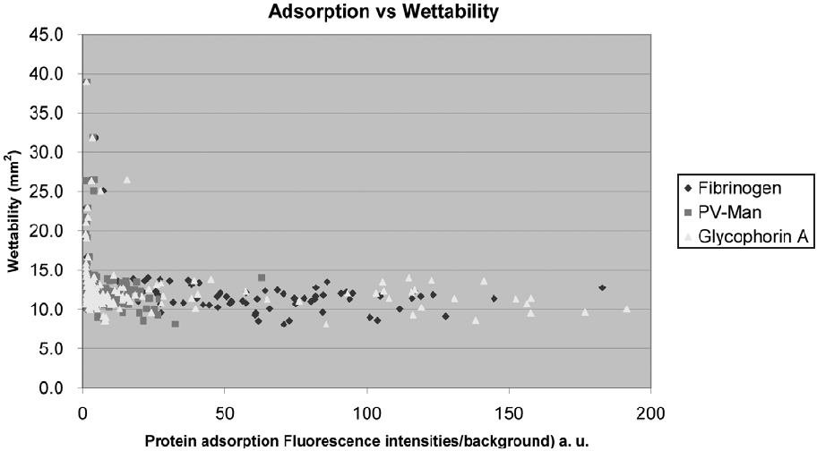

690 Combinatorial Chemistry & High Throughput Screening, 2009, 12, 690-696

# Fingerprinting Polymer Microarrays

Guilhem Tourniaire, Juan J. Diaz-Mochon and Mark Bradley*

University of Edinburgh, School of Chemistry, West Mains Road, EH9 3JJ, UK

Abstract: The incubation of “polymer microarrays” with labelled proteins and carbohydrates demonstrated polymer selective binding, giving an approach to cellular fingerprinting and offering a possible alternative to current arraying platforms for partitioning and analysis of complex cellular components.

## INTRODUCTION

The ability to partition or “spread-out” a complex biological sample across a two dimensional platform [1], with the aim of simplifying the resulting biological analysis has a large number of applications, ranging from DNA microarrays [2] and proteomic gels [3] to serum profiling [4, 5]. In the area of mRNA analysis, thousands of labelled cDNA’s are hybridised to specific partners across a 2D array, in proteomics the proteome is routinely spread out in two-dimensions on the basis of molecular weight and pI (often with labelling of the proteomes from two differentially treated cells with two different colours), while in serum profiling hundreds to thousands of peptides/small proteins are partitioned between a few surfaces prior to analysis by mass spectrometry using SELDI-ToF (surface-enhanced laser desorption/ionization time of flight [4]) and MALDIToF (matrix-assisted laser desorption/ionization time-offlight [6-8]).

Herein an approach is demonstrated whereby polymer libraries of poly(urethanes) [9] and poly(acrylates/acrylamide) [10], in a microarray format were used to partition, in a 2D sense, a number of cellular markers affording a means of identifying polymers with specific marker bindingpotential and providing a means of “finger-printing” biological samples. This approach perhaps could offer a practical alternative to current partitioning methods, especially in the area of serum profiling.

## DEVELOPMENT OF THE METHOD

The basic approach entailed printing the polymers onto a substrate, incubation with labelled proteins and finally fluorescent (or MS) analysis.

## Choice of Substrate

The first step was the evaluation of number of substrates in order to allow uniform printing of polymer features as well as giving low levels of non-specific protein binding. This included aluminium, glass, agarose coated surfaces [9], glass modified with either hydrocarbons or polyethylene glycol and gold-coated slides [11]. Gold coated slides proved to be the most suitable, giving uniform polymer spots and essentially no fluorescence background (gold quenches the fluorescence of any labelled protein binding to the surface Fig. (1)).

*Address correspondence to this author at the University of Edinburgh, School of Chemistry, West Mains Road, EH9 3JJ, UK; E-mail: mark.bradley@ed.ac.uk

## Coverslip Optimisation

The practicalities of incubating the protein on the slide were also crucial. It is well documented that proteins are easily denatured and bind non-specifically and thus the materials used to seal the polymer array during binding needed to display limited non-specific binding. Of the various materials evaluated Hybrislips™ and GeneFrame® gave the most reproducible binding results, however the average fluorescence intensity with GeneFrame® was twice as high as that recorded with Hybrislips™. Therefore, GeneFrame® coverslips were used in all subsequent studies.

## Determination of Optimal Protein Concentrations

The concentration of labelled protein solution used on the polymer array also had to be optimised. Too high and several polymers could become saturated with protein, which would ultimately lead to loss of binding information. Incubation of the array with AlexaFluor® 647-fibrinogen (in 0.5 % w/v HSA in PBS for 2 h at 37 °C) indicated that protein concentrations between 25-100  g/mL gave good intensities above background and clear differentiation between polymers with high and low affinities (Figs. 1, 2). Reproducibility of the Protein Adhesion Assay

Inter and intra-slide reproducibility was analysed by incubation of the polymer array with fluorescein-labelled lectin MAA [12] (on two identical slides). Analysis of the mean fluorescence intensities and coefficients of variance from the four identical spots of each polymer on each polymer array (see Supplementary Information), gave good intra-slide reproducibility with coefficients of variance for the 128 different polymers of 8.7 % and 8.0 % (see Supplementary Information). The inter-slide reproducibility was evaluated by plotting the average intensity for each polymer (Fig. 3) and demonstrated to be very good (R=0.96). This data also demonstrated the greater than 150-fold variation in binding between the best and the worst polymers (see Supplementary Information for details).

## POTENTIAL DIAGNOSTIC APPLICATION

The use of this method as a diagnostic tool for the identification of proteins in complex biological samples was evaluated. Three identical arrays containing 147 poly(acrylates/acrylamides) (Table 1) were incubated with three different labelled markers [13] (fibrinogen, glycophorin A, and PV-Man [14]) in the presence of 1.0 %

1386-2073/09 $55.00+.00 © 2009 Bentham Science Publishers Ltd.

Fig. (1). Top: Fluorescent image of a polymer microarray of 128 polymers (each printed in quadruplicate on a gold surface) showing the selective adsorption of AlexaFluor® 647-labelled fibrinogen. Lower images show 3D representations of polymer features with different levels of protein binding (see Supplementary Information for details).

| ||
|---|---|
| | |
| | |
| | |
| | |
| | |
| | |
| | |
| | |
| | |

- Fig. (2). Fluorescence intensity vs fibrinogen concentration for 6 representative polymers 12, 65, 73, 91, 157, 166 using AlexaFluor® 647 labelled fibrinogen in PBS, incubated for 2 h at 37 °C.
- Fig. (3). Inter-slide reproducibility. Average fluorescence intensities (a.u.) resulting from the binding of fluorescein-labelled lectin MAA to two identical microarrays containing 128 polymers (see Supplementary Information for details); Correlation coefficient (R2) = 0.96.

| | | | | | |
|---|---|---|---|---|---|
| | | | | | |
| | | | | | |
| | | | | | |
| | | | | | |
| | | | | | |
| | | | | | |

v/v human serum to mimic a complex biological sample. The average fluorescence intensities arising from the adsorption of the labelled markers to each of the four polymer spots were integrated and the average intensities calculated. These adsorptions are presented as fingerprints/barcodes (Fig. 4) allowing a comparison of the overall profiles and demonstrated that 25, 7 and 4 of the polymers were specific (see Supplementary Information for details) for fibrinogen, glycophorin A, and PV-Man [14] respectively. 28 polymers were non-specific, binding high levels of the three different markers, while 17 and 7 polymers showed selective binding to two different proteins (Table 2). Although our approach used 50-fold fewer features than the arrays developed by Kodadek [15], the percentage of probes that provided specific adhesion to a unique marker was proportionally higher with 17 %, 4.7 % and 2.7 % of the probes being specific. These figures suggest that the polymer microarrays, even if lacking large numbers of probes, have the potential to be applied in a similar manner.

## ADSORPTION VS POLYMER WETTABILITY

The wettability of each poly(acrylates/acrylamide) library member was determined by measuring the spreading area of water droplets deposited onto spin-coated polymer films, with spreading areas determined after a contact-time of 20 s [16]. Over 88 % of the polymers used could be considered relatively hydrophobic having spreading areas ranging from 8 to 14 mm2 (equivalent to a contact angle from 90° to 50° respectively) [16]. These values strongly correlated with the adsorption of the labeled markers on the polymers (Fig. 5) with all hydrophilic polymers (having a spreading area >14 mm2, equivalent to contact angle <50°) showing no significant binding over background levels. This demonstrates that one of the key features of materials for protein binding is their hydrophobicity, but with subtly influencing specific protein binding.

### Table 1. Monomers Used for the Poly(Acrylate/Acrylamide) Based Library. The First Monomer is Represented by Numbers andthe Second by Letters while the Ratio between the Two is Given by the Last Number

| |Abbr.|Name|Structure| | |Abbr.|Name|Structure|
|---|---|---|---|---|---|---|---|---|
|Number|Monomer 1| | | |Letter|Monomer 2| | |
|1|St|Styrene| | |a|DEAA|Diethylacrylamide|O  N|
|2|MMA|Methyl methacrylate| |O  O  |b|DMAA|Dimethylacrylamide|O  N|
|3|MEMA|2-Methoxyethyl methacrylate| |O  O  O  |c|PAA|N-isopropylacrylamide|O  N H|
|4|MEA|2-Methoxyethyl acrylate| |O  O  O  |e|DEAEMA|2-(Diethylamino)ethyl methacrylate|O  O  N|
|5|HEMA|2-Hydroxyethyl methacrylate| |O  O  OH  |f|DMAEMA|2-(Diethylamino)methyl methacrylate|O  O  N|
|6|HPMA|Hydroxypropyl methacrylate| |O  O OH  |g|DEAEA|2-(Diethylamino)ethyl acrylate|O  O  N|
|7|HBMA|Hydroxybutyl methacrylate| |O  O  OH  |h|DMAEA|2-(Diethylamino)methyl acrylate|O  O  N|
|8|EMA|Ethyl methacrylate| |O  O  |i|MTEMA|2-(Methylthio)ethyl methacrylate|O  O  S|
|9|BMA|Butyl methacrylate| |O  O  |j|BAEMA|2-(tert-Butylamino)ethyl methacrylate|O  O  H N|
| | | | | |l|DMAPMAA|N-[3-(Dimethylamino) propyl] acrylamide|O  O N  |
| | | | | |m|BACOEA|2-[[(Butylamino) carbonyl]oxy]ethyl acrylate|O  O  O  O  H N|
| | | | | |n|DMVBA|N,N-Dimethylvinylbenzyl amine|N|
| | | | | |v|VAA|N-Vinylacetamide|H N  O|

(Table 1) contd…..

| |Abbr.|Name|Structure| |Abbr.|Name|Structure|
|---|---|---|---|---|---|---|---|
|Number|Monomer 1| | |Letter|Monomer 2| | |
| | | | |x|VI|1-Vinylimidazol|N  N|
| | | | |z|VPNO|1-Vinyl-2prrolidinone|N  O|
| | | | |AA|VP-4|4-vinylpyridine|N|
| | | | |AB|VP-2|2-Vinylpyridine|N|
| | | | |AC|DAAA|Diacetone acrylamide (N-(1,1-dimethyl-3oxobutyl)-|O  N H  O|
| | | | |AE|MNPMA|2-Methyl-2nitropropyl methacrylate|O  O  NO2|
| | | | |BA|A-H|Acrylic acid|O  OH|
| | | | |BB|AES-H|mono -2(Acryloyoxy)ethyl succinate|O  O  O  O  O  OH|
| | | | |BC|MA-H|Methacrylic acid|O  OH|
| | | | |BE|AAG-H|2-Acrylamidoglycolic acid|O  N H  O  OH  OH|
| | | | |BG|EGMP-HE|Ethyleneglycol methacrylate phosphate|O  O  O  P O  OH  OH|
| | | | |GA|GMA|Glycidyl methacrylate|O  O O  |

## CONCLUSIONS

From the results of these investigations and the work of Kodadek [15], we hypothesise that polymer microarrays could be utilised as a diagnostic tool for the fingerprint detection of proteins in complex biological samples. Additionally polymers displaying different protein specificities could be used as substrates in applications such as surface-enhanced laser desorption ionisation (SELDI) mass spectrometry to facilitate the analysis of protein/peptide mixtures in tissues or plasma. Nowadays,

biocompatible polymers have an essential role to play in tissue engineering applications, as a result, the use of polymer microarrays for protein adsorption tailored to the identification of specific polymer properties has potential to accelerate research in many areas of science.

## EXPERIMENTAL SECTION

Determination of protein concentrations. Five identical polymer microarrays were prepared by printing 32 poly(urethanes) with 8 identical spots within each field of 16

### Table 2. Specific Polymers for Fibrinogen, Glycophorin A or PV-Man*

|Fibrinogen|Glycophorin A|PV-Man|Glycophorin A -Fibrinogen|Pv-Man –Fibrinogen|
|---|---|---|---|---|
|1b7|3e9|1a7|2BA9|3AB5|
|1c7|3AC9|3AB9|2BB9|3AE5|
|1c9|3j7|3h9|2BC9|3i9|
|2a7|5n5|5i5|2e9|3m7|
|2a9|5AA7| |2f7|3x5|
|2b9|5h7| |2g9|8e9|
|2c9|5e7| |3c9|8g5|
|2f9| | |3i7| |
|2GA1-7| | |3j9| |
|2GA2-9| | |3m9| |
|3AB7| | |3n9| |
|3AC5| | |5h9| |
|3AE7| | |5i7| |
|3i5| | |7e9| |
|5AA9| | |7h9| |
|5AB7| | |8h9| |
|5AB9| | |5AA5| |
|5AE5| | | | |
|5x5| | | | |
|5x7| | | | |
|7a7| | | | |
|7b9| | | | |
|8f7| | | | |
|8f9| | | | |
|8g9| | | | |

* A polymer was considered specific when the fluorescence intensity arising from protein binding was >10-fold the intensity of the background (i.e. F/B>10).

- Fig. (4). Upper panel: protein fingerprints showing the relative fluorescent intensity profiles associated with the adsorption of each marker. A part of the barcode was expanded to illustrate the differences in binding over a few polymer samples. Lower panel: specific and promiscuous polymers. Venn Diagram presenting the number of specific and promiscuous polymers.

| |
|---|

- Fig. (5). Adsorption of labelled fibrinogen, PV-Man and Glycophorin A vs wettability of the polymers.Polymer wettability is expressed as the area over which a droplet of water of defined size spreads over a cover slip spin-coated with the polymer (and was determined in this case after a contact-time of 20 s) [16].

x 16 as previously described [9, 10]. Each array was incubated with AlexaFluor® 647 labelled fibrinogen at 5.0, 12.5, 25, 50 and 100  g.mL-1 in PBS (300  L / slide, 2 h @ 37 °C using GeneFrame® coverslips). Following washing and drying, the polymer microarrays were scanned using a CCD-based fluorescent scanner (LaVision Biotec, Germany) a Cy5 filter set. The average fluorescence intensities arising from each set of 8 identical polymer spots were calculated (Table Supplementary Information 1).

Reproducibility of the method. Two identical polymer microarrays were prepared by printing 119 poly(urethanes) each as 4 identical spots within two fields of 16 x 16 using the conditions described elsewhere [9, 10]. The array was incubated with FITC-labelled Lectin MAA (300  L / slide, 2.50  g.mL-1 in 0.5 % w/v human serum albumin (HSA) in PBS, 2 h @ 37 °C using GeneFrame® coverslips). Following washing and drying the polymer microarray was scanned using a CCD-based fluorescent scanner (LaVision Biotec, Germany) with an FITC filter set and the fluorescence intensities arising from Lectin MAA binding onto each polymer spots integrated (Table Supplementary Information 2).

Diagnostic application. Three identical polymer microarrays were prepared by printing 147 poly(acrylates) (Table 1) with 4 identical spots within three fields (two fields of 16 x 16 and one field of 8 x 16) using the conditions previously described elsewhere [9, 10].Each printed polymer microarray was incubated for 5 minutes the following three protein solutions prepared in 1.0 % v/v whole Human Serum (HS) in PBS: 300  L of FITC labelled PV-Man @ 25.0  g.mL-1 ; 300  L of AlexaFluor® 546 labelled Glycophorin A @ 12.5  g.mL-1; 300  L of AlexaFluor® 647 labelled Fibrinogen @ 25.0  g.mL-1 Following washing and drying,

each polymer microarray was scanned using a CCD-based fluorescent scanner (LaVision Biotec, Germany). For each scan, the fluorescence intensities arising from protein binding to each polymer spots were integrated and the mean fluorescence intensities calculated (Table Supplementary Information 3)

## ACKNOWLEDGEMENT

The authors thank Asahi Kasei Corporation for funding. REFERENCES

- [1] a). Boguski, M.S.; McIntosh, M.W. Biomedical informatics for proteomics. Nature, 2003, 422(6928), 233-37; b) Diaz-Mochon, J.J.; Bialy, L.; Bradley, M. Dual colour, microarray-based, analysis of 10,000 protease substrates. Chem. Commun., 2006, (38), 398486; c) Pouchain, D.; Diaz-Mochon, J. J.; Bialy, L.; Bradley, M. A. 10,000 member PNA-encoded peptide library for profiling tyrosine kinases. ACS Chem. Biol., 2007, 2 (12), 810-18.
- [2] a) Carter, N. P. Methods and strategies for analyzing copy number variation using DNA microarrays. Nat. Genetics, 2007, 39 (7), S16S21; b) Venter, J. C.; Levy, S.; Stockwell, T.; Remington, K.; Halpern, A. Massive parallelism, randomness and genomic advances. Nat. Gen., 2003, 33(Suppl), 219-27.
- [3] a) Kim, H.; Eliuk, S.; Deshane, J.; Meleth, S.; Sanderson, T.; Robinson, A. P. G.; Wilson, L.; Kirk, M.; Barnes, S. 2D gel proteomics: an approach to study age-related differences in protein abundance or isoform complexity in biological samples. Methods Mol. Biol., 2007, 371, 349-91; b) Lambert, J-P.; Ethier, M.J.; Smith, C.; Figeys, D. Proteomics: from gel based to gel free. Anal. Chem., 2005, 77 (12), 3771-87.
- [4] Agranoff, D.; Fernandez-Reyes, D.; Papadopoulosios, M. C.; Rojas; S. A.; Herbster, M.; Loosemore; A.; Tarelli, E; Sheldon, J.; Schwenk, A.; Pollok, R.; Rayner, C. F. J.; Krishna, S. Identification of diagnostic markers for tuberculosis by proteomic fingerprinting of serum. Lancet, 2006, 368 (9540), 1012-21.
- [5] Qin, S.; Qiu, W.; Ehrlich, J. R.; Ferdinand, A. S.; Richie, J. P.; O'Leary, M. P.; Lee, M-L. T.; Liu, B. C.-S. Development of a "reverse capture" autoantibody microarray for studies of antigenautoantibody profiling. Proteomics, 2006, 6 (10), 3199-209.

- [6] Hortin, G. L. The MALDI-TOF mass spectrometric view of the plasma proteome and peptidome. Clin. Chem., 2006, 52 (7), 122337.
- [7] Najam-ul-Haq, M.; Rainer, M.; Huck, C. W.; Stecher, G.; Feuerstein, I.; Steinmuller, D.; Bonn, G. K. Chemically modified nano crystalline diamond layer as material enhanced laser desorption ionisation (MELDI) surface in protein profiling. Curr. Nanoscience, 2006, 2 (1), 1-7.
- [8] White, M. Y.; Gundry, R. L.; Cordwell, S. J. When does a fingerprint constitute a diagnostic? Lancet, 2006, 368 (9540), 9713.
- [9] a) Tourniaire, G.; Collins, J.; Campbell, S.; Mizomoto, H.; Ogawa, S.; Thaburet, J.-F.; Bradley, M. Polymer microarrays for cellular adhesion. Chem. Commun., 2006, 2118-20; b) Thaburet, J.-F.; Mizomoto, H.; Bradley, M. High-throughput evaluation of the wettability of polymer libraries. Macromol. Rapid Commun., 2004, 25(1), 366-70; c) Pernagallo S, Unciti-Broceta, A.; Díaz-Mochón, J.J.; Bradley, M. Biomed. Mater., 2008, 3, 6.
- [10] a) Tourniaire, G. Polymer microarrays -development and applications; PhD Thesis, University of Edinburgh (UK), 2006.; b) Mizomoto, H. The synthesis and screening of polymer libraries using a high throughput approach; PhD Thesis: University of Southampton (UK), 2004; c) Unciti-Broceta, A.; Díaz-Mochón, J. J.; Mizomoto, H.; Bradley, M. Combining nebulization-mediated transfection and polymer microarrays for the rapid determination of optimal transfection substrates. J. Comb. Chem, 2008, 10(2), 17984.

- [11] Díaz-Mochón, J. J.; Tourniaire, G.; Bradley, M. Microarray platforms for enzymatic and cell-based assays. Chem. Soc. Rev., 2007, 36 (3), 449-57.
- [12] Lectin MAA correspond to the oligosaccharide Neu5Ac( 2,3)-DGal- 1-4GlcNAc. Arenas, M.I.; Madrid, J.F.; Bethencourt, F.R.; Fraile, B.; Paniagua, R. Identification of N- and O-linked Oligosaccharides in the Human Epididymis J. Histochem. Cytochem., 1998, 46 (10), 1185-88;
- [13] Fibrinogen, a well known protein from human plasma, was labelled with AlexaFluor® 647; glycophorin A, a transmembrane protein found in red blood cell membranes, labelled with AlexaFluor® 546 and Lectin MAA and PV-Man labelled with fluorescein. PV-Man refers to poly[N-p-vinylbenzyl-O- -mannopyranosyl-(1-4)-Dgluconamide which is a polystyrene derivative carrying mannose and is known to interact with hematopoietic cells (see reference 14).
- [14] a) Park, K.H.; J. Sung, K.W.; Kim, S; Kim, D. H.; Akaike, T.; Chung, H. M. Specific interaction of mannosylated glycopolymers with macrophage cells mediated by mannose receptor. J. Biosci. Bioeng., 2005, 99 (3), 285-89; b) Park, K. H.; Na, K.; Lee, Y. S.; Chang, W.-K.; Park, J.-K.; Akaike, T.; Kim, D.K. Effects of mannosylated glycopolymer on specific interaction to bone marrow hematopoietic and progenitor cells derived form murine species. J.Biomed. Mat. Res. Part A, 2007, 82 (2), 281-87.
- [15] Reddy, M.M.; Kodadek, T. Protein "fingerprinting" in complex mixtures with peptoid microarrays. Proc. Nat. Acad. Sci. USA, 2005, 102 (36), 12672-77.
- [16] Thaburet, J.F.; Mizomoto, H.; Bradley, M. Macromol. Rapid Commun., 2004, 25, 366.

#### Received: February 15, 2008 Revised: November 10, 2008 Accepted: January 19, 2009

