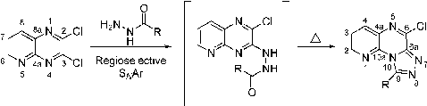
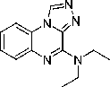
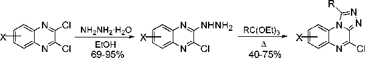
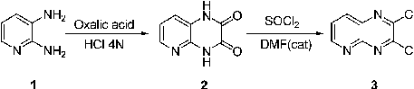
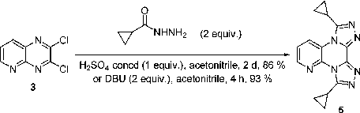
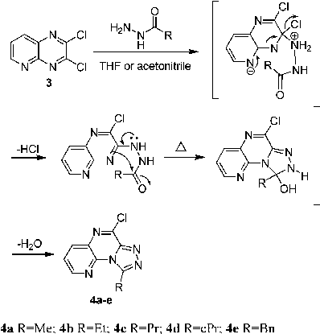
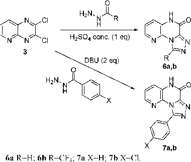
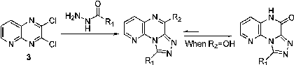

See https://pubs.acs.org/sharingguidelines for options on how to legitimately share published articles.

Downloaded via UNIV DE GRANADA on March 4, 2024 at 14:52:03 (UTC).

Regioselective One-Pot Synthesis of 9-Alkyl-6-chloropyrido[3,2-e][1,2,4]triazolo-

[4,3-a]pyrazines. Reactivity of Aliphatic and Aromatic Hydrazides

Asier Unciti-Broceta,† Maria J. Pineda-de-las-Infantas,† Juan J. Dı´az-Mocho´n,†,§ Romeo Romagnoli,‡ Pier G. Baraldi,‡ Miguel A. Gallo,† and Antonio Espinosa*,†

Departamento de Quı´mica Farmace´utica y Orga´nica, Facultad de Farmacia, Campus Cartuja s/n, 18071 Granada, Spain, and Dipartimento di Scienze Farmaceutiche, Via Fossato di Mortara 17/19, I/44100, Ferrara, Italy

aespinos@ugr.es

Received December 7, 2004

The one-pot synthesis of new 9-alkyl-6-chloropyrido[3,2-e][1,2,4]triazolo[4,3-a]pyrazines has been achieved. Hydrazides regioselectively reacted as nucleophiles with the 3-chloro substituent of 2,3-dichloropyrido[2,3-b]pyrazine. An intramolecular cyclization afforded the tricycle nonxanthine adenosine receptor antagonists.

The tricyclic nonxanthine adenosine antagonists are nitrogen-containing heterocycles based on the adenosine moiety.1-3 During an empirical screening effort, it was discovered that 4-(diethylamino)[1,2,4]triazolo[4,3-a]quinoxaline4 (CP-41,475, Figure 1) was effective in reducing immobility in rats following a single dose.5 These results suggested that compounds with structures related to this family might therefore be rapid-onset antidepressants. Furthermore, biochemical studies early on indicated that these compounds displayed adenosine receptor affinities.1,5 Currently, this class of compounds is being investigated and the results have been reported.6

The traditional synthetic strategy for these fused heterocycles involves a two-step approach from 2,3-

* To whom the correspondence should be addressed. Fax: +34-958-

243845. Phone: +34-958-243850. † Universidad de Granada. § Current address: School of Chemistry, Highfield Campus,

Southampton, SO17 1BJ, UK. ‡ Universita` di Ferrara.

- (1) Trivedi, B. K.; Bruns, R. F. J. Med. Chem. 1988, 31, 1011-1014.
- (2) Mu¨ller, C. E.; Stein B. Curr. Pharm. Des. 1996, 2, 501-530.
- (3) Jacobson, K. A.; Suzuki, F. Drug Dev. Res. 1990, 39, 289-300.
- (4) This compound was initially prepared by Dr. S. B. Kadin at Pfizer

Central Research for antiallergy testing.

- (5) Sarges, R.; Howard, H. R.; Browne, R. G.; Lebel L. A.; Seymour,

P. A.; Koe, B. K. J. Med. Chem. 1990, 33, 2240-2254.

- (6) Matuszczak, B.; Mueller, C. E. PCT Int. Appl. WO 03/053973.

2878 J. Org. Chem. 2005, 70, 2878-2880

FIGURE 1. The structure of 4-(diethylamino)[1,2,4]triazolo[4,3-a]quinoxaline (CP-41,475), a tricycle nonxanthine adenosine antagonist.

dichloroquinoxaline.7,8 Following the reaction with hydrazine, triethyl orthoalkanoates are used to accomplish the ring closure (Scheme 1). This methodology suffers from drawbacks such as moderate yields, side product formation, and the two-step synthesis of the fused triazolo ring. Other strategies have also been reported but without major improvements.9,10

Herein, we report the synthesis of 9-alkyl-6-chloropyrido[3,2-e][1,2,4]triazolo[4,3-a]pyrazines which were obtained from 2,3-dichloropyrido[2,3-b]pyrazine 3 in a single step. A first approach to obtain these fused heterocycles starting from 3 as depicted in Scheme 1 also resulted in low yield reactions and side product formation. We devised a new synthetic pathway to overcome some of the previous drawbacks and which provided a more straightforward and flexible synthesis of new tricycle nonxanthine adenosine antagonists. The cyclocondensation involved nucleophilic displacement followed by cyclization using several aliphatic and aromatic hydrazides. The key step was the regioselective nucleophilic aromatic substitution that gave rise to unique isomers before ring closure.

The dichloro derivative 3 was prepared from commercially available 2,3-diaminopyridine 1 in very high yields, following the procedure outlined in Scheme 2. Synthesis of the 5-azaquinoxaline ring were achieved by using oxalic acid in 4 N HCl aqueous solution.11 Halogenation of 2 by treatment with thionyl chloride and DMF in catalytic amounts provided 3.12

Following reaction between 3 and aliphatic hydrazides unique tricyclic isomers were isolated in good yields.13 The reaction that leads to tricycles 4a-e proceeded through the nucleophilic attack of the corresponding aliphatic hydrazide to the more electrophilic position of the 2,3-dichloropyrido[2,3-b]pyrazine system (Scheme 3). Therefore, the position of the nitrogen contained in the pyrido ring dictates the regiochemistry of the reaction. The corresponding hydrazones14 then afford compounds

- (7) Shiho, D.; Tagami, S. J. Am. Chem. Soc. 1960, 82, 4044-4054.
- (8) Sarges, R. U.S. Patent 4495187, 1985.
- (9) Bradan, M. M.; Abouzid, K. A. M.; Hussein, M. H. M. Arch.

Pharm. Res. 2003, 26, 107-113.

- (10) Rashed, N.; El Massry, A. M.; El Ashry, E. S. H.; Amer, A.;

Zimmer, H. J. Heterocycl. Chem. 1990, 27, 691-694.

- (11) Ohmori, J.; Shimizu-Sasamata, M.; Okada, M.; Sakamoto, S.

J. Med. Chem. 1997, 40, 2053-2063.

- (12) Ohmori, J.; Kubota, H.; Shimizu-Sasamata M.; Okada M.;

Sakamoto, S. J. Med. Chem. 1996, 39, 1331-1338.

- (13) To a solution of 2,3-dichloropirido[2,3-b]pirazine 3 (0.2 g, 1

mmol) and suitable hydrazide (1 mmol) in THF or acetonitrile (10 mL) was added dropwise a solution of concentrated H2SO4 (54 µL, 1 mmol) in THF or acetonitrile (5 mL) and the mixture was refluxed for 20 h.

(14) These compounds were observed by TLC. The bigger the substituent R, the higher the stability of the corresponding hydrazones.

10.1021/jo0478398 CCC: $30.25 © 2005 American Chemical Society

Published on Web 03/05/2005

- SCHEME 1. Traditional Synthesis of 4-Chlorotriazolo[4,3-a]quinoxalines

- SCHEME 2. Synthesis of 2,3-Dichloropyrido[2,3-b]pyrazine 3

- SCHEME 3. Regioselective Synthesis of 4a-e
- SCHEME 4. Synthesis of Tetracycle 5

- SCHEME 5. Regioselective Synthesis of 6a,b and 7a,b13,17

the same compound 5, better kinetics were observed when DBU was used.16

This suggests that once the tricycle is formed the halogenated carbon is able to react with a second molecule of hydrazide obtaining a tetracyclic system. Also, if hydrazides were not completely consumed before cyclization takes place, tetracyclic systems would be identified as the main side product. Therefore, the reactivity of the 6-carbon position in the monochloro compound 4 is greater than the 3-carbon position in the dichloro derivative 3.

4a-e at high temperature. The cyclization proceeds either in acidic, neutral, or basic conditions.

The structures of tricycles 4a-e were undoubtedly established by nuclear magnetic resonance (NMR) spectroscopy and mass spectroscopy analysis. Additionally, the structure of compound 4d was assigned by X-ray crystallography, verifying the nucleophilic attack of the hydrazide to the 3-carbon of 3.

Hydrazides with bulky substituents were less prone to cyclize due to steric reasons. Therefore compound 4d was achieved at higher refluxing temperatures in acetonitrile.15 Although cyclization kinetics are affected by the substituent size, in this case nucleophilic substitution was improved because of the increased nucleophilicity of the hydrazides.

As mentioned before, the ring closure reaction conducted under basic conditions was faster. However, the higher reactivity of the tricycles 4 to nucleophiles caused a higher ratio of the tetracycle as side product. Furthermore, tricycles with a hydroxy group in the 6-carbon position have been isolated under these conditions and therefore acidic conditions are the best in order to improve the yields. However, hydrazides with electron withdrawing substituents under acid conditions also lead to the substitution of the chloro at the 6-carbon position by a hydroxy group (see the synthesis of 6a,b in Scheme

To study the reactivity of the tricycles 2 equiv of hydrazide of the cyclopropanecarboxylic acid were used to react with the dichloro derivative 3. Following these conditions a unique compound was isolated whose structure was assigned to be the tetracyclic system 5 (Scheme

- 4). This reaction was carried out with either acidic

- (16) To a solution of 2,3-dichloropirido[2,3-b]pirazine 3 (0.2 g, 1

mmol) and the suitable hydrazide (2 mmol) in acetonitrile (10 mL) was added dropwise a solution of DBU (0.285 mL, 2 mmol) in acetonitrile (5 mL). The mixture was refluxed for 3 h.

- (17) To a solution of 2,3-dichloropirido[2,3-b]pirazine 3 (0.2 g, 1

conditions, using H2SO4, or basic conditions, using DBU. Compound 5 was assigned by nuclear magnetic resonance spectroscopy, mass spectroscopy analysis, and X-ray crystallography. Although both conditions gave rise to

mmol) and the benzoic or parachlorobenzoic hydrazide (1 mmol) in acetonitrile (10 mL) was added dropwise a solution of DBU (0.285 mL, 2 mmol) in acetonitrile (5 mL). The mixture was refluxed with stirring for 3 h.

(15) Reactions were monitorized by TLC.

J. Org. Chem, Vol. 70, No. 7, 2005 2879

TABLE 1. Summary of the Conditions Used To Obtain Tricyclic Compounds

R1 reagent solvent temp, °C time, h R2 yields, %

H HCl 36% THF 55 12 OH 57 Me H2SO4 concd THF 60 16 Cl 59 CF3 HCl 36% CH3CN 85 22 OH 65 Et H2SO4 concd THF 66 20 Cl 65 Pr H2SO4 concd THF 66 20 Cl 71 cPra H2SO4 concd CH3CN 85 24 Cl 81 Ph DBU CH3CN 85 4 OH 91 p-ClPh DBU CH3CN 85 4 OH 89 Bn H2SO4 concd THF 66 20 Cl 67

a cPr) cyclopropyl.

- 5). On the other hand, an excess of DBU was necessary to carry out cyclization with bulky aromatic hydrazides. Under these basic conditions the chloro at the 6-carbon position was also substituted by a hydroxy group (see the synthesis of 7a,b in Scheme 5).

Briefly, steric hindrance slows down the cyclization process and therefore bulky hydrazides gave rise to higher yields because of the reduced tetracycle formation (see Table 1).

Finally, it was noticed from the experimental results that the intramolecular cyclization is under thermodynamic control, which is directly correlated to the size of the substituent R. The bigger the substituent R, the

higher the temperature required to obtain the final tricycles, and therefore the smaller the amount of tetracycle obtained as a side product. If electron withdrawing hydrazides are used or an excess of DBU is required, then the chloro at the 6-carbon position is substituted by a hydroxy group after the ring closure.

In conclusion, a regioselective single-step reaction to synthesize triazolo fused rings using several hydrazides has been achieved. This reaction is suitable for a straightforward synthesis of 9-alkyl-6-chloropyrido[3,2-e][1,2,4]triazolo[4,3-a]pyrazines which can be easily derivatized by nucleophilic displacement of the 6-chloro. Compounds 6 and 7 could be used in the same way after their chlorination back to 6-like chloro derivatives. The strategy described is suitable to generate larger libraries of compounds as tricycle nonxanthine adenosine antagonists. These libraries are crucial for the understanding of the different adenosinic receptor (A1, A2a, A2b, A3) as well as their biological activities.

Acknowledgment. A.U.B. is grateful to Ramon Areces Foundation for funding. We thank Prof. J. A. Go´mez-Vidal for his helpful discussions.

Supporting Information Available: Experimental procedures for the synthesis of compounds 3-7b as well as their analytical data (NMR and MS). This material is available free of charge via the Internet at http://pubs.acs.org. Supplementary crystallographic data for compounds 4d and 5 (CCDC 250469 and CCDC 251372, respectively) can be obtained from the CCDC free of charge.

JO0478398

# 2880 J. Org. Chem., Vol. 70, No. 7, 2005

