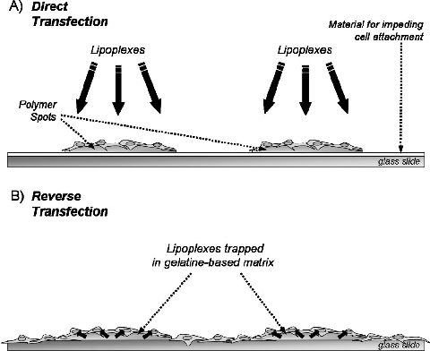
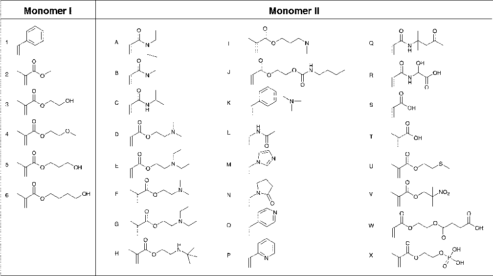
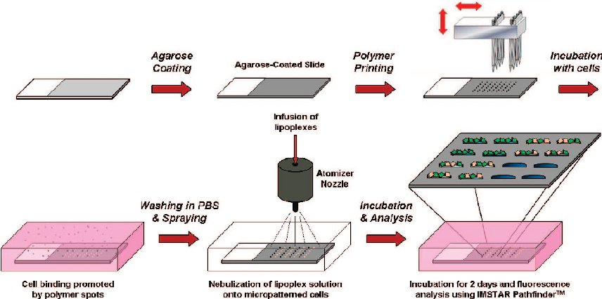
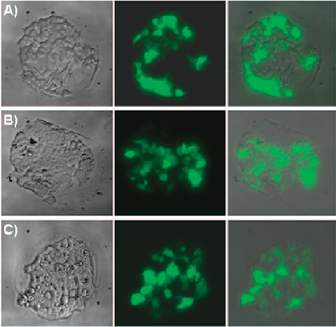
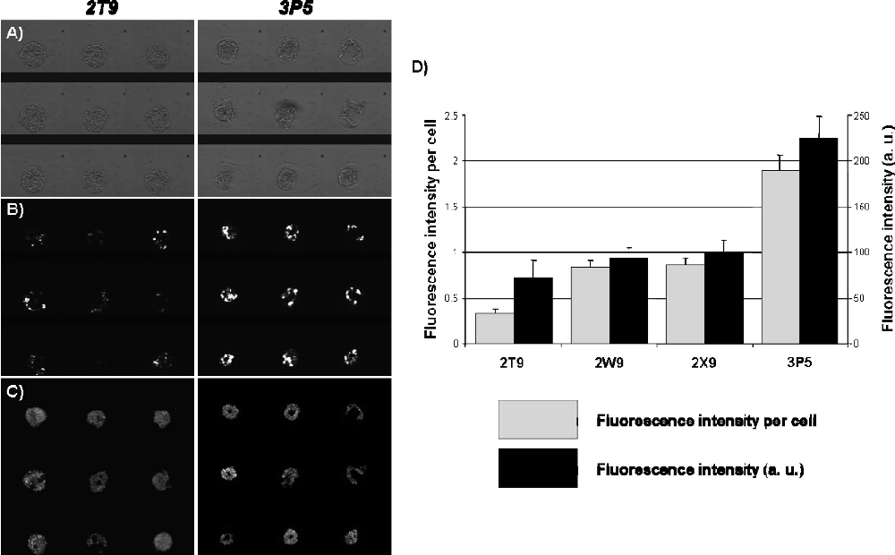
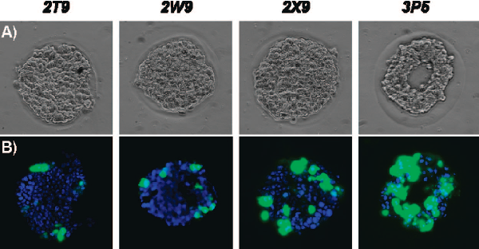
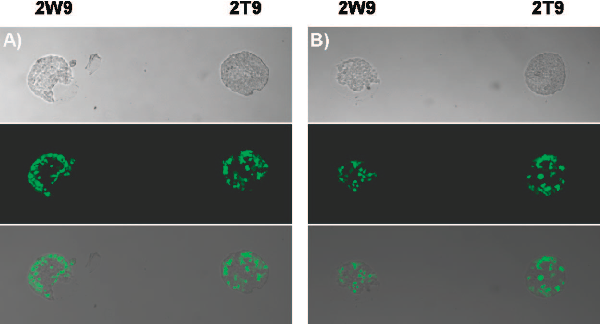

### J. Comb. Chem. 2008, 10, 179–184 179

See https://pubs.acs.org/sharingguidelines for options on how to legitimately share published articles.

Downloaded via UNIV DE GRANADA on March 4, 2024 at 14:13:51 (UTC).

# Combining Nebulization-Mediated Transfection and Polymer Microarrays for the Rapid Determination of Optimal Transfection Substrates

Asier Unciti-Broceta, Juan J. Díaz-Mochón, Hitoshi Mizomoto, and Mark Bradley*

School of Chemistry, King’s Buildings, West Mains Road, Edinburgh EH9 3JJ, U.K. ReceiVed September 19, 2007

In this manuscript, we report how transfection efficiencies vary as a function of the substrate upon which cells adhere using a polymer microarray platform to allow rapid analysis of a large number of substrates. During these studies, traditional transfection protocols were nonsatisfactory, and thus we developed an approach in which an ultrasonic nebulizer was used to dispense lipoplexes onto cell-based microarrays in the absence of liquid. Under these conditions, droplets were directly deposited onto the cells thereby enhancing transfection. This approach was successfully applied to the transfection of various cell lines immobilized on a library of polyacrylates and permitted the identification of highly efficient transfection/polymer combinations, while showing that specific polymer–cell interactions may promote the efficacy of chemical transfection.

## Introduction

The micropatterning of surfaces to either promote or impede cell attachment is an active area of research.1–4 A key component in enabling patterning has been the development of a variety of so-called “biomaterials” which aim to provide optimal derivatized substrates for cellular localization and attachment.5–9 Examples of practical cell micropatterning include investigations of coculture interactions,10,11 cellular adhesion studies,5,6 differentiation,12 phagocytosis,13 and migration assays.14 However care is needed in micropatterning because the extracellular microenvironment (in micropatterning the substrate being used for cell attachment) plays a key role in controlling cellular behavior and function, often by altering gene expression,1,15,16 which subsequently controls a myriad of biological events such as cellular differentiation,16 phagocytosis,17 and apoptosis.18 These changes in cellular gene expression and cellular physiology provoked by cell-substrate interactions affect cell proliferation, morphology, and cellular metabolism. We considered that it was possible that the substrate upon which the cells grow would influence the delivery routes and efficiency by which exogenous materials could be introduced into cells, for example by enhancing or diminishing the delivery of genetic material via lipoplex-mediated transfection.

This hypothesis was investigated by the synthesis of a library of 124 polyacrylates and the development of a polymer microarray platform allowing localization of an assortment of cell lines. This was followed by the nebulization-mediated transfection of preformed lipoplexes onto the micropatterned cells (see Figure 1) and the development of an efficient high-throughput (HT), high-content method to facilitate the screening of which substrates either promoted or reduced transfection efficiency. This approach thereby

* To whom correspondence should be addressed. Fax: +440 1316506453. E-mail address: mark.bradley@ed.ac.uk.

facilitated the identification of polymers that allowed both optimal cell binding and highly efficient transfection. It is important to note here that the transfection microarray approach presented here is “direct”, as opposed to so-called “reverse” transfection19 (see Figure 1), in that the DNA is directly deposited onto the cells rather than diffused from underneath the immobilized cells (a method that has been applied for global phenotypic screening).20–26

## Experimental Section

Synthesis of the Polyacrylate Library. The polyacrylate library was prepared by parallel synthesis on a millimolar scale by typical free radical chemistry.27 Briefly, a mixture of AIBN, two types of monomers (a list of monomers is shown in Figure 2) in varying proportions and solvents

Figure 1. Direct (A) and reverse (B) transfection approaches on a microarray format. Figure shows cells adhering to the surfaces of the specific features in A or across the whole slide in B.

10.1021/cc7001556 CCC: $40.75  2008 American Chemical Society Published on Web 02/05/2008

(according to monomer solubility) were mixed under nitrogen, heated to initiate the polymerization reaction, and stirred overnight. After reaction, the products were precipitated by dropwise addition into a nonpolar solvent (hexane, cyclohexane, diethyl ether, or a mixture thereof) to give a solid, which was collected by centrifugation. The polymer libraries generated were “coded” using the following nomenclature: (i) a number representing monomer I (Figure 2); (ii) a capital letter, representing monomer II (Figure 2), and (iii) a number representing the relative proportion of monomer 1. Thus 1A7 corresponds to a polymer synthesized by a monomer mixture of 70 mol % styrene and 30 mol % N,N-diethylacrylamide. With the idea of investigating the role of each of the monomers in the biological compatibility of the polymers, we employed three different ratios of monomer I and monomer II. Monomers were chosen on the basis of their propensity to bind cells (cationic in nature) and their reported biocompatible properties.28 Monomers 3 and C were selected because of their reported biocompatible properties.28 The inclusion of monomers with nitrogen-based motifs was dictated by the desire to develop a variety of interactions with cells (hydrogen bonding, electrostatic interactions etc) but which might also bind proteins from the growth serum. The 124 polymers of the library were all characterized using high-throughput GPC (column PLgel HTS-D 150 × 7.5 mm ID, Polymer Laboratories, 1-methyl-2-pyrrolidinone (NMP) 1 mL/min; they had molecular weights ranging from 14 to 110 kDa) and Hyper DSC (Diamond, Perkin-Elmer).

Fabrication of the Polymer Microarray. Experiments were carried out on a micropatterned surface consisting of an agarose-coated glass slide that was contact-printed with numerous different polymers. The agarose surface6,14,29,30 drives cellular immobilization onto the various printed materials and the slides were coated by being dipped once

into a 1% agarose (type I-B, Sigma-Aldrich) aqueous solution at 60 °C. Initial arrays consisted of a library of 124 novel polyacrylates in triplicate as previously described.6,17 The second array of eight selected polymers was fabricated by printing each polymer in a 3 × 3 pattern replicated on four fields per slide. The array was composed of eight polymers: the six hit polymers (2W7, 70 mol % methyl methacrylate and 30 mol % mono-2-(acryloyoxy)ethyl succinate; 2W9, 90 mol % methyl methacrylate and 10 mol % mono-2(acryloyoxy)ethyl succinate; 2T9, 90 mol % methyl methacrylate and 10 mol % methacrylic acid; 2X9, 90 mol % methyl methacrylate and 10 mol % ethylene glycol methacrylate phosphate; 3P5, 50 mol % 2-hydroxyethyl methacrylate and 50 mol % 2-vinylpyridine; 4H5, 50 mol % 2-(tertbutylamino)ethyl methacrylate and 50 mol % 2-(methyloxi)ethyl methacrylate) and two negative control polymers (1A7, 70 mol % styrene and 30 mol % N,Ndiethylacrylamide; 1B7, 70 mol % styrene and 30 mol % N,N-dimethylacrylamide). Before seeding with cells, all microarray slides were sterilized under UV light for 15 min.

Cell Culture. Media, sera, and antibiotics were purchased from Gibco or Sigma-Aldrich. Cultures were performed in a 5% CO2 atm at 37 °C in a SteriCult 200 (Hucoa-Erloss) incubator. Cells were cultured in media (DMEM for HEK293T and B16F10, and RPMI for HeLa) supplemented with 10% fetal bovine serum (FBS), glutamine (4 mM), and antibiotics (penicillin and streptomycin, 100 units/mL). The day before nebulization, the cells were washed with phosphate buffered saline (PBS), detached with trypsin/EDTA, counted, and diluted with media to give a final concentration of 100,000 cells per milliter. Five milliliters of this cellular dilution was added per well on a four-well plate and incubated overnight.

Study of Polymer Biocompatibility. The viability of cells on the polymer supports was systematically tested for each

- Figure 2. Monomers used for the synthesis of the polyacrylate library.

- Figure 3. General methodology employed for nebulization-assisted direct transfection microarray studies.

cell line by means of the protocols optimized for a microarray format, recently reported by our group,31 based in the use of CellTracker Green CMFDA (Molecular Probes Inc.).

Dispensing of Liquids via an Ultrasonic Nozzle. Liquid formulations were delivered onto the cells using a 120 kHz ultrasonic nozzle (Sonaer Ultrasonics, Farmingdale, NY). The droplets generated by this device were 12.5 µm in diameter. The dispensing speed of the liquid was regulated by controlling the power intensity with a SONOZAP piezo ultrasonic generator (Sonaer Ultrasonics, Farmingdale, NY). The power output, which ranged from 0 to 8 W, was set at 4 W (see Supporting Information). The liquid samples were infused at a liquid flow rate of 400 nL/s into the ultrasonic nozzle using an UltraMicroPump II flow pump (World Precision Instruments, Saratoga, FL).

Nebulization of Lipoplexes on a Microarray Format. The arrays were performed on three ubiquitous mammalian cell lines (HEK293T, HeLa, and B16F10) using a commercially available transfection reagent (Effectene) and a GFP-reporter plasmid (Figure 3). Before nebulization of the lipoplexes onto the micropatterned cells, Effectene was complexed with pEGFP-C1, following the procedure recommended by the supplier, and the mixture was incubated for 15 min. The slide was gently washed (twice) with PBS and deposited into a four-well plate in absence of liquid (cells were viable for at least 10 min in this “semi-wet state”, more than sufficient time in which to accomplish the nebulization protocol). The transfection reagent/plasmid formulation was then diluted with media (final volume ) 100 µL, see Supporting Information), and the full amount was sprayed onto the slide. The optimal distance between nozzle and the cells was approximately 1 cm; closer distances were sometimes found to lead to cell detachment. The nebulization experiments were carried out in triplicate with different quantities of plasmid (0.2, 0.4, and 0.8 µg) with the whole procedure performed inside a laminar-flow cabinet. To avoid aerosol disruption because of the air movement within the cabinet, experiments were carried out within a four-walled enclosure (5 cm high walls). The slide was then incubated

for 5 min at room temperature; 5 mL of media was added, and the cells were incubated at 37 °C and 5% CO2 for two days.

High-Throughput Microscopy of Living Cell Microarrays. The analysis of cell-based microarrays is conventionally achieved by fixing the cells and then analyzing them by fluorescence microscopy.15–20,22 However, following this procedure, high diminution of fluorescence intensity was observed. Analysis of GFP expression was therefore carried out on live cells. Cells were checked and images captured using a ×40 objective on a Leica fluorescence microscope. After 2 days, HT screening of localized cells was achieved as follows: Media was removed; the cells were washed using an isotonic aqueous solution (8.1 g/L NaCl, 0.2 g/L KCl), and the nuclei were stained with Hoechst-33342 (1 µg/mL in the isotonic solution for 30 min) and washed again. The glass slide was immobilized with adhesive onto a transparent plastic case and immersed in phenol red-free media. Highthroughput analyses of the cell-micropatterned slide was carried out under brightfield illumination 488 and 407 nm excitation on a Zeiss Axiovert 200 fluorescence microscope (×20 objective) using the IMSTAR Pathfinder software. Fluorescence values were expressed as mean fluorescence (arbitrary units) and fluorescence intensity per cell. The mean fluorescence values (acquired through the 488 nm filter) were divided by the number of cell nuclei per spot (counted automatically using the Pathfinder software) to obtain the “fluorescence intensity per cell” values.

## Results and Discussion

Various cell lines (human embryonic kidney HEK293T, human cervical adenocarcinoma HeLa, and mouse melanoma B16F10) were incubated on the polymer microarrays containing 124 polyacrylates for a minimum of 24 h to promote good cell/matrix attachment. Lipoplex-based transfection of pEGFP-C1 (a plasmid encoding the green fluorescent protein (GFP)) was initially attempted by simple addition of the lipoplexes diluted in the media onto the slide. However, this resulted in little transfection, even upon dramatically increas-

Table 1. Cell–Polymer Binding Specificity

polymer codea HEK293T HeLa B16F10 2W7 + - -

- 2W9 + + + 2T9 + + +
- 2X9 + + 3P5 - + 4H5 + - +

a Polymers marked - did not support cells. Polymers marked + contained stable numbers of cells and also expressed GFP on all replicate spots two days after being subjected to DNA spraying. Polymer composition: 2W7, 70% methyl methacrylate and 30% mono-2-(acryloyoxy)ethyl succinate; 2W9, 90% methyl methacrylate and 10% mono-2-(acryloyoxy)ethyl succinate; 2T9, 90% methyl methacrylate and 10% methacrylic acid; 2X9, 90% methyl methacrylate and 10% ethylene glycol methacrylate phosphate; 3P5, 50% 2-hydroxyethyl methacrylate and 50% 2-vinylpyridine; 4H5, 50% 2-(methoxy)ethyl methylacrylate and 50% 2-(tertbutylamino)ethyl methacrylate.

consequence of the agarose surface, which was used as the means to allow highly controlled cell patterning. A different method of dispensing the lipoplexes was thus developed. Lipoplex nebulization was evaluated as this appeared to offer an attractive approach to generating the lipoplexes and adding them directly on top of the cells on the microarray (there was some evidence that spraying preformed lipoplexes into wells would give transfection).32 This was carried out using pEGFP-C1 formulated with a set of commercially available transfection reagents (Effectene, Lipofectamine, DOTAP, Lipofectamine 2000). Effectene was clearly the best reagent under the nebulization conditions (see Supporting Information).

- Figure 4. Images of living cells on polymer spots: (A) B16F10 on polymer 4H5; (B) HeLa on polymer 2X9; (C) HEK293T on polymer 4H5 (brightfield (left), 488 nm excitation (middle), and composite images (right)). Images were obtained after the slides were sprayed with 0.8 µg of pEGFP-C1 complexed with Effectene at a power intensity of 4 W and two days incubation time. Images were obtained using an ×40 objective.

- Figure 5. 3 × 3 patterned array of HeLa cells on polymers 2T9 and 3P5, following transfection with pEGFP-C1 complexed with Effectene: (A) brightfield, (B) 488 nm excitation, and (C) 407 nm excitation. (D) Quantitative study of fluorescence per spot and average fluorescence per cell generated via analysis of the digital images with the PathfinderTM software (arbitrary units) presented as an average of all cells from all identical polymer features (36 per slide). The results were highly reliable as shown by the uniform GFP expression across the polymers features (in the 3 × 3 format on four different fields).

ing the amount of lipoplex added (10-fold over standard procedures). This lack of transfection was presumably a

- Figure 6. Representative images of living HeLa cells on polymers 2T9, 2W9, 2X9, and 3P5 from analysis (×20 objective) of the living cell microarray: (A) brightfield and (B) FITC-DAPI composite.

- Figure 7. Images of living cells on polymer 2W9 and 2T9: (A) HEK293T and (B) B16F10 after spraying and two days incubation: brightfield (upper), 488 nm excitation (middle), and composite (bottom).

Nebulization-based direct transfection was optimized for the microarray format by variation of the concentration of the cells seeded onto the array, the amount of plasmid sprayed, the procedure to spray the lipoplexes onto the micropatterned cells, and the optimal incubation time. Nebulization was achieved while keeping the slide in a semiwet state. Under these conditions aerosol droplets were directly deposited onto the cells, giving hugely enhanced transfection. The 124-polymer arrays were incubated with cells and transfected after 24 h with Effectene/pEGFP-C1 complexes sprayed at 4 W. The ideal substrates for optimal cell binding and enhanced transfection were then assessed. Analysis revealed a set of polymers with good cell binding (Table 1), positive transfection (see Figure 4), and high cell viability. As noted in Table 1, polymers supporting transfected cells could be identified for all cell lines, showing either general or unique cell-line binding.

The hit polyacrylates (see the six selected polymers in Table 1) from the initial screening and some negative control polymers (1A7 and 1B7, both of which did not provide any cell adhesion) were reprinted for further direct transfection experiments with the cell lines HEK293T, HeLa, and B16F10. Although experiments using 0.8 µg of plasmid (per slide) gave the highest proportion of transfected cells, 0.4 µg provided the best results for observing variations in the GFP expression of cells attached on the different hit polymers.

The HT screening of HeLa cells on the hit-polymer array showed higher fluorescence intensity emanating from cells that adhered onto polymer 3P5 than from the others. As observed in Figure 5, the effect of cell-matrix interactions on the transfection of HeLa cell line by polymers 3P5 (consisting of 50% 2-hydroxyethyl methacrylate and 50% 2-vinyl-pyridine) and 2T9 (90% methyl methacrylate and 10% methacrylic acid) were particularly marked, highlighting the influence of cell-matrix interactions in lipoplex-based transfection efficacy. When these data were expressed as fluorescence intensity per cell, the difference was up to 5-fold (Figure 5), an enormous variation in GFP expression. The other two polymers on which HeLa cells adhered also showed lower GFP expression than on 3P5 but higher than on 2T9. Interestingly, although polymers 2T9, 2W9, and 2X9 (mostly composed by methyl methacrylate) showed slightly better adhesive properties than 3P5 (see Figure 6), they also showed much lower transfection efficiency. The increased transfection efficiency found in cells on 3P5 could be the consequence of changes in gene expression, provoking either enhanced DNA transport or a rise in global protein biosynthesis and, consequently, an increment in the GFP expression. However, because of the complexity of the multistep transfection process, other possibilities such as changes in plasma membrane composition cannot be ruled out.

Optimal transfection supports were found with HEK293T cells (an easy-to-transfect cell line) as well as with B16F10

(a hard-to-transfect cell line),33 although the screening of these cell lines on the second array did not show significant fluorescence variation across the selected polymers regardless the quantity of plasmid nebulized (see Figure 7). Polymer 3P5 did not support either HEK293T or B16F10 adhesion, and thus, it was not possible to compare directly the results obtained with HeLa cells but shows the exacting specificity that polymers have for varying cell types.5,6,17

A comparative study of the nebulizer-mediated transfection method relative to the Sabatini’s reverse transfection method was carried out. For evaluating both methods in a quantitative way, we used as a reference the optimized results obtained via reverse transfection by Baghdoyan et al.34 (obtained using identical conditions: HEK293T cells, pEGFP-C1, and Effectene). This showed that nebulizer-mediated direct transfection was more efficient than reverse transfection (see Section 3 of Supporting Information), while being more economical in the amount of DNA per feature.

## Conclusions

A novel methodology has been developed to facilitate the transfection of micropatterned cells by means of an ultrasonic atomizer. The application of this method to a combinatorial library of new polyacrylates demonstrated that the polymer substrate clearly influences transfection efficiency and allowed the identification of specific, highly efficient transfection/ polymer combinations. The approach could become a valuable tool for the optimization of transfection of difficult-to-transfect cell lines via the selection of optimal substrates. Finally, the study of the gene expression profiles of the cells adhered onto these polymers, particularly those in which the transfection is highly up-regulated, could allow the identification of genes/ proteins involved in the transfection process.

Acknowledgment. We thank MRC (A.U.-B.) and EPSRC (J.J.D.-M.) for funding.

Supporting Information Available. Full list of polymer library, evaluation of a set of gene delivery agents using nebulizer-assisted chemical transfection, and comparison between reverse and direct transfection. This material is available free of charge via the Internet at http://pubs.acs.org.

## References and Notes

- (1) El-Ali, J.; Sorger, P. K.; Jensen, K. F. Nature 2006, 442, 403– 411.
- (2) Camelliti, P.; Gallagher, J. O.; Kohl, P.; McCulloch, A. D. Nat. Protoc. 2006, 1, 1379.
- (3) Li, Y.; Yuan, B.; Ji, H.; Han, D.; Chen, S.; Tian, F.; Jiang, X. Angew. Chem., Int. Ed. 2007, 46, 1094–1096.
- (4) Revzin, A.; Sekine, K.; Sin, A.; Tompkins, R. G.; Toner, M. Lab Chip 2005, 5, 30–37.
- (5) Anderson, D. G.; Levenberg, S.; Langer, R. Nat. Biotechnol. 2004, 22, 863–866.
- (6) Tourniaire, G.; Collins, J.; Campbell, S.; Mizomoto, H.; Ogawa, S.; Thaburet, J. F.; Bradley, M. Chem. Commun. 2006, 2118–2120.
- (7) Chen, R. R.; Mooney, D. J. Pharm. Res. 2003, 20, 1103– 1112.

- (8) Nakajima, M.; Ishimuro, T.; Kato, K.; Ko, I.-K.; Hirata, I.; Arima, Y.; Iwata, H. Biomaterials 2007, 28, 1048.
- (9) Anderson, D. G.; Tweedie, C. A.; Hossain, N.; Navarro, S. M.; Brey, D. M.; Van Vliet, K. J.; Langer, R.; Burdick, J. A. AdV. Mater. 2006, 18, 2614–2618.
- (10) Fukuda, J.; Khademhosseini, A.; Yeh, J.; Eng, G.; Cheng, J.; Farokhzad, O. C.; Langer, R. Biomaterials 2006, 27, 1479– 1486.
- (11) Zinchenko, Y. S.; Coger, R. N. J. Biomed. Mater. Res. A. 2005, 75, 242–248.
- (12) Recknor, J. B.; Sakaguchi, D. S.; Mallapragada, S. K. Biomaterials 2006, 27, 4098–4108.
- (13) Parker, K. K.; Brock, A. L.; Brangwynne, C.; Mannix, R. J.; Wang, N.; Ostuni, E.; Geisse, N. A.; Adams, J. C.; Whitesides, G. M.; Ingber, D. E. FASEB J. 2002, 16, 1195–1204.
- (14) Dewez, J. L.; Doren, A.; Schneider, Y. J.; Rouxhet, P. G. Biomaterials 1999, 20, 547–559.
- (15) Gallagher, W. M.; Lynch, I.; Allen, L. T.; Miller, I.; Penney, S. C.; O’Connor, D. P.; Pennington, S.; Keenan, A. K.; Dawson, K. A. Biomaterials 2006, 27, 5871–5882.
- (16) McBeath, R.; Pirone, D. M.; Nelson, C. M.; Bhadriraju, K.; Chen, C. S. DeV. Cell 2004, 6, 483–495.
- (17) Mant, A.; Tourniaire, G.; Diaz-Mochon, J. J.; Elliott, T. G.; Williams, A. P.; Bradley, M. Biomaterials 2006, 27, 5299– 5306.
- (18) Chen, C. S.; Mrksich, M.; Huang, S.; Whitesides, G. M.; Ingber, D. E. Science 1997, 276, 1425–1428.
- (19) Ziauddin, J.; Sabatini, D. M. Nature 2001, 411, 107–110.
- (20) Pritsker, M.; Ford, N. R.; Jenq, H. T.; Lemischka, I. R. Proc. Natl. Acad. Sci. U.S.A. 2006, 103, 6946–6951.
- (21) Moffat, J.; Grueneberg, D. A.; Yang, X.; Kim, S. Y.; Kloepfer, A. M.; Hinkle, G.; Piqani, B.; Eisenhaure, T. M.; Luo, B.; Grenier, J. K.; Carpenter, A. E.; Foo, S. Y.; Stewart, S. A.; Stockwell, B. R.; Hacohen, N.; Hahn, W. C.; Lander, E. S.; Sabatini, D. M.; Root, D. E. Cell 2006, 124, 1283–1298.
- (22) Bailey, S. N.; Sabatini, D. M.; Stockwell, B. R. Proc. Natl. Acad. Sci. U.S.A. 2004, 101, 16144.
- (23) How, S. E.; Yingyongnarongkul, B.; Fara, M. A.; DiazMochon, J. J.; Mittoo, S.; Bradley, M. Comb. Chem. High Throughput Screening 2004, 7, 423–430.
- (24) Palmer, E. L.; Miller, A. D.; Freeman, T. C. BMC Genomics 2006, 7, 145.
- (25) Neumann, B.; Held, M.; Liebel, U.; Erfle, H.; Rogers, P.; Pepperkok, R.; Ellenberg, J. Nat. Methods 2006, 3, 385–390.
- (26) Narayanaswamy, R.; Niu, W. D.; Scouras, A.; Hart, G. T.; Davies, J.; Ellington, A. D.; Iyer, V. R.; Marcotte, E. M. Genome Biol. 2006, 7, R6.
- (27) Mizomoto, H. PhD Thesis, University of Southampton, Southhampton, U.K., 2004.
- (28) Lee, K. Y.; Mooney, D. J. Chem. ReV. 2001, 101, 1869–1879.
- (29) Folch, A.; Toner, M. Annu. ReV. Biomed. Eng. 2000, 2, 227– 256.
- (30) Roth, E. A.; Xu, T.; Das, M.; Gregory, C.; Hickman, J. J.; Boland, T. Biomaterials 2004, 25, 3707–3715.
- (31) Pernagallo, S.; Unciti-Broceta, A.; Díaz-Mochón, J. J.; Bradley, M. Biomed. Materials 2008, in press.
- (32) Eastman, S. J.; Tousignant, J. D.; Lukason, M. J.; Murray, H.; Siegel, C. S.; Constantinvo, P.; Harris, D. J.; Cheng, S. H.; Scheule, R. K. Hum. Gene Ther. 1997, 8, 313–322.
- (33) Weiss, J. M.; Shivakumar, R.; Feller, S.; Li, L.-H.; Hanson, A.; Fogler, W. E.; Fratantoni, J. C.; Liu, L. N. Cancer Gene Ther. 2004, 11, 346–353.
- (34) Baghdoyan, S.; Roupioz, Y.; Pitaval, A.; Castel, D.; Khomyakova, E.; Papine, A.; Soussaline, F.; Gidrol, X. Nucleic Acids Res. 2004, 32, e77. CC7001556

