The Use of Solid Supports to Generate Nucleic Acid Carriers

ASIER UNCITI-BROCETA,†,‡ JUAN JOSÉ DÍAZ-MOCHÓN,§ ROSARIO M. S ANCHEZ-MARTÍN,*,§ AND MARK BRADLEY*,

)

†Edinburgh Cancer Research Centre, MRC Institute of Genetics and Molecular Medicine, University of Edinburgh, Crewe Road South, Edinburgh EH4 2XR, United Kingdom, ‡Deliverics Ltd, Joseph Black Building, West Mains Road, Edinburgh EH9 3JJ, United Kingdom, §Facultad de Farmacia, Universidad de Granada, Campus de la Cartuja s/n, 18071 Granada, Spain., and

)

See https://pubs.acs.org/sharingguidelines for options on how to legitimately share published articles.

School of Chemistry, University of Edinburgh, West Mains Road, EH9 3JJ Edinburgh, United Kingdom

Downloaded via UNIV DE GRANADA on March 3, 2024 at 23:41:47 (UTC).

RECEIVED ON OCTOBER 18, 2011

CONSPECTUS

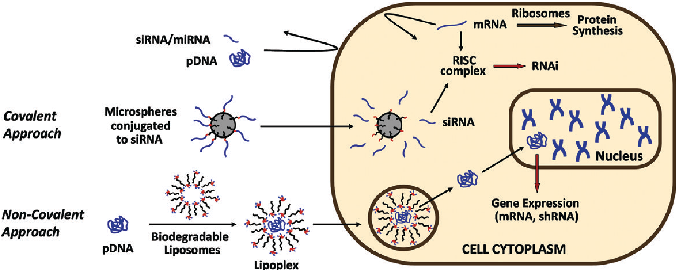

# N

ucleic acids are the foundation stone of all cellular processes. Consequently, the use of DNA or RNA to treat genetic and acquired disorders (so called gene therapy) offers enormous potential benefits. The restitution of defective genes or the

suppression of malignant genes could target a range of diseases, including cancers, inherited diseases (cystic fibrosis, muscular dystrophy, etc.), and viral infections. However, this strategy has a major barrier: the size and charge of nucleic acids largely restricts their transit into eukaryotic cells. Potential strategies to solve this problem include the use of a variety of natural and synthetic nucleic acid carriers. Driven by the aim and ambition of translating this promising therapeutic approach into the clinic, researchers have been actively developing advanced delivery systems for nucleic acids for more than 20 years.

A decade ago we began our investigations of solid-phase techniques to construct families of novel nucleic acid carriers for transfection. We envisaged that the solid-phase synthesis of polycationic dendrimers and derivatized polyamimes would offer distinct advantages over solution phase techniques. Notably in solid phase synthesis we could take advantage of mass action and streamlined purification procedures, while simplifying the handling of compounds with high polarities and plurality of functional groups. Parallel synthesismethods would alsoallow rapidaccessto libraries ofcompounds with improvedpurities and yieldsover comparable solution methodologies and facilitate the development of structure activity relationships. We also twisted the concept of the solid-phase support on its head: we devised miniaturized solid supports that provided an innovative cell delivery vehicle in their own right, carrying covalently conjugated cargos (biomolecules) into cells. In this Account, we summarize the main outcomes of this series of chemically related projects.

1. Introduction

genetic information while a variety of RNAs (mRNA, miRNA, etc.) control the expression of proteins and, through this, cellular function. Therefore, the potential benefits of using

Nucleic acids are at the very center of all cellular processes, with chromosomal DNA serving as a storage device for

1140 ’ ACCOUNTS OF CHEMICAL RESEARCH ’ 1140–1152 ’ 2012 ’ Vol. 45, No. 7 Published on the Web 03/05/2012 www.pubs.acs.org/accounts 10.1021/ar200263c &2012 American Chemical Society

DNA or RNA to treat genetic and acquired disorders (so-called gene therapy) are enormous. The restitution of faulty genes or knocking-down overexpressed malignant genes would allow treatment of disease at its origin, not merely its symptoms. However, the cellular membrane acts as a selective barrier to prevent the uncontrolled trafficking ofbiomoleculessuchasnucleicacids,whosetransitislargely restricted by their size and charge. Because of the potential of gene therapy and the indispensable need to deliver DNA and RNA into cells for biological studies (e.g., for gene function studies, induction of phenotypic modifications, etc.1 4), the development of advanced nucleic acid delivery systems is an active area of research.

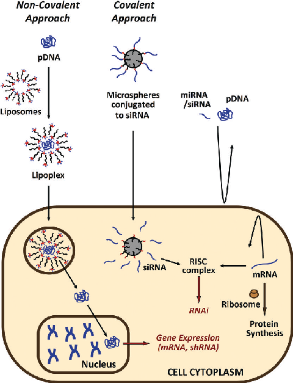

Many DNA/RNA delivery systems are “bioinspired” such

- as the case of viral vectors. Viruses, which require the parasitic use of the cellular enzymatic machinery to replicate, have an extraordinary ability to translocate their genetic material into particular cell types. Researchers have thus made extensive use of these controversial carriers over the last 20 years.3,4 While viral-based carriers lead to high cellular transfection levels and cell-type specificity,5,6 concerns regarding their safety and large-scale production have hampered their therapeutic use.7,8 As such many research groups are intensively working on creating innovative chemical and physical strategies to improve the efficiency, safety, and selectivity of transferring nucleic acids into cells. Among these, nonviral carriers such as cationic lipids, polycationic polymers, and dendrimers9 14 represent promising chemical candidates. However, limited in vivo efficacy, lack of selectivity, and toxicity issues are major obstacles that need to be overcome.15,16

FIGURE 1. Covalent and noncovalent conjugation strategies for the delivery of nucleic acids into cells.

celldeliveryvehiclewhichmightservetocarryDNAorsiRNAinto cells.Assuchourgrouphasmadeconsiderableefforts,usingsolid phase synthesis, to allow the development of a range of carriers toenabletheefficientdeliveryofDNAandRNAintomammalian cells. According to the interactions between the carrier and the nucleic acid, these delivery vehicles can be grouped into covalent and noncovalent conjugation approaches (see Figure 1), and these will be discussed in this Account.

The anticipated benefits of developing novel nucleic acid carriers using solid-phase synthetic techniques attracted our attention to the field. We envisaged that the synthesis of multifunctional polymeric structures such as dendrimers and derivatized polyamines would benefit from the distinctive advantages that solid-phase synthesis could offer, notably the use of mass action to force reactions to completion as well as offering a simplification of purification.12,17,18 We also believed that parallel synthesis methods would allow rapid access to libraries of compounds with improved purities and yields over comparable solution methods while allowing the development of unrivalled structure activity relationships. Solid-phase methods would allow the efficient handling of compounds that are notoriouslydifficulttohandleduetotheirpolaritiesandplurality of functional groups. We also twisted the concept of the solidphase support on its head and imagined that miniaturization of solid supports to a subcellular size could provide an innovative

2. Noncovalent Conjugation Approaches

The pioneering works of Felgner et al.19 and Behr et al.20 in the late 1980s demonstrated that cationic materials were able to complex DNA and deliver it into eukaryotic cells. This straightforward while effective technique is still the most applied methodtoencapsulateanddelivernucleicacidcargosintocells.

2.1. Cationic Lipids. Over the past 20 years, a vast range of cationic lipids based on different scaffolds with various numbers and natures of cationic head groups and lipid moieties, with cleavable and noncleavable linkers, have been generated and applied as nucleic acid carriers.9 13 However, few structure/transfection activity relationships (STARs) have been generally established that allow the

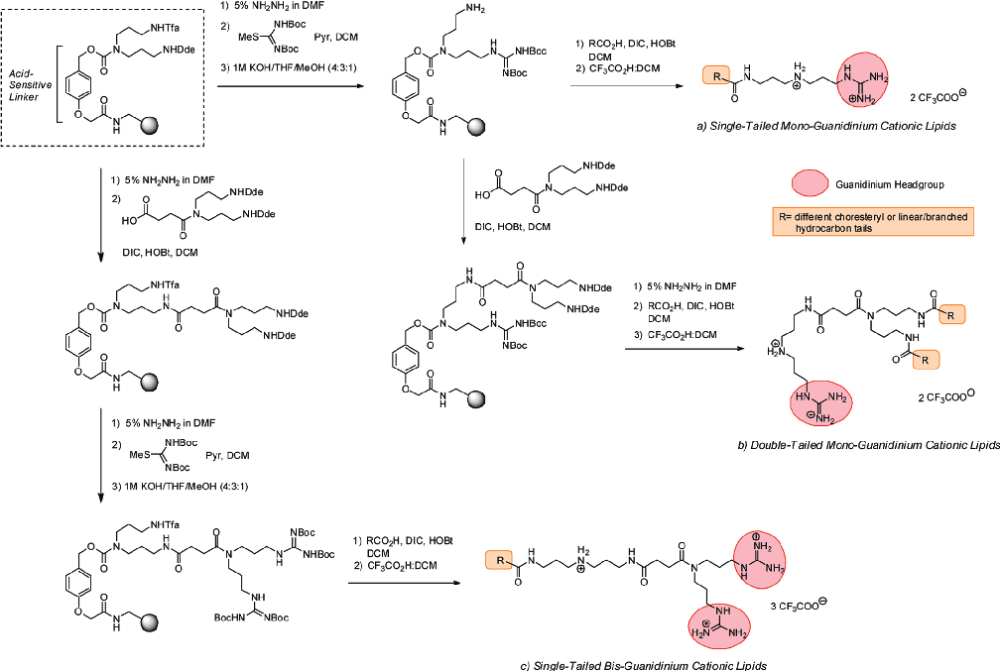

FIGURE 2. Solid-phase synthesis of guanidinium-based cationic lipids by divergent solid-phase assembly.21

cationic headgroups; (ii) a bi- or trifunctional linking moiety; and (iii) different fatty acyl tails.21

optimal features necessary to complex and deliver nucleic acids into cells to be established. This is typically because the families of cationic lipids evaluated do not share similar structural elements, while transfection experiments have typically been run on different cell types, in different media, with varying plasmids, for differing periods of time. All of which makes meaningful comparisons difficult and STARs difficult to generate. There are also major issues with analysis. It is for example inappropriate to analyze transfection based only on nonquantitative microscopic images or plate readers as this cannot distinguish between small numbers of highly transfected cells or large numbers of poorly transfected cells, and ideally flow cytometry should be used.

This approach was the first to illustrate the potential of solid-phase synthesis techniques in the area of transfection and allowed the synthesis of three libraries of polyaminebased cationic lipids: (a) monoguanidinium single-tailed cationic lipids, (b) monoguanidinium double-tailed cationic lipids, and (c) bis-guanidinium single-tailed cationic lipids (see Figure 2). DNA delivery analysis allowed the determination of the optimal efficacy of the bis-guanidinium singletailed lipids (Figure 2c), bearing a myristyl or oleoy moiety; aremarkable findassingle chainedcationiclipids havebeen generally regarded as highly toxic to mammalian cells. This study with a large series of compounds suggests that the general assumption that double-chained cationic lipids are more efficient gene carriers than their single-chained counterparts is not always correct.22

2.1.1. Lipid Polyamine Conjugates. Following the concept that parallel approaches could assist in the rapid determination of framework-specific STARs, in 2004 we reported the solid-phase synthesis and transfection analysis of 89 guanidinium-containing cationic lipids. The synthetic strategy was based on the systematic modification of a modular cationic lipid composed of (i) one or two guanidinium-based

Inspired by these findings,23 we designed a novel family of cationic lipids composed of three cationic head groups in a tripodal conformation and a single hydrophobic tail (see Figure 3A). The synthesis of these reagents was carried out

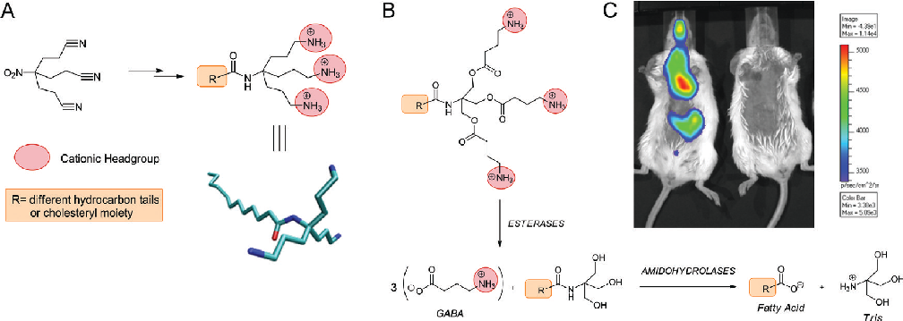

FIGURE3. (A)Synthesisoftripod-likecationiclipids.23(B)Biodegradablecationiclipidanditsprogrammedenzymaticdegradation.25(C)Luminescenceimaging ofanesthetizedmicetransfectedwithaluciferase-expressingplasmidcomplexedtotheoleoylderivativeof(B) (leftmouse)andthenakedplasmid(rightmouse) after intraperitoneal administration of firefly luciferin. Part C reproduced with permission from ref 25. Copyright 2011 the Royal Society of Chemistry.

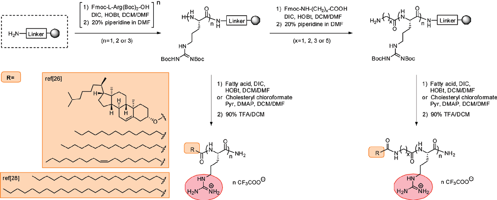

- FIGURE 4. Solid-phase synthesis of arginine-lipid conjugates.26,28

reagent would resolve this problem, as one anticipated issue with current carriers is tissue accumulation. To achieve biodegradability, a novel family of tripodal cationic lipids was designed by introducing ester bonds into the poly branched structure which undergo esterase-mediated and/or intramolecular cyclative cleavage and subsequent intracellular metabolization into γ-butyric acid (GABA), fatty acids and tris(2-amino-2-hydroxymethyl-propane-1,3-diol), an FDA-approved material widely used as a constituent of biological buffers (Figure 3B).25 In addition to a reduction of toxicity, it was hypothesized that ester cleavage would trigger DNA-lipid dissociation thus promoting endosomal destabilization/DNA release. The best-performing compound

using traditional solution synthesis starting from the tris-(2cyanoethyl)nitromethane scaffold.23,24 Sixteen tripod-like cationic lipids bearing fatty tails of different length were generated and their transfection properties tested. Interestingly, transfection analysis showed that the compound consisting of a lignoceryl moiety, the longest fatty tail of the library (24 carbon atoms long), was the most efficient DNA delivery carrier;23 a noteworthy observation as previous studies had avoided going beyond C18 fatty acids.

Many applications of gene therapy will require repeated dosing of the genetic material in association with the delivery reagent. This therefore puts rigorous demands on the lackofcompoundtoxicity.Biodegradabilityofthetransfection

of the 12-member library generated (the oleoyl derivative) showed remarkable transfection efficiency along with no toxicity in a variety of immortalized cells and mouse embryonicstem(mES)cells.25Moreover,preliminaryinvivostudiesin a murine model underlined the potential applicability of this reagent for the delivery of DNA into the respiratory tract

a diethylenetriamine spacer, and palmitoyl tails (C16) were optimal for DNA transfection with this class of cationic conjugates.30

- 2.2. Polycationic Dendrimers. Dendrimers are highly

branched monodisperse polymers grown from a central corefromwhichmultiplewedge-shapeddendriticfragments or dendrons spread out.31 Due to their tunable chemistry and ease of functionalization, dendrimers have great potential in a range of biomedical applications.32 Haensler and Szoka33 were the first to show the ability of PAMAM dendrimers to complex plasmid DNA by electrostatic interactions and efficiently deliver them into cells with relatively low toxicity, a finding that highlighted the versatility and potential of dendritic structures in biological applications.32 Subsequent studies demonstrated that dendriplexes (complexes between dendrimers and DNA/RNA) entered cells by nonspecific endocytosis, while the buffering abilities of the dendrimers were found to be critical for the cargo release from the endosome (proton sponge effect).34 36

The Bradley group was the first to develop the solidphase synthesis of polyamidoamide (PAMAM) dendrimers37 using a divergent two-step procedure strategy (Figure 6A,B). Using this method, PAMAM dendrimers with generations as high as five and with high structural homogeneity were synthesized in spite of the steric constraints imposed on the reaction sites as the dendrimers grow on the resin, while simplifying purification steps and promoting reactions by the use of high concentrations of reagents.

Following this approach, we developed a number of polycationic dendrimers using solid-phase methods,38 40 including polyamidourea bis-dendrons39 and peptoid dendrimers,40 which showed remarkable transfection abilities. The synthesis of the peptoid dendrimers is an example of the versatility of solid-phase synthesis.41 43 These dendritic structures were synthesized with high efficiency on lowloading PS-Rink amide resin using HOBt/DIC chemistry and microwave irradiation44 with the G3 peptoid bisdendron containing 16 external amines (8 primary and 8 secondary on the periphery) demonstrating very high DNA delivery.40

- 3. Covalent Approaches The use of solid supports has been a great tool in allowing chemists to carryout the synthesis of materials such as peptides, polycationic dendrimers and cationic lipids,9 13,17,18 synthesis that would otherwise have presented great challenges if carried out in solution. However, we envisaged that

- (Figure 3C). 2.1.2. Arginine Lipid Conjugates. In 2004, we reported

the combinatorial synthesis of arginine-containing cationic lipids on high-loading beads for single bead based screening application, as described in Figure 4.26 This was achieved by conjugation of one, two, or three arginine head groups to high-loading resins27 via an acid-labile Knorr linker

- (Figure 4). Each sample of resin was further split into five and independently coupled to four different amino acids spacers (with 1, 2, 3, or 5 carbon atoms between the amine and carboxylic acid functionality) or left uncoupled. Each of the 15 scaffolds generated where then split into four and coupled with 4 different lipids (myristic, stearic and oleic acid, and cholesteryl chloroformate). The transfection activity of the cationic lipids was determined using compound cleaved from single beads. Analyses showed that lipids with one arginine headgroup and a cholesteryl moiety produced comparable or even higher DNA transfection activities than the commercially available reagent Effectene (Qiagen).26

Supported by the finding that the transfection efficiency of single-tailed cationic lipids was enhanced by very long lipid tails (>18 carbon atom long)23 a new library of arginine-containing cationiclipidswasconstructedusingarachidic(20carbonatoms long) and lignoceric acids (24 carbon atoms long) as lipid tails.28 Remarkably, the study found a number of cationic lipids with improved transfection abilities relative to the original library, withcompoundsformedbyalignoceryltailand2argininehead groups showing the greatest transfection efficacies.28

To explore further the generation and study of argininelipid conjugates and encouraged by the transfection abilities displayed by gemini surfactants,29 we reported the parallel synthesisofdouble-tailedlipid-arginineconjugatesandtheir evaluation as DNA carriers (Figure 5).30 The solid-phase strategy used to synthesize the 60-member library is summarized in Figure 5 and, as in previous studies, started with the incorporation of mono-, di-, or triarginine scaffolds on a Knorr linker functionalized PS resin, followed by coupling one of four trifunctional spacers (containing symmetrical polyamines) and five fatty acids. This method was used to generate 60 lipo-arginines and allowed the rapid generation of STARs, indicating that 2 arginines (as found previously28),

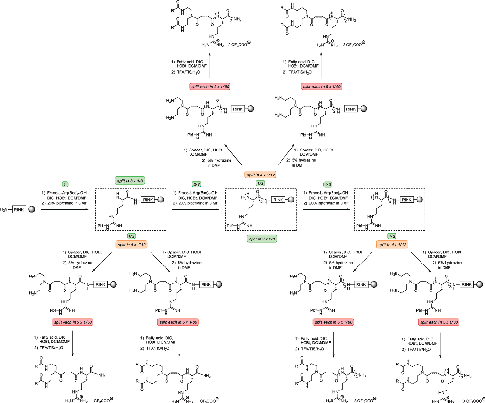

- FIGURE 5. Solid-phase synthesis of arginine-containing double-tailed cationic lipids. Reproduced with permission from ref 30. Copyright 2011 the Royal Society of Chemistry.

solid-supports could play a bigger role in the field of chemical biology if particles could be used not just as a synthetic tool but also as a device to go through cell-membranes. To do this while keeping the distinct advantages associated with solid-phase synthesis,12,18,47 a dramatic reduction in size would be required in order to make them “bio-friendly” allowing them to go through cell membranes in an efficient and nontoxic manner.48

These novel microspheres were demonstrated to be very robust supports, able to be used in multistep organic synthesis. Moreover,theywereabletogothroughcellmembraneswithout demonstratinganycellulartoxicity.49,50,56Indeedthedemonstration of cells with internalized beads being taken through to live viable progeny56 is perhaps the most robust proof, of their innocuous nature, possible. It was found that they were not inside vesicles nor did they alter any gene expression levels significantly.50 These properties49,50 allowed microspheres to be considered as an excellent alternative to other delivery technologies.

With these requirements in mind, efforts were focused on developing protocols to produce high-quality monodisperse cross-linked polystyrene (PS) microspheres ranging from 0.2 to 2 μm in diameter.49 Figure 7 illustrates the differences in scale between standard solid support beads and the microspheres produced by our group as a generic delivery system.

The use of these particles as a delivery system for a number of biologically relevant entities has been performed and the data are testimony to the huge potential of this carrier system. We have reported the use of these polymeric

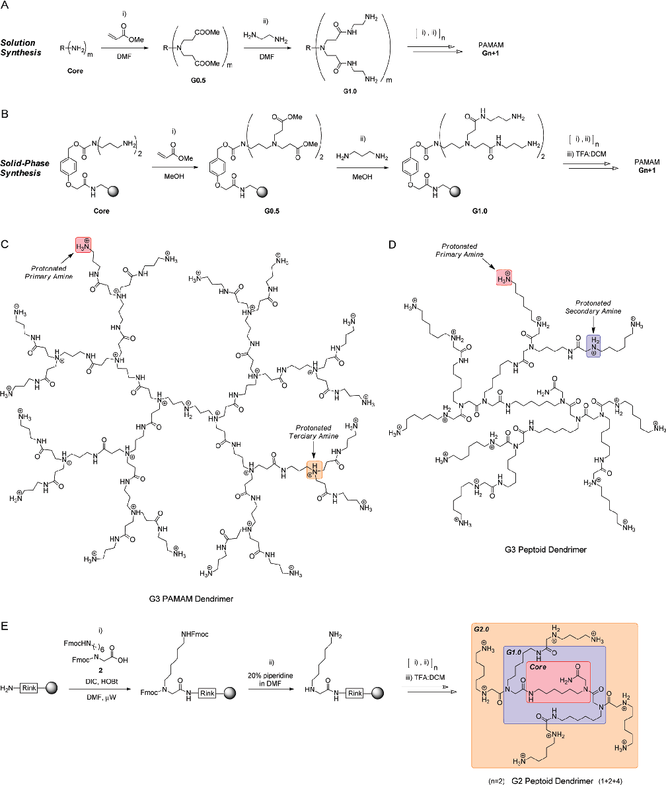

- FIGURE 6. (A) Solution and (B) solid-phase approaches for the synthesis of PAMAM dendrimers. (B) A p-(hydroxymethyl)phenoxy based linker was used to allow acid-mediated cleavage from the resin. Dendrimer generation growth used: (i) 1,4-addition of the nucleophilic core/branch to methyl acrylate followed by (ii) methyl ester amidation with 1,3-propyldiamine.36 (C, D) Structures of the dendrimers synthesized by solid-phase methods: (C)G3 PAMAM bis-dendron and (D) G3 peptoid bis-dendron. (E) Solid-phase synthesis of a G2 peptoid dendrimer40 using monomer 1. n = number of synthetic steps (in brackets = number of monomer units incorporated after each synthetic cycle).

particles for applications such as intracellular in situ sensing (calcium,51 pH detection52), protein delivery53,54 and palladium-mediated intracellular catalysis.55 The microspheres have been successfully internalized by a broad range of cell lines, from adherent to suspension cells, including primary cells and stem cells.46,49,54,56 In the following sections of this Account, we will explain strategies that have been used to deliver DNA and RNA into cells using these carriers.

showed excellent cellular uptake (assessed by flow cytometry) and low cytotoxicity (Figure 8).

We also developed an approach for the conjugation and delivery of plasmid DNA. The strategy used a disulfide moiety to link the pDNA to the microspheres to allow the intracellular release of the bioactive cargo.59 For this purpose, the pDNA was first linearized and tagged with an amino-modified nucleotide (aminoallyl-dUTP) at the 30-end terminal using a deoxynucleotidyltransferase (TdT). This enabled the conjugation of the pDNA to carboxy-functionalized microspheres (Figure 9A) and the expression of a fluorescently labelled functional protein (PEP-YFP) in nondividing naïve lymphocytes T cells after “beadfection”. This delivery method showed higher efficiency and lower toxicity than currently used nonviral methodology for introducing DNA into lymphocytes such as electroporation with Amaxa's Nucleofector (Figure 10).

- 3.1. DNA Functionalized Microspheres. The option to

conjugate nucleic acids to nanomaterials offers the opportunity to deliver genes selectively to tissues or cells for specific biomedical applications and opens up a multitude of novel opportunities to develop new therapies. In recent years, several nanotechnologies have been developed based on quantum dots, gold and silica nanoparticles, carbon nanotubes and lipid based nanoparticles.13

3.2. RNA Functionalized Microspheres. In parallel to the work related to DNA delivery, our group engaged in developing several chemical strategies using microspheres for the efficient intracellular delivery of RNA, especially for gene silencing using small interfering RNA (siRNA).60

The first strategy we developed for nucleic acid delivery was based on the use of a streptavidin biotin system.57 The conjugation of biotinylated DNA to streptavidin-loaded microspheres and subsequent delivery into HeLa cells58

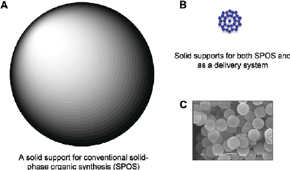

The first strategy reported in this field by our group was based on the functionalization of the polymeric particles with both (i) cleavable and (ii) noncleavable carboxy-based functionalized linkers that allowed the conjugation of aminomodified siRNA (Figure 11).61 Both conjugation approaches were evaluated using a siRNA targeted against EGFP expressed in human cervical cancer (HeLa) cells.61 Cellbased assays showed the efficiencies of these devices to silence protein expression over 72 h without detrimental cytotoxicity.

- FIGURE 7. Solid supports for solid-phase organic synthesis and cellular delivery. Drawings represent (A) a 100 μm bead and (B) thirty-one 2 μm beads at a 5000:1 scale each. (C) Scanning electronic microscope image of 2 μm cross-linked microspheres.

This strategy was enhanced by dual functionalization of the PS microspheres62 which allowed the simultaneous incorporation of a tracking fluorescent label (Cy5) and the

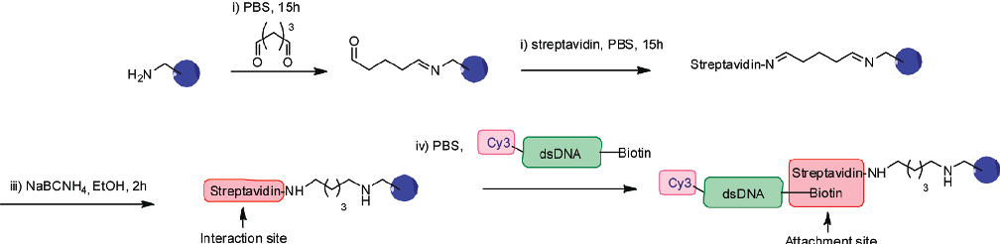

- FIGURE 8. Streptavidin microspheres as carriers of fluorescently labeled dsDNA into mammalian cells.58

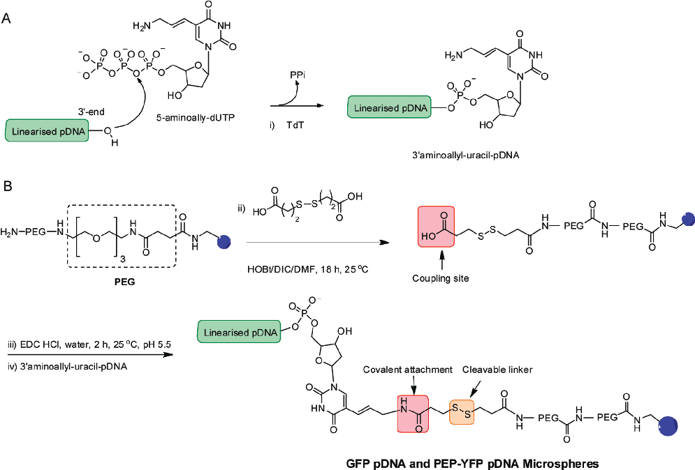

## FIGURE 9. Preparation of encoding pDNA-conjugated microspheres.59 (A) 30-end amino-modification of linearized pDNA with 5-aminoallyl-dUTPand (i) TdT. (B) Loading of pDNA onto pegylated microspheres containing a cleavable linker; (ii) coupling of dicarboxylic disulfide linker usingHOBt/DIC chemistry; (iii) carboxylic acid activation; (iv) amide formation between 30 aminoallyl-uracil-pDNA and activated microspheres.

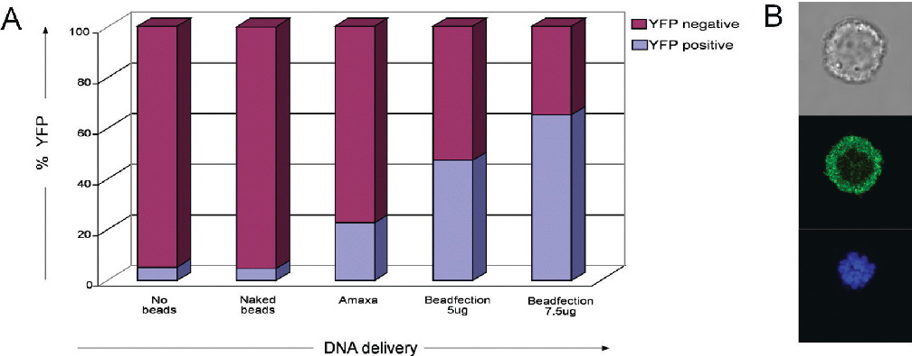

## FIGURE 10. F5.BW hybridoma pDNA beadfection and protein expression: (A) Flow cytometric analysis of YFP expression in untreated cells(No beads), cells beadfected without pDNA conjugated (Naked beads), electroporated cells (Amaxa), and pDNA-microsphere beadfected cells(Beadfection). (B) Confocal microscopy image of a single T hybridoma cell (F5.BW) loaded with pDNA-microspheres expressing PEP-YFP (green).Image taken after 24 h at a 63 magnification (nucleus is stained with DAPI).59

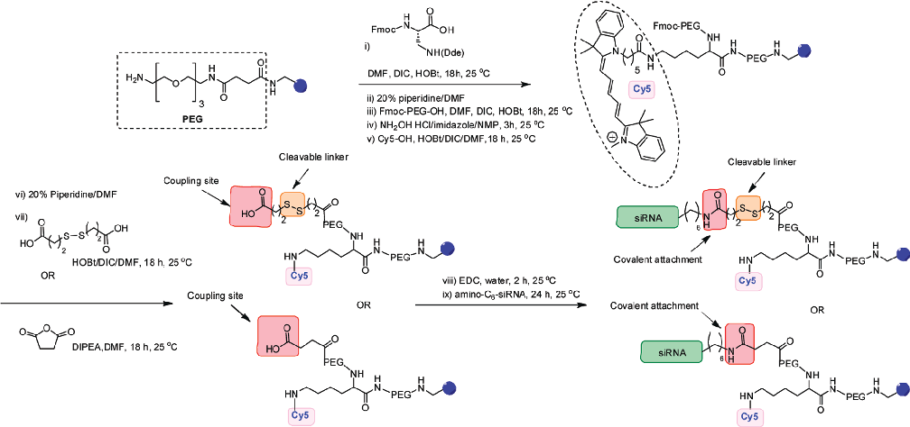

- FIGURE 11. Strategy for the preparation of dual-loaded Cy5-co-siRNA-microspheres with disulfide (cleavable) and amide linkages (noncleavable).61

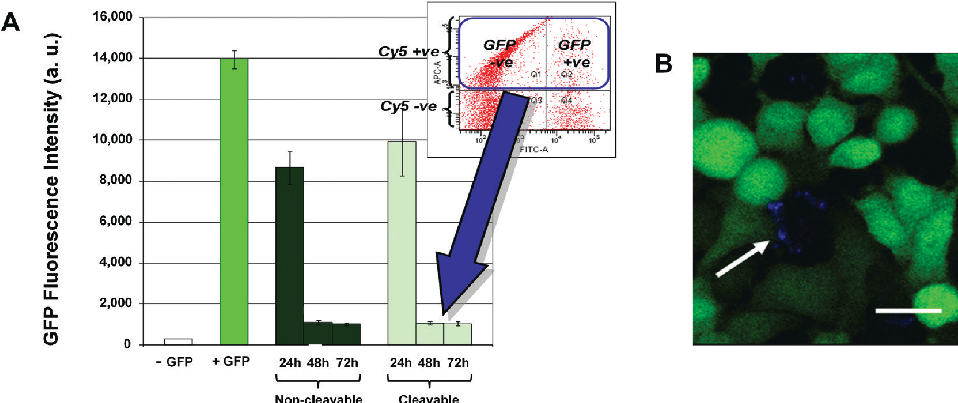

- FIGURE 12. (A) EGFP Intensity in HeLa-EGFP cells after 24, 48, and 72 h incubation with Cy5-co-siRNA microspheres (noncleavable and cleavable). “ GFP” = HeLa cells untreated and not transfected with EGFP; “þ GFP” = HeLa cells untreated and stably transfected with EGFP. “Noncleavable” and “cleavable” GFP intensities are taken from Cy5 positive cells (thus containing microspheres). Inset: Dot plot of EGFP vs Cy5 showing beadfected cells (quadrants Q1 and Q2) have a substantial reduction in EGFP intensity. (B) Microscopy images of HeLa-EGFP cells (green) treated with noncleavablesiRNA Cy5 microspheres (scale bar = 70 μm). Note only the cell containing microspheres (in blue and indicated with a white arrow) have been effectively silenced.61

functional siRNA (Figure 11). This allowed us to select only those cells that contained the delivery vehicle (and thus the siRNAtargetedagainstEGFP)generatinganaccuratepictureof microsphere-induced gene silencing. Experimental data obtained from this strategy demonstrated higher silencing

efficiency than siRNA delivery by standard lipofection methods, with no significant differences in efficiency between the cleavable and noncleavable conjugation strategies (Figure 12).

More recently, another siRNA delivery strategy has been developed by our group, in this case using thiolated

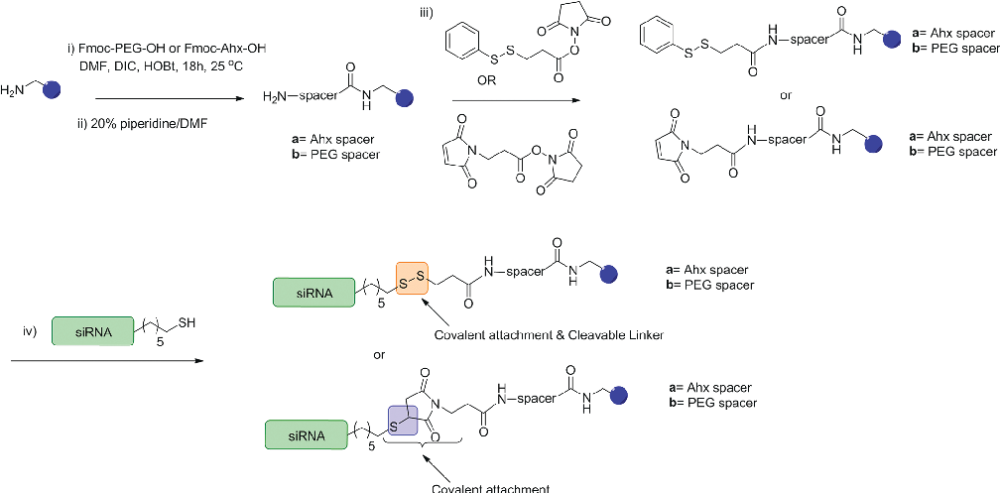

- FIGURE 13. Strategy for conjugation of microspheres with thiolated siRNA.63

cargos and sulfhydryl reactive microspheres63 following a similar approach to the one reported by Dai et al.64 The strategy for the functionalization of microspheres and conjugation of thiolated cargos is shown in Figure 13. Following introduction of the spacer unit, amino groups were coupled to linkers containing maleimide or pyridyldithio groups, generating sulfhydryl reactive microspheres with noncleavable and cleavable linkers, respectively (Figure 13). siRNA sequences targeting mRNA encoding EGFP and bearing a 50-thiol functional groups in the sense strand were then coupled to the microspheres. EGFP stably expressed in HeLa cells was successfully knockeddown usingthis strategy. ThesiRNA-microsphere conjugates comprising a PEG spacer and a noncleavable maleimide linker achievedasilencingcapabilityofapproximately90%,avalue comparable with the silencing efficiency of commercially available lipofection products.

recombinant genes and siRNA/miRNA into somatic cells. With the aim of providing an alternative, more effective therapeutic solution for the treatment of genetic diseases, cancers, and viral infections, over 1700 gene based clinical trials are currently being undertaken.65 Due to the lack of in vivo activity and selectivity of current synthetic vectors, most of these trials are based on viral and viruslike vectors.65 However, many researchers agree that viral vectors are far from ideal and a biodegradable and selective synthetic delivery system would be the optimal delivery solution for nucleic acids.

To do so, continued research on synthetic carriers is fundamental. The challenge is set: to devise multitasking smart carriers able to perform, in a chronological order and without toxicity, the various steps involved in transfection starting from complexing the DNA to targeting the cells of interest. Viruses, with their extraordinary ability to interact withdifferentcellcomponentsinaspatial-temporalmanner, have shown this is possible. In order to be successful, sophisticated multicomponent chemical systems will quite probablyberequired.Theultimatesolutionfor genetherapy relies upon the ability of chemists, biologists, and clinicians in bringing together their knowledge and experiences to develop complex multicomponent carrier-nucleic acid assemblies able to meet the abilities of viruses while bypassing all their disadvantages, and solid-phase methods

- 4. Conclusion and Perspectives Gene silencing by RNA interference (RNAi) mediated by siRNA and miRNA has become a powerful tool for gene analysis and gene therapy. In addition, in order to prolong the RNAi effect, a variety of DNA constructs containing short-hairpin RNA (shRNA) expression systems have been developed. Recent advances in gene therapy are highlighting its potential for the treatment of inherited and acquired genetic/infectious diseases by transferring

provide a powerful tool in the armory of the medicinal chemists.

Bradley's research interests are in the area of chemical medicine, focused on the application of the tools and techniques of chemistry to address biomedical problems and needs, typically with a highthroughput twist. This has led to the commercialization of a number of technologies through licensing and spin-outs. Professor Bradley's group has published widely in the combinatorial and chemical biology arena with over 240 articles published in the form of peer reviewed papers, reviews and book chapters.

Part of the work reported here was supported by grants from the MRC and EPSRC. We are also thankful to Scottish Enterprise (AU-B and MB), the MRC IGMM (AU-B), the Royal Society for a Dorothy Hopkins fellowship (RSM-M), and the Ramón y Cajal Program (JJD-M).

FOOTNOTES

*To whom correspondence should be addressed. E-mail: rmsanchez@ugr.es (R.M.S.-M.); mark.bradley@ed.ac.uk (M.B.).

Note Added after ASAP Publication. This paper was published ASAP on March 5, 2012 with formatting errors in Figures 6 and 13. The corrected version was reposted on March 7, 2012.

REFERENCES

- 1 Pannier, A. K; Shea, L. D. Controlled Release Systems for DNA Delivery. Mol. Ther. 2004, 10, 19–26.
- 2 Akhtar Ibrahim, S.; Benter, F. Nonviral delivery of synthetic siRNAs in vivo. J. Clin. I nvest.2007, 117, 3623–3632.
- 3 Anderson, J. L.; Hope, T. J. Intracellular trafficking of retroviral vectors: obstacles and advances. Gene Ther.2005, 12, 1667–1678.
- 4 Campos, S. K.; Barry, M. A. Current advances and future challenges in Adenoviral vector biology and targeting. Curr. Gene Ther.2007, 7, 189–204.
- 5 Lu, Y. Transcriptionally regulated, prostate-targeted gene therapy for prostate cancer. Adv. Drug Delivery Rev.2009, 61, 572–88.
- 6 Excoffon,K.J.D.A.;Koerber,J.T.;Dickey,D.D.;Murtha,M.;Keshavjee,S.;Kaspar,B.K.; Zabner, J.; Schaffer, D. V. Proc. Natl. Acad. Sci. U.S.A.2009, 106, 3865–3870.
- 7 Woods, N. B.; Bottero, V.; Schmidt, M.; von Kalle, C.; Verma, I. M. Gene therapy: therapeutic gene causing lymphoma. Nature2006, 440, 1123.
- 8 Kustikova, O.; Brugman, M.; Baum, C. The genomic risk of somatic gene therapy. Semin. Cancer Biol.2010, 20, 269–278.
- 9 Martin, B.; Sainlos, M.; Aissaoui, A.; Oudrhiri, N.; Hauchecorne, M.; Vigneron, J.-P.; Lehn, J.-M.; Lehn, P. The design of cationic lipids for gene delivery. Curr. Pharm. Des. 2005, 11, 375–394.
- 10 Bhattacharya, S.; Bajaj, A. Advances in gene delivery through molecular design of cationic lipids. Chem. Commun.2009, 4632–4656.
- 11 Srinivas, R.; Samanta, S.; Chaudhuri, A. Cationic amphiphiles: promising carriers of genetic materials in gene therapy. Chem. Soc. Rev.2009, 38, 3326–3338.
- 12 Unciti-Broceta, A.; Bacon, M.; Bradley, M. Chemical Strategies for the Preparation of Synthetic Transfection Vectors. Top. Curr. Chem.2010, 296, 15–49.
- 13 Mintzer, M. A.; Simanek, E. E. Synthetic Vectors for Gene Delivery. Chem. Rev.2009, 109, 259–302.
- 14 Putnam, D. Polymers for gene delivery across length scales.Nat. Mater.2006,5, 439–451.
- 15 Liu, F.; Qi, H.; Huang, L.; Liu, D. Factors controlling the efficiency of cationic lipid-mediated transfection in vivo via intravenous administration. Gene Ther.1997, 4, 517–523.
- 16 Miller, A. D. The problem with cationic liposome/micelle-based non-viral vector systems for gene therapy. Curr. Med. Chem.2003, 10, 1195–1211.
- 17 Frechet, J. M. J.Polymer-Supported Reactions in Organic Synthesis; Wiley: New York, 1980.
- 18 Diaz-Mochon, J. J.; Tourniaire, G.; Bradley, M. Microarray Platforms for Enzymatic and Cell-based Assays. Chem. Soc. Rev.2007, 36, 449–457.
- 19 Felgner, P. L.; Gadek, T. R.; Holm, M.; Roman, R.; Chan, H. W.; Wenz, M.; Northrop, J. P.; Ringold, G. M.; Danielsen, M. Lipofection: a highly efficient, lipid-mediated DNAtransfection procedure. Proc. Natl. Acad. Sci. U.S.A.1987, 84, 7413–7417.
- 20 Behr, J. P.; Demeneix, B.; Loeffler, J. P.; Perez-Mutul, J. Efficient gene transfer into mammalian primary endocrine cells with lipopolyamine-coated DNA.Proc. Natl. Acad. Sci. U.S.A.1989, 86, 6982–6986.
- 21 Yingyongnarongkul, B.-E.; Howarth, M.; Elliott, T.; Bradley, M. Solid-Phase Synthesis of 89 Polyamine-Based Cationic Lipids for DNA Delivery to Mammalian Cells Chem.;Eur. J. 2004, 10, 463–473.
- 22 Lv, H.; Zhang, S.;Wang, B.; Cui, S.; Yan, J. Toxicity of cationic lipids and cationic polymers in gene delivery. J. Controlled Release2006, 114, 100–109.
- 23 Unciti-Broceta, A.; Holder, E.; Jones, L. J.; Stevenson, B.; Turner, A. R.; Porteous, D. J.; Boyd, A. C.; Bradley, M. Tripod-like cationic lipids as novel gene carriers. J. Med. Chem.2008, 51, 4076–4084.
- 24 Lebreton, S.; How, S. E.; Buchholz, M.; Yingyongnarongkul, B.; Bradley, M. Solid-phase construction: high efficiency dendrimer synthesis using AB(3) isocyanate-type monomers. Tetrahedron2003, 59, 3945–3953.

BIOGRAPHICAL INFORMATION

Asier Unciti-Broceta received an MPharm in Pharmacy and an MSc in Organic and Medicinal Chemistry from the University of Granada(Spain)in1999and2001respectively,andperformedhis PhD in Medicinal Chemistry (same university) sponsored by the Ramón Areces Foundation under the supervision of Prof. Espinosa. In 2005 Asier moved to Edinburgh to work in Prof. Bradley's group

- at the School of Chemistry of the University of Edinburgh. In 2008 he wasawardedaProofofConceptAward(ScottishEnterprise),resultingin the creation of the spin out company Deliverics Ltd. From Oct 2010, Asier holds an academic fellowship in the Edinburgh Cancer Research Centre and now shares his time between academia and industry. Juan José Díaz-Mochón obtained his degree in Pharmacy Sciences from the University of Granada in 1996. He received an Erasmus scholarship to join the Pellicari group in Perugia, Italy. Then he did his PhD in the Department of Organic and Medicinal Chemistry of the University of Granada under the supervision of Prof. Espinosa (2001). In 2002, he joined the Bradley group in Southampton with a Spanish government scholarship, moving to Edinburgh in 2005. In 2008 he was awarded a Proof of Concept Award (Scottish Enterprise) that led to the spin out company DestiNA Genomics. He has recently moved to the University of Granada supported by a Ramón y Cajal Fellowship. Rosario M. Sanchez-Martin graduated in Pharmacy in 1997 from the University of Granada (Spain). Afterwards she obtained a MSc in Pharmacy with Honours and performed her PhD in Prof. Espinosa's Group in the Department of Medicinal Chemistry at Granada University. In 2002, she took on a position as a postdoctoral researcher in Prof. Bradley's. Rosario was awarded a Royal Society Dorothy Hodgkin Fellowship (2006) to build up her independent research at the School of Chemistry in the University of Edinburgh. She has recently moved to the University of Granada where she has taken a Lecturer position in Medicinal Chemistry. Mark Bradley's first academic position was as a Royal Society Research Fellow at the University of Southampton (1991-99) where he was promoted to a Chair in Combinatorial Chemistry in

1997. In February 2005 he moved to the University of Edinburgh as Professor of High-Throughput Chemical Biology. Professor

- 45 Fara, M.; A. Diaz-Mochon, J. J.; Bradley, M. Microwave-assisted coupling with DIC/HOBt for the synthesis of difficult peptoids and fluorescently labeled peptides-a gentle heat goes a long way. Tetrahedron Lett.2006, 47, 1011– 1014.
- 46 Dhaliwal, K.; Alexander, L.; Escher, G.; Unciti-Broceta, A.; Jansen, M.; Mcdonald, N.; Cardenas-Maestre, J. M.; Sanchez-Martin, R.; Simpson, J.; Haslett, C.; Bradley, M. Multi-modal molecular imaging approaches to detect primary cells in preclinical models. Faraday Discuss.2011, 149, 107–114.
- 47 Sanchez-Martin, R. M.; Mittoo, S.; Bradley, M. The impact of combinatorial methodologies on medicinal chemistry. Curr. Top. Med. Chem.2004, 4, 653–669.
- 48 Zhao, F.; Zhao, Y.; Liu, Y.; Chang, X.; Chen, C.; Zhao, Y. Cellular Uptake, Intracellular Trafficking, and Cytotoxicity of Nanomaterials. Small2011, 7, 1322–1337.
- 49 Sanchez-Martin, R. M.; Muzerelle, M.; Chitkul, N.; How, S. E.; Mittoo, S.; Bradley, M. Beadbased cellular analysis, sorting and multiplexing. ChemBioChem2005, 6, 1341–1345.
- 50 Alexander, L. M.; Pernagallo, S.; Livigni, A.; Sanchez-Martin, R. M.; Brickman, J. M.; Bradley,M.Investigationofmicrosphere-mediatedcellulardeliverybychemicalmicroscopic and gene expression analysis. Mol. BioSyst.2010, 6, 399–409.
- 51 Sanchez-Martin, R. M.; Cuttle, M.; Mittoo, S.; Bradley, M. Microsphere-based real-time calcium sensing. Angew. Chem., Int. Ed.2006, 45, 5472–5474.
- 52 Bradley, M.; Alexander, L.; Duncan, K.; Chennaoui, M.; Jones, A. C.; Sanchez-Martin, R. M. pH sensing in living cells using fluorescent microspheres. Bioorg. Med. Chem. Lett. 2008, 18, 313–317.
- 53 Sanchez-Martin, R. M.; Alexander, L.; Muzerelle, M.; Cardenas-Maestre, J. M.; Tsakiridis, A.; Brickman, J. M.; Bradley, M. Microsphere-Mediated Protein Delivery into Cells. ChemBioChem2009, 10, 1453–1456.
- 54 Gennet, N.; Alexander, L. M.; Sanchez-Martin, R. M.; Behrendt, J. M.; Sutherland, A. J.; Brickman, J. M.; Bradley, M.; Li, M. Microspheres as a vehicle for biomolecule delivery to neural stem cells. New Biotechnol.2009, 25, 442–449.
- 55 Yusop, R. M.; Unciti-Broceta, A.; Johansson, E. M.; S anchez-Martín, R. M.; Bradley, M. Palladium-mediated intracellular chemistry. Nat. Chem.2011, 3, 239–243.
- 56 Tsakiridis, A.; Alexander, L. M.; Gennet, N.; Sanchez-Martin, R. M.; Livigni, A.; Li, M.; Bradley, M.; Brickman, J. M. Microsphere-based tracing and molecular delivery in embryonic stem cells. Biomaterials2009, 30, 5853–5861.
- 57 Green, N. M. Avidin and streptavidin. Methods Enzymol.1990, 184, 51–67.
- 58 Bradley, M.; Alexander, L.; Sanchez-Martin, R. M. Cellular uptake of fluorescent labelled biotin-streptavidin microspheres. J. Fluoresc.2008, 18, 733–739.
- 59 Borger, J. G.; Cardenas-Maestre, J. M.; Zamoyska, R.; Sanchez-Martin, R. M. Novel Strategy for Microsphere-Mediated DNA Transfection. Bioconjugate Chem.2011, 22, 1904–1908.
- 60 Fire, A.; Xu, S. Q.; Montgomery, M. K.; Kostas, S. A.; Driver, S. E.; Mello, C. C. Potent and specific genetic interference by double-stranded RNA in Caenorhabditis elegans. Nature1998, 391, 806–811.
- 61 Alexander, L. M.; Sanchez-Martin, R. M.; Bradley, M. Knocking (Anti)-Sense into Cells: The Microsphere Approach to Gene Silencing. Bioconjugate Chem.2009, 20, 422– 426.
- 62 Diaz-Mochon, J. J; Bialy, L.; Bradley, M. Full orthogonality between Dde and Fmoc: The direct synthesis of PNA-peptide conjugates. Org. Lett.2004, 6, 1127–1129.
- 63 Cardenas-Maestre, J. M.; Panadero-Fajardo, S.; Perez-Lopez, A. M.; Sanchez-Martin, R. M. Sulfhydryl reactive microspheres for the efficient delivery of thiolated bioactive cargoes. J. Mater. Chem.2011, 21, 12735–12743.
- 64 Shi Kam, N. W.; Liu, Z.; Dai, H. Functionalization of Carbon Nanotubes via Cleavable DisulfideBondsforEfficientIntracellularDeliveryofsiRNAandPotentGeneSilencing.J.Am. Chem. Soc.2005, 127, 12492–12493.
- 65 http://www.wiley.com/legacy/wileychi/genmed/clinical/.

- 25 Unciti-Broceta, A.; Moggio, L.; Dhaliwal, K.; Pidgeon, L.; Finlayson, K.; Haslett, C.; Bradley, M. Safe and efficient in vitro and in vivo gene delivery: tripodal cationic lipids with programmed biodegradability. J. Mater. Chem.2011, 21, 2154–2158.
- 26 Yingyongnarongkul, B. E.; Howarth, M.; Elliott, T.; Bradley, M. DNA transfection screening from single beads. J. Comb. Chem.2004, 6, 753–760.
- 27 Lebreton, S.; Newcombe, N.; Bradley, M. A novel 1 > 3 C-branched isocyanate monomer for resin amplification - a pseudo PS-PEG high-loading resin. Tetrahedron Lett. 2002, 43, 2479–2482.
- 28 Liberska, A.; Unciti-Broceta, A.; Bradley, M. Very Long-Chain Fatty Tails for Enhanced Transfection. Org. Biomol. Chem.2009, 7, 61–68.
- 29 Kirby, A. J.; Camilleri, P.; Engberts, J. B.; Feiters, M. C.; Nolte, R. J.; S€oderman, O.; Bergsma,M.;Fielden,M.L.;GarciaRodriguez,C.L.;Guedat,P.;Kremer,A.;McGregor,C.; Perrin, C.; Ronsin, G.; Van Eijk, M. C. Gemini surfactants: new synthetic vectors for gene transfection. Angew. Chem., Int. Ed.2003, 42, 1448–1457.
- 30 Liberska, A.; Liliemkapf, A.; Unciti-Broceta, A.; Bradley, M. Solid-Phase Synthesis of Arginine-Based Double-Tailed Cationic Lipopeptides: Potent Nucleic Acid Carriers. Chem. Commun.2011, 47, 12774–12776.
- 31 Tomalia, D. A.; Naylor, A. M.; Goddard, W. A., III. Starburst cascade polymers: Molecular-level control of size, shape, surface chemistry, topology, and flexibility from atoms to macroscopic matter. Angew. Chem., Int. Ed. Engl.1990, 29, 138–175.
- 32 Lee, C. C.; MacKay, J. A.; Fréchet, J. M. J.; Szoka, F. C. Designing dendrimers for biological applications. Nat. Biotechnol.2005, 23, 1517–526.
- 33 Haensler, J.; Szoka, F. C., Jr. Polyamidoamine cascade polymers mediate efficient transfection of cells in culture. Bioconjugate Chem.1993, 4, 372–379.
- 34 Boussif, O.; Lezoualc'h, F.; Zanta, M. A.; Mergny, M. D.; Scherman, D.; Demeneix, B.; Behr, J. P. A versatile vector for gene and oligonucleotide transfer into cells in culture and in vivo: polyethylenimine. Proc. Natl. Acad. Sci. U.S.A.1995, 92, 7297–7301.
- 35 Sonawane, N. D.; Szoka, F. C., Jr.; Verkman, A. S. Chloride Accumulation and Swelling in Endosomes Enhances DNA Transfer by Polyamine-DNA Polyplexes. J. Biol. Chem. 2003, 278, 44826–44831.
- 36 Akinc, A.; Thomas, M.; Klibanov, A. M.; Langer, R. Exploring polyethylenimine-mediated DNA transfection and the proton sponge hypothesis. J. Gene Med.2005, 7, 657–63.
- 37 Swali, V.; Wells, N.J.;Langley, G.J.;Bradley,M.Solid-PhaseDendrimer Synthesisand the GenerationofSuper-High-LoadingResinBeadsfor CombinatorialChemistry.J.Org.Chem. 1997, 62, 4902–4903.
- 38 How, S. E.; Yingyongnarongkul, B.; Fara, M. A.; Diaz-Mochon, J. J.; Mittoo, S.; Bradley, M. Polyplexes and lipoplexes for mammalian gene delivery: from traditional to microarray screening. Comb. Chem. High Throughput Screening2004, 7, 423–430.
- 39 How, S. E.;Unciti-Broceta, A.; Sanchez-Martin, R. M.;Bradley, M. Solid-phase synthesisof a lysine-capped bis-dendron with remarkable DNA delivery abilities. Org. Biomol. Chem. 2008, 6, 2266–2269.
- 40 Diaz-Mochon, J. J.; Fara,M.A.;Sanchez-Martin,R. M.; Bradley,M. Peptoiddendrimers; microwave-assisted solid-phase synthesis and transfection agent evaluation. Tetrahedron Lett.2008, 49, 923–926.
- 41 Culf, A. S.; Ouellette, R. J. Solid-Phase Synthesis of N-Substituted Glycine Oligomers (R-Peptoids) and Derivatives. Molecules2010, 15, 5282–5335.
- 42 Unciti-Broceta, A.; Diezmann, F.; Ou-Yang, C. Y.; Fara, M. A.; Bradley, M. Synthesis, Penetrability and Intracellular Targeting of Fluorescein-Tagged Peptoids and PeptidePeptoid Hybrids. Bioorg. Med. Chem.2009, 17, 959–966.
- 43 Dhaliwal, K.; Escher, G.; Unciti-Broceta, A.; Mcdonald, N.; Simpson, J.; Haslett, C.; Bradley Far red and NIR dye-peptoid conjugates for efficient immune cell labelling and tracking in preclinical models. MedChemComm2011, 2, 1050–1053.
- 44 Diaz-Mochon, J. J.; Bialy, L.; Watson, J.; Sanchez-Martin, R. M.; Bradley, M. Synthesis and cellular uptake of cell delivering PNA peptide conjugates. Chem. Commun.2005, 3316–3318.

