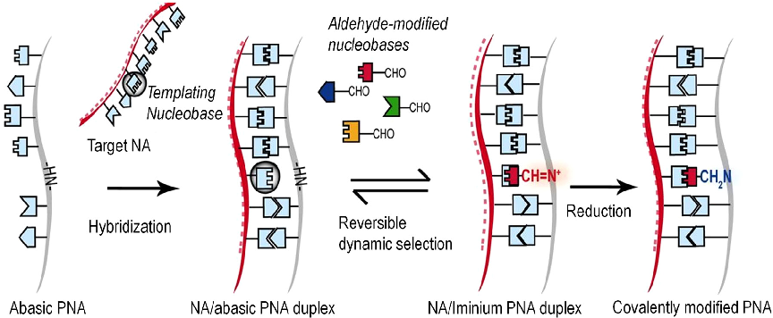
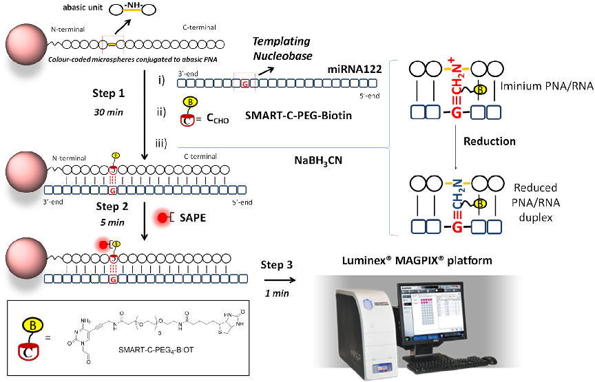
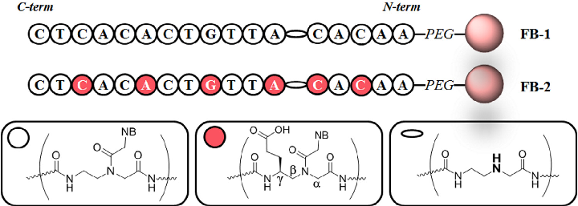
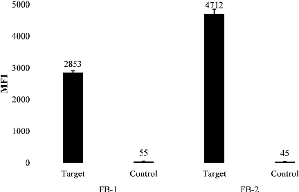
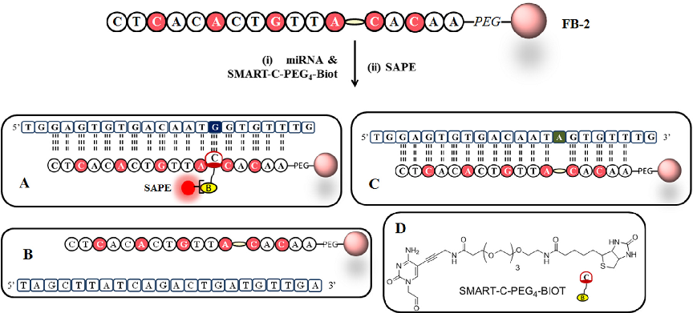
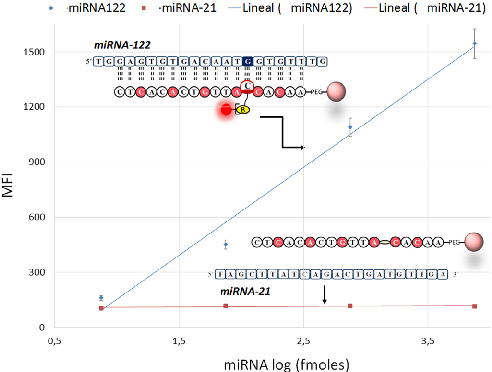
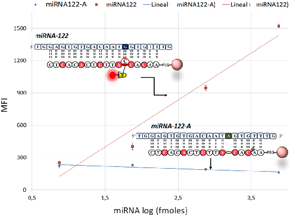

Talanta 161 (2016) 489–496

Contents lists available at ScienceDirect

Talanta

journal homepage: www.elsevier.com/locate/talanta

Novel bead-based platform for direct detection of unlabelled nucleic acids through Single Nucleobase Labelling

Seshasailam Venkateswarana,1, Maria Angélica Luque-González b,c,1, Mavys Tabraue-Chávezd, Mario Antonio Farad,e, Barbara López-Longarela d, Victoria Cano-Cortesb,c, Francisco Javier López-Delgado b,c, Rosario María Sánchez-Martín b,c, Hugh Ilyine e, Mark Bradley a, Salvatore Pernagallo d,e,n, Juan José Díaz-Mochón b,c,e,nn

a School of Chemistry, EaStCHEM, University of Edinburgh, King's Buildings, West Mains Road, Edinburgh EH9 3FJ, United Kingdom b Pfizer-Universidad de Granada-Junta de Andalucía Centre for Genomics and Oncological Research (GENYO), Parque Tecnológico de Ciencias de la Salud (PTS), Avenida de la Ilustración 114, Granada 18016, Spain c Faculty of Pharmacy, University of Granada, Campus Cartuja s/n, Granada 18071, Spain d DestiNA Genomica S.L. Parque Tecnológico Ciencias de la Salud (PTS), Avenida de la Innovación 1, Edificio BIC, Armilla, Granada 18016, Spain e DestiNA Genomics Ltd., 7-11 Melville St, Edinburgh, EH3 7PE United Kingdom

a r t i c l e i n f o

Article history: Received 15 June 2016 Received in revised form 19 August 2016 Accepted 28 August 2016 Available online 31 August 2016

Keywords: Dynamic chemistry Peptide nucleic acid (PNA) Magnetic microspheres Nucleic acid MicroRNA (miRNA) Nucleic acid test (NAT) Single Nucleobase Labelling (SNL)

a b s t r a c t

Over the last decade, circulating microRNAs have received attention as diagnostic and prognostic biomarkers. In particular, microRNA122 has been demonstrated to be an early and more sensitive indicator of drug-induced liver injury than the widely used biomarkers such as alanine aminotransferase and aspartate aminotransferase. Recently, microRNA122 has been used in vitro to assess the cellular toxicity of new drugs and as a biomarker for the development of a rapid test for drug overdose/liver damage. In this proof-of-concept study, we report a PCR-free and label-free detection method that has a limit of detection (3 standard deviations) of 15 fmoles of microRNA122, by integrating a dynamic chemical approach for “Single Nucleobase Labelling” with a bead-based platform (Luminex

s

) thereby, in principle, demonstrating the exciting prospect of rapid and accurate profiling of any microRNAs related to diseases and toxicology.

& 2016 Elsevier B.V. All rights reserved.

1. Introduction

MicroRNAs (miRNAs) are small non-coding RNAs of 19–24 nucleotides in length that regulate gene expression by base pairing with the 3′-untranslated region of a target gene's messenger RNA (mRNA), leading to degradation and/or translational repression of that gene [1–3]. miRNAs are implicated in many biological events and their deregulation is associated with many serious disease states [4,5].

n Corresponding author at: DestiNA Genomica S.L. Parque Tecnológico Ciencias de la Salud (PTS), Avenida de la Innovación 1, Edificio BIC, Armilla, 18016 Granada, Spain.

nn Corresponding author at: Pfizer-Universidad de Granada-Junta de Andalucía Centre for Genomics and Oncological Research (GENYO), Parque Tecnológico de Ciencias de la Salud (PTS), Avenida de la Ilustración 114, 18016 Granada, Spain.

E-mail addresses: salvatore@destinagenomics.com (S. Pernagallo), juanjose.diaz@genyo.es (J.J. Díaz-Mochón).

1 These authors contributed equally and should be considered co-first authors.

http://dx.doi.org/10.1016/j.talanta.2016.08.072 0039-9140/& 2016 Elsevier B.V. All rights reserved.

miRNAs while present in biological fluids in a stable and reproducible manner are differentially expressed under pathological conditions, such that the expression patterns of circulating miRNAs can thus be used as fingerprints for various diseases [6,7]. As such miRNAs possess ideal characteristics of a biomarker – i.e., they can be specific to the disease or pathology of interest, reliably indicate disease before clinical symptoms appear, be sensitive to changes in the pathology (disease progression or therapeutic response), and also allow detection from samples of biological fluids (e.g. blood, urine) [8–14]. Additionally, circulating miRNAs are remarkably stable in body fluids, resisting ribonucleases and variations in physicochemical conditions such as pH [15].

Recently, microRNA122 (miRNA122) has been found to be substantially elevated in the plasma of patients with drug-induced liver injury (DILI), and can be detected much earlier than current clinical biomarkers such as alanine aminotransferase (ALT) and aspartate aminotransferase (AST) [16,17]. ALT and AST levels increase 12–16 h post overdose of drugs like acetaminophen, while miRNA122 can detect liver injury within 4 h [18]. Moreover,

miRNA122 has been demonstrated as an in vitro marker of druginduced cellular toxicity for acetaminophen and diclofenac, with sensitivity similar to conventional assays that measure lactate dehydrogenase activity and intracellular adenosine triphosphate. Thus, miRNA122, as a biomarker, also has the potential to be used during early phases of the drug development processes [19].

Therefore, the development of a rapid test for miRNA122 would be useful in healthcare and drug development [18,20,21]. However, technical difficulties to perform robust and comparable profiling of circulating miRNAs have impeded progress to develop an approved clinical diagnostic assay [22,23]. A reliable detection platform which removes laborious sample-preparation steps (e.g., enzymatic steps for PCR-based amplifications) would represent a step forward, and allow miRNAs to be part of the approved clinical diagnostic test arsenal.

To date, most of the detection methods developed for direct detection of unlabelled nucleic acids are based just on hybridisation events using tagged probes. There are sandwich hybridisation approaches with two probes [24], which can also be assisted by ligases to elongate short sequences of miRNAs [25,26], methods based on triple-stem DNA probes [27] and methods which use a single probe to create specific duplexes which can then be identified either by modified surfaces, [28,29] or p19 protein that specifically recognises nucleic acid duplexes [30,31]. These molecular assays based on hybridisation without further molecular recognition are then integrated within different detection systems such as electrochemical sensors [27,29,31–33] and fluorescencebased platforms [25] with variable limit of detections. In particular, there are three reports which claim the direct detection of miRNA122 using electrochemical sensors with limit of detections of 2.7 pmoles [32], 1 pmole [33] and sub-attomole [27] respectively.

This work describes the potential for direct quantification of miRNAs by combining a PCR-free approach that enables detection of nucleic acids using dynamic chemistry [34–36], combined with a bead-based platform (Luminex

s

) already in wide clinical use [37– 40]. Nucleic acid analysis by dynamic chemistry has already been successfully used for genotyping Single Nucleotide Polymorphisms (SNPs) [35] and here we describe the application of this technology to detect circulating miRNAs. Its high specificity together with its advantage of PCR- and label-free testing of nucleic acids is applied here to detect unlabelled miRNA sequences through what we describe as ‘Single Nucleobase Labelling’ (SNL) defined as “a non-enzymatic labelling of nucleic acids using dynamic chemistry” and which is ideal for short nucleic acid strands.

Nucleic acid analysis by dynamic chemistry harnesses Watson– Crick base pairing to template a dynamic reaction on a strand of an

Abasic peptide nucleic acid [PNA; a DNA mimic in which the sugarphosphate backbone is replaced with N-(2-aminoethyl) glycine]. This is achieved by hybridising an Abasic PNA probe to the target nucleic acid strand such that a nucleobase-free position on the PNA (a so-called ‘blank’ position) lies opposite to a nucleotide on the nucleic acid strand. The reversible reaction, between an aldehyde-modified nucleobase (SMART Nucleobases) and a free secondary amine on the PNA probe, generates an iminium intermediate which can be reduced to a stable tertiary amine, (reaction known as reductive amination). Four iminium species (one for each base) will be thus generated, but the one with the correct hydrogen bonding motif (obeying Watson–Crick base-pairing) will be the most thermodynamically stable product [34] (Fig. 1). Moreover, complementary nucleic acid strands act also as catalysts as accelerate the rate of the reductive amination. When there is not complementary nucleic strands, reductive aminations do not happen within the assay timeframe. In summary, this technology requires two specific molecular events to create a signal, (i) perfect hybridisation between nucleic acid strands and Abasic PNA and (ii) specific molecular recognition, through Watson–Crick base-pairing rules, by the SMART Nucleobase (Fig. 1).

With these features in mind, we aimed to use this technology for the direct detection and quantification of miRNAs. In this case, native miRNAs act as template molecules which drive the specific incorporation of a labelled SMART Nucleobase onto a specific Abasic PNA. In cases where there are other nucleic acids which are not fully complementary to the Abasic PNA, reaction does not happen. Quantification is also possible as the yield of the reaction depends on the amount of templating miRNA.

s

To achieve the merging of this technology with Luminex

beadbased detection platform, Abasic PNA probes complementary to target miRNAs were covalently bound to Luminex

s

microspheres (Fig. 2). Labelling was achieved via an aldehyde-modified nucleobase tagged with biotin (Fig. 2, Step 1) and Streptavidin-R-Phycoerythrin Conjugate (SAPE) (Fig. 2, Step 2) to allow microspheres to be read using a Luminex

s

s

platform (Fig. 2, Step 3). Validation of the assays developed was further confirmed using two alternative technologies, i.e., flow cytometry and confocal microscopy.

MAGPIX

2. Experimental section

2.1. General

Carboxylated magnetic microspheres (MagPlex, MC10012) and

Fig. 1. Schematic representation of dynamic chemistry for nucleic acids analysis. (From [34]. Copyright Wiley-VCH Verlag GmbH & Co. KGaA, Reproduced with permission).

s

s

Fig. 2. Merging of dynamic chemistry with Luminex

platform for ‘Single Nucleobase Labelling’ (SNL) of miRNAs. Step 1: modification of the Abasic PNA, which is conjugated to colour-encoded microspheres, with the biotinylated aldehyde-modified cytosine (SMART-C-PEG-Biotin). This process requires three steps: (i) perfect hybridisation between the Abasic PNA and miRNA122; (ii) generation of a reversible iminium specie between the secondary amine of the “Abasic” unit and the aldehyde group of the SMART-C-PEG-Biotin nucleobase driven by the templating nucleobase. In this case, the templating guanine can just template the incorporation of an aldehydemodified cytosine as otherwise the iminium specie is not stable enough to be reduced and (iii) reduction of the iminium specie by sodium cyanoborohydride to yield to a non-reversible tertiary amine within the PNA conjugated to the microspheres [34]. Step 2: microsphere labelling with Streptavidin-R-Phycoerythrin Conjugate (SAPE). Step 3 fluorescent detection using a Luminex

MAGPIX

s

s

platform (45 min total time, including washings). (For interpretation of the references to color in this figure legend, the reader is referred to the web version of this article.)

MAGPIX

MagPlex-TAG microspheres with surface-bound oligonucleotide (MTAG-A012) were obtained from Luminex

s

Corporation (Netherlands) and stored at 4 °C in the dark. All chemicals were obtained from Sigma Aldrich and used as received. SCD buffer was prepared from 2 � saline sodium citrate (SSC) and 0.1% sodium dodecyl sulphate (SDS) with the pH adjusted to 6.0 using HCl. All synthetic DNA oligomers (desalted) were purchased from Microsynth AG (Balgach, Switzerland). Streptavidin-R-Phycoerythrin Conjugate (SAPE, 1 mg/mL) was purchased from Thermo Fisher Scientific.

2.2. Instrumentation

Abasic PNA probe concentrations were determined using a Thermo Fisher NanoDrop 1000 spectrophotometer. Hybridisation and Single Nucleobase Labelling were conducted in a Techne Thermal cycler (TC-5000). Flow cytometry was conducted using a BD FACSCanto II λex 488 nm and emission collected with a 585/42 band pass filter. Confocal imaging was performed with a Zeiss LSM 710 confocal laser scanning microscope using the Zeiss ZEN 2010 software. A Petroff-Hausser Counting Chamber (Hausser Scientific) was used to count the microspheres.

2.3. Probes and SMART-C-PEG-biotin

Two peptide nucleic acids probes containing an Abasic position (DGL-122-U and DGL-122-C) and terminated with an amino-pegylated group were designed and synthesised by standard solid phase chemistry on an INTAVIS MultiPep Synthesiser (Intavis AG GmH, Germany) (Table 1). The 18-mer sequences were designed to allow anti-parallel hybridisation with miRNA122 strands (Table 2).

Table 1 DGL probes.

Reference Oligomer sequence (N′–C′) N′-modification

DGL-122-U xx AAC AC _A TTG TCA CAC TC Amino DGL-122-C xx AAC* AC*_A* TTG* TCA* CAC* TC Amino

'xx': PEG linker (Fig. S3); '*': PNA nucleobase containing a “propanoic acid side chain” (negative charge); '_': abase monomer (blank) (see Fig. 1, Fig. 2 and S3).

The Abasic site was positioned at þ13 from their C-terminal end so that post-hybridisation, the mature miRNA122 strands, present a guanine at that position (þ15 from the 5′-terminus) thereby allowing incorporation of a cytosine into the Abasic pocket (Table 2, nucleobases shown in red). Aldehyde-modified cytosines, tagged with a biotin by either a tetraethylenglycol or a dodecylethylenglycol spacer (SMART-C-PEG4-Biot or SMART-C-PEG12Biot), (ESI, Figs. S1 and S2), were prepared following the synthetic route described elsewhere [41].

s

2.4. Functionalization of Luminex

microspheres with probes FB-1 and FB-2

DGL-122-U and DGL-122-C were coupled to MagPlex carboxylated microspheres (MC10012) to give the functionalised beads, FB-1 and FB-2 respectively. Briefly, one million microspheres were suspended in MES Buffer (20 mL, pH�4.5) in an eppendorf tube and freshly prepared solutions of EDC (10 mg/mL in de-ionised water, 10 mL) and DGL probe (0.1 mM, 5 mL) were added and vortexed followed by incubation (30 min, shaking in the dark). The microspheres were washed ( � 2 0.02% Tween-20, 200 mL and � 2,

Table 2 Single-stranded DNA oligonucleotides.

'In red': The nucleobase at þ15 from the 5′-terminus of miRNA122 under interrogation via dynamic chemistry with biotinylated SMART nucleobases.

0.1% SDS, 200 mL), re-suspended in water (�1 million microspheres per 100 mL) and diluted in SCD buffer (100 microspheres per mL).

2.5. Hybridisation assessment of FB-1 and FB-2 microspheres

The performance of FB-1 and FB-2 were confirmed by hybridising a complementary oligonucleotide labelled at their amino-5′-terminus with biotin (miRNA122-biot) (Table 2), followed by labelling with SAPE and analysing on a MAGPIX

s

. Briefly, 12.5 mL of either FB-1 or FB-2 (100 microspheres per mL), 30 mL of SCD buffer and 7.5 mL of 100 nM miRNA122-biot, were mixed in a 200 mL eppendorf tube. Hybridisation was conducted at 41° C for 20 min, followed by addition of 10 mL of SAPE (20 mg / mL), vortexed for 1 s and incubated at 41 °C for 5 min in a thermal cycler prior to analysis. A non-complementary biotinylated synthetic oligonucleotide (miRNA21-biot) was used as a negative control (Table 2).

2.6. Single Nucleobase Labelling (SNL) by dynamic chemistry

23.5 mL of SCD buffer, 12.5 mL of the functionalised microspheres FB-2 (dispersed in SCD buffer, containing 100 microspheres per mL), 4 mL of SMART-C-PEG4-Biotin (500 mM), 7.5 mL of either miRNA122 or controls miRNA21 and miRNA122-A (to give final concentrations of 1 mM, 100 nM, 10 nM or 1 nM) and 2.5 mL of reducing agent, sodium cyanoborohydride (20 mM) were added in a 200 mL eppendorf, vortexed and incubated (41 °C for 30 min, thermal cycler). The microspheres were then washed twice with SCD buffer, re-suspended (in 50 mL of SCD buffer), followed by addition of 10 mL of SAPE (20 mg/mL), vortexing and incubation in a thermal cycler (41 °C for 5 min) before analysing with the MAGPIX

s

instrument or preparation for flow cytometry or confocal microscopy.

s

2.7. Luminex

s

MAGPIX

s

instrument was calibrated using the verification and calibration kit and standard instructions of the manufacturer, with detection of phycoerythrin (PE) using a LED (λex 511 nm727 nm) and a CCD camera. Microspheres post-hybridisation or Single Nucleobase Labelling were vortexed (1 s) and analysed in the MAGPIX

The MAGPIX

s

System (injection volume 20 mL) with a minimum microsphere count of 100. 2.8. Flow cytometry

Following Single Nucleobase Labelling with 7500, 750, 75 and

7.5 fmoles of miRNA122 or miRNA21 as a negative control and SAPE incubation, the microspheres were washed twice with SCD buffer, resuspended in 150 mL of SCD. The results of flow cytometry were analysed with Flowjo (version 7.2.4).

3. Results and discussion

3.1. Polyanionic Abasic PNA probes improve hybridisation efficiency

It is well known that standard PNA molecules tend to adopt collapsed conformations, due to their neutral backbone and hydrophobic interactions between nucleobases [42–44]. In the case of Abasic PNA probes bound to polystyrene microspheres, these conformations were anticipated to be further enhanced due to hydrophobic interactions between polymers and PNA oligomers. In order to resolve this, we hypothesised that adding anionic groups across the probe backbone would reduce this tendency, also reducing self-aggregation. Polyanionic Abasic PNA probes bound to microspheres would thus be more readily available to hybridise complementary nucleic acid strands and, hence, allow more efficient dynamic incorporation of the SMART Nucleobases. To achieve this, PNA building blocks containing propanoic acid chains at gamma positions with S-configuration were chosen (Fig. 3) [45–47].

Two DGL probes, both containing the same sequence of nucleobases to allow hybridisation to the mature miRNA122 strand were prepared, with one containing unmodified PNA monomers (DGL-122-U) and the other carrying six PNA monomers containing the propanoic acid modifications at the gamma positions (DGL122-C) (Table 1) were conjugated to MagPlex microspheres (MC10012) to give FB-1 and FB-2 respectively (Fig. 3). Hybridisation performance of microspheres FB-1 and FB-2 were assessed by hybridisation with miRNA122-biot or the non-complimentary control, miRNA21-biot, (750 fmoles in a reaction volume of 50 mL, i.e., 15 nM) followed by SAPE labelling. Microspheres FB-2 (functionalised with DGL-122-C) showed better hybridisation efficiency than FB-1 (functionalised with DGL-122-U) and hence were chosen for further experiments (Fig. 4). Propanoic acid groups improve the hybridisation feature of DGL-122 probes due to (i) the chiral configuration which creates a right-handed duplex and (ii) the electrostatic repulsion provided by the negative charges distributed across its backbone.

3.2. Detection of miRNA122 using Single Nucleobase Labelling

Once hybridisation performance of DGL probes on the magnetic

Fig. 3. Two DGL probes (Table 1) with the same sequence of nucleobases complementary to the mature miRNA122 strand were conjugated to MagPlex microspheres (FB-1 and FB-2). FB-1 contained unmodified PNA monomers (white circles) and FB-2 carried six PNA monomers containing chiral modifications at gamma positions based with propanoic acid (red circles). The yellow ellipse shows, the Abasic unit (blank). (For interpretation of the references to color in this figure legend, the reader is referred to the web version of this article.)

s

Fig. 4. Median fluorescence intensities (MFI) obtained from MAGPIX

after hybridisation and SAPE treatment using FB-1 and FB-2. Target: miRNA122-biot; control: miRNA21-biot. n¼3.

microspheres were established, Single Nucleobase Labelling was conducted using FB-2 microspheres and the SMART-C-PEG4-Biot base in varying quantities (7500, 750, 75 and 7.5 fmoles in a total reaction volume of 50 mL, i.e., 150, 15, 1.5 and 0.15 nM) of

unlabelled miRNA122 (Fig. 5A), which fully matches Abasic PNA sequences on FB-2, and miRNA21, negative control (Fig. 5B). After SAPE labelling, microsphere samples were analysed using MAGPIX

s

(Fig. 6). The plot of MFI versus miRNAs concentrations showed a linear correlation for the target (Fig. 6), confirming the suitability of Single Nucleobase Labelling to detect unlabelled nucleic acids. The experiments were repeated five times presenting coefficient of variant for each condition, ranging from 10% to 15% (see ESI, Table S1). The average signal to background ratios obtained were 14.271.5, 9.770.7, 4.270.6 and 1.670.3, for the four miRNAs concentrations (signal¼MFI of target and background¼MFI of negative control) with a detection limit of 15 fmoles (0.3 nM). In order to know if whether this is adequate to analyse relevant clinical samples, we have reviewed the latest publications regarding miRNA122. Dear et al., the leading group proposing the use of miRNA122 as biomarker of drug toxicity, has very recently reported a mean value of 71.3 million copies of miRNA122 per mL of serum (95% confidence interval [CI] 29.3– 113.2 million) in a group of 18 healthy volunteers 71 million miRNA122 copies per mL of non-intoxicated patients is equivalent to around 0.15 fmoles [48]. As James Dear previously reported [16,20,21], the increases in miRNA122 level of patients with liver

Fig. 5. Representation of Single Nucleobase Labelling (SNL) using SMART-C-PEG4-Biot and MagPlex microspheres. (A) FB-2 MagPlex carboxylated microspheres, which are conjugated to DGL-122-C, with its unlabelled complementary nucleic acid sequence miRNA122, which template, through the guanine nucleobase, the incorporation of the SMART-C-PEG4-Biot nucleobase into the Abasic position. After SAPE labelling, microspheres thus become fluorescent and capable of being detected by MAGPIX. (B) FB-2 microspheres with its non-complementary sequence miRNA21. The lack of duplex formation avoids the dynamic reaction between the Abasic position and SMART-C-PEG4Biot. (C) FB-2 microspheres hybridise with its unlabelled complementary nucleic acid sequence, which in this case, would template the incorporation of a SMART-thymine nucleobase but not the SMART-C-PEG4-Biot. Therefore, after SAPE labelling, microspheres are not labelled by SAPE. (D) Structure of biotinylated SMART-Cytosine Nucleobase (SMART-C-PEG4-Biot).

Fig. 6. Direct detection of nucleic acids by dynamic chemistry. Median fluorescence intensities (MFI) obtained using MAGPIX

s

after Single Nucleobase Labelling (SNL) and SAPE treatment, reveal selective incorporation of the SMART base only for the target. FB-2, SMART-C-PEG4-Biot, and four quantities (7500, 750, 75 and 7.5 fmoles) of unlabelled target (miRNA122) and control (miRNA21) were used. n¼5.

injury from acetaminophen toxicity are from 100- to 10,000-fold higher when compared with basal levels. Under the methodology presented, it would then require 3 mL of serum, obtained from 7.2 mL of blood to be within its limit of quantification.

The chain length of the PEG spacer in the SMART nucleobase did not have an influence on the detection limit when two biotinylated SMART Nucleobases, SMART-C-PEG4-Biot and SMART-CPEG12-Biot, were compared (ESI, Section S1, Fig. S4).

3.3. Specificity assessment of Single Nucleobase Labelling

The specificity was investigated using a fully complementary target sequence (miRNA122) (Fig. 5A) and a target containing a single nucleotide mismatch (miRNA122-A) (Fig. 5C) which presents an adenosine in front of the Abasic PNA position instead of a guanine (Table 2). When the perfectly complementary target miRNA122 was used the signal showed a linear correlation with miRNA122 concentration while with miRNA122-A the signals were unaffected and comparable to that of the non-complementary strand. These results show the high discrimination capability offered by this approach, which can be exploited to analyse isomiRNAs (Fig. 7).

3.4. Validation of Single Nucleobase Labelling through flow cytometry

s

Flow cytometry was used to validate the results from MAGPIX

.

The validation experiments also served to determine whether better discrimination could be achieved with FLEXMAP 3D

s

, a more advanced multiplexing platform that uses flow cytometry based technology [49]. Single Nucleobase Labelling was conducted with varying quantities of miRNA122 (7500, 750, 75 and 7.5 fmoles) and miRNA21 as negative control. After SAPE incubation, samples were analysed in a BD FACSCanto and dot-plots obtained through Flowjo (Fig. S5). Population shifts on the PE channel were clearly seen even with the lowest amounts of miRNA122 used (7.5 fmoles). In this case, better signal to background ratio at the lowest concentration was achieved when compared with the data obtained using MAGPIX

s

indicating that it might be possible to achieve better detect limits miRNA with the more advanced platform. Furthermore, to provide a visual confirmation of

Fig. 7. Direct detection of nucleic acids by dynamic chemistry on MAGPIX

s

– specificity assessment. Median fluorescence intensities (MFI) obtained from MAGPIX

s

after Single Nucleobase Labelling and SAPE treatment using FB-2, SMARTC-PEG4-Biot, and four different quantities (7500, 750, 75 and 7.5 fmoles) of unlabelled miRNAs (miRNA-122 and miRNA-122-A). n¼5.

selective dynamic incorporation of SMART-C-PEG4-Biot, Single Nucleobase Labelling was conducted with 7500 fmoles of miRNA122 and miRNA21 (control) and, after SAPE incubation, microspheres were analysed by fluorescence microscopy (ESI, Section S2 and Fig. S6). As expected, FB-2 microspheres which reacted with complementary miRNA122 and SMART-C-PEG4-Biotin were fluorescently labelled while those microspheres treated with noncomplementary miRNA21 where non-fluorescent.

4. Conclusions

A “Proof of Concept” study for the integration of Single Nucleobase Labelling with Luminex xMAP

s

technology for the detection of miRNA122 is presented. Effective conjugation of the DGL probes to MagPlex microspheres allowed detection of miRNA122 via dynamic chemistry demonstrating the potential for rapid and accurate profiling of miRNA122 in particular and miRNAs in general. A detection limit of 15 fmoles (0.3 nM) together with high specificity and the capacity to differentiate sequences containing a single nucleobase mismatch opens the possibly for direct detection of miRNAs from biological fluids with neither pre-amplification nor pre-labelling of target nucleic acids.

While the length of the PEG spacer on the SMART base did not improve detection, the introduction of anionic groups at the backbone of the Abasic PNA probes improved hybridisation efficiencies when coupled to microspheres. Our results show that Abasic PNAs containing monomers modified at the gamma-position by a propanoic acid residue have superior sequence selectivity when compared to unmodified PNAs, matching previous studies [42–44].

The synergistic combination of these novel technologies provides an accurate tool to profile miRNA122, allowing direct detection of miRNAs from biological fluids in a single device. Multiplexing can be achieved by coupling various target-specific probes onto microspheres with different spectral signatures. Hence the novel platform promises to provide a consistent, rapid, cost-effective and straight-forward method for clinical diagnostics and drug development by screening of miRNAs, not only associated with liver disease but also with genetic diseases, cancers, drug toxicology and heart diseases.

Acknowledgements

This research was supported by a Scottish Enterprise SMART Grant (United Kingdom) number SMART/13/070/13/9259. JJDM thanks Spanish "Ministerio de Economía y Competitividad, Spain" for a Ramon y Cajal Fellowship. This research was also partially supported by: a) Marie Curie Career Integration Grants within the European Community "Seventh Framework Programme, Belgium" (FP7-PEOPLE-2011-CIG-Project Number 294142) to RMSM; b) Marie Curie Career Integration Grants within the European Community "Seventh Framework Programme, Belgium" (FP7PEOPLE-2012-CIG-Project Number 322276) to JJDM; c) EASTBIO (the East of Scotland BioScience Doctoral Training Partnership funded by the "BBSRC, United Kingdom"). d) Spanish "Ministerio de Economía y Competitividad, Spain" within a FPI Grant BES2013-063020 to ALG. These studies were approved and supported by Luminex Corporation (Netherlands) and DestiNA Genomics Ltd (United Kingdom).

Appendix A. Supporting information

Supplementary data associated with this article can be found in the online version at http://dx.doi.org/10.1016/j.talanta.2016.08. 072i.

References

[1] R.C. Lee, R.L. Feinbaum, V. Ambros, The C. elegans heterochronic gene lin-4 encodes small RNAs with antisense complementarity to lin-14, Cell 75 (1993) 843–854, http://dx.doi.org/10.1016/0092-8674(93)90529-Y.

[2] V. Ambros, The functions of animal microRNAs, Nature 431 (2004) 350–355, http://dx.doi.org/10.1038/nature02871. [3] D.P. Bartel, MicroRNAs: genomics, biogenesis, mechanism, and function, Cell 116 (2004) 281–297, http://dx.doi.org/10.1016/S0092-8674(04)00045-5.

[4] K. Jones, J.P. Nourse, C. Keane, A. Bhatnagar, M.K. Gandhi, Plasma microRNA are disease response biomarkers in classical hodgkin lymphoma, Clin. Cancer Res. 20 (2014) 253–264, http://dx.doi.org/10.1158/1078-0432.CCR-13-1024.

[5] C.E. Stahlhut Espinosa, F.J. Slack, The role of microRNAs in cancer, Yale J. Biol. Med. 79 (2006) 131–140.

[6] A. Etheridge, I. Lee, L. Hood, D. Galas, K. Wang, Extracellular microRNA: a new source of biomarkers, Mutat. Res. 717 (2011) 85–90, http://dx.doi.org/10.1016/ j.mrfmmm.2011.03.004.

[7] V.K. Velu, R. Ramesh, A.R. Srinivasan, Circulating microRNAs as biomarkers in health and disease, J. Clin. Diagn. Res. 6 (2012) 1791–1795, http://dx.doi.org/ 10.7860/JCDR/2012/4901.2653.

[8] D. Madhavan, K. Cuk, B. Burwinkel, R. Yang, Cancer diagnosis and prognosis decoded by blood-based circulating microRNA signatures, Front. Genet. 4

(2013) 116, http://dx.doi.org/10.3389/fgene.2013.00116.

[9] A.L. Oom, B.A. Humphries, C. Yang, MicroRNAs: novel players in cancer diagnosis and therapies, Biomed. Res. Int. (2014), http://dx.doi.org/10.1155/2014/ 959461.

[10] G. Bertoli, C. Cava, I. Castiglioni, MicroRNAs: new biomarkers for diagnosis, prognosis, therapy prediction and therapeutic tools for breast cancer, Theranostics 5 (2015) 1122–1143, http://dx.doi.org/10.7150/thno.11543.

[11] C. Blenkiron, E.A. Miska, miRNAs in cancer: approaches, aetiology, diagnostics and therapy, Hum. Mol. Genet. 16 (2007) R106–R113, http://dx.doi.org/ 10.1093/hmg/ddm056.

[12] C. Price, J. Chen, MicroRNAs in cancer biology and therapy: current status and perspectives, Genes. Dis. 1 (2014) 53–63, http://dx.doi.org/10.1016/j. gendis.2014.06.004.

[13] T.G. Angelini, C. Emanueli, MicroRNAs as clinical biomarkers? Front. Genet.

(2015), http://dx.doi.org/10.3389/fgene.2015.00240.

[14] Z. Guo, C. Zhao, Z. Wang, MicroRNAs as ideal biomarkers for the diagnosis of lung cancer, Tumor Biol. 35 (2014) 10395–10407, http://dx.doi.org/10.1007/ s13277-014-2330-1.

[15] G. Cheng, Circulating miRNAs: roles in cancer diagnosis, prognosis and therapy, Adv. Drug Deliv. Rev. 81 (2015) 75–93, http://dx.doi.org/10.1016/j. addr.2014.09.001.

[16] P.J. Starkey Lewis, J. Dear, V. Platt, K.J. Simpson, D.G. Craig, D.J. Antoine, N. S. French, N. Dhaun, D.J. Webb, E.M. Costello, J.P. Neoptolemos, J. Moggs, C. E. Goldring, B.K. Park, Circulating microRNAs as potential markers of human drug-induced liver injury, Hepatology 54 (2011) 1767–1776, http://dx.doi.org/ 10.1002/hep.24538.

[17] X. Ding, J. Ding, J. Ning, F. Yi, J. Chen, D. Zhao, J. Zheng, Z. Liang, Z. Hu, Q. Du, Circulating microRNA-122 as a potential biomarker for liver injury, Mol. Med.

Rep. 5 (2012) 1428–1432, http://dx.doi.org/10.3892/mmr.2012.838.

[18] A.D. Vliegenthart, J.M. Shaffer, J.I. Clarke, L.E. Peeters, A. Caporali, D. N. Bateman, D.M. Wood, P.I. Dargan, D.G. Craig, J.K. Moore, A.I. Thompson, N. C. Henderson, D.J. Webb, J. Sharkey, D.J. Antoine, B.K. Park, M.A. Bailey, E. Lader, K.J. Simpson, J.W. Dear, Comprehensive microRNA profiling in acetaminophen toxicity identifies novel circulating biomarkers for human liver and kidney injury, Sci. Rep. 22 (2015) 15501, http://dx.doi.org/10.1038/ srep15501.

[19] R. Kia, L. Kelly, R.L. Sison-Young, F. Zhang, C.S. Pridgeon, J.A. Heslop, P. Metcalfe, N.R. Kitteringham, M. Baxter, S. Harrison, N.A. Hanley, Z.D. Burke, M.P. Storm, M.J. Welham, D. Tosh, B. Küppers-Munther, J. Edsbagge, P.J. Starkey Lewis, F. Bonner, E. Harpur, J. Sidaway, J. Bowes, S.W. Fenwick, H. Malik, C.E. Goldring, B.K. Park, MicroRNA-122: a novel hepatocyte-enriched in vitro marker of drug-induced cellular toxicity, Toxicol. Sci. 144 (2015) 173–185, http://dx.doi. org/10.1093/toxsci/kfu269.

[20] D.J. Antoine, J.W. Dear, P.J. Starkey Lew, V. Platt, J. Coyle, M. Masson, R. H. Thanacoody, A.J. Gray, D.J. Webb, J.G. Moggs, D.N. Bateman, C.E. Goldring, K. Park, Mechanistic biomarkers provide early and sensitive detection of acetaminophen-induced acute liver injury at first presentation to hospital, Hepatology 58 (2013) 777–787, http://dx.doi.org/10.1002/hep.26294.

[21] J.W. Dear, D.J. Antoine, P. Starkey-Lewis, C.E. Goldring, B.K. Park, Early detection of paracetamol toxicity using circulating liver microRNA and markers of cell necrosis, Br. J. Clin. Pharmacol. 77 (2014) 904–905, http://dx.doi.org/ 10.1111/bcp.12214.

[22] K. Kang, X. Peng, J. Luo, D. Gou, J. Anim, Identification of circulating miRNA biomarkers based on global quantitative real-time PCR profiling, Sci. Biotechnol. 3 (2012) 4, http://dx.doi.org/10.1186/2049-1891-3-4.

[23] J.V. Tricoli, J.W. Jacobson, MicroRNA: potential for cancer detection, diagnosis, and prognosis, Cancer Res. 67 (2007) 4553–4555, http://dx.doi.org/10.1158/ 0008-5472.CAN-07-0563.

[24] H. Arata, H. Komatsu, K. Hosokawa, M. Maeda, Rapid and sensitive microRNA detection with laminar flow-assisted dendritic amplification on power-free microfluidic chip, PLoS One 7 (2012) e48329, http://dx.doi.org/10.1371/journal.pone.0048329.

[25] G.K. Geiss, R.E. Bumgarner, B. Birditt, T. Dahl, N. Dowidar, D.L. Dunaway, H. P. Fell, S. Ferree, R.D. George, T. Grogan, J.J. James, M. Maysuria, J.D. Mitton, P. Oliveri, J.L. Osborn, T. Peng, A.L. Ratcliffe, P.J. Webster, E.H. Davidson, L. Hood, K. Dimitrov, Direct multiplexed measurement of gene expression with color-coded probe pairs, Nat. Biotechnol. 26 (2008) 317–325, http://dx. doi.org/10.1038/nbt1385.

[26] T. Ueno, T. Funatsu, Label-free quantification of microRNAs using ligase-assisted sandwich hybridization on a DNA microarray, PLoS One 9 (2014) e90920, http://dx.doi.org/10.1371/journal.pone.0090920.

[27] T. Wang, E. Viennois, D. Merlin, G. Wang, Microelectrode miRNA sensors enabled by enzymeless electrochemical signal amplification, Anal. Chem. 87

(2015) 8173–8180, http://dx.doi.org/10.1021/acs.analchem.5b00780.

[28] P.S. Laopa, T. Vilaivan, V.P. Hoven, Positively charged polymer brush-functionalized filter paper for DNA sequence determination following dot blot hybridization employing a pyrrolidinyl peptide nucleic acid probe, Analyst 138

(2013) 269–277, http://dx.doi.org/10.1039/c2an36133g.

[29] H. Yang, A. Hui, G. Pampalakis, L. Soleymani, F.F. Liu, E.H. Sargent, S.O. Kelley, Direct, electronic microRNA detection for the rapid determination of differential expression profiles, Angew. Chem. Int. Ed. Engl. 48 (2009) 8461–8464, http://dx.doi.org/10.1002/anie.200902577.

[30] J. Jin, M. Cid, C.B. Poole, L.A. McReynolds, Protein mediated miRNA detection and siRNA enrichment using p19, Biotechniques (2010), http://dx.doi.org/ 10.2144/000113364.

[31] S. Campuzano, R.M. Torrente-Rodríguez, E. López-Hernández, F. Conzuelo, R. Granados, J.M. Sánchez-Puelles, J.M. Pingarrón, Magnetobiosensors based on viral protein p19 for microRNA determination in cancer cells and tissues, Angew. Chem. Int. Ed. Engl. 53 (2014) 6168–6171, http://dx.doi.org/10.1002/ anie.201403270.

[32] J. He, J. Zhu, C. Gong, J. Qi, H. Xiao, B. Jiang, Y. Zhao, Label-free direct detection of miRNAs with poly-silicon nanowire biosensors, PLoS ONE 10 (2015) e0145160, http://dx.doi.org/10.1371/journal.pone.0145160.

[33] T. Kilic, M. Kaplan, S. Demiroglu, A. Erdem, M. Ozsoz, Label-free electro-

chemical detection of microRNA-122 in real samples by graphene modified disposable electrodes, J. Electrochem. Soc. 163 (2016) B227–B233, http://dx. doi.org/10.1149/2.0481606jes.

[34] F.R. Bowler, J.J. Diaz-Mochon, M.D. Swift, M. Bradley, DNA analysis by dynamic chemistry, Angew. Chem. Int. Ed. Engl. 49 (2010) 1809–1812, http://dx.doi.org/ 10.1002/anie.200905699.

[35] F.R. Bowler, P.A. Reid, A. Christopher Boyd, J.J. Diaz-Mochon, M. Bradley, Dynamic chemistry for enzyme-free allele discrimination in genotyping by MALDI-TOF mass spectrometry, Anal. Methods 3 (2011) 1656–1663, http://dx. doi.org/10.1039/C1AY05176H.

[36] S. Pernagallo, G. Ventimiglia, C. Cavalluzzo, E. Alessi, H. Ilyine, M. Bradley, J. J. Diaz-Mochon, Novel biochip platform for nucleic acid analysis, Sensors 12

(2012) 8100–8111, http://dx.doi.org/10.3390/s120608100.

[37] L.G. Glushakova, A. Bradley, K.M. Bradley, B.W. Alto, S. Hoshika, D. Hutter, N. Sharma, Z. Yang, M.J. Kim, S.A. Benner, High-throughput multiplexed xMAP Luminex array panel for detection of twenty-two medically important mosquito-borne arboviruses based on innovations in synthetic biology, J. Virol. Methods 214 (2015) 60–74, http://dx.doi.org/10.1016/j.jviromet.2015.01.003.

[38] I.A. Hamza, L. Jurzik, M. Wilhelm, Development of a Luminex assay for the simultaneous detection of human enteric viruses in sewage and river water, J.

Virol. Methods 204 (2014) 65–72, http://dx.doi.org/10.1016/j. jviromet.2014.04.002.

[39] A. Patel, J. Navidad, S. Bhattacharyya, Site-specific clinical evaluation of the Luminex xTAG gastrointestinal pathogen panel for detection of infectious gastroenteritis in fecal specimens, J. Clin. Microbiol. 52 (2014) 3068–3071, http://dx.doi.org/10.1128/JCM.01393-14.

[40] H. Zhang, S. Morrison, Y.W. Tang, Multiplex polymerase chain reaction tests for detection of pathogens associated with gastroenteritis, Clin. Lab. Med. 35

(2015) 461–486, http://dx.doi.org/10.1016/j.cll.2015.02.006. [41] J.J. Diaz-Mochon, M. Bradley, Nucleobase Characterisation, WO Patent WO2009/037473, 2008.

[42] O. Seitz, Synthesis of doubly labeled peptide nucleic acids as probes for the real-time detection of hybridization, Angew. Chem. Int. Ed. 39 (2000) 3249–3252, http://dx.doi.org/10.1002/1521-3773(20000915)39:18o3249, AID-ANIE324943.0.CO;2-M.

[43] E. Socher, L. Bethge, A. Knoll, N. Jungnick, A. Herrmann, O. Seitz, Low-noise stemless PNA beacons for sensitive DNA and RNA detection, Angew. Chem. Int. Ed. 47 (2008) 9555–9559, http://dx.doi.org/10.1002/anie.200803549.

[44] H. Kuhn, V.V. Demidov, J.M. Coull, M.J. Fiandaca, B.D. Gildea, M.D. Frank-Kamenetskii, Hybridization of DNA and PNA molecular beacons to singlestranded and double-stranded DNA targets, J. Am. Chem. Soc. 124 (2002) 1097–1103, http://dx.doi.org/10.1021/ja0041324.

[45] I. Sacui, W.C. Hsieh, A. Manna, B. Sahu, D.H. Ly, Gamma peptide nucleic acids: as orthogonal nucleic acid recognition codes for organizing molecular selfassembly, J. Am. Chem. Soc. 137 (2015) 8603–8610, http://dx.doi.org/10.1021/ jacs.5b04566.

[46] H.H. Pham, C.T. Murphy, G. Sureshkumar, D.H. Ly, P.L. Opresko, B.A. Armitage, Cooperative hybridization of γPNA miniprobes to a repeating sequence motif and application to telomere analysis, Org. Biomol. Chem. 12 (2014) 7345–7354, http://dx.doi.org/10.1039/c4ob00953c.

[47] R. Bahal, E. Quijano, N.A. McNeer, Y. Liu, D.C. Bhunia, F. Lopez-Giraldez, R. J. Fields, W.M. Saltzman, D.H. Ly, P.M. Glazer, Single-stranded γPNAs for invivo site-specific gene editing via Watson-Crick recognition, Curr. Gene Ther. 14 (2014) 331–342.

[48] J.C. McCrae, N. Sharkey, D.J. Webb, A.D. Vliegenthart, J.W. Dear, Ethanol consumption produces a small increase in circulating miR-122 in healthy individuals, Clin. Toxicol. (Philos.) 54 (2016) 53–55, http://dx.doi.org/10.3109/ 15563650.2015.1112015.

[49] M.E. Bienenmann-Ploum, U. Vincent, K. Campbell, A.C. Huet, W. Haasnoot,

P. Delahaut, L.A. Stolker, C.T. Elliott, M.W. Nielen, Single-laboratory validation of a multiplex flow cytometric immunoassay for the simultaneous detection of coccidiostats in eggs and feed, Anal. Bioanal. Chem. 405 (2013) 9571–9577,

http://dx.doi.org/10.1007/s00216-013-7362-7.

