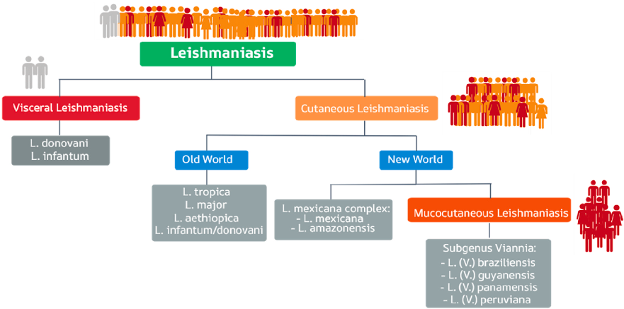
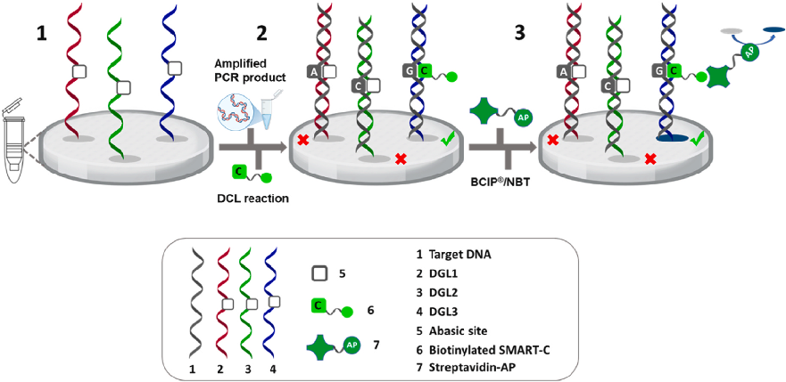
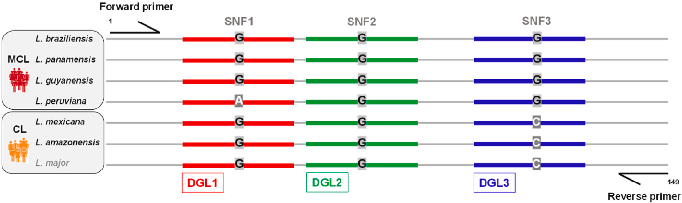
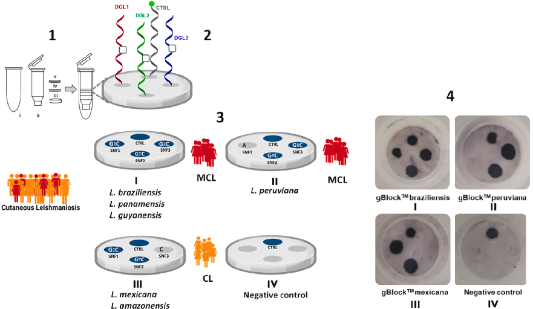
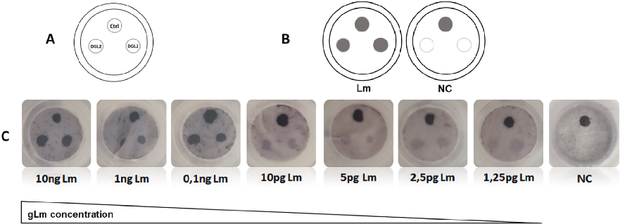
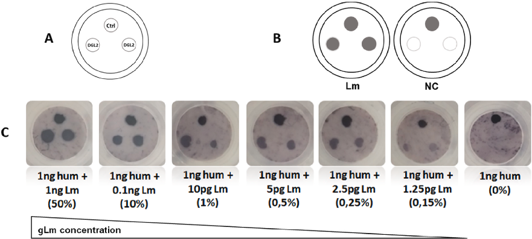
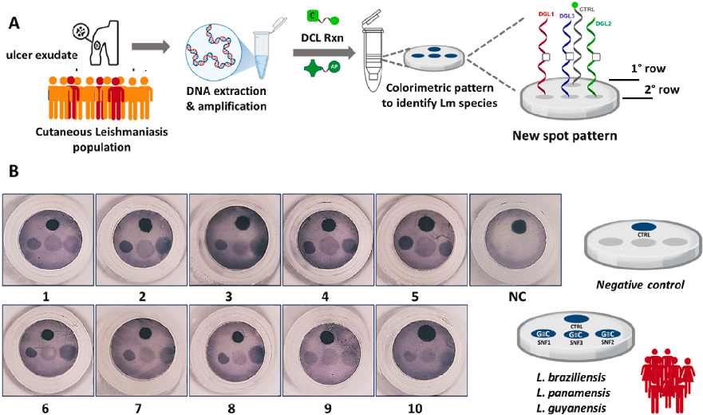

Talanta 293 (2025) 128016 

Contents lists available at ScienceDirect

## Talanta

journal homepage: www.elsevier.com/locate/talanta

# A novel colorimetric assay for early differentiation of mucocutaneous and  cutaneous leishmaniasis via species-specific identification

Nancy Villegas Villaoa a GENYO Centre for Genomics and Oncological Research, Pfizer, University of Granada, Andalusian Regional Government, PTS Granada - Avenida de la Ilustraci´on,  114– 18016, Granada, Spain ,b b Department of Medicinal & Organic Chemistry, Faculty of Pharmacy, University of Granada, Campus de Cartuja s/n, Granada, Spain ,c c Unit of Excellence in Chemistry Applied to Biomedicine and the Environment of the University of Granada, Granada, Spain ,d d Instituto de Investigaci´on Biosanitaria ibs.GRANADA, Granada, Spain ,e e Departamento de Parasitología y Medicina Tropical. Carrera de Medicina, Facultad de Ciencias de la Salud, Universidad Cat´olica de Santiago de Guayaquil, Guayaquil,  Ecuador ,1 , Mavys Tabraue-Chavezf f DESTINA Genomica S.L. Parque Tecnol´ogico Ciencias de la Salud (PTS), Avenida de la Innovaci´on 1, Edificio BIC, Armilla, 18016, Granada, Spain ,1 , Cristina Megino-Luquef,2 ,   Araceli Aguilar-Gonzaleza,b,c,d , Juan J. Guardia-Monteagudof, F. Javier Lopez-Delgadof ,   Agustin Robles-Remachoa,b,c,d,3 , Victoria Cano-Cort´esa,b,c,d, Juan J. Diaz-Mochona,b,c,d,   Rosario M. Sanchez-Martina,b,c,d,* , Salvatore Pernagallof,**

## A R T I C L E  I N F O

### Keywords:

Mucocutaneous leishmaniasis (MCL)

Dynamic Chemical Labeling (DCL)

Spin-Tube device

hsp70 gene

Infectious disease diagnostics

## A B S T R A C T

Mucocutaneous leishmaniasis (MCL) is a severe and debilitating progression of cutaneous leishmaniasis (CL) that  occurs when the disease spreads to involve mucosal tissues. Contrasting CL, which can often be treated with local  therapies, MCL requires aggressive systemic treatment, strict adherence to a 30-day regimen and regular  monitoring to prevent recurrence. These requirements highlight the critical need for accurate and rapid early  diagnosis to guide effective treatment strategies. However, differentiating between the  Leishmania  species  responsible for MCL and CL remains a significant challenge, particularly in resource-limited settings.

To address this gap, this study introduces a novel colorimetric assay that integrates the Spin-Tube platform  with Dynamic Chemical Labeling (DCL) technology for species-specific identification of Leishmania parasites.  This approach targets single nucleotide fingerprints (SNFs) within the conserved hsp70 gene, allowing precise  differentiation between species associated with MCL and CL. The assay employs single-plex PCR followed by  DCL-based  detection  of  SNFs,  providing  rapid  and  visually  interpretable  results  to  facilitate  species  differentiation.

The assay demonstrated remarkable sensitivity, with a detection limit of 1 copy of parasite DNA per μL and  performed effectively even under resource-limited conditions. It was used to identify ten MCL patients, with the  results confirmed through DNA sequencing. Its simplicity and rapid turnaround could make it an ideal diagnostic  solution for endemic regions. By providing accurate early differentiation between CL and MCL, this assay enables  the implementation of personalised treatment plans, minimising unnecessary exposure to toxic therapies and  reducing the risk of irreversible mucosal damage for affected patients.

* Corresponding author. GENYO Centre for Genomics and Oncological Research, Pfizer, University of Granada, Andalusian Regional Government, PTS Granada -  Avenida de la Ilustracion, 114– 18016, Granada, Spain.

** Corresponding author. DESTINA Genomica S.L. Parque Tecnologico Ciencias de la Salud (PTS), Avenida de la Innovaci´ on 1, Edificio BIC, Armilla, 18016, ´ Granada, Spain.

E-mail addresses: rmsanchez@go.ugr.es (R.M. Sanchez-Martin), salvatore.pernagallo@destinagenomics.com (S. Pernagallo).  1 These two authors have contributed equally to this work. 2 Current affiliation: Department of Medicine, Division of Hematology and Oncology, The Tisch Cancer Institute. Icahn School of Medicine at Mount Sinai, 10029, 

New York, USA. 3 Current affiliation: Science for Life Laboratory, Department of Biochemistry and Biophysics, Stockholm University, Stockholm, Sweden.

https://doi.org/10.1016/j.talanta.2025.128016

Received 7 February 2025; Received in revised form 21 March 2025; Accepted 22 March 2025  

Available online 28 March 2025 

0039-9140/© 2025 Published by Elsevier B.V. 

Leishmaniasis manifests in two primaries clinical forms: visceral  leishmaniasis (VL) and cutaneous leishmaniasis (CL). Among the two, CL  is the most common form and is characterised by ulcerative skin lesions  that typically appear on exposed areas of the body, such as the face,  arms, and legs ([1]; Parkash et al., 20241). These lesions often take  months to heal, and even after healing, they frequently leave permanent  scars, that can lead to social stigma and psychological distress for  affected individuals. In some cases, CL can progress to a more severe  secondary form known as mucocutaneous leishmaniasis (MCL), which is  considered a complication of CL. MCL, a more aggressive form, typically  arises from untreated CL or CL patients who have not adhered to the  treatment properly. It involves the destruction of mucosal tissues in the  nose, mouth, and throat, causing ulcerations that can lead to severe  disfigurement and functional impairments. If left untreated, MCL may  result  in  significant  tissue  damage  and  permanent  disfigurement,  particularly affecting breathing, eating, and speaking ([1,2,5,7]; Kaye  et al., 2023).

## 1. Introduction

Leishmaniasis is a vector-borne disease caused by protozoa of the  genus Leishmania transmitted to humans by the bite of infected female  sandflies [1–4]. In the Old World, transmission is mainly by sandflies of  the genus Phlebotomus, while in the New World the genus Lutzomyia is  the main vector [5]. After transmission, the parasites are phagocytosed  by host macrophages, where they evade the immune response by  transforming into amastigotes, an intracellular form that replicates  within the macrophages [6,7]. This ability to survive and multiply  within immune cells is central to the pathogenesis of leishmaniasis,  leading to a spectrum of clinical outcomes that depend on the infecting  Leishmania species and the immune status of the host [1,2,6].

The  clinical  form  of  leishmaniasis  is  largely  species-dependent  (Fig. 1). For example, Leishmania braziliensis is commonly associated  with MCL, while Leishmania mexicana and Leishmania amazonensis is  more commonly linked to CL. Understanding the species involved is  critical not only for determining the appropriate treatment but also for  controlling disease spread. Early differentiation between CL and MCL is  particularly important due to the severity of MCL, which can cause  extensive mucosal tissue damage, leading to permanent disfigurement  and  functional  impairments  if  left  untreated.  MCL  requires  more  aggressive treatment than CL, often involving higher concerted potentially toxic therapies such as pentavalent antimonials (e.g., meglumine  antimoniate or sodium stibogluconate) or amphotericin B, especially in  cases where standard therapies fail [9]. These treatments carry significant risks, including cardiac, renal, and hepatic toxicity [10]. Therefore,  accurate species identification is essential to ensure appropriate therapy.  Misidentification can result in suboptimal treatment or unnecessary  exposure to toxic drugs, further complicating the patient’s condition  [11]. Additionally, delayed treatment can lead to irreversible damage to  mucosal tissues, resulting in long-term disability and disfigurement [9, 11]. Early and accurate diagnosis is therefore crucial to improve clinical  outcomes by reducing the risk of complications and ensuring timely  intervention [12].

The World Health Organization (WHO) continues to classify leishmaniasis as one of the most significant parasitic diseases worldwide,  owing to its broad distribution, high disease burden, and considerable  socioeconomic impact. As of 2023, the disease is endemic in over 98  countries, with an estimated 600,000 to 1 million new cases reported  annually (Kaye et al., 2023). Most of these cases occur in tropical and  subtropical regions, where factors such as poor housing, malnutrition,  and inadequate access to healthcare exacerbate the disease’s effects [1, 2,5]. Moreover, environmental factors, including climate change and  deforestation, are contributing to the spread of leishmaniasis by disrupting ecosystems and forcing disease-carrying animals into new areas,  thereby increasing the risk of transmission [8].

Traditional diagnostic methods, such as microscopy and serological  tests, have limited sensitivity and cannot reliably differentiate between  Leishmania species, particularly in early-stage infections or asymptomatic patients [2,13,14]. Molecular techniques, such as real-time quantitative  PCR  (qPCR),  are  now  considered  the  gold  standard  for  diagnosing  leishmaniasis  due  to  their  high  sensitivity  [15–17].  Commonly used qPCR assays, such as those using TaqMan, Molecular  Beacons, or Scorpion probes, are effective but require sophisticated  equipment that is often unavailable in resource-limited settings [18–21].  Moreover, qPCR and similar methods struggle to resolve the high  genomic sequence homology among Leishmania species, limiting their  ability to differentiate closely related species. Capture-based molecular  assays provide a promising alternative for low-resource environments.  However, they lack the triple binding capability offered by the other  technologies —forward primer, reverse primer, and internal probe—  that is key to distinguish highly homologous sequences, thus reducing  their utility for species-specific  Leishmania  diagnosis [22,23]. These  limitations underscore the need for specialized molecular assays capable  of  addressing  genomic  homology  while  remaining  accessible  in  low-resource settings.

Fig. 1. This figure shows the clinical forms of leishmaniasis alongside the primary Leishmania species responsible, classified by their geographical distribution. The  diagram distinguishes between Old World and New World species [5], highlighting species-specific associations with visceral leishmaniasis (VL), cutaneous leishmaniasis (CL), and mucocutaneous leishmaniasis (MCL). This Fig. 1 reports only the principal species, although the authors acknowledge that other species may also  be present.

As shown in Fig. 2, this novel approach uses DCL with biotinylated  aldehyde-modified nucleobases (SMART-Biotin) in combination with  abasic peptide nucleic acid (PNA) capture probes (DGL-Probes). DGL-  Probes are immobilized on the membrane of the Spin-Tube in a precise spotting pattern to analyse selected SNFs (Fig. 3). The DGL-Probes  hybridize with complementary target DNA sequences amplified from  the hsp70 gene of samples, forming a “Chemical Pocket” between the  abasic site on the DGL-Probe and the SNF nucleotide of interest within  the hsp70 amplicon. Selected SNFs in the hsp70 target DNA sequences,  involving single-nucleotide variations of Cytosine (C), Adenine (A), or  Guanine (G), are analysed using a SMART-Biotin, specifically the biotinylated aldehyde-modified cytosine nucleobase (C-SMART-Biotin), as  shown in Fig. 3. When a “G" nucleotide is present at the SNF site, the C-  SMART-Biotin covalently binds to the abasic site position of the DGL-  Probe via a thermodynamically controlled reductive amination reaction, which is templated by the SNF nucleotide according to Watson-  Crick base pairing rules [42,43]. If a nucleotide other than “G" is present at the SNF site (“C” or “A”), no reaction occurs, thereby preventing  the incorporation of C-SMART-Biotin (Fig. 2). The assay’s final step uses  a reporter molecule, streptavidin-alkaline phosphatase, to detect the  biotin tag. This interaction generates a visible blue chromogenic precipitate through the enzymatic hydrolysis of the chromogenic substrate  BCIP®/NBT (5-Bromo-4-chloro-3-indolyl phosphate/nitro blue tetrazolium chloride), confirming the presence or absence of guanine at the  SNF site.

To overcome these challenges, we developed a novel diagnostic  platform that combine high specificity through a triple binding capabilities provided by the Dynamic Chemical Labeling (DCL) technology  [24–39] that is compatible with formats suitable for low-resource settings, the Spin-Tube colorimetric device. This platform is specifically  designed for low-resource environments and interrogates Single Nucleotide  Fingerprint  (SNF)  markers—single-nucleotide  variations  in  conserved genomic regions that enable precise differentiation of Leishmania  species. Our group first introduced the term SNF to describe  specific single-nucleotide variations in highly conserved nucleic acid  sequences that allow differentiation of closely related pathogenic species [40].

In this study, SNF markers were selected from the conserved region  of the  hsp70  gene [19,21], which is particularly effective for distinguishing species responsible for CL and MCL. Our group previously  applied the DCL reaction with the Spin-Tube platform to detect SNF  markers in trypanosomatid parasites [34]. This innovative combination  was later adapted for the ARREST-TB project, which focused on tuberculosis diagnostics and drug resistance detection [33]. Additionally,  DCL technology has been widely applied to RNA detection, including its  use in SARS-CoV-2 diagnostics [41]. By integrating these technologies,  this  novel  platform  offers  a  reliable,  low-cost  solution  for  species-specific Leishmania diagnosis, addressing the key limitations of  existing methods.

The DGL-Probes are spotted in specific patterns on the membrane,  enabling species differentiation through C-SMART-Biotin incorporation.  As illustrated in Fig. 4, the results of the assay demonstrate that the  generated pattern allows for the identification of Leishmaniasis and the  differentiation between CL and MCL in a single reaction. Moreover, this  differentiation is achieved through a visual test with the naked eye.

## 2. Material and methods

### 2.1. Materials and reagents

All  chemicals  were  provided  from  Sigma  Aldrich  and  used  as  received. The DCL buffer was prepared from 0.3 M citrate buffer and 0.1  % sodium dodecyl sulphate (SDS), with the pH adjusted to 6.0 using HCl.  Synthetic double strand DNAs (gBlocks™ Gene Fragments) that mimics  hsp70 fragment of 249bp for L. braziliensis, L. mexicana and L. peruviana  were  purchased  from  Integrated  DNA  Technologies,  BV  (Leuven,  Belgium). Parasitic gDNA from L. major - ATCC ID 30012D was purchased from the American Type Culture Collection (ATCC). Human  gDNA was purchased from Jena Bioscience. Abasic PNA probes (DGL-  Probes) were provided by DESTINA Genomica SL (Granada, Spain) and  were HPLC-purified. The concentration of DGL-Probes was measured  using a FLUOstar Omega multidetector microplate reader (BMG LABTECH, Offenburg, Germany) based on extinction coefficients for C, T, A,  and G (Ɛ260 = 6.6, 8.8, 13.7, and 11.7 mM� 1cm� 1, respectively). The  biotinylated aldehyde-modified cytosine (C-SMART-Biotin) and other  necessary buffers (I-III) were also provided by DESTINA Genomica SL,  while buffers IV to VI were purchased from Vitro SA (Granada, Spain).  Biodyne C membranes were purchased from Pall Corporation (US), and  pre-activation of the membranes was carried out by DESTINA Genomica  SL using proprietary chemistry. The Spin-Tube plastic components were  purchased from Ciro Manufacturing Corporation (FL, US), and the devices were manually assembled by DESTINA Genomica SL.

Fig. 2. Schematic representation of the assay and its mechanism for interrogating SNFs. (1) Three DGL-Probes, designed to capture complementary target DNA  sequences and interrogate the three SNFs (Fig. 3), are spotted onto the membrane of the Spin-Tube. (2) Amplification of the hsp70 target gene (target DNA) is added  to the Spin-Tube. These DNA targets, containing the three specific SNFs, hybridize with the DGL-Probes. C-SMART-Biotin is incorporated exclusively when a guanine  (G) is present opposite the “abasic site” within the “chemical pocket.” (3) Detection is carried out using a colorimetric reaction with BCIP®/NBT, producing a blue  precipitate on specific spots, which can be visualized with the naked eye (as a blue spot on the membrane). In cases where cytosine (C) or adenine (A) is present, the  incorporation of C-SMART-Biotin does not occur, and therefore no blue spot is produced (appearing as a gray spot on the membrane). (For interpretation of the  references to color in this figure legend, the reader is referred to the Web version of this article.)

Fig. 3. Alignment of variant regions in Leishmania hsp70 target DNA Sequences. This alignment, generated by Single-plex PCR using a single pair of primers,  highlights the differentiating SNF targets for DGL-Probe 1 (DGL1, shown in red), DGL-Probe 2 (DGL2, shown in green), and DGL-Probe 3 (DGL3, shown in blue). The  nucleobases in the three SNFs are indicated in bold, capital letters, either in black or white for contrast. The complete sequences are provided in Fig. S3. (For  interpretation of the references to color in this figure legend, the reader is referred to the Web version of this article.)

Fig. 4. (1) Structure of the Spin-Tube device: i) A centrifuge collection tube; ii) An internal column for the assay; iii) A frit; iv) A nylon membrane (pre-spotted with  DGL-Probes and a biotinylated DNA control) immobilized at the bottom of the column with a plastic pressure ring (v). (2) Schematic representation: The nylon  membrane includes three multi-capture DGL-Probes (DGL1, DGL2, and DGL3) and biotinylated oligo DNA spots, immobilized to enable species-specific detection  through SNF interrogation (3) Illustration of the four test scenarios: I) L. braziliensis: detection pattern for gBlocks™  simulating infections with L. braziliensis,  L. panamensis, and L. guyanensis; II) L. peruviana: detection pattern for L. peruviana; III) L. mexicana: detection pattern for L. mexicana and L. amazonensis; IV) Negative  control: PCR with no template, simulating no parasitic infection. (4) Detection via colorimetric reaction: The assay detects blue precipitate spots after incubation with  streptavidin-alkaline phosphatase. Pictures visualization of the four cases described in (3) is provided, demonstrating results visible to the naked eye. (For interpretation of the references to color in this figure legend, the reader is referred to the Web version of this article.)

### 2.2. In silico design and identification of single nucleotide fingerprints  target regions

A set of sequences covering a partial coding sequence (CDS) of the  hsp70 gene, containing SNFs within conserved regions across Leishmania  species of interest, was selected. These sequences were obtained from  the European Nucleotide Archive [44] and the GenBank database [45].  Alignment of the sequences was performed using the NCBI BLAST tool  [46], confirming 100 % homology with reference genomes and no significant  alignment  with  the  human  genome  (Table  S1).  Multiple  sequence alignment was further conducted using the EMBL-EBI Clustal  Omega tool [47], identifying three conserved regions with specific SNFs  (Fig. S1). Based on these regions and SNFs, three DGL-Probes (DGL1,  DGL2 and DGL3) and a single set of PCR primers were designed as reported in Tables S2 and S3.

### 2.3. DGL-Probe spotting and Spin-Tube fabrication

PCR amplification was conducted using a Techne TC-5000 PCR  thermal cycler. After selecting the optimal primer pair (Forward 2 and  Reverse 2), PCR conditions were optimized by testing different annealing temperatures (55 ◦C, 57 ◦C, and 60 ◦C) (Table S4) and bioanalyzer  results in Fig. S2. The final PCR reaction was carried out in a 50 μL solution containing 1X GoTaq®  G2 Hot Start Colourless Master Mix  (Promega) and 0.2 μM of each primer. 10 ng of gBlocks™ were used as  templates (Fig. S2) and various genomic DNA concentrations were  tested. Nuclease-free water was used as a negative control. Additionally,  1 ng of human gDNA was included for specificity testing. The final  thermal cycling conditions consisted of an initial denaturation at 95 ◦C  for 5 min, followed by 35 cycles of 95 ◦C for 30 s, annealing at 57 ◦C for  30 s, and extension at 72 ◦C for 30 s. A final extension at 72 ◦C for 10 min  was followed by a hold at 4 ◦C. PCR products were analysed using an  Agilent 2100 Bioanalyzer and DNA 1000 Kit (Agilent Technologies Inc.)  and directly used for genotyping by DCL on the Spin-Tube colorimetric  device without further purification.

The DGL-Probes were modified with amino-PEGylated groups at the  N-terminal end, incorporating glutamic acid residues as a side chain at  specific gamma positions [32,35]. These probes were designed to target  regions and interrogated SNFs identified in section 2.2 (Fig. S1). As a  positive control, a biotinylated 5′-amino-modified ssDNA oligo was also  spotted. DGL-Probe concentrations were determined using a Thermo  Fisher Scientific Nanodrop® ND-2000C spectrophotometer as reported  in section 2.1.

### 2.6. Patient enrollment and sample collection

For this study, patients were recruited from the province of Santo  Domingo de los Ts´achilas, an endemic region for CL in Ecuador (see  Section S1). All participants were fully informed about the objectives of  the research and the diagnostic procedures to be performed on their  samples. Upon agreeing to participate, they signed an informed consent  form in accordance with HCK-CEISH regulations (see Section S1).

The DGL-Probes were covalently immobilized onto preactivated  Biodyne C nylon membranes, as previously described by our group [33, 34,41]. DGL-Probes were solubilized in NaHCO3 buffer (pH 8.3, 0.125  M) with amaranth dye (0.2025 mg/mL) and DMSO (30 %), and manually spotted onto membranes using a P2 Gilson Pipette. The Spin-Tube  devices were assembled by integrating these spotted membranes with  plastic components, following the procedure outlined in our previous  publications [34].

The study received ethical approval from the Human Research Ethics  Committee of HOSPITAL CL´INICA KENNEDY (HCK-CEISH) in Guayaquil, Ecuador (approval code: HCK-CEISH-2022-013). Patient sample  collection adhered to all ethical, methodological, and legal requirements  stipulated by current regulations (see Section S2).

### 2.4. Dynamic Chemical Labeling with C-SMART-biotin and colorimetric  workflow

Biopsies were collected following the procedure described in Section  S2, and the diagnosis of CL was confirmed through smear analysis (see  Section S3).

Protocol was carried out as follows: a) blocking the membranes with  400 μL of pre-heated reagent I; b) washing with 600 μL of pre-heated  Reagent II; c) 2 min incubation with 200 μL pre-heated DCL buffer; d)  DCL reaction: 20 μL PCR product or 20 μL 5 nM ssDNA, 10uL 200 μM C-  SMART-Biotin, 10 μL 20 mM NaBH3CN and 160 μL DCL buffer at 45 ◦C  for 1 h. Before use, PCR products were denatured at 95 ◦C for 10 min and  kept on ice per 2 min just before the addition. Negative controls were  prepared by substituting nucleic acids with water or PCR negative  controls; e) incubation with 200 μL of pre-heated reagent III at 45 ◦C for  5 min; f) washing with 600 μL reagent II; g) blocking of membranes with  200 μL reagent IV at room temperature for 5 min to avoid non-specific  binding of streptavidin; h) Incubation with 200  μL AP-Streptavidin  (Reagent V) at room temperature for 5 min to recognize the biotin  incorporated during the DCL reaction; i) washing with 600 μL reagent VI  to remove streptavidin excess; j) Chromogenic reaction using 200 μL of  reagent VII (BCIP®/NBT) during 10 min at 45 ◦C, to generate a dark blue  colour with each streptavidin recognition; k) optional washing with 200  μL reagent II. In all steps, the Spin-Tubes were centrifuged at 6000 rpm  for 15 s to discard the solutions between each step. The protocol  required only low-cost equipment, including a Nahita digital thermostatic bath and a VWR MiniSpin centrifuge.

### 2.7. DNA sequencing

DNA samples from patients were extracted from FTA cards sent from  Ecuador  to  Spain  for  processing  (Whatman,  catalogue  number  WHAWB120210,  QIAcard™  Non-Indicating  FTA™  Cards).  Sample  collection was carried out as described in Section S4. Upon arrival in  Spain, the FTA cards were stored at room temperature. To ensure  traceability and standardized collection for subsequent analysis, relevant patient and sample information—including sample ID, collection  date, and observations—was thoroughly documented.

For DNA extraction, the protocol provided by Whatman (catalogue  number WB120210) was followed. A 2 mm disc was cut from the FTA  card sample and transferred to an Eppendorf tube containing 500 μL of  Milli-Q water. The sample was vortexed three times for 5 s each. The  water was then removed using a sterile pipette, centrifuged for 5 s, and  any excess liquid was pipetted off. Subsequently, 50 μL of sterile water  was added, and the sample was heated at 95  ◦C for 30 min. DNA  extraction was completed using the DNeasy® Blood & Tissue Kit (Qiagen, Hilden, Germany) according to the manufacturer’s instructions.

PCR amplification was performed using primers and the PCR protocol described in Section 2.5, with 25 ng of total patient DNA as the  template. Amplification products (5 μL) were separated on a 2 % agarose  gel stained with Gel Red (Biotium, Fremont, CA, USA) and visualized  using a UV transilluminator. Results of the gel electrophoresis are presented in Fig. S3.

### 2.5. Single-plex PCR sensitivity and specificity testing

Three pairs of forward and reverse primers were designed to amplify  segments of varying lengths from the conserved hsp70 gene in the target  Leishmania species (Table S3). Primer design was performed using the  Primer-BLAST  2.0  server  (https://www.ncbi.nlm.nih.gov/tools/prim  er-blast/), and cross-reactivity with the human genome was assessed  using the Genome Browser tool (http://genome.ucsc.edu/). Primer self-  dimer and heterodimer formations were evaluated using Oligo Analyzer  3.1 (IDT,  http://www.idtdna.com/calc/analyzer). Primers were purchased by Integrated DNA Technologies (IDT).

For sequencing, PCR products were purified using the QIAquick PCR  Product  Purification  Kit  (Qiagen,  Hilden,  Germany)  following  the  manufacturer’s  protocol.  Purified  products  were  sequenced  using  Sanger sequencing (Stab Vida, Caparica, Portugal) with both Forward 2  and Reverse 2 primers. Sequencing was performed at Genyo (Granada,  Spain). Sequencing results are provided in Fig. S6.

## 3. Results

### 3.1. Design of the assay

PCR approaches targeting the hsp70 gene offer significant advantages for diagnosing and identifying medically relevant  Leishmania  species from both the New and Old Worlds. These methods have been  described in the past and allow for the direct detection of parasites from  lesion samples, eliminating the need for parasite culture [12,18]. The  hsp70 gene is highly conserved across Leishmania species globally, with  minimal size variation, making it an ideal target for species comparison.  Additionally, it effectively discriminates between relevant species in  both  Leishmania  subgenera, and its multiple copies in the genome  facilitate direct amplification from most clinical samples [18].

### 3.3. Single Nucleotide Fingerprint identification of Leishmania species

The Spin-Tube devices were used to validate the differentiation between CL and MCL by interrogating three SNFs through DCL, as shown  in Fig. 2, with a colorimetric readout (see Materials and Methods for  details). The three DGL-Probes were manually spotted onto the nylon  membrane in specific patterns, enabling species differentiation based on  the incorporation of C-SMART-Biotin. A biotinylated 5′-amino-modified  ssDNA oligo was also spotted at the top of the membrane as a positive  control for the colorimetric reaction (Fig. 4-(2)).

In this study, we conducted an in-silico analysis of the hsp70 gene to  identify SNFs capable of differentiating between CL and MCL in New  World Leishmania species. The target species included L. braziliensis, L.  panamensis, L. guyanensis, L. peruviana, L. Mexicana and L. amazonensis  (Fig. 1). Sequences covering a conserved partial region of the hsp70 gene  were selected for analysis. Multiple sequence alignments using the  Clustal Omega program identified diagnostic regions containing three  SNFs that enable species differentiation (Fig. S1). These regions were  chosen based on their proximity, allowing amplification using a single  pair of primers (Single-plex PCR). The selected SNFs contain either  “Guanine (G), Cytosine (C) or Adenine (A)” nucleobases, enabling species differentiation via a single C-SMART-Biotin incorporation (Fig. 3).

The DCL-Flow colorimetric assays, conducted on the Spin-Tube  platform, used synthetic gBlocks™ Gene Fragments of 249 base pairs,  representing sequences from L. braziliensis, L. mexicana, and L. peruviana  (Fig. S3). The results are as follows: (a)  Fig. 4 (3-I): The gBlocks™  sequence for  L. braziliensis  mimicked infections with  L. braziliensis,  L. panamensis, and L. guyanensis, all species associated with MCL, producing the characteristic pattern shown in Fig. 4 (4-I). (b) Fig. 4 (3-II):  The gBlocks™  sequence for  L. peruviana  simulated infections with  L. peruviana and generated the expected pattern depicted in Fig. 4 (4-II).  (c) Fig. 4 (3-III): The gBlocks™ sequence for L. mexicana represented  infections with L. mexicana and L. amazonensis, both associated with CL,  producing the corresponding pattern shown in Fig. 4 (4-III). (d) Fig. 4 (3-IV): A negative control was performed using water instead of synthetic gBlocks™ Gene Fragments to simulate the absence of parasitic  infection. As expected, no colorimetric signal was observed except for  the assay control (CTRL) spot, which produced a precipitate, as shown  in Fig. 4 (4-IV). The results confirmed that C-SMART-Biotin incorporation occurred only when the target contained a guanine nucleotide  within the “abasic site,” as indicated in Table 1. The negative control  (PCR with water) validated the absence of a colorimetric signal, confirming the assay’s specificity (Fig. 4 (4-IV)).

This design discriminates species based on two SNFs, serving as  target sequences for DGL1 and DGL3 (Fig. 3). The DGL2 sequence acts as  a control for the hsp70 amplicon, confirming the presence of Leishmania  across all species. As shown in Table 1, combining the results from the  three DGL-Probes allows differentiation between CL and MCL. This  discrimination is based on the incorporation of C-SMART-Biotin, which  only occurs when Guanine are opposite the abasic site positions of the  complementary  DGL-Probes  as  described  in  Fig.  2.  For  instance,  L. peruviana is distinguished by the lack of C-SMART-Biotin incorporation at DGL1, as there is an Adenine rather than a Guanine at this, while  L. mexicana and L. amazonensis are discriminate by the absence of C-  SMART-Biotin incorporation at DGL3, as their DNA has a Cytosine in  front of the abasic site position of DGL3 (Fig. 3). The DGL2, targeting a  Guanine, consistently shows a positive result across all species, confirming the presence of Leishmania and serving as a control.

The assay successfully distinguished species based on the expected  DCL reaction patterns, with all results aligning with predictions. This  demonstrates the robustness and accuracy of the Spin-Tube platform for  species-specific identification and differentiation between CL and MCL.

### 3.2. Spin-Tube device fabrication

The Spin-Tube device previously developed by our group ([34];  � 43) consists of the following components: (i) a centrifuge collection  tube; (ii) an internal assay column; (iii) a frit; (iv) a nylon membrane  with DGL-Probes covalently immobilized; and (v) a plastic pressure ring  securing the nylon membrane to the bottom of the column (Fig. 4-(1)).  This innovative platform is designed to perform the DCL reaction and  subsequent colourimetric detection. The device supports a reverse dot  blot assay format [34], which is processed using a simple benchtop  centrifuge. The assay concludes with a visually detectable colourimetric  signal that can be easily read with the naked eye, making the Spin-Tube  an  efficient  and  accessible  diagnostic  tool.  The  three  DGL-Probes  designed in Section 2.1 were synthesised to complement the selected  hsp70 amplicon sequence (shown in Fig. 3) and to bind in an antiparallel  alignment (with the N-terminal of the DGL-Probes facing the 3′ end of  the target DNA and the C-terminal aligning with the 5′ end). These  probes were tested on nylon membranes using DCL with C-SMART-Biotin  incorporation,  with  gBlocks  as  templates  and  colourimetric  readouts for detection (Fig. S3).

### 3.4. Sensitivity and specificity of the assay

Single-plex PCR was implemented to amplify a segment of the  conserved hsp70 region in the selected Leishmania species (Fig. S1). The  sensitivity of this colorimetric assay depends largely on the quality of the  single-plex PCR. The detection limit was determined using single-plex  PCR with decreasing amounts of L. major gDNA, chosen for its similarity to L. mexicana at the SNF under investigation with DGL2 (Fig. 3).  Eight concentration points and a negative control were tested (10 ng, 1  ng, 0.1 ng, 10 pg, 5 pg, 2.5 pg and 1.25 pg, of total parasite genomic  DNA). PCR amplicons were analysed by capillary electrophoresis to  assess the quantity and size of the PCR products (Fig. S4). The expected  bands were observed at all concentrations, although a very low yield  was obtained with 1.25 pg. DCL colorimetric detection using the Spin-  Tube showed clear positive results for samples starting from 10 ng  down to 0.1 ng of L. major gDNA, while samples with 10 pg–1.25 pg  showed lower but still distinguishable signals from the negative control.  Thus, the assay’s detection limit is tied to PCR sensitivity, with 1.25 pg  of gDNA (equivalent to 0.025 pg/μL or 1 copy/μL) being the lower limit  (Fig. 5).

Table 1  Expected C-SMART-Biotin Incorporation for the Selected DGL-Probes Based on  Parasitic Infection and Clinical Manifestation. Legend: (+) Indicates C-SMART-  Biotin incorporation, resulting in a detectable colorimetric signal. (� ) Indicates  no C-SMART-Biotin incorporation, meaning no colorimetric signal is generated.

To assess specificity, the single-plex PCR was challenged using the  same gDNA templates with 1 ng of human gDNA at various ratios (50 %,  10 %, 1 %, 0.5 %, 0.25 %, 0.125 %, and 0 % parasite DNA). Capillary  electrophoresis results showed no amplification with only human gDNA.  The amplification was comparable, or slightly better, in parasite-human  DNA mixtures than in parasite DNA alone. Fig. S6 shows an example of  capillary electrophoresis results for 0.1 ng L. major, 0.1 ng L. major with  1 ng human gDNA, and 1 ng human gDNA, demonstrating that the  selected primers and PCR protocol selectively amplify parasitic gDNA.  All colorimetric assays-maintained specificity in the presence of human  gDNA (Fig. 6).

|Clinical manifestation|Parasite|DGL1|DGL2|DGL3|
|---|---|---|---|---|
|Mucocutaneous Leishmaniasis|L. braziliensis|+|+|+|
| |L. panamensis| | | |
| |L. guyanensis| | | |
| |L. peruviana|–|+|+|
|Cutaneous Leishmaniasis|L. mexicana|+|+|–|
| |L. amazonensis| | | |

Fig. 5. Sensitivity of the assay. (A) Spotting patterns of the DGL2 probe (left and right) and biotinylated oligo DNA (top) in the nylon membrane of the Spin-Tube.  (B) Expected results with the incorporation of C-SMART-Biotin. (C) Test results with the PCR products at different initial amount of L. major gDNA.

The Spin-Tubes were then used to process the PCR products from all  ten clinical samples with the established colorimetric protocol. The results  (Fig.  7B)  demonstrated  successful  hybridization  of  the  DNA  amplicons with the DGL-probes, which were interrogated using C-  SMART-Biotin. Spin-Tubes from all ten patients showed a consistent  positive pattern across all spots, indicating the presence of one of the  following species:  L. braziliensis,  L. panamensis, or  L. guyanensis  (according to Table 1). This confirmed the diagnosis of MCL in all cases.  Negative controls, prepared using water, displayed the expected negative control (NC) pattern, with only the CTRL spot showing a positive  signal.

### 3.5. Assay validation with clinical samples

The Spin-Tube devices were used to analyse clinical samples from ten  patients diagnosed with CL through smear analysis, as described in  Section S3. While smear analysis is effective for identifying pathogens, it  cannot distinguish between species responsible for simple CL or the  more severe MCL. To address this limitation, the Spin-Tube device and  the newly developed assay were used following the workflow showed in  Fig. 7A. Tissue samples were collected from patients’ ulcers, DNA was  extracted  and  amplified  using  single-plex  PCR,  and  the  resulting  amplicons were analysed in the Spin-Tube using the DCL colorimetric  reaction (DCL Rxn).

Further analysis of the PCR products via sequencing confirmed the  presence of characteristic MCL sequences, including a “G” at all three  SNF positions. These sequencing results validated the diagnoses made  using the novel colorimetric assay, as shown in Fig. S7.

A novel Spin-Tube pattern was designed to differentiate CL from MCL  by interrogating three SNFs with three DCL-Probes. The first row of the  Spin-Tube contained a spot with a biotinylated DNA oligo serving as a  control (CTRL), while the second row contained three spots corresponding to DGL1, DGL3, and DGL2. These spots were used to interrogate SNF1, SNF3, and SNF2, respectively (Fig. 7A). Before to Spin-Tube  incubation, PCR amplification products were verified using gel electrophoresis, as shown in Fig. S6.

Additionally, the signal-to-background ratio and the positive CTRL  signal were quantified, as detailed in Table S6. A cut-off of 5 % was  established to classify a signal as positive. This analysis confirmed that  all three spots in the pattern displayed clear positive signals when  assessed through absolute quantification using a quantitative method,  rather than relying solely on visual interpretation. These results underscore the robustness and reliability of the assay in diagnosing  leishmaniasis  and differentiating between CL and MCL, providing an  effective tool for species-specific diagnosis.

Fig. 6. Specificity of the assay in presence of human gDNA. (A) Spotting patterns of the DGL2 probe (left and right) and biotinylated oligo DNA (top) in the nylon  membrane of the Spin-Tube. (B) Expected results with the incorporation of C-SMART-Biotin. (C) Test results for PCR products in presence of 1 ng of human DNA and  different amounts of starting parasite gDNA templates. Lm: Leishmania gDNA; hum: human gDNA.

Fig. 7. Validation with clinical samples. (A) The complete workflow of the assay, presented from left to right, illustrates the process from sample collection to  interrogation using the novel spot pattern on the Spin-Tube device. (B) Results obtained from the ten patient samples and the negative control (NC). The spot pattern  indicates the incorporation of C-SMART-Biotin across the three spots in the second row.

The method introduces several novel aspects: a unique design that  combines SNFs for differentiating species associated with CL and MCL  leishmaniasis, which has not been previously described, and a single-  plex PCR specifically targeting these SNFs. Furthermore, it used the  innovative DCL approach for their interrogation, providing 100 %  specificity. Any mismatch during hybridization or the presence of a  nucleobase other than  “G" within the chemical pocket prevents the  incorporation of C-SMART-Biotin, thereby eliminating the generation of  a colorimetric signal.

## 4. Discussion

Molecular diagnostic methods, such as qPCR-based assays, have been  pivotal in advancing the detection and identification of  Leishmania  parasites  [15–17].  However,  while  these  techniques  provide  high  sensitivity, they remain costly and inaccessible in many endemic regions, and they struggle to differentiate between species that cause  varying clinical manifestations. In the context of leishmaniasis, species  identification is critical not only for effective treatment but also for  disease control, especially in distinguishing between CL and the more  severe MCL [18–21].

This method significantly simplifies the detection process by eliminating the need for target labeling, a common requirement in other  molecular  diagnostics  that  rely  solely  on  capture-based  methods.  Furthermore, the use of a single primer set for PCR amplification enhances the assay’s efficiency and reduces complexity, making it particularly suitable for clinical samples in resource-limited settings.

In this study, we addressed the need for early and accurate species  differentiation by developing a novel colorimetric assay. This assay  combines DCL technology with the Spin-Tube device to identify Leishmania species responsible for CL and MCL in the New World (Fig. 1). By  targeting SNF markers within the highly conserved hsp70 gene, we  provide a robust platform for rapid and specific diagnosis (Fig. 3). The  assay’s ability to detect and differentiate between key species, such as  L. braziliensis, L. panamensis, L. guyanensis and L. peruviana (associated  with MCL) and L. Mexicana and L. amazonensis (primarily responsible for  CL), is central for guiding appropriate treatment, especially considering  the toxic side effects of aggressive treatments required for MCL [9,11]

One of the key advantages of this assay is its capacity to differentiate  between species with clinical relevance to MCL and CL. The ability to  detect species, which requires more aggressive treatment, due to their  association with MCL, ensures that healthcare providers can implement  timely and appropriate interventions. This early differentiation is crucial  because delaying treatment in MCL cases can lead to irreversible  mucosal tissue damage, severe disfigurement, and long-term functional  impairments [10,11]. Furthermore, the simplicity of the Spin-Tube device and the colorimetric readout makes the assay accessible and  affordable, potentially enabling widespread use in endemic regions  where access to molecular diagnostics is limited.

Our approach takes advantage of the conserved nature of the hsp70  gene, which contains SNF markers specific to different Leishmania species. These three SNFs form a unique molecular signature, and their  simultaneous interrogation allows for the precise discrimination between CL and MCL. By integrating DCL technology, we enable a  straightforward  detection  process.  The  presence  of  a  guanine  (G)  nucleotide at the SNF site templates a dynamic covalent reaction between the C-SMART-Biotin and the DGL-Probe, generating a colorimetric signal. In contrast, other nucleobases, such as cytosine (C) and  adenine (A), do not permit signal generation, as showed in Fig. 2.

The assay demonstrates a detection limit of 1 copy of parasite DNA  per μL, which is highly advantageous for early diagnosis, especially in  asymptomatic or low-parasite-load cases. This sensitivity, coupled with  the assay’s specificity in differentiating between clinically important  Leishmania species, makes it a valuable tool for disease management in  both endemic and non-endemic regions. While qPCR remains the gold  standard for leishmaniasis diagnosis, our assay offers a cost-effective  alternative that can be easily adapted for field use, particularly in  high-risk populations where rapid diagnosis is critical.

Validation of the assay on clinical samples further demonstrates its  reliability and robustness. Ten clinical samples from patients diagnosed  with CL were analysed using the Spin-Tube device and subsequently  validated by sequencing. No-template control and human genomic DNA  served as effective negative controls for this proof-of-concept study. The  sequencing results confirmed the presence of the characteristic MCL-  associated sequences, including the “G" nucleotide at all three SNF positions, which is perfectly consistent with the diagnosis of MCL (Fig. 7).  These results highlight the ability of the assay to provide accurate species differentiation and diagnostic accuracy. While this study validated  the assay against DNA sequencing as a gold standard, future work will  include comparative analyses with platforms such as CRISPR-Cas12a  and LAMP to assess cost-effectiveness and operational simplicity for  clinical translation [48,49].

Further studies involving a larger cohort of patients are needed to  validate the diagnostic accuracy of the assay across a broader range of  clinical scenarios, including infected patients and individuals with other  conditions. Future clinical validation will include negative patient  controls with ulcers that do not contain amastigotes, as confirmed by  stained smears (frottis) under microscopy, to further validate the assay’s  specificity. We anticipate significant improvements in the performance  of the assay with the proper manufacturing of the Spin-Tube device,  incorporating automated spotting and high clinical-grade molecular  diagnostic device manufacturing standards. Additionally, integrating a  quantification system with the device would enable the interpretation of  results in a numerical and quantitative manner, further enhancing the  precision and usability of the assay.

We highly believe that a diagnostic tool capable of detecting low  parasite levels in early symptomatic patients and reliably differentiating  between Leishmania species would provide substantial benefits for disease management in both endemic and non-endemic regions. The  approach presented here has the potential to address this critical need.

Signal intensities were slightly lower for DGL2, probably due to  manual spotting variability. However, automation of the spotting process  and  optimisation  of  spotting  concentrations  are  expected  to  normalise signal intensities and further improve assay performance and  overall quality.

## CRediT authorship contribution statement

Nancy Villegas Villao:  Writing  –  original draft, Methodology,  Investigation, Funding acquisition, Data curation.  Mavys Tabraue-  Chavez: Writing – review & editing, Writing – original draft, Validation,  Methodology,  Investigation.  Cristina  Megino-Luque:  Investigation,  Formal  analysis.  Araceli  Aguilar-Gonzalez:  Investigation,  Formal  analysis. Juan J. Guardia-Monteagudo: Methodology, Investigation,  Formal analysis. F. Javier Lopez-Delgado: Methodology, Investigation,  Formal analysis.  Agustin Robles-Remacho:  Methodology.  Victoria  Cano-Cortes: ´ Methodology. Juan J. Diaz-Mochon: Writing – review &  editing, Writing  –  original draft, Supervision, Funding acquisition,  Formal  analysis,  Conceptualization.  Rosario  M.  Sanchez-Martin:  Writing – review & editing, Writing – original draft, Resources, Project  administration, Funding acquisition. Salvatore Pernagallo: Writing –  review & editing, Writing – original draft, Supervision, Funding acquisition, Conceptualization.

## 5. Conclusion

This study presents proof of concept for a novel molecular assay that  facilitates  rapid  and  accurate  identification  and  differentiation  of  Leishmania species in the New World. The assay distinguishes species  associated with CL from those causing MCL with 100 % specificity.  Using specific SNF markers in the hsp70 gene, it provides a robust  alternative to traditional three-step binding technologies such as TaqMan, Molecular Beacons or Scorpion probes. The assay’s simple colourimetric readout system makes it particularly suitable for resource-  limited settings. With a detection limit of 1 copy of parasite gDNA per  μL, it maintains high specificity even in the presence of human DNA. The  total assay time is approximately 3 h, including 90 min for PCR amplification, 60 min for the dynamic chemical reaction and 30 min for colour  development.

## Declaration of generative AI and AI-assisted technologies in the  writing process

During the preparation of this work the author(s) used DeepL Write  and ChatGPT in order to provide language refinement and proofreading  purposes during the preparation of this manuscript. These tools were  used to improve clarity and coherence without changing the scientific  content or interpretations. All intellectual contributions and the final  responsibility for the content remain solely with the authors. After using  this tool/service, the author(s) reviewed and edited the content as  needed and take(s) full responsibility for the content of the publication.

This novel assay represents a unique solution for the early diagnosis  of Leishmania infections, offering significant advantages in terms of cost  (€1 per test manufacturing cost) and simplicity (no need for large  equipment). This estimate cast was derived from the purchase costs of  plastic components, membranes and essential reagents, together with a  preliminary consideration of potential manufacturing costs under a  scaled-up production scenario. The ability of the DCL technology to  achieve triple binding specificity while maintaining a simple colorimetric output makes it particularly valuable for early species differentiation, allowing timely and appropriate treatment decisions for CL and  MCL  cases.  Our  group  is  actively  investigating  the  integration  of  isothermal endpoint single-plex PCR with lyophilised reagents, which  would allow the entire workflow, including PCR, to be performed as an  on-site test suitable for resource-limited settings. In addition, this  approach has potential applications for a wider range of diagnostic assays for other infectious diseases where species differentiation or single  nucleotide  variant  detection  is  essential,  such  as  malaria  and  tuberculosis.

## Declaration of competing interest

The authors declare the following financial interests/personal relationships which may be considered as potential competing interests:  The authors declare the following financial interests which may be  considered as potential competing interests: JJDM is a founder, shareholder and Director of DESTINA Genomics Ltd. SP is a shareholder of  DESTINA Genomics Ltd. DESTINA Genomica SL is a wholly owned  subsidiary of DESTINA Genomics Ltd. DESTINA is interested in the  exploitation of the technology developed here.

The validation of the assay using clinical samples strongly supports  its diagnostic potential. Ten patient samples diagnosed with CL were  analysed using the Spin-Tube device, and the results were confirmed  through sequencing. Sequencing verified the presence of MCL-specific  sequences, including the  “G”  nucleotide at all three SNF positions,  confirming the assay’s accuracy in differentiating species responsible for  CL and MCL. These findings demonstrate the assay’s robustness and  applicability in real-world diagnostic settings.

## Acknowledgements

This research work was funded by Instituto de Investigacion e ´ Innovacion en Salud Integral, Universidad Cat´ olica de Santiago de ´ Guayaquil,  Guayaquil,  Ecuador,  Leishmaniasis  Project  (SINDE-SIU  #592). This research was partially supported by the the European Union  Next GenerationEU/PRTR (grant number: PID2019.110987RB.I00 and  PID2022-141065OB-I00) The authors are members of the NANOCARE  2.0  network  (Grant  RED2022-134560-T)  funded  by  MCIN/AEI/  10.13039/501100011033.

## Appendix A. Supplementary data

- [1] B.A. Mathison, B.T. Bradley, Review of the clinical presentation, pathology,  diagnosis, and treatment of leishmaniasis, Lab. Med. 54 (2023) 363–371, https://  doi.org/10.1093/labmed/lmac134.
- [2] S. Mann, K. Frasca, S. Scherrer, A.F. Henao-Martínez, S. Newman, P. Ramanan, J.  A. Suarez, A review of leishmaniasis: current knowledge and future directions,  Curr. Trop. Med. Rep. 8 (2021) 121–132, https://doi.org/10.1016/j.  det.2015.03.018.
- [3] V. Parkash, H. Ashwin, S. Dey, J. Sadlova, B. Vojtkova, K. Van Bocxlaer,  R. Wiggins, D. Thompson, N.S. Dey, C.L. Jaffe, E. Schwartz, P. Volf, C.J.N. Lacey, A.  M. Layton, P.M. Kaye, Safety and reactogenicity of a controlled human infection  model of sand fly-transmitted cutaneous leishmaniasis, Nat. Med. 30 (2024)  3150–3162, https://doi.org/10.1038/s41591-024-03146-9.
- [4] P. Yadav, M. Azam, V. Ramesh, R. Singh, Unusual observations in leishmaniasis-an  overview, Pathogens 12 (2023) 297, https://doi.org/10.3390/  pathogens12020297.
- [5] I. Kevric, M.A. Cappel, J.H. Keeling, New world and Old world Leishmania  infections: a practical review, Dermatol. Clin. 33 (2015) 579–593, https://doi.org/  10.1016/j.det.2015.03.018.
- [6] L. Conde, G. Maciel, G.M. de Assis, L. Freire-de-Lima, D. Nico, A. Vale, C.G. Freire-  de-Lima, A. Morrot, Humoral response in leishmaniasis, Front. Cell. Infect.  Microbiol. 12 (2022) 1063291, https://doi.org/10.3389/fcimb.2022.1063291.
- [7] A.C. Costa-da-Silva, D.O. Nascimento, J.R.M. Ferreira, K. Guimaraes-Pinto, ˜ L. Freire-de-Lima, A. Morrot, D. Decote-Ricardo, A.A. Filardy, C.G. Freire-de-Lima,  Immune responses in leishmaniasis: an overview, Trav. Med. Infect. Dis. 7 (2022)  54, https://doi.org/10.3390/tropicalmed7040054.
- [8] N.N.H. Valero, P. Prist, M. Uriarte, Environmental and socioeconomic risk factors  for visceral and cutaneous leishmaniasis in Sao Paulo, Brazil. Sci. Total Environ. ˜ 797 (2021) 148960, https://doi.org/10.1016/j.scitotenv.2021.148960.
- [9] H. Goto, J.A. Lindoso, Current diagnosis and treatment of cutaneous and  mucocutaneous leishmaniasis, Expert Rev. Anti Infect. Ther. 8 (2010) 419–433,  https://doi.org/10.1586/eri.10.19.
- [10] A.K. Haldar, P. Sen, S. Roy, Use of antimony in the treatment of leishmaniasis:  current status and future directions, Mol. Biol. Int (2011) 571242. https://pmc.  ncbi.nlm.nih.gov/articles/PMC3196053/.
- [11] A.C. Pinheiro, M.V.N. de Souza, Current leishmaniasis drug discovery, RSC Med.  Chem. 13 (2022) 1029–1043, https://doi.org/10.1039/d1md00362c.
- [12] A. Poloni, A. Giacomelli, M. Corbellino, R. Grande, M. Nebuloni, G. Rizzardini, A.  L. Ridolfo, S. Antinori, Delayed diagnosis among patients with cutaneous and  mucocutaneous leishmaniasis, Travel. Med. Infect. Dis. 55 (2023) 102637, https://  doi.org/10.1016/j.tmaid.2023.102637.
- [13] S. Thakur, J. Joshi, S. Kaur, Leishmaniasis diagnosis: an update on the use of  parasitological, immunological and molecular methods, J. Parasit. Dis. 44 (2020)  253–272, https://doi.org/10.1007/s12639-020-01212-w.
- [14] N. Aronson, B.L. Herwaldt, M. Libman, R. Pearson, R. Lopez-Velez, P. Weina, E.  M. Carvalho, M. Ephros, S. Jeronimo, A. Magill, Diagnosis and treatment of  leishmaniasis: clinical practice guidelines by the infectious diseases society of  America (IDSA) and the American society of tropical medicine and hygiene  (ASTMH), Clin. Infect. Dis. 63 (2016) 1539–1557, https://doi.org/10.1093/cid/  ciw742.
- [15] H.M. Tawfeeq, S.A. Ali, Molecular-based assay for genotyping Leishmania spp.  from clinically suspected cutaneous leishmaniasis lesions in the Garmian area,  Kurdistan Region of Iraq, Parasite Epidemiol. Control. 17 (2022) e00240, https://  doi.org/10.1016/j.parepi.2022.e00240.
- [16] Y. Wu, X. Tian, N. Song, M. Huang, Z. Wu, S. Li, N.R. Waterfield, B. Zhan, L. Wang,  G. Yang, Application of quantitative PCR in the diagnosis and evaluating treatment  efficacy of leishmaniasis, Front. Cell. Infect. Microbiol. 10 (2020) 581639, https://  doi.org/10.3389/fcimb.2020.581639.
- [17] A.S. Bell, L.C. Ranford-Cartwright, Real-time quantitative PCR in parasitology,  Trends Parasitol. 18 (2002) 337–342, https://doi.org/10.1016/S1471-4922(02)  02331-0.
- [18] T. Mimori, J. Sasaki, M. Nakata, E.A. Gomez, H. Uezato, S. Nonaka, Y. Hashiguchi,  M. Furuya, H. Saya, Rapid identification of Leishmania species from formalin-fixed  biopsy samples by polymorphism-specific polymerase chain reaction, Gene 210  (1998) 179–186, https://doi.org/10.1016/s0378-1119(97)00663-x.
- [19] N. Jariyapan, M.D. Bates, P.A. Bates, Molecular identification of two newly  identified human pathogens causing leishmaniasis using PCR-based methods on  the 3’ untranslated region of the heat shock protein 70 (type I) gene, PLoS  Neglected Trop. Dis. 15 (2021) e0009982, https://doi.org/10.1371/journal.  pntd.0009982.
- [20] C. Chicharro, J. Nieto, S. Miguelanez, E. Garcia, S. Ortega, A. Pe˜ na, J.M. Rubio, ˜ M. Flores-Chavez, Molecular diagnosis of leishmaniasis in Spain: development and  validation of ready-to-use gel-form nested and real-time PCRs to detect Leishmania  spp, Microbiol. Spectr. 11 (2023) e0335422, https://doi.org/10.1128/  spectrum.03354-22.
- [21] A.R.C. Soares, V.C.S. Faria, D.M. Avelar, Development and accuracy evaluation of a  new loop-mediated isothermal amplification assay targeting the HSP70 gene for  the diagnosis of cutaneous leishmaniasis, PLoS One 19 (2024) e0306967, https://  doi.org/10.1371/journal.pone.0306967.
- [22] I.V. Jani, T.F. Peter, Nucleic acid point-of-care testing to improve diagnostic  preparedness, Clin. Infect. Dis. 75 (2022) 723–728, https://doi.org/10.1093/cid/  ciac013.
- [23] Y. Yin, P. Zhu, Y. Guo, Y. Li, H. Chen, J. Liu, L. Sun, S. Ma, C. Hu, H. Wang,  Enhancing lower respiratory tract infection diagnosis: implementation and clinical  assessment of multiplex PCR-based and hybrid capture-based targeted next-  generation sequencing, EBioMedicine 107 (2024) 105307, https://doi.org/  10.1016/j.ebiom.2024.105307.
- [24] A. Delgado-Gonzalez, A. Robles-Remacho, A. Marin-Romero, S. Detassis, B. Lopez-  Longarela, F.J. Lopez-Delgado, D. de Miguel-Perez, J.J. Guardia-Monteagudo, M.  A. Fara, M. Tabraue-Chavez, S. Pernagallo, R.M. Sanchez-Martin, J.J. Diaz-  Mochon, PCR-free and chemistry-based technology for miR-21 rapid detection  directly from tumour cells, Talanta 200 (2019) 51–56, https://doi.org/10.1016/j.  talanta.2019.03.039.
- [25] S. Detassis, M. Grasso, M. Tabraue-Ch´avez, A. Marín-Romero, B. Lopez-Longarela, ´ H. Ilyine, C. Ress, S. Ceriani, M. Erspan, A. Maglione, J.J. Díaz-Mochon, ´ S. Pernagallo, M.A. Denti, New platform for the direct profiling of microRNAs in  biofluids, Anal. Chem. 91 (2019) 5874–5880, https://doi.org/10.1021/acs.  analchem.9b00213.
- [26] S. Detassis, F. Precazzini, I. Brentari, R. Ruffilli, C. Ress, A. Maglione, S. Pernagallo,  M.A. Denti, SA-ODG platform: a semi-automated and PCR-free method to analyse  microRNAs in solid tissues, Analyst 149 (2024) 3891–3899, https://doi.org/  10.1039/d4an00783b.
- [27] E. Garcia-Fernandez, M.C. Gonzalez-Garcia, S. Pernagallo, M.J. Ruedas-Rama, M.  A. Fara, F.J. Lopez-Delgado, J.W. Dear, H. Ilyine, C. Ress, J.J. Díaz-Moch´ on, ´ A. Orte, miR-122 direct detection in human serum by time-gated fluorescence  imaging, Chem. Commun. 55 (2019) 14958–14961, https://doi.org/10.1039/  c9cc08069d.
- [28] B. Lopez-Longarela, E.E. Morrison, J.D. Tranter, L. Chahman-Vos, J.F. L´eonard, J.  C. Gautier, S. Laurent, A. Lartigau, E. Boitier, L. Sautier, P. Carmona-Saez,  J. Martorell-Marugan, R.J. Mellanby, S. Pernagallo, H. Ilyine, D.M. Rissin, D.  C. Duffy, J.W. Dear, J.J. Díaz-Mochon, Direct detection of miR-122 in ´ hepatotoxicity using dynamic chemical labeling overcomes stability and isomiR  challenges, Anal. Chem. 92 (2020) 3388–3395, https://doi.org/10.1021/acs.  analchem.9b05449.
- [29] A. Marín-Romero, V. Regele, D. Kolanovic, M. Hofner, J.J. Díaz-Mochon, ´ C. Nohammer, S. Pernagallo, MAGPIX and FLEXMAP 3D Luminex platforms for ¨ direct detection of miR-122-5p through dynamic chemical labelling, Analyst 148  (2023) 5658–5666, https://doi.org/10.1039/d3an01250f.
- [30] M. Padial-Jaudenes, M. Tabraue-Ch´avez, S. Detassis, M.J. Ruedas-Rama, M.  C. Gonzalez-Garcia, M.A. Fara, F.J. Lopez-Delgado, J.A. Gonz´ alez-Vera, J. ´ J. Guardia-Monteagudo, J.J. Diaz-Mochon, E. Garcia-Fernandez, S. Pernagallo,  A. Orte, Multiplexed MicroRNA biomarker detection by bridging lifetime filtering  imaging and dynamic chemistry labeling, Sensor. Actuator. B Chem. (2024)  136136, https://doi.org/10.1016/J.SNB.2024.136136.
- [31] S. Pernagallo, G. Ventimiglia, C. Cavalluzzo, E. Alessi, H. Ilyine, M. Bradley, J.  J. Diaz-Mochon, Novel biochip platform for nucleic acid analysis, Sensors (Basel)  12 (2012) 8100–8111, https://doi.org/10.3390/s120608100.
- [32] D.M. Rissin, B. Lopez-Longarela, S. Pernagallo, H. Ilyine, A.D.B. Vliegenthart, J. ´ W. Dear, J.J. Díaz-Mochon, D.C. Duffy, Polymerase-free measurement of ´ microRNA-122 with single base specificity using single molecule arrays: detection  of drug-induced liver injury, PLoS One 12 (2017) e0179669, https://doi.org/  10.1371/journal.pone.0179669.
- [33] T. Smirnova, S. Andreevskaya, E. Larionova, I. Andrievskaya, E. Kiseleva,  L. Chernousova, A. Ergeshov, J. Diaz Mochon, M. Trabue, S. Pernagallo, M.A. Fara,  A. Martínez-Murcia, A. Garcia Sierra, A. Navarro Garcia, M. Manganelli, L. Barzon,  A. Sinigaglia, M. Bradley, D. Norman, S. Venkateswaran, Evaluation of DestiNA  ’spin-tube’ technology a novel test for the diagnosis of tuberculosis and  mycobacteriosis, Eur. Respir. J. 56 (suppl 64) (2020) 526, https://doi.org/  10.1183/13993003.congress-2020.526.
- [34] M. Tabraue-Chavez, M.A. Luque-Gonz´ ´alez, A. Marín-Romero, R.M. Sanchez- ´ Martín, P. Escobedo-Araque, S. Pernagallo, J.J. Díaz-Mochon, A colorimetric ´ strategy based on dynamic chemistry for direct detection of Trypanosomatid  species, Sci. Rep. 9 (2019) 3696, https://doi.org/10.1038/s41598-019-39946-0.
- [35] S. Venkateswaran, M.A. Luque-Gonzalez, M. Tabraue-Ch´ avez, M.A. Fara, B. L´ opez- ´ Longarela, V. Cano-Cortes, F.J. Lopez-Delgado, R.M. S´ ´anchez-Martín, H. Ilyine,  M. Bradley, S. Pernagallo, J.J. Díaz-Mochon, Novel bead-based platform for direct ´ detection of unlabelled nucleic acids through Single Nucleobase Labelling, Talanta  161 (2016) 489–496, https://doi.org/10.1016/j.talanta.2016.08.072.
- [36] A. Marín-Romero, S. Pernagallo, A comprehensive review of dynamic chemical  labelling on luminex xMAP technology: a journey towards drug-induced liver  injury testing, Anal. Methods 15 (2023) 6139–6149, https://doi.org/10.1039/  d3ay01481a.
- [37] A. Marín-Romero, M. Tabraue-Chavez, J.W. Dear, J.J. Díaz-Moch´ on, S. Pernagallo, ´ Open a new window on the world of circulating microRNAs by merging ChemiRNA  tech with luminex platform, Sens. Diagn. 1 (2022) 1243–1251, https://doi.org/  10.1039/D2SD00111J.
- [38] A. Marín-Romero, M. Tabraue-Chavez, B. L´ opez-Longarela, M.A. Fara, R. ´ M. Sanchez-Martín, J.W. Dear, H. Ilyine, J.J. Díaz-Moch´ on, S. Pernagallo, ´ Simultaneous detection of Dott.ug-induced liver injury protein and microRNA  biomarkers using dynamic chemical labelling on a luminex MAGPIX system,  Analytica 2 (2021) 130–139, https://doi.org/10.3390/analytica2040013.
- [39] A. Marín-Romero, M. Tabraue-Chavez, J.W. Dear, R.M. Sanchez-Martin, H. Ilyine,  J.J. Guardia-Monteagudo, M.A. Fara, F.J. Lopez-Delgado, J.J. Diaz-Mochon,  S. Pernagallo, Amplification-free profiling of microRNA-122 biomarker in DILI  patient serums, using the luminex MAGPIX system, Talanta 219 (2020) 121265,  https://doi.org/10.1016/j.talanta.2020.121265.
- [40] A.M. Luque-Gonz´alez, M. Tabraue-Chavez, B. L´ opez-Longarela, M.R. S´ ´anchez-  Martín, M. Ortiz-Gonzalez, M. Soriano-Rodríguez, A.J. García-Salcedo, ´ S. Pernagallo, J.J. Díaz-Mochon, Identification of Trypanosomatids by detecting ´ Single Nucleotide Fingerprints using DNA analysis by dynamic chemistry with  MALDI-ToF, Talanta 176 (2018) 299–307, https://doi.org/10.1016/j.  talanta.2017.07.059.
- [41] C. Martín-Sierra, M.T. Chavez, P. Escobedo, V. García-Cabrera, F.J. Lopez-Delgado, ´ J.J. Guardia-Monteagudo, I. Ruiz-García, M.M. Erenas, R.M. Sanchez-Martin, L.  F. Capitan-Vallvey, A.J. Palma, S. Pernagallo, J.J. Diaz-Mochon, SARS-CoV-2 viral ´ RNA detection using the novel CoVradar device associated with the CoVreader  smartphone app, Biosens. Bioelectron. 15 (2023) 115268, https://doi.org/  10.1016/j.bios.2023.115268.
- [42] F.R. Bowler, J.J. Diaz-Mochon, M.D. Swift, M. Bradley, DNA analysis by dynamic  chemistry, Angew Chem. Int. Ed. Engl. 49 (2010) 1809–1812, https://doi.org/  10.1002/anie.200905699.
- [43] F.R. Bowler, P.A. Reid, C.A. Boyd, J.J. Diaz-Mochon, M. Bradley, Dynamic  chemistry for enzyme-free allele discrimination in genotyping by MALDI-TOF mass  spectrometry, Anal. Methods 3 (2011) 1656–1663, https://doi.org/10.1039/  C1AY05176H.
- [44] European Nucleotide Archive. https://www.ebi.ac.uk/ena/(16 December 2024).
- [45] GenBank database. https://www.ncbi.nlm.nih.gov/genbank/(16 December 2024).
- [46] NCBI BLAST tool. https://blast.ncbi.nlm.nih.gov/Blast.cgi?PAGE_TYPE=Bl  astSearch (16 December 2024).
- [47] EMBL-EBI Clustal Omega tool. http://www.ebi.ac.uk/Tools/msa/clustalo/(16  December 2024).
- [48] L. Wang, J. Sun, J. Zhao, J. Bai, Y. Zhang, Y. Zhu, W. Zhang, C. Wang, P.  R. Langford, S. Liu, G. Li, A CRISPR-Cas12a-based platform facilitates the detection  and serotyping of Streptococcus suis serotype 2, Talanta 267 (2024) 125202,  https://doi.org/10.1016/j.talanta.2023.125202.
- [49] I. Hongwarittorrn, N. Chaichanawongsaroj, W. Laiwattanapaisal, Semi-  quantitative visual detection of loop mediated isothermal amplification (LAMP)-  generated DNA by distance-based measurement on a paper device, Talanta 175  (2017) 135–142, https://doi.org/10.1016/j.talanta.2017.07.019.

Supplementary data to this article can be found online at https://doi.  org/10.1016/j.talanta.2025.128016.

## Data availability

Data will be made available on request.

## References

