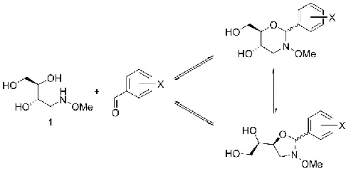
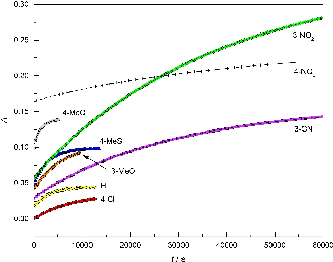
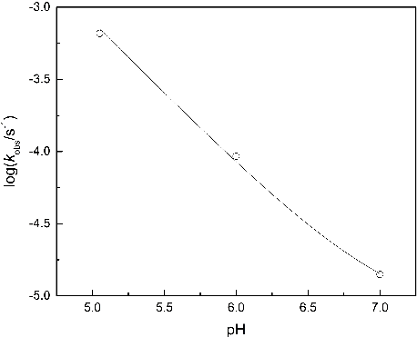
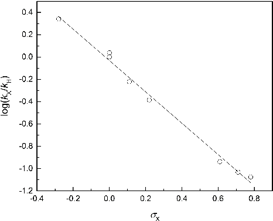
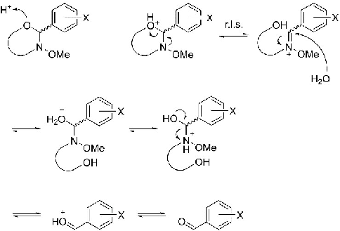
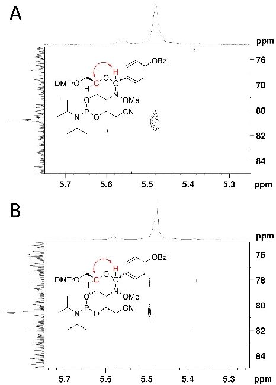
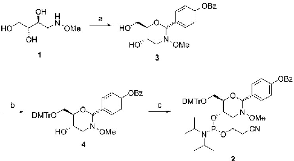

#### Research Article doi.org/10.1002/ejoc.202200538

www.eurjoc.org

Very Important Paper

# Improved Synthesis Strategy for N-Methoxy-1,3-oxazinane Nucleic Acids (MOANAs)

## Josefiina Wallin[a] and Tuomas Lönnberg*[a]

Dependence of the hydrolysis rate of a series of N-methoxy-2phenyl-1,3-oxazinanes on the Hammett substituent constant of the substituent of the phenyl ring was determined, yielding a reaction constant 1= 1.40 0.05. Based on this information, 4-(benzoyloxy)benzaldehyde was selected as a protecting group for a new (2R,3S)-4-(methoxyamino)butane-1,2,3-triol phosphoramidite building block. The yield of the preparation of this

building block as well as its coupling in automated oligonucleotide synthesis were greatly improved compared to the method reported previously. The 2-[4-(benzoyloxy)phenyl]-1,3-oxazine protection persisted throughout the synthesis of short oligonucleotides but was rapidly removed when the oligonucleotides were released from solid support and dissolved in water.

### Introduction

However, synthesis strategy for the oligonucleotide scaffold itself was far from optimal as preparation of the (2R,3S)-4(methoxyamino)butane-1,2,3-triol phosphoramidite building block was tedious and the coupling yield modest.

Myriad artificial nucleobase analogues have been incorporated into oligonucleotides and tested for their potential to stabilize double helices through enhanced stacking,[1–5] hydrogen bonding[6–14] or shape complementarity,[15–17] to expand the genetic alphabet[18–23] and to serve as specific high-affinity binding sites for metal ions.[24–29] A strategy to introduce base moieties post-synthetically to a common scaffold, preferably under aqueous conditions, would greatly facilitate such studies. Unfortunately, the established coupling reactions for postsynthetic conjugation of oligonucleotides with functional moieties are hardly suitable for this task as the linkages obtained are typically too bulky and/or stereochemically nonhomogeneous. A notable exception is PNA, where the peptide bonds between the nucleobases and the backbone can also be formed post-synthetically.[30] The (3R,4R)-4-hydroxymethylpyrrolidin-3-ol phosphate scaffold[31,32] would also lend itself to a similar approach but, to the best of our knowledge, such a study has not been reported.

Cyclization of (2R,3S)-4-(methoxyamino)butane-1,2,3-triol and an aldehyde to a substituted N-methoxy-1,3-oxazinane, designed for the post-synthetic introduction of base moieties, would also offer a way to protect the methoxyamino and one of the hydroxy groups simultaneously. The potential weak point of this strategy is the acid-promoted detritylation step of conventional oligonucleotide synthesis, as 1,3-oxazinanes hydrolyze readily under acidic conditions. However, we reasoned that while the detritylation conditions are highly acidic, the absence of water should keep the equilibrium on the side of the 1,3-oxazinanes, at least with carefully selected aldehydes. In this article we describe the development of an improved synthesis strategy N-methoxy-1,3-oxazinane nucleic acids (MOANAs) based on this reasoning.

### Results and Discussion

We have recently studied N-methoxy-1,3-oxazinane formation between small molecular aldehydes and oligonucleotides incorporating a (2R,3S)-4-(methoxyamino)butane-1,2,3-triol unit

##### Kinetic analysis of acid-catalyzed N-methoxy-1,3-oxazinane hydrolysis

- as a means of post-synthetic derivatization of oligonucleotides with various base moieties.[33] This approach proved successful and a number of derivatives bearing different functional groups could be synthesized from a common oligonucleotide scaffold.

The ideal protecting group for the (2R,3S)-4-(methoxyamino)butane-1,2,3-triol building block would be stable during oligonucleotide synthesis but rapidly removed afterwards in an aqueous solution. The dependence of the rate of the latter reaction on the structure of the aldehyde was studied with a series of benzaldehydes featuring various electrondonating and -withdrawing substituents, chosen to cover a wide range of Hammett substituent constants. First, a mixture of (2R,3S)-4-(methoxyamino)butane-1,2,3-triol (1.0 mM) and an aldehyde (1.0 mM) in acetate buffer (30 mM, pH=5.05) was incubated at 55°C for 20 h to drive N-methoxy-1,3-oxazinane formation near equilibrium. The equilibrium mixture in all likelihood consists of the unreacted (2R,3S)-4-(methoxyamino)butane-1,2,3-triol (1) and aldehyde as well as a five-

[a] J. Wallin, Dr. T. Lönnberg Department of Chemistry University of Turku Henrikinkatu 2, 20500 Turku, Finland E-mail: tuanlo@utu.fi https://bioorganic.utu.fi

Supporting information for this article is available on the WWW under https://doi.org/10.1002/ejoc.202200538

© 2022 The Authors. European Journal of Organic Chemistry published by Wiley-VCH GmbH. This is an open access article under the terms of the Creative Commons Attribution License, which permits use, distribution and reproduction in any medium, provided the original work is properly cited.

10990690, 2022, 35, Downloaded from https://chemistry-europe.onlinelibrary.wiley.com/doi/10.1002/ejoc.202200538 by Universidad De Granada, Wiley Online Library on [03/04/2024]. See the Terms and Conditions (https://onlinelibrary.wiley.com/terms-and-conditions) on Wiley Online Library for rules of use; OA articles are governed by the applicable Creative Commons License

membered (N-methoxyoxazolidine) and a six-membered (Nmethoxyoxazinane) product (Scheme 1), the latter presumably being the dominant component. The mixture was then diluted to 10 μM 4-(methoxyamino)butane-1,2,3-triol and aldehyde concentration and the resulting N-methoxyoxazolidine and Nmethoxyoxazinane hydrolysis followed UV spectrophotometrically at the wavelength of the absorption maximum of the aldehyde. Owing to conjugation of the carbonyl double bond with the aromatic ring, the aldehyde absorbs UV radiation at a considerably longer wavelength than either of the cyclization products, providing a convenient signal for monitoring its release.

hydrolysis of the N-methoxyoxazolidine and N-methoxyoxazinane rings and concomitant release of the aldehyde (Figure 1). All reactions followed strictly first-order kinetics, indicating essentially complete hydrolysis at equilibrium. Firstorder rate constants were obtained by non-linear least-squares fitting of the experimental data to the integrated first-order rate law (Equation 1).

At ¼ Aeq Ao 1 e kobst þ A0 (1)

A0, At and Aeq are absorbances in the beginning, at time point t and at equilibrium, respectively and kobs the observed first-order rate constant. The observed rate constants, along with the Hammett substituent constants of the relevant aldehydes and the absorption wavelengths used in each case, are summarized in Table 1.

With each reaction mixture, time-dependent increase of absorbance was observed after dilution, consistent with

A glance at Table 1 reveals that N-methoxyoxazolidine and N-methoxyoxazinane hydrolysis is facilitated by electron-donating and retarded by electron-withdrawing substituents of the aromatic ring. To put this observation on a more quantitative basis, log(kX/kH) was plotted as a function of the Hammett substituent constant σX (Figure 2). This plot was strictly linear and the fit of the experimental data to the Hammett equation (Equation 2) excellent.

kX kH

log

¼ 1sX (2)

Scheme 1. Equilibria between (2R,3S)-4-(methoxyamino)butane-1,2,3-triol and a substituted benzaldehyde and the respective N-methoxyoxazolidine and N-methoxyoxazinane products.

- Figure 1. Time-dependent absorbances of reaction mixtures obtained by 1:100 dilution of 1 mM equilibrium mixtures of (2R,3S)-4-(methoxyamino)butane1,2,3-triol and 4-methoxybenzaldehyde (*, gray), 4-methylthiobenzaldehyde (~, blue), benzaldehyde (!, yellow), 3-methoxybenzaldehyde (

, red), 3-cyanobenzaldehyde (&, purple), 3-nitrobenzaldehyde (^, green) and 4-nitrobenzaldehyde (+, black); T=55°C; pH=5.05 (30 mM acetate buffer); I(NaClO4)=0.10 M. Only every 50th data point is shown for clarity.

, orange), 4chlorobenzaldehyde (

!

!

10990690, 2022, 35, Downloaded from https://chemistry-europe.onlinelibrary.wiley.com/doi/10.1002/ejoc.202200538 by Universidad De Granada, Wiley Online Library on [03/04/2024]. See the Terms and Conditions (https://onlinelibrary.wiley.com/terms-and-conditions) on Wiley Online Library for rules of use; OA articles are governed by the applicable Creative Commons License

Table 1. First-order rate constants of hydrolysis of the various N-methoxyoxazolidines and N-methoxyoxazinanes, Hammett substituent constants of the corresponding aldehydes and absorption wavelengths used to follow aldehyde release in each case; T=55°C; pH=5.05 (30 mM acetate buffer); I(NaClO4)=0.10 M.

Substituent [X] σX kobs/10 4 s 1 λ [nm]

4-MeO 0.28 6.58 0.03 284 4-MeS 0 3.274 0.003 315 H 0 3.002 0.002 248

- 3-MeO 0.11 1.802 0.002 255
- 4-Cl 0.22 1.236 0.001 258

- 3-CN 0.61 0.3466 0.0002 243

- 3-NO2 0.71 0.2683 0.0001 233
- 4-NO2 0.78 0.2529 0.0003 266

Figure 3. pH-rate profile for the hydrolysis of N-methoxyoxazolidines and Nmethoxyoxazinanes derived from (2R,3S)-4-(methoxyamino)butane-1,2,3-triol and 4-methoxybenzaldehyde; T=55°C; I(NaClO4)=0.10 M

kobs ¼ kH½H3Oþ þ kW (3)

kH is the second-order rate constant of the hydronium ion catalyzed reaction and kW the first-order rate constant of the pH-independent reaction, respectively. The values obtained by

fitting to Equation 3 were kH=79 7 M 1s 1 and kW=(6 2)× 10 6 s 1.

A mechanism consistent with the results discussed above is presented in Scheme 2. The endocyclic oxygen is first protonated in a rapid pre-equilibrium step. The C O bond is then cleaved at the rate-limiting step, leading to formation of an oximinium ion intermediate. Attack of a water molecule on the oximinium carbon, followed by intramolecular proton transfer, cleavage of the C N bond and, finally, deprotonation, complete the hydrolysis.

- Figure 2. Hammett plot for the hydrolysis of the various N-methoxyoxazolidines and N-methoxyoxazinanes; T=55°C; pH=5.05 (30 mM acetate buffer); I(NaClO4)=0.10 M.

The value obtained for the reaction constant, 1= 1.40

0.05, indicates considerable build-up of positive charge on going from initial state to rate-limiting transition state, consistent with a developing iminium ion at the benzylic carbon. In contrast to what has been reported for hydrolysis of benzaldehyde and acetophenone acetals,[34–36] the observed rate constants correlated well with the standard Hammett σ scale, suggesting that resonance stabilization of this carbocation by the aromatic ring plays only a minor role, if any. Presumably, such stabilization would be less significant with the more stable oximinium ion than with an oxocarbenium ion.

pH-dependence of N-methoxyoxazolidine and N-methoxyoxazinane hydrolysis was only studied with the 4-methoxybenzaldehyde derivative between pH 5.05 and 7.00 (Figure 3). Over this narrow range, the reaction was nearly firstorder in hydronium ion, consistent with previous reports on Nmethoxyoxazolidines.[37–39] Modest upward curvature could, however, be seen at the higher end of the pH range, suggesting a minor contribution by a pH-independent pathway. Rate constants of these partial reactions were obtained by non-linear least-squares fitting of the experimental data to Equation 3.

Scheme 2. Proposed mechanism for N-methoxyoxazolidine and N-methoxyoxazinane hydrolysis.

10990690, 2022, 35, Downloaded from https://chemistry-europe.onlinelibrary.wiley.com/doi/10.1002/ejoc.202200538 by Universidad De Granada, Wiley Online Library on [03/04/2024]. See the Terms and Conditions (https://onlinelibrary.wiley.com/terms-and-conditions) on Wiley Online Library for rules of use; OA articles are governed by the applicable Creative Commons License

Given the observed dependence of the N-methoxyoxazinane hydrolysis rate on the electron density of the aromatic ring, an ideal protecting group for the (2R,3S)-4(methoxyamino)butane-1,2,3-triol building block would bear a strongly electron-withdrawing substituent during chain assembly but a strongly electron-donating one after release of the oligonucleotide from the solid support. We reasoned that 4benzoyloxybenzaldehyde would meet both requirements as removal of the benzoyl protection during the conventional ammonolysis would change the substituent from an electronwithdrawing one to an electron-donating one. More specifically, the Hammett substituent constants for para-benzoyloxy and para-hydroxy substituents are 0.13 and 0.38, respectively.[40] Substituting these values for σX in Equation 2 predicts a 4.5-fold rate acceleration on removal of the benzoyl group.

##### Building block synthesis

Synthesis of the 4-(benzoyloxy)benzylidene protected (2R,3S)-4(methoxyamino)butane-1,2,3-triol phosphoramidite building block 2 is outlined in Scheme 3. (2R,3S)-4-(methoxyamino)butane-1,2,3-triol[33] (1) was first allowed to react with

- 4-(benzoyloxy)benzaldehyde[41] under acidic conditions to afford a mixture of the desired N-methoxy-1,3-oxazinane 3 as well as the respective oxazolidine product, resulting from ring closure by O3 rather than O2 (Scheme 1). The primary hydroxy group of

- 3 was protected as a dimethoxytrityl ether, giving intermediate
- 4, and the remaining secondary hydroxy group phosphitylated by conventional methods to afford the phosphoramidite building block 2. It is worth pointing out that in compound 2, oxazinane–oxazolidine isomerization is no longer possible and the desired oxazinane isomer could, hence, be isolated by silica gel chromatography. HMBC spectra of both diastereomers of the purified product (Figure 4) showed a coupling between the pseudoanomeric proton and C2 of the (2R,3S)-4-(methoxyamino)butane-1,2,3-triol part, thus confirming formation of the desired oxazinane as the main product.

Figure 4. HMBC cross-peaks between the pseudoanomeric proton and C2 of the (2R,3S)-4-(methoxyamino)butane-1,2,3-triol part of A) the faster-eluting and B) the slower-eluting diastereomer of compound 2, confirming the expected six-membered ring structure.

##### Oligonucleotide synthesis

The utility of phosphoramidite building block 2 in the synthesis of MOANA oligonucleotides was tested with two sequences, ON1 and ON2 (5'-CGAGCXCTGGC-3' and 5'-CGAGXXXTGGC-3', respectively, X referring to the modified residue). ON1 was identical to the MOANA oligonucleotide synthesized previously using the first-generation (2R,3S)-4-(methoxyamino)butane1,2,3-triol building block. ON2, in turn, incorporated a continuous stretch of three modified residues to test the efficiency of successive couplings of building block 2.

Oligonucleotides ON1 and ON2 were assembled by an automated DNA/RNA synthesizer employing conventional phosphoramidite strategy and coupling times optimized for standard DNA building blocks. Trityl response remained essentially unchanged throughout both sequences, consistent with nearly quantitative coupling yields. These gratifying results are in sharp contrast with those obtained with the first-generation building block, which coupled at only 65% efficiency despite a considerably longer coupling time. On completion of chain assembly, the oligonucleotides were released from the solid supports and the phosphate and base protections, including

Scheme 3. Synthesis of the 4-(benzoyloxy)benzylidene protected (2R,3S)-4(methoxyamino)butane-1,2,3-triol phosphoramidite building block 2. Reagents and conditions: a) 4-benzoyloxybenzaldehyde, AcOH, 1,4-dioxane, 50°C, 16 h; b) DMTrCl, CH2Cl2, pyridine, N2 atmosphere, 25°C, 16 h; c) 2cyanoethyl-N,N-diisopropylchlorophosphoramidite, Et3N, CH2Cl2, N2 atmosphere, 25°C, 1 h.

10990690, 2022, 35, Downloaded from https://chemistry-europe.onlinelibrary.wiley.com/doi/10.1002/ejoc.202200538 by Universidad De Granada, Wiley Online Library on [03/04/2024]. See the Terms and Conditions (https://onlinelibrary.wiley.com/terms-and-conditions) on Wiley Online Library for rules of use; OA articles are governed by the applicable Creative Commons License

the benzoyl protection of building block 2, removed by conventional ammonolysis.

determined provides a firm basis for rational fine-tuning of the stability. For example, addition of one nitro substituent to the ortho or para (or equivalent) position of an aromatic aldehyde will cause a 6-fold retardation of the hydrolysis rate. Stability of N-methoxy-1,3-oxazinane protection of the (2R,3S)-4-(methoxyamino)butane-1,2,3-triol phosphoramidite building block can be adjusted in the same way.

The crude oligonucleotide product mixtures were purified by RP-HPLC. The chromatogram of ON1 had one clear main peak, whereas that of ON2 also showed another peak of comparable intensity but a much longer retention time (both chromatograms presented in the Supporting Information). In both cases, mass spectrometric analysis of the first eluting main peak revealed complete loss of the 4-hydroxybenzaldehyde protection – only traces of the protected oligonucleotides could be found in later eluting minor fractions. Instead, acetaldehyde adducts were observed, in line with the earlier report.[33] These adducts appeared over time and were more prominent in dilute (low micromolar) solutions of ON1 and ON2, suggesting impurities in the solvents or buffer components as a probable source of the acetaldehyde. Solutions containing acetic acid, such as the triethylammonium acetate HPLC elution buffer, appeared to be particularly effective at converting ON1 and ON2 to their acetaldehyde adducts. Indeed, acetaldehyde is a known impurity of acetic acid, present in up to 2 ppm concentration in the HPLC grade used in preparation of the elution buffer.

### Experimental Section

General methods: Unless noted otherwise, all chemicals were commercial products that were used as received. Et3N was dried over CaH2 and solvents over activated 4 Å molecular sieves. NMR spectra were recorded on a Bruker Biospin 500 MHz NMR spectrometer, with chemical shifts (δ, ppm) referenced to the residual proton signal of the deuterated solvent. Mass spectra were recorded on a Bruker Daltonics micrOTOF-Q mass spectrometer and UV spectra on a PerkinElmer Lambda 35 UV/vis spectrophotometer equipped with a Peltier temperature control unit.

Kinetic measurements: An equimolar (1.0 mM) mixture of (2R,3S)-4(methoxyamino)butane-1,2,3-triol (1) and a substituted benzaldehyde in 30 mM aqueous AcOH/AcONa buffer (pH=5.05) was incubated at 55°C for 20 h. 10 μL of this mixture was then diluted to 1.0 mL with 30 mM aqueous AcOH/AcONa buffer (pH=5.05) and the absorbance of the resulting solution at an appropriate wavelength (Table 1) was recorded at 10 s intervals, while maintaining the temperature at 55.0 0.1°C. First-order rate constants for the hydrolysis of the N-methoxy-1,3-oxazinanes (and -oxazolidines) were obtained by non-linear least-squares fitting of the experimental data (absorbance as a function of time) to the integrated firstorder rate law (Equation 1).

Deprotection of building block 2 during oligonucleotide synthesis could lead to formation of branched side products if coupling took place at the exposed secondary hydroxy group. In theory, the observed trityl responses could be explained by compensation of inefficient coupling at the primary hydroxy group by partial coupling at the secondary one. No branched side products were, however, found in any of the fractions collected during the HPLC purification. Notably, the later eluting large peak in the product mixture of ON2 was not an oligonucleotide at all. Apparently, the protection of building block 2 is stable under the conditions of standard oligonucleotide synthesis but, after removal of the benzoyl group, is promptly hydrolyzed on dissolving the oligonucleotide in water.

(5S,6R)-6-[(4,4'-Dimethoxytrityloxy)methyl]-3-methoxy-2-(4-benzoyloxyphenyl)-1,3-oxazinan-5-ol-5-(2-cyanoethyl-N,N-diisopropylphosphoramidite) (2): (2R,3S)-4-(methoxyamino)butane-1,2,3-triol (1, 0.1751 g, 1.158 mmol) and 4-(benzoyloxy)benzaldehyde (0.2655 g, 1.174 mmol) were dissolved in 1,4-dioxane (5.0 mL). The mixture was acidified (pH=4) with AcOH, stirred at 50°C for 16 h, neutralized (pH=8) with Et3N and evaporated to dryness. The residue was passed through a short plug of silica gel (Et3N:MeOH: CH2Cl2=1:7:92, v/v), yielding 0.2718 g of a mixture of compound 3 and its ring isomers. This mixture was coevaporated from dry pyridine (2×20 mL) and the residue was dissolved in dry pyridine (10 mL) under N2 atmosphere. A solution of DMTrCl (0.2826 g, 0.8341 mmol) in dry CH2Cl2 (2.0 mL) was added and the resulting mixture stirred at 25°C under N2 atmosphere for 16 h, after which it was concentrated to approximately 25% volume. The residue was diluted with CH2Cl2 (50 mL) and washed with saturated aqueous NaHCO3 (50 mL). The organic phase was dried with Na2SO4 and evaporated to dryness. The residue was passed through a short plug of silica gel (Et3N:MeOH:CH2Cl2=1:2:97, v/v), yielding 0.4197 g of a mixture of compound 4 and its ring isomers. This mixture was coevaporated from dry toluene (3×30 mL) and the residue was dissolved in dry CH2Cl2 (4.0 mL) under N2 atmosphere. Dry Et3N (442 μL, 3.17 mmol) and 2-cyanoethyl-N,N-diisopropylchlorophosphoramidite (170 μL, 0.761 mmol) were added and the resulting mixture stirred at 25°C under N2 atmosphere for 1 h. The product mixture was diluted with CH2Cl2 (50 mL) and washed with saturated aqueous NaHCO3 (50 mL). The residue was purified by silica gel column chromatography (Et3N:EtOAc:hexane=1:40:59, v/ v), yielding a total of 0.2453 g (24%) of the two diastereomers of compound 2. 1H NMR (500 MHz, CD3CN, faster-eluting diastereomer): δ=8.22 (m, 2H, Bz-H2 and H6), 7.74 (m, 1H, Bz-H4), 7.71 (m, 2H, BzOPh-H2 and H6), 7.61 (m, 2H, Bz-H3 and H5), 7.57 (m, 2H, Ph-H2

### Conclusion

Condensation with 4-(benzoyloxy)benzaldehyde was proven as a convenient protecting group strategy for preparation of a phosphoramidite building block of (2R,3S)-4-(methoxyamino)butane-1,2,3-triol, giving the desired six-membered N-methoxy-1,3-oxazinane as the main product. Compared to the synthesis of the first-generation MOANA building block,[33] the pathway presented herein is much shorter and higheryielding – 5 vs. 24% from (2R,3S)-4-(methoxyamino)butane1,2,3-triol to the phosphoramidite building block. Furthermore, the new building block was coupled much more efficiently during oligonucleotide synthesis, presumably owing to the absence of bulky protecting groups near the phosphoramidite moiety. The oxazinane protection appeared to be sufficiently stable during chain assembly but lost spontaneously during or after ammonolysis. For most purposes, base modifications introduced as aldehydes to the MOANA backbone would have to be considerably more stable and the Hammett correlation

10990690, 2022, 35, Downloaded from https://chemistry-europe.onlinelibrary.wiley.com/doi/10.1002/ejoc.202200538 by Universidad De Granada, Wiley Online Library on [03/04/2024]. See the Terms and Conditions (https://onlinelibrary.wiley.com/terms-and-conditions) on Wiley Online Library for rules of use; OA articles are governed by the applicable Creative Commons License

and H6), 7.42 (m, 4H, MeOPh-H2 and H6), 7.35 (m, 2H, BzOPh-H3 and H5), 7.34 (m, 2H, Ph-H3 and H5), 7.25 (m, 1H, Ph-H4), 6.90 (m, 4H, MeOPh-H3 and H5), 5.48 (s, 1H, OCHN), 4.20 (m, 1H, OCHCH2NO), 3.86 (m, 1H, DMTrOCH2CH), 3.79 (s, 7H, ArOCH3 and OCHCH2NO), 3.49 (m, 3H, DMTrOCH2 and CH(CH3)2), 3.40 (m, 2H, POCH2CH2), 3.31 (m, 1H, DMTrOCH2), 3.15 (s, 3H, NOCH3), 3.04 (m, 1H, OCHCH2NO), 2.43 (m, 2H, POCH2CH2), 1.15 (d, J=5.5 Hz, 6H, CH(CH3)2), 1.14 (d, J=5.8 Hz, 6H, CH(CH3)2). 13C NMR (125 MHz, CD3CN, faster-eluting diastereomer): δ=165.1 (Bz-CO), 158.6 (MeOPh-C4), 150.7 (BzOPh-C4), 145.4 (Ph-C1), 136.2 (MeOPh-C1), 133.9 (Bz-C4), 130.2 (MeOPh-C2 and C6), 130.1 (Bz-C1), 129.9 (Bz-C2 and C6), 129.6 (BzOPh-C1), 128.9 (Bz-C3 and C5), 128.3 (Ph-C2 and C6), 128.1 (BzOPh-C2 and C6), 127.8 (Ph-C3 and C5), 126.8 (Ph-C4), 121.4 (BzOPh-C3 and C5), 118.4 (CN), 112.9 (MeOPh-C3 and C5), 90.8 (OCHN), 85.6 (Ar3C), 80.8 (DMTrOCH2CH), 63.5 (DMTrOCH2), 61.3 (d, J=14.8 Hz, OCHCH2NO), 60.0 (NOCH3), 58.5 (d, J=18.8 Hz, POCH2CH2), 55.6 (OCHCH2NO), 54.9 (ArOCH3), 42.9 (d, J=12.1 Hz,

acetaldehyde adducts were also detected, presumably due to reactions with solvent impurities. Isolated yields of ON1 and ON2 were 265 nmol (26.5%) and 94 nmol (9.4%), respectively.

### Conflict of Interest

The authors declare no conflict of interest.

### Data Availability Statement

The data that support the findings of this study are available in the supplementary material of this article.

- CH(CH3)2), 24.0 (d, J=8.0 Hz, CH(CH3)2), 23.8 (d, J=7.0 Hz, CH(CH3)2),

- 19.9 (d, J=7.2 Hz, POCH2CH2). 31P NMR (202 MHz, CD3CN, faster-

- eluting diastereomer): δ=147.8. 1H NMR (500 MHz, CD3CN, slowereluting diastereomer): δ=8.22 (m, 2H, Bz-H2 and H6), 7.73 (m, 1H, Bz-H4), 7.72 (m, 2H, BzOPh-H2 and H6), 7.60 (m, 2H, Bz-H3 and H5), 7.57 (m, 2H, Ph-H2 and H6), 7.42 (m, 4H, MeOPh-H2 and H6), 7.35 (m, 2H, BzOPh-H3 and H5), 7.33 (m, 2H, Ph-H3 and H5), 7.25 (m, 1H, Ph-H4), 6.89 (m, 4H, MeOPh-H3 and H5), 5.47 (s, 1H, OCHN), 4.11 (m, 1H, OCHCH2NO), 3.89 (m, 1H, OCHCH2NO), 3.88 (m, 1H, DMTrOCH2CH), 3.81 (m, 1H, POCH2CH2), 3.77 (s, 6H, ArOCH3), 3.67 (m, 1H, POCH2CH2), 3.47 (m, 2H, CH(CH3)2), 3.44 (m, 1H, DMTrOCH2), 3.32 (m, 1H, DMTrOCH2), 3.17 (s, 3H, NOCH3), 3.02 (m, 1H, OCHCH2NO), 2.66 (m, 2H, POCH2CH2), 1.11 (d, J=6.7 Hz, 6H, CH(CH3)2), 0.93 (d, J=6.8 Hz, 6H, CH(CH3)2). 13C NMR (125 MHz, CD3CN, slower-eluting diastereomer): δ=165.1 (Bz-CO), 158.6 (MeOPh-C4), 150.6 (BzOPh-C4), 145.5 (Ph-C1), 136.0 (MeOPh-C1), 133.9 (Bz-C4), 130.2 (Bz-C1), 130.1 (MeOPh-C2 and C6), 129.9 (Bz-C2 and C6), 129.6 (BzOPh-C1), 128.9 (Bz-C3 and C5), 128.3 (BzOPh-C2 and C6), 128.1 (Ph-C2 and C6), 127.8 (Ph-C3 and C5), 126.8 (Ph-C4), 121.3 (BzOPh-C3 and C5), 118.7 (CN), 113.0 (MeOPh-C3 and C5), 90.8 (OCHN), 85.6 (Ar3C), 80.6 (DMTrOCH2CH), 63.7 (DMTrOCH2), 62.3 (d, J=11.3 Hz, OCHCH2NO), 60.0 (NOCH3), 58.0 (d, J=19.5 Hz, POCH2CH2), 55.8 (OCHCH2NO), 54.9 (ArOCH3), 42.9 (d, J=12.5 Hz,

CH(CH3)2), 24.1 (d, J=8.1 Hz, CH(CH3)2), 23.8 (d, J=6.0 Hz, CH(CH3)2), 20.1 (d, J=7.0 Hz, POCH2CH2). 31P NMR (202 MHz, CD3CN, slower-

- eluting diastereomer): δ=148.2. HRMS (ESI+-TOF): m/z calcd for [C49H57N3O9P]: 862.3827; found: 862.3849 [M+H]+.

Keywords: Hammett correlation · Hydrolysis · Oligonucleotides · Oxazinanes · Protecting groups

- [1] A. T. Krueger, H. Lu, A. H. F. Lee, E. T. Kool, Acc. Chem. Res. 2006, 40, 141–150.
- [2] N. J. Leonard, D. I. C. Scopes, P. VanDerLijn, J. R. Barrio, Biochemistry 1978, 17, 3677–3685.
- [3] K. L. Seley, in Recent Adv. Nucleosides Chem. Chemother., Elsevier, 2002, pp. 299–326.
- [4] H. Kashida, H. Asanuma, J. Synth. Org. Chem. Jpn. 2021, 79, 1013–1019.
- [5] M. Winnacker, E. T. Kool, Angew. Chem. Int. Ed. 2013, 52, 12498–12508; Angew. Chem. 2013, 125, 12728–12739.
- [6] M. B. Danielsen, J. Wengel, Beilstein J. Org. Chem. 2021, 17, 1828–1848.
- [7] K. Y. Lin, M. D. Matteucci, J. Am. Chem. Soc. 1998, 120, 8531–8532.
- [8] K. H. Scheit, H. R. Rackwitz, Nucleic Acids Res. 1982, 10, 4059–4069.
- [9] C. J. Wilds, M. A. Maier, V. Tereshko, M. Manoharan, M. Egli, Angew. Chem. Int. Ed. 2002, 41, 115–117; Angew. Chem. 2002, 114, 123–125.
- [10] F. Wojciechowski, R. H. E. Hudson, J. Am. Chem. Soc. 2008, 130, 12574– 12575.
- [11] A. M. Varizhuk, T. S. Zatsepin, A. V. Golovin, E. S. Belyaev, Y. I. Kostyukevich, V. G. Dedkov, G. A. Shipulin, G. V. Shpakovski, A. V. Aralov, Bioorg. Med. Chem. 2017, 25, 3597–3605.
- [12] J. Brzezinska, Z. Gdaniec, L. Popenda, W. T. Markiewicz, Biochim. Biophys. Acta Gen. Subj. 2014, 1840, 1163–1170.
- [13] K. Yamada, Y. Masaki, H. Tsunoda, A. Ohkubo, K. Seio, M. Sekine, Org. Biomol. Chem. 2014, 12, 2255–2262.
- [14] C. Lou, A. Dallmann, P. Marafini, R. Gao, T. Brown, Chem. Sci. 2014, 5, 3836–3844.
- [15] T. Mitsui, A. Kitamura, M. Kimoto, T. To, A. Sato, I. Hirao, S. Yokoyama, J. Am. Chem. Soc. 2003, 125, 5298–5307.
- [16] M. Minuth, C. Richert, Angew. Chem. Int. Ed. 2013, 52, 10874–10877; Angew. Chem. 2013, 125, 11074–11077.
- [17] N. Griesang, C. Richert, Tetrahedron Lett. 2002, 43, 8755–8758.
- [18] P. Nie, Y. Bai, H. Mei, Molecules 2020, 25, 3483.
- [19] N. Saito-Tarashima, N. Minakawa, Chem. Pharm. Bull. 2018, 66, 132–138.
- [20] D. A. Malyshev, F. E. Romesberg, Angew. Chem. Int. Ed. 2015, 54, 11930– 11944; Angew. Chem. 2015, 127, 12098–12113.
- [21] M. Kimoto, I. Hirao, Chem. Soc. Rev. 2020, 49, 7602–7626.
- [22] S. A. Mukba, P. K. Vlasov, P. M. Kolosov, E. Y. Shuvalova, T. V. Egorova, E. Z. Alkalaeva, Mol. Biol. 2020, 54, 475–484.
- [23] K. Hamashima, M. Kimoto, I. Hirao, Curr. Opin. Chem. Biol. 2018, 46, 108– 114.
- [24] S. Naskar, R. Guha, J. Müller, Angew. Chem. Int. Ed. 2020, 59, 1397–1406; Angew. Chem. 2020, 132, 1413–1423.
- [25] B. Jash, J. Müller, Chem. Eur. J. 2017, 23, 17166–17178.
- [26] Y. Takezawa, J. Müller, M. Shionoya, Chem. Lett. 2017, 46, 622–633.
- [27] Y. Takezawa, M. Shionoya, Acc. Chem. Res. 2012, 45, 2066–2076.
- [28] G. H. Clever, M. Shionoya, Coord. Chem. Rev. 2010, 254, 2391–2402.
- [29] H. Yang, K. L. Metera, H. F. Sleiman, Coord. Chem. Rev. 2010, 254, 2403– 2415.
- [30] J. M. Heemstra, D. R. Liu, J. Am. Chem. Soc. 2009, 131, 11347–11349.
- [31] K. Clinch, G. B. Evans, R. H. Furneaux, D. H. Lenz, J. M. Mason, S. P. H. Mee, P. C. Tyler, S. J. Wilcox, Org. Biomol. Chem. 2007, 5, 2800–2802.

Oligonucleotide synthesis: Oligonucleotides ON1 and ON2 were assembled in 1 μmol scale on controlled pore glass support by an ÄKTA Oligopilot plus 10 DNA/RNA synthesizer. Conventional phosphoramidite strategy with 5-(benzylthio)-1H-tetrazole as the activator and a recycling time optimized for commercially available DNA building blocks (120 s) was employed. Based on trityl response, all couplings, including those with the MOANA building block 2, proceeded with near-quantitative efficiency. After chain assembly, the solid supports were incubated in 25% aqueous NH3

- at 55°C for 16 h to cleave the succinyl linker and the phosphate and base protections, as well as the benzoyl protection of building block 2. The crude products were purified by RP-HPLC on a Hypersil ODS C18 column (250×10 mm, 5 μm) eluting with a linear gradient (5–20% over 25 min for ON1 and 5–25% over 25 min for ON2, flow rate=3.0 mLmin 1) of acetonitrile in 50 mM aqueous triethylammonium acetate, the detection wavelength being 260 nm (chromatograms presented in the Supporting Information). The identity of the purified oligonucleotides was established by ESI-TOF-MS and the quantity by UV spectrophotometry using molar absorptivities obtained by the nearest-neighbors method and assuming the absorptivity of the MOANA building block to be negligible. In addition to “naked”, ON1 and ON2, significant signals of their

10990690, 2022, 35, Downloaded from https://chemistry-europe.onlinelibrary.wiley.com/doi/10.1002/ejoc.202200538 by Universidad De Granada, Wiley Online Library on [03/04/2024]. See the Terms and Conditions (https://onlinelibrary.wiley.com/terms-and-conditions) on Wiley Online Library for rules of use; OA articles are governed by the applicable Creative Commons License

- [39] T. Österlund, H. Korhonen, P. Virta, Org. Lett. 2018, 20, 1496–1499.
- [40] D. D. Perrin, B. Dempsey, E. P. Serjeant, in pKa Prediction for Organic Acids and Bases, Springer Netherlands, 1981.
- [41] N. P. R. Onuska, M. E. Schutzbach-Horton, J. L. Rosario Collazo, D. A. Nicewicz, Synlett 2020, 31, 55–59.

- [32] J. M. Mason, H. Yuan, G. B. Evans, P. C. Tyler, Q. Du, V. L. Schramm, Eur. J. Med. Chem. 2017, 127, 793–809.
- [33] M. N. K. Afari, P. Virta, T. Lönnberg, Org. Biomol. Chem. 2022, 20, 3480– 3485.
- [34] P. D. R. Rose, A. Williams, J. Chem. Soc. Perkin Trans. 2 2002, 2, 1589– 1595.
- [35] P. R. Young, W. P. Jencks, J. Am. Chem. Soc. 2002, 99, 8238–8248.
- [36] P. R. Young, R. C. Bogseth, E. G. Rietz, J. Am. Chem. Soc. 2002, 102, 6268– 6271.
- [37] A. Aho, A. Äärelä, H. Korhonen, P. Virta, Molecules 2021, 26, 490.
- [38] A. Aho, M. Sulkanen, H. Korhonen, P. Virta, Org. Lett. 2020, 22, 6714– 6718.

Manuscript received: May 9, 2022 Revised manuscript received: May 25, 2022 Accepted manuscript online: May 25, 2022

