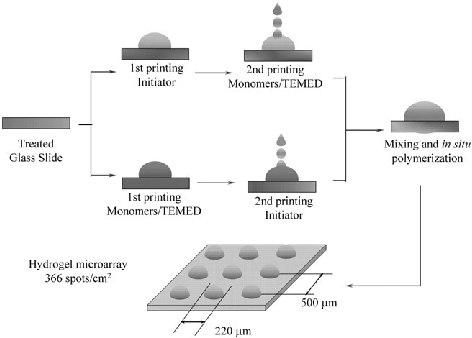
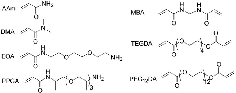
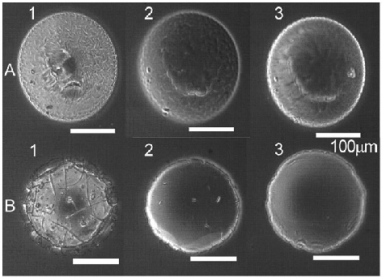
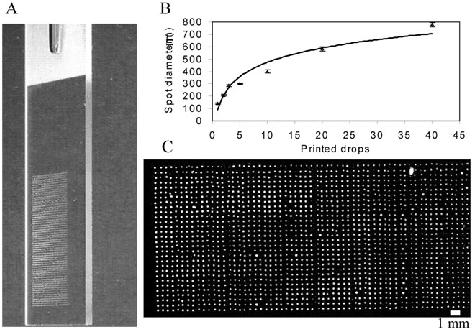
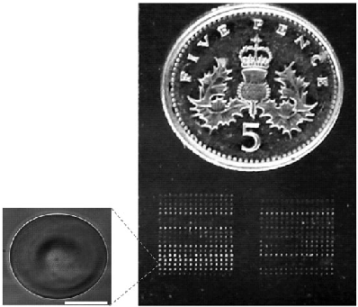
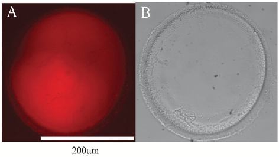

Published on 11 January 2008. Downloaded by Universidad de Granada on 3/3/2024 7:27:46 PM.

View Article Online / Journal Homepage / Table of Contents for this issue

COMMUNICATION www.rsc.org/chemcomm | ChemComm

# Inkjet fabrication of hydrogel microarrays using in situ nanolitre-scale polymerisationw

Rong Zhang, Albert Liberski, Ferdous Khan, Juan Jose Diaz-Mochon and Mark Bradley*

Received (in Cambridge, UK) 20th November 2007, Accepted 19th December 2007 First published as an Advance Article on the web 11th January 2008 DOI: 10.1039/b717932d

manner, 231 formulations of three independent liquid crystals.21 Here we report the use of an inkjet based approach for the rapid preparation of patterned hydrogel microarrays on glass slides, through the use of in situ pico-nano litre-scale polymerisation (see Scheme 1).z

Polymer hydrogel microarrays were fabricated by inkjet printing of monomers and initiator, allowing up to 1800 individual polymer features to be printed on a single glass slide.

Hydrogels, due to their intrinsic hydration properties have huge potential, with applications in the area of tissue engineering,1–3 and cellular attachment/release.4,5 These flexible gels have also been applied as thermally responsive micropumps/ valves,6 as components in sensors,7,8 as surface actuators9 and for drug release.10

The approach used an inkjet printer to rapidly print (independently) both an initiator (ammonium persufate (APS)) and monomers that contained the reductant N,N,N0,N0-tetramethylethylenediamine (TEMED) onto glass slides at highly defined positions, with specific numbers of drops printed in any defined position on the array. This APS/TEMED redox system is well established and is able to initiate polymerisation and gelation of many water-soluble acrylamides and acrylates under a range of conditions.22

A multitude of techniques such as photolithography,11 soft lithography,12–14 electron-beam lithography,15 nanolithography16 and reactive ion etching17 have been used to generate hydrogel patterns using for example crosslinked poly(2-hydroxyethyl methacrylate) (pHEMA), poly(polyethylene glycol)methacrylate and polyacrylamides, as well as non-synthetic polymers such as collagen, with feature resolutions ranging from nm’s to mm’s.

To prepare arrays of polymers the glass slide was initially treated with 3-(trimethoxysilyl)methacrylate in order to provide an anchor for the hydrogel during polymerisation (see ESIw for details). Arrays were prepared in two ways. Firstly, 37 pre-generated mixtures of monomers (Fig. 1) were printed and polymerised (20 copies of each feature were printed) giving 740 features in total (see ESI,w Fig. S1). Polymerisation gave excellent spot morphologies due to the non-contact nature of the deposition (see Fig. 2).

A key aspect in all these processes is the generation of the hydrogel with photo-initiated polymerisation being perhaps the most widely applied approach. This is typically achieved by the irradiation of mixtures of monomers or oligomers with initiators, often through a photomask or via the polymerisation of pre-stamped materials,2,3,5,6,11,13 although other polymerisation methods such as ATRP,18 plasma polymerization4 and redox initiated polymerization8,14 have all been reported.

In this array dimethylacrylamide was the major monomer copolymerised with a range of other monomers bearing amino groups with various crosslinkers with different chain length, potentially allowing the amino group to be used as handles for further chemistry.23 These hydrogel arrays were analysed dry

These methods are generally used to fabricate patterns en masse using single, well defined materials. Patterning tens, hundreds or thousands of different materials on a single glass slide remains a huge challenge. Langer and co-workers19 approached this problem by printing pre-mixed formulations of different monomers on glass slides (coated with pHEMA), using a DNA contact printer, which were then polymerised by UV irradiation, the rapid evaporation of small droplets (printed on the slides) necessitating the use of non-volatile monomers. Our group used an alternative approach via the contact printing of pre-formed polymers onto cytophobic (agarose coated) slides to generate well defined polymer microarrays.20

Recently an inkjet printing approach was used by our group to prepare, in a high-throughput and highly miniaturised

EaStCHEM, School of Chemistry, King’s Building, University of Edinburgh, Edinburgh, UK EH9 3JJ. E-mail: mark.bradley@ed.ac.uk; Fax: 0131 650 6453; Tel: 0131 650 4820 w Electronic supplementary information (ESI) available: Experimental section. See DOI: 10.1039/b717932d

Scheme 1 The two approaches used for inkjetting hydrogel microarray in situ pico–nano litre polymerisation.

Published on 11 January 2008. Downloaded by Universidad de Granada on 3/3/2024 7:27:46 PM.

- Fig. 1 The monomers used for the fabrication of the hydrogel microarrays (for the combinations used see ESIw (Table S1)).

- Fig. 2 Phase contrast microscopy images of hydrogel spots of samples A and B: (1) dried spot; (2) swollen in DMF and (3) swollen

and in DMF and water (Fig. 2) demonstrating their uniformity and their swelling.

The size of the features was controlled by changing the number of drops printed per spot. Using four drops per spot 366 features cm 2 could be printed (with a pitch between spots of 500 mm) and a spot size of 210 10 mm (Fig. 3).

The second approach used the printing of a series of monomers (rather than pre-formed mixtures of monomers) that could be over-printed, allowing spot-to-spot based fabrication of polymers. As a demonstration 36 polymers were synthesised at high density (366 features cm 2) in situ with 15 copies of each polymer being printed (see ESIw for details). Fig. 4 shows an example of an in situ synthesized polymer microarray.

To ensure that the over-mixing procedure induced significant turbulence in the spots the mixing time was analysed and demonstrated to be less than 1.5 min (see Fig. 5).

It was important to show that the polymers prepared via this microarray approach were analogous to those prepared using more conventional conditions. To this end polymers were synthesized (without cross-linkers) on both glass slides (printing 200 features) and under identical conditions in glass vials. The polymers were dissolved and characterised via GPC (see ESIw for details). Table 1 shows the average molecular weight and polydispersity of the linear poly(dimethylacrylamide-co-

in water (A = DMA–EOA–PEG12DA (ratio 5.2 : 1.7 : 2, 20% w/w) and B = DMA–AAm–MBA (ratio 4.3 : 3.5 : 1, 11% w/w)). An autodrop 70 mm pipette was used for printing with a controlled relative humidity of 73%.

- Fig. 3 (A) An image of a hydrogel microarray slide. (B) The variation of spot diameter with the number of drops printed (monomers =

DMA, AAm and PEG12DA in a ratio of 6.1 : 1.7 : 1, 19.5% w/w) (see ESIw). (C) A high-density hydrogel microarray with 1800 spots printed in an area of 4.2 cm2 (scanned using a fluorescent microscope with a FITC filter (polymers were autofluorescent)).

- Fig. 4 An image of an in situ synthesized hydrogel microarray printed on a glass slide. A size comparison is made with a five-pence coin. The left image is of a single dried feature taken by a phase contrast microscope (100 mm scale bar). In this case initiator (APS) was first printed on the slide followed by the step-wise printing of one monomer on top of another (see ESIw for details).

acrylamide) formed on the slides and under more conventional conditions, with Mw ranging from (3.7–8.2) 105 Da (on the slide) to (3.3–12) 105 Da (under more conventional conditions). The polymers prepared directly on the slides had a PDI ranging from 6.1–8.8 as APS increased from 0.5 wt% (APS : monomer = 1 : 56) to 4.76 wt% (APS : monomer = 1 : 5.8) very similar to the PDI of the polymers polymerised in the glass vials (ranging from 3.3 to 9.8), demonstrating that virtually identical hydrogels were prepared on both formats.

In conclusion the fabrication of hydrogel microarrays using a redox initiator system and inkjet printing is reported, allowing potentially 1800 new polymers to be prepared, while the non-contact nature of the printing approach gives excellent

1318 | Chem. Commun., 2008, 1317–1319 This journal is c The Royal Society of Chemistry 2008

Published on 11 January 2008. Downloaded by Universidad de Granada on 3/3/2024 7:27:46 PM.

Fig. 5 An image of a hydrogel feature prepared by co-printing 25 drops of a 1% w/w APS aqueous solution with 12 drops of a mixture of DMA, AAm and PEG12DA (ratio 6.1 : 1.7 : 1, 19.5% w/w). (A) Fluorescent microscopic image taken using a Nikon Eclipse 50i microscope with a rhodamine filter and (B) a white-light phase contrast image of the same spot after washing.

Table 1 Molecular weight analysis of linear polymers prepared by nanolitre synthesis on a glass slide compared to those prepared under analogous solution conditions in vials. PDI is the polydispersity index of the polymers

APS (% w/w) 0.50 0.99 2.90 4.76

Inkjet based spot synthesis Mn ( 104) 7.71 5.72 6.16 9.33 Mw ( 104) 52.29 43.51 37.72 82.37 PDI 6.78 7.61 6.13 8.83

Traditional synthesis Mn ( 104) 10.25 8.11 9.36 10.21 Mw ( 104) 33.42 35.87 80.39 98.35 PDI 3.30 4.45 8.59 9.76

spot morphology and size control. This approach allows access to a broad ranges of new polymers in a highly miniaturised manner and will be applicable to many research areas, such as cellular immobilisation, identification of cell specific hydrogels, or protein trapping, while allowing the properties of many polymers to be investigated without having to resort to large-scale synthesis.24

We thank the EPSRC and BBSRC for financial support.

Notes and references

z The inkjet printer used in this experiment was an autodrop system (Microdrop, GmbH, Norderstedt, Germany) with a AK-501 micropipette operating in drop-on-demand mode via a piezoelectric firing mechanism.21 This printer created droplets with a volume of approximately 380 pL at frequencies between 0 and 2 kHz using a stroboscopic camera to monitor droplet formation, allowing accurate control of the volume of the printed solutions by simply varying the number of

drops printed in any specific or defined location. This was controlled by use of an in-house macro.

- 1 M. C. Cushing and K. S. Anseth, Science, 2007, 316, 1133–1134.
- 2 D. R. Albrecht, G. H. Underhill, T. B. Wassermann, R. L. Sah and S. N. Bhatia, Nat. Methods, 2006, 3, 369–375.
- 3 V. A. Liu and S. N. Bhatia, Biomed. Microdevices, 2002, 4, 257–266.
- 4 S. Bouaidat, C. Berendsen, P. Thomsen, S. G. Peterson, A. Wolff and J. Jonsmann, Lab Chip, 2004, 4, 632–637.
- 5 H. Liu and Y. Ito, Lab Chip, 2002, 2, 175–178.
- 6 D. Kuckling, J. Hoffmann, M. Plotner, D. Ferse, K. Kretschmer, H.-J. P. Adler, K.-F. Arndt and R. Reichelt, Polymer, 2003, 44, 4455–4462.
- 7 Y. Kang, J. J. Walish, T. Gorishnyy and E. L. Thomas, Nat. Mater., 2007, 6, 957–960.
- 8 Z. Hu, Y. Chen, C. Wang, Y. Zheng and Y. Li, Nature, 1998, 393, 149–152.
- 9 A. Sidorenko, T. Krupenkin, A. Taylor, P. Fratzl and J. Aizenberg, Science, 2007, 315, 487–490.
- 10 R. Yoshida, K. Omata, K. Yamaura, M. Ebata, M. Tanaka and M. Takai, Lab Chip, 2006, 6, 1384.
- 11 S. J. Bryant, K. D. Hauch and B. D. Ratner, Macromolecules, 2006, 39, 4395–4399.
- 12 M. D. Tang, A. P. Golden and J. Tien, Adv. Mater., 2004, 16, 1345–1348.
- 13 T. Yu, Q. Wang, D. S. Johnson, M. D. Wang and C. K. Ober, Adv. Funct. Mater., 2005, 15, 1303–1309.
- 14 F. Chiellini, R. Bizzarri, C. K. Ober, D. Schmaljohann, T. Yu, R. Solaro and E. Chiellini, Macromol. Rapid Commun., 2001, 22, 1284–1287.
- 15 T. Schmidt, J. I. Monch and K.-F. Arndt, Macromol. Mater. Eng., 2006, 291, 755–761.
- 16 (a) D. Wouters and U. S. Schubert, Angew. Chem., Int. Ed., 2004, 43, 2480–2495; (b) P. Xu, H. Uyama, J. E. Whitten, S. Kobayashi and D. L. Kaplan, J. Am. Chem. Soc., 2005, 127, 11745–11753.
- 17 P. Bhatnagar, A. D. Strickland, I. Kim, G. G. Malliaras and C. A. Batt, Appl. Phys. Lett., 2007, 90, 144107.
- 18 H. Ma, D. Li, X. Sheng, B. Zhao and A. Chilkoti, Langmuir, 2006, 22, 3751–3756.
- 19 D. G. Anderson, S. Levenburg and R. Langer, Nat. Biotechnol., 2004, 22(7), 863–866.
- 20 (a) A. Mant, G. Tourniaire, L. J. Diaz-Mochon, T. J. Elliott, A. P. William and M. Bradley, Biomaterials, 2006, 27, 5299–5306; (b) G. Tourniaire, J. Collins, S. Campbell, H. Mizomoto, S. Ogawa, J. F. Thaburet and M. Bradley, Chem. Commun., 2006, 20, 2118–2120; (c) S. Pernagallo, A. Unciti-Broceta, J. J. Dı´az-Mocho´ n and M. Bradley, Biomed. Mater., 2008, in press; (d) A. Unciti-Broceta, J. J. Dı´az-Mocho´ n, H. Mizomoto and M. Bradley, J. Comb. Chem., DOI: 10.1021/cc7001556; (e) A. R. Liberski, C. J. Tizzard, J. J. Diaz-Mochon, M. B. Hursthouse, P. Milnes and M. Bradley, J. Comb. Chem., DOI: 10.1021/cc700107x.
- 21 T. R. Cull, M. J. Goulding and M. Bradley, Adv. Mater., 2007, 19, 2355–2359.
- 22 (a) J. Bo and Y. Zhang, Eur. Polym. J., 1993, 29, 1251–1254; (b) V. I. Lozinsky, R. V. Ivanov, E. V. Kalinina, G. I. Timofeeva and A. R. Khokhlov, Macromol. Rapid Commun., 2001, 22, 1441–1446.
- 23 M. Zourob, J. E. Gough and R. V. Ulijn, Adv. Mater., 2006, 18, 655–659.
- 24 T. Ono, T. Sugimoto, S. Shinkai and K. Sada, Nat. Mater., 2007, 6, 429–433.

