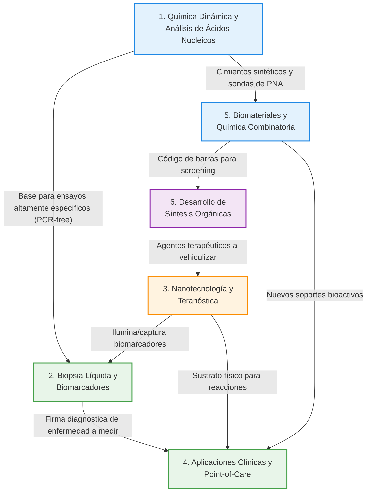

# Análisis de las Categorías e Intercorrelaciones en la Producción Científica

A continuación, se presenta la estratificación del trabajo investigador del profesor Juan José Díaz-Mochón en 6 categorías principales, destacando sus resultados clave y cómo se retroalimentan (intercorrelación) unas a otras.

### Grafo de Intercorrelaciones

---

### 1. Química Dinámica y Análisis de Ácidos Nucleicos (~25 Artículos | 2 Tesis)

Esta es el área fundacional del trabajo del profesor. Consiste en el uso de la química dinámica para la detección de ácidos nucleicos sin necesidad de enzimas (PCR-free).

*   **Resultados Clave:** Invención de la tecnología base de DESTINA Genomics, patentes sobre caracterización de nucleobases y sondas de PNA (*Peptide Nucleic Acids*).
*   **Intercorrelación:** Esta química básica es la "llave" que permite desarrollar los ensayos altamente específicos que luego se aplicarán en la biopsia líquida (Categoría 2). Además, aporta los cimientos sintéticos para la codificación PNA en química combinatoria (Categoría 5).

### 2. Biopsia Líquida y Biomarcadores (~20 Artículos | 2 Tesis)

El Dr. Mochón traslada sus descubrimientos químicos a muestras de fluidos biológicos (plasma, suero) para buscar firmas de enfermedades de forma no invasiva. Promotor y co-fundador de la *International Society of Liquid Biopsy (ISLB)*.

*   **Resultados Clave:** Detección directa de microRNAs (como el miR-122 para daño hepático y miR-21) y aislamiento de exosomas para oncología.
*   **Intercorrelación:** Utiliza la Química Dinámica para "leer" los biomarcadores, y se apoya en la Nanotecnología (Categoría 3) para "capturar" o "iluminar" (mediante fluoróforos) dichos marcadores en la sangre. Las firmas detectadas se aplican posteriormente en dispositivos portátiles (Categoría 4).

### 3. Nanotecnología y Teranóstica (~22 Artículos | 2 Tesis)

Desarrollo de materiales a nanoescala (nanosistemas duales, *Quantum Dots*, nanopartículas metalofluorescentes) que sirven tanto para terapia como para diagnóstico (Teranóstica).

*   **Resultados Clave:** Patentes sobre "Nanopartículas Funcionalizadas" (2023) y "Nanosistemas Multifuncionales para Teragnosis" (2018). Desarrollo de herramientas avanzadas de marcaje (*mass-tags*, fluoróforos) para Citometría de Masas y de Flujo.
*   **Intercorrelación:** Las nanopartículas actúan como el sustrato físico donde ocurren las reacciones de química dinámica, permitiendo su lectura en dispositivos *Point-of-Care* (Categoría 4). También actúan como vehículos de liberación de las pequeñas moléculas con actividad farmacológica (Categoría 6).

### 4. Aplicaciones Clínicas y Dispositivos Point-of-Care (~15 Artículos | 3 Tesis)

Toda la investigación converje en aplicaciones clínicas concretas y desarrollo de hardware/software de fácil uso para el diagnóstico de enfermedades y monitorización en el mismo lugar de atención al paciente (*Point-of-Care*).

*   **Resultados Clave:** Detección de *Leishmania* y SARS-CoV-2 mediante dispositivos acoplados a smartphones (CoVreader/CoVradar). Medición de la toxicidad hepática (DILI) por paracetamol en hospitales monitorizando el miR-122. Integración reciente de sondas químicas con la tecnología CRISPR-Cas13.
*   **Intercorrelación:** Es el destino final de las sondas diseñadas en Química Dinámica (1), amplificadas o soportadas por Nanotecnología (3) y estructuradas sobre Biomateriales (5). Recibe directamente los biomarcadores identificados en la Biopsia Líquida (2).

### 5. Biomateriales y Química Combinatoria (~15 Artículos | 3 Tesis)

Abarca el uso de metodologías de alto rendimiento (*High-Throughput*) y la síntesis química avanzada para crear herramientas de descubrimiento biológico y nuevos soportes físicos.

*   **Resultados Clave:** Diseño de librerías de péptidos codificadas con PNA (*split-and-mix*), desarrollo de *polymer microarrays* para explorar interacciones y morfología celular, y la creación de hidrogeles supramoleculares para vehiculización e ingeniería de tejidos.
*   **Intercorrelación:** Reutiliza el PNA (Categoría 1) pero con una finalidad distinta: servir como "código de barras" molecular para identificar rápidamente secuencias peptídicas o pequeñas moléculas (Categoría 6) con bioactividad o afinidad por ligandos. Estos biomateriales alimentan directamente la investigación en Aplicaciones Clínicas (Categoría 4).

### 6. Desarrollo de Síntesis Orgánicas (~10 Artículos | 1 Tesis)

Engloba la investigación en síntesis orgánica y química médica, un campo más amplio que incluye el desarrollo de metodologías novedosas para la creación de moléculas estructurales, así como el diseño y síntesis de pequeñas moléculas como potenciales fármacos.

*   **Resultados Clave:** Diseño de fármacos y estudios de reactividad. Un claro ejemplo del desarrollo de pequeñas moléculas como fármacos es la tesis de Álvaro Lorente: **"Design, synthesis and biological evaluation of 6-alkoxypurine derivatives as kinase inhibitors"** (2019). Otros ejemplos de metodologías eficientes incluyen: **An efficient one-pot synthesis of 6-alkoxy-8,9-dialkylpurines via reaction of 5-amino-4-chloro-6-alkylaminopyrimidines with N,N-dimethylalkaneamides and alkoxide ions**; **Full orthogonality between Dde and Fmoc: The direct synthesis of PNA-peptide conjugates**; **Regioselective one-pot synthesis of 9-alkyl-6-chloropyrido[3,2-e][1,2,4] triazolo-[4,3-a]pyrazines. Reactivity of aliphatic and aromatic hydrazides**; y **Symmetric 4,6-dialkyl/arylamino-5-nitropyrimidines: theoretical explanation of why aminolysis of alkoxy groups is favoured over chlorine aminolysis in nitro-activated pyrimidines**.
*   **Intercorrelación:** Proporciona las metodologías sintéticas fundamentales que alimentan la Química Combinatoria (Categoría 5) para la creación de librerías y *screening* de candidatos. Una vez identificados los compuestos líderes (pequeñas moléculas como potenciales fármacos) o sondas químicas, la Nanotecnología (Categoría 3) proporciona los nanosistemas óptimos para su vehiculización.
